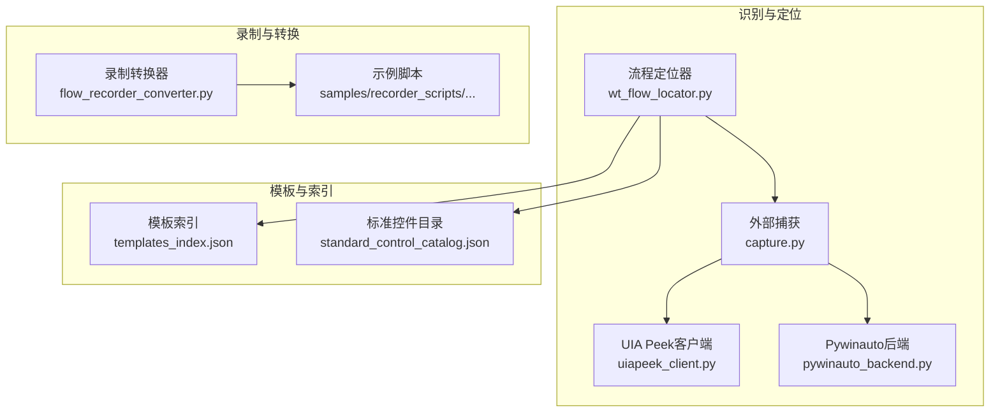
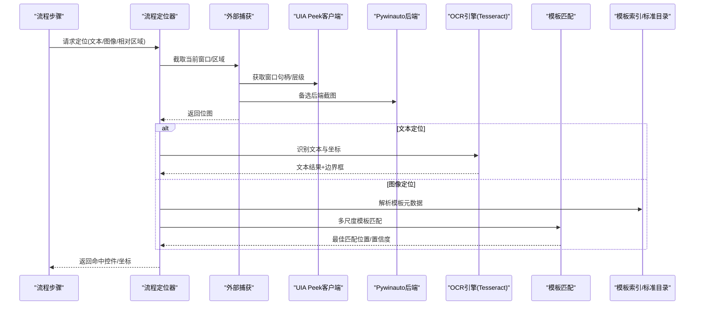
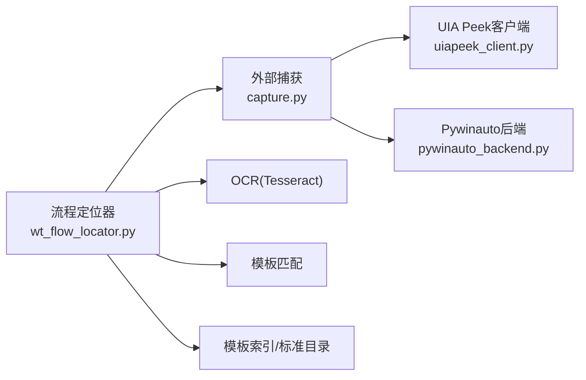

# 智能识别系统

<cite>
**本文引用的文件**   
- [README.md](file://README.md)
- [PROJECT_ARCHITECTURE.md](file://PROJECT_ARCHITECTURE.md)
- [build_image_template_library.py](file://build_image模板库生成器.py)
- [flow_recorder_converter.py](file://flow_recorder_converter.py)
- [wt_flow_locator.py](file://wt_flow_locator.py)
- [tools/external_capture/capture.py](file://tools/external_capture/capture.py)
- [tools/external_capture/uiapeek_client.py](file://tools/external_capture/uiapeek_client.py)
- [tools/external_capture/pywinauto_backend.py](file://tools/external_capture/pywinauto_backend.py)
- [image_templates/templates_index.json](file://image_templates/templates_index.json)
- [control_maps/standard_control_catalog.json](file://control_maps/standard_control_catalog.json)
- [samples/recorder_scripts/气象数据录入_20260625.py](file://samples/recorder_scripts/气象数据录入_20260625.py)
- [tests/test_image_matcher_multiscale.py](file://tests/test_image_matcher_multiscale.py)
- [tests/test_self_healing_locator.py](file://tests/test_self_healing_locator.py)
</cite>

## 目录
1. [简介](#简介)
2. [项目结构](#项目结构)
3. [核心组件](#核心组件)
4. [架构总览](#架构总览)
5. [详细组件分析](#详细组件分析)
6. [依赖关系分析](#依赖关系分析)
7. [性能考虑](#性能考虑)
8. [故障排查指南](#故障排查指南)
9. [结论](#结论)
10. [附录](#附录)

## 简介
本文件面向WT自动化框架的智能识别系统，聚焦以下目标：
- OCR文本识别的配置与使用（Tesseract引擎设置、多语言支持）
- 图像模板匹配的原理与实现（模板生成、匹配算法、精度优化）
- 图像模板库的管理与维护方法
- 录制转换器的实现原理（将录制的操作转换为可执行脚本）
- 识别精度的调优技巧与最佳实践
- 复杂UI识别场景的实际示例
- 识别系统的性能优化与缓存策略

## 项目结构
智能识别相关代码与资源主要分布在如下位置：
- 图像模板库与索引：image_templates/
- 控件映射与标准目录：control_maps/
- 外部捕获与定位后端：tools/external_capture/
- 录制转换器：flow_recorder_converter.py
- 流程定位器（含OCR与模板匹配调用点）：wt_flow_locator.py
- 测试用例：tests/ 下与图像匹配、自修复定位相关的测试

图表来源
- [wt_flow_locator.py](file://wt_flow_locator.py)
- [tools/external_capture/capture.py](file://tools/external_capture/capture.py)
- [tools/external_capture/uiapeek_client.py](file://tools/external_capture/uiapeek_client.py)
- [tools/external_capture/pywinauto_backend.py](file://tools/external_capture/pywinauto_backend.py)
- [image_templates/templates_index.json](file://image_templates/templates_index.json)
- [control_maps/standard_control_catalog.json](file://control_maps/standard_control_catalog.json)
- [flow_recorder_converter.py](file://flow_recorder_converter.py)
- [samples/recorder_scripts/气象数据录入_20260625.py](file://samples/recorder_scripts/气象数据录入_20260625.py)

章节来源
- [README.md](file://README.md)
- [PROJECT_ARCHITECTURE.md](file://PROJECT_ARCHITECTURE.md)

## 核心组件
- 流程定位器：负责在UI中查找目标控件或区域，内部集成OCR与图像模板匹配能力，并协调不同后端进行截图与窗口交互。
- 外部捕获模块：封装跨后端的屏幕截图与窗口信息获取，提供统一的截图接口供定位器使用。
- 模板索引与标准目录：集中管理图像模板元数据与标准控件目录，便于检索、版本化与复用。
- 录制转换器：将录制产物（如按键、鼠标事件序列）转换为结构化流程步骤，并可结合定位策略生成可执行脚本。
- 测试套件：覆盖多尺度模板匹配、自修复定位等关键路径，用于验证识别稳定性与鲁棒性。

章节来源
- [wt_flow_locator.py](file://wt_flow_locator.py)
- [tools/external_capture/capture.py](file://tools/external_capture/capture.py)
- [image_templates/templates_index.json](file://image_templates/templates_index.json)
- [control_maps/standard_control_catalog.json](file://control_maps/standard_control_catalog.json)
- [flow_recorder_converter.py](file://flow_recorder_converter.py)
- [tests/test_image_matcher_multiscale.py](file://tests/test_image_matcher_multiscale.py)
- [tests/test_self_healing_locator.py](file://tests/test_self_healing_locator.py)

## 架构总览
智能识别系统围绕“定位器”为核心，向上承接流程步骤，向下通过“外部捕获”统一获取屏幕内容，再经由“OCR/模板匹配”完成识别；同时借助“模板索引/标准目录”提升命中率与可维护性。

图表来源
- [wt_flow_locator.py](file://wt_flow_locator.py)
- [tools/external_capture/capture.py](file://tools/external_capture/capture.py)
- [tools/external_capture/uiapeek_client.py](file://tools/external_capture/uiapeek_client.py)
- [tools/external_capture/pywinauto_backend.py](file://tools/external_capture/pywinauto_backend.py)
- [image_templates/templates_index.json](file://image_templates/templates_index.json)
- [control_maps/standard_control_catalog.json](file://control_maps/standard_control_catalog.json)

## 详细组件分析

### OCR文本识别（Tesseract配置与多语言）
- 引擎与数据
  - 使用Tesseract作为OCR引擎，需安装对应语言包（tessdata），并在配置中指定语言列表与数据路径。
  - 建议为中文、英文及业务常用语种分别准备模型，按需加载以减少内存占用。
- 配置要点
  - 语言参数：根据界面语言选择单语或多语组合，避免不必要的语言混合导致识别变慢。
  - 预处理器：对截图进行二值化、去噪、对比度增强，有助于提高小字号与低对比度文本的识别率。
  - 输出格式：优先使用带边界框的结构化输出，便于后续点击与校验。
- 多语言支持
  - 按页面/窗口维度切换语言包，减少误识别。
  - 对混合语言界面采用分块识别策略，先按区域分类再识别。
- 常见问题
  - 字体过小、反色主题、高分屏缩放会导致识别失败，建议统一DPI与主题或使用矢量控件信息辅助定位。
  - 动态刷新频繁时，应增加重试与超时控制。

章节来源
- [tools/external_capture/capture.py](file://tools/external_capture/capture.py)
- [wt_flow_locator.py](file://wt_flow_locator.py)

### 图像模板匹配（原理、实现与精度优化）
- 原理
  - 基于像素相似度计算，在多尺度空间搜索候选区域，取最高置信度作为匹配结果。
  - 支持灰度/彩色模式、掩码过滤、阈值与NMS（非极大值抑制）去重。
- 实现要点
  - 多尺度匹配：对模板进行缩放金字塔搜索，适配分辨率变化与缩放差异。
  - 自适应阈值：根据背景复杂度动态调整阈值，降低误报。
  - 区域裁剪：结合窗口/控件边界缩小搜索范围，提升速度与准确率。
- 精度优化
  - 模板质量：选择稳定、高对比度、少装饰元素的区域作为模板。
  - 预处理：直方图均衡、边缘增强、抗锯齿处理。
  - 后处理：置信度排序、重复检测、时间一致性校验。
- 典型指标
  - 召回率/精确率、平均定位误差（像素）、匹配耗时。

章节来源
- [tests/test_image_matcher_multiscale.py](file://tests/test_image_matcher_multiscale.py)
- [wt_flow_locator.py](file://wt_flow_locator.py)

### 图像模板库管理与维护
- 组织方式
  - 模板文件按功能域分组存放，配合索引文件记录模板名称、尺寸、适用窗口/控件类型、版本等信息。
  - 标准控件目录集中定义通用控件的模板ID与语义标签，便于跨流程复用。
- 生命周期
  - 生成：从录制或手工标注导出模板，自动写入索引。
  - 校验：通过回归测试集验证模板在不同分辨率下的稳定性。
  - 更新：当UI变更时，增量替换模板并更新索引，保留历史版本以便回滚。
- 工具链
  - 提供批量构建脚本，扫描模板目录并生成/合并索引，确保索引与实际模板一致。

章节来源
- [image_templates/templates_index.json](file://image_templates/templates_index.json)
- [control_maps/standard_control_catalog.json](file://control_maps/standard_control_catalog.json)
- [build_image_template_library.py](file://build_image模板库生成器.py)

### 录制转换器（从录制到可执行脚本）
- 输入
  - 录制产物包含鼠标/键盘事件、窗口标题、时间戳、可选截图片段等。
- 转换流程
  - 解析录制事件序列，提取动作类型、目标窗口、坐标/文本等上下文。
  - 结合定位策略（文本/图像/相对位置）生成结构化步骤。
  - 输出为可执行的流程脚本或DSL，便于回放与二次编辑。
- 容错与健壮性
  - 对不稳定的绝对坐标进行相对化修正。
  - 对易变元素采用更稳健的定位（如标准控件目录中的模板ID）。
- 示例
  - 参考示例脚本，了解如何将一次“气象数据录入”的录制过程转换为可执行流程。

章节来源
- [flow_recorder_converter.py](file://flow_recorder_converter.py)
- [samples/recorder_scripts/气象数据录入_20260625.py](file://samples/recorder_scripts/气象数据录入_20260625.py)

### 复杂UI识别场景示例
- 多层级窗口嵌套
  - 先通过窗口标题/进程ID定位顶层窗口，再在子树中按控件类型或模板匹配定位目标。
- 动态内容区域
  - 使用相对区域定位（以某稳定锚点为基准）+ 局部模板匹配，避免全局匹配带来的不稳定。
- 高分屏与缩放
  - 启用多尺度匹配与DPI感知，必要时对截图进行归一化处理。
- 弱对比/反色主题
  - 引入预处理（反色恢复、对比度拉伸）与OCR/模板双通道定位，提高成功率。

章节来源
- [wt_flow_locator.py](file://wt_flow_locator.py)
- [tools/external_capture/capture.py](file://tools/external_capture/capture.py)
- [tests/test_self_healing_locator.py](file://tests/test_self_healing_locator.py)

## 依赖关系分析
- 组件耦合
  - 流程定位器对外暴露统一定位API，对内依赖外部捕获、OCR与模板匹配。
  - 外部捕获屏蔽UIA与Pywinauto差异，向上提供一致的截图与窗口信息接口。
- 外部依赖
  - Tesseract OCR引擎及其语言包
  - UIA Peek客户端（用于获取UIA树信息）
  - Pywinauto（作为备选后端）
- 潜在循环依赖
  - 定位器与外部捕获之间为单向依赖，无循环引用风险。

图表来源
- [wt_flow_locator.py](file://wt_flow_locator.py)
- [tools/external_capture/capture.py](file://tools/external_capture/capture.py)
- [tools/external_capture/uiapeek_client.py](file://tools/external_capture/uiapeek_client.py)
- [tools/external_capture/pywinauto_backend.py](file://tools/external_capture/pywinauto_backend.py)
- [image_templates/templates_index.json](file://image_templates/templates_index.json)
- [control_maps/standard_control_catalog.json](file://control_maps/standard_control_catalog.json)

章节来源
- [PROJECT_ARCHITECTURE.md](file://PROJECT_ARCHITECTURE.md)

## 性能考虑
- 截图与I/O
  - 限制截图区域，仅截取必要窗口/控件范围，减少传输与处理开销。
  - 复用已截取的图像缓存，避免重复截图。
- OCR优化
  - 按页面/窗口粒度加载语言包，避免一次性加载全部模型。
  - 对文本区域进行ROI裁剪与二值化，缩短识别时间。
- 模板匹配优化
  - 多尺度金字塔层数与步长可调，平衡精度与速度。
  - 使用灰度图与掩码减少无效像素计算。
  - 结合控件边界缩小搜索范围，显著降低匹配耗时。
- 缓存策略
  - 图像缓存：按窗口/区域哈希缓存最近截图，设置过期时间与失效条件（如窗口切换、滚动）。
  - 模板缓存：常驻内存加载高频模板，减少磁盘IO。
  - 结果缓存：对稳定控件的匹配结果短期缓存，加速连续操作。

[本节为通用性能指导，无需具体文件来源]

## 故障排查指南
- 常见症状
  - 定位失败：检查窗口是否被遮挡、DPI缩放是否异常、模板是否过期。
  - 识别错误：确认OCR语言包是否正确加载、文本区域是否被正确裁剪。
  - 性能退化：排查是否频繁全图匹配、是否存在未清理的缓存。
- 诊断步骤
  - 打印定位日志：包括截图尺寸、搜索区域、匹配阈值、置信度分布。
  - 回放中间截图：比对模板与目标区域的视觉差异。
  - 切换后端：在UIA与Pywinauto间切换，排除特定后端问题。
- 回归验证
  - 使用测试套件验证多尺度匹配与自修复定位的稳定性。

章节来源
- [tests/test_image_matcher_multiscale.py](file://tests/test_image_matcher_multiscale.py)
- [tests/test_self_healing_locator.py](file://tests/test_self_healing_locator.py)

## 结论
智能识别系统以“定位器”为核心，整合OCR与模板匹配两大能力，并通过外部捕获屏蔽底层差异，形成稳定高效的UI识别链路。配合模板库与标准目录的规范化管理，以及录制转换器的自动化产出，可在复杂UI场景中显著提升自动化覆盖率与稳定性。通过合理的性能优化与缓存策略，系统能够在保证精度的前提下满足大规模回归与持续集成的需求。

[本节为总结性内容，无需具体文件来源]

## 附录
- 术语
  - OCR：光学字符识别
  - UIA：Windows用户界面自动化
  - DPI：每英寸点数
- 参考
  - 项目总体架构说明与模块划分参见项目根文档。

章节来源
- [README.md](file://README.md)
- [PROJECT_ARCHITECTURE.md](file://PROJECT_ARCHITECTURE.md)