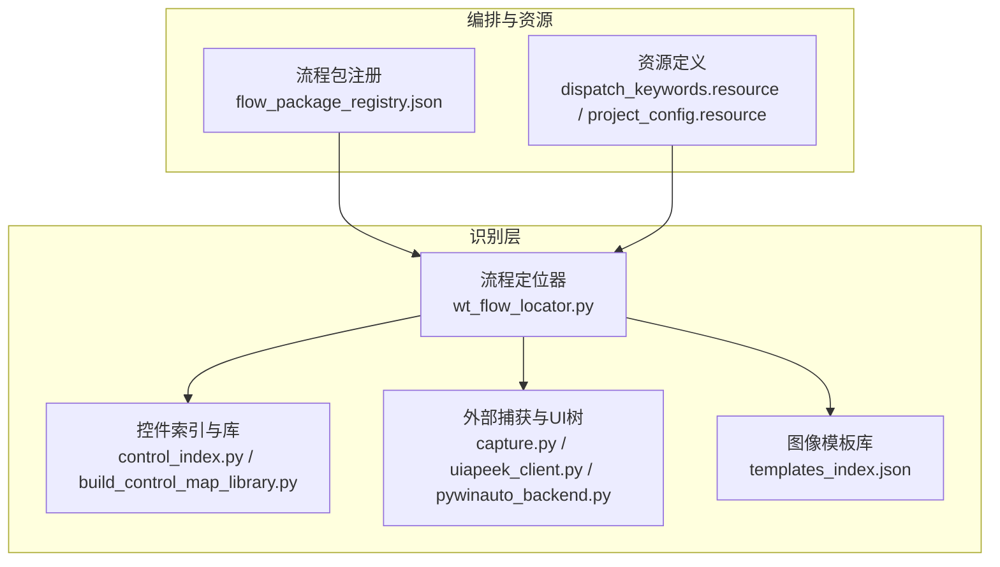
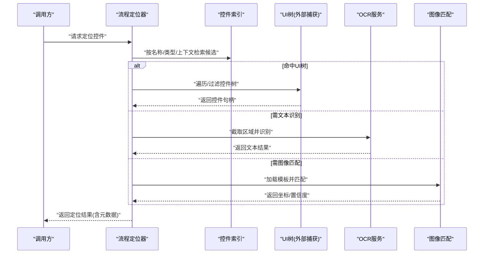
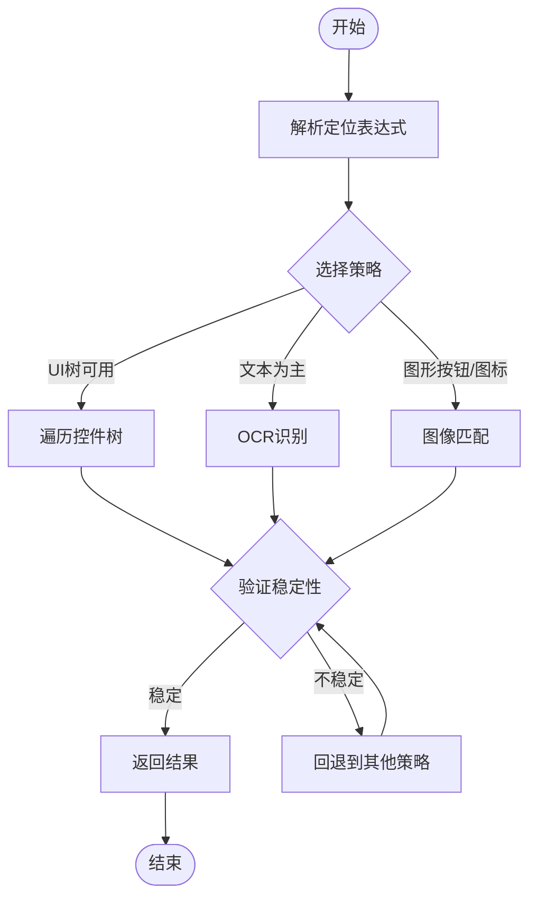
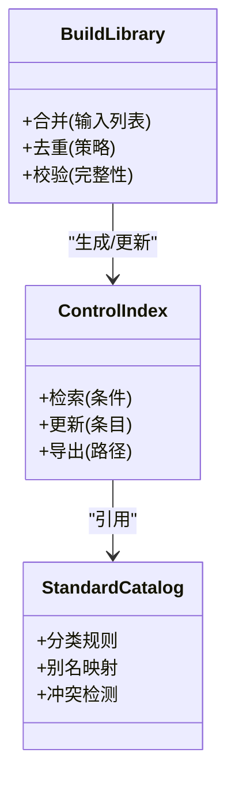
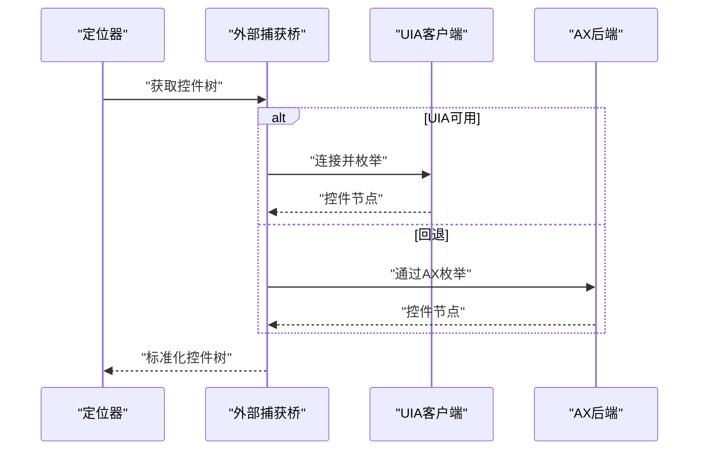
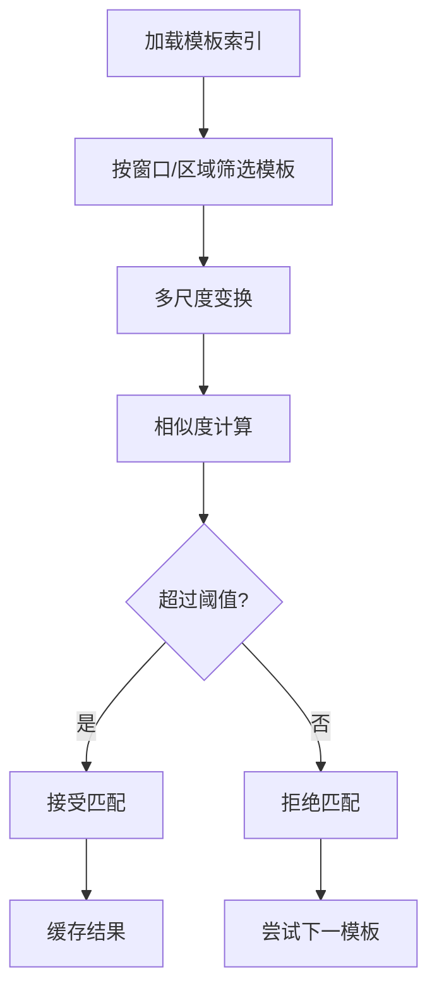
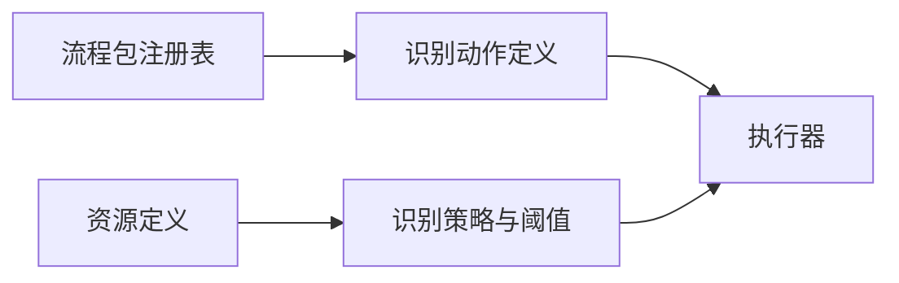
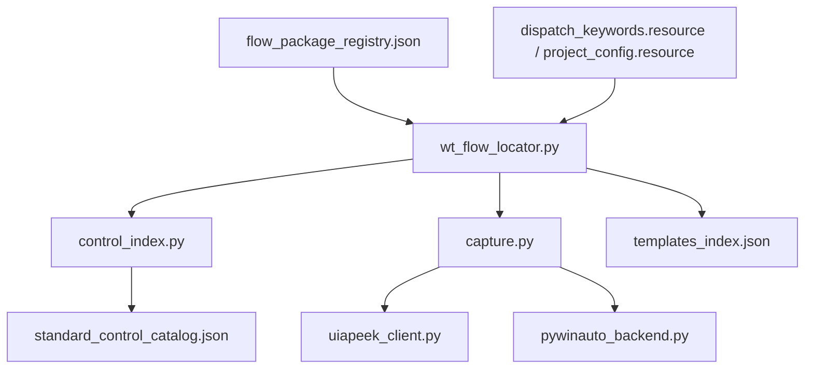

# 识别优化与调优

<cite>
**本文引用的文件**
- [wt_flow_locator.py](file://wt_flow_locator.py)
- [control_index.py](file://WT_AUTOMATION_Agent/control_index.py)
- [build_control_map_library.py](file://build_control_map_library.py)
- [test_image_matcher_multiscale.py](file://tests/test_image_matcher_multiscale.py)
- [test_self_healing_locator.py](file://tests/test_self_healing_locator.py)
- [tools/external_capture/capture.py](file://tools/external_capture/capture.py)
- [tools/external_capture/uiapeek_client.py](file://tools/external_capture/uiapeek_client.py)
- [tools/external_capture/pywinauto_backend.py](file://tools/external_capture/pywinauto_backend.py)
- [image_templates/WT_software_Images/templates_index.json](file://image_templates/WT_software_Images/templates_index.json)
- [control_maps/library_主面板_WPF_controls.json](file://control_maps/library_主面板_WPF_controls.json)
- [control_maps/standard_control_catalog.json](file://control_maps/standard_control_catalog.json)
- [flow_packages/flow_package_registry.json](file://flow_packages/flow_package_registry.json)
- [resources/dispatch_keywords.resource](file://resources/dispatch_keywords.resource)
- [resources/project_config.resource](file://resources/project_config.resource)
</cite>

## 目录
1. [引言](#引言)
2. [项目结构](#项目结构)
3. [核心组件](#核心组件)
4. [架构总览](#架构总览)
5. [详细组件分析](#详细组件分析)
6. [依赖关系分析](#依赖关系分析)
7. [性能考虑](#性能考虑)
8. [故障诊断指南](#故障诊断指南)
9. [结论](#结论)
10. [附录](#附录)

## 引言
本文件聚焦于WT自动化框架中的智能识别系统，围绕“精度评估、性能优化、技术选型、失败诊断、监控告警与持续改进”展开。目标读者既包括需要落地优化的工程师，也包括希望理解整体机制的测试与产品人员。文档通过代码级分析与可视化图示，帮助读者建立从指标到策略、从实现到运维的完整认知闭环。

## 项目结构
WT自动化框架在识别相关的关键位置如下：
- 定位与识别入口：流程定位器负责将高层定位描述转化为具体控件或图像匹配任务。
- 控件索引与库：集中管理控件元数据、模板映射与标准目录，支撑快速检索与自修复。
- 外部捕获与UI树：提供跨后端（UIA/AX）的窗口与控件树获取能力，辅助结构化定位。
- 图像模板库：按场景组织模板与索引，支持多尺度匹配与缓存。
- 流程包注册与资源：统一编排识别动作、关键词与项目配置。

图表来源
- [wt_flow_locator.py](file://wt_flow_locator.py)
- [control_index.py](file://WT_AUTOMATION_Agent/control_index.py)
- [build_control_map_library.py](file://build_control_map_library.py)
- [tools/external_capture/capture.py](file://tools/external_capture/capture.py)
- [tools/external_capture/uiapeek_client.py](file://tools/external_capture/uiapeek_client.py)
- [tools/external_capture/pywinauto_backend.py](file://tools/external_capture/pywinauto_backend.py)
- [image_templates/WT_software_Images/templates_index.json](file://image_templates/WT_software_Images/templates_index.json)
- [flow_packages/flow_package_registry.json](file://flow_packages/flow_package_registry.json)
- [resources/dispatch_keywords.resource](file://resources/dispatch_keywords.resource)
- [resources/project_config.resource](file://resources/project_config.resource)

章节来源
- [wt_flow_locator.py](file://wt_flow_locator.py)
- [control_index.py](file://WT_AUTOMATION_Agent/control_index.py)
- [build_control_map_library.py](file://build_control_map_library.py)
- [tools/external_capture/capture.py](file://tools/external_capture/capture.py)
- [tools/external_capture/uiapeek_client.py](file://tools/external_capture/uiapeek_client.py)
- [tools/external_capture/pywinauto_backend.py](file://tools/external_capture/pywinauto_backend.py)
- [image_templates/WT_software_Images/templates_index.json](file://image_templates/WT_software_Images/templates_index.json)
- [flow_packages/flow_package_registry.json](file://flow_packages/flow_package_registry.json)
- [resources/dispatch_keywords.resource](file://resources/dispatch_keywords.resource)
- [resources/project_config.resource](file://resources/project_config.resource)

## 核心组件
- 流程定位器：解析定位表达式，选择最优识别路径（UI树、OCR、图像匹配），并执行重试与回退。
- 控件索引与库：维护控件属性、模板ID、窗口上下文等元数据；提供快速检索与模糊匹配。
- 外部捕获与UI树：封装UIA/AX后端，提供稳定的控件树遍历与属性读取。
- 图像模板库：以JSON索引组织模板，支持多尺度匹配、阈值与区域裁剪。
- 流程包注册与资源：将识别动作与业务步骤解耦，便于扩展与复用。

章节来源
- [wt_flow_locator.py](file://wt_flow_locator.py)
- [control_index.py](file://WT_AUTOMATION_Agent/control_index.py)
- [build_control_map_library.py](file://build_control_map_library.py)
- [tools/external_capture/capture.py](file://tools/external_capture/capture.py)
- [tools/external_capture/uiapeek_client.py](file://tools/external_capture/uiapeek_client.py)
- [tools/external_capture/pywinauto_backend.py](file://tools/external_capture/pywinauto_backend.py)
- [image_templates/WT_software_Images/templates_index.json](file://image_templates/WT_software_Images/templates_index.json)
- [flow_packages/flow_package_registry.json](file://flow_packages/flow_package_registry.json)
- [resources/dispatch_keywords.resource](file://resources/dispatch_keywords.resource)
- [resources/project_config.resource](file://resources/project_config.resource)

## 架构总览
识别系统采用“分层+可插拔”的架构：上层由流程定位器驱动，根据上下文动态选择识别策略；中层为控件索引与模板库；底层为外部捕获与图像引擎。资源与注册表提供声明式配置，使识别行为可观测、可度量、可演进。

图表来源
- [wt_flow_locator.py](file://wt_flow_locator.py)
- [control_index.py](file://WT_AUTOMATION_Agent/control_index.py)
- [tools/external_capture/capture.py](file://tools/external_capture/capture.py)
- [tools/external_capture/uiapeek_client.py](file://tools/external_capture/uiapeek_client.py)
- [tools/external_capture/pywinauto_backend.py](file://tools/external_capture/pywinauto_backend.py)
- [image_templates/WT_software_Images/templates_index.json](file://image_templates/WT_software_Images/templates_index.json)

## 详细组件分析

### 定位器与自修复策略
- 定位器优先使用结构化信息（UI树/控件索引），当不稳定时自动降级至OCR或图像匹配。
- 引入自修复：对常见漂移（标题变化、布局微调）进行容错与回退，提升鲁棒性。
- 关键测试覆盖：针对多尺度图像匹配与自修复定位的回归用例。

图表来源
- [wt_flow_locator.py](file://wt_flow_locator.py)
- [test_self_healing_locator.py](file://tests/test_self_healing_locator.py)
- [test_image_matcher_multiscale.py](file://tests/test_image_matcher_multiscale.py)

章节来源
- [wt_flow_locator.py](file://wt_flow_locator.py)
- [test_self_healing_locator.py](file://tests/test_self_healing_locator.py)
- [test_image_matcher_multiscale.py](file://tests/test_image_matcher_multiscale.py)

### 控件索引与标准目录
- 控件索引以JSON形式存储控件元数据（名称、类型、窗口、模板ID等），支持快速检索与模糊匹配。
- 标准控制目录用于统一命名与分类，降低误报与歧义。
- 构建脚本可将录制产物合并为标准库，便于版本化与共享。

图表来源
- [control_index.py](file://WT_AUTOMATION_Agent/control_index.py)
- [build_control_map_library.py](file://build_control_map_library.py)
- [control_maps/standard_control_catalog.json](file://control_maps/standard_control_catalog.json)
- [control_maps/library_主面板_WPF_controls.json](file://control_maps/library_主面板_WPF_controls.json)

章节来源
- [control_index.py](file://WT_AUTOMATION_Agent/control_index.py)
- [build_control_map_library.py](file://build_control_map_library.py)
- [control_maps/standard_control_catalog.json](file://control_maps/standard_control_catalog.json)
- [control_maps/library_主面板_WPF_controls.json](file://control_maps/library_主面板_WPF_controls.json)

### 外部捕获与UI树后端
- 提供统一的UI树访问接口，屏蔽UIA/AX差异，增强兼容性。
- 支持窗口枚举、控件遍历、属性读取与事件监听，为定位器提供稳定数据结构。

图表来源
- [tools/external_capture/capture.py](file://tools/external_capture/capture.py)
- [tools/external_capture/uiapeek_client.py](file://tools/external_capture/uiapeek_client.py)
- [tools/external_capture/pywinauto_backend.py](file://tools/external_capture/pywinauto_backend.py)

章节来源
- [tools/external_capture/capture.py](file://tools/external_capture/capture.py)
- [tools/external_capture/uiapeek_client.py](file://tools/external_capture/uiapeek_client.py)
- [tools/external_capture/pywinauto_backend.py](file://tools/external_capture/pywinauto_backend.py)

### 图像模板库与多尺度匹配
- 模板索引以JSON组织，包含模板路径、尺寸、适用窗口与匹配参数。
- 多尺度匹配提升在不同分辨率与缩放下的稳定性。
- 建议结合区域裁剪与阈值策略，减少误报。

图表来源
- [image_templates/WT_software_Images/templates_index.json](file://image_templates/WT_software_Images/templates_index.json)
- [test_image_matcher_multiscale.py](file://tests/test_image_matcher_multiscale.py)

章节来源
- [image_templates/WT_software_Images/templates_index.json](file://image_templates/WT_software_Images/templates_index.json)
- [test_image_matcher_multiscale.py](file://tests/test_image_matcher_multiscale.py)

### 流程包注册与资源调度
- 流程包注册表集中管理识别动作与步骤定义，便于组合与复用。
- 资源文件定义关键词映射与项目级配置，影响识别优先级与回退顺序。

图表来源
- [flow_packages/flow_package_registry.json](file://flow_packages/flow_package_registry.json)
- [resources/dispatch_keywords.resource](file://resources/dispatch_keywords.resource)
- [resources/project_config.resource](file://resources/project_config.resource)

章节来源
- [flow_packages/flow_package_registry.json](file://flow_packages/flow_package_registry.json)
- [resources/dispatch_keywords.resource](file://resources/dispatch_keywords.resource)
- [resources/project_config.resource](file://resources/project_config.resource)

## 依赖关系分析
- 定位器依赖控件索引、外部捕获与图像模板库，形成松耦合的识别管线。
- 控件索引与标准目录相互依赖，确保命名一致性与冲突检测。
- 外部捕获后端抽象了UIA/AX差异，降低平台适配成本。
- 流程包注册与资源文件为识别策略提供声明式配置，避免硬编码。

图表来源
- [wt_flow_locator.py](file://wt_flow_locator.py)
- [control_index.py](file://WT_AUTOMATION_Agent/control_index.py)
- [tools/external_capture/capture.py](file://tools/external_capture/capture.py)
- [tools/external_capture/uiapeek_client.py](file://tools/external_capture/uiapeek_client.py)
- [tools/external_capture/pywinauto_backend.py](file://tools/external_capture/pywinauto_backend.py)
- [image_templates/WT_software_Images/templates_index.json](file://image_templates/WT_software_Images/templates_index.json)
- [control_maps/standard_control_catalog.json](file://control_maps/standard_control_catalog.json)
- [flow_packages/flow_package_registry.json](file://flow_packages/flow_package_registry.json)
- [resources/dispatch_keywords.resource](file://resources/dispatch_keywords.resource)
- [resources/project_config.resource](file://resources/project_config.resource)

章节来源
- [wt_flow_locator.py](file://wt_flow_locator.py)
- [control_index.py](file://WT_AUTOMATION_Agent/control_index.py)
- [tools/external_capture/capture.py](file://tools/external_capture/capture.py)
- [tools/external_capture/uiapeek_client.py](file://tools/external_capture/uiapeek_client.py)
- [tools/external_capture/pywinauto_backend.py](file://tools/external_capture/pywinauto_backend.py)
- [image_templates/WT_software_Images/templates_index.json](file://image_templates/WT_software_Images/templates_index.json)
- [control_maps/standard_control_catalog.json](file://control_maps/standard_control_catalog.json)
- [flow_packages/flow_package_registry.json](file://flow_packages/flow_package_registry.json)
- [resources/dispatch_keywords.resource](file://resources/dispatch_keywords.resource)
- [resources/project_config.resource](file://resources/project_config.resource)

## 性能考虑
- 缓存机制
  - 模板与匹配结果缓存：按窗口/区域/模板ID维度缓存，避免重复计算。
  - UI树缓存：在短时间窗口内复用已枚举的控件树，减少后端开销。
- 并行处理
  - 多窗口并发：对不同窗口的识别任务并行执行，注意线程安全与资源隔离。
  - 多尺度并行：对同一模板的多尺度匹配可并行，但需限制并发度以避免内存峰值。
- 资源管理
  - 图像与模型对象生命周期管理，及时释放大对象。
  - 控制后端连接池，避免频繁创建销毁UIA/AX连接。
- 识别策略优先级
  - 优先结构化（UI树/控件索引），其次OCR，最后图像匹配，以降低不确定性。
- 阈值与裁剪
  - 合理设置匹配阈值与区域裁剪范围，减少无效扫描。

[本节为通用指导，不直接分析具体文件]

## 故障诊断指南
- 日志分析
  - 记录每次定位的策略选择、耗时、命中/未命中原因与回退路径。
  - 输出关键中间状态（如OCR文本片段、匹配得分分布）。
- 可视化调试
  - 保存截图与匹配框，标注候选区域与最终命中点，便于人工复核。
- 性能监控
  - 统计各策略命中率、平均耗时、超时率与失败模式。
  - 对热点模板与高频控件建立专项看板。
- 常见问题定位
  - 标题漂移：检查控件索引别名与模糊匹配规则。
  - 分辨率变化：调整多尺度范围与阈值。
  - 动态内容：引入时序校验与二次确认逻辑。

章节来源
- [test_self_healing_locator.py](file://tests/test_self_healing_locator.py)
- [test_image_matcher_multiscale.py](file://tests/test_image_matcher_multiscale.py)

## 结论
通过“结构化优先、多策略融合、强缓存与并行、严格指标与监控”的方法论，WT自动化框架的智能识别系统在复杂UI环境下具备高鲁棒性与可扩展性。建议以标准目录与模板库为抓手，持续沉淀高质量素材与规则，并以指标驱动迭代优化。

[本节为总结性内容，不直接分析具体文件]

## 附录

### 识别精度评估指标与测试方法
- 准确率（Precision）= 正确命中数 / 所有命中数
- 召回率（Recall）= 正确命中数 / 所有应命中数
- 误报率（False Positive Rate）= 错误命中数 / 所有非目标命中机会
- 测试方法
  - 构造黄金集：覆盖典型窗口、控件、分辨率与主题。
  - 分策略评测：分别统计UI树、OCR、图像匹配的指标。
  - 回归测试：在变更前后对比指标，设定阈值门限。

[本节为通用指导，不直接分析具体文件]

### 不同识别技术的适用场景与选择原则
- UI树解析
  - 适用：结构化控件、属性丰富、稳定性高的界面。
  - 原则：优先使用，辅以别名与模糊匹配。
- OCR
  - 适用：纯文本显示、无控件语义的场景。
  - 原则：限定区域、语言包与字体优化，配合阈值与时序校验。
- 图像匹配
  - 适用：图标、按钮、复杂图形元素。
  - 原则：多尺度、模板质量与背景一致性，必要时结合区域裁剪。

[本节为通用指导，不直接分析具体文件]

### 实际优化案例
- 高并发场景
  - 问题：多窗口同时识别导致UIA/AX连接争用与超时。
  - 方案：连接池+任务队列+并发上限控制；热点模板预加载与缓存。
- 大规模控件库
  - 问题：索引过大导致检索慢与误报增多。
  - 方案：分层索引（窗口→类别→控件）、别名归一化、冲突检测与去重。
- 复杂UI环境
  - 问题：动态标题、主题切换与分辨率变化。
  - 方案：多策略回退、多尺度匹配、阈值自适应与可视化复核。

[本节为通用指导，不直接分析具体文件]

### 监控与告警机制
- 指标采集
  - 命中率、召回率、误报率、平均耗时、超时率、失败模式分布。
- 告警规则
  - 指标跌破阈值、失败模式突增、模板缺失或过期。
- 持续改进
  - 定期复盘失败样本，补充模板与别名；滚动发布新索引与策略。

[本节为通用指导，不直接分析具体文件]