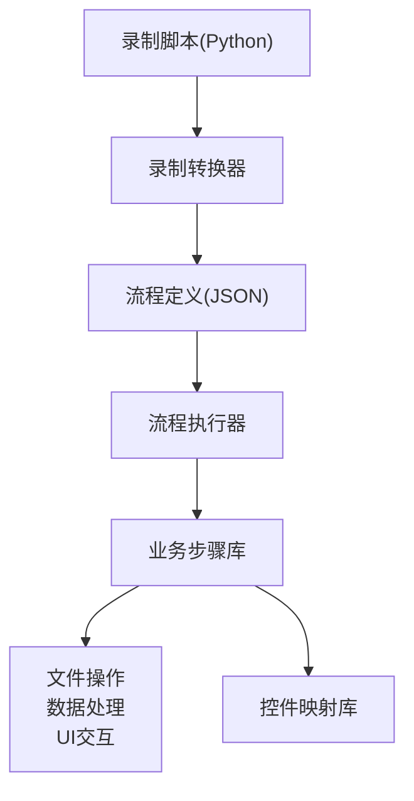
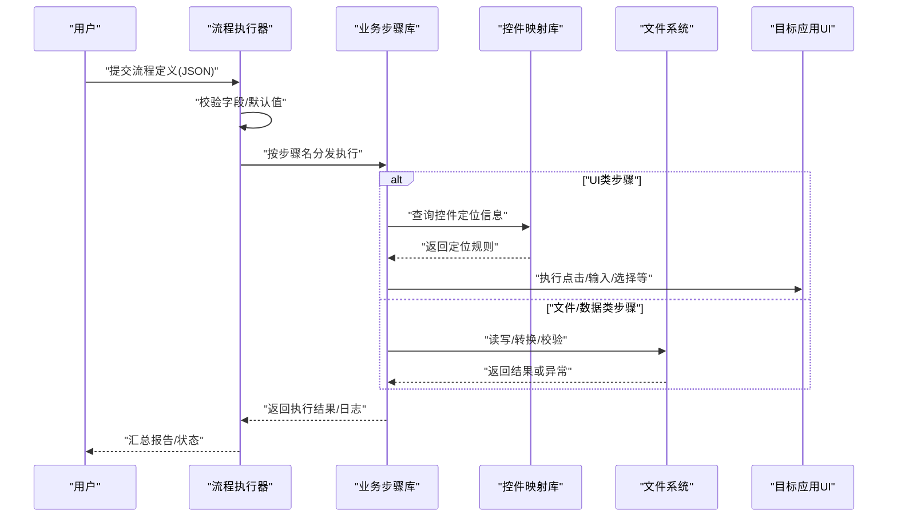
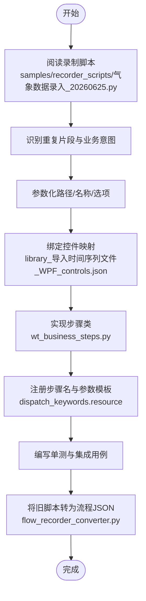
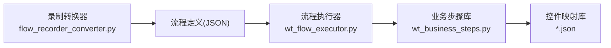

# 业务步骤概念

<cite>
**本文引用的文件**   
- [wt_business_steps.py](file://wt_business_steps.py)
- [wt_flow_executor.py](file://wt_flow_executor.py)
- [flow_excel_io.py](file://flow_excel_io.py)
- [flow_recorder_converter.py](file://flow_recorder_converter.py)
- [samples/flows/flow_definition_新建风机类型.json](file://samples/flows/flow_definition_新建风机类型.json)
- [samples/flows/flow_definition_gm_sample.json](file://samples/flows/flow_definition_gm_sample.json)
- [samples/recorder_scripts/气象数据录入_20260625.py](file://samples/recorder_scripts/气象数据录入_20260625.py)
- [resources/dispatch_keywords.resource](file://resources/dispatch_keywords.resource)
- [resources/project_config.resource](file://resources/project_config.resource)
- [control_maps/library_打开_Win32_controls.json](file://control_maps/library_打开_Win32_controls.json)
- [control_maps/library_保存_WPF_controls.json](file://control_maps/library_保存_WPF_controls.json)
- [control_maps/library_导入时间序列文件_WPF_controls.json](file://control_maps/library_导入时间序列文件_WPF_controls.json)
- [docs/WT_步骤新增填写规范.md](file://docs/WT_步骤新增填写规范.md)
</cite>

## 目录
1. [简介](#简介)
2. [项目结构](#项目结构)
3. [核心组件](#核心组件)
4. [架构总览](#架构总览)
5. [详细组件分析](#详细组件分析)
6. [依赖关系分析](#依赖关系分析)
7. [性能考虑](#性能考虑)
8. [故障排查指南](#故障排查指南)
9. [结论](#结论)
10. [附录](#附录)

## 简介
本文件聚焦于WT自动化框架中的“业务步骤”概念与封装模式，解释其与传统自动化动作的差异、语义化与可复用性的设计理念，并系统介绍内置业务步骤库的分类与用法、自定义步骤的开发流程（继承、参数定义、错误处理）、注册机制与版本管理策略。同时提供从现有脚本提取业务逻辑并封装为可复用步骤的实战示例，以及组合模式与最佳实践，帮助用户构建模块化的自动化解决方案。

## 项目结构
WT自动化框架围绕“流程驱动+步骤执行”的组织方式展开：
- 业务流程以JSON定义，描述步骤序列与参数；
- 执行器负责解析流程、定位并调用具体步骤实现；
- 业务步骤按领域分类组织，覆盖文件操作、数据处理、UI交互等常见场景；
- 控件映射库提供跨窗口/控件的稳定定位信息，支撑UI类步骤的健壮性；
- 录制转换工具将录制脚本转换为标准化流程，便于后续提炼为业务步骤。

图表来源
- [wt_flow_executor.py](file://wt_flow_executor.py)
- [wt_business_steps.py](file://wt_business_steps.py)
- [flow_recorder_converter.py](file://flow_recorder_converter.py)
- [control_maps/library_打开_Win32_controls.json](file://control_maps/library_打开_Win32_controls.json)

章节来源
- [wt_flow_executor.py](file://wt_flow_executor.py)
- [wt_business_steps.py](file://wt_business_steps.py)
- [flow_recorder_converter.py](file://flow_recorder_converter.py)

## 核心组件
- 流程执行器：负责加载流程定义、校验字段、分发到对应步骤处理器，并统一记录运行结果与异常。
- 业务步骤库：按功能域组织的具体步骤实现，提供高内聚、低耦合的业务能力。
- 控件映射库：集中维护控件识别特征与相对定位规则，提升UI步骤的稳定性与可移植性。
- 录制转换器：将录制产物转换为标准流程，辅助从既有脚本中提炼业务步骤。

章节来源
- [wt_flow_executor.py](file://wt_flow_executor.py)
- [wt_business_steps.py](file://wt_business_steps.py)
- [flow_recorder_converter.py](file://flow_recorder_converter.py)

## 架构总览
下图展示从流程定义到步骤执行的端到端路径，以及关键外部资源（控件映射、关键字配置）的参与点。

图表来源
- [wt_flow_executor.py](file://wt_flow_executor.py)
- [wt_business_steps.py](file://wt_business_steps.py)
- [control_maps/library_打开_Win32_controls.json](file://control_maps/library_打开_Win32_controls.json)

## 详细组件分析

### 业务步骤与传统自动化动作的区别
- 语义化表达：业务步骤以领域语言命名与描述，强调“做什么”，而非“怎么做”。例如“导入时间序列文件”比“点击菜单-选择文件-确认”更具可读性与可维护性。
- 可复用性：同一业务步骤可在多个流程中复用，避免重复实现与漂移风险。
- 容错与自愈：通过控件映射与重试策略，降低UI不稳定带来的失败率。
- 可观测性：统一的日志与断言输出，便于问题定位与回归分析。

章节来源
- [docs/WT_步骤新增填写规范.md](file://docs/WT_步骤新增填写规范.md)

### 内置业务步骤库：功能分类与使用方法
- 文件操作类
  - 典型能力：读取/写入CSV/Excel、批量重命名、校验文件存在与格式。
  - 使用要点：明确输入输出路径、编码、分隔符、表头约定；对大文件采用流式处理与分块读取。
  - 参考实现位置：[flow_excel_io.py](file://flow_excel_io.py)
- 数据处理类
  - 典型能力：列映射、缺失值填充、数值归一化、统计摘要生成。
  - 使用要点：定义清晰的列别名与数据类型；在步骤中保留原始列以便溯源。
  - 参考实现位置：[flow_excel_io.py](file://flow_excel_io.py)
- UI交互类
  - 典型能力：打开/保存、选择下拉项、输入日期时间、点击按钮、等待就绪。
  - 使用要点：结合控件映射库进行稳定定位；对动态区域采用相对坐标与锚点；必要时增加重试与超时控制。
  - 参考实现位置：[wt_business_steps.py](file://wt_business_steps.py)、[control_maps/library_打开_Win32_controls.json](file://control_maps/library_打开_Win32_controls.json)、[control_maps/library_保存_WPF_controls.json](file://control_maps/library_保存_WPF_controls.json)、[control_maps/library_导入时间序列文件_WPF_controls.json](file://control_maps/library_导入时间序列文件_WPF_controls.json)

章节来源
- [flow_excel_io.py](file://flow_excel_io.py)
- [wt_business_steps.py](file://wt_business_steps.py)
- [control_maps/library_打开_Win32_controls.json](file://control_maps/library_打开_Win32_controls.json)
- [control_maps/library_保存_WPF_controls.json](file://control_maps/library_保存_WPF_controls.json)
- [control_maps/library_导入时间序列文件_WPF_controls.json](file://control_maps/library_导入时间序列文件_WPF_controls.json)

### 自定义业务步骤开发流程
- 步骤类继承
  - 建议基于统一的基类或接口扩展，确保一致的初始化、参数校验、日志与异常上报。
  - 参考入口与注册点：[wt_business_steps.py](file://wt_business_steps.py)
- 参数定义
  - 使用声明式参数模型，包含必填/可选、默认值、类型约束与取值范围。
  - 建议在步骤文档中说明每个参数的业务含义与示例。
- 错误处理
  - 区分可恢复错误（如网络抖动、UI未就绪）与不可恢复错误（参数非法、文件不存在）。
  - 对UI类步骤引入重试、超时与截图/上下文快照，便于排障。
- 单元测试与回归
  - 为每个步骤编写最小用例，覆盖正常路径与边界条件。
  - 使用固定样本数据与Mock控件映射，保证测试稳定性。

章节来源
- [wt_business_steps.py](file://wt_business_steps.py)
- [docs/WT_步骤新增填写规范.md](file://docs/WT_步骤新增填写规范.md)

### 业务步骤的注册机制与版本管理
- 注册机制
  - 步骤名到实现的映射由注册中心维护，支持按类别分组与按需加载。
  - 关键字资源文件用于对外暴露步骤名与参数模板，便于非技术人员编辑流程。
  - 参考位置：[resources/dispatch_keywords.resource](file://resources/dispatch_keywords.resource)
- 版本管理
  - 步骤实现应标注兼容版本与弃用标记，执行器在运行时进行兼容性检查。
  - 流程定义中包含步骤版本约束，升级时保持向后兼容或提供迁移脚本。
  - 参考位置：[resources/project_config.resource](file://resources/project_config.resource)

章节来源
- [resources/dispatch_keywords.resource](file://resources/dispatch_keywords.resource)
- [resources/project_config.resource](file://resources/project_config.resource)

### 从现有脚本提取业务逻辑并封装为步骤
- 识别原子业务：从录制脚本中抽取“打开-选择-输入-确认”等高频片段，抽象为“导入时间序列文件”“创建风机类型”等步骤。
- 参数化：将硬编码路径、文件名、选项抽离为步骤参数，形成可配置的数据驱动。
- 稳定性增强：引入控件映射与相对定位，减少因界面微调导致的失败。
- 回归验证：将原脚本的关键断言下沉到步骤内部，确保行为一致。

图表来源
- [samples/recorder_scripts/气象数据录入_20260625.py](file://samples/recorder_scripts/气象数据录入_20260625.py)
- [control_maps/library_导入时间序列文件_WPF_controls.json](file://control_maps/library_导入时间序列文件_WPF_controls.json)
- [wt_business_steps.py](file://wt_business_steps.py)
- [resources/dispatch_keywords.resource](file://resources/dispatch_keywords.resource)
- [flow_recorder_converter.py](file://flow_recorder_converter.py)

章节来源
- [samples/recorder_scripts/气象数据录入_20260625.py](file://samples/recorder_scripts/气象数据录入_20260625.py)
- [flow_recorder_converter.py](file://flow_recorder_converter.py)

### 组合模式与最佳实践
- 组合模式
  - 将复杂流程拆分为多步子流程，通过“顺序/并行/条件/循环”组合，提高可读性与复用度。
  - 参考流程样例：[samples/flows/flow_definition_新建风机类型.json](file://samples/flows/flow_definition_新建风机类型.json)、[samples/flows/flow_definition_gm_sample.json](file://samples/flows/flow_definition_gm_sample.json)
- 最佳实践
  - 单一职责：每个步骤只做一件事，且可独立测试。
  - 幂等设计：重复执行不产生副作用或可回滚。
  - 显式依赖：步骤间通过输入输出契约传递数据，避免隐式共享状态。
  - 可观测性：统一日志级别、结构化输出与关键指标。
  - 渐进演进：先实现最小可用版本，再逐步增强健壮性与性能。

章节来源
- [samples/flows/flow_definition_新建风机类型.json](file://samples/flows/flow_definition_新建风机类型.json)
- [samples/flows/flow_definition_gm_sample.json](file://samples/flows/flow_definition_gm_sample.json)

## 依赖关系分析
- 执行器与步骤库：执行器仅依赖步骤名与参数契约，不感知具体实现细节，解耦良好。
- 步骤库与控件映射：UI类步骤强依赖控件映射库，需关注映射更新与兼容性。
- 录制转换器与流程定义：转换器产出标准JSON，供执行器直接消费，形成闭环。

图表来源
- [wt_flow_executor.py](file://wt_flow_executor.py)
- [wt_business_steps.py](file://wt_business_steps.py)
- [flow_recorder_converter.py](file://flow_recorder_converter.py)
- [control_maps/library_打开_Win32_controls.json](file://control_maps/library_打开_Win32_controls.json)

章节来源
- [wt_flow_executor.py](file://wt_flow_executor.py)
- [wt_business_steps.py](file://wt_business_steps.py)
- [flow_recorder_converter.py](file://flow_recorder_converter.py)

## 性能考虑
- I/O优化：对大文件采用流式读写与增量处理，避免一次性加载至内存。
- UI稳定性：合理设置超时与重试次数，减少无效等待；优先使用控件映射与相对定位。
- 并发与批处理：对无状态步骤可考虑并行执行，但需注意资源竞争与顺序依赖。
- 缓存与复用：对昂贵计算或远程请求引入缓存层，缩短端到端耗时。

## 故障排查指南
- 常见问题
  - 控件定位失败：核对控件映射是否最新，检查窗口标题/进程ID/层级变化。
  - 参数校验失败：对照步骤参数模板与必填项，确认类型与取值范围。
  - 文件路径/权限问题：确认路径存在、编码正确、权限充足。
- 定位手段
  - 启用详细日志与截图快照，结合执行器报告快速定位失败节点。
  - 使用录制转换器回放流程，对比预期与实际差异。
- 修复建议
  - 更新控件映射库，补充新控件特征；
  - 为易变UI增加重试与降级策略；
  - 对关键步骤增加前置校验与后置断言。

章节来源
- [wt_flow_executor.py](file://wt_flow_executor.py)
- [wt_business_steps.py](file://wt_business_steps.py)
- [control_maps/library_打开_Win32_controls.json](file://control_maps/library_打开_Win32_controls.json)

## 结论
业务步骤是WT自动化框架实现“语义化、可复用、可维护”的核心载体。通过将传统细粒度动作封装为面向领域的步骤，并结合控件映射、注册机制与版本管理，能够显著提升自动化工程的稳定性与交付效率。遵循组合模式与最佳实践，可进一步构建模块化、可扩展的自动化解决方案。

## 附录
- 相关规范与样例
  - 步骤新增填写规范：[docs/WT_步骤新增填写规范.md](file://docs/WT_步骤新增填写规范.md)
  - 流程样例：[samples/flows/flow_definition_新建风机类型.json](file://samples/flows/flow_definition_新建风机类型.json)、[samples/flows/flow_definition_gm_sample.json](file://samples/flows/flow_definition_gm_sample.json)
  - 录制脚本样例：[samples/recorder_scripts/气象数据录入_20260625.py](file://samples/recorder_scripts/气象数据录入_20260625.py)