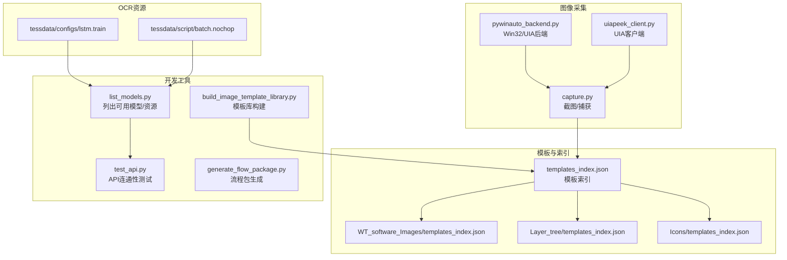
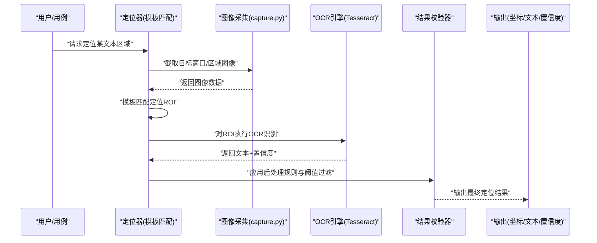
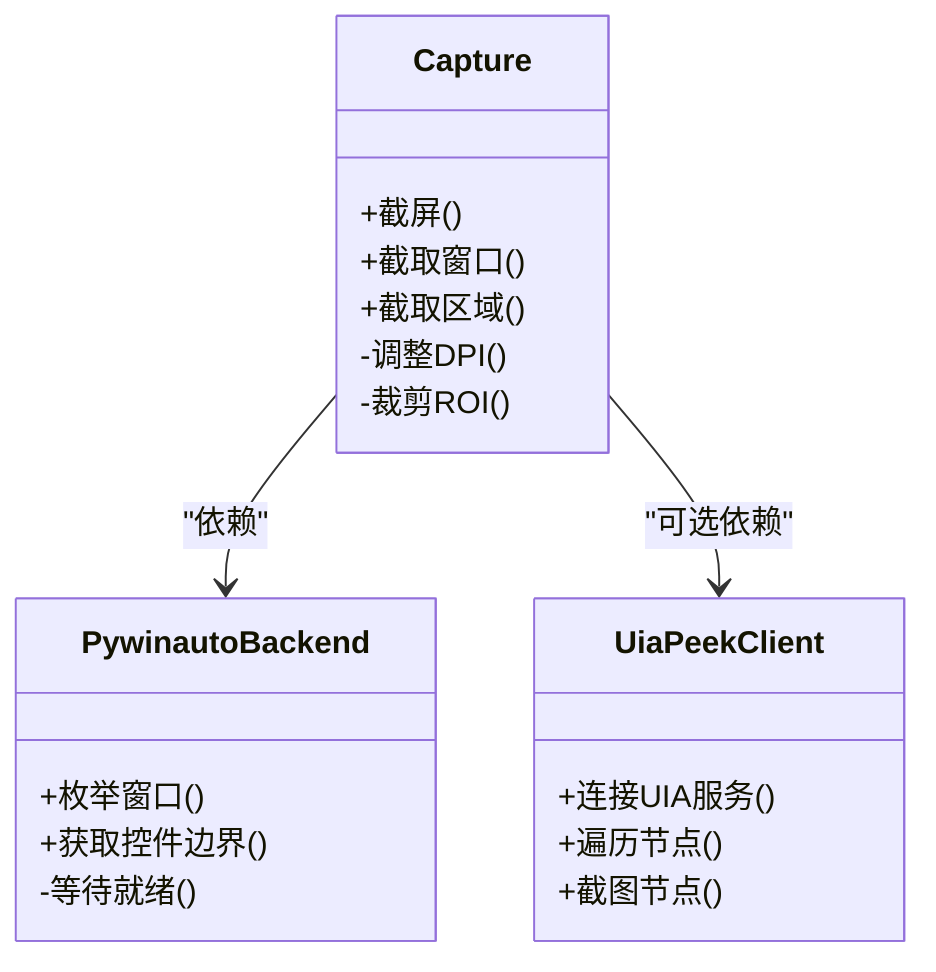
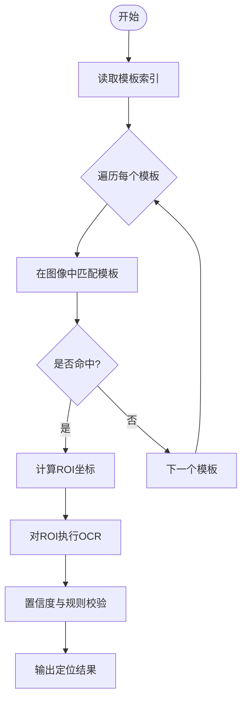
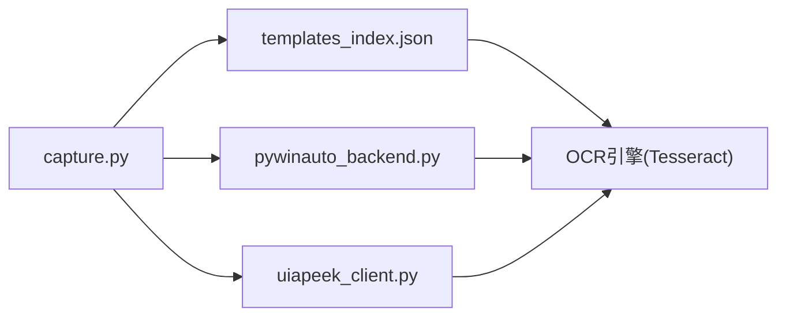

# OCR文本定位

<cite>
**本文引用的文件**   
- [PROJECT_ARCHITECTURE.md](file://PROJECT_ARCHITECTURE.md)
- [README.md](file://README.md)
- [tools/external_capture/capture.py](file://tools/external_capture/capture.py)
- [tools/external_capture/pywinauto_backend.py](file://tools/external_capture/pywinauto_backend.py)
- [tools/external_capture/uiapeek_client.py](file://tools/external_capture/uiapeek_client.py)
- [tools/dev_utils/list_models.py](file://tools/dev_utils/list_models.py)
- [tools/dev_utils/test_api.py](file://tools/dev_utils/test_api.py)
- [tools/generate_flow_package.py](file://tools/generate_flow_package.py)
- [build_image_template_library.py](file://build_image_template_library.py)
- [image_templates/templates_index.json](file://image_templates/templates_index.json)
- [image_templates/WT_software_Images/templates_index.json](file://image_templates/WT_software_Images/templates_index.json)
- [image_templates/Layer_tree/templates_index.json](file://image_templates/Layer_tree/templates_index.json)
- [image_templates/Icons/templates_index.json](file://image_templates/Icons/templates_index.json)
- [tools/ORC/tessdata/configs/lstm.train](file://tools/ORC/tessdata/configs/lstm.train)
- [tools/ORC/tessdata/script/batch.nochop](file://tools/ORC/tessdata/script/batch.nochop)
</cite>

## 目录
1. [简介](#简介)
2. [项目结构](#项目结构)
3. [核心组件](#核心组件)
4. [架构总览](#架构总览)
5. [详细组件分析](#详细组件分析)
6. [依赖关系分析](#依赖关系分析)
7. [性能考虑](#性能考虑)
8. [故障排查指南](#故障排查指南)
9. [结论](#结论)
10. [附录](#附录)

## 简介
本文件面向在自动化测试与UI交互中需要“OCR文本定位”的读者，系统阐述在本仓库中如何结合图像模板匹配与OCR能力，实现对动态文本、非标准控件以及截图文字的识别与定位。文档覆盖：
- Tesseract OCR引擎集成要点（语言包、配置参数、多语言）
- OCR定位适用场景与边界条件
- 预处理、后处理与置信度阈值策略
- 最佳实践、性能优化与常见问题排查

说明：当前仓库未包含直接调用Tesseract的Python代码，但提供了Tesseract数据与训练脚本资源，以及图像采集、模板库构建等与OCR定位密切相关的工具链。下文将基于现有资源给出可落地的集成方案与实践建议。

## 项目结构
与OCR文本定位相关的关键目录与文件包括：
- tools/external_capture：屏幕/窗口截图与后端桥接（pywinauto、uiapeek），为OCR提供输入图像
- image_templates：图像模板索引与模板集，用于先定位区域再OCR识别
- tools/dev_utils：模型/资源清单与API测试脚本，便于验证环境可用性
- tools/ORC/tessdata：Tesseract语言包与训练/批处理脚本资源
- build_image_template_library.py：批量构建图像模板库的工具，常与OCR定位流程配合使用

图示来源
- [tools/external_capture/capture.py](file://tools/external_capture/capture.py)
- [tools/external_capture/pywinauto_backend.py](file://tools/external_capture/pywinauto_backend.py)
- [tools/external_capture/uiapeek_client.py](file://tools/external_capture/uiapeek_client.py)
- [image_templates/templates_index.json](file://image_templates/templates_index.json)
- [image_templates/WT_software_Images/templates_index.json](file://image_templates/WT_software_Images/templates_index.json)
- [image_templates/Layer_tree/templates_index.json](file://image_templates/Layer_tree/templates_index.json)
- [image_templates/Icons/templates_index.json](file://image_templates/Icons/templates_index.json)
- [tools/ORC/tessdata/configs/lstm.train](file://tools/ORC/tessdata/configs/lstm.train)
- [tools/ORC/tessdata/script/batch.nochop](file://tools/ORC/tessdata/script/batch.nochop)
- [tools/dev_utils/list_models.py](file://tools/dev_utils/list_models.py)
- [tools/dev_utils/test_api.py](file://tools/dev_utils/test_api.py)
- [tools/generate_flow_package.py](file://tools/generate_flow_package.py)
- [build_image_template_library.py](file://build_image_template_library.py)

章节来源
- [PROJECT_ARCHITECTURE.md](file://PROJECT_ARCHITECTURE.md)
- [README.md](file://README.md)

## 核心组件
- 图像采集与后端桥接
  - capture.py：负责获取目标窗口或屏幕区域的图像，作为OCR输入源
  - pywinauto_backend.py：通过pywinauto访问Win32/UIA树，辅助定位窗口与区域
  - uiapeek_client.py：通过UIA Peek客户端进行UI元素探测与截图
- 模板库与索引
  - templates_index.json：集中管理图像模板元数据（路径、尺寸、用途等），用于先定位后识别
  - 各子目录下的templates_index.json：按业务域组织模板索引（如软件界面、图层树、图标等）
- OCR资源与工具
  - tessdata/configs/lstm.train：LSTM训练配置示例，可用于中文等多语言模型训练/微调
  - tessdata/script/batch.nochop：批处理脚本，适合批量OCR任务
  - list_models.py：列举可用模型/资源，便于校验环境是否就绪
  - test_api.py：基础API连通性测试，确保外部依赖可用
- 模板库构建
  - build_image_template_library.py：批量构建模板库，提升定位稳定性，减少OCR范围

章节来源
- [tools/external_capture/capture.py](file://tools/external_capture/capture.py)
- [tools/external_capture/pywinauto_backend.py](file://tools/external_capture/pywinauto_backend.py)
- [tools/external_capture/uiapeek_client.py](file://tools/external_capture/uiapeek_client.py)
- [image_templates/templates_index.json](file://image_templates/templates_index.json)
- [image_templates/WT_software_Images/templates_index.json](file://image_templates/WT_software_Images/templates_index.json)
- [image_templates/Layer_tree/templates_index.json](file://image_templates/Layer_tree/templates_index.json)
- [image_templates/Icons/templates_index.json](file://image_templates/Icons/templates_index.json)
- [tools/ORC/tessdata/configs/lstm.train](file://tools/ORC/tessdata/configs/lstm.train)
- [tools/ORC/tessdata/script/batch.nochop](file://tools/ORC/tessdata/script/batch.nochop)
- [tools/dev_utils/list_models.py](file://tools/dev_utils/list_models.py)
- [tools/dev_utils/test_api.py](file://tools/dev_utils/test_api.py)
- [build_image_template_library.py](file://build_image_template_library.py)

## 架构总览
OCR文本定位采用“先定位、后识别”的两阶段策略：
- 第一阶段：利用图像模板匹配快速定位目标区域（例如按钮标签、表格单元格、图表标题等）
- 第二阶段：对定位后的ROI执行OCR识别，得到文本内容与置信度，再进行规则校验与结果融合

图示来源
- [tools/external_capture/capture.py](file://tools/external_capture/capture.py)
- [image_templates/templates_index.json](file://image_templates/templates_index.json)
- [tools/ORC/tessdata/configs/lstm.train](file://tools/ORC/tessdata/configs/lstm.train)

## 详细组件分析

### 图像采集与后端桥接
- capture.py
  - 职责：封装截图逻辑，支持窗口级或区域级截图，输出统一格式的图像数据供后续模板匹配与OCR使用
  - 关键点：分辨率适配、DPI感知、裁剪与缩放策略
- pywinauto_backend.py
  - 职责：通过pywinauto访问Win32/UIA树，辅助定位窗口句柄与控件边界
  - 关键点：跨进程窗口枚举、控件属性读取、异常重试
- uiapeek_client.py
  - 职责：通过UIA Peek客户端进行UI元素探测与截图，适用于复杂UI框架
  - 关键点：UIA节点遍历、可见性判断、截图区域计算

图示来源
- [tools/external_capture/capture.py](file://tools/external_capture/capture.py)
- [tools/external_capture/pywinauto_backend.py](file://tools/external_capture/pywinauto_backend.py)
- [tools/external_capture/uiapeek_client.py](file://tools/external_capture/uiapeek_client.py)

章节来源
- [tools/external_capture/capture.py](file://tools/external_capture/capture.py)
- [tools/external_capture/pywinauto_backend.py](file://tools/external_capture/pywinauto_backend.py)
- [tools/external_capture/uiapeek_client.py](file://tools/external_capture/uiapeek_client.py)

### 模板库与索引
- templates_index.json
  - 作用：集中描述模板元数据（名称、路径、尺寸、用途、关联窗口等），驱动模板匹配流程
  - 维护：由build_image_template_library.py批量生成与更新
- 子目录索引
  - WT_software_Images/templates_index.json：软件界面相关模板
  - Layer_tree/templates_index.json：图层树结构模板
  - Icons/templates_index.json：图标类模板

图示来源
- [image_templates/templates_index.json](file://image_templates/templates_index.json)
- [image_templates/WT_software_Images/templates_index.json](file://image_templates/WT_software_Images/templates_index.json)
- [image_templates/Layer_tree/templates_index.json](file://image_templates/Layer_tree/templates_index.json)
- [image_templates/Icons/templates_index.json](file://image_templates/Icons/templates_index.json)
- [build_image_template_library.py](file://build_image_template_library.py)

章节来源
- [image_templates/templates_index.json](file://image_templates/templates_index.json)
- [image_templates/WT_software_Images/templates_index.json](file://image_templates/WT_software_Images/templates_index.json)
- [image_templates/Layer_tree/templates_index.json](file://image_templates/Layer_tree/templates_index.json)
- [image_templates/Icons/templates_index.json](file://image_templates/Icons/templates_index.json)
- [build_image_template_library.py](file://build_image_template_library.py)

### OCR资源与工具
- tessdata/configs/lstm.train
  - 用途：LSTM训练配置示例，可用于中文等多语言模型的训练与微调
  - 注意：需配合Tesseract训练工具链使用
- tessdata/script/batch.nochop
  - 用途：批处理脚本，适合批量OCR任务，提高吞吐
- list_models.py
  - 用途：列举可用模型/资源，便于确认环境是否就绪
- test_api.py
  - 用途：基础API连通性测试，确保外部依赖可用

章节来源
- [tools/ORC/tessdata/configs/lstm.train](file://tools/ORC/tessdata/configs/lstm.train)
- [tools/ORC/tessdata/script/batch.nochop](file://tools/ORC/tessdata/script/batch.nochop)
- [tools/dev_utils/list_models.py](file://tools/dev_utils/list_models.py)
- [tools/dev_utils/test_api.py](file://tools/dev_utils/test_api.py)

## 依赖关系分析
- 模块耦合
  - 图像采集模块与模板索引强耦合：模板匹配依赖稳定的ROI输出
  - OCR模块与模板匹配弱耦合：仅依赖ROI图像与配置参数
- 外部依赖
  - pywinauto：Windows UI自动化
  - UIA Peek：UIA元素探测
  - Tesseract：OCR引擎（通过命令行或SDK集成）

图示来源
- [tools/external_capture/capture.py](file://tools/external_capture/capture.py)
- [tools/external_capture/pywinauto_backend.py](file://tools/external_capture/pywinauto_backend.py)
- [tools/external_capture/uiapeek_client.py](file://tools/external_capture/uiapeek_client.py)
- [image_templates/templates_index.json](file://image_templates/templates_index.json)

章节来源
- [tools/external_capture/capture.py](file://tools/external_capture/capture.py)
- [tools/external_capture/pywinauto_backend.py](file://tools/external_capture/pywinauto_backend.py)
- [tools/external_capture/uiapeek_client.py](file://tools/external_capture/uiapeek_client.py)
- [image_templates/templates_index.json](file://image_templates/templates_index.json)

## 性能考虑
- 模板匹配优先
  - 先用模板匹配缩小搜索范围，显著降低OCR计算量
- 图像预处理
  - 去噪、二值化、对比度增强、倾斜校正，有助于提高识别率
- 并行与批处理
  - 使用batch.nochop进行批量OCR；对多个ROI并发识别
- 缓存与复用
  - 缓存模板索引与已识别结果，避免重复计算
- 资源监控
  - 通过list_models.py检查模型加载状态，避免频繁重建

[本节为通用指导，不直接分析具体文件]

## 故障排查指南
- 环境就绪性
  - 使用list_models.py与test_api.py验证外部依赖与API连通性
- 模板匹配失败
  - 检查模板索引路径与尺寸一致性；确认截图分辨率与DPI设置
- OCR识别率低
  - 调整预处理参数（二值化阈值、形态学操作）；更换或微调语言包
- 超时与卡顿
  - 限制ROI大小；启用批处理与并行；减少不必要的重绘与刷新

章节来源
- [tools/dev_utils/list_models.py](file://tools/dev_utils/list_models.py)
- [tools/dev_utils/test_api.py](file://tools/dev_utils/test_api.py)

## 结论
本项目以“模板匹配+OCR”的组合方式实现稳健的文本定位能力。通过完善的模板索引与图像采集工具链，可在动态文本与非标准控件场景中取得良好效果。结合Tesseract的训练与批处理资源，可进一步提升中文等多语言的识别精度与吞吐。建议在工程中引入统一的预处理与后处理管线，并建立置信度阈值与规则校验机制，以确保定位结果的可靠性与可维护性。

[本节为总结性内容，不直接分析具体文件]

## 附录

### Tesseract集成与配置要点（实践建议）
- 语言包配置
  - 准备对应语言的数据文件（如chi_sim、eng），放置于tessdata目录
  - 在OCR初始化时指定lang参数，支持多语言组合（如chi_sim+eng）
- 识别精度调优
  - 预处理：灰度化、高斯模糊、自适应阈值、形态学开闭运算、去噪
  - 后处理：正则清洗、字典纠错、单位/数值格式校验
  - 置信度阈值：根据业务容忍度设定最低置信度，低于阈值的条目进入人工复核
- 多语言支持
  - 针对混合文本（中英数字符号）选择合适语言包组合
  - 对特定领域词汇建立自定义词典或拼写检查规则
- 错误处理机制
  - 超时重试、降级策略（回退到模板匹配或人工标注）
  - 记录失败样本与日志，持续迭代模型与规则

[本节为通用指导，不直接分析具体文件]