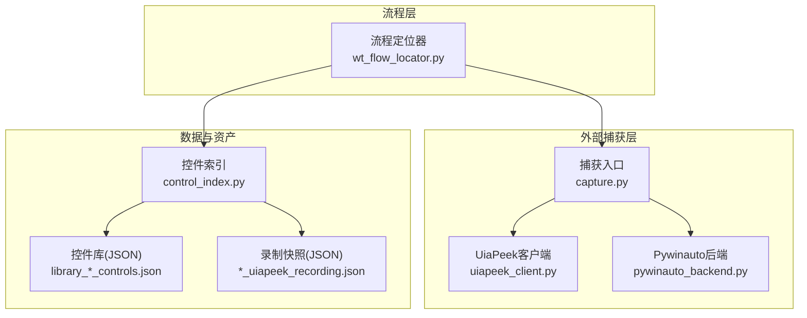
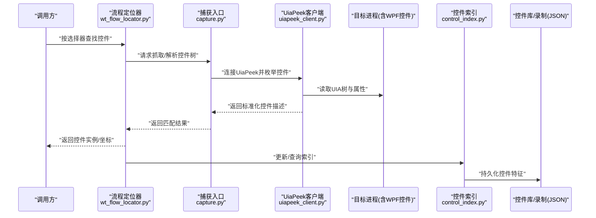
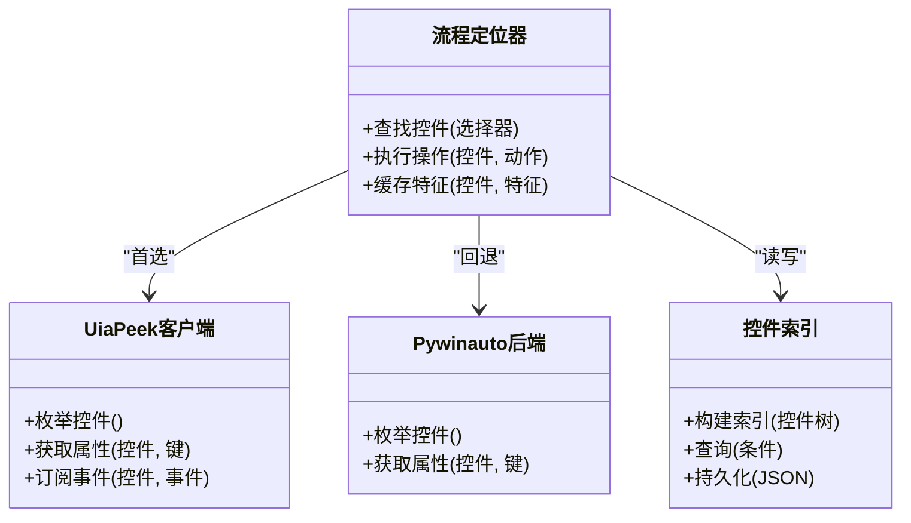
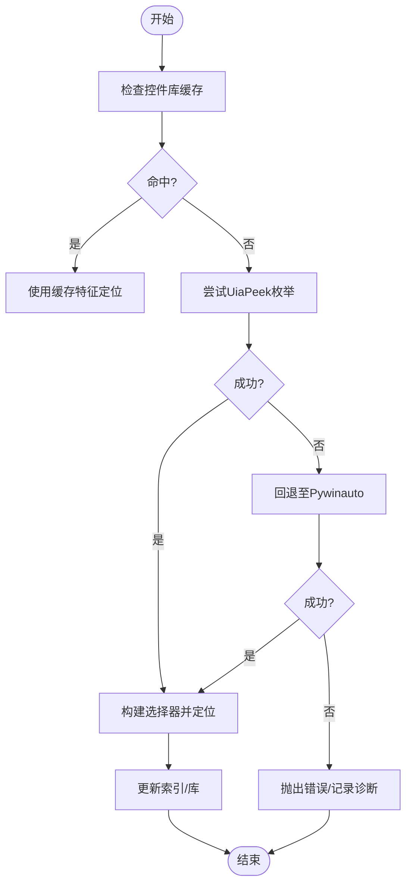
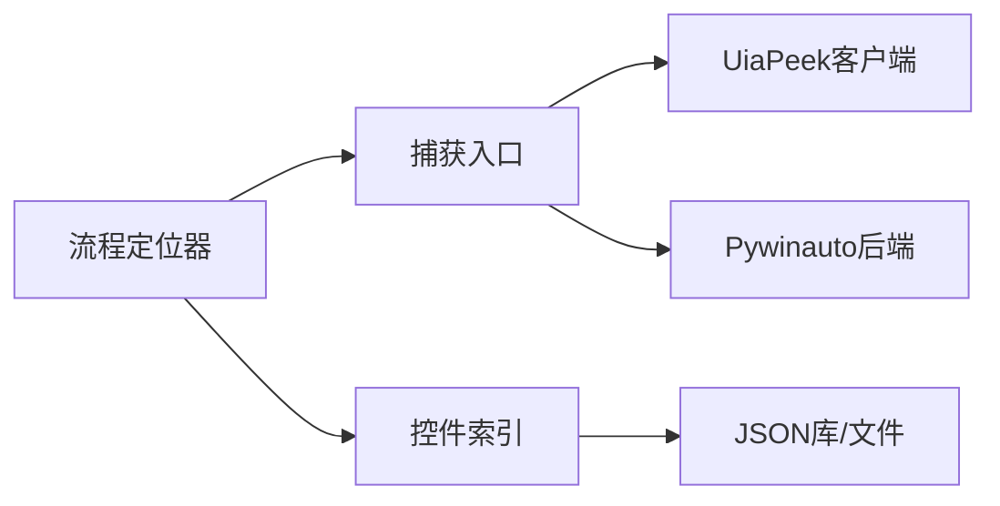

# UIA定位策略

<cite>
**本文引用的文件**   
- [wt_flow_locator.py](file://wt_flow_locator.py)
- [control_index.py](file://WT_AUTOMATION_Agent/control_index.py)
- [uiapeek_client.py](file://tools/external_capture/uiapeek_client.py)
- [pywinauto_backend.py](file://tools/external_capture/pywinauto_backend.py)
- [capture.py](file://tools/external_capture/capture.py)
- [library_主面板_WPF_controls.json](file://control_maps/library_主面板_WPF_controls.json)
- [20260720_153042_uiapeek_recording.json](file://control_maps/20260720_153042_uiapeek_recording.json)
</cite>

## 目录
1. [简介](#简介)
2. [项目结构](#项目结构)
3. [核心组件](#核心组件)
4. [架构总览](#架构总览)
5. [详细组件分析](#详细组件分析)
6. [依赖关系分析](#依赖关系分析)
7. [性能考虑](#性能考虑)
8. [故障排查指南](#故障排查指南)
9. [结论](#结论)
10. [附录：配置与最佳实践](#附录配置与最佳实践)

## 简介
本文件系统性阐述UIA（Windows UI Automation）定位策略的实现原理与使用方法，重点覆盖以下方面：
- UIA接口如何获取控件层次结构与属性信息（名称、类名、自动化ID等）
- UIA定位的优势：对现代WPF应用的支持、丰富的控件属性与事件、跨应用程序兼容性
- 定位配置参数与最佳实践：动态控件处理、性能优化技巧、常见问题解决方案
- 结合仓库中现有实现与示例，给出不同场景下的使用指引与参考路径

## 项目结构
本项目围绕“流程驱动+多后端定位”的架构组织。UIA相关能力主要分布在以下位置：
- 流程定位器：封装UIA与其他后端的统一选择器与执行逻辑
- 外部捕获工具：通过UiaPeek客户端或Pywinauto后端采集控件树与属性
- 控件库与录制数据：以JSON形式沉淀控件特征与层级快照，用于稳定定位与回归验证

图表来源
- [wt_flow_locator.py](file://wt_flow_locator.py)
- [uiapeek_client.py](file://tools/external_capture/uiapeek_client.py)
- [pywinauto_backend.py](file://tools/external_capture/pywinauto_backend.py)
- [capture.py](file://tools/external_capture/capture.py)
- [control_index.py](file://WT_AUTOMATION_Agent/control_index.py)
- [library_主面板_WPF_controls.json](file://control_maps/library_主面板_WPF_controls.json)
- [20260720_153042_uiapeek_recording.json](file://control_maps/20260720_153042_uiapeek_recording.json)

章节来源
- [wt_flow_locator.py](file://wt_flow_locator.py)
- [uiapeek_client.py](file://tools/external_capture/uiapeek_client.py)
- [pywinaauto_backend.py](file://tools/external_capture/pywinauto_backend.py)
- [capture.py](file://tools/external_capture/capture.py)
- [control_index.py](file://WT_AUTOMATION_Agent/control_index.py)
- [library_主面板_WPF_controls.json](file://control_maps/library_主面板_WPF_controls.json)
- [20260720_153042_uiapeek_recording.json](file://control_maps/20260720_153042_uiapeek_recording.json)

## 核心组件
- 流程定位器：提供统一的定位API，内部根据策略选择UIA或其他后端；负责将高层选择条件转换为具体控件实例并执行操作。
- UiaPeek客户端：作为UIA桥接层，连接UiaPeek服务，拉取目标进程的控件树与属性，支持按名称、类名、AutomationId等筛选。
- Pywinauto后端：在需要时回退到Win32/Automation混合模式，保证兼容传统Win32界面。
- 捕获入口：协调UiaPeek与Pywinauto两种后端，输出标准化控件描述，供上层使用。
- 控件索引与库：基于JSON沉淀控件特征（如名称、类名、AutomationId、层级路径），提升定位稳定性与可维护性。

章节来源
- [wt_flow_locator.py](file://wt_flow_locator.py)
- [uiapeek_client.py](file://tools/external_capture/uiapeek_client.py)
- [pywinauto_backend.py](file://tools/external_capture/pywinauto_backend.py)
- [capture.py](file://tools/external_capture/capture.py)
- [control_index.py](file://WT_AUTOMATION_Agent/control_index.py)

## 架构总览
下图展示从“流程调用”到“UIA抓取”的端到端链路，以及数据落盘为控件库与录制快照的过程。

图表来源
- [wt_flow_locator.py](file://wt_flow_locator.py)
- [capture.py](file://tools/external_capture/capture.py)
- [uiapeek_client.py](file://tools/external_capture/uiapeek_client.py)
- [control_index.py](file://WT_AUTOMATION_Agent/control_index.py)
- [library_主面板_WPF_controls.json](file://control_maps/library_主面板_WPF_controls.json)
- [20260720_153042_uiapeek_recording.json](file://control_maps/20260720_153042_uiapeek_recording.json)

## 详细组件分析

### UIA定位器与选择器
- 职责
  - 将高层选择条件（名称、类名、AutomationId、层级路径、相对位置等）转换为具体控件实例
  - 在UIA不可用时自动回退到其他后端
  - 缓存与复用已识别的控件特征，减少重复枚举开销
- 关键特性
  - 支持WPF控件的丰富属性（如IsEnabled、IsSelected、Value.Value等）
  - 支持事件订阅（如点击、展开、值改变）以便异步等待与断言
  - 支持相对定位（父/子/兄弟节点）增强鲁棒性
- 典型用法
  - 通过名称+类名组合快速定位
  - 通过AutomationId精准定位（推荐优先）
  - 通过层级路径+模糊名称进行容错定位
  - 通过相对窗口/区域偏移进行二次精确定位

章节来源
- [wt_flow_locator.py](file://wt_flow_locator.py)

#### 类图（概念映射）

图表来源
- [wt_flow_locator.py](file://wt_flow_locator.py)
- [uiapeek_client.py](file://tools/external_capture/uiapeek_client.py)
- [pywinauto_backend.py](file://tools/external_capture/pywinauto_backend.py)
- [control_index.py](file://WT_AUTOMATION_Agent/control_index.py)

### UiaPeek客户端与属性访问
- 职责
  - 与UiaPeek服务通信，获取目标进程的UIA树
  - 提取关键属性：名称、类名、AutomationId、类型、可见性、启用状态、值等
  - 支持事件监听（如点击、展开、折叠、值变化）
- 优势
  - 原生UIA语义，适合WPF/WinUI等现代框架
  - 属性丰富，便于构建稳定的选择器
  - 跨进程、跨应用兼容性好
- 注意事项
  - 大树的枚举可能耗时，建议按需过滤与分页
  - 动态控件需结合上下文与时间窗口进行匹配

章节来源
- [uiapeek_client.py](file://tools/external_capture/uiapeek_client.py)

### 捕获入口与后端切换
- 职责
  - 统一对外暴露“抓取控件树/属性”的能力
  - 根据目标进程与可用后端自动选择UiaPeek或Pywinauto
  - 输出标准化的控件描述，供索引与定位器消费
- 设计要点
  - 失败重试与降级策略
  - 超时控制与资源释放
  - 日志与诊断信息收集

章节来源
- [capture.py](file://tools/external_capture/capture.py)
- [pywinauto_backend.py](file://tools/external_capture/pywinauto_backend.py)

### 控件索引与库
- 职责
  - 将控件的关键特征（名称、类名、AutomationId、层级路径、相对位置等）结构化存储
  - 提供快速检索与版本化管理
  - 支撑录制回放与回归测试
- 数据结构
  - JSON格式，包含窗口/控件层级、关键属性、可选截图或坐标
- 使用方式
  - 首次录制生成库文件
  - 运行时优先命中库，未命中则实时抓取并回填

章节来源
- [control_index.py](file://WT_AUTOMATION_Agent/control_index.py)
- [library_主面板_WPF_controls.json](file://control_maps/library_主面板_WPF_controls.json)
- [20260720_153042_uiapeek_recording.json](file://control_maps/20260720_153042_uiapeek_recording.json)

#### 流程图（定位决策）

图表来源
- [wt_flow_locator.py](file://wt_flow_locator.py)
- [uiapeek_client.py](file://tools/external_capture/uiapeek_client.py)
- [pywinauto_backend.py](file://tools/external_capture/pywinauto_backend.py)
- [control_index.py](file://WT_AUTOMATION_Agent/control_index.py)

## 依赖关系分析
- 组件耦合
  - 流程定位器依赖捕获入口与控件索引
  - 捕获入口依赖UiaPeek客户端与Pywinauto后端
  - 控件索引依赖JSON库与文件系统
- 外部依赖
  - UiaPeek服务（进程内/外）
  - Windows UIA子系统
  - Pywinauto（Win32/Automation）
- 潜在风险
  - 循环依赖：当前分层清晰，未见明显循环
  - 外部服务可用性：UiaPeek启动失败需有健壮降级

图表来源
- [wt_flow_locator.py](file://wt_flow_locator.py)
- [capture.py](file://tools/external_capture/capture.py)
- [uiapeek_client.py](file://tools/external_capture/uiapeek_client.py)
- [pywinauto_backend.py](file://tools/external_capture/pywinauto_backend.py)
- [control_index.py](file://WT_AUTOMATION_Agent/control_index.py)

## 性能考虑
- 减少全树枚举
  - 使用精确选择器（AutomationId优先）缩小搜索范围
  - 利用控件库缓存，避免重复抓取
- 延迟加载与按需属性
  - 仅请求必要属性，避免一次性拉取全部字段
- 并发与批处理
  - 批量操作合并为一次会话，减少握手与序列化开销
- 超时与重试
  - 合理设置超时，配合指数退避重试，避免雪崩
- 资源清理
  - 及时释放UIA句柄与UiaPeek连接，防止内存泄漏

[本节为通用指导，不直接分析具体文件]

## 故障排查指南
- 无法连接到UiaPeek
  - 确认UiaPeek服务已启动且权限足够
  - 检查目标进程是否受保护（高完整性级别）
- 定位不稳定
  - 优先使用AutomationId；若缺失，使用“名称+类名+层级路径”组合
  - 引入相对定位与时间窗口容忍
- 性能问题
  - 开启控件库缓存；减少全树枚举
  - 使用更具体的选择器，避免模糊匹配
- 事件未触发
  - 确认订阅的事件类型与控件支持的事件一致
  - 增加等待与重试逻辑

章节来源
- [uiapeek_client.py](file://tools/external_capture/uiapeek_client.py)
- [capture.py](file://tools/external_capture/capture.py)
- [control_index.py](file://WT_AUTOMATION_Agent/control_index.py)

## 结论
UIA定位策略在本项目中通过“流程定位器+UiaPeek客户端+控件索引”的组合实现了稳定、高效、可扩展的控件识别与交互能力。其优势在于对现代WPF应用的强支持、丰富的控件属性与事件、良好的跨应用兼容性。通过合理的配置与最佳实践，可在复杂场景中保持高鲁棒性与高性能。

[本节为总结，不直接分析具体文件]

## 附录：配置与最佳实践

### 选择器优先级与组合
- 首选：AutomationId（唯一、稳定）
- 次选：名称+类名+层级路径（容错性强）
- 辅助：相对位置/父子关系、可见性/启用状态等属性约束

章节来源
- [uiapeek_client.py](file://tools/external_capture/uiapeek_client.py)
- [control_index.py](file://WT_AUTOMATION_Agent/control_index.py)

### 动态控件处理
- 使用模糊匹配与正则表达式
- 结合上下文（父节点、兄弟节点）与时间窗口
- 在控件库中记录动态片段，运行时拼接

章节来源
- [control_index.py](file://WT_AUTOMATION_Agent/control_index.py)
- [20260720_153042_uiapeek_recording.json](file://control_maps/20260720_153042_uiapeek_recording.json)

### 性能优化清单
- 启用控件库缓存与增量更新
- 限制枚举深度与属性集
- 合并多次操作为一次会话
- 合理设置超时与重试策略

章节来源
- [wt_flow_locator.py](file://wt_flow_locator.py)
- [uiapeek_client.py](file://tools/external_capture/uiapeek_client.py)

### 常见场景与参考路径
- WPF按钮点击：通过AutomationId或名称+类名定位，执行点击
  - 参考：[wt_flow_locator.py](file://wt_flow_locator.py)、[uiapeek_client.py](file://tools/external_capture/uiapeek_client.py)
- 列表项选择：通过层级路径+文本模糊匹配，再校验选中状态
  - 参考：[control_index.py](file://WT_AUTOMATION_Agent/control_index.py)、[library_主面板_WPF_controls.json](file://control_maps/library_主面板_WPF_controls.json)
- 输入框赋值：定位输入控件，设置值并等待完成事件
  - 参考：[uiapeek_client.py](file://tools/external_capture/uiapeek_client.py)
- 录制回放：基于录制快照重建选择器，必要时回退到Pywinauto
  - 参考：[20260720_153042_uiapeek_recording.json](file://control_maps/20260720_153042_uiapeek_recording.json)、[pywinauto_backend.py](file://tools/external_capture/pywinauto_backend.py)