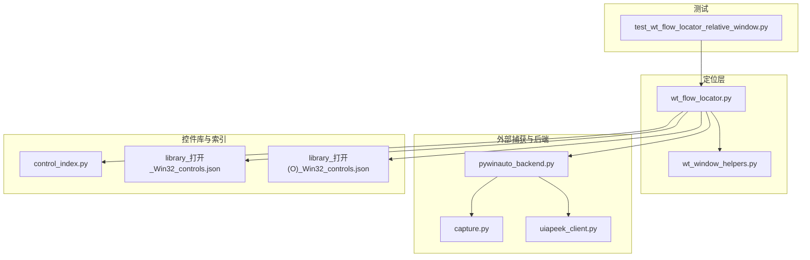
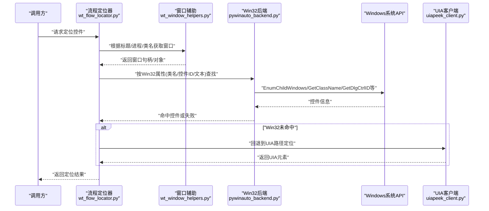
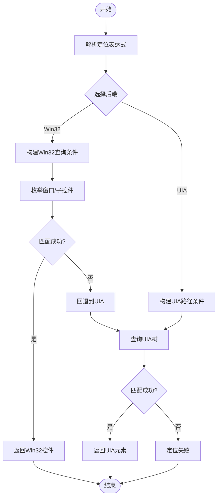
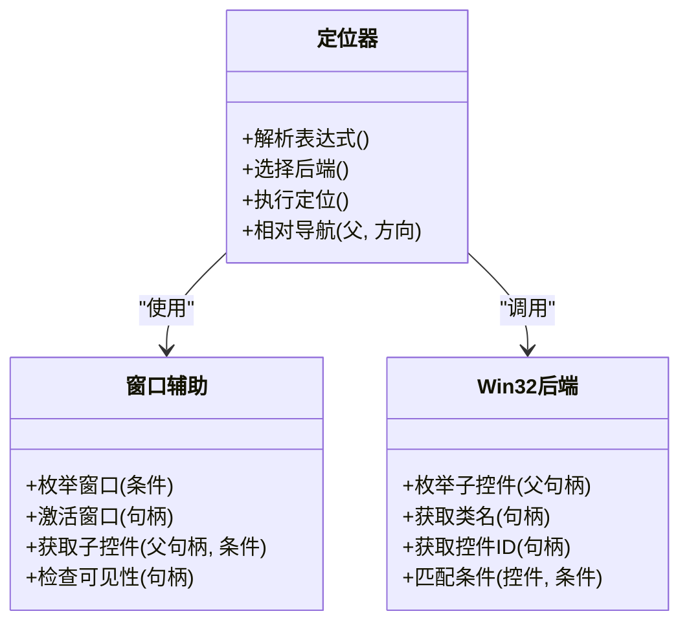
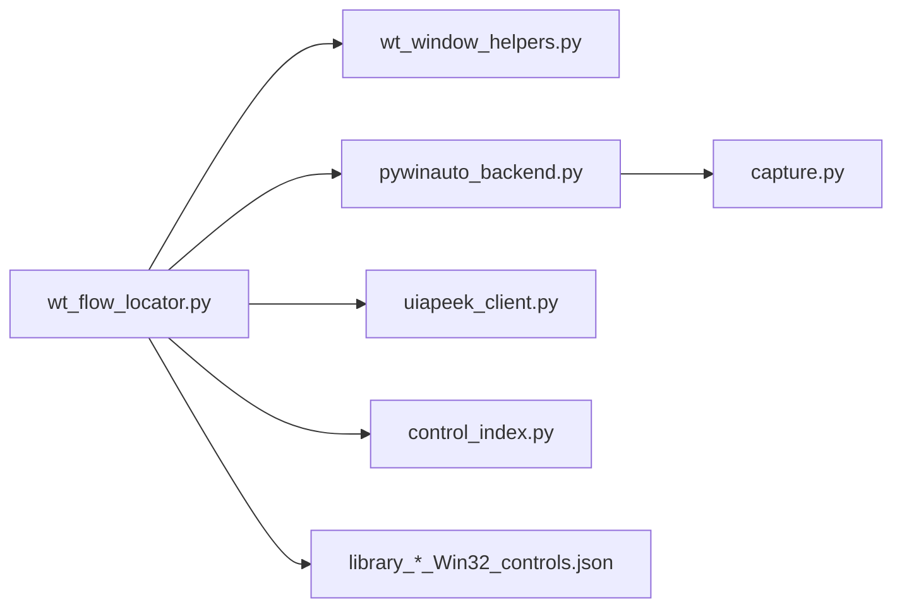

# Win32定位策略

<cite>
**本文引用的文件**   
- [wt_flow_locator.py](file://wt_flow_locator.py)
- [wt_window_helpers.py](file://wt_window_helpers.py)
- [control_index.py](file://WT_AUTOMATION_Agent/control_index.py)
- [pywinauto_backend.py](file://tools/external_capture/pywinauto_backend.py)
- [capture.py](file://tools/external_capture/capture.py)
- [uiapeek_client.py](file://tools/external_capture/uiapeek_client.py)
- [library_打开_Win32_controls.json](file://control_maps/library_打开_Win32_controls.json)
- [library_打开(O)_Win32_controls.json](file://control_maps/library_打开(O)_Win32_controls.json)
- [test_wt_flow_locator_relative_window.py](file://tests/test_wt_flow_locator_relative_window.py)
</cite>

## 目录
1. [简介](#简介)
2. [项目结构](#项目结构)
3. [核心组件](#核心组件)
4. [架构总览](#架构总览)
5. [详细组件分析](#详细组件分析)
6. [依赖关系分析](#依赖关系分析)
7. [性能考量](#性能考量)
8. [故障排查指南](#故障排查指南)
9. [结论](#结论)
10. [附录](#附录)

## 简介
本文件系统性阐述Win32定位策略在本项目中的技术实现与应用场景。重点说明如何通过Win32 API直接操作Windows底层控件，包括窗口句柄、控件ID、类名等核心概念；总结其适用性（传统Win32应用、高性能）与局限（兼容性相对较差）；给出配置选项与参数设置方法，涵盖嵌套窗口处理、动态控件识别与异常处理机制；并提供实际案例，展示在复杂界面中如何结合UIA定位进行混合使用。

## 项目结构
围绕Win32定位的相关代码主要分布在以下位置：
- 流程定位器与窗口辅助：wt_flow_locator.py、wt_window_helpers.py
- 外部捕获与后端桥接：tools/external_capture/pywinauto_backend.py、capture.py、uiapeek_client.py
- 控件索引与库：WT_AUTOMATION_Agent/control_index.py、control_maps下的Win32控件库JSON
- 测试用例：tests/test_wt_flow_locator_relative_window.py

图表来源
- [wt_flow_locator.py](file://wt_flow_locator.py)
- [wt_window_helpers.py](file://wt_window_helpers.py)
- [pywinauto_backend.py](file://tools/external_capture/pywinauto_backend.py)
- [capture.py](file://tools/external_capture/capture.py)
- [uiapeek_client.py](file://tools/external_capture/uiapeek_client.py)
- [control_index.py](file://WT_AUTOMATION_Agent/control_index.py)
- [library_打开_Win32_controls.json](file://control_maps/library_打开_Win32_controls.json)
- [library_打开(O)_Win32_controls.json](file://control_maps/library_打开(O)_Win32_controls.json)
- [test_wt_flow_locator_relative_window.py](file://tests/test_wt_flow_locator_relative_window.py)

章节来源
- [wt_flow_locator.py](file://wt_flow_locator.py)
- [wt_window_helpers.py](file://wt_window_helpers.py)
- [pywinauto_backend.py](file://tools/external_capture/pywinauto_backend.py)
- [capture.py](file://tools/external_capture/capture.py)
- [uiapeek_client.py](file://tools/external_capture/uiapeek_client.py)
- [control_index.py](file://WT_AUTOMATION_Agent/control_index.py)
- [library_打开_Win32_controls.json](file://control_maps/library_打开_Win32_controls.json)
- [library_打开(O)_Win32_controls.json](file://control_maps/library_打开(O)_Win32_controls.json)
- [test_wt_flow_locator_relative_window.py](file://tests/test_wt_flow_locator_relative_window.py)

## 核心组件
- 流程定位器（wt_flow_locator.py）
  - 负责解析定位表达式、选择后端（Win32/UIA）、执行查找与交互。
  - 支持基于窗口标题、进程、类名、控件ID、文本等多条件组合定位。
  - 提供相对窗口定位能力，便于在父/子窗口间导航。
- 窗口辅助（wt_window_helpers.py）
  - 封装窗口枚举、激活、状态检查、句柄获取等通用操作。
  - 为定位器提供稳定的窗口上下文。
- 外部捕获与后端（pywinauto_backend.py、capture.py、uiapeek_client.py）
  - pywinauto_backend.py：作为Win32后端的适配层，调用底层API进行控件发现与操作。
  - capture.py：用于屏幕截图与图像辅助定位的桥接。
  - uiapeek_client.py：用于UIA路径定位的客户端封装，可与Win32定位混合使用。
- 控件索引与库（control_index.py、control_maps/*.json）
  - control_index.py：维护控件索引与映射，加速定位。
  - library_*_Win32_controls.json：预定义的Win32控件模板，包含类名、控件ID、文本等匹配规则。
- 测试（test_wt_flow_locator_relative_window.py）
  - 验证相对窗口定位、嵌套窗口遍历、异常分支等关键路径。

章节来源
- [wt_flow_locator.py](file://wt_flow_locator.py)
- [wt_window_helpers.py](file://wt_window_helpers.py)
- [pywinauto_backend.py](file://tools/external_capture/pywinauto_backend.py)
- [capture.py](file://tools/external_capture/capture.py)
- [uiapeek_client.py](file://tools/external_capture/uiapeek_client.py)
- [control_index.py](file://WT_AUTOMATION_Agent/control_index.py)
- [library_打开_Win32_controls.json](file://control_maps/library_打开_Win32_controls.json)
- [library_打开(O)_Win32_controls.json](file://control_maps/library_打开(O)_Win32_controls.json)
- [test_wt_flow_locator_relative_window.py](file://tests/test_wt_flow_locator_relative_window.py)

## 架构总览
Win32定位策略通过“定位器→后端→系统API”的分层设计，实现对传统Win32控件的高效访问。同时保留UIA通道以兼容现代UI框架，形成混合定位体系。

图表来源
- [wt_flow_locator.py](file://wt_flow_locator.py)
- [wt_window_helpers.py](file://wt_window_helpers.py)
- [pywinauto_backend.py](file://tools/external_capture/pywinauto_backend.py)
- [uiapeek_client.py](file://tools/external_capture/uiapeek_client.py)

## 详细组件分析

### Win32定位器与后端协作
- 定位器职责
  - 解析定位表达式，决定使用Win32还是UIA后端。
  - 组合多条件（窗口标题、进程、类名、控件ID、文本、可见性等）。
  - 管理相对窗口导航（父子、兄弟、同级）。
- 后端职责
  - 将高层定位条件转换为Win32 API调用。
  - 遍历子控件、过滤匹配项、返回最合适的控件句柄。
- 混合策略
  - 优先尝试Win32定位（速度快、稳定），失败时回退至UIA路径。
  - 对某些不可见或虚拟化控件，可借助UIA补充定位。

图表来源
- [wt_flow_locator.py](file://wt_flow_locator.py)
- [pywinauto_backend.py](file://tools/external_capture/pywinauto_backend.py)
- [uiapeek_client.py](file://tools/external_capture/uiapeek_client.py)

章节来源
- [wt_flow_locator.py](file://wt_flow_locator.py)
- [pywinauto_backend.py](file://tools/external_capture/pywinauto_backend.py)
- [uiapeek_client.py](file://tools/external_capture/uiapeek_client.py)

### 窗口辅助与嵌套窗口处理
- 窗口辅助提供：
  - 窗口枚举与筛选（标题、类名、进程ID）。
  - 窗口激活与状态检查。
  - 句柄获取与生命周期管理。
- 嵌套窗口处理：
  - 通过递归枚举子控件，结合类名与控件ID进行深度匹配。
  - 支持相对窗口定位（父/子/兄弟），提升复杂界面的鲁棒性。

图表来源
- [wt_window_helpers.py](file://wt_window_helpers.py)
- [wt_flow_locator.py](file://wt_flow_locator.py)
- [pywinauto_backend.py](file://tools/external_capture/pywinauto_backend.py)

章节来源
- [wt_window_helpers.py](file://wt_window_helpers.py)
- [wt_flow_locator.py](file://wt_flow_locator.py)
- [pywinauto_backend.py](file://tools/external_capture/pywinauto_backend.py)

### 控件库与索引
- 控件库（Win32）
  - 预定义控件模板，包含类名、控件ID、文本等匹配规则，用于快速定位常见控件。
  - 示例文件：
    - [library_打开_Win32_controls.json](file://control_maps/library_打开_Win32_controls.json)
    - [library_打开(O)_Win32_controls.json](file://control_maps/library_打开(O)_Win32_controls.json)
- 控件索引
  - 集中管理控件映射与缓存，提高定位效率。
  - 参考：[control_index.py](file://WT_AUTOMATION_Agent/control_index.py)

章节来源
- [control_index.py](file://WT_AUTOMATION_Agent/control_index.py)
- [library_打开_Win32_controls.json](file://control_maps/library_打开_Win32_controls.json)
- [library_打开(O)_Win32_controls.json](file://control_maps/library_打开(O)_Win32_controls.json)

### 测试与验证
- 相对窗口定位测试
  - 验证父子/兄弟窗口导航、嵌套控件查找、异常分支处理。
  - 参考：[test_wt_flow_locator_relative_window.py](file://tests/test_wt_flow_locator_relative_window.py)

章节来源
- [test_wt_flow_locator_relative_window.py](file://tests/test_wt_flow_locator_relative_window.py)

## 依赖关系分析
- 定位器依赖窗口辅助与后端，后端依赖系统API。
- UIA客户端作为可选回退通道，增强兼容性。
- 控件库与索引为定位器提供预定义规则与缓存。

图表来源
- [wt_flow_locator.py](file://wt_flow_locator.py)
- [wt_window_helpers.py](file://wt_window_helpers.py)
- [pywinauto_backend.py](file://tools/external_capture/pywinauto_backend.py)
- [uiapeek_client.py](file://tools/external_capture/uiapeek_client.py)
- [control_index.py](file://WT_AUTOMATION_Agent/control_index.py)
- [library_打开_Win32_controls.json](file://control_maps/library_打开_Win32_controls.json)
- [library_打开(O)_Win32_controls.json](file://control_maps/library_打开(O)_Win32_controls.json)
- [capture.py](file://tools/external_capture/capture.py)

章节来源
- [wt_flow_locator.py](file://wt_flow_locator.py)
- [wt_window_helpers.py](file://wt_window_helpers.py)
- [pywinauto_backend.py](file://tools/external_capture/pywinauto_backend.py)
- [uiapeek_client.py](file://tools/external_capture/uiapeek_client.py)
- [control_index.py](file://WT_AUTOMATION_Agent/control_index.py)
- [library_打开_Win32_controls.json](file://control_maps/library_打开_Win32_controls.json)
- [library_打开(O)_Win32_controls.json](file://control_maps/library_打开(O)_Win32_controls.json)
- [capture.py](file://tools/external_capture/capture.py)

## 性能考量
- Win32定位优势
  - 直接访问底层控件，避免UIA树的额外开销，适合高频操作与大规模批量任务。
- 优化建议
  - 使用控件库与索引减少重复枚举。
  - 合理限定搜索范围（窗口标题/类名/进程），避免全树扫描。
  - 对动态控件采用稳健匹配策略（模糊文本、正则类名、容错ID）。
- 回退策略
  - 当Win32无法命中时，自动切换至UIA，保证整体成功率。

## 故障排查指南
- 常见问题
  - 控件ID动态变化：改用类名+文本组合匹配，或引入相对定位。
  - 嵌套过深导致超时：限制枚举深度，增加可见性与状态校验。
  - 权限不足导致句柄获取失败：确保运行账户具备足够权限。
- 诊断步骤
  - 启用日志输出，记录定位表达式与中间结果。
  - 使用控件库对比预期与实际的类名/控件ID。
  - 切换到UIA通道验证是否为Win32特有限制。
- 异常处理
  - 捕获并分类异常（找不到窗口、无匹配控件、权限错误）。
  - 提供重试与降级策略（如放宽匹配条件、回退UIA）。

章节来源
- [wt_flow_locator.py](file://wt_flow_locator.py)
- [wt_window_helpers.py](file://wt_window_helpers.py)
- [pywinauto_backend.py](file://tools/external_capture/pywinauto_backend.py)
- [uiapeek_client.py](file://tools/external_capture/uiapeek_client.py)

## 结论
Win32定位策略在本项目中通过分层架构与混合后端设计，兼顾了性能与兼容性。对于传统Win32应用，Win32定位具有显著优势；对于现代UI框架或复杂场景，结合UIA回退可有效提升稳定性。通过控件库与索引、相对窗口导航以及完善的异常处理机制，可在复杂界面中实现高效可靠的自动化。

## 附录
- 配置与参数要点
  - 窗口条件：标题、类名、进程ID。
  - 控件条件：类名、控件ID、文本、可见性、层级深度。
  - 相对导航：父/子/兄弟方向与步长。
  - 回退策略：Win32失败时自动切换UIA。
- 实际案例思路
  - 菜单项定位：使用类名+文本组合，必要时结合相对导航。
  - 对话框输入框：先定位父窗口，再按控件ID或文本匹配输入框。
  - 列表项选择：Win32定位失败时回退UIA，利用UIA路径精确选择。