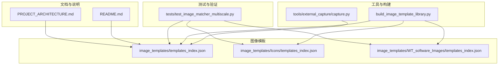
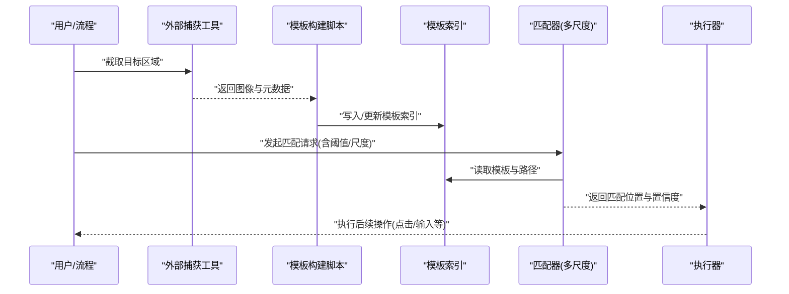
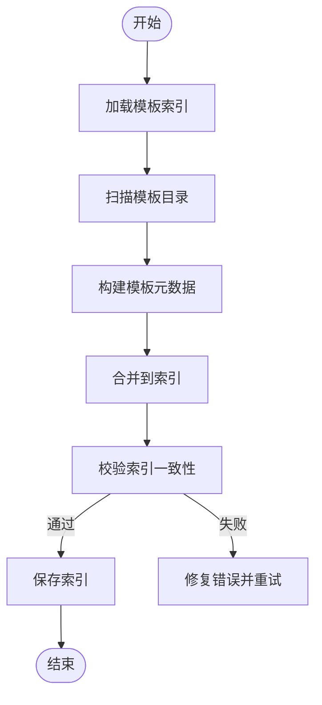
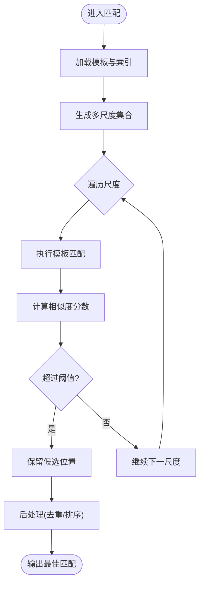
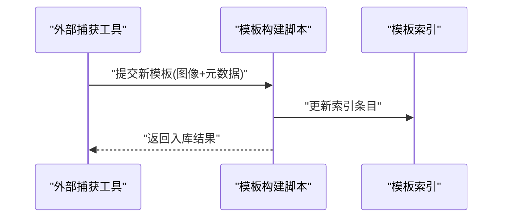
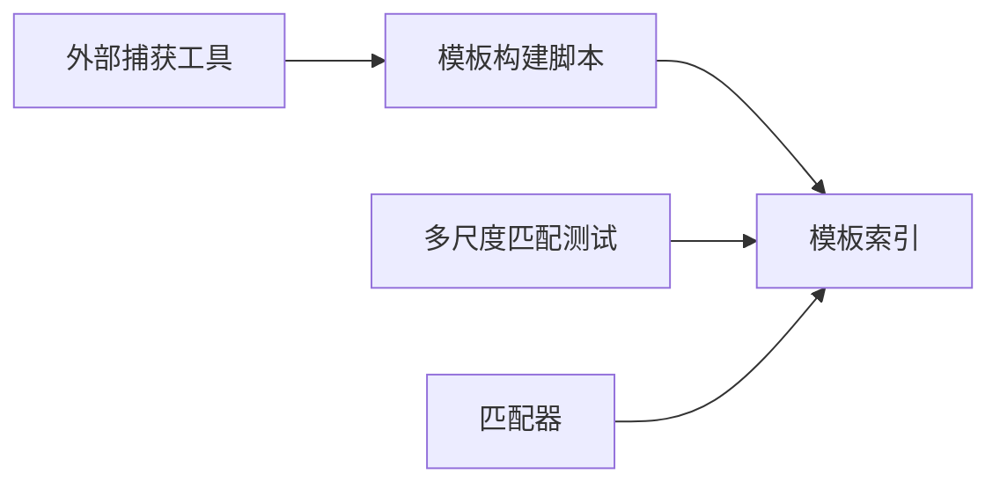

# 图像匹配定位

<cite>
**本文引用的文件**   
- [README.md](file://README.md)
- [PROJECT_ARCHITECTURE.md](file://PROJECT_ARCHITECTURE.md)
- [build_image_template_library.py](file://build_image_template_library.py)
- [test_image_matcher_multiscale.py](file://tests/test_image_matcher_multiscale.py)
- [image_templates/templates_index.json](file://image_templates/templates_index.json)
- [image_templates/Icons/templates_index.json](file://image_templates/Icons/templates_index.json)
- [image_templates/WT_software_Images/templates_index.json](file://image_templates/WT_software_Images/templates_index.json)
- [tools/external_capture/capture.py](file://tools/external_capture/capture.py)
- [debug-click-9-miss.md](file://debug-click-9-miss.md)
- [debug-cft02-step16-drift.md](file://debug-cft02-step16-drift.md)
</cite>

## 目录
1. [简介](#简介)
2. [项目结构](#项目结构)
3. [核心组件](#核心组件)
4. [架构总览](#架构总览)
5. [详细组件分析](#详细组件分析)
6. [依赖关系分析](#依赖关系分析)
7. [性能考虑](#性能考虑)
8. [故障排除指南](#故障排除指南)
9. [结论](#结论)
10. [附录](#附录)

## 简介
本文件围绕“图像匹配定位”技术，结合仓库中的模板库与测试用例，系统阐述其在控件识别中的应用。重点覆盖：
- 模板匹配算法、多尺度匹配、相似度阈值设置等关键技术点
- 图像匹配的定位优势：适用于无法通过API访问的控件、对界面变化具有一定容忍度
- 图像模板的管理与维护：模板库组织结构、自动更新机制与版本控制思路
- 参数调优指南：分辨率适配、颜色空间转换、噪声处理等优化技巧
- 实际应用场景与常见问题排查方法

## 项目结构
本项目在图像模板与自动化流程方面具备清晰的分层组织：
- image_templates：集中存放图像模板及索引，支持按功能域（如图标、软件界面截图）分类管理
- tests：包含多尺度匹配的单元测试，用于验证匹配策略与鲁棒性
- tools/external_capture：提供外部捕获能力，便于采集屏幕或窗口区域作为模板来源
- build_image_template_library.py：构建/维护模板库的工具脚本
- README.md、PROJECT_ARCHITECTURE.md：项目说明与架构概览

图表来源
- [image_templates/templates_index.json](file://image_templates/templates_index.json)
- [image_templates/Icons/templates_index.json](file://image_templates/Icons/templates_index.json)
- [image_templates/WT_software_Images/templates_index.json](file://image_templates/WT_software_Images/templates_index.json)
- [build_image_template_library.py](file://build_image_template_library.py)
- [tools/external_capture/capture.py](file://tools/external_capture/capture.py)
- [tests/test_image_matcher_multiscale.py](file://tests/test_image_matcher_multiscale.py)
- [README.md](file://README.md)
- [PROJECT_ARCHITECTURE.md](file://PROJECT_ARCHITECTURE.md)

章节来源
- [README.md](file://README.md)
- [PROJECT_ARCHITECTURE.md](file://PROJECT_ARCHITECTURE.md)

## 核心组件
- 模板索引与分层组织
  - 根级模板索引与子域索引（如图标、软件界面截图）分离，便于按功能域检索与管理
  - 索引文件用于描述模板元数据与路径映射，支撑快速查找与批量构建
- 模板构建与更新
  - 通过构建脚本统一生成/合并模板库，确保索引与实际模板一致
  - 可结合外部捕获工具进行增量更新，减少人工维护成本
- 多尺度匹配测试
  - 针对缩放、DPI差异、UI微调等场景，使用多尺度匹配提升稳定性
  - 通过单元测试验证不同阈值与尺度的组合效果

章节来源
- [image_templates/templates_index.json](file://image_templates/templates_index.json)
- [image_templates/Icons/templates_index.json](file://image_templates/Icons/templates_index.json)
- [image_templates/WT_software_Images/templates_index.json](file://image_templates/WT_software_Images/templates_index.json)
- [build_image_template_library.py](file://build_image_template_library.py)
- [tests/test_image_matcher_multiscale.py](file://tests/test_image_matcher_multiscale.py)

## 架构总览
图像匹配定位的整体流程如下：
- 模板采集：从目标应用窗口或屏幕区域截取图像，形成原始模板
- 模板入库：将模板与元数据写入模板索引，建立结构化索引
- 匹配执行：运行时加载模板，采用模板匹配与多尺度策略进行定位
- 结果校验：根据相似度阈值与位置信息判定命中，输出坐标或触发后续动作
- 持续维护：定期更新模板库，保证与界面演进保持一致

图表来源
- [tools/external_capture/capture.py](file://tools/external_capture/capture.py)
- [build_image_template_library.py](file://build_image_template_library.py)
- [image_templates/templates_index.json](file://image_templates/templates_index.json)
- [tests/test_image_matcher_multiscale.py](file://tests/test_image_matcher_multiscale.py)

## 详细组件分析

### 模板索引与分层管理
- 分层设计
  - 根索引：汇总所有可用模板及其基础信息
  - 子域索引：按功能域（图标、软件界面截图）细分，提高检索效率
- 关键职责
  - 记录模板路径、名称、所属域、版本信息等
  - 为构建脚本与匹配器提供统一的查询入口
- 维护建议
  - 新增模板后同步更新对应索引
  - 定期清理无效模板，保持索引精简

图表来源
- [image_templates/templates_index.json](file://image_templates/templates_index.json)
- [image_templates/Icons/templates_index.json](file://image_templates/Icons/templates_index.json)
- [image_templates/WT_software_Images/templates_index.json](file://image_templates/WT_software_Images/templates_index.json)
- [build_image_template_library.py](file://build_image_template_library.py)

章节来源
- [image_templates/templates_index.json](file://image_templates/templates_index.json)
- [image_templates/Icons/templates_index.json](file://image_templates/Icons/templates_index.json)
- [image_templates/WT_software_Images/templates_index.json](file://image_templates/WT_software_Images/templates_index.json)
- [build_image_template_library.py](file://build_image_template_library.py)

### 多尺度匹配与阈值策略
- 多尺度匹配
  - 针对DPI差异、缩放比例、UI微调等场景，对模板在不同尺度下进行搜索，提高命中率
- 阈值设置
  - 相似度阈值需平衡误报与漏报；过高易漏报，过低易误报
  - 建议结合业务场景与界面稳定性，分阶段调参并回归验证
- 测试驱动
  - 通过单元测试覆盖典型场景，验证不同阈值与尺度的组合效果

图表来源
- [tests/test_image_matcher_multiscale.py](file://tests/test_image_matcher_multiscale.py)
- [image_templates/templates_index.json](file://image_templates/templates_index.json)

章节来源
- [tests/test_image_matcher_multiscale.py](file://tests/test_image_matcher_multiscale.py)

### 模板采集与入库
- 采集来源
  - 使用外部捕获工具获取目标窗口或屏幕区域图像
- 入库流程
  - 将图像与元数据写入模板索引，确保路径与索引一致
  - 构建脚本负责批量处理与校验，避免手工错误

图表来源
- [tools/external_capture/capture.py](file://tools/external_capture/capture.py)
- [build_image_template_library.py](file://build_image_template_library.py)
- [image_templates/templates_index.json](file://image_templates/templates_index.json)

章节来源
- [tools/external_capture/capture.py](file://tools/external_capture/capture.py)
- [build_image_template_library.py](file://build_image_template_library.py)
- [image_templates/templates_index.json](file://image_templates/templates_index.json)

## 依赖关系分析
- 模块耦合
  - 模板索引被构建脚本与匹配器共同依赖，属于核心共享资源
  - 外部捕获工具为模板采集提供上游数据源
- 潜在风险
  - 索引与模板不一致会导致匹配失败
  - 多尺度与阈值配置不当会影响稳定性与性能

图表来源
- [tools/external_capture/capture.py](file://tools/external_capture/capture.py)
- [build_image_template_library.py](file://build_image_template_library.py)
- [image_templates/templates_index.json](file://image_templates/templates_index.json)
- [tests/test_image_matcher_multiscale.py](file://tests/test_image_matcher_multiscale.py)

章节来源
- [tools/external_capture/capture.py](file://tools/external_capture/capture.py)
- [build_image_template_library.py](file://build_image_template_library.py)
- [image_templates/templates_index.json](file://image_templates/templates_index.json)
- [tests/test_image_matcher_multiscale.py](file://tests/test_image_matcher_multiscale.py)

## 性能考虑
- 多尺度搜索范围
  - 合理限制尺度集合，避免过大搜索空间导致耗时增加
- 相似度阈值
  - 在保证召回率的前提下尽量提高阈值，减少误报带来的后处理开销
- 模板尺寸与分辨率
  - 模板尺寸不宜过大；必要时进行降采样或裁剪，提升匹配速度
- 缓存与复用
  - 对常用模板与中间结果进行缓存，减少重复计算

[本节为通用指导，不直接分析具体文件]

## 故障排除指南
- 常见症状
  - 匹配失败或频繁漂移：可能由界面布局变化、主题切换、DPI缩放引起
  - 误报增多：阈值过低或模板过于通用
- 排查步骤
  - 检查模板索引是否最新，确认模板路径有效
  - 调整多尺度集合与阈值，观察命中率与误报变化
  - 重新采集模板，确保与当前界面状态一致
- 参考问题记录
  - 点击失败与漂移问题的调试记录可作为参考

章节来源
- [debug-click-9-miss.md](file://debug-click-9-miss.md)
- [debug-cft02-step16-drift.md](file://debug-cft02-step16-drift.md)

## 结论
图像匹配定位在无法通过API访问的控件场景中具有显著优势，配合多尺度匹配与合理的阈值策略，能够实现对界面变化的良好容忍度。通过规范的模板索引管理与自动化构建流程，可有效降低维护成本并提升稳定性。建议在工程实践中以测试驱动的方式持续验证参数与模板质量，并结合问题记录快速定位与修复异常。

[本节为总结性内容，不直接分析具体文件]

## 附录
- 术语说明
  - 模板匹配：基于像素或特征对比，在目标图像中搜索与模板最相似的区域
  - 多尺度匹配：对模板在不同缩放比例下进行匹配，增强对分辨率与缩放的鲁棒性
  - 相似度阈值：判定匹配成功的临界值，影响召回率与精确率的权衡
- 实践建议
  - 建立模板版本化与变更审计流程，确保回溯与回滚能力
  - 将关键匹配场景纳入自动化测试，持续回归验证

[本节为补充说明，不直接分析具体文件]