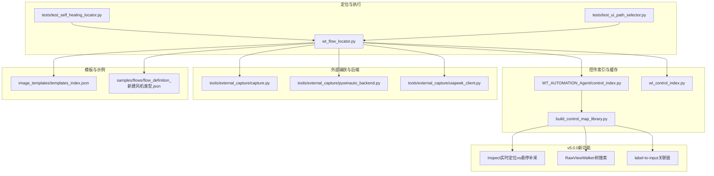
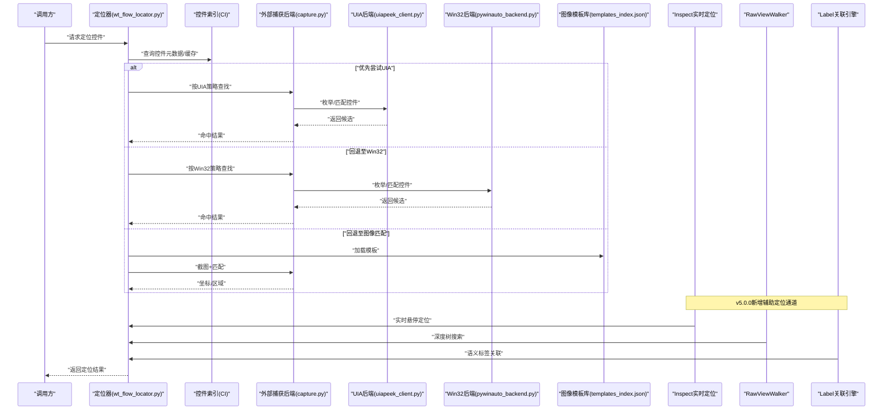
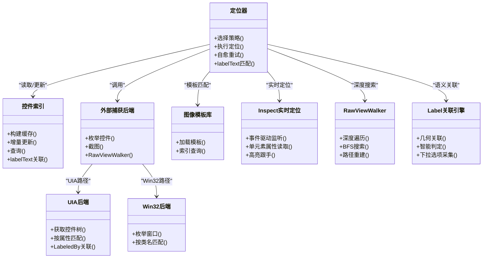

# 控件定位策略

<cite>
**本文引用的文件**   
- [wt_flow_locator.py](file://wt_flow_locator.py)
- [control_index.py](file://WT_AUTOMATION_Agent/control_index.py)
- [wt_control_index.py](file://wt_control_index.py)
- [test_self_healing_locator.py](file://tests/test_self_healing_locator.py)
- [test_ui_path_selector.py](file://tests/test_ui_path_selector.py)
- [build_control_map_library.py](file://build_control_map_library.py)
- [external_capture/capture.py](file://tools/external_capture/capture.py)
- [external_capture/pywinauto_backend.py](file://tools/external_capture/pywinauto_backend.py)
- [external_capture/uiapeek_client.py](file://tools/external_capture/uiapeek_client.py)
- [image_templates/templates_index.json](file://image_templates/templates_index.json)
- [flow_definition_新建风机类型.json](file://samples/flows/flow_definition_新建风机类型.json)
- [Inspect实时定位vs悬停补采_流畅度差异与优化.md](file://docs/Inspect实时定位vs悬停补采_流畅度差异与优化.md)
- [Inspect_UIA_调研手册.md](file://docs/Inspect_UIA_调研手册.md)
- [控件采集分析_20260730.md](file://docs/控件采集分析_20260730.md)
- [RELEASE_NOTES_v5.0.0.md](file://RELEASE_NOTES_v5.0.0.md)
- [test_control_map_label_association.py](file://tests/test_control_map_label_association.py)
- [test_label_companion_and_inspect_fields.py](file://tests/test_label_companion_and_inspect_fields.py)
- [test_wt_flow_locator_label_input.py](file://tests/test_wt_flow_locator_label_input.py)
</cite>

## 更新摘要
**变更内容**   
- 新增 v5.0.0 重大更新章节，涵盖控件采集/定位全链路精度升级
- 扩展 Inspect 实时定位 vs 悬停补采机制对比分析
- 新增 RawViewWalker 树搜索与 label-to-input box 关联链功能说明
- 增强控件索引系统的缓存机制与更新策略描述
- 补充实际案例中的组合使用方案与性能优化建议

## 目录
1. [简介](#简介)
2. [v5.0.0 重大更新](#v500-重大更新)
3. [项目结构](#项目结构)
4. [核心组件](#核心组件)
5. [架构总览](#架构总览)
6. [详细组件分析](#详细组件分析)
7. [依赖关系分析](#依赖关系分析)
8. [性能考量](#性能考量)
9. [故障排查指南](#故障排查指南)
10. [结论](#结论)
11. [附录](#附录)

## 简介
本文件系统性阐述WT自动化框架中的控件定位策略体系，覆盖以下四类方法：
- UIA（UI Automation）定位：基于Windows UI自动化接口，适用于现代WPF与部分Win32应用。
- Win32定位：直接操作Windows API，适用于传统Win32应用程序。
- 图像匹配：使用OpenCV进行像素级对比，适用于无法通过API访问的控件或界面元素。
- 相对位置定位：基于控件间的空间关系，提高定位鲁棒性。

文档同时说明各策略的优缺点、性能特征与使用建议，并深入解析控件索引系统的缓存机制与更新策略，最后给出实际案例与复杂场景的组合方案。

**更新** 在 v5.0.0 版本中，系统实现了控件采集→定位→执行的全链路精度升级，新增了 Inspect 实时定位、RawViewWalker 树搜索、label-to-input box 关联链等核心功能。

## v5.0.0 重大更新

### 控件采集与标准库核心升级

#### Inspect 风格控件树增量补采与悬停跟踪补采
- **悬停补采机制优化**：从轮询模型升级为事件驱动，消除 350ms 地板延迟
- **只看不采模式**：修复 `_hover_look_only` 拦截逻辑，支持纯查看不触发子树采集
- **高亮跟手改进**：红框实时跟随鼠标移动，不再等待稳定点判定

#### RawViewWalker 树搜索采集
- **深度遍历能力**：覆盖 ControlView 不可见的控件，支持最大深度限制与超时熔断
- **BFS 遍历器**：实现广度优先搜索，避免深度递归导致的栈溢出风险
- **路径重建**：自动构建 uiPath 和 parentPath，支持祖先链导航

#### label-to-input box 关联链
- **几何关联算法**：同行、纵向、重叠三种关联模式，支持跨栏阻挡检测
- **伴随输入判定**：智能识别 Edit、ComboBox 等输入控件及其容器包装
- **第三轮宽松关联**：放宽距离限制至 420px，提升弱关联命中率

#### 下拉选项自动展开采集
- **区域限定扫描**：基于锚点坐标圈定弹出区域，避免误采无关选项
- **虚拟化支持**：通过 from_point 命中测试实现懒加载选项实体化
- **选项保序采集**：按垂直位置排序，确保选项顺序正确性

**章节来源**
- [RELEASE_NOTES_v5.0.0.md:1-49](file://RELEASE_NOTES_v5.0.0.md#L1-L49)
- [Inspect实时定位vs悬停补采_流畅度差异与优化.md:1-155](file://docs/Inspect实时定位vs悬停补采_流畅度差异与优化.md#L1-L155)
- [控件采集分析_20260730.md:1-132](file://docs/控件采集分析_20260730.md#L1-L132)

### 运行时定位增强

#### labelText 匹配策略
- **权威 LabeledBy 源**：优先使用 UIA LabeledBy 属性，提供语义化标签关联
- **几何兜底匹配**：当 LabeledBy 缺失时，回退到标签矩形几何相邻性判断
- **评分重计算**：labelText 命中后重新评估定位策略优先级

#### Tab 导航降级定位链
- **焦点校验机制**：验证控件是否可接收键盘焦点，提升交互可靠性
- **Tab 顺序追踪**：基于 TabIndex 属性推断控件间导航关系
- **多窗口搜索**：支持跨窗口查找目标控件，处理模态对话框场景

#### 多维评分规范落地
- **同名控件消歧**：基于 siblingsIndex 为重复定位器添加 found_index 后缀
- **质量分级系统**：qualityTier 字段标识控件自动化可行性（推荐保留/建议忽略）
- **定位原因记录**：locatorReason 字段记录策略选择依据，便于调试分析

**章节来源**
- [test_control_map_label_association.py:1-692](file://tests/test_control_map_label_association.py#L1-L692)
- [test_label_companion_and_inspect_fields.py:1-378](file://tests/test_label_companion_and_inspect_fields.py#L1-L378)
- [test_wt_flow_locator_label_input.py:1-318](file://tests/test_wt_flow_locator_label_input.py#L1-L318)

## 项目结构
围绕"控件定位"的核心代码主要分布在如下模块：
- 定位器与执行层：wt_flow_locator.py
- 控件索引与缓存：WT_AUTOMATION_Agent/control_index.py、wt_control_index.py
- 外部捕获与后端桥接：tools/external_capture/*.py
- 模板库与索引：image_templates/templates_index.json
- 用例与回归测试：tests/*locator*.py
- 构建与示例：build_control_map_library.py、samples/flows/*.json

**图表来源**
- [wt_flow_locator.py](file://wt_flow_locator.py)
- [WT_AUTOMATION_Agent/control_index.py](file://WT_AUTOMATION_Agent/control_index.py)
- [wt_control_index.py](file://wt_control_index.py)
- [tools/external_capture/capture.py](file://tools/external_capture/capture.py)
- [tools/external_capture/pywinauto_backend.py](file://tools/external_capture/pywinauto_backend.py)
- [tools/external_capture/uiapeek_client.py](file://tools/external_capture/uiapeek_client.py)
- [image_templates/templates_index.json](file://image_templates/templates_index.json)
- [samples/flows/flow_definition_新建风机类型.json](file://samples/flows/flow_definition_新建风机类型.json)

## 核心组件
- 定位器协调器：负责根据动作定义选择具体定位策略，串联UIA、Win32、图像匹配与相对位置等路径，并提供重试与自愈逻辑。
- 控件索引系统：维护窗口/控件树快照、属性索引与模板映射，提供快速查找与增量更新能力。
- 外部捕获后端：封装对UIA与Win32后端的调用，屏蔽底层差异，向上层提供统一接口。
- 图像模板库：集中管理模板图片与索引，供图像匹配策略检索与加载。
- 流程定义与示例：以JSON描述动作序列，驱动定位器执行不同策略组合。

**更新** v5.0.0 版本增强了控件索引系统的智能关联能力，支持 label-text 语义关联、RawViewWalker 深度遍历、以及 Inspect 风格的实时定位反馈。

## 架构总览
下图展示了定位器与各子系统之间的交互关系，以及数据与控制流。

**图表来源**
- [wt_flow_locator.py](file://wt_flow_locator.py)
- [tools/external_capture/capture.py](file://tools/external_capture/capture.py)
- [tools/external_capture/uiapeek_client.py](file://tools/external_capture/uiapeek_client.py)
- [tools/external_capture/pywinauto_backend.py](file://tools/external_capture/pywinauto_backend.py)
- [image_templates/templates_index.json](file://image_templates/templates_index.json)

## 详细组件分析

### UIA（UI Automation）定位

#### 原理与适用场景
- **原理**：通过Windows UI Automation接口遍历目标进程控件树，依据名称、类名、角色、自动化ID等属性进行匹配。
- **适用场景**：现代WPF应用、支持UIA的Win32控件；需要语义化定位与高稳定性。

#### v5.0.0 增强功能
- **LabeledBy 权威关联**：利用 UIA LabeledBy 属性建立标签与输入框的语义关联
- **HelpText 增强读取**：改进 get_wrapper_help_text 函数，优先从 element_info 获取帮助文本
- **Pattern 支持扩展**：支持更多 UIA Pattern 类型的识别与操作

#### 优点与缺点
- **优点**：
  - 语义化强，抗布局变化能力强
  - 可获取丰富属性，便于二次校验
  - 支持复杂的控件交互模式
- **缺点**：
  - 对未暴露UIA信息的控件无效
  - 在大量控件树时枚举开销较大

#### 性能特征与使用建议
- **性能特征**：首次枚举较慢，后续可通过索引缓存加速；深度遍历与过滤条件会影响耗时
- **使用建议**：优先作为默认策略；结合控件索引减少重复枚举；为关键控件补充稳定标识

**章节来源**
- [tools/external_capture/uiapeek_client.py](file://tools/external_capture/uiapeek_client.py)
- [tools/external_capture/capture.py](file://tools/external_capture/capture.py)
- [WT_AUTOMATION_Agent/control_index.py](file://WT_AUTOMATION_Agent/control_index.py)
- [test_label_companion_and_inspect_fields.py:308-333](file://tests/test_label_companion_and_inspect_fields.py#L308-L333)

### Win32定位

#### 原理与适用场景
- **原理**：直接调用Windows API枚举窗口句柄与子控件，基于类名、标题、层级等匹配。
- **适用场景**：传统Win32应用、不支持UIA的老旧控件。

#### 优点与缺点
- **优点**：兼容性强，覆盖面广；在某些场景下比UIA更快
- **缺点**：属性较少，易受UI主题/语言影响；对动态生成的控件不够稳健

#### 性能特征与使用建议
- **性能特征**：枚举速度通常优于UIA，但需避免过度递归
- **使用建议**：当UIA不可用时回退到Win32；尽量限定搜索范围（父窗口、类名）

**章节来源**
- [tools/external_capture/pywinauto_backend.py](file://tools/external_capture/pywinauto_backend.py)
- [tools/external_capture/capture.py](file://tools/external_capture/capture.py)
- [WT_AUTOMATION_Agent/control_index.py](file://WT_AUTOMATION_Agent/control_index.py)

### 图像匹配（OpenCV）

#### 原理与适用场景
- **原理**：从屏幕或窗口区域截取图像，与模板库中的模板进行像素级相似度匹配，返回最佳匹配位置。
- **适用场景**：无法通过API访问的控件、游戏/自定义绘制界面、第三方黑盒软件。

#### 优点与缺点
- **优点**：不依赖控件树，通用性强；适合图标、按钮等视觉稳定的元素
- **缺点**：受分辨率、缩放、主题、动画影响大；计算开销较高，需控制模板数量与尺寸

#### 性能特征与使用建议
- **性能特征**：多尺度匹配与ROI裁剪可显著降低耗时；模板预编译与缓存能提升命中率与速度
- **使用建议**：仅作为最后手段或辅助验证；建立高质量模板库，定期更新；限制匹配区域，避免全屏扫描

**章节来源**
- [tools/external_capture/capture.py](file://tools/external_capture/capture.py)
- [image_templates/templates_index.json](file://image_templates/templates_index.json)
- [WT_AUTOMATION_Agent/control_index.py](file://WT_AUTOMATION_Agent/control_index.py)

### 相对位置定位

#### 原理与适用场景
- **原理**：先定位一个已知锚点控件，再基于其相对偏移（上/下/左/右、行列、距离阈值）寻找目标控件。
- **适用场景**：列表项、表格行、分组容器内控件；布局相对稳定但绝对属性不稳定。

#### 优点与缺点
- **优点**：对局部变化鲁棒，无需精确属性；可与UIA/Win32组合，增强稳定性
- **缺点**：依赖锚点稳定；若锚点漂移则整体失效；需要合理设定容差与方向约束

#### 性能特征与使用建议
- **性能特征**：通常在已定位锚点附近小范围搜索，开销较低
- **使用建议**：优先选择语义明确的锚点（如列头、分组标题）；设置合理的容差与最大步长；与索引缓存配合，避免重复枚举

**章节来源**
- [wt_flow_locator.py](file://wt_flow_locator.py)
- [WT_AUTOMATION_Agent/control_index.py](file://WT_AUTOMATION_Agent/control_index.py)
- [tests/test_ui_path_selector.py](file://tests/test_ui_path_selector.py)

### RawViewWalker 树搜索（v5.0.0 新增）

#### 功能特性
- **深度遍历能力**：支持最大深度限制（默认12层）与超时熔断（默认12秒）
- **BFS 遍历算法**：广度优先搜索，避免深度递归导致的栈溢出风险
- **路径重建机制**：自动构建 uiPath 和 parentPath 字段，支持祖先链导航

#### 技术实现
- **超时保护**：start_time 参数监控遍历时间，防止长时间阻塞
- **截断统计**：返回 timedOut/hitLimit 统计信息，便于诊断遍历状态
- **字段完整性**：输出包含所有必需字段，与 _walk_wrapper 下游格式兼容

#### 应用场景
- **ControlView 不可见控件**：覆盖 WPF 自定义控件、深层嵌套容器
- **虚拟化列表**：通过 from_point 命中测试实现懒加载选项实体化
- **复杂界面结构**：处理多层容器嵌套、动态生成控件的场景

**章节来源**
- [test_control_map_label_association.py:451-692](file://tests/test_control_map_label_association.py#L451-L692)
- [控件采集分析_20260730.md:100-122](file://docs/控件采集分析_20260730.md#L100-L122)

### label-to-input box 关联链（v5.0.0 新增）

#### 关联算法
- **同行关联**：同一水平行的标签与输入框匹配，距离阈值 60px
- **纵向关联**：标签位于输入框正上方，同列不同行
- **重叠关联**：标签矩形完全覆盖输入框时的强制关联
- **宽松关联**：第三轮放宽至 420px 距离，提升弱关联命中率

#### 智能判定机制
- **伴随输入识别**：智能识别 Edit、ComboBox 等输入控件及其容器包装
- **跨栏阻挡检测**：防止中间标签干扰关联结果
- **已有关联保护**：避免覆盖已有的相关LabelName标记

#### 下拉选项采集
- **区域限定扫描**：基于锚点坐标圈定弹出区域，避免误采无关选项
- **虚拟化支持**：通过 from_point 命中测试实现懒加载选项实体化
- **选项保序采集**：按垂直位置排序，确保选项顺序正确性

**章节来源**
- [test_control_map_label_association.py:43-100](file://tests/test_control_map_label_association.py#L43-L100)
- [test_label_companion_and_inspect_fields.py:83-173](file://tests/test_label_companion_and_inspect_fields.py#L83-L173)

### Inspect 实时定位 vs 悬停补采机制

#### 实时定位优势
- **事件驱动模型**：SetWinEventHook 注册 EVENT_OBJECT_LOCATIONCHANGE，亚 100ms 响应
- **单元素 O(1) 操作**：只读当前元素属性，不枚举子树
- **高亮跟手体验**：红框实时跟随鼠标移动，移动中持续显示

#### 悬停补采问题根因
- **轮询模型缺陷**：350ms 轮询周期导致最低延迟
- **停顿门控过严**：需要连续 2 tick（约 0.7s）位移 < 6px 才触发
- **全子树采集耦合**：悬停即触发 BFS 12 层子树采集，造成主线程卡顿

#### 优化方案
- **解耦查看与采集**：新增 Watch 视图，悬停只做单元素属性读取
- **事件驱动替代轮询**：使用 SetWinEventHook + WINEVENT_OUTOFCONTEXT
- **高亮跟手改进**：每次元素变更即时调用高亮显示
- **"只看不采"修复**：在入队前检查 _hover_look_only 标志

**章节来源**
- [Inspect实时定位vs悬停补采_流畅度差异与优化.md:28-135](file://docs/Inspect实时定位vs悬停补采_流畅度差异与优化.md#L28-L135)
- [Inspect_UIA_调研手册.md:28-98](file://docs/Inspect_UIA_调研手册.md#L28-L98)

### 控件索引系统与缓存机制

#### 职责与功能
- **窗口/控件树快照**：维护完整的控件层次结构与属性信息
- **属性索引**：建立 name、automationId、className 等多维度索引
- **模板映射**：关联图像模板与控件实例，支持视觉匹配

#### 缓存策略
- **按窗口/进程维度缓存**：隔离不同应用的控件树数据
- **变更检测触发增量重建**：避免全量刷新，提升性能
- **模板库与索引分离**：按需加载，减少内存占用

#### 更新策略
- **定时或事件驱动的刷新**：支持主动触发与被动更新
- **失败重试与降级回退**：保证系统稳定性
- **复杂度控制**：首次构建O(N)，后续增量更新近似O(k)

#### v5.0.0 增强
- **智能关联缓存**：缓存 label-text 关联结果，避免重复计算
- **RawViewWalker 结果缓存**：存储深度遍历结果，支持快速回溯
- **Inspect 字段同步**：保持 inspectData 与实际控件状态一致

**章节来源**
- [WT_AUTOMATION_Agent/control_index.py](file://WT_AUTOMATION_Agent/control_index.py)
- [wt_control_index.py](file://wt_control_index.py)
- [build_control_map_library.py](file://build_control_map_library.py)

### 自愈与重试策略

#### 自愈流程
- **首选UIA → 回退Win32 → 回退图像匹配 → 相对位置修正**
- **每次失败记录上下文**：逐步放宽条件或切换策略
- **多维度评分规范**：同名控件误命中率下降

#### 重试机制
- **指数退避与最大重试次数**：避免风暴式重试
- **针对特定错误码/异常分类处理**：区分瞬态错误与结构性错误
- **Tab 导航降级定位链**：控件级优先 + 焦点校验

#### 效果与优化
- **显著提升成功率**：在动态UI、延迟加载场景下的表现改善
- **用户体验优化**：减少用户干预，提升自动化流畅度

**章节来源**
- [wt_flow_locator.py](file://wt_flow_locator.py)
- [tests/test_self_healing_locator.py](file://tests/test_self_healing_locator.py)

### 实际案例与组合方案

#### 案例一：WPF主面板按钮点击
- **策略**：UIA优先 + 索引缓存 + 相对位置微调
- **步骤**：通过UIA定位父容器 → 使用索引快速筛选 → 相对偏移确认目标按钮
- **v5.0.0增强**：支持 labelText 语义匹配，提升同名按钮区分能力

#### 案例二：传统Win32对话框输入框
- **策略**：Win32定位 + 相对位置
- **步骤**：定位对话框窗口 → 按类名/标题匹配输入框 → 相对父窗口左上角偏移校验
- **v5.0.0增强**：label-to-input 关联链自动建立标签与输入框关系

#### 案例三：第三方黑盒软件的导出按钮
- **策略**：图像匹配 + 锚点辅助
- **步骤**：以菜单项为锚点 → 在其右下区域进行模板匹配 → 命中后执行点击
- **v5.0.0增强**：RawViewWalker 深度搜索发现隐藏控件

#### 案例四：动态列表项选择
- **策略**：UIA/Win32 + 相对位置
- **步骤**：定位表头锚点 → 向下偏移n行 → 向右偏移m列 → 点击单元格
- **v5.0.0增强**：虚拟列表支持，from_point 命中测试实现选项实体化

#### 案例五：复杂表单填写
- **策略**：label-text 语义关联 + UIA定位
- **步骤**：通过标签文本找到对应输入框 → 验证 LabeledBy 关联 → 执行输入操作
- **v5.0.0增强**：智能关联算法自动建立标签与输入框关系

**章节来源**
- [samples/flows/flow_definition_新建风机类型.json](file://samples/flows/flow_definition_新建风机类型.json)
- [wt_flow_locator.py](file://wt_flow_locator.py)
- [WT_AUTOMATION_Agent/control_index.py](file://WT_AUTOMATION_Agent/control_index.py)

## 依赖关系分析
定位器与后端、索引、模板库之间的依赖如下：

**图表来源**
- [wt_flow_locator.py](file://wt_flow_locator.py)
- [WT_AUTOMATION_Agent/control_index.py](file://WT_AUTOMATION_Agent/control_index.py)
- [tools/external_capture/capture.py](file://tools/external_capture/capture.py)
- [tools/external_capture/uiapeek_client.py](file://tools/external_capture/uiapeek_client.py)
- [tools/external_capture/pywinauto_backend.py](file://tools/external_capture/pywinauto_backend.py)
- [image_templates/templates_index.json](file://image_templates/templates_index.json)

## 性能考量

### UIA枚举成本优化
- **启用控件索引缓存**：避免重复遍历，提升查询效率
- **缩小搜索域**：限定父窗口/类名，减少不必要的枚举
- **LabeledBy 权威源**：优先使用语义关联，减少几何匹配开销

### Win32枚举成本优化
- **避免深层递归**：分层枚举，控制遍历深度
- **类名缓存**：缓存常用类名映射，减少字符串比较开销

### 图像匹配成本优化
- **ROI裁剪**：限制匹配区域，避免全屏扫描
- **多尺度降采样**：降低图像分辨率，提升匹配速度
- **模板去重**：合并相似模板，减少冗余匹配

### RawViewWalker 性能优化
- **深度限制**：合理设置 max_depth，避免过深遍历
- **超时熔断**：scan_timeout_seconds 防止长时间阻塞
- **BFS算法**：广度优先搜索，避免深度递归栈溢出

### label-text 关联性能优化
- **几何预计算**：缓存控件矩形信息，避免重复计算
- **增量更新**：仅更新变更控件的关联关系
- **关联缓存**：缓存 label-text 关联结果，提升重复查询效率

### Inspect 实时定位优化
- **事件驱动**：消除轮询周期，实现亚 100ms 响应
- **单元素操作**：只读当前元素属性，不枚举子树
- **高亮优化**：轻量级高亮显示，避免整树刷新

**章节来源**
- [Inspect实时定位vs悬停补采_流畅度差异与优化.md:103-135](file://docs/Inspect实时定位vs悬停补采_流畅度差异与优化.md#L103-L135)
- [控件采集分析_20260730.md:99-122](file://docs/控件采集分析_20260730.md#L99-L122)

## 故障排查指南

### UIA不可用问题
- **检查目标进程是否暴露UIA信息**：使用 Inspect 工具验证控件树可见性
- **回退至Win32或图像匹配**：配置多策略降级路径
- **LabeledBy 关联失败**：检查 UIA LabeledBy 属性是否正确设置

### Win32匹配失败
- **核对类名/标题是否随语言/主题变化**：使用动态匹配策略
- **增加相对位置校验**：结合空间关系提升匹配准确性
- **PART_ContentHost 识别**：特殊处理 WPF 输入框包装控件

### 图像匹配误报
- **调整相似度阈值与模板质量**：优化模板采集与预处理
- **引入锚点与ROI限制**：缩小匹配范围，减少误报
- **多尺度匹配优化**：适配不同分辨率与缩放比例

### 索引不一致问题
- **强制重建索引或增量更新**：清理损坏的缓存数据
- **检查变更检测触发条件**：确保控件树变更能被正确感知
- **RawViewWalker 结果同步**：保持深度遍历结果与实时状态一致

### label-text 关联异常
- **几何关联失败**：检查控件矩形坐标与相对位置
- **跨栏阻挡误判**：调整阻挡检测算法的参数阈值
- **下拉选项采集失败**：验证 from_point 命中测试逻辑

### Inspect 实时定位问题
- **事件监听失败**：检查 SetWinEventHook 注册与回调函数
- **高亮显示异常**：验证 _PersistentHighlight 渲染逻辑
- **"只看不采"模式失效**：修复 _hover_look_only 拦截逻辑

**章节来源**
- [tests/test_self_healing_locator.py](file://tests/test_self_healing_locator.py)
- [wt_flow_locator.py](file://wt_flow_locator.py)
- [WT_AUTOMATION_Agent/control_index.py](file://WT_AUTOMATION_Agent/control_index.py)

## 结论
WT自动化框架的控件定位策略以"UIA优先、Win32回退、图像兜底、相对位置增强"为核心思想，结合控件索引缓存与自愈重试机制，兼顾稳定性与性能。

**v5.0.0 重大升级** 实现了控件采集→定位→执行的全链路精度提升，通过 Inspect 实时定位、RawViewWalker 深度搜索、label-to-input 语义关联等创新功能，显著提升了复杂界面的自动化能力。

在实际工程中，应根据应用特性与界面形态选择合适的策略组合，并通过模板库与索引持续优化，以获得最佳的自动化体验。新版本的智能关联算法与实时定位机制，为处理现代复杂UI界面提供了强有力的技术支持。

## 附录

### 术语解释
- **UIA**：Windows UI Automation，用于现代应用的语义化控件访问
- **Win32**：传统Windows API，用于底层窗口与控件枚举
- **ROI**：感兴趣区域，用于限制图像匹配范围
- **自愈**：自动检测失败并切换策略或重试的能力
- **LabeledBy**：UIA属性，建立标签与控件的语义关联
- **RawViewWalker**：UIA原始视图遍历器，支持深度控件树搜索
- **Inspect**：微软官方UIA调试工具，用于控件属性检视

### 参考实现路径
- **定位器入口与策略编排**：[wt_flow_locator.py](file://wt_flow_locator.py)
- **控件索引与缓存**：[WT_AUTOMATION_Agent/control_index.py](file://WT_AUTOMATION_Agent/control_index.py)、[wt_control_index.py](file://wt_control_index.py)
- **外部捕获与后端**：[tools/external_capture/capture.py](file://tools/external_capture/capture.py)、[tools/external_capture/uiapeek_client.py](file://tools/external_capture/uiapeek_client.py)、[tools/external_capture/pywinauto_backend.py](file://tools/external_capture/pywinauto_backend.py)
- **模板库索引**：[image_templates/templates_index.json](file://image_templates/templates_index.json)
- **流程示例**：[samples/flows/flow_definition_新建风机类型.json](file://samples/flows/flow_definition_新建风机类型.json)
- **v5.0.0新功能实现**：[build_control_map_library.py](file://build_control_map_library.py)

### 版本演进历史
- **v4.0.0**：基础定位策略框架，支持UIA、Win32、图像匹配
- **v5.0.0**：全链路精度升级，新增Inspect实时定位、RawViewWalker、label-text关联等核心功能
- **未来规划**：AI Agent集成、参数化批量处理、更智能的策略选择算法

**章节来源**
- [RELEASE_NOTES_v5.0.0.md:1-49](file://RELEASE_NOTES_v5.0.0.md#L1-L49)
- [Inspect_UIA_调研手册.md:157-178](file://docs/Inspect_UIA_调研手册.md#L157-L178)