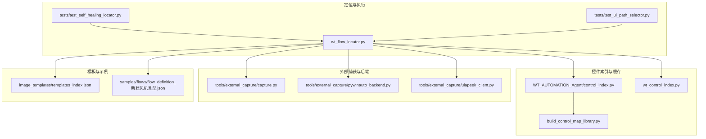
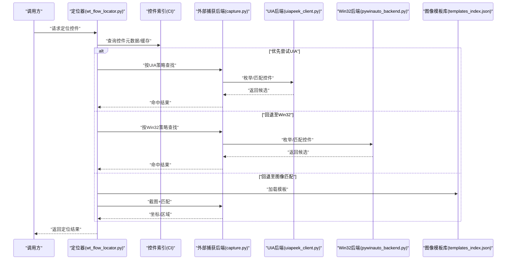
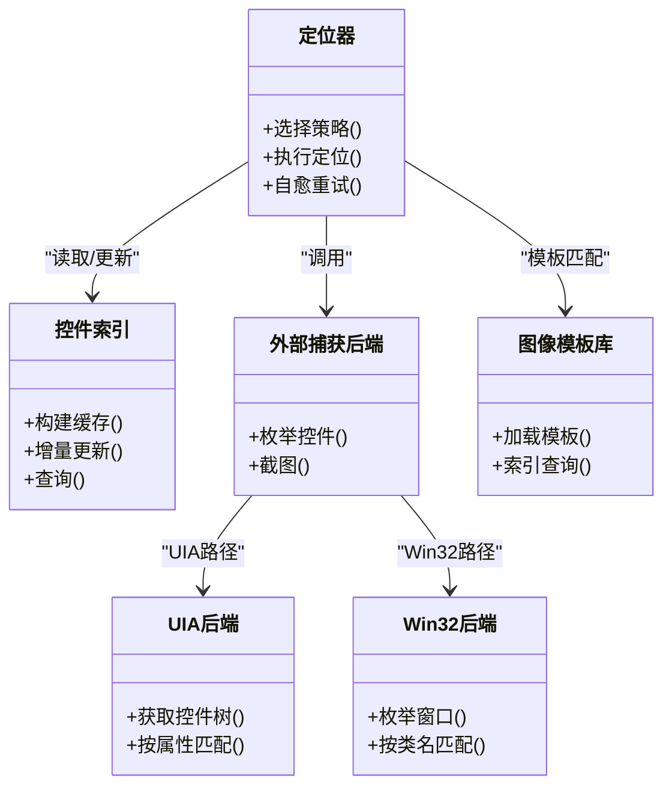

# 控件定位策略

<cite>
**本文引用的文件**   
- [wt_flow_locator.py](file://wt_flow_locator.py)
- [control_index.py](file://WT_AUTOMATION_Agent/control_index.py)
- [wt_control_index.py](file://wt_control_index.py)
- [test_self_healing_locator.py](file://tests/test_self_healing_locator.py)
- [test_ui_path_selector.py](file://tests/test_ui_path_selector.py)
- [build_control_map_library.py](file://build_control_map_library.py)
- [external_capture/capture.py](file://tools/external_capture/capture.py)
- [external_capture/pywinauto_backend.py](file://tools/external_capture/pywinauto_backend.py)
- [external_capture/uiapeek_client.py](file://tools/external_capture/uiapeek_client.py)
- [image_templates/templates_index.json](file://image_templates/templates_index.json)
- [flow_definition_新建风机类型.json](file://samples/flows/flow_definition_新建风机类型.json)
</cite>

## 目录
1. [简介](#简介)
2. [项目结构](#项目结构)
3. [核心组件](#核心组件)
4. [架构总览](#架构总览)
5. [详细组件分析](#详细组件分析)
6. [依赖关系分析](#依赖关系分析)
7. [性能考量](#性能考量)
8. [故障排查指南](#故障排查指南)
9. [结论](#结论)
10. [附录](#附录)

## 简介
本文件系统性阐述WT自动化框架中的控件定位策略体系，覆盖以下四类方法：
- UIA（UI Automation）定位：基于Windows UI自动化接口，适用于现代WPF与部分Win32应用。
- Win32定位：直接操作Windows API，适用于传统Win32应用程序。
- 图像匹配：使用OpenCV进行像素级对比，适用于无法通过API访问的控件或界面元素。
- 相对位置定位：基于控件间的空间关系，提高定位鲁棒性。

文档同时说明各策略的优缺点、性能特征与使用建议，并深入解析控件索引系统的缓存机制与更新策略，最后给出实际案例与复杂场景的组合方案。

## 项目结构
围绕“控件定位”的核心代码主要分布在如下模块：
- 定位器与执行层：wt_flow_locator.py
- 控件索引与缓存：WT_AUTOMATION_Agent/control_index.py、wt_control_index.py
- 外部捕获与后端桥接：tools/external_capture/*.py
- 模板库与索引：image_templates/templates_index.json
- 用例与回归测试：tests/*locator*.py
- 构建与示例：build_control_map_library.py、samples/flows/*.json

图表来源
- [wt_flow_locator.py](file://wt_flow_locator.py)
- [WT_AUTOMATION_Agent/control_index.py](file://WT_AUTOMATION_Agent/control_index.py)
- [wt_control_index.py](file://wt_control_index.py)
- [tools/external_capture/capture.py](file://tools/external_capture/capture.py)
- [tools/external_capture/pywinauto_backend.py](file://tools/external_capture/pywinauto_backend.py)
- [tools/external_capture/uiapeek_client.py](file://tools/external_capture/uiapeek_client.py)
- [image_templates/templates_index.json](file://image_templates/templates_index.json)
- [samples/flows/flow_definition_新建风机类型.json](file://samples/flows/flow_definition_新建风机类型.json)

章节来源
- [wt_flow_locator.py](file://wt_flow_locator.py)
- [WT_AUTOMATION_Agent/control_index.py](file://WT_AUTOMATION_Agent/control_index.py)
- [wt_control_index.py](file://wt_control_index.py)
- [tools/external_capture/capture.py](file://tools/external_capture/capture.py)
- [tools/external_capture/pywinauto_backend.py](file://tools/external_capture/pywinauto_backend.py)
- [tools/external_capture/uiapeek_client.py](file://tools/external_capture/uiapeek_client.py)
- [image_templates/templates_index.json](file://image_templates/templates_index.json)
- [samples/flows/flow_definition_新建风机类型.json](file://samples/flows/flow_definition_新建风机类型.json)

## 核心组件
- 定位器协调器：负责根据动作定义选择具体定位策略，串联UIA、Win32、图像匹配与相对位置等路径，并提供重试与自愈逻辑。
- 控件索引系统：维护窗口/控件树快照、属性索引与模板映射，提供快速查找与增量更新能力。
- 外部捕获后端：封装对UIA与Win32后端的调用，屏蔽底层差异，向上层提供统一接口。
- 图像模板库：集中管理模板图片与索引，供图像匹配策略检索与加载。
- 流程定义与示例：以JSON描述动作序列，驱动定位器执行不同策略组合。

章节来源
- [wt_flow_locator.py](file://wt_flow_locator.py)
- [WT_AUTOMATION_Agent/control_index.py](file://WT_AUTOMATION_Agent/control_index.py)
- [wt_control_index.py](file://wt_control_index.py)
- [tools/external_capture/capture.py](file://tools/external_capture/capture.py)
- [tools/external_capture/pywinauto_backend.py](file://tools/external_capture/pywinauto_backend.py)
- [tools/external_capture/uiapeek_client.py](file://tools/external_capture/uiapeek_client.py)
- [image_templates/templates_index.json](file://image_templates/templates_index.json)
- [samples/flows/flow_definition_新建风机类型.json](file://samples/flows/flow_definition_新建风机类型.json)

## 架构总览
下图展示了定位器与各子系统之间的交互关系，以及数据与控制流。

图表来源
- [wt_flow_locator.py](file://wt_flow_locator.py)
- [tools/external_capture/capture.py](file://tools/external_capture/capture.py)
- [tools/external_capture/uiapeek_client.py](file://tools/external_capture/uiapeek_client.py)
- [tools/external_capture/pywinauto_backend.py](file://tools/external_capture/pywinauto_backend.py)
- [image_templates/templates_index.json](file://image_templates/templates_index.json)

## 详细组件分析

### UIA（UI Automation）定位
- 原理：通过Windows UI Automation接口遍历目标进程控件树，依据名称、类名、角色、自动化ID等属性进行匹配。
- 适用场景：现代WPF应用、支持UIA的Win32控件；需要语义化定位与高稳定性。
- 优点：
  - 语义化强，抗布局变化能力强。
  - 可获取丰富属性，便于二次校验。
- 缺点：
  - 对未暴露UIA信息的控件无效。
  - 在大量控件树时枚举开销较大。
- 性能特征：
  - 首次枚举较慢，后续可通过索引缓存加速。
  - 深度遍历与过滤条件会影响耗时。
- 使用建议：
  - 优先作为默认策略。
  - 结合控件索引减少重复枚举。
  - 为关键控件补充稳定标识（如AutomationId）。

章节来源
- [tools/external_capture/uiapeek_client.py](file://tools/external_capture/uiapeek_client.py)
- [tools/external_capture/capture.py](file://tools/external_capture/capture.py)
- [WT_AUTOMATION_Agent/control_index.py](file://WT_AUTOMATION_Agent/control_index.py)

### Win32定位
- 原理：直接调用Windows API枚举窗口句柄与子控件，基于类名、标题、层级等匹配。
- 适用场景：传统Win32应用、不支持UIA的老旧控件。
- 优点：
  - 兼容性强，覆盖面广。
  - 在某些场景下比UIA更快。
- 缺点：
  - 属性较少，易受UI主题/语言影响。
  - 对动态生成的控件不够稳健。
- 性能特征：
  - 枚举速度通常优于UIA，但需避免过度递归。
- 使用建议：
  - 当UIA不可用时回退到Win32。
  - 尽量限定搜索范围（父窗口、类名）。

章节来源
- [tools/external_capture/pywinauto_backend.py](file://tools/external_capture/pywinauto_backend.py)
- [tools/external_capture/capture.py](file://tools/external_capture/capture.py)
- [WT_AUTOMATION_Agent/control_index.py](file://WT_AUTOMATION_Agent/control_index.py)

### 图像匹配（OpenCV）
- 原理：从屏幕或窗口区域截取图像，与模板库中的模板进行像素级相似度匹配，返回最佳匹配位置。
- 适用场景：无法通过API访问的控件、游戏/自定义绘制界面、第三方黑盒软件。
- 优点：
  - 不依赖控件树，通用性强。
  - 适合图标、按钮等视觉稳定的元素。
- 缺点：
  - 受分辨率、缩放、主题、动画影响大。
  - 计算开销较高，需控制模板数量与尺寸。
- 性能特征：
  - 多尺度匹配与ROI裁剪可显著降低耗时。
  - 模板预编译与缓存能提升命中率与速度。
- 使用建议：
  - 仅作为最后手段或辅助验证。
  - 建立高质量模板库，定期更新。
  - 限制匹配区域，避免全屏扫描。

章节来源
- [tools/external_capture/capture.py](file://tools/external_capture/capture.py)
- [image_templates/templates_index.json](file://image_templates/templates_index.json)
- [WT_AUTOMATION_Agent/control_index.py](file://WT_AUTOMATION_Agent/control_index.py)

### 相对位置定位
- 原理：先定位一个已知锚点控件，再基于其相对偏移（上/下/左/右、行列、距离阈值）寻找目标控件。
- 适用场景：列表项、表格行、分组容器内控件；布局相对稳定但绝对属性不稳定。
- 优点：
  - 对局部变化鲁棒，无需精确属性。
  - 可与UIA/Win32组合，增强稳定性。
- 缺点：
  - 依赖锚点稳定；若锚点漂移则整体失效。
  - 需要合理设定容差与方向约束。
- 性能特征：
  - 通常在已定位锚点附近小范围搜索，开销较低。
- 使用建议：
  - 优先选择语义明确的锚点（如列头、分组标题）。
  - 设置合理的容差与最大步长。
  - 与索引缓存配合，避免重复枚举。

章节来源
- [wt_flow_locator.py](file://wt_flow_locator.py)
- [WT_AUTOMATION_Agent/control_index.py](file://WT_AUTOMATION_Agent/control_index.py)
- [tests/test_ui_path_selector.py](file://tests/test_ui_path_selector.py)

### 控件索引系统与缓存机制
- 职责：
  - 维护窗口/控件树快照、属性索引、模板映射。
  - 提供快速查找、增量更新与失效策略。
- 缓存策略：
  - 按窗口/进程维度缓存控件树与关键属性。
  - 变更检测触发增量重建，避免全量刷新。
  - 模板库与索引分离，按需加载。
- 更新策略：
  - 定时或事件驱动的刷新。
  - 失败重试与降级回退。
- 复杂度：
  - 首次构建O(N)（N为控件数），后续增量更新近似O(k)（k为变更控件数）。
- 优化建议：
  - 限制缓存粒度（仅关键窗口）。
  - 合并相似属性以减少冗余。
  - 异步构建与懒加载。

章节来源
- [WT_AUTOMATION_Agent/control_index.py](file://WT_AUTOMATION_Agent/control_index.py)
- [wt_control_index.py](file://wt_control_index.py)
- [build_control_map_library.py](file://build_control_map_library.py)

### 自愈与重试策略
- 自愈流程：
  - 首选UIA → 回退Win32 → 回退图像匹配 → 相对位置修正。
  - 每次失败记录上下文，逐步放宽条件或切换策略。
- 重试机制：
  - 指数退避与最大重试次数。
  - 针对特定错误码/异常分类处理。
- 效果：
  - 显著提升在动态UI、延迟加载场景下的成功率。

章节来源
- [wt_flow_locator.py](file://wt_flow_locator.py)
- [tests/test_self_healing_locator.py](file://tests/test_self_healing_locator.py)

### 实际案例与组合方案
- 案例一：WPF主面板按钮点击
  - 策略：UIA优先 + 索引缓存 + 相对位置微调。
  - 步骤：通过UIA定位父容器 → 使用索引快速筛选 → 相对偏移确认目标按钮。
- 案例二：传统Win32对话框输入框
  - 策略：Win32定位 + 相对位置。
  - 步骤：定位对话框窗口 → 按类名/标题匹配输入框 → 相对父窗口左上角偏移校验。
- 案例三：第三方黑盒软件的导出按钮
  - 策略：图像匹配 + 锚点辅助。
  - 步骤：以菜单项为锚点 → 在其右下区域进行模板匹配 → 命中后执行点击。
- 案例四：动态列表项选择
  - 策略：UIA/Win32 + 相对位置。
  - 步骤：定位表头锚点 → 向下偏移n行 → 向右偏移m列 → 点击单元格。

章节来源
- [samples/flows/flow_definition_新建风机类型.json](file://samples/flows/flow_definition_新建风机类型.json)
- [wt_flow_locator.py](file://wt_flow_locator.py)
- [WT_AUTOMATION_Agent/control_index.py](file://WT_AUTOMATION_Agent/control_index.py)

## 依赖关系分析
定位器与后端、索引、模板库之间的依赖如下：

图表来源
- [wt_flow_locator.py](file://wt_flow_locator.py)
- [WT_AUTOMATION_Agent/control_index.py](file://WT_AUTOMATION_Agent/control_index.py)
- [tools/external_capture/capture.py](file://tools/external_capture/capture.py)
- [tools/external_capture/uiapeek_client.py](file://tools/external_capture/uiapeek_client.py)
- [tools/external_capture/pywinauto_backend.py](file://tools/external_capture/pywinauto_backend.py)
- [image_templates/templates_index.json](file://image_templates/templates_index.json)

章节来源
- [wt_flow_locator.py](file://wt_flow_locator.py)
- [WT_AUTOMATION_Agent/control_index.py](file://WT_AUTOMATION_Agent/control_index.py)
- [tools/external_capture/capture.py](file://tools/external_capture/capture.py)
- [tools/external_capture/uiapeek_client.py](file://tools/external_capture/uiapeek_client.py)
- [tools/external_capture/pywinauto_backend.py](file://tools/external_capture/pywinauto_backend.py)
- [image_templates/templates_index.json](file://image_templates/templates_index.json)

## 性能考量
- UIA枚举成本：
  - 建议启用控件索引缓存，避免重复遍历。
  - 缩小搜索域（限定父窗口/类名）。
- Win32枚举成本：
  - 避免深层递归，必要时分层枚举。
- 图像匹配成本：
  - 使用ROI裁剪、多尺度降采样、模板去重。
  - 将模板按区域分区，减少全局扫描。
- 相对位置成本：
  - 在锚点附近小范围搜索，设置合理容差。
- 自愈重试：
  - 采用指数退避，避免风暴式重试。
  - 区分瞬态错误与结构性错误，及时降级。

[本节为通用指导，不直接分析具体文件]

## 故障排查指南
- UIA不可用：
  - 检查目标进程是否暴露UIA信息。
  - 回退至Win32或图像匹配。
- Win32匹配失败：
  - 核对类名/标题是否随语言/主题变化。
  - 增加相对位置校验。
- 图像匹配误报：
  - 调整相似度阈值与模板质量。
  - 引入锚点与ROI限制。
- 索引不一致：
  - 强制重建索引或增量更新。
  - 检查变更检测触发条件。
- 自愈未生效：
  - 查看重试日志与降级路径。
  - 调整策略优先级与容差参数。

章节来源
- [tests/test_self_healing_locator.py](file://tests/test_self_healing_locator.py)
- [wt_flow_locator.py](file://wt_flow_locator.py)
- [WT_AUTOMATION_Agent/control_index.py](file://WT_AUTOMATION_Agent/control_index.py)

## 结论
WT自动化框架的控件定位策略以“UIA优先、Win32回退、图像兜底、相对位置增强”为核心思想，结合控件索引缓存与自愈重试机制，兼顾稳定性与性能。在实际工程中，应根据应用特性与界面形态选择合适的策略组合，并通过模板库与索引持续优化，以获得最佳的自动化体验。

[本节为总结性内容，不直接分析具体文件]

## 附录
- 术语
  - UIA：Windows UI Automation，用于现代应用的语义化控件访问。
  - Win32：传统Windows API，用于底层窗口与控件枚举。
  - ROI：感兴趣区域，用于限制图像匹配范围。
  - 自愈：自动检测失败并切换策略或重试的能力。
- 参考实现路径
  - 定位器入口与策略编排：[wt_flow_locator.py](file://wt_flow_locator.py)
  - 控件索引与缓存：[WT_AUTOMATION_Agent/control_index.py](file://WT_AUTOMATION_Agent/control_index.py)、[wt_control_index.py](file://wt_control_index.py)
  - 外部捕获与后端：[tools/external_capture/capture.py](file://tools/external_capture/capture.py)、[tools/external_capture/uiapeek_client.py](file://tools/external_capture/uiapeek_client.py)、[tools/external_capture/pywinauto_backend.py](file://tools/external_capture/pywinauto_backend.py)
  - 模板库索引：[image_templates/templates_index.json](file://image_templates/templates_index.json)
  - 流程示例：[samples/flows/flow_definition_新建风机类型.json](file://samples/flows/flow_definition_新建风机类型.json)