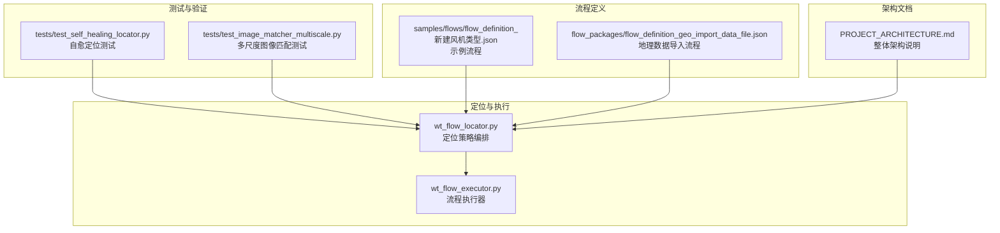
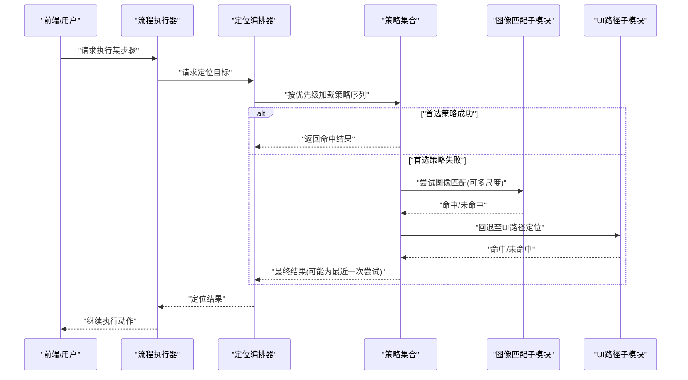
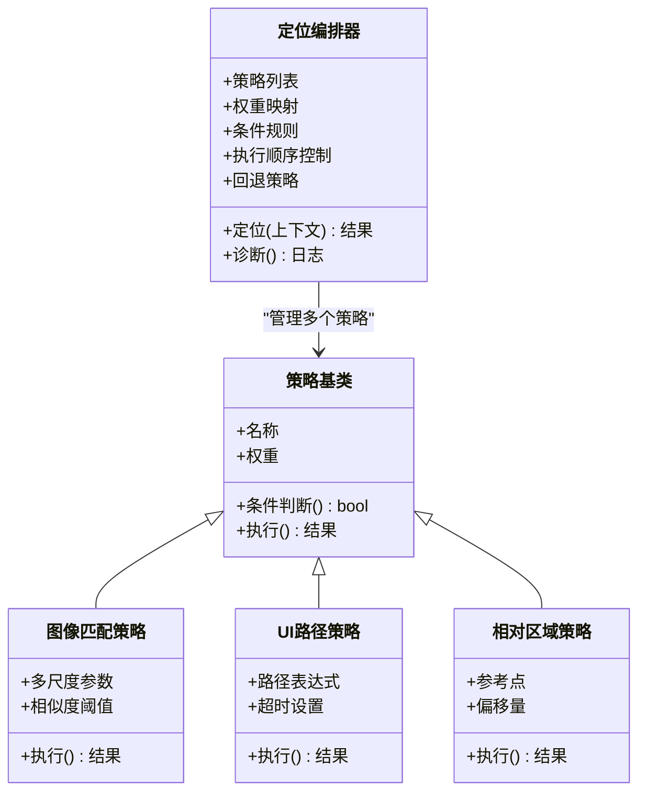
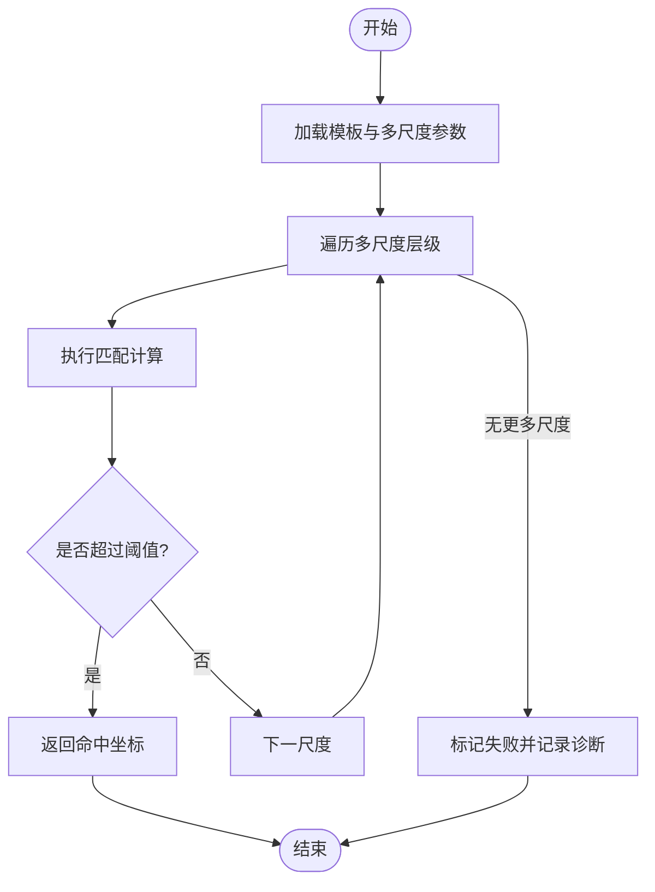
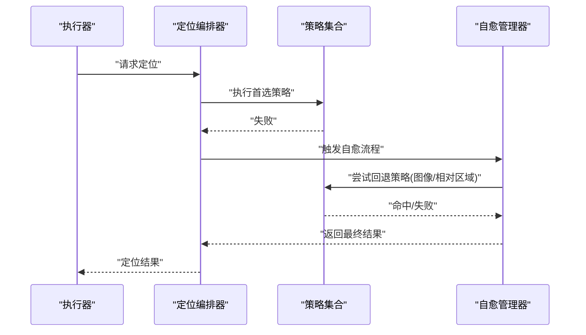
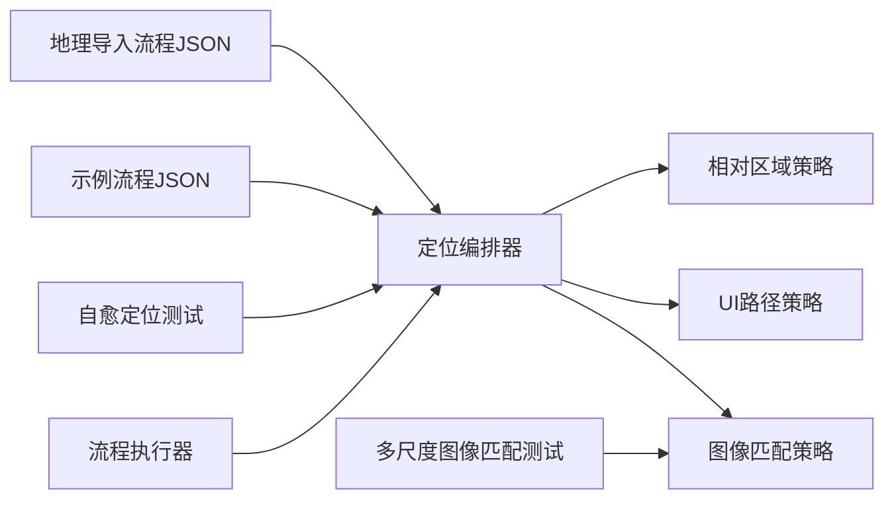

# 混合定位策略

<cite>
**本文引用的文件**   
- [wt_flow_locator.py](file://wt_flow_locator.py)
- [test_self_healing_locator.py](file://tests/test_self_healing_locator.py)
- [test_image_matcher_multiscale.py](file://tests/test_image匹配器_multiscale.py)
- [flow_definition_新建风机类型.json](file://samples/flows/flow_definition_新建风机类型.json)
- [flow_definition_geo_import_data_file.json](file://flow_packages/flow_definition_geo_import_data_file.json)
- [PROJECT_ARCHITECTURE.md](file://PROJECT_ARCHITECTURE.md)
</cite>

## 目录
1. [引言](#引言)
2. [项目结构](#项目结构)
3. [核心组件](#核心组件)
4. [架构总览](#架构总览)
5. [详细组件分析](#详细组件分析)
6. [依赖关系分析](#依赖关系分析)
7. [性能考量](#性能考量)
8. [故障排查指南](#故障排查指南)
9. [结论](#结论)
10. [附录](#附录)

## 引言
本文件围绕“混合定位策略”的设计与实现进行深入说明，重点阐述多种定位策略的组合使用模式（优先级排序、回退机制、智能选择算法），并解释其优势：提高定位成功率、增强系统鲁棒性、适应复杂应用场景。同时给出配置方法（权重设置、条件判断逻辑、执行顺序控制）、实际案例（从简单到复杂的渐进式组合方案）以及性能分析与优化建议。

## 项目结构
WT自动化项目中与定位相关的核心代码集中在流程定位模块与测试用例中，并通过示例流程定义展示在真实业务场景中的组合用法。

图表来源
- [wt_flow_locator.py](file://wt_flow_locator.py)
- [test_self_healing_locator.py](file://tests/test_self_healing_locator.py)
- [test_image_matcher_multiscale.py](file://tests/test_image匹配器_multiscale.py)
- [flow_definition_新建风机类型.json](file://samples/flows/flow_definition_新建风机类型.json)
- [flow_definition_geo_import_data_file.json](file://flow_packages/flow_definition_geo_import_data_file.json)
- [PROJECT_ARCHITECTURE.md](file://PROJECT_ARCHITECTURE.md)

章节来源
- [PROJECT_ARCHITECTURE.md](file://PROJECT_ARCHITECTURE.md)

## 核心组件
- 定位编排器：负责将多种定位策略按优先级与条件进行编排，支持回退与重试，提供统一的定位接口供上层调用。
- 策略插件：包括UI路径定位、图像模板匹配（含多尺度）、相对区域定位等，各自实现独立的成功/失败判定与结果返回。
- 执行器集成：流程执行器在触发动作前调用定位编排器获取目标控件或屏幕区域，确保动作的稳定性。
- 测试与回归：针对自愈定位与多尺度图像匹配提供专项测试，保障策略组合在不同环境下的可靠性。

章节来源
- [wt_flow_locator.py](file://wt_flow_locator.py)
- [test_self_healing_locator.py](file://tests/test_self_healing_locator.py)
- [test_image_matcher_multiscale.py](file://tests/test_image匹配器_multiscale.py)

## 架构总览
混合定位策略的整体架构由“策略层—编排层—执行层”构成。策略层提供多种定位能力；编排层根据配置与上下文动态选择策略序列，并在失败时自动回退；执行层将定位结果用于后续操作。

图表来源
- [wt_flow_locator.py](file://wt_flow_locator.py)
- [test_image_matcher_multiscale.py](file://tests/test_image匹配器_multiscale.py)

## 详细组件分析

### 组件A：定位编排器（混合策略中枢）
- 职责
  - 维护策略清单与优先级顺序
  - 解析策略权重与条件判断逻辑
  - 执行顺序控制与回退机制
  - 统一返回定位结果与诊断信息
- 关键行为
  - 初始化阶段读取配置，构建策略链
  - 运行时依据上下文（窗口状态、元素可见性、图像相似度阈值）动态调整策略顺序
  - 失败时记录中间状态，便于回溯与调优
- 复杂度
  - 时间复杂度：O(n) 其中n为策略数量（线性遍历）
  - 空间复杂度：O(k) 其中k为缓存的策略元数据大小

图表来源
- [wt_flow_locator.py](file://wt_flow_locator.py)

章节来源
- [wt_flow_locator.py](file://wt_flow_locator.py)

### 组件B：图像匹配策略（多尺度与阈值）
- 设计要点
  - 多尺度模板匹配提升对分辨率变化与缩放差异的鲁棒性
  - 相似度阈值可调，平衡召回率与误报率
  - 失败时可结合裁剪与局部搜索降低计算开销
- 适用场景
  - 动态界面、主题切换、不同DPI设备
  - 文本渲染差异导致的UI路径不稳定

图表来源
- [test_image_matcher_multiscale.py](file://tests/test_image匹配器_multiscale.py)

章节来源
- [test_image_matcher_multiscale.py](file://tests/test_image匹配器_multiscale.py)

### 组件C：UI路径策略（稳定路径优先）
- 设计要点
  - 基于稳定的UI树路径或属性组合定位
  - 支持超时与重试，避免瞬时不可用导致失败
  - 当路径失效时快速回退到其他策略
- 适用场景
  - 传统Win32/WPF控件树稳定且可枚举的场景
  - 需要高确定性的交互流程

章节来源
- [wt_flow_locator.py](file://wt_flow_locator.py)

### 组件D：相对区域策略（以参考点为中心）
- 设计要点
  - 通过已知参考点与偏移量定位目标区域
  - 适合布局固定但绝对位置变化的界面
  - 可与图像匹配结合，先缩小搜索范围再精确匹配
- 适用场景
  - 表格行、列表项、分组面板等重复结构的定位

章节来源
- [wt_flow_locator.py](file://wt_flow_locator.py)

### 组件E：自愈定位（失败恢复与自适应）
- 设计要点
  - 在定位失败后自动尝试替代策略或放宽条件
  - 记录失败原因与上下文快照，辅助问题定位
  - 支持人工干预注入新的策略或修正参数
- 适用场景
  - 复杂应用在不同版本或环境下出现轻微差异

图表来源
- [test_self_healing_locator.py](file://tests/test_self_healing_locator.py)

章节来源
- [test_self_healing_locator.py](file://tests/test_self_healing_locator.py)

## 依赖关系分析
- 直接依赖
  - 定位编排器依赖各策略实现与图像匹配子模块
  - 执行器依赖定位编排器提供的统一接口
- 间接依赖
  - 测试用例驱动策略组合的正确性与鲁棒性
  - 流程定义JSON作为输入，驱动策略的选择与参数化

图表来源
- [wt_flow_locator.py](file://wt_flow_locator.py)
- [test_self_healing_locator.py](file://tests/test_self_healing_locator.py)
- [test_image_matcher_multiscale.py](file://tests/test_image匹配器_multiscale.py)
- [flow_definition_新建风机类型.json](file://samples/flows/flow_definition_新建风机类型.json)
- [flow_definition_geo_import_data_file.json](file://flow_packages/flow_definition_geo_import_data_file.json)

章节来源
- [wt_flow_locator.py](file://wt_flow_locator.py)
- [flow_definition_新建风机类型.json](file://samples/flows/flow_definition_新建风机类型.json)
- [flow_definition_geo_import_data_file.json](file://flow_packages/flow_definition_geo_import_data_file.json)

## 性能考量
- 策略顺序优化
  - 将低成本、高命中率的策略置于前面（如UI路径），减少不必要的图像匹配开销
- 多尺度匹配优化
  - 合理设置尺度步长与最大层级，避免过细粒度带来的计算压力
  - 引入预裁剪与ROI限制，缩小搜索区域
- 缓存与复用
  - 缓存常用模板与UI路径解析结果，减少重复计算
- 超时与重试
  - 为每个策略设置合理的超时与重试次数，避免长时间阻塞
- 资源监控
  - 记录CPU与内存占用，识别热点策略并进行针对性优化

[本节为通用指导，不直接分析具体文件]

## 故障排查指南
- 常见问题
  - 图像匹配命中率低：检查模板质量、相似度阈值与多尺度参数
  - UI路径不稳定：确认控件树是否变化，必要时增加容错或回退策略
  - 相对区域偏移错误：核对参考点与偏移量的坐标系一致性
- 诊断手段
  - 启用定位编排器的诊断输出，查看每次尝试的策略、参数与结果
  - 保存失败时的屏幕截图与控件树快照，便于离线分析
- 修复建议
  - 调整策略权重与条件判断逻辑，使更可靠的策略优先
  - 引入自愈流程，自动尝试替代方案并记录根因

章节来源
- [test_self_healing_locator.py](file://tests/test_self_healing_locator.py)
- [test_image_matcher_multiscale.py](file://tests/test_image匹配器_multiscale.py)

## 结论
混合定位策略通过多策略协同、优先级排序与回退机制，显著提升了定位成功率与系统鲁棒性。在实际应用中，应结合业务场景选择合适的策略组合，并通过权重与条件逻辑精细化控制执行顺序。配合自愈定位与完善的诊断输出，可在复杂环境中保持稳定的自动化体验。

[本节为总结性内容，不直接分析具体文件]

## 附录
- 配置方法建议
  - 策略权重：为每种策略分配权重，影响其在失败后的回退顺序
  - 条件判断：基于上下文（窗口标题、控件可见性、图像相似度）决定是否启用某策略
  - 执行顺序：默认按权重降序执行，支持手动指定固定顺序
- 实际案例
  - 简单组合：UI路径优先，失败回退至图像匹配
  - 中等组合：加入相对区域策略，先缩小搜索范围再进行图像匹配
  - 复杂组合：多尺度图像匹配+自愈流程，结合诊断输出持续优化

章节来源
- [flow_definition_新建风机类型.json](file://samples/flows/flow_definition_新建风机类型.json)
- [flow_definition_geo_import_data_file.json](file://flow_packages/flow_definition_geo_import_data_file.json)