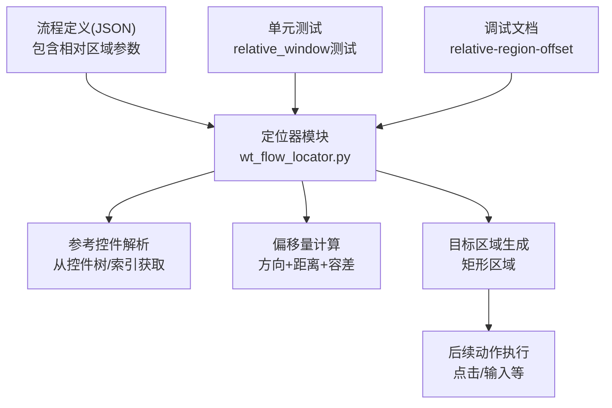
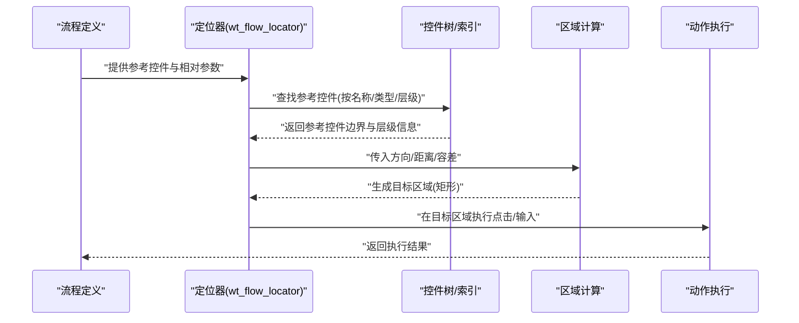
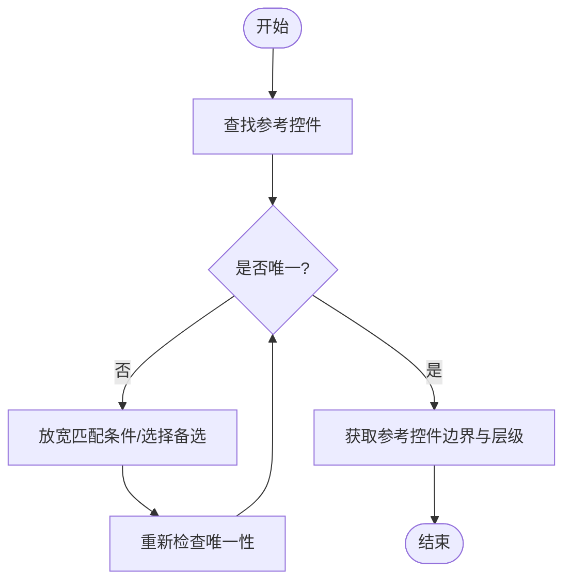
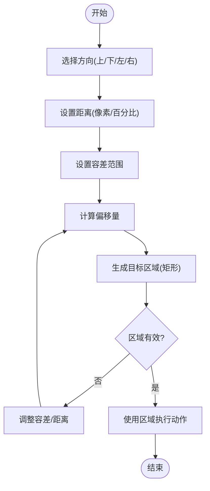
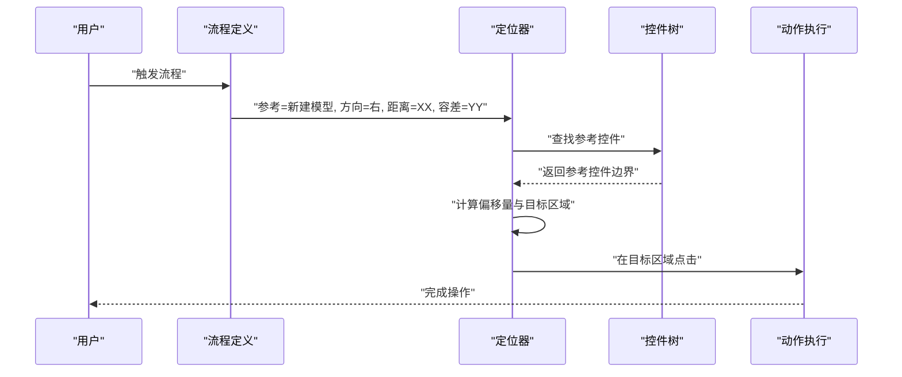
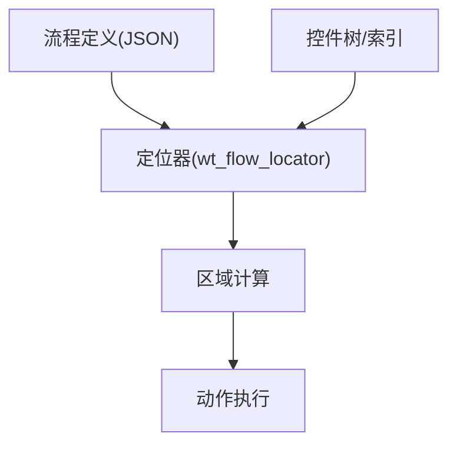

# 相对位置定位

<cite>
**本文引用的文件**   
- [wt_flow_locator.py](file://wt_flow_locator.py)
- [test_wt_flow_locator_relative_window.py](file://tests/test_wt_flow_locator_relative_window.py)
- [debug-relative-region-offset.md](file://debug-relative-region-offset.md)
- [flow_definition_创建一个新建模.json](file://flow_packages/flow_definition_创建一个新建模.json)
- [library_主面板_WPF_controls.json](file://control_maps/library_主面板_WPF_controls.json)
</cite>

## 目录
1. [简介](#简介)
2. [项目结构](#项目结构)
3. [核心组件](#核心组件)
4. [架构总览](#架构总览)
5. [详细组件分析](#详细组件分析)
6. [依赖关系分析](#依赖关系分析)
7. [性能考虑](#性能考虑)
8. [故障排查指南](#故障排查指南)
9. [结论](#结论)
10. [附录](#附录)

## 简介
本章节聚焦“相对位置定位策略”的设计思想与实现机制，围绕控件间空间关系进行精确定位。其核心思路是：以某个已知或易定位的“参考控件”为锚点，结合方向、距离与容差等参数，计算目标控件的区域并执行交互。该策略的优势在于：
- 提高鲁棒性：在界面微调、分辨率变化时仍能稳定命中目标
- 适应布局变化：通过相对偏移和容差降低对绝对坐标的依赖
- 减少硬编码：避免写死像素级坐标，提升可维护性与跨环境适配能力

## 项目结构
与相对位置定位相关的代码主要分布在以下位置：
- 定位器实现与入口：wt_flow_locator.py
- 单元测试用例：tests/test_wt_flow_locator_relative_window.py
- 调试记录与问题复盘：debug-relative-region-offset.md
- 流程定义示例（含相对区域配置）：flow_packages/flow_definition_创建一个新建模.json
- 控件库映射（用于辅助理解控件树与层级）：control_maps/library_主面板_WPF_controls.json

图表来源
- [wt_flow_locator.py](file://wt_flow_locator.py)
- [test_wt_flow_locator_relative_window.py](file://tests/test_wt_flow_locator_relative_window.py)
- [debug-relative-region-offset.md](file://debug-relative-region-offset.md)
- [flow_definition_创建一个新建模.json](file://flow_packages/flow_definition_创建一个新建模.json)

章节来源
- [wt_flow_locator.py](file://wt_flow_locator.py)
- [test_wt_flow_locator_relative_window.py](file://tests/test_wt_flow_locator_relative_window.py)
- [debug-relative-region-offset.md](file://debug-relative-region-offset.md)
- [flow_definition_创建一个新建模.json](file://flow_packages/flow_definition_创建一个新建模.json)
- [library_主面板_WPF_controls.json](file://control_maps/library_主面板_WPF_controls.json)

## 核心组件
- 参考控件选择：优先选择文本明确、层级稳定的父节点作为锚点，确保在不同窗口状态下的稳定性
- 相对区域参数：包括方向（上/下/左/右）、距离（像素或百分比）、容差范围（允许偏差）
- 偏移量计算：根据参考控件边界与方向，计算候选区域；再叠加距离与容差得到最终目标区域
- 层级关系判断：在多层级控件树中，依据父子、兄弟、祖先-后代关系缩小搜索范围，提升命中率与性能
- 区域定位与命中：将计算得到的矩形区域映射到屏幕或窗口坐标系，执行点击、输入等操作

章节来源
- [wt_flow_locator.py](file://wt_flow_locator.py)
- [test_wt_flow_locator_relative_window.py](file://tests/test_wt_flow_locator_relative_window.py)

## 架构总览
相对位置定位的整体流程如下：
- 输入：流程定义中的相对区域参数（方向、距离、容差）以及参考控件标识
- 处理：解析参考控件、计算偏移量、生成目标区域、校验层级关系
- 输出：目标控件区域及后续动作的执行结果

图表来源
- [wt_flow_locator.py](file://wt_flow_locator.py)
- [flow_definition_创建一个新建模.json](file://flow_packages/flow_definition_创建一个新建模.json)

## 详细组件分析

### 参考控件解析与层级关系判断
- 参考控件解析：支持通过名称、类型、层级路径等多维度匹配，优先选择唯一且稳定的控件
- 层级关系判断：在复杂控件树中，利用父子、兄弟、祖先-后代关系快速收敛候选集合，避免全树扫描
- 失败回退：当参考控件不唯一或不可用时，尝试放宽匹配条件或切换备选参考控件

图表来源
- [wt_flow_locator.py](file://wt_flow_locator.py)

章节来源
- [wt_flow_locator.py](file://wt_flow_locator.py)

### 偏移量计算与区域定位
- 方向选择：上/下/左/右四个基本方向，可组合使用（如右上、左下）
- 距离设置：支持像素值或百分比（相对于参考控件尺寸或窗口尺寸）
- 容差范围：为应对渲染差异与DPI缩放，允许一定范围的偏差
- 区域生成：基于参考控件边界与方向，叠加距离与容差，得到最终矩形区域

图表来源
- [wt_flow_locator.py](file://wt_flow_locator.py)

章节来源
- [wt_flow_locator.py](file://wt_flow_locator.py)

### 实际案例：多层级控件树中的精确定位
- 场景描述：在主面板窗口中，先定位“新建模型”按钮，再在其右侧一定距离内寻找“确认”按钮
- 步骤要点：
  - 选择参考控件：“新建模型”按钮
  - 设置方向：右
  - 设置距离：例如若干像素或百分比
  - 设置容差：根据UI一致性调整
  - 生成区域并执行点击
- 效果：即使“确认”按钮随窗口大小变化而移动，也能稳定命中

图表来源
- [flow_definition_创建一个新建模.json](file://flow_packages/flow_definition_创建一个新建模.json)
- [library_主面板_WPF_controls.json](file://control_maps/library_主面板_WPF_controls.json)

章节来源
- [flow_definition_创建一个新建模.json](file://flow_packages/flow_definition_创建一个新建模.json)
- [library_主面板_WPF_controls.json](file://control_maps/library_主面板_WPF_controls.json)

### 配置方法：方向、距离与容差
- 方向选择：
  - 基本方向：上、下、左、右
  - 组合方向：右上、左下等（若实现支持）
- 距离设置：
  - 像素值：适用于固定布局
  - 百分比：适用于自适应布局
- 容差范围：
  - 小容差：提高精确度，但可能因渲染差异导致失败
  - 大容差：提高鲁棒性，但可能扩大误命中风险
- 最佳实践：
  - 优先选择文本明确的参考控件
  - 使用百分比距离以适应不同分辨率
  - 逐步调优容差，平衡精度与鲁棒性

章节来源
- [wt_flow_locator.py](file://wt_flow_locator.py)
- [flow_definition_创建一个新建模.json](file://flow_packages/flow_definition_创建一个新建模.json)

## 依赖关系分析
相对位置定位的核心依赖包括：
- 流程定义：提供相对区域参数与参考控件标识
- 控件树/索引：提供控件边界与层级信息
- 定位器模块：实现偏移量计算与区域生成
- 动作执行：在目标区域执行点击、输入等操作

图表来源
- [wt_flow_locator.py](file://wt_flow_locator.py)
- [flow_definition_创建一个新建模.json](file://flow_packages/flow_definition_创建一个新建模.json)

章节来源
- [wt_flow_locator.py](file://wt_flow_locator.py)
- [flow_definition_创建一个新建模.json](file://flow_packages/flow_definition_创建一个新建模.json)

## 性能考虑
- 控件树遍历优化：通过层级关系与索引快速收敛候选集合，避免全树扫描
- 区域计算缓存：对常用参考控件与偏移量组合进行缓存，减少重复计算
- 容差动态调整：根据历史成功率动态调整容差，提升命中率与效率
- 并行定位：在多目标场景中，并行计算多个候选区域，缩短整体耗时

[本节为通用指导，无需具体文件引用]

## 故障排查指南
- 常见问题：
  - 参考控件不唯一：放宽匹配条件或选择更具体的参考控件
  - 距离过大/过小：调整距离与容差，观察命中率变化
  - 层级关系错误：检查控件树结构，确保父子/兄弟关系正确
- 调试技巧：
  - 打印参考控件边界与目标区域，验证计算逻辑
  - 逐步缩小容差范围，定位误差来源
  - 使用单元测试覆盖典型场景，回归验证
- 相关资源：
  - 单元测试：tests/test_wt_flow_locator_relative_window.py
  - 调试记录：debug-relative-region-offset.md

章节来源
- [test_wt_flow_locator_relative_window.py](file://tests/test_wt_flow_locator_relative_window.py)
- [debug-relative-region-offset.md](file://debug-relative-region-offset.md)

## 结论
相对位置定位策略通过控件间空间关系实现稳健的目标定位，显著提升了自动化脚本的鲁棒性与可维护性。合理配置方向、距离与容差，并结合层级关系判断，可在复杂界面中实现精确定位。建议在实际项目中持续优化参数与算法，结合单元测试与调试工具，确保长期稳定运行。

[本节为总结性内容，无需具体文件引用]

## 附录
- 术语表：
  - 参考控件：用于计算偏移量的基准控件
  - 相对区域：基于参考控件与偏移量生成的目标区域
  - 容差：允许的偏差范围，用于应对渲染差异
- 参考文件：
  - wt_flow_locator.py：定位器核心实现
  - test_wt_flow_locator_relative_window.py：单元测试用例
  - debug-relative-region-offset.md：调试记录与问题复盘
  - flow_definition_创建一个新建模.json：流程定义示例
  - library_主面板_WPF_controls.json：控件库映射

[本节为补充信息，无需具体文件引用]