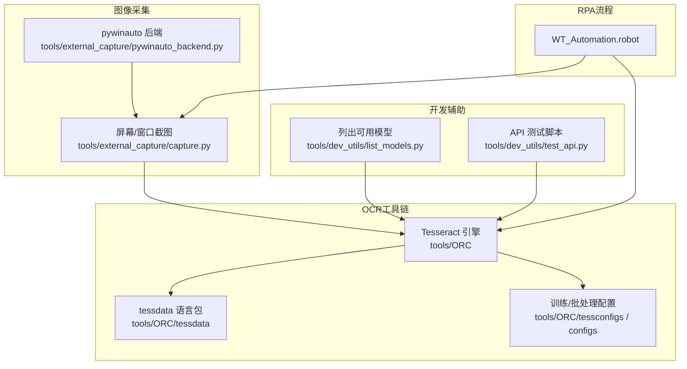
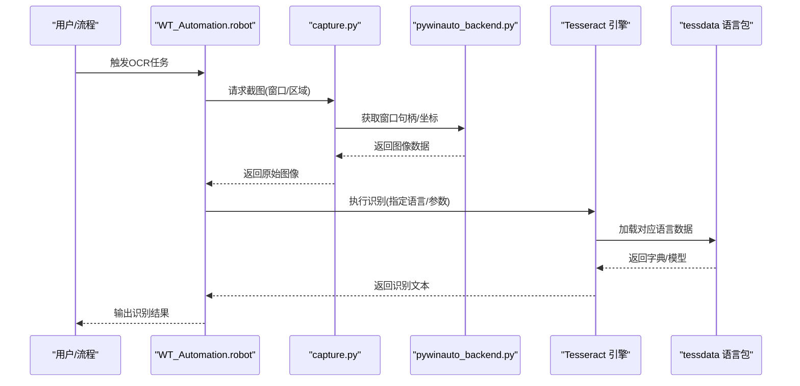
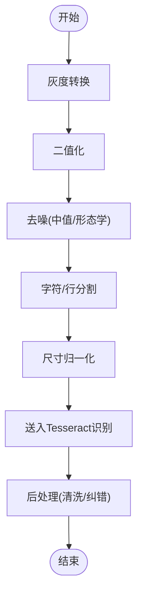
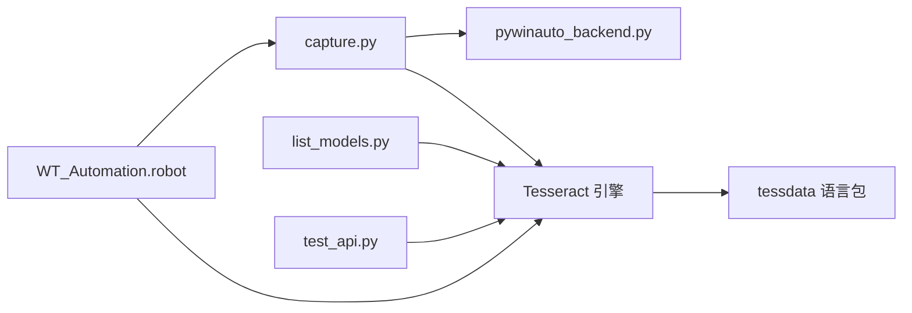

# OCR文本识别

<cite>
**本文引用的文件**   
- [tools/ORC/doc/README.md](file://tools/ORC/doc/README.md)
- [tools/dev_utils/list_models.py](file://tools/dev_utils/list_models.py)
- [tools/dev_utils/test_api.py](file://tools/dev_utils/test_api.py)
- [tools/external_capture/capture.py](file://tools/external_capture/capture.py)
- [tools/external_capture/pywinauto_backend.py](file://tools/external_capture/pywinauto_backend.py)
- [WT_Automation.robot](file://WT_Automation.robot)
</cite>

## 目录
1. [简介](#简介)
2. [项目结构](#项目结构)
3. [核心组件](#核心组件)
4. [架构总览](#架构总览)
5. [详细组件分析](#详细组件分析)
6. [依赖关系分析](#依赖关系分析)
7. [性能考虑](#性能考虑)
8. [故障排查指南](#故障排查指南)
9. [结论](#结论)
10. [附录](#附录)

## 简介
本文件聚焦于WT自动化框架中的OCR文本识别系统实现，围绕Tesseract OCR引擎的集成与配置、中文语言包安装与多语言支持、图像预处理流程（灰度转换、二值化、去噪、字符分割）、中文识别特殊处理机制（字体适配、编码处理、上下文理解），以及精度调优与常见问题诊断进行系统化说明。文档同时提供可操作的实践案例与排障方法，帮助读者在真实场景中稳定提升OCR准确率与性能。

## 项目结构
仓库中与OCR相关的资源主要分布在以下位置：
- tools/ORC：包含Tesseract工具链与文档，tessdata为语言数据目录，configs与tessconfigs为训练与批处理配置示例。
- tools/dev_utils：提供模型列表与API测试脚本，便于验证Tesseract环境是否就绪。
- tools/external_capture：提供截图与窗口捕获能力，可作为OCR输入图像的采集来源。
- WT_Automation.robot：RPA流程入口，可能调用OCR相关步骤或外部工具。

图表来源
- [tools/ORC/doc/README.md](file://tools/ORC/doc/README.md)
- [tools/dev_utils/list_models.py](file://tools/dev_utils/list_models.py)
- [tools/dev_utils/test_api.py](file://tools/dev_utils/test_api.py)
- [tools/external_capture/capture.py](file://tools/external_capture/capture.py)
- [tools/external_capture/pywinauto_backend.py](file://tools/external_capture/pywinauto_backend.py)
- [WT_Automation.robot](file://WT_Automation.robot)

章节来源
- [tools/ORC/doc/README.md](file://tools/ORC/doc/README.md)
- [tools/dev_utils/list_models.py](file://tools/dev_utils/list_models.py)
- [tools/dev_utils/test_api.py](file://tools/dev_utils/test_api.py)
- [tools/external_capture/capture.py](file://tools/external_capture/capture.py)
- [tools/external_capture/pywinauto_backend.py](file://tools/external_capture/pywinauto_backend.py)
- [WT_Automation.robot](file://WT_Automation.robot)

## 核心组件
- Tesseract OCR引擎与语言包
  - 通过tools/ORC目录提供的二进制与文档完成本地部署；语言数据存放于tessdata，支持多语言并行识别。
- 模型与配置管理
  - list_models.py用于枚举已安装的语言模型；test_api.py用于快速验证Tesseract API可用性。
- 图像采集与预处理
  - capture.py与pywinauto_backend.py负责从目标窗口或屏幕区域截取图像，作为OCR输入。
- RPA流程集成
  - WT_Automation.robot作为流程编排入口，可串联截图、OCR识别与后续业务动作。

章节来源
- [tools/dev_utils/list_models.py](file://tools/dev_utils/list_models.py)
- [tools/dev_utils/test_api.py](file://tools/dev_utils/test_api.py)
- [tools/external_capture/capture.py](file://tools/external_capture/capture.py)
- [tools/external_capture/pywinauto_backend.py](file://tools/external_capture/pywinauto_backend.py)
- [WT_Automation.robot](file://WT_Automation.robot)

## 架构总览
下图展示了从图像采集到OCR识别的整体流程，包括预处理、参数选择、结果后处理与错误回退路径。

图表来源
- [WT_Automation.robot](file://WT_Automation.robot)
- [tools/external_capture/capture.py](file://tools/external_capture/capture.py)
- [tools/external_capture/pywinauto_backend.py](file://tools/external_capture/pywinauto_backend.py)
- [tools/dev_utils/list_models.py](file://tools/dev_utils/list_models.py)
- [tools/dev_utils/test_api.py](file://tools/dev_utils/test_api.py)

## 详细组件分析

### Tesseract OCR集成与配置
- 安装与部署
  - 使用tools/ORC目录下的工具链与文档完成本地部署，确保tessdata路径正确且可读。
- 多语言支持
  - 将所需语言包放入tessdata目录，并通过list_models.py验证模型可见性。
- 识别参数调优
  - 结合test_api.py进行最小化验证，逐步调整PSM（页面分割模式）与OEM（引擎模式）等关键参数。
- 中文语言包
  - 将chi_sim/chi_tra等语言数据放置至tessdata，并在识别时指定lang=chi_sim或chi_tra。

章节来源
- [tools/ORC/doc/README.md](file://tools/ORC/doc/README.md)
- [tools/dev_utils/list_models.py](file://tools/dev_utils/list_models.py)
- [tools/dev_utils/test_api.py](file://tools/dev_utils/test_api.py)

### 图像预处理流程
- 灰度转换
  - 将彩色图像转换为灰度图，降低计算复杂度并突出文字对比度。
- 二值化
  - 采用自适应阈值或全局阈值进行二值化，增强字符边缘，利于后续分割。
- 噪声去除
  - 使用中值滤波、形态学开闭操作去除背景噪声与细线干扰。
- 字符分割
  - 基于投影轮廓或连通域分析进行行/字分割，提高单字识别稳定性。

[此图为概念流程图，不直接映射具体源码文件]

### 中文识别的特殊处理机制
- 字体适配
  - 针对常见UI字体（如微软雅黑、宋体）进行对比度增强与抗锯齿优化，减少笔画粘连。
- 字符编码处理
  - 统一输出UTF-8编码，避免乱码；对全角/半角标点进行规范化。
- 上下文理解
  - 结合领域词典与正则规则进行二次校验，修正常见错别字与数字误识。

章节来源
- [tools/dev_utils/test_api.py](file://tools/dev_utils/test_api.py)

### 识别精度调优实践案例
- 场景A：界面小字号文本识别
  - 策略：放大ROI、提高分辨率、启用自适应阈值、设置PSM=6（单文本块）。
- 场景B：复杂背景上的浅色文字
  - 策略：先做背景估计与减法、再二值化；尝试PSM=4（列变体）+OEM=1（LSTM）。
- 场景C：中英文混合
  - 策略：使用多语言组合（如eng+chi_sim），按段落切分分别识别，再合并。
- 评估方法
  - 使用test_api.py批量跑样本集，记录准确率与耗时，迭代参数直至达标。

章节来源
- [tools/dev_utils/test_api.py](file://tools/dev_utils/test_api.py)

### 常见问题诊断与解决方案
- 识别失败
  - 检查tessdata路径与权限；用list_models.py确认语言包可见；用test_api.py验证API连通。
- 乱码
  - 确认输出编码为UTF-8；检查源图像清晰度与对比度；必要时增加预处理强度。
- 性能问题
  - 缩小ROI、降低分辨率、减少语言集合；合理设置PSM/OEM；缓存常用模板与中间结果。

章节来源
- [tools/dev_utils/list_models.py](file://tools/dev_utils/list_models.py)
- [tools/dev_utils/test_api.py](file://tools/dev_utils/test_api.py)

## 依赖关系分析
- 模块耦合
  - capture.py依赖pywinauto_backend.py完成窗口级截图；OCR识别依赖Tesseract与tessdata。
- 外部依赖
  - pywinauto用于Windows UI交互与窗口信息获取；Tesseract为独立可执行程序或库。
- 潜在循环依赖
  - 当前结构无直接循环依赖；建议保持截图与OCR解耦，便于替换后端或引擎。

图表来源
- [tools/external_capture/capture.py](file://tools/external_capture/capture.py)
- [tools/external_capture/pywinauto_backend.py](file://tools/external_capture/pywinauto_backend.py)
- [tools/dev_utils/list_models.py](file://tools/dev_utils/list_models.py)
- [tools/dev_utils/test_api.py](file://tools/dev_utils/test_api.py)
- [WT_Automation.robot](file://WT_Automation.robot)

章节来源
- [tools/external_capture/capture.py](file://tools/external_capture/capture.py)
- [tools/external_capture/pywinauto_backend.py](file://tools/external_capture/pywinauto_backend.py)
- [tools/dev_utils/list_models.py](file://tools/dev_utils/list_models.py)
- [tools/dev_utils/test_api.py](file://tools/dev_utils/test_api.py)
- [WT_Automation.robot](file://WT_Automation.robot)

## 性能考虑
- 图像层面
  - 仅截取必要ROI；控制分辨率在满足识别的前提下尽量低；优先使用灰度与二值化后的轻量图。
- 引擎层面
  - 选择合适的PSM/OEM组合；减少不必要的语言集合；复用已加载的模型实例。
- 流程层面
  - 批量任务时采用流水线处理；对重复出现的固定区域使用模板匹配替代OCR。

[本节为通用指导，无需源码引用]

## 故障排查指南
- 环境自检
  - 运行list_models.py查看可用语言；运行test_api.py进行最小化识别测试。
- 日志定位
  - 在截图与识别前后打印关键指标（图像尺寸、阈值、PSM/OEM、耗时）。
- 回归验证
  - 建立小型样本集，每次参数调整后复测，记录差异以定位回归点。

章节来源
- [tools/dev_utils/list_models.py](file://tools/dev_utils/list_models.py)
- [tools/dev_utils/test_api.py](file://tools/dev_utils/test_api.py)

## 结论
通过将Tesseract OCR与图像采集、预处理、参数调优及RPA流程有机整合，WT自动化框架可在多种界面场景下实现稳定的中文文本识别。关键在于：正确的语言包部署、合理的预处理策略、精细的参数选择与持续的回归验证。遵循本文的实践与排障建议，可显著提升识别准确率与整体性能。

## 附录
- 术语
  - PSM：页面分割模式，决定文本块划分方式。
  - OEM：引擎模式，控制传统与LSTM引擎的组合。
- 参考
  - tools/ORC/doc/README.md提供官方使用说明与配置要点。

章节来源
- [tools/ORC/doc/README.md](file://tools/ORC/doc/README.md)