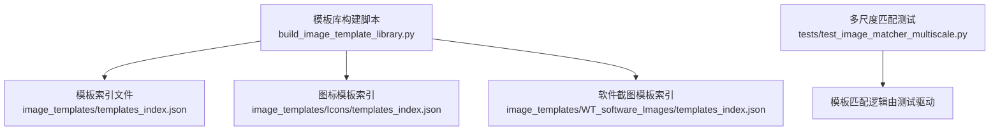
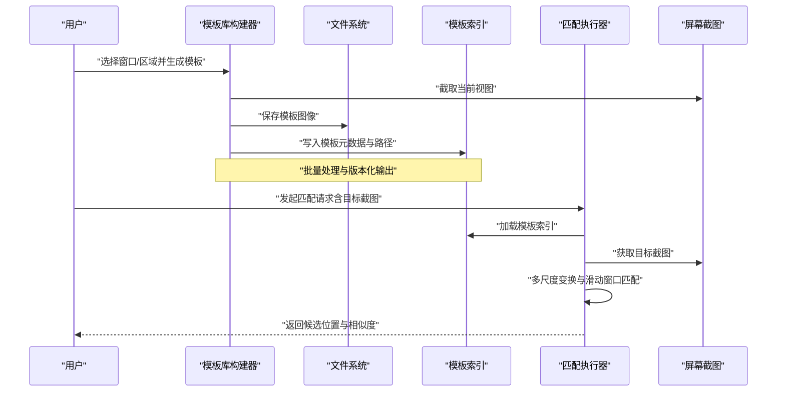
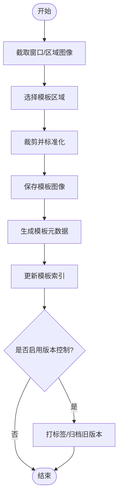
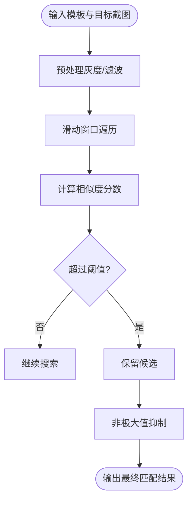
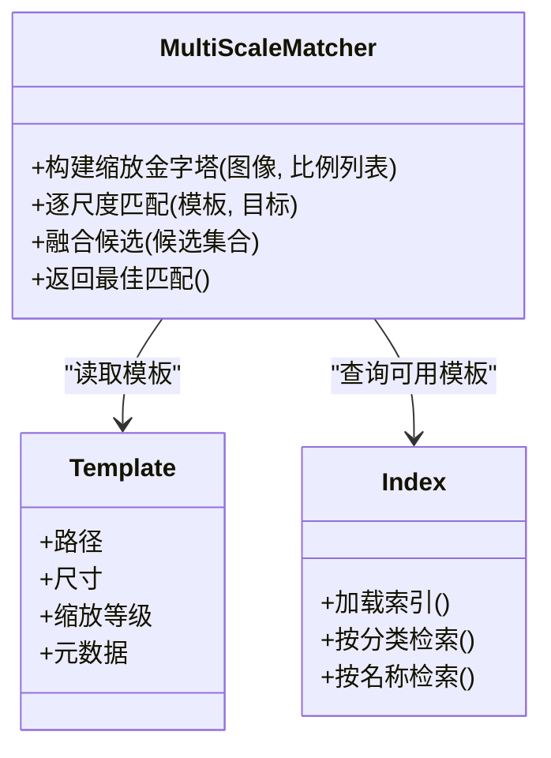
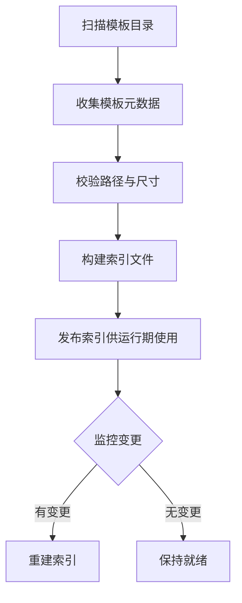
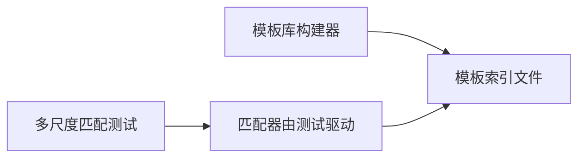

# 图像模板匹配

<cite>
**本文引用的文件**   
- [build_image_template_library.py](file://build_image_template_library.py)
- [test_image_matcher_multiscale.py](file://tests/test_image_matcher_multiscale.py)
- [image_templates/templates_index.json](file://image_templates/templates_index.json)
- [image_templates/Icons/templates_index.json](file://image_templates/Icons/templates_index.json)
- [image_templates/WT_software_Images/templates_index.json](file://image_templates/WT_software_Images/templates_index.json)
</cite>

## 目录
1. [简介](#简介)
2. [项目结构](#项目结构)
3. [核心组件](#核心组件)
4. [架构总览](#架构总览)
5. [详细组件分析](#详细组件分析)
6. [依赖关系分析](#依赖关系分析)
7. [性能考虑](#性能考虑)
8. [故障排查指南](#故障排查指南)
9. [结论](#结论)
10. [附录](#附录)

## 简介
本文件系统性阐述WT自动化框架中的图像模板匹配能力，覆盖模板创建流程、相似度计算与阈值策略、多尺度匹配机制、模板库管理与索引构建、性能优化技巧以及复杂UI场景下的应用实践。文档以仓库中现有脚本与测试为依据，帮助读者理解并高效使用模板匹配功能。

## 项目结构
与图像模板匹配相关的工程内容主要分布在以下位置：
- 模板库构建脚本：用于批量生成或维护模板索引与资源
- 单元测试：验证多尺度匹配等关键特性
- 模板索引文件：描述模板元数据与路径映射，支撑检索与管理

图表来源
- [build_image_template_library.py:1-200](file://build_image_template_library.py#L1-L200)
- [image_templates/templates_index.json:1-200](file://image_templates/templates_index.json#L1-L200)
- [image_templates/Icons/templates_index.json:1-200](file://image_templates/Icons/templates_index.json#L1-L200)
- [image_templates/WT_software_Images/templates_index.json:1-200](file://image_templates/WT_software_Images/templates_index.json#L1-L200)
- [test_image_matcher_multiscale.py:1-200](file://tests/test_image_matcher_multiscale.py#L1-L200)

章节来源
- [build_image_template_library.py:1-200](file://build_image_template_library.py#L1-L200)
- [test_image_matcher_multiscale.py:1-200](file://tests/test_image_matcher_multiscale.py#L1-L200)
- [image_templates/templates_index.json:1-200](file://image_templates/templates_index.json#L1-L200)
- [image_templates/Icons/templates_index.json:1-200](file://image_templates/Icons/templates_index.json#L1-L200)
- [image_templates/WT_software_Images/templates_index.json:1-200](file://image_templates/WT_software_Images/templates_index.json#L1-L200)

## 核心组件
- 模板库构建器：负责扫描源图、提取区域、生成模板文件与索引，支持批量处理与版本化输出
- 模板索引系统：集中管理模板元信息（名称、路径、尺寸、缩放比例、分类标签等），提供快速检索与一致性校验
- 多尺度匹配器：在运行时对目标屏幕截图进行多分辨率扫描，结合相似度度量与阈值判定完成定位
- 测试套件：覆盖多尺度匹配的关键用例，确保在不同缩放与分辨率下保持稳定识别

章节来源
- [build_image_template_library.py:1-200](file://build_image_template_library.py#L1-L200)
- [image_templates/templates_index.json:1-200](file://image_templates/templates_index.json#L1-L200)
- [test_image_matcher_multiscale.py:1-200](file://tests/test_image_matcher_multiscale.py#L1-L200)

## 架构总览
下图展示模板从创建到使用的整体流程，包括截图截取、区域选择、模板保存、索引构建与运行期多尺度匹配。

图表来源
- [build_image_template_library.py:1-200](file://build_image_template_library.py#L1-L200)
- [image_templates/templates_index.json:1-200](file://image_templates/templates_index.json#L1-L200)
- [test_image_matcher_multiscale.py:1-200](file://tests/test_image_matcher_multiscale.py#L1-L200)

## 详细组件分析

### 模板创建流程
- 截图截取：从目标窗口或屏幕区域捕获图像，作为模板源
- 区域选择：通过坐标或交互方式框选感兴趣区域，裁剪出稳定可复用的模板
- 模板保存：将裁剪后的图像保存到指定目录，命名遵循统一规范
- 索引构建：为每个模板生成元数据条目（名称、路径、尺寸、缩放等级、分类等），并写入索引文件
- 批量管理：支持一次处理多个窗口或控件，自动去重与冲突检测
- 版本控制：按时间戳或版本号组织输出，便于回溯与回滚

图表来源
- [build_image_template_library.py:1-200](file://build_image_template_library.py#L1-L200)
- [image_templates/templates_index.json:1-200](file://image_templates/templates_index.json#L1-L200)

章节来源
- [build_image_template_library.py:1-200](file://build_image_template_library.py#L1-L200)
- [image_templates/templates_index.json:1-200](file://image_templates/templates_index.json#L1-L200)

### 相似度计算与阈值设定
- 匹配原理：基于模板与目标图像的局部相似性度量，常用方法包括相关系数、归一化互相关等
- 相关系数计算：衡量模板与子区域的线性相关性，值越接近1表示相似度越高
- 阈值策略：根据业务需求设定全局或分级阈值，过滤低置信度结果；可结合NMS抑制重复候选
- 鲁棒性增强：引入灰度转换、直方图均衡、抗噪滤波等手段提升稳定性

图表来源
- [test_image_matcher_multiscale.py:1-200](file://tests/test_image_matcher_multiscale.py#L1-L200)

章节来源
- [test_image_matcher_multiscale.py:1-200](file://tests/test_image_matcher_multiscale.py#L1-L200)

### 多尺度匹配机制
- 缩放金字塔：对模板或目标图像构建多级缩放版本，适配不同分辨率与DPI设置
- 跨尺度融合：在各尺度上独立匹配后合并结果，采用距离与分数加权投票
- 自适应步长：在大图上降低搜索步长以提升精度，在小图上提高步长以加速
- 失败恢复：当主尺度未命中时，自动尝试相邻缩放等级，提高召回率

图表来源
- [test_image_matcher_multiscale.py:1-200](file://tests/test_image_matcher_multiscale.py#L1-L200)
- [image_templates/templates_index.json:1-200](file://image_templates/templates_index.json#L1-L200)

章节来源
- [test_image_matcher_multiscale.py:1-200](file://tests/test_image_matcher_multiscale.py#L1-L200)
- [image_templates/templates_index.json:1-200](file://image_templates/templates_index.json#L1-L200)

### 模板库管理系统
- 索引构建：扫描模板目录，收集元数据并生成统一的索引文件，支持增量更新
- 批量管理：支持批量导入、导出、重命名、删除与冲突解决
- 分类与标签：按窗口类型、控件类别、业务模块进行分类，便于检索与维护
- 版本控制：记录模板变更历史，支持回滚与对比差异
- 一致性校验：检查路径有效性、尺寸一致性与元数据完整性

图表来源
- [build_image_template_library.py:1-200](file://build_image_template_library.py#L1-L200)
- [image_templates/templates_index.json:1-200](file://image_templates/templates_index.json#L1-L200)

章节来源
- [build_image_template_library.py:1-200](file://build_image_template_library.py#L1-L200)
- [image_templates/templates_index.json:1-200](file://image_templates/templates_index.json#L1-L200)

### 实际应用场景案例
- 复杂UI环境：在多窗口、动态布局与高DPI环境下，通过多尺度匹配与阈值调优实现稳定识别
- 图标与按钮：针对小图标与密集按钮，采用高分辨率模板与精细阈值，配合NMS减少误报
- 表单控件：对文本输入框、下拉菜单等控件，结合区域约束与上下文信息提升定位准确率
- 回归测试：利用模板库的版本控制与批量管理，保障UI变更后的自动化回归稳定性

章节来源
- [test_image_matcher_multiscale.py:1-200](file://tests/test_image_matcher_multiscale.py#L1-L200)
- [image_templates/Icons/templates_index.json:1-200](file://image_templates/Icons/templates_index.json#L1-L200)
- [image_templates/WT_software_Images/templates_index.json:1-200](file://image_templates/WT_software_Images/templates_index.json#L1-L200)

## 依赖关系分析
- 构建器与索引：构建器依赖索引文件的读写接口，保证模板元数据的一致性
- 测试与匹配器：测试用例驱动多尺度匹配逻辑，验证不同缩放与分辨率下的表现
- 外部资源：模板图像与索引文件作为静态资源，被运行期匹配器按需加载

图表来源
- [build_image_template_library.py:1-200](file://build_image_template_library.py#L1-L200)
- [test_image_matcher_multiscale.py:1-200](file://tests/test_image_matcher_multiscale.py#L1-L200)
- [image_templates/templates_index.json:1-200](file://image_templates/templates_index.json#L1-L200)

章节来源
- [build_image_template_library.py:1-200](file://build_image_template_library.py#L1-L200)
- [test_image_matcher_multiscale.py:1-200](file://tests/test_image_matcher_multiscale.py#L1-L200)
- [image_templates/templates_index.json:1-200](file://image_templates/templates_index.json#L1-L200)

## 性能考虑
- 缓存策略：对频繁使用的模板与中间结果进行内存缓存，减少重复计算
- 并行处理：在多核环境下并行处理不同模板的匹配任务，提升吞吐
- 内存管理：及时释放大图像对象，避免长时间运行导致内存泄漏
- 搜索优化：合理设置步长与ROI区域，缩小搜索空间，降低计算量
- 阈值调优：依据业务场景调整全局与分级阈值，平衡召回与精度

[本节为通用指导，不直接分析具体文件]

## 故障排查指南
- 匹配失败：检查模板尺寸与目标截图分辨率是否匹配，确认多尺度配置是否正确
- 误报较多：提高相似度阈值或引入NMS，限制候选数量
- 性能瓶颈：评估搜索步长与ROI范围，启用并行与缓存
- 索引不一致：重新构建索引，校验路径与元数据完整性

章节来源
- [test_image_matcher_multiscale.py:1-200](file://tests/test_image_matcher_multiscale.py#L1-L200)
- [image_templates/templates_index.json:1-200](file://image_templates/templates_index.json#L1-L200)

## 结论
WT自动化框架的图像模板匹配体系围绕“模板创建—索引管理—多尺度匹配”的主线展开，具备较强的可扩展性与工程化能力。通过合理的阈值策略、多尺度机制与性能优化手段，可在复杂UI环境中实现稳定高效的识别与定位。建议在实际项目中持续完善模板库质量与索引治理，并结合测试用例保障回归稳定性。

## 附录
- 术语说明
  - 模板：从UI截图中裁剪出的稳定可复用图像片段
  - 多尺度：对图像进行多级缩放以适配不同分辨率与DPI
  - 相似度：衡量模板与目标子区域相似程度的数值指标
  - 阈值：用于筛选候选匹配的临界值
  - NMS：非极大值抑制，用于去除重叠候选

[本节为概念性说明，不直接分析具体文件]