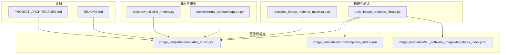
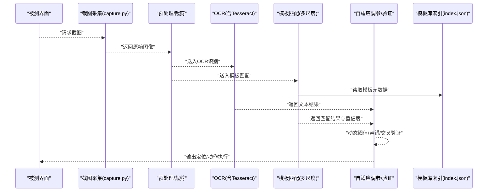
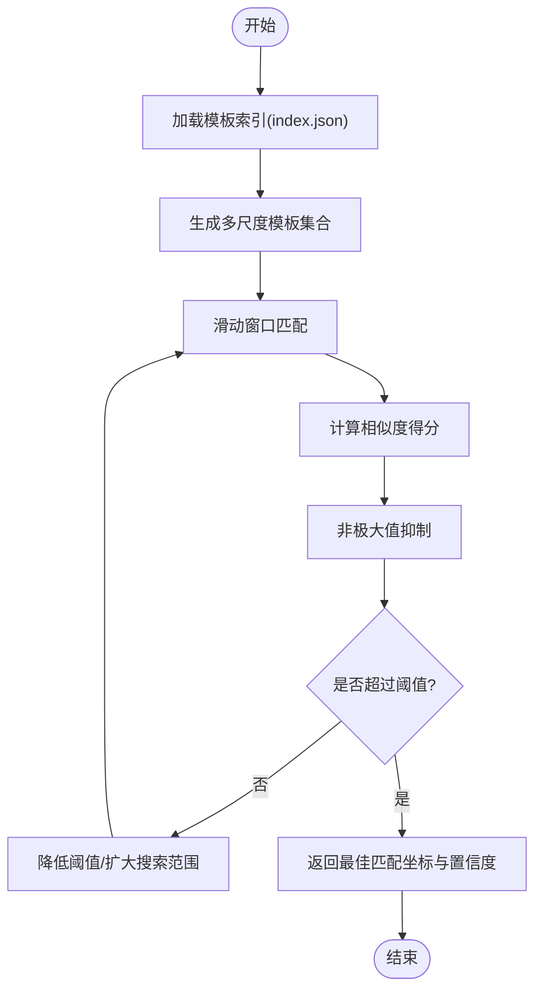
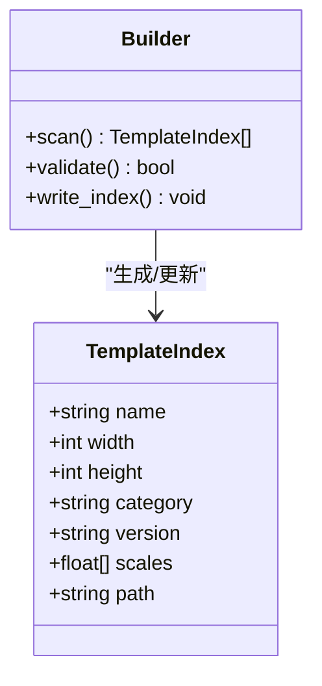
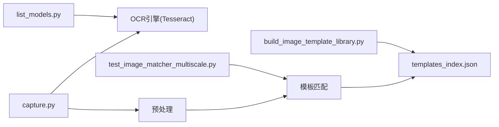

# 智能识别系统

<cite>
**本文引用的文件**   
- [README.md](file://README.md)
- [PROJECT_ARCHITECTURE.md](file://PROJECT_ARCHITECTURE.md)
- [build_image_template_library.py](file://build_image_template_library.py)
- [test_image_matcher_multiscale.py](file://tests/test_image_matcher_multiscale.py)
- [tools/external_capture/capture.py](file://tools/external_capture/capture.py)
- [tools/dev_utils/list_models.py](file://tools/dev_utils/list_models.py)
- [image_templates/templates_index.json](file://image_templates/templates_index.json)
- [image_templates/Icons/templates_index.json](file://image_templates/Icons/templates_index.json)
- [image_templates/WT_software_Images/templates_index.json](file://image_templates/WT_software_Images/templates_index.json)
</cite>

## 目录
1. [简介](#简介)
2. [项目结构](#项目结构)
3. [核心组件](#核心组件)
4. [架构总览](#架构总览)
5. [详细组件分析](#详细组件分析)
6. [依赖关系分析](#依赖关系分析)
7. [性能考量](#性能考量)
8. [故障排查指南](#故障排查指南)
9. [结论](#结论)
10. [附录](#附录)

## 简介
本文件面向WT自动化框架的智能识别子系统，聚焦以下目标：
- 解释OCR文本识别的工作原理与集成方式（含Tesseract OCR引擎、中文优化与多语言支持）
- 说明图像模板匹配算法的实现细节（模板创建、相似度计算、多尺度匹配等）
- 阐述智能识别的自适应机制（动态阈值调整、容错处理、结果验证等可靠性保障）
- 给出图像模板库的管理与维护策略（版本控制、批量更新、性能优化）
- 提供实际应用场景案例，展示在复杂UI环境中的有效应用
- 介绍识别精度调优方法与工具，提升脚本稳定性与准确性

## 项目结构
智能识别相关能力分布在如下位置：
- 图像模板库与索引：image_templates 及其子目录下的 templates_index.json
- 模板库构建工具：build_image_template_library.py
- 多尺度匹配测试用例：tests/test_image_matcher_multiscale.py
- 外部截图采集：tools/external_capture/capture.py
- Tesseract模型管理辅助：tools/dev_utils/list_models.py
- 顶层说明文档：README.md、PROJECT_ARCHITECTURE.md

图表来源
- [build_image_template_library.py](file://build_image_template_library.py)
- [tests/test_image_matcher_multiscale.py](file://tests/test_image_matcher_multiscale.py)
- [tools/external_capture/capture.py](file://tools/external_capture/capture.py)
- [tools/dev_utils/list_models.py](file://tools/dev_utils/list_models.py)
- [image_templates/templates_index.json](file://image_templates/templates_index.json)
- [image_templates/Icons/templates_index.json](file://image_templates/Icons/templates_index.json)
- [image_templates/WT_software_Images/templates_index.json](file://image_templates/WT_software_Images/templates_index.json)
- [README.md](file://README.md)
- [PROJECT_ARCHITECTURE.md](file://PROJECT_ARCHITECTURE.md)

章节来源
- [README.md](file://README.md)
- [PROJECT_ARCHITECTURE.md](file://PROJECT_ARCHITECTURE.md)

## 核心组件
- 图像模板库与索引
  - 通过 image_templates 目录组织模板资源，各子目录维护独立的 templates_index.json 作为元数据索引，便于按功能域或窗口分类检索。
- 模板库构建工具
  - build_image_template_library.py 负责扫描模板资源、生成或更新索引，并支持批量操作与一致性校验。
- 多尺度匹配测试
  - tests/test_image_matcher_multiscale.py 用于验证多尺度匹配流程、阈值策略与鲁棒性。
- 外部截图采集
  - tools/external_capture/capture.py 提供跨进程/跨窗口的截图能力，为OCR与模板匹配提供输入源。
- Tesseract模型管理
  - tools/dev_utils/list_models.py 用于列举已安装/可用的Tesseract语言包，辅助中文与多语言配置。

章节来源
- [build_image_template_library.py](file://build_image_template_library.py)
- [tests/test_image_matcher_multiscale.py](file://tests/test_image_matcher_multiscale.py)
- [tools/external_capture/capture.py](file://tools/external_capture/capture.py)
- [tools/dev_utils/list_models.py](file://tools/dev_utils/list_models.py)
- [image_templates/templates_index.json](file://image_templates/templates_index.json)
- [image_templates/Icons/templates_index.json](file://image_templates/Icons/templates_index.json)
- [image_templates/WT_software_Images/templates_index.json](file://image_templates/WT_software_Images/templates_index.json)

## 架构总览
智能识别系统由“截图采集—预处理—OCR/模板匹配—结果融合—自适应调参—模板库管理”构成闭环。

图表来源
- [tools/external_capture/capture.py](file://tools/external_capture/capture.py)
- [tests/test_image_matcher_multiscale.py](file://tests/test_image_matcher_multiscale.py)
- [image_templates/templates_index.json](file://image_templates/templates_index.json)

## 详细组件分析

### OCR文本识别（Tesseract集成与中文优化）
- 工作原理
  - 从屏幕或窗口区域截取图像，进行二值化、去噪、倾斜校正等预处理后，调用Tesseract引擎进行文字识别。
  - 中文识别优化通常包括：选择合适的数据包（如chi_sim）、启用LSTM模式、设置合适的页面分割模式（PSM），必要时结合白名单与正则过滤。
- 多语言支持
  - 通过切换tessdata路径与语言组合实现中英混排或多语识别；使用list_models.py可快速确认可用语言包。
- 集成要点
  - 确保tessdata路径正确、环境变量指向清晰；对低分辨率或高DPI场景进行缩放适配；对表格/表单类界面采用分块识别+拼接策略。

章节来源
- [tools/dev_utils/list_models.py](file://tools/dev_utils/list_models.py)
- [tools/external_capture/capture.py](file://tools/external_capture/capture.py)

### 图像模板匹配（多尺度与相似度）
- 模板创建
  - 从稳定UI元素截图生成模板，写入image_templates对应目录，并在templates_index.json中登记元信息（名称、尺寸、所属窗口/模块、版本等）。
- 相似度计算
  - 常用方法包括像素级差异、归一化互相关、特征点匹配等；在多尺度下对模板进行缩放以应对分辨率变化。
- 多尺度匹配
  - 在多个缩放比例上滑动窗口匹配，取最高置信度结果；结合非极大值抑制避免重复命中。
- 测试与回归
  - 通过tests/test_image_matcher_multiscale.py覆盖不同缩放、噪声、遮挡等边界条件，确保鲁棒性。

图表来源
- [tests/test_image_matcher_multiscale.py](file://tests/test_image_matcher_multiscale.py)
- [image_templates/templates_index.json](file://image_templates/templates_index.json)

章节来源
- [tests/test_image_matcher_multiscale.py](file://tests/test_image_matcher_multiscale.py)
- [image_templates/templates_index.json](file://image_templates/templates_index.json)

### 自适应机制（动态阈值、容错与验证）
- 动态阈值调整
  - 根据历史命中率、环境光照/缩放变化趋势，自动上调或下调匹配阈值，平衡召回率与误报率。
- 容错处理
  - 对轻微模糊、局部遮挡、颜色漂移等情况，引入形态学滤波、灰度直方图均衡、边缘增强等预处理；对OCR结果进行拼写纠错与规则校验。
- 结果验证
  - 多模态交叉验证：当OCR与模板匹配同时可用时，采用投票或加权融合策略；对关键控件增加二次确认（如点击后状态变更检测）。

章节来源
- [tests/test_image_matcher_multiscale.py](file://tests/test_image_matcher_multiscale.py)

### 图像模板库管理与维护
- 版本控制
  - 每个模板与索引条目建议包含版本号与更新时间戳，配合git进行变更追踪；重大UI改版需同步升级索引。
- 批量更新
  - 使用build_image_template_library.py统一扫描、校验与重建索引，保证一致性；支持增量更新以减少全量重建开销。
- 性能优化
  - 按窗口/模块拆分索引，减少单次搜索空间；对高频模板预缓存特征；对大图先粗筛再精匹配。

图表来源
- [build_image_template_library.py](file://build_image_template_library.py)
- [image_templates/templates_index.json](file://image_templates/templates_index.json)

章节来源
- [build_image_template_library.py](file://build_image_template_library.py)
- [image_templates/templates_index.json](file://image_templates/templates_index.json)
- [image_templates/Icons/templates_index.json](file://image_templates/Icons/templates_index.json)
- [image_templates/WT_software_Images/templates_index.json](file://image_templates/WT_software_Images/templates_index.json)

### 实际应用场景案例
- 复杂UI环境
  - 针对多分辨率、主题切换、动态内容滚动等场景，采用“多尺度模板+OCR辅助+二次验证”的组合策略，显著提升定位成功率。
- 表单录入
  - 对固定字段标签使用OCR识别，对按钮/图标使用模板匹配，二者融合提高抗干扰能力。
- 回归测试
  - 将关键页面的模板与OCR结果纳入自动化回归套件，持续监控漂移与退化。

[本节为概念性说明，不直接分析具体文件]

### 识别精度调优方法与工具
- 数据层面
  - 扩充模板样本（不同分辨率、缩放、亮度），完善templates_index.json的分类与版本信息。
- 算法层面
  - 调整多尺度步长与数量；优化相似度度量；引入NMS与上下文约束。
- 工程层面
  - 利用list_models.py检查语言包可用性；通过capture.py在不同环境下采集样本，评估阈值与预处理参数。

章节来源
- [tools/dev_utils/list_models.py](file://tools/dev_utils/list_models.py)
- [tools/external_capture/capture.py](file://tools/external_capture/capture.py)
- [image_templates/templates_index.json](file://image_templates/templates_index.json)

## 依赖关系分析
- 内部依赖
  - 构建工具依赖模板索引；测试用例依赖索引与匹配逻辑；截图采集为OCR与匹配提供输入。
- 外部依赖
  - Tesseract OCR引擎及tessdata语言包；图像处理库（如OpenCV/PIL等，视实现而定）。

图表来源
- [tools/external_capture/capture.py](file://tools/external_capture/capture.py)
- [build_image_template_library.py](file://build_image_template_library.py)
- [tests/test_image_matcher_multiscale.py](file://tests/test_image_matcher_multiscale.py)
- [tools/dev_utils/list_models.py](file://tools/dev_utils/list_models.py)
- [image_templates/templates_index.json](file://image_templates/templates_index.json)

章节来源
- [tools/external_capture/capture.py](file://tools/external_capture/capture.py)
- [build_image_template_library.py](file://build_image_template_library.py)
- [tests/test_image_matcher_multiscale.py](file://tests/test_image_matcher_multiscale.py)
- [tools/dev_utils/list_models.py](file://tools/dev_utils/list_models.py)
- [image_templates/templates_index.json](file://image_templates/templates_index.json)

## 性能考量
- 索引粒度
  - 按窗口/模块划分索引，缩小搜索空间，降低匹配耗时。
- 多尺度策略
  - 合理设置缩放范围与步长，避免过多层级导致计算爆炸。
- 预处理成本
  - 仅在必要时进行重采样与增强，优先使用轻量级滤波。
- 缓存与复用
  - 对静态模板预计算特征；对频繁使用的OCR结果做短时缓存。

[本节为通用指导，不直接分析具体文件]

## 故障排查指南
- 无法找到Tesseract或语言包
  - 使用list_models.py确认可用语言包；检查tessdata路径与环境变量。
- 模板匹配不稳定
  - 检查templates_index.json中尺寸与缩放配置是否与当前环境一致；适当放宽阈值或增加多尺度层级。
- OCR识别率低
  - 检查截图清晰度与对比度；尝试调整PSM与白名单；对表单类界面采用分块识别。
- 索引不一致
  - 运行构建工具重新生成索引，并进行一致性校验。

章节来源
- [tools/dev_utils/list_models.py](file://tools/dev_utils/list_models.py)
- [build_image_template_library.py](file://build_image_template_library.py)
- [tests/test_image_matcher_multiscale.py](file://tests/test_image_matcher_multiscale.py)

## 结论
智能识别系统在WT自动化框架中通过“截图采集—OCR/模板匹配—自适应调参—模板库管理”的闭环设计，有效提升了复杂UI环境的定位稳定性与准确性。借助多尺度匹配、动态阈值与多模态融合，系统能够在分辨率变化、主题切换与动态内容等挑战场景下保持良好表现。完善的模板库管理与持续回归测试进一步保障了长期运行的可靠性。

[本节为总结性内容，不直接分析具体文件]

## 附录
- 术语
  - OCR：光学字符识别
  - PSM：页面分割模式
  - NMS：非极大值抑制
- 参考
  - README.md、PROJECT_ARCHITECTURE.md 提供整体背景与架构概览

[本节为补充信息，不直接分析具体文件]