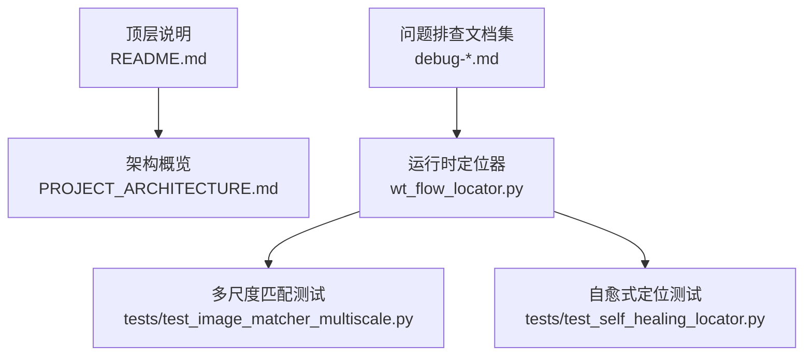
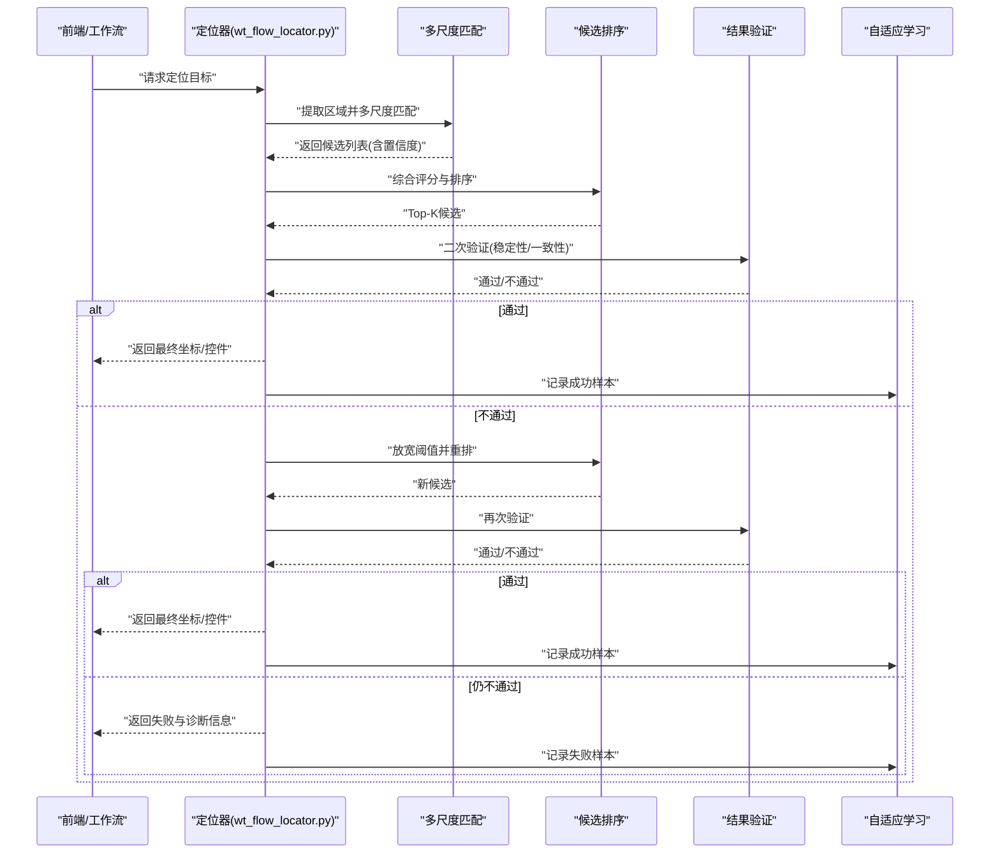
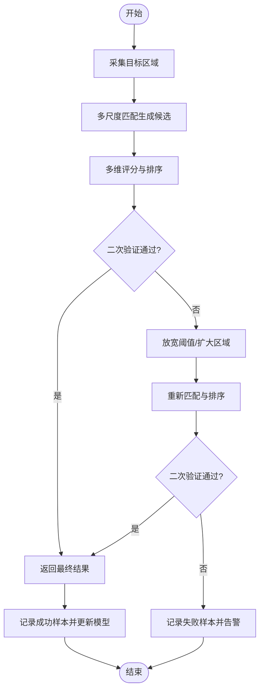
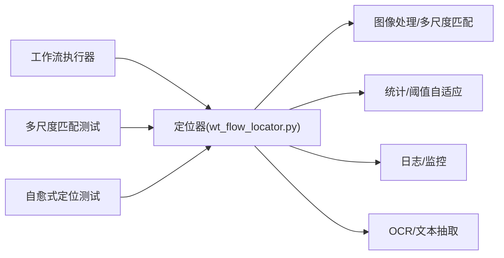

# 自适应识别机制

<cite>
**本文引用的文件**   
- [README.md](file://README.md)
- [PROJECT_ARCHITECTURE.md](file://PROJECT_ARCHITECTURE.md)
- [wt_flow_locator.py](file://wt_flow_locator.py)
- [test_image_matcher_multiscale.py](file://tests/test_image_matcher_multiscale.py)
- [test_self_healing_locator.py](file://tests/test_self_healing_locator.py)
- [debug-click-9-miss.md](file://debug-click-9-miss.md)
- [debug-default-height-relative-input.md](file://debug-default-height-relative-input.md)
- [debug-private-group-click.md](file://debug-private-group-click.md)
- [debug-relative-region-offset.md](file://debug-relative-region-offset.md)
- [debug-start-validation-regression.md](file://debug-start-validation-regression.md)
- [debug-time-series-input-regression.md](file://debug-time-series-input-regression.md)
</cite>

## 目录
1. [简介](#简介)
2. [项目结构](#项目结构)
3. [核心组件](#核心组件)
4. [架构总览](#架构总览)
5. [详细组件分析](#详细组件分析)
6. [依赖关系分析](#依赖关系分析)
7. [性能考量](#性能考量)
8. [故障排除指南](#故障排除指南)
9. [结论](#结论)
10. [附录](#附录)

## 简介
本文件聚焦于WT自动化框架中的“自适应识别机制”，围绕以下目标展开：
- 动态阈值调整算法与环境变化下的智能参数自调
- 容错处理策略：部分匹配、模糊匹配、候选结果排序等可靠性保障
- 识别结果验证流程：多重验证、置信度评估、异常检测
- 自适应学习机制：模式积累、经验反馈、模型优化
- 配置与优化指南：在不同环境下获得最佳识别效果
- 故障排除与调试方法：定位并解决识别不稳定等问题

## 项目结构
从仓库结构看，自适应识别相关能力主要分布在以下位置：
- 运行时定位与图像匹配逻辑：wt_flow_locator.py
- 多尺度图像匹配测试用例：tests/test_image_matcher_multiscale.py
- 自愈式定位测试用例：tests/test_self_healing_locator.py
- 问题排查文档：debug-*.md（覆盖点击遗漏、相对区域偏移、输入默认高度、私有分组点击、回归问题等）
- 顶层说明与架构概览：README.md、PROJECT_ARCHITECTURE.md

图表来源
- [README.md](file://README.md)
- [PROJECT_ARCHITECTURE.md](file://PROJECT_ARCHITECTURE.md)
- [wt_flow_locator.py](file://wt_flow_locator.py)
- [tests/test_image_matcher_multiscale.py](file://tests/test_image_matcher_multiscale.py)
- [tests/test_self_healing_locator.py](file://tests/test_self_healing_locator.py)
- [debug-click-9-miss.md](file://debug-click-9-miss.md)
- [debug-default-height-relative-input.md](file://debug-default-height-relative-input.md)
- [debug-private-group-click.md](file://debug-private-group-click.md)
- [debug-relative-region-offset.md](file://debug-relative-region-offset.md)
- [debug-start-validation-regression.md](file://debug-start-validation-regression.md)
- [debug-time-series-input-regression.md](file://debug-time-series-input-regression.md)

章节来源
- [README.md](file://README.md)
- [PROJECT_ARCHITECTURE.md](file://PROJECT_ARCHITECTURE.md)

## 核心组件
- 运行时定位器（wt_flow_locator.py）
  - 负责在UI界面上进行控件/图像的自适应定位，包含多尺度模板匹配、阈值自适应、候选排序与二次校验等关键路径。
  - 作为识别引擎的核心入口，被工作流执行器调用以完成点击、输入、选择等操作前的元素定位。
- 多尺度图像匹配测试（tests/test_image_matcher_multiscale.py）
  - 验证不同缩放比例、分辨率、光照条件下的匹配稳定性，体现动态阈值与容错策略的有效性。
- 自愈式定位测试（tests/test_self_healing_locator.py）
  - 模拟UI漂移、窗口尺寸变化、主题切换等环境扰动，验证候选重排、回退策略与二次验证的鲁棒性。
- 问题排查文档（debug-*.md）
  - 记录典型识别失败场景与修复过程，为动态阈值与容错策略提供实践依据。

章节来源
- [wt_flow_locator.py](file://wt_flow_locator.py)
- [tests/test_image_matcher_multiscale.py](file://tests/test_image_matcher_multiscale.py)
- [tests/test_self_healing_locator.py](file://tests/test_self_healing_locator.py)
- [debug-click-9-miss.md](file://debug-click-9-miss.md)
- [debug-default-height-relative-input.md](file://debug-default-height-relative-input.md)
- [debug-private-group-click.md](file://debug-private-group-click.md)
- [debug-relative-region-offset.md](file://debug-relative-region-offset.md)
- [debug-start-validation-regression.md](file://debug-start-validation-regression.md)
- [debug-time-series-input-regression.md](file://debug-time-series-input-regression.md)

## 架构总览
自适应识别的整体流程可抽象为“采集—匹配—排序—验证—学习”的闭环：
- 采集：根据上下文获取目标区域截图或控件树信息
- 匹配：基于多尺度模板匹配与特征相似度计算生成候选集合
- 排序：按置信度、几何一致性、历史命中频率等进行综合排序
- 验证：通过二次校验（如边界框稳定性、语义一致性、动作预演）确认最终结果
- 学习：将成功/失败样本入库，驱动阈值与权重在线更新

图表来源
- [wt_flow_locator.py](file://wt_flow_locator.py)
- [tests/test_image_matcher_multiscale.py](file://tests/test_image_matcher_multiscale.py)
- [tests/test_self_healing_locator.py](file://tests/test_self_healing_locator.py)

## 详细组件分析

### 动态阈值调整算法与环境自适应
- 设计要点
  - 基于环境统计（噪声水平、对比度、分辨率）动态调整匹配阈值，避免固定阈值导致的误报/漏报。
  - 引入滑动窗口统计与指数平滑，使阈值对短期波动敏感而对长期趋势稳定。
  - 结合历史命中率与失败率，形成“成功率导向”的阈值修正项。
- 实现思路
  - 在匹配阶段输出候选置信度分布，据此估计当前环境的“有效阈值”。
  - 当连续失败次数超过阈值时，触发阈值放宽；当连续成功且置信度偏高时，适度收紧以提升精度。
  - 针对多尺度匹配，对不同尺度的阈值进行加权融合，保证跨分辨率鲁棒性。
- 指标与监控
  - 监控“平均置信度”、“阈值偏离度”、“失败重试次数”、“Top-1命中率”等指标，用于评估自适应效果。

章节来源
- [wt_flow_locator.py](file://wt_flow_locator.py)
- [tests/test_image_matcher_multiscale.py](file://tests/test_image_matcher_multiscale.py)

### 容错处理策略：部分匹配、模糊匹配、候选排序
- 部分匹配
  - 允许局部特征对齐，降低因遮挡、裁剪导致的完全匹配失败。
- 模糊匹配
  - 引入容忍度（如像素级差异、结构相似性），在保持精度的同时提升泛化能力。
- 候选排序
  - 多维评分：置信度、几何一致性（位置/尺寸）、历史命中频率、上下文相关性。
  - Top-K策略配合二次验证，确保高置信度优先，同时保留备选方案。
- 回退策略
  - 当主策略失败时，自动切换到次优策略（如放宽阈值、扩大搜索区域、切换匹配器）。

章节来源
- [wt_flow_locator.py](file://wt_flow_locator.py)
- [tests/test_self_healing_locator.py](file://tests/test_self_healing_locator.py)

### 识别结果验证流程：多重验证、置信度评估、异常检测
- 多重验证
  - 几何验证：检查边界框稳定性、重叠度、相对位置合理性。
  - 语义验证：结合控件类型、文本内容、层级关系进行一致性判断。
  - 行为验证：在执行前进行轻量预演（如悬停、焦点转移）以确认交互可行性。
- 置信度评估
  - 基于匹配分数、历史命中率、环境因子（分辨率、缩放）归一化得到综合置信度。
- 异常检测
  - 检测极端值（过高/过低置信度）、分布突变（短时间内大量失败）、空间异常（越界、重叠过大）。
  - 触发告警与回退，必要时冻结阈值更新以避免雪崩效应。

章节来源
- [wt_flow_locator.py](file://wt_flow_locator.py)
- [tests/test_self_healing_locator.py](file://tests/test_self_healing_locator.py)

### 自适应学习机制：模式积累、经验反馈、模型优化
- 模式积累
  - 记录成功/失败样本（截图片段、上下文特征、操作序列），构建本地知识库。
- 经验反馈
  - 将历史命中率与失败原因映射到阈值与权重调整规则，形成闭环优化。
- 模型优化
  - 定期离线训练/微调匹配器或排序器，提升对新UI风格的泛化能力。
  - 支持增量更新，避免全量重训带来的成本与风险。

章节来源
- [wt_flow_locator.py](file://wt_flow_locator.py)
- [tests/test_self_healing_locator.py](file://tests/test_self_healing_locator.py)

### 配置与优化指南
- 关键配置项建议
  - 初始阈值与步长：根据目标UI清晰度与分辨率设置保守起始值，逐步收敛。
  - 多尺度范围与步长：覆盖常见缩放比例（如0.8~1.2），步长不宜过细以免耗时过长。
  - 候选数量K：平衡召回与性能，通常K=3~5即可满足多数场景。
  - 验证强度：在高风险操作中启用强验证（几何+语义+行为），常规操作使用弱验证。
  - 学习开关与冷却期：开启自适应学习的同时设置冷却期，防止频繁抖动。
- 环境适配
  - 高分辨率/高DPI：适当提高阈值容忍度，增加多尺度上限。
  - 低对比度/暗色主题：增强预处理（直方图均衡、去噪），提高模糊匹配容忍度。
  - 动态UI（动画、加载态）：引入时序一致性检查，避免瞬时状态干扰。
- 监控与调参
  - 关注“失败重试次数”、“Top-1命中率”、“平均置信度”、“阈值偏离度”四项指标。
  - 若命中率下降且失败重试上升，优先检查阈值是否过紧或多尺度范围是否不足。

章节来源
- [wt_flow_locator.py](file://wt_flow_locator.py)
- [tests/test_image_matcher_multiscale.py](file://tests/test_image_matcher_multiscale.py)

### 流程图：自适应识别主流程

图表来源
- [wt_flow_locator.py](file://wt_flow_locator.py)
- [tests/test_self_healing_locator.py](file://tests/test_self_healing_locator.py)

## 依赖关系分析
- 模块内聚与耦合
  - 定位器模块内部聚合了匹配、排序、验证与学习子模块，内聚度高；对外仅暴露统一的定位接口，耦合度低。
- 直接依赖
  - 定位器依赖图像处理库（多尺度匹配）、统计模块（阈值自适应）、日志与监控模块（指标上报）。
- 间接依赖
  - 工作流执行器通过定位器间接依赖上述库；测试用例通过断言与覆盖率工具验证正确性与鲁棒性。
- 外部集成点
  - UI捕获与控件树API（用于上下文信息与二次验证）、OCR/文本抽取（用于语义验证）。

图表来源
- [wt_flow_locator.py](file://wt_flow_locator.py)
- [tests/test_image_matcher_multiscale.py](file://tests/test_image_matcher_multiscale.py)
- [tests/test_self_healing_locator.py](file://tests/test_self_healing_locator.py)

章节来源
- [wt_flow_locator.py](file://wt_flow_locator.py)
- [tests/test_image_matcher_multiscale.py](file://tests/test_image_matcher_multiscale.py)
- [tests/test_self_healing_locator.py](file://tests/test_self_healing_locator.py)

## 性能考量
- 多尺度匹配开销
  - 合理控制尺度范围与步长，避免过度细分；对大图采用分块匹配与ROI裁剪。
- 候选排序复杂度
  - 限制K值并使用近似最近邻或快速打分函数，减少排序耗时。
- 二次验证成本
  - 在高频路径上使用轻量验证，仅在高风险操作启用强验证。
- 自适应学习开销
  - 异步写入样本与增量更新，避免阻塞主流程；设置批处理与冷却期。

[本节为通用指导，无需特定文件引用]

## 故障排除指南
- 常见问题与线索
  - 点击遗漏：检查相对区域偏移、默认高度设置、私有分组可见性。
  - 输入框默认高度异常：核对相对区域计算与坐标系转换。
  - 启动验证回归：确认验证流程未退化，检查阈值与排序权重。
  - 时间序列输入回归：关注数据格式与时序一致性校验。
- 定位步骤
  - 查看失败样本与诊断信息（截图、置信度、候选列表）。
  - 回放失败路径，观察阈值变化曲线与指标波动。
  - 缩小问题域：固定分辨率/主题/缩放，复现后逐步放开变量。
- 修复建议
  - 调整阈值与多尺度范围；优化候选排序权重；增强二次验证条件。
  - 补充缺失的上下文特征（如控件层级、文本标签）以提升语义验证。
  - 更新知识库样本，驱动模型优化。

章节来源
- [debug-click-9-miss.md](file://debug-click-9-miss.md)
- [debug-default-height-relative-input.md](file://debug-default-height-relative-input.md)
- [debug-private-group-click.md](file://debug-private-group-click.md)
- [debug-relative-region-offset.md](file://debug-relative-region-offset.md)
- [debug-start-validation-regression.md](file://debug-start-validation-regression.md)
- [debug-time-series-input-regression.md](file://debug-time-series-input-regression.md)

## 结论
WT自动化框架的自适应识别机制通过“动态阈值—容错策略—多重验证—自适应学习”的闭环，显著提升了在复杂UI环境下的识别稳定性与鲁棒性。实践中应结合具体场景调优阈值与多尺度范围，完善上下文特征与验证条件，并以指标驱动持续优化。

[本节为总结性内容，无需特定文件引用]

## 附录
- 术语表
  - 多尺度匹配：在不同缩放比例下对模板进行匹配，提升跨分辨率鲁棒性。
  - 自愈式定位：在UI漂移或环境变化时自动恢复定位能力的机制。
  - 二次验证：在初步匹配通过后进行的额外一致性检查。
- 参考文档
  - README.md、PROJECT_ARCHITECTURE.md：项目背景与总体架构
  - debug-*.md：典型问题与修复案例

[本节为参考资料，无需特定文件引用]