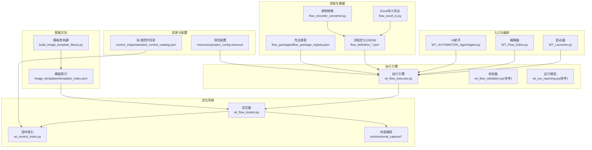
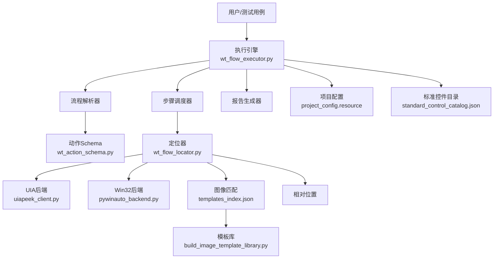
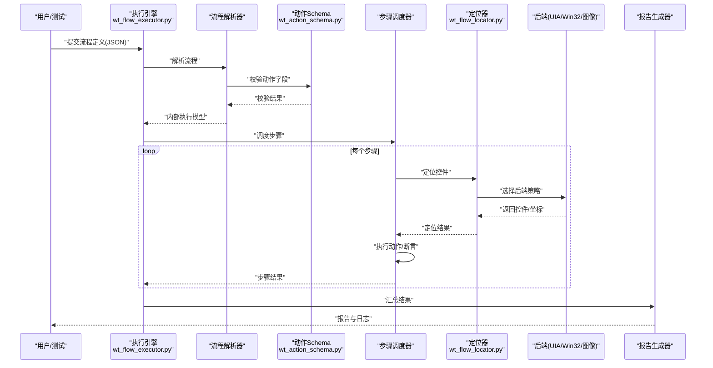
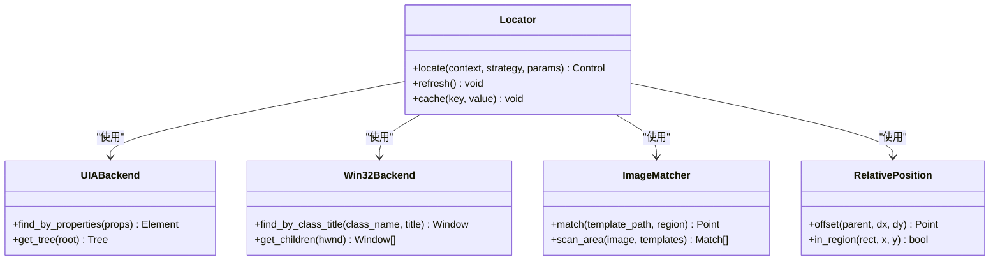
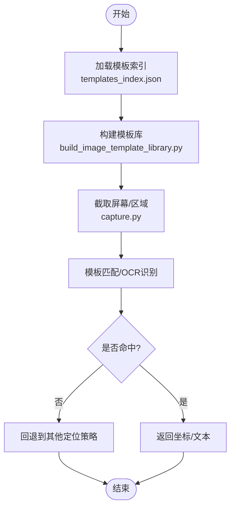
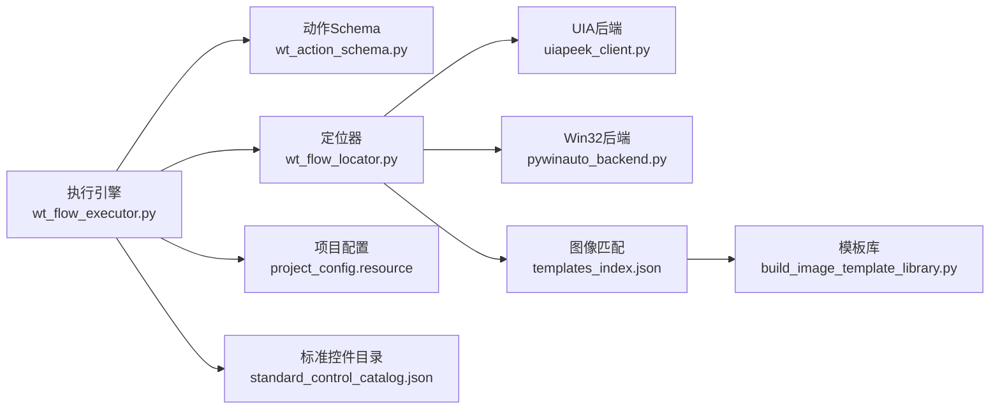

# 核心概念

<cite>
**本文引用的文件**   
- [README.md](file://README.md)
- [PROJECT_ARCHITECTURE.md](file://PROJECT_ARCHITECTURE.md)
- [wt_flow_executor.py](file://wt_flow_executor.py)
- [wt_flow_locator.py](file://wt_flow_locator.py)
- [wt_control_index.py](file://wt_control_index.py)
- [flow_excel_io.py](file://flow_excel_io.py)
- [flow_recorder_converter.py](file://flow_recorder_converter.py)
- [wt_action_schema.py](file://wt_action_schema.py)
- [wt_business_steps.py](file://wt_business_steps.py)
- [tools/external_capture/capture.py](file://tools/external_capture/capture.py)
- [tools/external_capture/pywinauto_backend.py](file://tools/external_capture/pywinauto_backend.py)
- [tools/external_capture/uiapeek_client.py](file://tools/external_capture/uiapeek_client.py)
- [build_image_template_library.py](file://build_image_template_library.py)
- [image_templates/templates_index.json](file://image_templates/templates_index.json)
- [control_maps/standard_control_catalog.json](file://control_maps/standard_control_catalog.json)
- [flow_packages/flow_package_registry.json](file://flow_packages/flow_package_registry.json)
- [resources/project_config.resource](file://resources/project_config.resource)
</cite>

## 目录
1. [简介](#简介)
2. [项目结构](#项目结构)
3. [核心组件](#核心组件)
4. [架构总览](#架构总览)
5. [详细组件分析](#详细组件分析)
6. [依赖关系分析](#依赖关系分析)
7. [性能考量](#性能考量)
8. [故障排查指南](#故障排查指南)
9. [结论](#结论)
10. [附录](#附录)

## 简介
WT自动化框架围绕“流程驱动、控件可定位、步骤可复用、识别智能化”的核心理念构建。其目标是通过JSON格式的流程定义，驱动执行引擎解析并执行一系列业务步骤；通过多策略控件定位系统（UIA、Win32、图像匹配、相对位置等）提升跨应用与跨版本的稳定性；借助智能识别（OCR、模板匹配）增强对动态界面和弱信息窗口的鲁棒性；并通过业务步骤封装实现领域能力的复用与组合。

本文件面向初学者提供清晰的概念理解，同时为高级用户提供深入的技术细节与架构图示。

## 项目结构
仓库采用分层与按功能域组织相结合的结构：
- 顶层脚本与入口：负责启动、编排与集成
- 流程与数据：JSON流程定义、Excel导入导出、录制转换
- 执行引擎：流程解析、调度、异常处理与报告
- 定位系统：多后端控件定位与索引管理
- 智能识别：图像模板库构建与OCR能力
- 资源与配置：项目配置、标准控件目录、包注册表
- 工具与外部桥接：外部捕获、UIA/Win32后端、开发辅助

图表来源
- [PROJECT_ARCHITECTURE.md](file://PROJECT_ARCHITECTURE.md)
- [wt_flow_executor.py](file://wt_flow_executor.py)
- [wt_flow_locator.py](file://wt_flow_locator.py)
- [wt_control_index.py](file://wt_control_index.py)
- [flow_excel_io.py](file://flow_excel_io.py)
- [flow_recorder_converter.py](file://flow_recorder_converter.py)
- [build_image_template_library.py](file://build_image_template_library.py)
- [image_templates/templates_index.json](file://image_templates/templates_index.json)
- [control_maps/standard_control_catalog.json](file://control_maps/standard_control_catalog.json)
- [flow_packages/flow_package_registry.json](file://flow_packages/flow_package_registry.json)
- [resources/project_config.resource](file://resources/project_config.resource)

章节来源
- [PROJECT_ARCHITECTURE.md](file://PROJECT_ARCHITECTURE.md)

## 核心组件
- 执行引擎：负责加载流程定义、解析步骤、调度执行、收集结果与异常、生成报告。
- 定位系统：统一抽象多种控件定位策略（UIA、Win32、图像、相对位置），并提供缓存与索引加速。
- 业务步骤：将领域操作封装为可复用的步骤单元，支持参数化与条件分支。
- 智能识别：基于图像模板匹配与OCR技术，增强对文本与图标类控件的识别能力。
- 数据与配置：流程定义JSON、Excel导入导出、录制转换、包注册表、项目配置与标准控件目录。

章节来源
- [wt_flow_executor.py](file://wt_flow_executor.py)
- [wt_flow_locator.py](file://wt_flow_locator.py)
- [wt_control_index.py](file://wt_control_index.py)
- [wt_business_steps.py](file://wt_business_steps.py)
- [flow_excel_io.py](file://flow_excel_io.py)
- [flow_recorder_converter.py](file://flow_recorder_converter.py)
- [build_image_template_library.py](file://build_image_template_library.py)
- [image_templates/templates_index.json](file://image_templates/templates_index.json)
- [control_maps/standard_control_catalog.json](file://control_maps/standard_control_catalog.json)
- [flow_packages/flow_package_registry.json](file://flow_packages/flow_package_registry.json)
- [resources/project_config.resource](file://resources/project_config.resource)

## 架构总览
整体架构遵循“流程驱动+多后端定位+智能识别”的分层设计：
- 上层：入口与编排（启动器、编辑器、AI助手）
- 中层：执行引擎与数据层（流程解析、步骤调度、Excel/录制转换、包注册）
- 下层：定位系统与智能识别（UIA/Win32/图像/相对位置、模板库、OCR）
- 横切：配置与标准目录（项目配置、标准控件目录）

图表来源
- [wt_flow_executor.py](file://wt_flow_executor.py)
- [wt_flow_locator.py](file://wt_flow_locator.py)
- [tools/external_capture/uiapeek_client.py](file://tools/external_capture/uiapeek_client.py)
- [tools/external_capture/pywinauto_backend.py](file://tools/external_capture/pywinauto_backend.py)
- [image_templates/templates_index.json](file://image_templates/templates_index.json)
- [build_image_template_library.py](file://build_image_template_library.py)
- [resources/project_config.resource](file://resources/project_config.resource)
- [control_maps/standard_control_catalog.json](file://control_maps/standard_control_catalog.json)
- [wt_action_schema.py](file://wt_action_schema.py)

## 详细组件分析

### 执行引擎：流程解析、步骤执行与异常处理
- 流程解析：读取JSON流程定义，依据动作Schema进行结构与字段校验，转换为内部执行模型。
- 步骤执行：按顺序或并行策略调度步骤，注入上下文（窗口句柄、坐标、截图等），调用定位器获取控件并执行动作。
- 异常处理：捕获定位失败、动作执行异常、超时等错误，记录堆栈与诊断信息，支持重试与降级策略。
- 报告输出：汇总执行结果、耗时、截图与日志，便于问题回溯与质量度量。

图表来源
- [wt_flow_executor.py](file://wt_flow_executor.py)
- [wt_action_schema.py](file://wt_action_schema.py)
- [wt_flow_locator.py](file://wt_flow_locator.py)

章节来源
- [wt_flow_executor.py](file://wt_flow_executor.py)
- [wt_action_schema.py](file://wt_action_schema.py)

### 控件定位系统：多策略与适用场景
定位系统统一抽象以下策略：
- UIA（Windows UI Automation）：适用于现代UI框架（WPF/UWP/WinForms等），通过元素树与属性匹配定位。
- Win32 API：适用于传统Win32控件，通过类名、标题、句柄等快速定位。
- 图像匹配：适用于无足够可访问信息的控件，基于模板库进行相似度匹配。
- 相对位置：在已知父控件或区域基础上，通过偏移量定位子控件。

图表来源
- [wt_flow_locator.py](file://wt_flow_locator.py)
- [tools/external_capture/uiapeek_client.py](file://tools/external_capture/uiapeek_client.py)
- [tools/external_capture/pywinauto_backend.py](file://tools/external_capture/pywinauto_backend.py)
- [image_templates/templates_index.json](file://image_templates/templates_index.json)

章节来源
- [wt_flow_locator.py](file://wt_flow_locator.py)
- [tools/external_capture/uiapeek_client.py](file://tools/external_capture/uiapeek_client.py)
- [tools/external_capture/pywinauto_backend.py](file://tools/external_capture/pywinauto_backend.py)
- [image_templates/templates_index.json](file://image_templates/templates_index.json)

### JSON流程定义语法与数据模型
流程定义以JSON描述，包含元数据、步骤列表与上下文变量。典型结构包括：
- 元数据：名称、版本、描述、依赖包
- 步骤数组：每个步骤包含类型、参数、条件、期望结果
- 上下文变量：用于步骤间传递状态（如窗口句柄、坐标、文本）
- 包注册：引用flow_package_registry.json中的包定义，支持步骤复用与版本管理

建议通过Excel导入导出与录制转换工具生成或编辑流程，确保一致性。

章节来源
- [flow_excel_io.py](file://flow_excel_io.py)
- [flow_recorder_converter.py](file://flow_recorder_converter.py)
- [flow_packages/flow_package_registry.json](file://flow_packages/flow_package_registry.json)

### 业务步骤：概念与封装模式
业务步骤是对领域操作的封装，具备以下特性：
- 参数化：输入参数来自流程上下文或外部数据源
- 可组合：多个步骤组合成更高层的业务流程
- 可重试与回滚：针对不稳定操作提供重试机制与补偿逻辑
- 可观测：记录关键日志与断言结果，便于追踪

封装模式建议：
- 单一职责：每个步骤聚焦一个明确的操作
- 幂等性：重复执行不产生副作用
- 容错性：捕获并上报异常，提供降级路径

章节来源
- [wt_business_steps.py](file://wt_business_steps.py)

### 智能识别系统：OCR与图像模板匹配
智能识别系统由两部分组成：
- 图像模板匹配：通过模板库与索引进行快速匹配，适用于图标、按钮等稳定视觉特征
- OCR：对文本型控件进行识别，适用于动态文本或弱信息界面

图表来源
- [build_image_template_library.py](file://build_image_template_library.py)
- [image_templates/templates_index.json](file://image_templates/templates_index.json)
- [tools/external_capture/capture.py](file://tools/external_capture/capture.py)

章节来源
- [build_image_template_library.py](file://build_image_template_library.py)
- [image_templates/templates_index.json](file://image_templates/templates_index.json)
- [tools/external_capture/capture.py](file://tools/external_capture/capture.py)

### 控件索引与标准目录
控件索引用于缓存与加速定位，结合标准控件目录提高跨应用的一致性：
- 控件索引：维护窗口-控件映射，减少重复扫描开销
- 标准控件目录：定义通用控件类别与属性规范，便于批量管理与复用

章节来源
- [wt_control_index.py](file://wt_control_index.py)
- [control_maps/standard_control_catalog.json](file://control_maps/standard_control_catalog.json)

## 依赖关系分析
- 执行引擎依赖定位系统与动作Schema，定位系统依赖UIA/Win32/图像/相对位置后端
- 智能识别依赖模板库与截图能力
- 数据层依赖Excel/录制转换与包注册表
- 配置与标准目录贯穿各层，提供全局约束与默认值

图表来源
- [wt_flow_executor.py](file://wt_flow_executor.py)
- [wt_flow_locator.py](file://wt_flow_locator.py)
- [tools/external_capture/uiapeek_client.py](file://tools/external_capture/uiapeek_client.py)
- [tools/external_capture/pywinauto_backend.py](file://tools/external_capture/pywinauto_backend.py)
- [image_templates/templates_index.json](file://image_templates/templates_index.json)
- [build_image_template_library.py](file://build_image_template_library.py)
- [resources/project_config.resource](file://resources/project_config.resource)
- [control_maps/standard_control_catalog.json](file://control_maps/standard_control_catalog.json)

章节来源
- [wt_flow_executor.py](file://wt_flow_executor.py)
- [wt_flow_locator.py](file://wt_flow_locator.py)
- [wt_action_schema.py](file://wt_action_schema.py)
- [tools/external_capture/uiapeek_client.py](file://tools/external_capture/uiapeek_client.py)
- [tools/external_capture/pywinauto_backend.py](file://tools/external_capture/pywinauto_backend.py)
- [image_templates/templates_index.json](file://image_templates/templates_index.json)
- [build_image_template_library.py](file://build_image_template_library.py)
- [resources/project_config.resource](file://resources/project_config.resource)
- [control_maps/standard_control_catalog.json](file://control_maps/standard_control_catalog.json)

## 性能考量
- 定位缓存：利用控件索引缓存窗口-控件映射，降低重复扫描成本
- 策略优先级：优先使用UIA/Win32，图像匹配作为兜底，减少计算开销
- 模板库优化：按需加载模板，避免一次性加载全部模板导致内存压力
- 并发与批处理：对独立步骤进行并行执行，注意共享资源的同步
- 截图与OCR：限制区域与分辨率，必要时分块处理

[本节为通用指导，无需具体文件分析]

## 故障排查指南
- 定位失败：检查控件索引是否过期，确认UIA/Win32后端可用，验证图像模板是否更新
- 动作执行异常：查看执行引擎日志与报告，确认参数与上下文是否正确
- 识别不准确：调整模板阈值或OCR语言包，增加样本提升识别率
- 性能问题：启用定位缓存，减少截图频率，优化模板库规模

章节来源
- [wt_flow_executor.py](file://wt_flow_executor.py)
- [wt_flow_locator.py](file://wt_flow_locator.py)
- [build_image_template_library.py](file://build_image_template_library.py)

## 结论
WT自动化框架通过流程驱动、多策略定位与智能识别，实现了高鲁棒性与可扩展性的自动化解决方案。初学者可从流程定义与业务步骤入手，逐步掌握定位策略与智能识别；高级用户可深入执行引擎与定位后端的实现细节，进行定制与优化。

[本节为总结，无需具体文件分析]

## 附录
- 快速入门示例：参考示例脚本与录制转换工具，快速生成流程定义
- 包注册与复用：通过flow_package_registry.json管理步骤包，实现跨项目复用
- 配置管理：在项目配置中设置默认策略、超时与日志级别

章节来源
- [flow_packages/flow_package_registry.json](file://flow_packages/flow_package_registry.json)
- [resources/project_config.resource](file://resources/project_config.resource)
- [flow_recorder_converter.py](file://flow_recorder_converter.py)