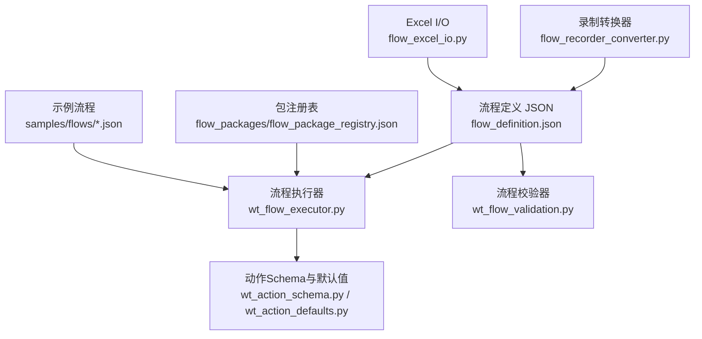
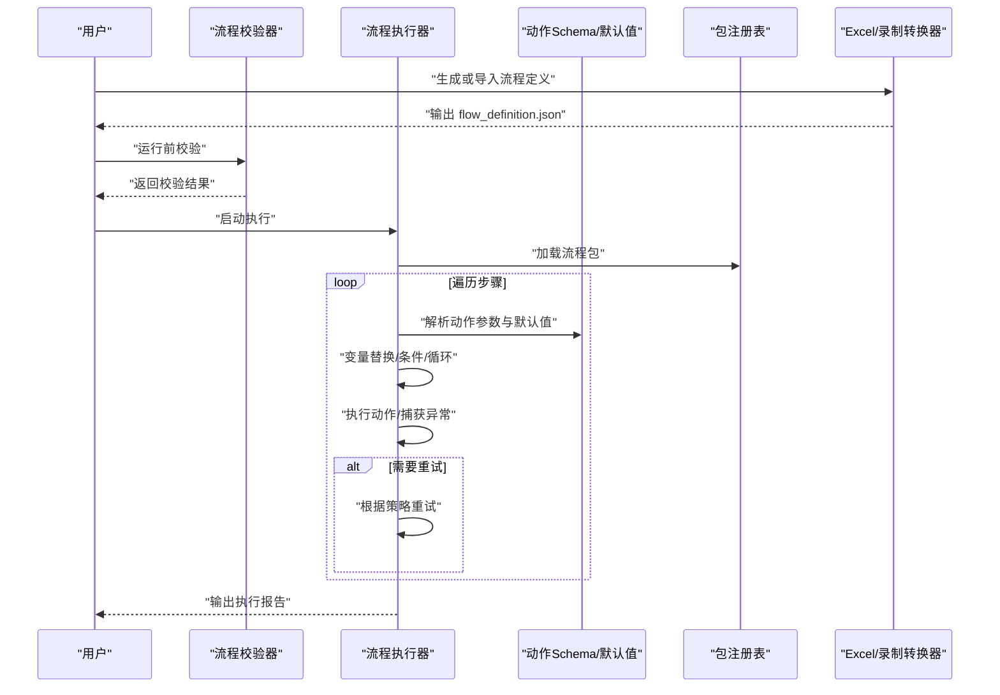
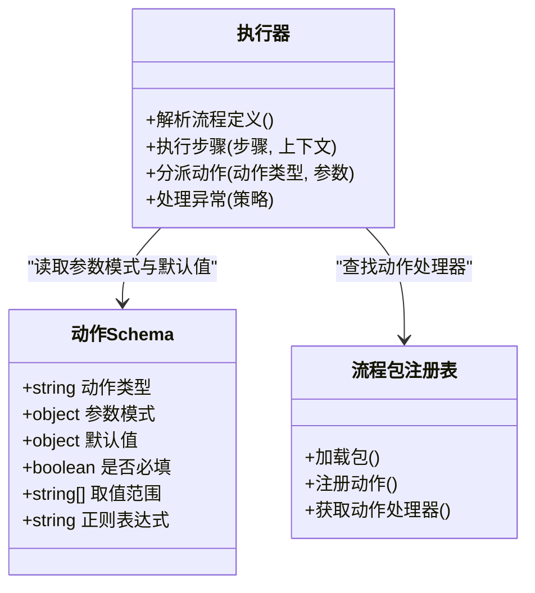
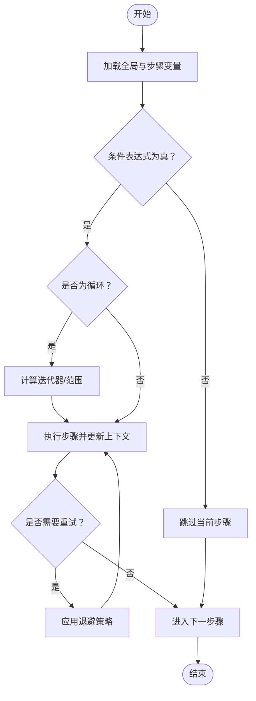
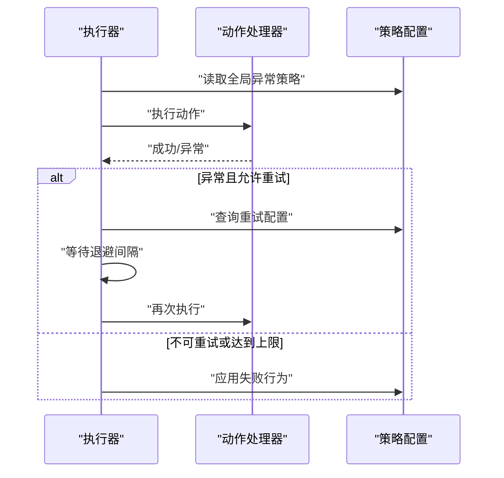
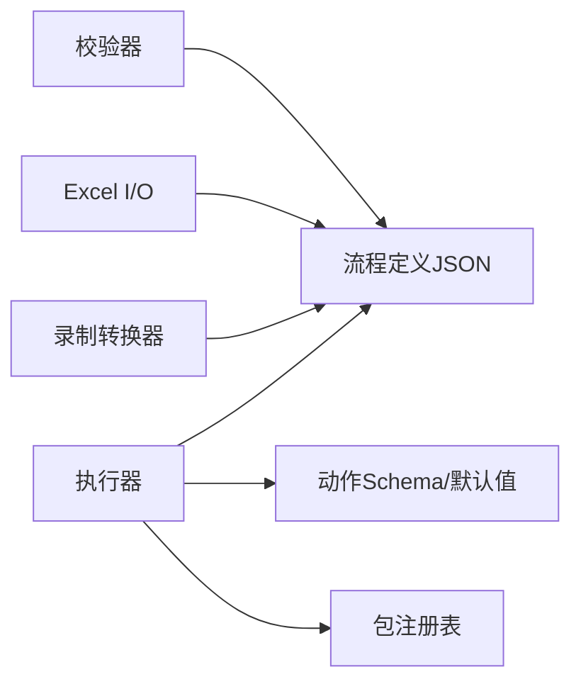

# 流程定义语法

<cite>
**本文引用的文件**   
- [flow_definition.json](file://flow_definition.json)
- [wt_flow_executor.py](file://wt_flow_executor.py)
- [wt_flow_validation.py](file://wt_flow_validation.py)
- [wt_action_schema.py](file://wt_action_schema.py)
- [wt_action_defaults.py](file://wt_action_defaults.py)
- [flow_excel_io.py](file://flow_excel_io.py)
- [flow_recorder_converter.py](file://flow_recorder_converter.py)
- [samples/flows/flow_definition_gm_sample.json](file://samples/flows/flow_definition_gm_sample.json)
- [samples/flows/flow_definition_新建风机类型.json](file://samples/flows/flow_definition_新建风机类型.json)
- [samples/flows/气象数据录入_20260625_converted_flow.json](file://samples/flows/气象数据录入_20260625_converted_flow.json)
- [flow_packages/flow_package_registry.json](file://flow_packages/flow_package_registry.json)
- [flow_packages/flow_definition_geo_import_data_file.json](file://flow_packages/flow_definition_geo_import_data_file.json)
- [flow_packages/flow_definition_microscale_create_model.json](file://flow_packages/flow_definition_microscale_create_model.json)
- [flow_packages/flow_definition_turbine_type_create_and_curves.json](file://flow_packages/flow_definition_turbine_type_create_and_curves.json)
- [flow_packages/flow_definition_创建一个新建模.json](file://flow_packages/flow_definition_创建一个新建模.json)
- [flow_packages/flow_definition_导入测风塔、机位点.json](file://flow_packages/flow_definition_导入测风塔、机位点.json)
- [flow_packages/flow_definition_新建风机类型.json](file://flow_packages/flow_definition_新建风机类型.json)
- [flow_packages/flow_definition_测试.json](file://flow_packages/flow_definition_测试.json)
- [flow_packages/气象数据录入_CFE02_steps.json](file://flow_packages/气象数据录入_CFE02_steps.json)
</cite>

## 目录
1. [简介](#简介)
2. [项目结构](#项目结构)
3. [核心组件](#核心组件)
4. [架构总览](#架构总览)
5. [详细组件分析](#详细组件分析)
6. [依赖关系分析](#依赖关系分析)
7. [性能考虑](#性能考虑)
8. [故障排查指南](#故障排查指南)
9. [结论](#结论)
10. [附录](#附录)

## 简介
本文件面向WT自动化框架的用户与开发者，系统化说明JSON格式的流程定义语法与数据模型。内容涵盖：
- 流程定义的层次结构与根节点属性
- 步骤数组与参数配置规范
- 动作类型（action types）定义与扩展机制
- 参数化配置：变量引用、条件判断、循环控制
- 错误处理与重试机制
- 完整示例与最佳实践

## 项目结构
WT自动化框架将“流程定义”以JSON形式持久化，并通过执行器解析与运行；校验器负责在运行前进行规则检查；动作模式由schema与默认值共同约束；同时提供从录制脚本到流程定义的转换工具以及Excel读写能力。

图表来源
- [flow_definition.json:1-200](file://flow_definition.json#L1-L200)
- [wt_flow_executor.py:1-200](file://wt_flow_executor.py#L1-L200)
- [wt_flow_validation.py:1-200](file://wt_flow_validation.py#L1-L200)
- [wt_action_schema.py:1-200](file://wt_action_schema.py#L1-L200)
- [wt_action_defaults.py:1-200](file://wt_action_defaults.py#L1-L200)
- [flow_recorder_converter.py:1-200](file://flow_recorder_converter.py#L1-L200)
- [flow_excel_io.py:1-200](file://flow_excel_io.py#L1-L200)
- [flow_packages/flow_package_registry.json:1-200](file://flow_packages/flow_package_registry.json#L1-L200)
- [samples/flows/flow_definition_gm_sample.json:1-200](file://samples/flows/flow_definition_gm_sample.json#L1-L200)

章节来源
- [flow_definition.json:1-200](file://flow_definition.json#L1-L200)
- [wt_flow_executor.py:1-200](file://wt_flow_executor.py#L1-L200)
- [wt_flow_validation.py:1-200](file://wt_flow_validation.py#L1-L200)
- [wt_action_schema.py:1-200](file://wt_action_schema.py#L1-L200)
- [wt_action_defaults.py:1-200](file://wt_action_defaults.py#L1-L200)
- [flow_recorder_converter.py:1-200](file://flow_recorder_converter.py#L1-L200)
- [flow_excel_io.py:1-200](file://flow_excel_io.py#L1-L200)
- [flow_packages/flow_package_registry.json:1-200](file://flow_packages/flow_package_registry.json#L1-L200)
- [samples/flows/flow_definition_gm_sample.json:1-200](file://samples/flows/flow_definition_gm_sample.json#L1-L200)

## 核心组件
- 流程定义JSON：描述顶层元信息、全局上下文、步骤序列、异常策略等。
- 执行器：加载并解析流程定义，按步骤顺序执行，支持变量注入、条件分支、循环、错误处理与重试。
- 校验器：在运行前对流程定义进行静态校验，包括必填字段、类型约束、动作类型白名单、参数完整性等。
- 动作Schema与默认值：为每个动作类型定义参数模式与缺省值，确保一致性并可扩展自定义动作。
- 录制转换器：将录制脚本转换为标准流程定义JSON。
- Excel I/O：将流程定义与Excel表格互转，便于批量编辑与数据驱动。
- 包注册表：集中管理可复用流程包，供执行器按需加载。

章节来源
- [wt_flow_executor.py:1-200](file://wt_flow_executor.py#L1-L200)
- [wt_flow_validation.py:1-200](file://wt_flow_validation.py#L1-L200)
- [wt_action_schema.py:1-200](file://wt_action_schema.py#L1-L200)
- [wt_action_defaults.py:1-200](file://wt_action_defaults.py#L1-L200)
- [flow_recorder_converter.py:1-200](file://flow_recorder_converter.py#L1-L200)
- [flow_excel_io.py:1-200](file://flow_excel_io.py#L1-L200)
- [flow_packages/flow_package_registry.json:1-200](file://flow_packages/flow_package_registry.json#L1-L200)

## 架构总览
下图展示了从流程定义到执行的端到端路径，以及校验、动作模式、包注册与外部数据源之间的交互。

图表来源
- [wt_flow_executor.py:1-200](file://wt_flow_executor.py#L1-L200)
- [wt_flow_validation.py:1-200](file://wt_flow_validation.py#L1-L200)
- [wt_action_schema.py:1-200](file://wt_action_schema.py#L1-L200)
- [wt_action_defaults.py:1-200](file://wt_action_defaults.py#L1-L200)
- [flow_packages/flow_package_registry.json:1-200](file://flow_packages/flow_package_registry.json#L1-L200)
- [flow_recorder_converter.py:1-200](file://flow_recorder_converter.py#L1-L200)
- [flow_excel_io.py:1-200](file://flow_excel_io.py#L1-L200)

## 详细组件分析

### 流程定义JSON数据模型
- 根节点
  - 元信息：名称、版本、描述、作者、创建时间等
  - 全局上下文：全局变量、环境变量、超时、日志级别等
  - 步骤数组：有序执行的动作列表
  - 异常策略：全局错误处理、重试策略、失败行为
- 步骤项
  - 动作类型：标识具体操作（如点击、输入、选择、等待、断言等）
  - 参数：动作所需输入，支持变量引用、表达式、模板
  - 条件：布尔表达式，决定是否执行该步骤
  - 重试：覆盖全局的重试次数与退避策略
  - 标签/分组：用于组织与筛选
  - 备注：人类可读的说明
- 变量系统
  - 作用域：全局、步骤级、局部
  - 引用方式：占位符或函数式调用
  - 内置函数：字符串处理、日期时间、数学运算、集合操作等
- 高级特性
  - 条件分支：if/else 或 switch/case
  - 循环：for/while，支持迭代器与步进
  - 子流程：调用其他流程或流程包中的片段
  - 并行：并发执行多个步骤（可选）

章节来源
- [flow_definition.json:1-200](file://flow_definition.json#L1-L200)
- [samples/flows/flow_definition_gm_sample.json:1-200](file://samples/flows/flow_definition_gm_sample.json#L1-L200)
- [samples/flows/flow_definition_新建风机类型.json:1-200](file://samples/flows/flow_definition_新建风机类型.json#L1-L200)
- [samples/flows/气象数据录入_20260625_converted_flow.json:1-200](file://samples/flows/气象数据录入_20260625_converted_flow.json#L1-L200)

### 动作类型（Action Types）与扩展机制
- 内置动作
  - UI交互：点击、输入、选择、拖拽、截图、等待
  - 业务操作：打开窗口、切换标签、保存、导出、刷新
  - 验证：断言文本、断言元素存在、断言数值范围
  - 控制流：跳转、返回、抛出异常、记录日志
- 动作Schema
  - 每个动作类型对应一个Schema，定义参数名、类型、是否必填、默认值、取值范围、枚举、正则等
  - Schema由wt_action_schema.py维护，配合wt_action_defaults.py提供缺省值
- 自定义动作扩展
  - 通过注册新动作类型与实现其执行逻辑，并在Schema中声明参数
  - 可在流程包中封装常用动作组合，形成可复用的“宏”
  - 执行器在运行时根据动作类型分派到对应处理器

图表来源
- [wt_action_schema.py:1-200](file://wt_action_schema.py#L1-L200)
- [wt_action_defaults.py:1-200](file://wt_action_defaults.py#L1-L200)
- [wt_flow_executor.py:1-200](file://wt_flow_executor.py#L1-L200)
- [flow_packages/flow_package_registry.json:1-200](file://flow_packages/flow_package_registry.json#L1-L200)

章节来源
- [wt_action_schema.py:1-200](file://wt_action_schema.py#L1-L200)
- [wt_action_defaults.py:1-200](file://wt_action_defaults.py#L1-L200)
- [flow_packages/flow_package_registry.json:1-200](file://flow_packages/flow_package_registry.json#L1-L200)

### 参数化配置与高级特性
- 变量引用
  - 使用占位符或函数式语法引用上下文变量
  - 支持嵌套对象与数组访问
- 条件判断
  - 基于变量的布尔表达式决定步骤是否执行
  - 支持比较、逻辑运算、包含判断等
- 循环控制
  - for循环：遍历数组或范围
  - while循环：基于条件持续执行直到不满足
  - 循环内变量：每次迭代的临时变量与作用域隔离
- 子流程与复用
  - 通过引用流程包中的片段，实现模块化与复用
  - 支持传入参数与返回值

图表来源
- [wt_flow_executor.py:1-200](file://wt_flow_executor.py#L1-L200)
- [flow_definition.json:1-200](file://flow_definition.json#L1-L200)

章节来源
- [wt_flow_executor.py:1-200](file://wt_flow_executor.py#L1-L200)
- [flow_definition.json:1-200](file://flow_definition.json#L1-L200)

### 错误处理与重试机制
- 全局异常策略
  - 失败行为：继续、中止、回滚、忽略
  - 日志级别与输出目标
- 步骤级重试
  - 最大重试次数、退避策略（固定间隔、指数退避）、重试条件（仅特定异常）
- 断言失败
  - 断言失败视为异常，可按策略处理
- 恢复与补偿
  - 在失败后执行清理步骤或补偿动作

图表来源
- [wt_flow_executor.py:1-200](file://wt_flow_executor.py#L1-L200)
- [flow_definition.json:1-200](file://flow_definition.json#L1-L200)

章节来源
- [wt_flow_executor.py:1-200](file://wt_flow_executor.py#L1-L200)
- [flow_definition.json:1-200](file://flow_definition.json#L1-L200)

### 流程验证规则与最佳实践
- 验证规则
  - 必填字段：动作类型、参数键集
  - 类型约束：参数类型、取值范围、枚举
  - 依赖关系：前置步骤输出作为后续输入
  - 命名规范：变量与作用域唯一性
- 最佳实践
  - 将通用操作封装为流程包
  - 使用清晰的变量命名与作用域
  - 合理设置重试与超时，避免误判
  - 在关键步骤添加断言，保证状态一致
  - 使用标签与分组提升可维护性

章节来源
- [wt_flow_validation.py:1-200](file://wt_flow_validation.py#L1-L200)
- [flow_packages/flow_package_registry.json:1-200](file://flow_packages/flow_package_registry.json#L1-L200)

### 完整示例与用法
- 简单单步操作
  - 示例：打开窗口并点击按钮
  - 参考：[samples/flows/flow_definition_gm_sample.json:1-200](file://samples/flows/flow_definition_gm_sample.json#L1-L200)
- 多步骤业务流程
  - 示例：新建风机类型、导入数据、生成曲线
  - 参考：[samples/flows/flow_definition_新建风机类型.json:1-200](file://samples/flows/flow_definition_新建风机类型.json#L1-L200)
  - 参考：[samples/flows/气象数据录入_20260625_converted_flow.json:1-200](file://samples/flows/气象数据录入_20260625_converted_flow.json#L1-L200)
- 流程包复用
  - 地理数据导入、微尺度建模、风机类型创建与曲线
  - 参考：
    - [flow_packages/flow_definition_geo_import_data_file.json:1-200](file://flow_packages/flow_definition_geo_import_data_file.json#L1-L200)
    - [flow_packages/flow_definition_microscale_create_model.json:1-200](file://flow_packages/flow_definition_microscale_create_model.json#L1-L200)
    - [flow_packages/flow_definition_turbine_type_create_and_curves.json:1-200](file://flow_packages/flow_definition_turbine_type_create_and_curves.json#L1-L200)
    - [flow_packages/flow_definition_创建一个新建模.json:1-200](file://flow_packages/flow_definition_创建一个新建模.json#L1-L200)
    - [flow_packages/flow_definition_导入测风塔、机位点.json:1-200](file://flow_packages/flow_definition_导入测风塔、机位点.json#L1-L200)
    - [flow_packages/flow_definition_新建风机类型.json:1-200](file://flow_packages/flow_definition_新建风机类型.json#L1-L200)
    - [flow_packages/flow_definition_测试.json:1-200](file://flow_packages/flow_definition_测试.json#L1-L200)
    - [flow_packages/气象数据录入_CFE02_steps.json:1-200](file://flow_packages/气象数据录入_CFE02_steps.json#L1-L200)

章节来源
- [samples/flows/flow_definition_gm_sample.json:1-200](file://samples/flows/flow_definition_gm_sample.json#L1-L200)
- [samples/flows/flow_definition_新建风机类型.json:1-200](file://samples/flows/flow_definition_新建风机类型.json#L1-L200)
- [samples/flows/气象数据录入_20260625_converted_flow.json:1-200](file://samples/flows/气象数据录入_20260625_converted_flow.json#L1-L200)
- [flow_packages/flow_definition_geo_import_data_file.json:1-200](file://flow_packages/flow_definition_geo_import_data_file.json#L1-L200)
- [flow_packages/flow_definition_microscale_create_model.json:1-200](file://flow_packages/flow_definition_microscale_create_model.json#L1-L200)
- [flow_packages/flow_definition_turbine_type_create_and_curves.json:1-200](file://flow_packages/flow_definition_turbine_type_create_and_curves.json#L1-L200)
- [flow_packages/flow_definition_创建一个新建模.json:1-200](file://flow_packages/flow_definition_创建一个新建模.json#L1-L200)
- [flow_packages/flow_definition_导入测风塔、机位点.json:1-200](file://flow_packages/flow_definition_导入测风塔、机位点.json#L1-L200)
- [flow_packages/flow_definition_新建风机类型.json:1-200](file://flow_packages/flow_definition_新建风机类型.json#L1-L200)
- [flow_packages/flow_definition_测试.json:1-200](file://flow_packages/flow_definition_测试.json#L1-L200)
- [flow_packages/气象数据录入_CFE02_steps.json:1-200](file://flow_packages/气象数据录入_CFE02_steps.json#L1-L200)

## 依赖关系分析
- 模块耦合
  - 执行器依赖动作Schema与默认值，确保参数正确性与一致性
  - 校验器独立于执行器，提供运行前静态检查
  - 包注册表为执行器提供可扩展的动作与流程片段
- 外部集成
  - Excel I/O与录制转换器为流程定义提供便捷的生产与编辑入口
  - 示例流程与流程包作为参考与复用资产

图表来源
- [wt_flow_validation.py:1-200](file://wt_flow_validation.py#L1-L200)
- [wt_flow_executor.py:1-200](file://wt_flow_executor.py#L1-L200)
- [wt_action_schema.py:1-200](file://wt_action_schema.py#L1-L200)
- [wt_action_defaults.py:1-200](file://wt_action_defaults.py#L1-L200)
- [flow_excel_io.py:1-200](file://flow_excel_io.py#L1-L200)
- [flow_recorder_converter.py:1-200](file://flow_recorder_converter.py#L1-L200)
- [flow_packages/flow_package_registry.json:1-200](file://flow_packages/flow_package_registry.json#L1-L200)

章节来源
- [wt_flow_validation.py:1-200](file://wt_flow_validation.py#L1-L200)
- [wt_flow_executor.py:1-200](file://wt_flow_executor.py#L1-L200)
- [wt_action_schema.py:1-200](file://wt_action_schema.py#L1-L200)
- [wt_action_defaults.py:1-200](file://wt_action_defaults.py#L1-L200)
- [flow_excel_io.py:1-200](file://flow_excel_io.py#L1-L200)
- [flow_recorder_converter.py:1-200](file://flow_recorder_converter.py#L1-L200)
- [flow_packages/flow_package_registry.json:1-200](file://flow_packages/flow_package_registry.json#L1-L200)

## 性能考虑
- 减少不必要的等待与重试，合理设置超时
- 使用缓存与批量操作降低UI交互开销
- 将重复逻辑封装为流程包，避免冗余步骤
- 在大数据量场景下优先使用Excel I/O与数据驱动

## 故障排查指南
- 常见问题
  - 动作参数缺失或类型不符：检查Schema与默认值
  - 变量未定义或作用域错误：确认变量声明与引用路径
  - 条件表达式语法错误：简化表达式逐步定位
  - 重试风暴：调整退避策略与最大重试次数
- 诊断建议
  - 启用更详细的日志输出
  - 使用校验器提前发现问题
  - 拆分复杂流程为子流程，缩小问题范围

章节来源
- [wt_flow_validation.py:1-200](file://wt_flow_validation.py#L1-L200)
- [wt_flow_executor.py:1-200](file://wt_flow_executor.py#L1-L200)

## 结论
WT自动化框架通过JSON流程定义实现了高内聚、低耦合的可编排自动化能力。借助严格的Schema约束、灵活的参数化与强大的执行器，用户能够构建从简单到复杂的各类业务流程。遵循本文档的规范与最佳实践，可显著提升流程的健壮性与可维护性。

## 附录
- 术语
  - 流程定义：描述自动化流程的JSON文档
  - 动作类型：具体操作的标识与参数模式
  - 流程包：可复用的流程片段集合
- 参考文件
  - 主流程定义：[flow_definition.json:1-200](file://flow_definition.json#L1-L200)
  - 执行器：[wt_flow_executor.py:1-200](file://wt_flow_executor.py#L1-L200)
  - 校验器：[wt_flow_validation.py:1-200](file://wt_flow_validation.py#L1-L200)
  - 动作Schema与默认值：[wt_action_schema.py:1-200](file://wt_action_schema.py#L1-L200)、[wt_action_defaults.py:1-200](file://wt_action_defaults.py#L1-L200)
  - Excel I/O：[flow_excel_io.py:1-200](file://flow_excel_io.py#L1-L200)
  - 录制转换器：[flow_recorder_converter.py:1-200](file://flow_recorder_converter.py#L1-L200)
  - 包注册表：[flow_packages/flow_package_registry.json:1-200](file://flow_packages/flow_package_registry.json#L1-L200)
  - 示例流程：见“完整示例与用法”部分