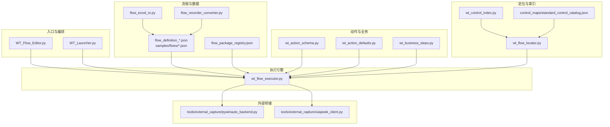
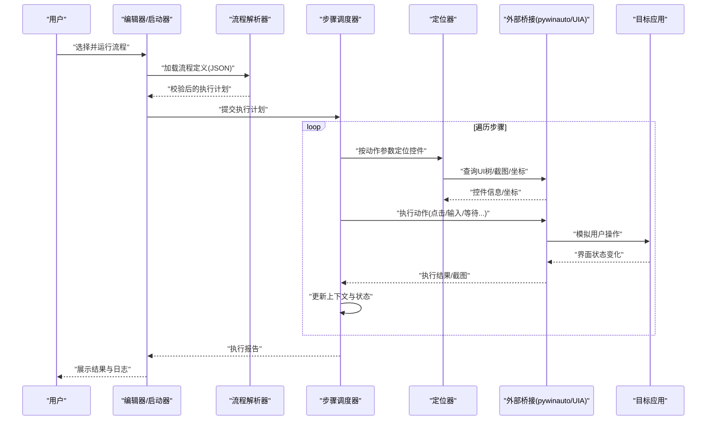
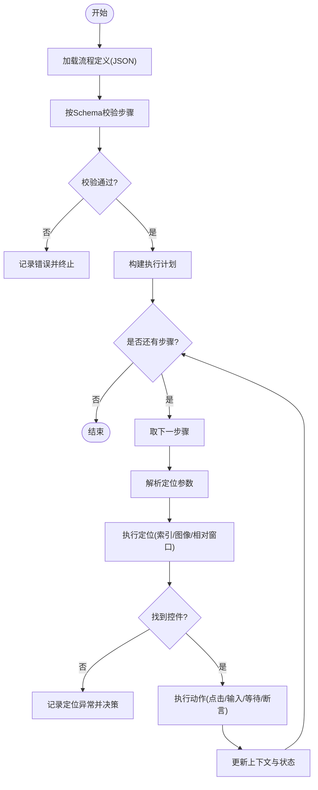
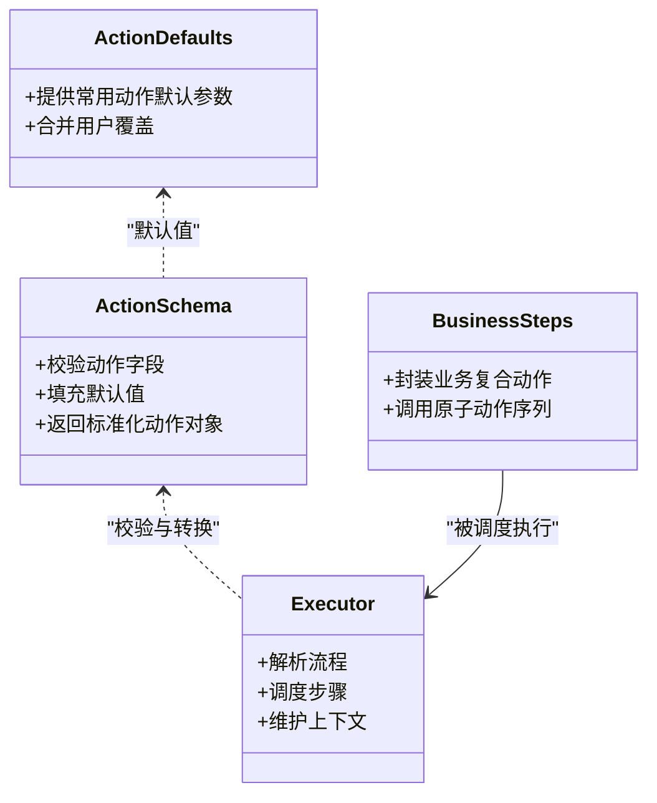
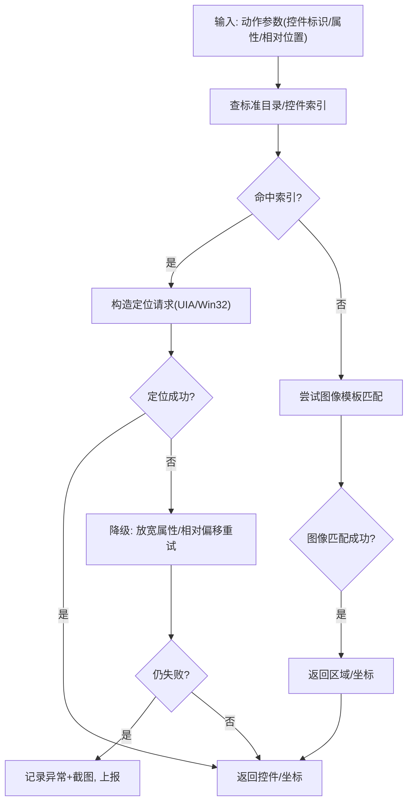
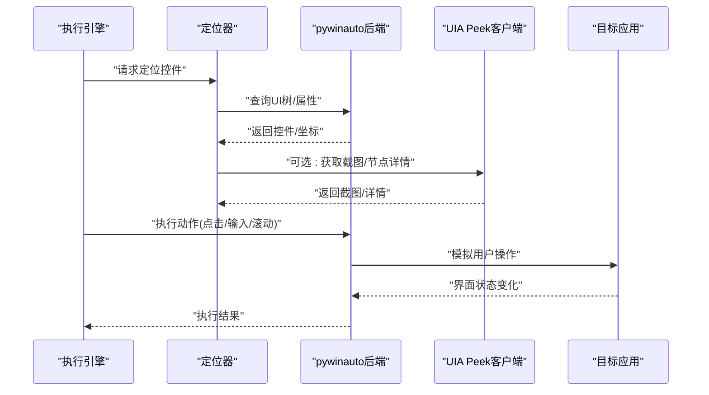
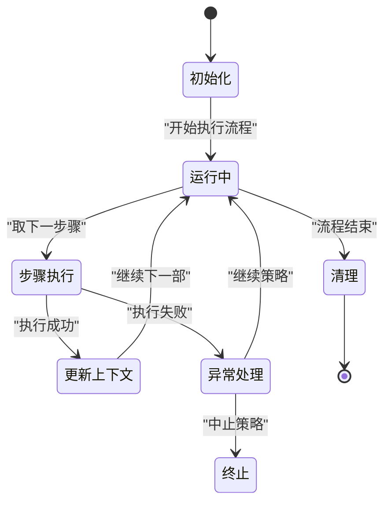
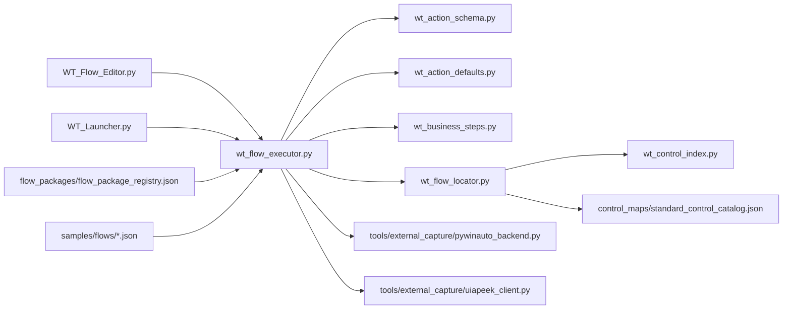

# 自动化原理

<cite>
**本文引用的文件**   
- [README.md](file://README.md)
- [PROJECT_ARCHITECTURE.md](file://PROJECT_ARCHITECTURE.md)
- [WT_Flow_Editor.py](file://WT_Flow_Editor.py)
- [WT_Launcher.py](file://WT_Launcher.py)
- [wt_flow_executor.py](file://wt_flow_executor.py)
- [wt_flow_locator.py](file://wt_flow_locator.py)
- [wt_control_index.py](file://wt_control_index.py)
- [flow_recorder_converter.py](file://flow_recorder_converter.py)
- [flow_excel_io.py](file://flow_excel_io.py)
- [wt_action_schema.py](file://wt_action_schema.py)
- [wt_action_defaults.py](file://wt_action_defaults.py)
- [wt_business_steps.py](file://wt_business_steps.py)
- [tools/external_capture/pywinauto_backend.py](file://tools/external_capture/pywinauto_backend.py)
- [tools/external_capture/uiapeek_client.py](file://tools/external_capture/uiapeek_client.py)
- [control_maps/standard_control_catalog.json](file://control_maps/standard_control_catalog.json)
- [flow_packages/flow_package_registry.json](file://flow_packages/flow_package_registry.json)
- [samples/flows/flow_definition_新建风机类型.json](file://samples/flows/flow_definition_新建风机类型.json)
</cite>

## 目录
1. [引言](#引言)
2. [项目结构](#项目结构)
3. [核心组件](#核心组件)
4. [架构总览](#架构总览)
5. [详细组件分析](#详细组件分析)
6. [依赖关系分析](#依赖关系分析)
7. [性能考量](#性能考量)
8. [故障排查指南](#故障排查指南)
9. [结论](#结论)
10. [附录](#附录)

## 引言
本章节面向初学者与工程实践者，系统阐述WT自动化框架的自动化原理与基础概念。内容涵盖UI自动化的基本工作原理（控件识别、用户操作模拟、事件驱动机制）、执行引擎的整体架构设计（流程解析器、步骤调度器、异常处理机制）、动作模式（Action Pattern）在自动化中的应用、状态管理与上下文传递机制，并通过具体代码示例路径帮助理解自动化本质与工作方式。

## 项目结构
WT自动化框架采用“流程定义 + 动作模式 + 控件索引 + 执行引擎”的分层架构：
- 顶层入口：编辑器与启动器负责加载流程、提供可视化编辑与运行入口
- 流程层：以JSON定义的流程包与标准目录，描述业务步骤序列
- 动作层：标准化动作Schema与默认值，支撑可复用逻辑
- 定位与索引层：控件索引与多模态定位（UIA/Win32/图像模板），实现稳健的控件识别
- 执行层：流程解析器与步骤调度器，驱动动作执行与异常处理
- 外部桥接层：通过pywinauto与UIA Peek客户端对接底层UI树与输入输出

图表来源
- [WT_Flow_Editor.py](file://WT_Flow_Editor.py)
- [WT_Launcher.py](file://WT_Launcher.py)
- [wt_flow_executor.py](file://wt_flow_executor.py)
- [wt_flow_locator.py](file://wt_flow_locator.py)
- [wt_control_index.py](file://wt_control_index.py)
- [flow_recorder_converter.py](file://flow_recorder_converter.py)
- [flow_excel_io.py](file://flow_excel_io.py)
- [wt_action_schema.py](file://wt_action_schema.py)
- [wt_action_defaults.py](file://wt_action_defaults.py)
- [wt_business_steps.py](file://wt_business_steps.py)
- [tools/external_capture/pywinauto_backend.py](file://tools/external_capture/pywinauto_backend.py)
- [tools/external_capture/uiapeek_client.py](file://tools/external_capture/uiapeek_client.py)
- [control_maps/standard_control_catalog.json](file://control_maps/standard_control_catalog.json)
- [flow_packages/flow_package_registry.json](file://flow_packages/flow_package_registry.json)
- [samples/flows/flow_definition_新建风机类型.json](file://samples/flows/flow_definition_新建风机类型.json)

章节来源
- [README.md](file://README.md)
- [PROJECT_ARCHITECTURE.md](file://PROJECT_ARCHITECTURE.md)

## 核心组件
- 流程定义与注册：流程包以JSON描述步骤序列，注册表集中管理可用流程；Excel导入与录制转换工具用于生成或迁移流程定义
- 动作模式：通过Schema约束动作字段与校验规则，结合默认值与业务步骤封装，形成可复用的原子能力
- 控件索引与定位：维护标准控件目录与运行时索引，支持相对窗口定位、多尺度图像匹配与自修复定位策略
- 执行引擎：解析流程、调度步骤、捕获并上报异常，维持执行上下文与状态一致性
- 外部桥接：基于pywinauto与UIA Peek客户端访问目标应用UI树、发送输入与截图，屏蔽底层差异

章节来源
- [flow_packages/flow_package_registry.json](file://flow_packages/flow_package_registry.json)
- [flow_excel_io.py](file://flow_excel_io.py)
- [flow_recorder_converter.py](file://flow_recorder_converter.py)
- [wt_action_schema.py](file://wt_action_schema.py)
- [wt_action_defaults.py](file://wt_action_defaults.py)
- [wt_business_steps.py](file://wt_business_steps.py)
- [wt_control_index.py](file://wt_control_index.py)
- [wt_flow_locator.py](file://wt_flow_locator.py)
- [wt_flow_executor.py](file://wt_flow_executor.py)
- [tools/external_capture/pywinauto_backend.py](file://tools/external_capture/pywinauto_backend.py)
- [tools/external_capture/uiapeek_client.py](file://tools/external_capture/uiapeek_client.py)

## 架构总览
WT自动化框架遵循“声明式流程 + 标准化动作 + 稳健定位 + 健壮执行”的设计原则。整体工作流如下：
- 入口层：编辑器/启动器加载流程包与配置，初始化执行环境
- 解析层：流程解析器读取JSON步骤，按Schema校验并转换为内部执行计划
- 调度层：步骤调度器依次执行动作，维护上下文（如当前窗口、控件句柄、截图缓存等）
- 定位层：根据控件索引与多模态策略定位目标元素，必要时进行相对偏移与容错重试
- 执行层：调用外部桥接层完成点击、输入、滚动、等待等操作，记录日志与结果
- 异常处理：统一捕获异常，分类上报，支持回滚或继续策略

图表来源
- [WT_Flow_Editor.py](file://WT_Flow_Editor.py)
- [WT_Launcher.py](file://WT_Launcher.py)
- [wt_flow_executor.py](file://wt_flow_executor.py)
- [wt_flow_locator.py](file://wt_flow_locator.py)
- [tools/external_capture/pywinauto_backend.py](file://tools/external_capture/pywinauto_backend.py)
- [tools/external_capture/uiapeek_client.py](file://tools/external_capture/uiapeek_client.py)

## 详细组件分析

### 流程解析器与步骤调度器
- 流程解析器负责：
  - 从注册表或样本目录加载流程定义
  - 依据动作Schema对每个步骤进行字段校验与默认值填充
  - 将声明式步骤转换为可执行的内部计划（含顺序、条件分支、循环等语义）
- 步骤调度器负责：
  - 按执行计划逐项调度，维护执行上下文（当前窗口、最近控件、截图缓存、变量等）
  - 捕获异常并分类（定位失败、动作失败、超时、断言失败等），决定继续或中止
  - 生成结构化执行报告（步骤级结果、耗时、截图、错误堆栈）

图表来源
- [wt_flow_executor.py](file://wt_flow_executor.py)
- [wt_action_schema.py](file://wt_action_schema.py)
- [wt_flow_locator.py](file://wt_flow_locator.py)

章节来源
- [wt_flow_executor.py](file://wt_flow_executor.py)
- [wt_action_schema.py](file://wt_action_schema.py)
- [wt_flow_locator.py](file://wt_flow_locator.py)

### 动作模式（Action Pattern）
- 标准化动作定义：
  - Schema约束动作字段（类型、必填项、取值范围、默认值）
  - 默认值与业务步骤封装，降低重复配置成本
- 可复用逻辑：
  - 将常见交互抽象为原子动作（如“点击”、“输入文本”、“选择下拉项”、“等待就绪”）
  - 组合复杂业务场景（如“创建新风机类型”）由多个原子动作串联而成
- 扩展性：
  - 新增动作只需实现对应处理器并在注册表中暴露，无需改动执行引擎

图表来源
- [wt_action_schema.py](file://wt_action_schema.py)
- [wt_action_defaults.py](file://wt_action_defaults.py)
- [wt_business_steps.py](file://wt_business_steps.py)
- [wt_flow_executor.py](file://wt_flow_executor.py)

章节来源
- [wt_action_schema.py](file://wt_action_schema.py)
- [wt_action_defaults.py](file://wt_action_defaults.py)
- [wt_business_steps.py](file://wt_business_steps.py)

### 控件识别与定位机制
- 控件索引与标准目录：
  - 标准控件目录集中描述通用控件属性（名称、类名、角色、层级等）
  - 运行时控件索引动态构建，提升查找效率与稳定性
- 多模态定位策略：
  - UIA/Win32树查询：基于属性匹配与层级关系
  - 图像模板匹配：在多尺度下匹配图标或区域
  - 相对窗口定位：以父窗口或已知控件为基准计算偏移
- 自修复与容错：
  - 当主定位失败时，尝试降级策略（如图像匹配、放宽属性匹配）
  - 记录定位轨迹与截图，便于问题回溯

图表来源
- [wt_control_index.py](file://wt_control_index.py)
- [wt_flow_locator.py](file://wt_flow_locator.py)
- [control_maps/standard_control_catalog.json](file://control_maps/standard_control_catalog.json)

章节来源
- [wt_control_index.py](file://wt_control_index.py)
- [wt_flow_locator.py](file://wt_flow_locator.py)
- [control_maps/standard_control_catalog.json](file://control_maps/standard_control_catalog.json)

### 外部桥接与事件驱动
- pywinauto后端：
  - 访问目标应用UI树、获取控件属性与坐标
  - 发送鼠标/键盘事件，触发应用响应
- UIA Peek客户端：
  - 作为轻量级桥接，辅助获取UIA节点信息与截图
- 事件驱动机制：
  - 监听关键事件（窗口打开/关闭、控件可见性变化、加载完成）
  - 在动作前后插入等待与断言，确保时序正确

图表来源
- [tools/external_capture/pywinauto_backend.py](file://tools/external_capture/pywinauto_backend.py)
- [tools/external_capture/uiapeek_client.py](file://tools/external_capture/uiapeek_client.py)
- [wt_flow_executor.py](file://wt_flow_executor.py)
- [wt_flow_locator.py](file://wt_flow_locator.py)

章节来源
- [tools/external_capture/pywinauto_backend.py](file://tools/external_capture/pywinauto_backend.py)
- [tools/external_capture/uiapeek_client.py](file://tools/external_capture/uiapeek_client.py)
- [wt_flow_executor.py](file://wt_flow_executor.py)
- [wt_flow_locator.py](file://wt_flow_locator.py)

### 状态管理与上下文传递
- 执行上下文包含：
  - 当前活动窗口/进程、最近定位的控件、截图缓存、变量字典、统计指标
- 上下文生命周期：
  - 初始化：加载流程与配置，建立会话
  - 步骤间传递：每步执行后更新上下文，供后续步骤使用
  - 清理：执行结束后释放资源、归档报告
- 一致性保障：
  - 原子化更新：单步内上下文变更不可分割
  - 快照与回滚：关键步骤前保存快照，异常时可恢复

图表来源
- [wt_flow_executor.py](file://wt_flow_executor.py)

章节来源
- [wt_flow_executor.py](file://wt_flow_executor.py)

### 具体代码示例与应用
- 流程定义示例：
  - 参考样本流程定义，了解步骤结构与字段含义
  - 路径：[samples/flows/flow_definition_新建风机类型.json](file://samples/flows/flow_definition_新建风机类型.json)
- 流程注册与批量管理：
  - 查看注册表组织方式，了解如何添加新流程包
  - 路径：[flow_packages/flow_package_registry.json](file://flow_packages/flow_package_registry.json)
- 动作Schema与默认值：
  - 学习动作字段的约束与默认值填充策略
  - 路径：[wt_action_schema.py](file://wt_action_schema.py)、[wt_action_defaults.py](file://wt_action_defaults.py)
- 业务步骤封装：
  - 观察如何将多个原子动作组合为业务复合动作
  - 路径：[wt_business_steps.py](file://wt_business_steps.py)
- 定位与索引：
  - 了解标准控件目录与运行时索引的使用方式
  - 路径：[control_maps/standard_control_catalog.json](file://control_maps/standard_control_catalog.json)、[wt_control_index.py](file://wt_control_index.py)
- 外部桥接：
  - 查看pywinauto与UIA Peek客户端的调用方式
  - 路径：[tools/external_capture/pywinauto_backend.py](file://tools/external_capture/pywinauto_backend.py)、[tools/external_capture/uiapeek_client.py](file://tools/external_capture/uiapeek_client.py)

章节来源
- [samples/flows/flow_definition_新建风机类型.json](file://samples/flows/flow_definition_新建风机类型.json)
- [flow_packages/flow_package_registry.json](file://flow_packages/flow_package_registry.json)
- [wt_action_schema.py](file://wt_action_schema.py)
- [wt_action_defaults.py](file://wt_action_defaults.py)
- [wt_business_steps.py](file://wt_business_steps.py)
- [control_maps/standard_control_catalog.json](file://control_maps/standard_control_catalog.json)
- [wt_control_index.py](file://wt_control_index.py)
- [tools/external_capture/pywinauto_backend.py](file://tools/external_capture/pywinauto_backend.py)
- [tools/external_capture/uiapeek_client.py](file://tools/external_capture/uiapeek_client.py)

## 依赖关系分析
- 模块耦合与内聚：
  - 执行引擎与动作Schema强耦合（校验与转换），与定位器松耦合（接口抽象）
  - 定位器与外部桥接解耦（通过后端接口），提高可替换性
- 直接依赖：
  - 编辑器/启动器依赖执行引擎与流程注册表
  - 执行引擎依赖动作Schema、默认值、业务步骤、定位器、外部桥接
- 间接依赖：
  - 流程定义依赖标准控件目录与控件索引
  - 录制转换与Excel导入依赖流程定义格式

图表来源
- [WT_Flow_Editor.py](file://WT_Flow_Editor.py)
- [WT_Launcher.py](file://WT_Launcher.py)
- [wt_flow_executor.py](file://wt_flow_executor.py)
- [wt_action_schema.py](file://wt_action_schema.py)
- [wt_action_defaults.py](file://wt_action_defaults.py)
- [wt_business_steps.py](file://wt_business_steps.py)
- [wt_flow_locator.py](file://wt_flow_locator.py)
- [wt_control_index.py](file://wt_control_index.py)
- [control_maps/standard_control_catalog.json](file://control_maps/standard_control_catalog.json)
- [tools/external_capture/pywinauto_backend.py](file://tools/external_capture/pywinauto_backend.py)
- [tools/external_capture/uiapeek_client.py](file://tools/external_capture/uiapeek_client.py)
- [flow_packages/flow_package_registry.json](file://flow_packages/flow_package_registry.json)
- [samples/flows/flow_definition_新建风机类型.json](file://samples/flows/flow_definition_新建风机类型.json)

章节来源
- [PROJECT_ARCHITECTURE.md](file://PROJECT_ARCHITECTURE.md)

## 性能考量
- 定位优化：
  - 优先使用控件索引与标准目录，减少全树扫描
  - 合理设置图像模板阈值与多尺度范围，避免过度匹配
- 执行优化：
  - 批量操作合并（如连续输入）减少UI刷新次数
  - 异步等待与超时控制，避免阻塞
- 资源管理：
  - 及时释放截图与临时文件，避免内存泄漏
  - 复用UIA连接与会话，减少重建开销

## 故障排查指南
- 常见问题定位：
  - 定位失败：检查控件索引与标准目录是否更新，确认相对窗口与偏移是否正确
  - 动作失败：核对动作Schema字段与默认值，确认目标应用状态（窗口可见、控件启用）
  - 时序问题：增加等待与断言，确保页面加载完成
- 日志与报告：
  - 查看步骤级执行报告（耗时、截图、错误堆栈）
  - 对比标准控件目录与实际UI树差异，修正索引
- 调试建议：
  - 使用录制转换工具回放并比对步骤
  - 借助Excel导入导出流程，快速迭代与回归验证

章节来源
- [flow_recorder_converter.py](file://flow_recorder_converter.py)
- [flow_excel_io.py](file://flow_excel_io.py)
- [wt_flow_executor.py](file://wt_flow_executor.py)

## 结论
WT自动化框架通过标准化的动作模式、稳健的控件定位与清晰的执行引擎，实现了高可维护性与可扩展性的UI自动化。其分层架构与上下文管理机制确保了复杂流程的状态一致性与可观测性。对于初学者而言，从流程定义与动作Schema入手，逐步理解定位与执行链路，是掌握自动化本质的有效路径。

## 附录
- 术语说明：
  - 流程定义：以JSON描述的步骤序列与参数
  - 动作模式：标准化动作定义与可复用逻辑
  - 控件索引：运行时构建的控件元数据集合
  - 外部桥接：与目标应用UI树交互的中间层
- 参考文档：
  - 项目架构概览与说明
  - 典型流程样例与注册表组织方式