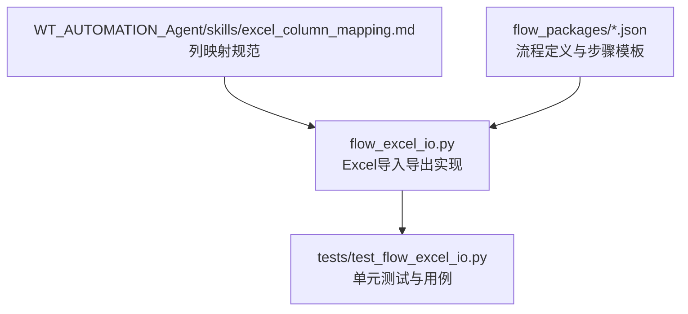
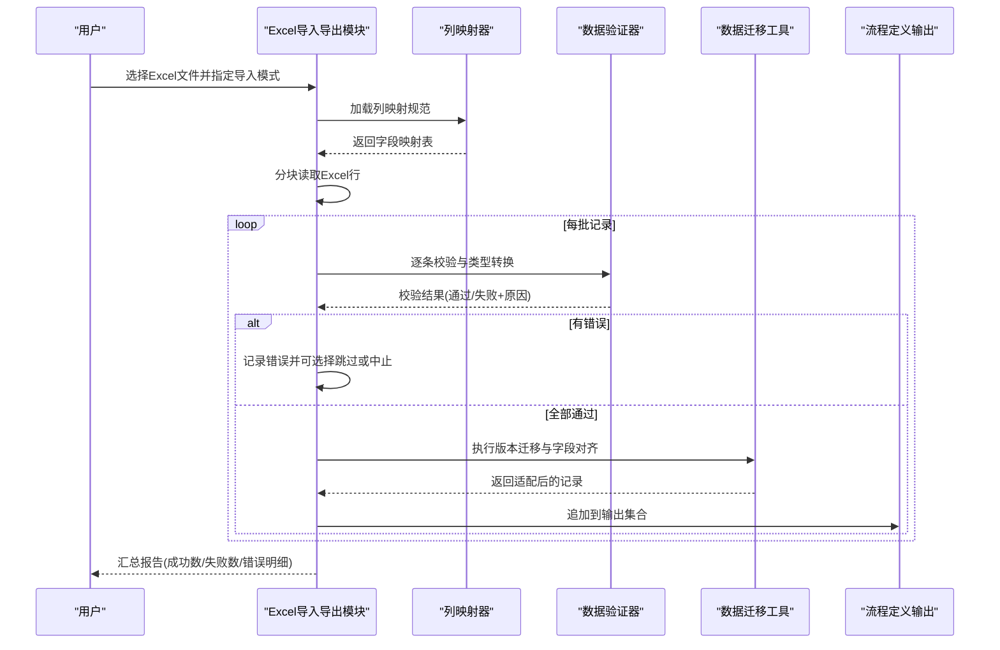
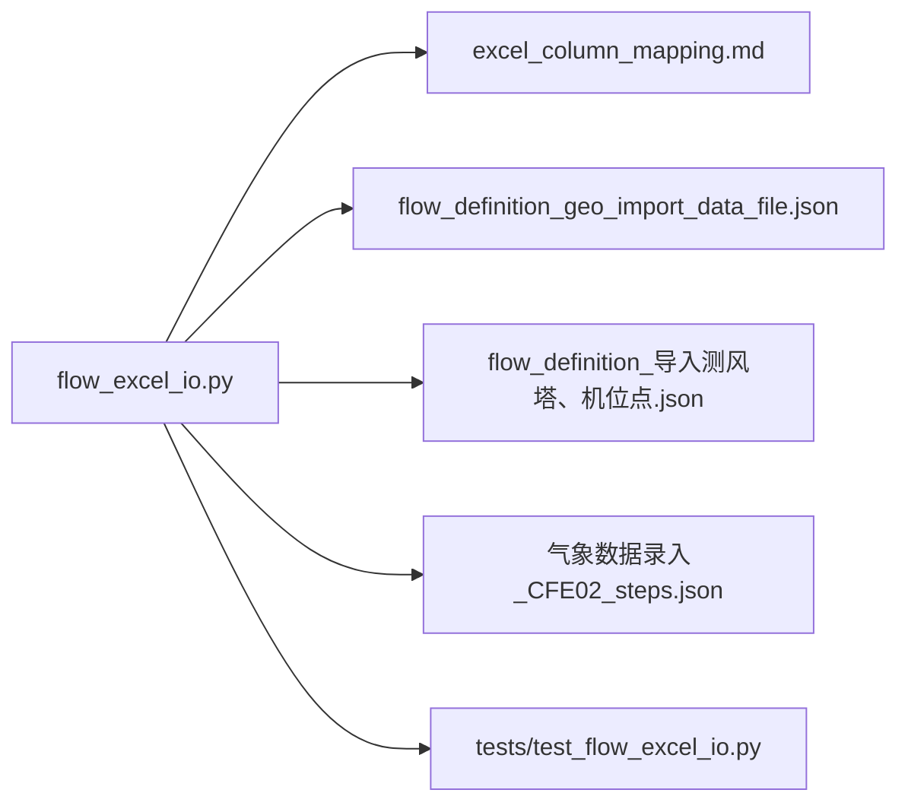

# 数据导入导出

<cite>
**本文引用的文件**   
- [flow_excel_io.py](file://flow_excel_io.py)
- [test_flow_excel_io.py](file://tests/test_flow_excel_io.py)
- [excel_column_mapping.md](file://WT_AUTOMATION_Agent/skills/excel_column_mapping.md)
- [flow_definition_geo_import_data_file.json](file://flow_packages/flow_definition_geo_import_data_file.json)
- [flow_definition_导入测风塔、机位点.json](file://flow_packages/flow_definition_导入测风塔、机位点.json)
- [气象数据录入_CFE02_steps.json](file://flow_packages/气象数据录入_CFE02_steps.json)
</cite>

## 目录
1. [简介](#简介)
2. [项目结构](#项目结构)
3. [核心组件](#核心组件)
4. [架构总览](#架构总览)
5. [详细组件分析](#详细组件分析)
6. [依赖关系分析](#依赖关系分析)
7. [性能考虑](#性能考虑)
8. [故障排查指南](#故障排查指南)
9. [结论](#结论)
10. [附录](#附录)

## 简介
本章节面向流程数据的Excel导入与导出能力，系统性说明文件格式规范、字段映射规则、数据类型与格式转换策略；阐述批量处理机制（含数据验证、错误处理与性能优化）；介绍数据迁移工具在不同版本流程之间的转换方法；解释复杂数据结构（嵌套对象、数组、条件数据）的处理方式；给出数据清洗与预处理最佳实践；并提供大数据量处理的优化技巧与内存管理策略；最后覆盖数据备份与恢复机制。

## 项目结构
围绕Excel导入导出的关键代码与资源分布如下：
- Excel I/O实现与测试位于根目录与tests目录
- 列映射规范与领域知识位于Agent的skills目录
- 相关流程定义与步骤模板位于flow_packages目录

图表来源
- [flow_excel_io.py](file://flow_excel_io.py)
- [test_flow_excel_io.py](file://tests/test_flow_excel_io.py)
- [excel_column_mapping.md](file://WT_AUTOMATION_Agent/skills/excel_column_mapping.md)
- [flow_definition_geo_import_data_file.json](file://flow_packages/flow_definition_geo_import_data_file.json)
- [flow_definition_导入测风塔、机位点.json](file://flow_packages/flow_definition_导入测风塔、机位点.json)
- [气象数据录入_CFE02_steps.json](file://flow_packages/气象数据录入_CFE02_steps.json)

章节来源
- [flow_excel_io.py](file://flow_excel_io.py)
- [test_flow_excel_io.py](file://tests/test_flow_excel_io.py)
- [excel_column_mapping.md](file://WT_AUTOMATION_Agent/skills/excel_column_mapping.md)
- [flow_definition_geo_import_data_file.json](file://flow_packages/flow_definition_geo_import_data_file.json)
- [flow_definition_导入测风塔、机位点.json](file://flow_packages/flow_definition_导入测风塔、机位点.json)
- [气象数据录入_CFE02_steps.json](file://flow_packages/气象数据录入_CFE02_steps.json)

## 核心组件
- Excel读写与类型转换模块：负责读取/写入Excel、解析单元格值、执行类型校验与格式转换、生成结构化记录。
- 列映射与字段对齐：依据列映射规范将Excel列名与内部字段进行映射，支持别名、默认值与可选字段。
- 批量处理流水线：分块读取、逐条验证、汇总错误、容错跳过与回滚策略。
- 数据迁移工具：用于不同版本流程定义之间的字段升级/降级与兼容转换。
- 复杂结构处理器：针对嵌套对象、数组与条件数据进行展开、折叠与条件渲染。
- 数据清洗与预处理：去重、空值填充、单位换算、时间戳标准化等。
- 备份与恢复：对导入结果与中间状态进行快照，支持断点续传与一致性校验。

章节来源
- [flow_excel_io.py](file://flow_excel_io.py)
- [excel_column_mapping.md](file://WT_AUTOMATION_Agent/skills/excel_column_mapping.md)

## 架构总览
整体数据流从Excel源到目标流程定义的转换过程如下：

图表来源
- [flow_excel_io.py](file://flow_excel_io.py)
- [excel_column_mapping.md](file://WT_AUTOMATION_Agent/skills/excel_column_mapping.md)

## 详细组件分析

### Excel导入导出模块
- 功能要点
  - 读取Excel工作簿与工作表，支持多Sheet与命名区域
  - 按批次读取，避免一次性加载全表导致内存峰值过高
  - 提供导出接口，将内部记录序列化为Excel，包含元数据与校验日志
- 关键流程
  - 打开工作簿→选择Sheet→读取表头→建立列映射→循环读取数据行→类型转换→验证→迁移→输出
- 错误处理
  - 捕获类型转换异常、缺失必填字段、枚举值越界等
  - 生成错误明细表，便于定位问题行与列
- 性能优化
  - 使用迭代器/生成器模式逐行处理
  - 关闭不必要的样式与公式计算
  - 合理设置批次大小以平衡吞吐与内存占用

章节来源
- [flow_excel_io.py](file://flow_excel_io.py)

### 列映射与字段对齐
- 映射规则
  - 支持列名别名、前缀/后缀匹配、正则匹配
  - 可配置默认值、是否必填、允许空值
  - 支持同名列冲突消解策略（优先、合并、丢弃）
- 版本兼容
  - 旧版列名到新版的映射表维护在映射规范中
  - 迁移阶段自动补齐缺失字段并做安全默认值填充
- 示例参考
  - 参见“列映射规范”文档中的字段清单与约束说明

章节来源
- [excel_column_mapping.md](file://WT_AUTOMATION_Agent/skills/excel_column_mapping.md)

### 数据验证与类型转换
- 数据类型
  - 文本、数值、布尔、日期时间、枚举、JSON片段
- 转换策略
  - 文本：去除首尾空白、统一编码
  - 数值：支持千分位、货币符号、百分比、科学计数法
  - 布尔：识别常见真/假字符串
  - 日期时间：支持多种格式与本地化时区
  - 枚举：白名单校验，不匹配则报错或映射为默认
  - JSON片段：尝试解析为对象/数组，失败则保留原始字符串并标记
- 验证维度
  - 非空校验、范围校验、唯一性校验、跨字段关联校验
- 错误分类
  - 致命错误（终止导入）、可恢复错误（记录并跳过）、警告（继续但提示）

章节来源
- [flow_excel_io.py](file://flow_excel_io.py)

### 批量处理流水线
- 批处理参数
  - 批次大小、最大并发、重试次数、超时控制
- 处理流程
  - 读取一批→并行验证→汇总错误→选择性提交→下一批
- 回滚与一致性
  - 事务式提交：整批成功才持久化，失败则回滚该批
  - 检查点：记录已处理行数，支持断点续传

章节来源
- [flow_excel_io.py](file://flow_excel_io.py)

### 数据迁移工具
- 适用场景
  - 流程定义版本升级导致的字段增删改
  - 历史数据与新版本的兼容转换
- 迁移策略
  - 字段新增：填充默认值或根据规则推导
  - 字段删除：归档至扩展字段或忽略
  - 字段改名：基于映射表重命名
  - 类型变更：尝试安全转换，失败则记录并告警
- 参考流程
  - 地理数据导入流程定义、测风塔与机位点导入流程定义、气象数据录入步骤模板可作为迁移样例参考

章节来源
- [flow_definition_geo_import_data_file.json](file://flow_packages/flow_definition_geo_import_data_file.json)
- [flow_definition_导入测风塔、机位点.json](file://flow_packages/flow_definition_导入测风塔、机位点.json)
- [气象数据录入_CFE02_steps.json](file://flow_packages/气象数据录入_CFE02_steps.json)

### 复杂数据结构处理
- 嵌套对象
  - 扁平化展开为多级列，导出时再折叠回对象
  - 支持路径表示法（如 a.b.c）进行字段定位
- 数组
  - 一维数组展开为多列或多行两种策略
  - 二维数组采用矩阵布局或序列化JSON片段
- 条件数据
  - 基于条件表达式动态决定字段存在性与取值
  - 条件不满足时跳过或填充占位符

章节来源
- [flow_excel_io.py](file://flow_excel_io.py)

### 数据清洗与预处理最佳实践
- 去重：基于主键或组合键去重，保留最新或最完整记录
- 空值处理：区分空字符串与NULL，按业务规则填充默认值
- 单位换算：统一长度、风速、功率等单位
- 时间标准化：统一时区与格式，处理夏令时与非法时间
- 脏数据隔离：将不可修复的记录移至隔离表，不影响主流程

章节来源
- [flow_excel_io.py](file://flow_excel_io.py)

### 大数据量处理与内存管理
- 流式读取：逐行/分批读取，避免一次性加载全表
- 惰性计算：延迟执行昂贵操作（如外部查询、复杂转换）
- 内存回收：及时释放临时对象，减少引用链
- 磁盘交换：当内存不足时，将中间结果落盘，按需加载
- 监控指标：跟踪内存峰值、GC频率、I/O等待时间

章节来源
- [flow_excel_io.py](file://flow_excel_io.py)

### 数据备份与恢复机制
- 备份策略
  - 导入前对目标数据集创建快照
  - 记录导入会话元数据（时间、来源、批次统计）
- 恢复策略
  - 基于检查点恢复未完成的导入任务
  - 失败回滚：恢复到最近一致状态
- 一致性校验
  - 导入前后进行哈希或计数校验，确保数据完整性

章节来源
- [flow_excel_io.py](file://flow_excel_io.py)

## 依赖关系分析
Excel导入导出模块与列映射规范、流程定义及测试用例之间的关系如下：

图表来源
- [flow_excel_io.py](file://flow_excel_io.py)
- [excel_column_mapping.md](file://WT_AUTOMATION_Agent/skills/excel_column_mapping.md)
- [flow_definition_geo_import_data_file.json](file://flow_packages/flow_definition_geo_import_data_file.json)
- [flow_definition_导入测风塔、机位点.json](file://flow_packages/flow_definition_导入测风塔、机位点.json)
- [气象数据录入_CFE02_steps.json](file://flow_packages/气象数据录入_CFE02_steps.json)
- [test_flow_excel_io.py](file://tests/test_flow_excel_io.py)

章节来源
- [flow_excel_io.py](file://flow_excel_io.py)
- [test_flow_excel_io.py](file://tests/test_flow_excel_io.py)
- [excel_column_mapping.md](file://WT_AUTOMATION_Agent/skills/excel_column_mapping.md)
- [flow_definition_geo_import_data_file.json](file://flow_packages/flow_definition_geo_import_data_file.json)
- [flow_definition_导入测风塔、机位点.json](file://flow_packages/flow_definition_导入测风塔、机位点.json)
- [气象数据录入_CFE02_steps.json](file://flow_packages/气象数据录入_CFE02_steps.json)

## 性能考虑
- 输入侧
  - 预清理Excel：移除隐藏行列、冻结窗格、合并单元格
  - 禁用公式计算与样式渲染以提升读取速度
- 处理侧
  - 调整批次大小，结合CPU核数与内存上限进行调优
  - 对纯CPU密集型转换启用多线程/进程池
  - 对I/O密集环节使用异步或缓冲队列
- 输出侧
  - 批量写入而非逐行写入
  - 压缩导出文件以减少存储与传输开销
- 监控与诊断
  - 记录耗时分布、错误率、内存曲线
  - 对热点函数进行采样分析，定位瓶颈

[本节为通用指导，无需特定文件来源]

## 故障排查指南
- 常见问题
  - 列名不匹配：检查列映射规范与实际表头差异
  - 类型转换失败：核对数值/日期/布尔格式与区域设置
  - 必填字段缺失：确认导入模板与映射规则
  - 重复数据：检查主键策略与去重逻辑
- 定位方法
  - 查看错误明细表中的行号与列名
  - 使用最小复现样本进行回归测试
  - 开启调试日志，关注批次边界与异常堆栈
- 恢复建议
  - 基于检查点恢复上次成功批次
  - 隔离脏数据后重新导入

章节来源
- [test_flow_excel_io.py](file://tests/test_flow_excel_io.py)
- [flow_excel_io.py](file://flow_excel_io.py)

## 结论
通过统一的列映射规范、严格的类型转换与验证、批处理流水线以及完善的迁移与备份恢复机制，系统实现了稳定高效的流程数据Excel导入导出能力。配合数据清洗与预处理最佳实践，以及针对大数据量的优化策略，可在保证数据质量的同时提升吞吐与稳定性。

[本节为总结性内容，无需特定文件来源]

## 附录
- 术语
  - 列映射：将Excel列名与内部字段对应关系的配置
  - 批次：一次批量处理的数据单元
  - 检查点：记录处理进度以便恢复
- 参考流程
  - 地理数据导入流程定义
  - 测风塔与机位点导入流程定义
  - 气象数据录入步骤模板

章节来源
- [flow_definition_geo_import_data_file.json](file://flow_packages/flow_definition_geo_import_data_file.json)
- [flow_definition_导入测风塔、机位点.json](file://flow_packages/flow_definition_导入测风塔、机位点.json)
- [气象数据录入_CFE02_steps.json](file://flow_packages/气象数据录入_CFE02_steps.json)