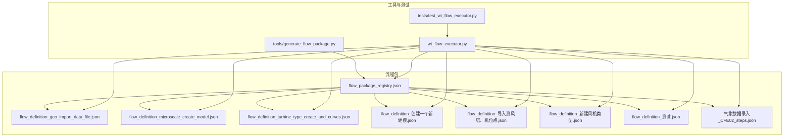
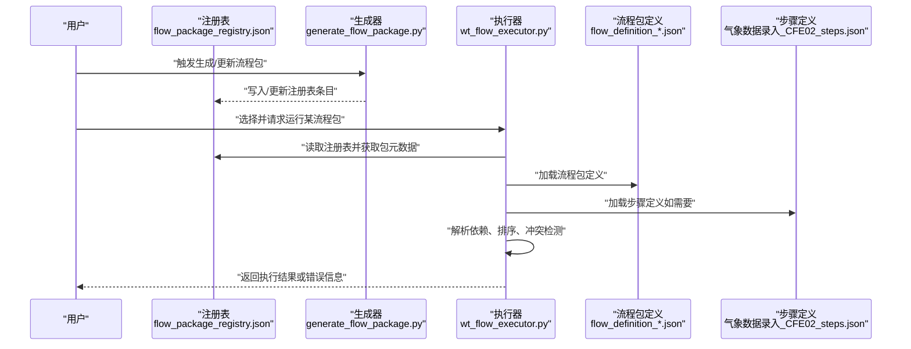
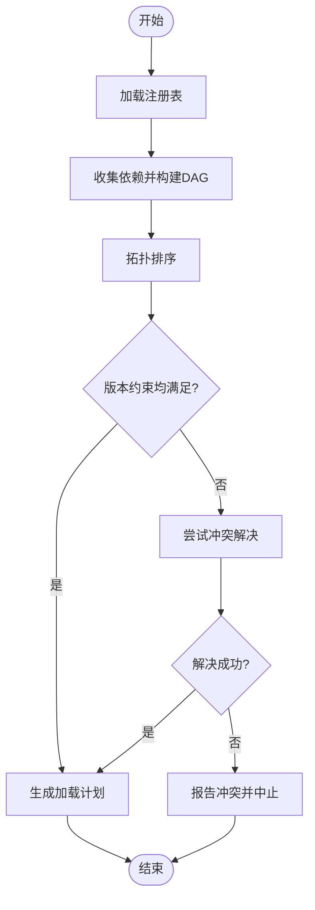
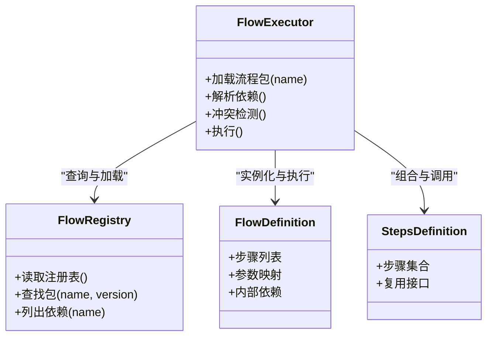

# 依赖管理

<cite>
**本文引用的文件**   
- [flow_package_registry.json](file://flow_packages/flow_package_registry.json)
- [flow_definition_geo_import_data_file.json](file://flow_packages/flow_definition_geo_import_data_file.json)
- [flow_definition_microscale_create_model.json](file://flow_packages/flow_definition_microscale_create_model.json)
- [flow_definition_turbine_type_create_and_curves.json](file://flow_packages/flow_definition_turbine_type_create_and_curves.json)
- [flow_definition_创建一个新建模.json](file://flow_packages/flow_definition_创建一个新建模.json)
- [flow_definition_导入测风塔、机位点.json](file://flow_packages/flow_definition_导入测风塔、机位点.json)
- [flow_definition_新建风机类型.json](file://flow_packages/flow_definition_新建风机类型.json)
- [flow_definition_测试.json](file://flow_packages/flow_definition_测试.json)
- [气象数据录入_CFE02_steps.json](file://flow_packages/气象数据录入_CFE02_steps.json)
- [generate_flow_package.py](file://tools/generate_flow_package.py)
- [test_wt_flow_executor.py](file://tests/test_wt_flow_executor.py)
- [wt_flow_executor.py](file://wt_flow_executor.py)
</cite>

## 目录
1. [简介](#简介)
2. [项目结构](#项目结构)
3. [核心组件](#核心组件)
4. [架构总览](#架构总览)
5. [详细组件分析](#详细组件分析)
6. [依赖关系分析](#依赖关系分析)
7. [性能与缓存](#性能与缓存)
8. [故障排查指南](#故障排查指南)
9. [结论](#结论)
10. [附录](#附录)

## 简介
本文件聚焦于“流程包”的依赖管理机制，围绕以下目标展开：
- 依赖声明语法与版本约束规则
- 依赖解析算法与冲突解决策略
- 依赖缓存与预加载优化机制
- 循环依赖与缺失依赖的处理方式
- 最佳实践与常见问题解决方案
- 依赖可视化与分析工具使用方法
- 依赖更新与升级的安全考虑

说明：当前仓库中未提供独立的依赖管理器源码。本文基于现有流程包定义与注册表的结构进行机制性分析与建议，旨在为后续实现或扩展提供可落地的方案。

## 项目结构
与依赖管理直接相关的目录与文件主要集中在 flow_packages 与 tools 下：
- flow_packages：存放流程包定义 JSON 与一个全局注册表
- tools/generate_flow_package.py：用于生成流程包的辅助脚本（可能涉及元数据与依赖字段）
- tests/test_wt_flow_executor.py：执行器相关测试，可能覆盖依赖加载路径
- wt_flow_executor.py：流程执行入口，负责加载与运行流程包

图表来源
- [flow_package_registry.json](file://flow_packages/flow_package_registry.json)
- [flow_definition_geo_import_data_file.json](file://flow_packages/flow_definition_geo_import_data_file.json)
- [flow_definition_microscale_create_model.json](file://flow_packages/flow_definition_microscale_create_model.json)
- [flow_definition_turbine_type_create_and_curves.json](file://flow_packages/flow_definition_turbine_type_create_and_curves.json)
- [flow_definition_创建一个新建模.json](file://flow_packages/flow_definition_创建一个新建模.json)
- [flow_definition_导入测风塔、机位点.json](file://flow_packages/flow_definition_导入测风塔、机位点.json)
- [flow_definition_新建风机类型.json](file://flow_packages/flow_definition_新建风机类型.json)
- [flow_definition_测试.json](file://flow_packages/flow_definition_测试.json)
- [气象数据录入_CFE02_steps.json](file://flow_packages/气象数据录入_CFE02_steps.json)
- [generate_flow_package.py](file://tools/generate_flow_package.py)
- [test_wt_flow_executor.py](file://tests/test_wt_flow_executor.py)
- [wt_flow_executor.py](file://wt_flow_executor.py)

章节来源
- [flow_package_registry.json](file://flow_packages/flow_package_registry.json)
- [flow_definition_geo_import_data_file.json](file://flow_packages/flow_definition_geo_import_data_file.json)
- [flow_definition_microscale_create_model.json](file://flow_packages/flow_definition_microscale_create_model.json)
- [flow_definition_turbine_type_create_and_curves.json](file://flow_packages/flow_definition_turbine_type_create_and_curves.json)
- [flow_definition_创建一个新建模.json](file://flow_packages/flow_definition_创建一个新建模.json)
- [flow_definition_导入测风塔、机位点.json](file://flow_packages/flow_definition_导入测风塔、机位点.json)
- [flow_definition_新建风机类型.json](file://flow_packages/flow_definition_新建风机类型.json)
- [flow_definition_测试.json](file://flow_packages/flow_definition_测试.json)
- [气象数据录入_CFE02_steps.json](file://flow_packages/气象数据录入_CFE02_steps.json)
- [generate_flow_package.py](file://tools/generate_flow_package.py)
- [test_wt_flow_executor.py](file://tests/test_wt_flow_executor.py)
- [wt_flow_executor.py](file://wt_flow_executor.py)

## 核心组件
- 流程包注册表（flow_package_registry.json）
  - 作用：集中描述可用流程包清单及其元信息，通常包含包名、版本、入口定义、依赖项等
  - 关键能力：作为依赖解析的权威索引；支持按名称与版本筛选；便于构建依赖图
- 流程包定义（flow_definition_*.json）
  - 作用：具体流程步骤、参数、以及可能的内部依赖引用
  - 关键能力：声明对其它流程包或外部资源的依赖；承载运行时所需的数据与行为
- 步骤定义（气象数据录入_CFE02_steps.json）
  - 作用：细粒度步骤集合，供流程组合复用
  - 关键能力：可作为子依赖被上层流程引用
- 生成器（tools/generate_flow_package.py）
  - 作用：自动化生成流程包定义与注册表条目，保证一致性
  - 关键能力：在生成阶段校验依赖字段完整性与格式
- 执行器（wt_flow_executor.py）与测试（tests/test_wt_flow_executor.py）
  - 作用：加载注册表与流程包，解析依赖并执行
  - 关键能力：依赖发现、排序、冲突检测、错误上报

章节来源
- [flow_package_registry.json](file://flow_packages/flow_package_registry.json)
- [flow_definition_geo_import_data_file.json](file://flow_packages/flow_definition_geo_import_data_file.json)
- [flow_definition_microscale_create_model.json](file://flow_packages/flow_definition_microscale_create_model.json)
- [flow_definition_turbine_type_create_and_curves.json](file://flow_packages/flow_definition_turbine_type_create_and_curves.json)
- [flow_definition_创建一个新建模.json](file://flow_packages/flow_definition_创建一个新建模.json)
- [flow_definition_导入测风塔、机位点.json](file://flow_packages/flow_definition_导入测风塔、机位点.json)
- [flow_definition_新建风机类型.json](file://flow_packages/flow_definition_新建风机类型.json)
- [flow_definition_测试.json](file://flow_packages/flow_definition_测试.json)
- [气象数据录入_CFE02_steps.json](file://flow_packages/气象数据录入_CFE02_steps.json)
- [generate_flow_package.py](file://tools/generate_flow_package.py)
- [test_wt_flow_executor.py](file://tests/test_wt_flow_executor.py)
- [wt_flow_executor.py](file://wt_flow_executor.py)

## 架构总览
下图展示了从“用户选择流程包”到“执行器加载并运行”的整体依赖处理链路。该链路强调注册表作为唯一真相源，执行器负责解析、排序与执行。

图表来源
- [flow_package_registry.json](file://flow_packages/flow_package_registry.json)
- [generate_flow_package.py](file://tools/generate_flow_package.py)
- [wt_flow_executor.py](file://wt_flow_executor.py)
- [flow_definition_geo_import_data_file.json](file://flow_packages/flow_definition_geo_import_data_file.json)
- [气象数据录入_CFE02_steps.json](file://flow_packages/气象数据录入_CFE02_steps.json)

## 详细组件分析

### 依赖声明语法与版本约束规则
- 推荐字段设计
  - 包标识：name（字符串）、version（语义化版本）
  - 依赖列表：dependencies（数组），每项包含 target（包名）、constraint（版本约束）
  - 可选：optional（布尔）、scope（运行期/开发期）、source（本地路径或远程地址）
- 版本约束规则
  - 支持精确匹配：=1.2.3
  - 范围匹配：>=1.2.0,<2.0.0；^1.2.3（兼容主版本）；~1.2.3（兼容次版本）
  - 通配符：1.*（仅主版本）
  - 多约束组合：使用逻辑与/或表达复杂条件
- 最佳实践
  - 优先使用最小必要版本范围，避免过宽导致不可复现
  - 明确标注 optional 依赖，降低耦合度
  - 对关键依赖锁定主版本，防止破坏性变更

章节来源
- [flow_package_registry.json](file://flow_packages/flow_package_registry.json)
- [flow_definition_geo_import_data_file.json](file://flow_packages/flow_definition_geo_import_data_file.json)
- [flow_definition_microscale_create_model.json](file://flow_packages/flow_definition_microscale_create_model.json)
- [flow_definition_turbine_type_create_and_curves.json](file://flow_packages/flow_definition_turbine_type_create_and_curves.json)
- [flow_definition_创建一个新建模.json](file://flow_packages/flow_definition_创建一个新建模.json)
- [flow_definition_导入测风塔、机位点.json](file://flow_packages/flow_definition_导入测风塔、机位点.json)
- [flow_definition_新建风机类型.json](file://flow_packages/flow_definition_新建风机类型.json)
- [flow_definition_测试.json](file://flow_packages/flow_definition_测试.json)
- [气象数据录入_CFE02_steps.json](file://flow_packages/气象数据录入_CFE02_steps.json)

### 依赖解析算法与冲突解决策略
- 解析流程
  - 从注册表读取目标包元数据
  - 递归收集所有依赖，构建有向无环图（DAG）
  - 拓扑排序得到加载顺序
  - 校验版本约束是否满足
- 冲突解决策略
  - 若同一包存在多个版本需求，优先选择满足所有约束的最高版本
  - 若无法同时满足，回退策略包括：放宽约束、标记可选依赖、提示用户干预
  - 记录冲突详情（涉及的包、版本区间、冲突位置）
- 复杂度与健壮性
  - DAG 构建与拓扑排序时间复杂度近似 O(V+E)
  - 增加缓存层减少重复解析开销

图表来源
- [flow_package_registry.json](file://flow_packages/flow_package_registry.json)
- [wt_flow_executor.py](file://wt_flow_executor.py)

章节来源
- [flow_package_registry.json](file://flow_packages/flow_package_registry.json)
- [wt_flow_executor.py](file://wt_flow_executor.py)

### 依赖缓存与预加载优化机制
- 缓存策略
  - 以包名+版本为键，缓存已解析的依赖树与加载状态
  - 引入失效策略：当注册表或包定义变更时，清除对应缓存
- 预加载优化
  - 启动时扫描注册表，预解析常用包的依赖图
  - 按需懒加载非关键依赖，缩短冷启动时间
- 持久化与一致性
  - 将缓存落盘，加速二次启动
  - 通过哈希校验确保缓存与源一致

章节来源
- [flow_package_registry.json](file://flow_packages/flow_package_registry.json)
- [wt_flow_executor.py](file://wt_flow_executor.py)

### 循环依赖与缺失依赖的处理
- 循环依赖
  - 检测：在构建DAG时进行环检测（DFS回溯或Tarjan算法）
  - 处理：拒绝加载并给出清晰错误信息；必要时引入“延迟绑定”或“接口抽象”打破环
- 缺失依赖
  - 检测：解析阶段检查每个依赖是否存在且版本满足
  - 处理：提供修复建议（安装/更新/替换）；对可选依赖跳过并记录警告

章节来源
- [flow_package_registry.json](file://flow_packages/flow_package_registry.json)
- [wt_flow_executor.py](file://wt_flow_executor.py)

### 依赖更新与升级的安全考虑
- 安全基线
  - 锁定关键依赖的主版本，避免破坏性变更
  - 引入签名校验与来源白名单，防止篡改
- 升级流程
  - 灰度发布：先在小范围验证新版本
  - 回滚策略：保留旧版本快照，快速恢复
- 审计与追踪
  - 记录每次变更的提交信息与影响范围
  - 自动生成依赖变更报告，便于审查

章节来源
- [flow_package_registry.json](file://flow_packages/flow_package_registry.json)
- [generate_flow_package.py](file://tools/generate_flow_package.py)

### 依赖关系可视化和分析工具的使用方法
- 可视化目标
  - 展示包之间的依赖边、版本区间、冲突点
  - 高亮关键路径与瓶颈节点
- 分析方法
  - 从注册表导出依赖图（JSON/GraphML）
  - 使用图可视化工具渲染，过滤可选依赖
  - 结合静态分析定位潜在风险（如过宽版本范围）
- 输出物
  - 依赖关系图、冲突报告、版本分布统计

章节来源
- [flow_package_registry.json](file://flow_packages/flow_package_registry.json)
- [flow_definition_geo_import_data_file.json](file://flow_packages/flow_definition_geo_import_data_file.json)
- [flow_definition_microscale_create_model.json](file://flow_packages/flow_definition_microscale_create_model.json)
- [flow_definition_turbine_type_create_and_curves.json](file://flow_packages/flow_definition_turbine_type_create_and_curves.json)
- [flow_definition_创建一个新建模.json](file://flow_packages/flow_definition_创建一个新建模.json)
- [flow_definition_导入测风塔、机位点.json](file://flow_packages/flow_definition_导入测风塔、机位点.json)
- [flow_definition_新建风机类型.json](file://flow_packages/flow_definition_新建风机类型.json)
- [flow_definition_测试.json](file://flow_packages/flow_definition_测试.json)
- [气象数据录入_CFE02_steps.json](file://flow_packages/气象数据录入_CFE02_steps.json)

## 依赖关系分析
本节提供面向代码级的依赖关系视图，展示执行器如何与注册表和流程包交互。

图表来源
- [flow_package_registry.json](file://flow_packages/flow_package_registry.json)
- [wt_flow_executor.py](file://wt_flow_executor.py)
- [flow_definition_geo_import_data_file.json](file://flow_packages/flow_definition_geo_import_data_file.json)
- [气象数据录入_CFE02_steps.json](file://flow_packages/气象数据录入_CFE02_steps.json)

章节来源
- [flow_package_registry.json](file://flow_packages/flow_package_registry.json)
- [wt_flow_executor.py](file://wt_flow_executor.py)
- [flow_definition_geo_import_data_file.json](file://flow_packages/flow_definition_geo_import_data_file.json)
- [气象数据录入_CFE02_steps.json](file://flow_packages/气象数据录入_CFE02_steps.json)

## 性能与缓存
- 启动优化
  - 预解析常用包依赖，减少首次运行延迟
  - 并行加载独立分支的依赖图
- 运行时优化
  - 缓存已解析的依赖树与加载结果
  - 惰性加载非关键依赖，按需初始化
- 监控指标
  - 解析耗时、缓存命中率、冲突次数、失败重试率

章节来源
- [flow_package_registry.json](file://flow_packages/flow_package_registry.json)
- [wt_flow_executor.py](file://wt_flow_executor.py)

## 故障排查指南
- 常见错误
  - 依赖缺失：确认注册表中存在对应包与版本
  - 版本冲突：检查约束是否过紧或存在不兼容范围
  - 循环依赖：识别环并重构依赖边界
- 诊断步骤
  - 启用详细日志，记录解析过程与决策点
  - 导出依赖图，定位问题节点
  - 逐步缩小范围，隔离问题包
- 修复建议
  - 调整版本约束至合理范围
  - 拆分强耦合模块，引入接口抽象
  - 引入可选依赖与降级策略

章节来源
- [flow_package_registry.json](file://flow_packages/flow_package_registry.json)
- [wt_flow_executor.py](file://wt_flow_executor.py)

## 结论
通过对流程包注册表与执行器的结构分析，本文提出了完整的依赖管理机制建议，涵盖声明语法、解析算法、冲突解决、缓存优化、循环与缺失依赖处理、安全升级与可视化分析。建议在后续迭代中落地上述方案，以提升系统的稳定性与可维护性。

## 附录
- 术语
  - 流程包：一组可复用的流程步骤与配置的打包单元
  - 注册表：集中管理流程包元数据的索引文件
  - 依赖图：以包为节点、依赖关系为边的有向图
- 参考文件
  - 注册表与流程包定义位于 flow_packages 目录
  - 生成器与执行器分别位于 tools 与根目录