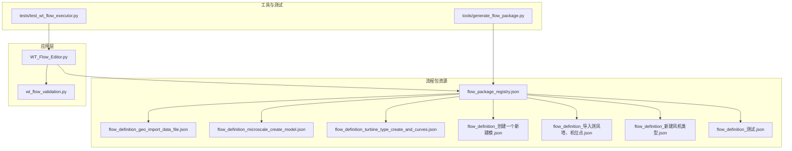
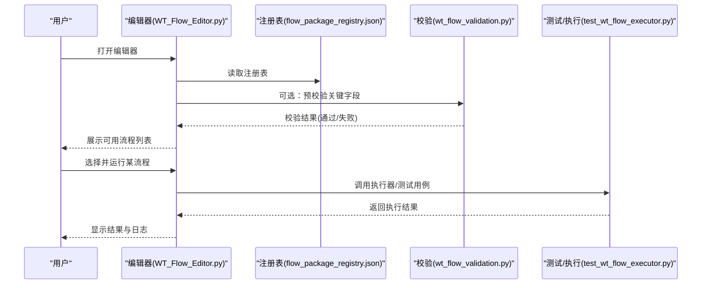
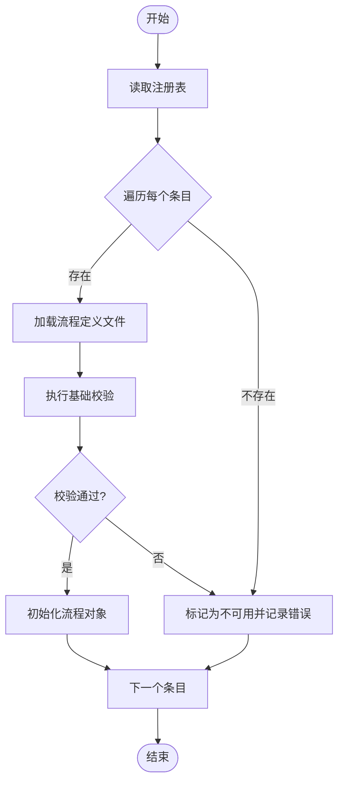
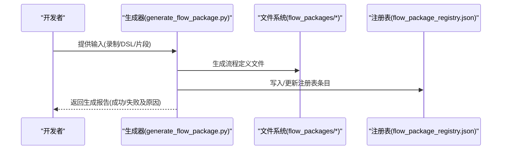
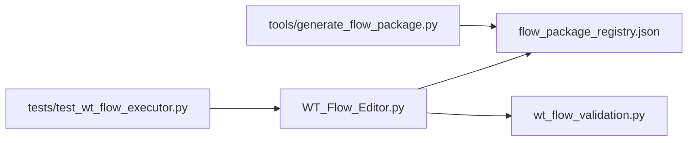

# 流程包注册系统

<cite>
**本文引用的文件**   
- [flow_package_registry.json](file://flow_packages/flow_package_registry.json)
- [generate_flow_package.py](file://tools/generate_flow_package.py)
- [test_wt_flow_executor.py](file://tests/test_wt_flow_executor.py)
- [WT_Flow_Editor.py](file://WT_Flow_Editor.py)
- [wt_flow_validation.py](file://wt_flow_validation.py)
- [flow_definition_geo_import_data_file.json](file://flow_packages/flow_definition_geo_import_data_file.json)
- [flow_definition_microscale_create_model.json](file://flow_packages/flow_definition_microscale_create_model.json)
- [flow_definition_turbine_type_create_and_curves.json](file://flow_packages/flow_definition_turbine_type_create_and_curves.json)
- [flow_definition_创建一个新建模.json](file://flow_packages/flow_definition_创建一个新建模.json)
- [flow_definition_导入测风塔、机位点.json](file://flow_packages/flow_definition_导入测风塔、机位点.json)
- [flow_definition_新建风机类型.json](file://flow_packages/flow_definition_新建风机类型.json)
- [flow_definition_测试.json](file://flow_packages/flow_definition_测试.json)
</cite>

## 目录
1. [简介](#简介)
2. [项目结构](#项目结构)
3. [核心组件](#核心组件)
4. [架构总览](#架构总览)
5. [详细组件分析](#详细组件分析)
6. [依赖关系分析](#依赖关系分析)
7. [性能考虑](#性能考虑)
8. [故障排查指南](#故障排查指南)
9. [结论](#结论)
10. [附录](#附录)

## 简介
本文件面向“流程包注册系统”的实现原理与使用方法，围绕以下目标展开：
- 解释 flow_package_registry.json 注册表的结构与维护方式
- 阐述流程包的发现、加载与初始化机制
- 说明如何开发自定义的流程包生成器与工具
- 介绍流程包的搜索、过滤与分类能力
- 提供注册表的 API 接口与使用示例（以路径引用形式）
- 覆盖冲突检测与解决策略
- 介绍生命周期管理与状态监控要点

## 项目结构
与流程包注册系统直接相关的目录与文件包括：
- flow_packages：存放流程定义 JSON 与注册表
- tools/generate_flow_package.py：流程包生成工具
- tests/test_wt_flow_executor.py：执行器相关测试（用于理解加载与运行行为）
- WT_Flow_Editor.py：编辑器入口（可能涉及注册表读取与流程选择）
- wt_flow_validation.py：流程校验逻辑（影响注册与可用性判定）

图表来源
- [flow_package_registry.json](file://flow_packages/flow_package_registry.json)
- [generate_flow_package.py](file://tools/generate_flow_package.py)
- [test_wt_flow_executor.py](file://tests/test_wt_flow_executor.py)
- [WT_Flow_Editor.py](file://WT_Flow_Editor.py)
- [wt_flow_validation.py](file://wt_flow_validation.py)

章节来源
- [flow_package_registry.json](file://flow_packages/flow_package_registry.json)
- [generate_flow_package.py](file://tools/generate_flow_package.py)
- [test_wt_flow_executor.py](file://tests/test_wt_flow_executor.py)
- [WT_Flow_Editor.py](file://WT_Flow_Editor.py)
- [wt_flow_validation.py](file://wt_flow_validation.py)

## 核心组件
- 注册表文件：集中描述可用流程包及其元数据，供编辑器与工具发现与筛选
- 流程定义文件：每个流程的独立 JSON 定义，包含步骤、参数、约束等
- 生成器工具：将录制或手工定义的流程转换为标准流程包并写入注册表
- 编辑器集成：启动时扫描注册表，构建可选择的流程清单
- 校验模块：在注册前对流程定义进行一致性检查，避免无效包进入注册表

章节来源
- [flow_package_registry.json](file://flow_packages/flow_package_registry.json)
- [generate_flow_package.py](file://tools/generate_flow_package.py)
- [WT_Flow_Editor.py](file://WT_Flow_Editor.py)
- [wt_flow_validation.py](file://wt_flow_validation.py)

## 架构总览
下图展示了从注册表到编辑器再到具体流程执行的端到端交互。

图表来源
- [WT_Flow_Editor.py](file://WT_Flow_Editor.py)
- [flow_package_registry.json](file://flow_packages/flow_package_registry.json)
- [wt_flow_validation.py](file://wt_flow_validation.py)
- [test_wt_flow_executor.py](file://tests/test_wt_flow_executor.py)

## 详细组件分析

### 注册表结构与维护
- 作用：集中声明所有可用的流程包，便于统一发现、排序、过滤与版本管理
- 典型字段建议（基于常见实践与仓库上下文推断）：
  - id：流程唯一标识
  - name：显示名称
  - description：简要说明
  - version：版本号
  - tags：标签集合，用于搜索与分类
  - category：分类（如“地理数据导入”、“模型创建”、“风机类型”等）
  - entry_point：指向具体流程定义文件的相对路径
  - status：状态（启用/禁用/废弃）
  - dependencies：依赖项（其他流程包或外部资源）
  - metadata：扩展信息（作者、更新时间、许可证等）
- 维护建议：
  - 新增流程包后，先由生成器输出最小可用条目，再人工补充元数据
  - 变更流程定义后，同步更新 version 与 metadata
  - 使用 tags 与 category 提升检索效率
  - 保持 entry_point 与真实文件一致，避免运行时找不到定义

章节来源
- [flow_package_registry.json](file://flow_packages/flow_package_registry.json)

### 流程包的发现、加载与初始化
- 发现：编辑器启动时遍历注册表，收集所有启用的流程条目
- 加载：根据 entry_point 定位流程定义文件，解析为内部对象
- 初始化：执行必要的前置检查（如依赖是否存在、必填字段是否完整），必要时触发校验模块
- 错误处理：若加载失败，记录原因并在 UI 中提示，同时将该流程标记为不可用

图表来源
- [WT_Flow_Editor.py](file://WT_Flow_Editor.py)
- [flow_package_registry.json](file://flow_packages/flow_package_registry.json)
- [wt_flow_validation.py](file://wt_flow_validation.py)

章节来源
- [WT_Flow_Editor.py](file://WT_Flow_Editor.py)
- [wt_flow_validation.py](file://wt_flow_validation.py)

### 自定义流程包生成器与工具
- 目标：将录制脚本或手工编排的流程自动转换为标准流程包，并更新注册表
- 输入：原始流程片段、模板、元数据
- 输出：标准化的流程定义 JSON 与注册表条目
- 关键步骤：
  - 解析输入源（录制回放、DSL、JSON 片段）
  - 映射为标准流程模型（步骤、参数、条件分支等）
  - 生成流程定义文件至 flow_packages
  - 向注册表追加或更新对应条目
  - 可选：执行一次轻量级自检，确保基本字段完整

图表来源
- [generate_flow_package.py](file://tools/generate_flow_package.py)
- [flow_package_registry.json](file://flow_packages/flow_package_registry.json)

章节来源
- [generate_flow_package.py](file://tools/generate_flow_package.py)

### 搜索、过滤与分类
- 搜索：支持按名称、ID、描述关键字匹配
- 过滤：按 tags、category、status、version 范围等维度筛选
- 分类：基于 category 与 tags 组织树形或标签云视图
- 实现建议：
  - 在内存中缓存已解析的注册表，避免重复 IO
  - 对常用过滤条件建立索引（如 category→ids、tags→ids）
  - 支持组合查询与分页展示

章节来源
- [flow_package_registry.json](file://flow_packages/flow_package_registry.json)

### 注册表 API 接口与使用示例
以下为面向编辑器的常用操作（以路径引用形式给出，便于在代码中定位实现）：
- 读取注册表
  - 参考路径：[WT_Flow_Editor.py](file://WT_Flow_Editor.py)
- 按条件查询流程
  - 参考路径：[WT_Flow_Editor.py](file://WT_Flow_Editor.py)
- 新增/更新流程条目
  - 参考路径：[generate_flow_package.py](file://tools/generate_flow_package.py)
- 删除/禁用流程条目
  - 参考路径：[generate_flow_package.py](file://tools/generate_flow_package.py)
- 校验流程定义
  - 参考路径：[wt_flow_validation.py](file://wt_flow_validation.py)

章节来源
- [WT_Flow_Editor.py](file://WT_Flow_Editor.py)
- [generate_flow_package.py](file://tools/generate_flow_package.py)
- [wt_flow_validation.py](file://wt_flow_validation.py)

### 冲突检测与解决策略
- 冲突类型：
  - ID 冲突：多个条目拥有相同 id
  - 路径冲突：entry_point 指向同一文件
  - 版本冲突：同 id 不同版本共存时的优先级问题
- 检测时机：
  - 注册表写入前（生成器阶段）
  - 编辑器启动时（加载阶段）
- 解决策略：
  - 强制唯一性：拒绝写入，提示冲突详情
  - 版本择优：保留最高版本，其余标记为废弃
  - 软冲突：允许共存但降低优先级，并在 UI 中明确提示

章节来源
- [flow_package_registry.json](file://flow_packages/flow_package_registry.json)
- [generate_flow_package.py](file://tools/generate_flow_package.py)

### 生命周期管理与状态监控
- 生命周期阶段：
  - 草稿：仅存在于本地，未加入注册表
  - 已注册：出现在注册表中，可被编辑器发现
  - 启用：可被选择与运行
  - 禁用：可见但不可选
  - 废弃：历史保留，默认隐藏
- 状态转换规则：
  - 草稿 → 已注册：生成器写入注册表并通过校验
  - 已注册 → 启用：手动或自动化流程切换状态
  - 启用 → 禁用：维护期或兼容性问题
  - 任意 → 废弃：不再维护，保留历史记录
- 监控指标：
  - 注册表大小与条目数
  - 各状态分布
  - 最近更新时间
  - 校验失败率

章节来源
- [flow_package_registry.json](file://flow_packages/flow_package_registry.json)

## 依赖关系分析
- 编辑器依赖注册表与校验模块
- 生成器依赖注册表与文件系统
- 测试/执行器依赖编辑器暴露的接口或流程定义

图表来源
- [WT_Flow_Editor.py](file://WT_Flow_Editor.py)
- [flow_package_registry.json](file://flow_packages/flow_package_registry.json)
- [wt_flow_validation.py](file://wt_flow_validation.py)
- [generate_flow_package.py](file://tools/generate_flow_package.py)
- [test_wt_flow_executor.py](file://tests/test_wt_flow_executor.py)

章节来源
- [WT_Flow_Editor.py](file://WT_Flow_Editor.py)
- [flow_package_registry.json](file://flow_packages/flow_package_registry.json)
- [wt_flow_validation.py](file://wt_flow_validation.py)
- [generate_flow_package.py](file://tools/generate_flow_package.py)
- [test_wt_flow_executor.py](file://tests/test_wt_flow_executor.py)

## 性能考虑
- 注册表缓存：启动时一次性加载并构建索引，后续查询走内存
- 增量更新：生成器只写变更条目，减少全量重写
- 懒加载：仅在选中流程时加载其定义文件，降低初始开销
- 并发安全：多进程/多线程访问注册表时使用锁或只读副本

## 故障排查指南
- 常见问题
  - 注册表格式错误：检查 JSON 语法与必填字段
  - 流程定义缺失：确认 entry_point 路径正确且文件存在
  - 校验失败：查看校验模块返回的错误信息，修正步骤或参数
  - 冲突报错：根据冲突类型调整 id 或版本策略
- 定位方法
  - 在编辑器中查看加载日志
  - 使用生成器输出的报告定位写入失败原因
  - 针对特定流程定义，单独运行校验流程

章节来源
- [wt_flow_validation.py](file://wt_flow_validation.py)
- [generate_flow_package.py](file://tools/generate_flow_package.py)

## 结论
流程包注册系统通过统一的注册表与标准化流程定义，实现了流程的发现、加载、校验与运行闭环。配合生成器与编辑器集成，能够高效地管理流程的生命周期，并提供灵活的搜索、过滤与分类能力。建议在团队内规范注册表字段与命名约定，完善冲突检测与版本策略，以提升系统的稳定性与可维护性。

## 附录
- 示例流程定义文件（用于理解结构）：
  - [flow_definition_geo_import_data_file.json](file://flow_packages/flow_definition_geo_import_data_file.json)
  - [flow_definition_microscale_create_model.json](file://flow_packages/flow_definition_microscale_create_model.json)
  - [flow_definition_turbine_type_create_and_curves.json](file://flow_packages/flow_definition_turbine_type_create_and_curves.json)
  - [flow_definition_创建一个新建模.json](file://flow_packages/flow_definition_创建一个新建模.json)
  - [flow_definition_导入测风塔、机位点.json](file://flow_packages/flow_definition_导入测风塔、机位点.json)
  - [flow_definition_新建风机类型.json](file://flow_packages/flow_definition_新建风机类型.json)
  - [flow_definition_测试.json](file://flow_packages/flow_definition_测试.json)