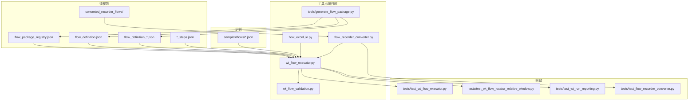
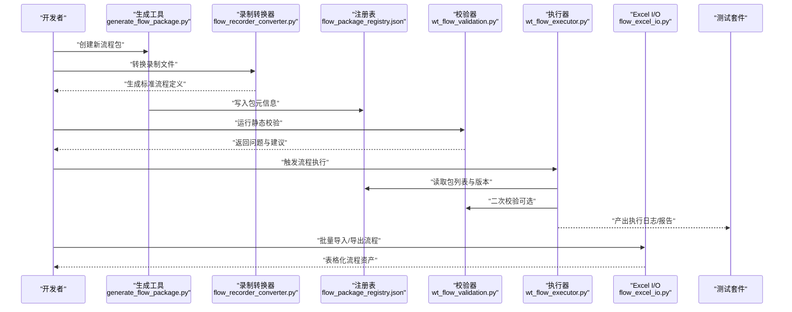
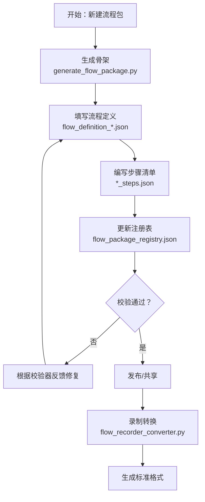
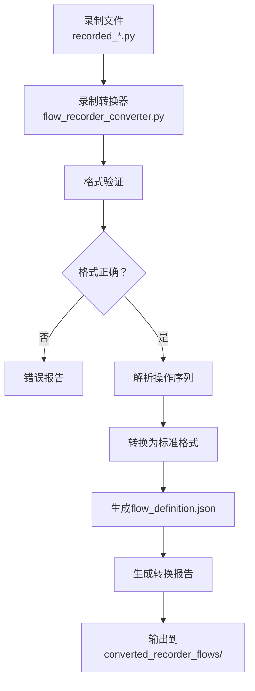
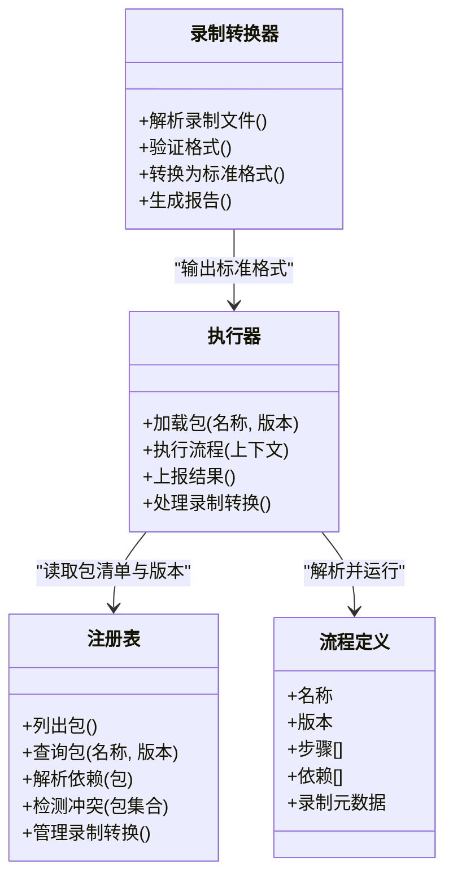
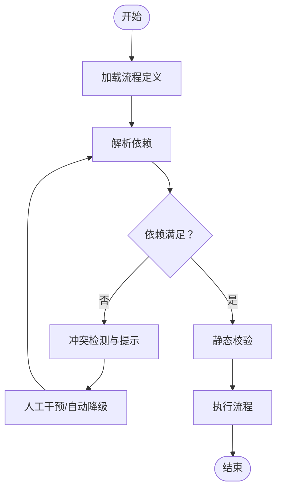
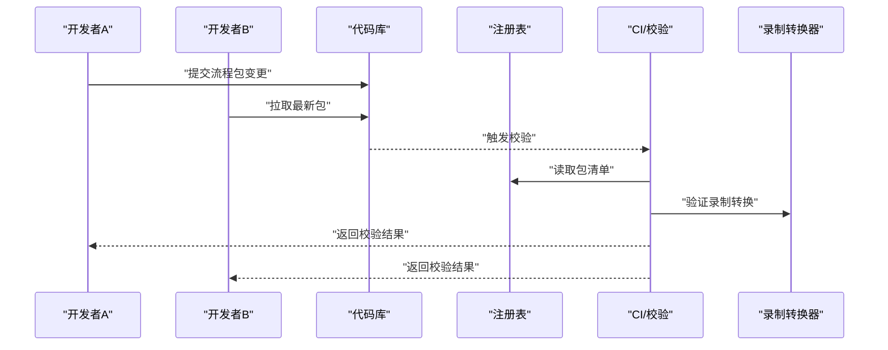
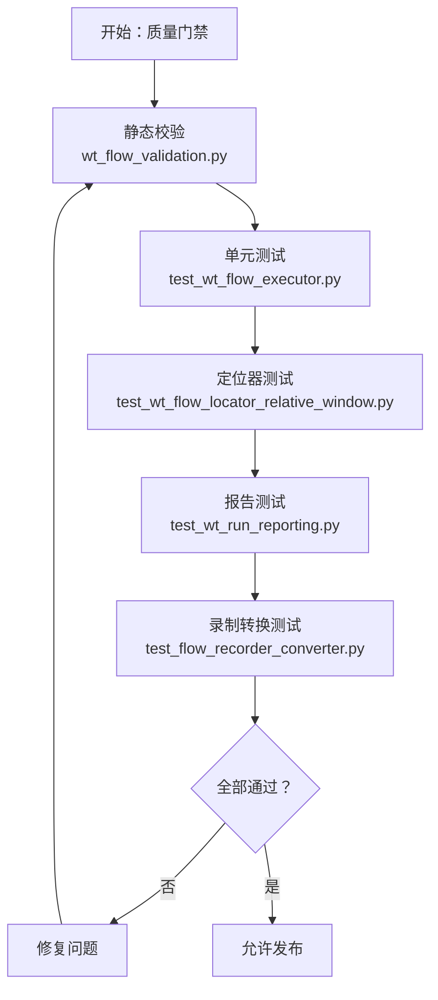
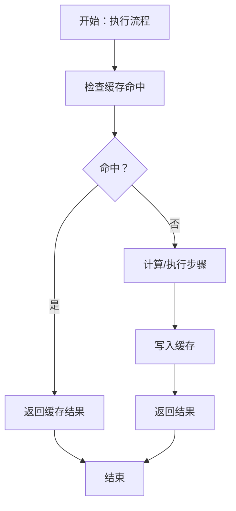
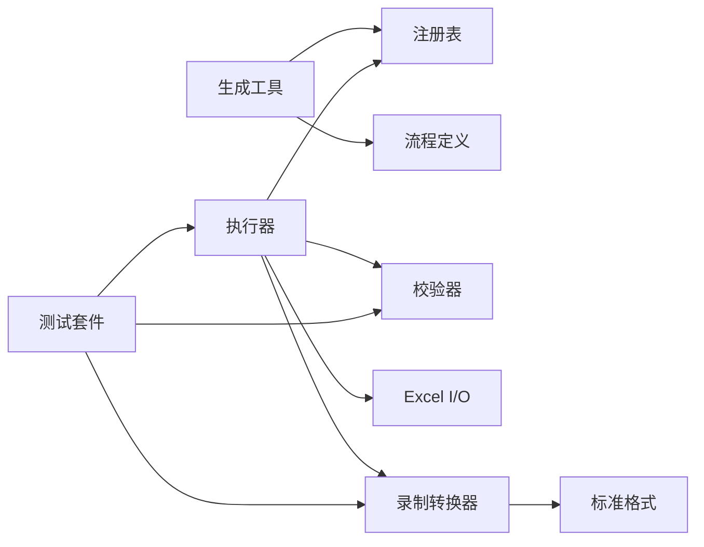

# 流程包管理

<cite>
**本文引用的文件**   
- [PROJECT_ARCHITECTURE.md](file://PROJECT_ARCHITECTURE.md)
- [README.md](file://README.md)
- [flow_packages/flow_package_registry.json](file://flow_packages/flow_package_registry.json)
- [flow_packages/flow_definition.json](file://flow_packages/flow_definition.json)
- [flow_packages/flow_definition_导入地形图.json](file://flow_packages/flow_definition_导入地形图.json)
- [flow_packages/flow_definition_geo_import_data_file.json](file://flow_packages/flow_definition_geo_import_data_file.json)
- [flow_packages/flow_definition_microscale_create_model.json](file://flow_packages/flow_definition_microscale_create_model.json)
- [flow_packages/flow_definition_turbine_type_create_and_curves.json](file://flow_packages/flow_definition_turbine_type_create_and_curves.json)
- [flow_packages/flow_definition_创建一个新建模.json](file://flow_packages/flow_definition_创建一个新建模.json)
- [flow_packages/flow_definition_导入测风塔、机位点.json](file://flow_packages/flow_definition_导入测风塔、机位点.json)
- [flow_packages/flow_definition_新建风机类型.json](file://flow_packages/flow_definition_新建风机类型.json)
- [flow_packages/flow_definition_测试.json](file://flow_packages/flow_definition_测试.json)
- [flow_packages/flow_definition_测试下拉框选择.json](file://flow_packages/flow_definition_测试下拉框选择.json)
- [flow_packages/气象数据录入_CFE02_steps.json](file://flow_packages/气象数据录入_CFE02_steps.json)
- [flow_recorder_converter.py](file://flow_recorder_converter.py)
- [tests/test_flow_recorder_converter.py](file://tests/test_flow_recorder_converter.py)
- [samples/flows/flow_definition_gm_sample.json](file://samples/flows/flow_definition_gm_sample.json)
- [samples/flows/flow_definition_新建风机类型.json](file://samples/flows/flow_definition_新建风机类型.json)
- [samples/flows/气象数据录入_20260625_converted_flow.json](file://samples/flows/气象数据录入_20260625_converted_flow.json)
- [tools/generate_flow_package.py](file://tools/generate_flow_package.py)
- [wt_flow_executor.py](file://wt_flow_executor.py)
- [wt_flow_validation.py](file://wt_flow_validation.py)
- [flow_excel_io.py](file://flow_excel_io.py)
- [tests/test_wt_flow_executor.py](file://tests/test_wt_flow_executor.py)
- [tests/test_wt_flow_locator_relative_window.py](file://tests/test_wt_flow_locator_relative_window.py)
- [tests/test_wt_run_reporting.py](file://tests/test_wt_run_reporting.py)
</cite>

## 更新摘要
**所做更改**
- 新增流程定义文件结构说明，包括flow_definition.json和多个业务场景的流程定义
- 新增recorded_flows转换功能和相关测试用例的文档说明
- 更新流程包注册表结构和版本管理机制
- 扩展流程包生成工具和Excel导入导出功能
- 增强依赖管理和冲突解决机制

## 目录
1. [简介](#简介)
2. [项目结构](#项目结构)
3. [核心组件](#核心组件)
4. [架构总览](#架构总览)
5. [详细组件分析](#详细组件分析)
6. [依赖分析](#依赖分析)
7. [性能考虑](#性能考虑)
8. [故障排查指南](#故障排查指南)
9. [结论](#结论)
10. [附录](#附录)

## 简介
本文件面向"流程包"的创建、组织、注册、复用与协作开发，提供从规范到实践的系统化说明。内容覆盖：
- 流程包结构与命名约定（包定义文件、步骤脚本、资源文件）
- 包的注册与管理机制（注册表、版本策略）
- 依赖管理与冲突解决
- 导入导出与团队协作模式
- 质量检查与测试方法
- 性能优化与缓存策略
- 完整开发指南与示例项目路径指引
- **新增** recorded_flows转换功能和录制结果处理

## 项目结构
仓库中与流程包相关的核心目录与文件如下：
- flow_packages：存放已发布的流程包定义与步骤清单，包含多种业务场景的流程定义
- samples/flows：示例流程包与转换产物
- tools/generate_flow_package.py：流程包生成工具
- wt_flow_executor.py：流程执行器
- wt_flow_validation.py：流程校验器
- flow_excel_io.py：Excel 导入导出能力
- flow_recorder_converter.py：录制转换器，支持recorded_flows格式转换
- tests/*：针对执行器、定位器、报告等的测试用例

**图表来源**
- [flow_packages/flow_package_registry.json](file://flow_packages/flow_package_registry.json)
- [flow_packages/flow_definition.json](file://flow_packages/flow_definition.json)
- [flow_packages/flow_definition_导入地形图.json](file://flow_packages/flow_definition_导入地形图.json)
- [flow_packages/flow_definition_geo_import_data_file.json](file://flow_packages/flow_definition_geo_import_data_file.json)
- [flow_packages/flow_definition_microscale_create_model.json](file://flow_packages/flow_definition_microscale_create_model.json)
- [flow_packages/flow_definition_turbine_type_create_and_curves.json](file://flow_packages/flow_definition_turbine_type_create_and_curves.json)
- [flow_packages/flow_definition_创建一个新建模.json](file://flow_packages/flow_definition_创建一个新建模.json)
- [flow_packages/flow_definition_导入测风塔、机位点.json](file://flow_packages/flow_definition_导入测风塔、机位点.json)
- [flow_packages/flow_definition_新建风机类型.json](file://flow_packages/flow_definition_新建风机类型.json)
- [flow_packages/flow_definition_测试.json](file://flow_packages/flow_definition_测试.json)
- [flow_packages/flow_definition_测试下拉框选择.json](file://flow_packages/flow_definition_测试下拉框选择.json)
- [flow_packages/气象数据录入_CFE02_steps.json](file://flow_packages/气象数据录入_CFE02_steps.json)
- [flow_recorder_converter.py](file://flow_recorder_converter.py)
- [tests/test_flow_recorder_converter.py](file://tests/test_flow_recorder_converter.py)
- [samples/flows/flow_definition_gm_sample.json](file://samples/flows/flow_definition_gm_sample.json)
- [samples/flows/flow_definition_新建风机类型.json](file://samples/flows/flow_definition_新建风机类型.json)
- [samples/flows/气象数据录入_20260625_converted_flow.json](file://samples/flows/气象数据录入_20260625_converted_flow.json)
- [tools/generate_flow_package.py](file://tools/generate_flow_package.py)
- [wt_flow_executor.py](file://wt_flow_executor.py)
- [wt_flow_validation.py](file://wt_flow_validation.py)
- [flow_excel_io.py](file://flow_excel_io.py)
- [tests/test_wt_flow_executor.py](file://tests/test_wt_flow_executor.py)
- [tests/test_wt_flow_locator_relative_window.py](file://tests/test_wt_flow_locator_relative_window.py)
- [tests/test_wt_run_reporting.py](file://tests/test_wt_run_reporting.py)

**章节来源**
- [PROJECT_ARCHITECTURE.md](file://PROJECT_ARCHITECTURE.md)
- [README.md](file://README.md)

## 核心组件
- 流程包注册表（flow_package_registry.json）
  - 作用：集中登记所有可用流程包元信息（名称、版本、描述、入口定义等），供执行器与工具发现与加载。
  - 关键职责：包索引、版本选择、冲突提示。
- 流程定义文件（flow_definition_*.json）
  - 作用：描述一个可复用的流程，包括步骤序列、参数、输入输出、依赖声明等。
  - **新增**：支持多种业务场景的流程定义，如地理数据导入、模型创建、风机类型管理等。
  - 关键职责：流程编排、参数绑定、步骤引用。
- 步骤清单（*_steps.json）
  - 作用：将具体操作步骤以结构化形式保存，便于复用与回放。
  - 关键职责：步骤模板、参数化、资源路径。
- 流程执行器（wt_flow_executor.py）
  - 作用：解析并执行流程定义，驱动步骤运行、上下文传递、结果收集。
  - 关键职责：调度、状态管理、错误处理、日志上报。
- 流程校验器（wt_flow_validation.py）
  - 作用：在运行前对流程进行静态校验（字段完整性、依赖可达性、参数约束）。
  - 关键职责：规则检查、错误聚合、修复建议。
- Excel 导入导出（flow_excel_io.py）
  - 作用：将流程或步骤批量导入导出为表格，便于非开发者参与编辑与评审。
  - 关键职责：格式映射、批量写入、差异对比。
- 录制转换器（flow_recorder_converter.py）
  - **新增**：支持recorded_flows格式的转换，将录制的UI操作转换为标准流程定义。
  - 关键职责：录制文件解析、格式转换、验证和输出。
- 流程包生成工具（tools/generate_flow_package.py）
  - 作用：辅助快速生成标准流程包骨架，统一命名与结构。
  - 关键职责：脚手架生成、默认模板填充、注册表更新。

**章节来源**
- [flow_packages/flow_package_registry.json](file://flow_packages/flow_package_registry.json)
- [flow_packages/flow_definition.json](file://flow_packages/flow_definition.json)
- [flow_packages/flow_definition_导入地形图.json](file://flow_packages/flow_definition_导入地形图.json)
- [flow_packages/flow_definition_geo_import_data_file.json](file://flow_packages/flow_definition_geo_import_data_file.json)
- [flow_packages/flow_definition_microscale_create_model.json](file://flow_packages/flow_definition_microscale_create_model.json)
- [flow_packages/flow_definition_turbine_type_create_and_curves.json](file://flow_packages/flow_definition_turbine_type_create_and_curves.json)
- [flow_packages/flow_definition_创建一个新建模.json](file://flow_packages/flow_definition_创建一个新建模.json)
- [flow_packages/flow_definition_导入测风塔、机位点.json](file://flow_packages/flow_definition_导入测风塔、机位点.json)
- [flow_packages/flow_definition_新建风机类型.json](file://flow_packages/flow_definition_新建风机类型.json)
- [flow_packages/flow_definition_测试.json](file://flow_packages/flow_definition_测试.json)
- [flow_packages/flow_definition_测试下拉框选择.json](file://flow_packages/flow_definition_测试下拉框选择.json)
- [flow_packages/气象数据录入_CFE02_steps.json](file://flow_packages/气象数据录入_CFE02_steps.json)
- [flow_recorder_converter.py](file://flow_recorder_converter.py)
- [tests/test_flow_recorder_converter.py](file://tests/test_flow_recorder_converter.py)
- [wt_flow_executor.py](file://wt_flow_executor.py)
- [wt_flow_validation.py](file://wt_flow_validation.py)
- [flow_excel_io.py](file://flow_excel_io.py)
- [tools/generate_flow_package.py](file://tools/generate_flow_package.py)

## 架构总览
下图展示了流程包从"定义—注册—校验—执行—报告"的端到端链路，以及Excel与录制转换器的集成点。

**图表来源**
- [tools/generate_flow_package.py](file://tools/generate_flow_package.py)
- [flow_recorder_converter.py](file://flow_recorder_converter.py)
- [flow_packages/flow_package_registry.json](file://flow_packages/flow_package_registry.json)
- [wt_flow_validation.py](file://wt_flow_validation.py)
- [wt_flow_executor.py](file://wt_flow_executor.py)
- [flow_excel_io.py](file://flow_excel_io.py)
- [tests/test_wt_flow_executor.py](file://tests/test_wt_flow_executor.py)
- [tests/test_wt_run_reporting.py](file://tests/test_wt_run_reporting.py)
- [tests/test_flow_recorder_converter.py](file://tests/test_flow_recorder_converter.py)

## 详细组件分析

### 流程包结构与命名规范
- 包定义文件
  - 命名约定：flow_definition_<业务名>.json
  - 用途：描述流程整体结构、步骤顺序、参数、依赖、版本等
  - **新增**：支持多种业务场景，如地理数据导入、模型创建、风机类型管理等
  - 参考样例路径：[flow_definition_新建风机类型.json](file://flow_packages/flow_definition_新建风机类型.json)、[flow_definition_测试.json](file://flow_packages/flow_definition_测试.json)、[flow_definition_导入地形图.json](file://flow_packages/flow_definition_导入地形图.json)
- 步骤清单
  - 命名约定：<流程名>_steps.json
  - 用途：将具体步骤以结构化方式保存，支持参数化与资源引用
  - 参考样例路径：[气象数据录入_CFE02_steps.json](file://flow_packages/气象数据录入_CFE02_steps.json)
- 注册表
  - 文件名：flow_package_registry.json
  - 用途：集中登记所有流程包，提供按名称/版本检索能力
  - 参考路径：[flow_package_registry.json](file://flow_packages/flow_package_registry.json)
- 示例流程
  - 位置：samples/flows
  - 用途：演示标准流程包结构与转换产物
  - 参考路径：[flow_definition_gm_sample.json](file://samples/flows/flow_definition_gm_sample.json)、[气象数据录入_20260625_converted_flow.json](file://samples/flows/气象数据录入_20260625_converted_flow.json)

**图表来源**
- [tools/generate_flow_package.py](file://tools/generate_flow_package.py)
- [flow_recorder_converter.py](file://flow_recorder_converter.py)
- [flow_packages/flow_definition_新建风机类型.json](file://flow_packages/flow_definition_新建风机类型.json)
- [flow_packages/flow_definition_导入地形图.json](file://flow_packages/flow_definition_导入地形图.json)
- [flow_packages/气象数据录入_CFE02_steps.json](file://flow_packages/气象数据录入_CFE02_steps.json)
- [flow_packages/flow_package_registry.json](file://flow_packages/flow_package_registry.json)
- [wt_flow_validation.py](file://wt_flow_validation.py)

**章节来源**
- [flow_packages/flow_definition.json](file://flow_packages/flow_definition.json)
- [flow_packages/flow_definition_导入地形图.json](file://flow_packages/flow_definition_导入地形图.json)
- [flow_packages/flow_definition_geo_import_data_file.json](file://flow_packages/flow_definition_geo_import_data_file.json)
- [flow_packages/flow_definition_microscale_create_model.json](file://flow_packages/flow_definition_microscale_create_model.json)
- [flow_packages/flow_definition_turbine_type_create_and_curves.json](file://flow_packages/flow_definition_turbine_type_create_and_curves.json)
- [flow_packages/flow_definition_创建一个新建模.json](file://flow_packages/flow_definition_创建一个新建模.json)
- [flow_packages/flow_definition_导入测风塔、机位点.json](file://flow_packages/flow_definition_导入测风塔、机位点.json)
- [flow_packages/flow_definition_新建风机类型.json](file://flow_packages/flow_definition_新建风机类型.json)
- [flow_packages/flow_definition_测试.json](file://flow_packages/flow_definition_测试.json)
- [flow_packages/flow_definition_测试下拉框选择.json](file://flow_packages/flow_definition_测试下拉框选择.json)
- [flow_packages/气象数据录入_CFE02_steps.json](file://flow_packages/气象数据录入_CFE02_steps.json)
- [samples/flows/flow_definition_gm_sample.json](file://samples/flows/flow_definition_gm_sample.json)
- [samples/flows/flow_definition_新建风机类型.json](file://samples/flows/flow_definition_新建风机类型.json)
- [samples/flows/气象数据录入_20260625_converted_flow.json](file://samples/flows/气象数据录入_20260625_converted_flow.json)

### 录制转换功能
- 录制转换器（flow_recorder_converter.py）
  - 作用：将录制的UI操作文件转换为标准流程定义格式
  - 支持格式：recorded_flows格式，包含时间戳、操作类型、目标元素等信息
  - 转换流程：解析录制文件 → 验证格式 → 转换为标准流程定义 → 生成报告
  - 输出格式：标准flow_definition.json格式，可直接被执行器使用
- 转换测试（tests/test_flow_recorder_converter.py）
  - 单元测试：验证转换逻辑的正确性
  - 边界测试：处理异常录制文件格式
  - 性能测试：大文件转换效率验证

**图表来源**
- [flow_recorder_converter.py](file://flow_recorder_converter.py)
- [tests/test_flow_recorder_converter.py](file://tests/test_flow_recorder_converter.py)

**章节来源**
- [flow_recorder_converter.py](file://flow_recorder_converter.py)
- [tests/test_flow_recorder_converter.py](file://tests/test_flow_recorder_converter.py)

### 注册与管理系统
- 注册表职责
  - 维护包清单、版本、入口定义、依赖声明
  - 作为执行器与工具的权威来源
  - **新增**：支持更多业务流程类型的注册和管理
- 版本策略建议
  - 采用语义化版本（主.次.修订）
  - 变更影响范围决定版本号递增策略
  - 录制转换产物自动版本管理
- 冲突解决
  - 同名不同版本：优先选择兼容版本或显式指定版本
  - 依赖不满足：给出缺失项与升级建议
  - 录制文件冲突：基于时间戳和哈希值解决

**图表来源**
- [flow_packages/flow_package_registry.json](file://flow_packages/flow_package_registry.json)
- [flow_recorder_converter.py](file://flow_recorder_converter.py)
- [wt_flow_executor.py](file://wt_flow_executor.py)

**章节来源**
- [flow_packages/flow_package_registry.json](file://flow_packages/flow_package_registry.json)
- [flow_recorder_converter.py](file://flow_recorder_converter.py)
- [wt_flow_executor.py](file://wt_flow_executor.py)

### 依赖管理与冲突解决
- 依赖声明
  - 在流程定义中声明外部包或资源依赖
  - 执行前由校验器验证依赖是否满足
  - **新增**：录制转换依赖管理，确保转换工具链完整性
- 冲突场景
  - 同一依赖多个版本
  - 循环依赖
  - 资源路径不一致
  - 录制文件格式不兼容
- 解决策略
  - 显式锁定版本
  - 使用别名或命名空间隔离
  - 提供降级方案与回滚策略
  - 录制文件自动格式升级

**图表来源**
- [wt_flow_validation.py](file://wt_flow_validation.py)
- [flow_recorder_converter.py](file://flow_recorder_converter.py)
- [wt_flow_executor.py](file://wt_flow_executor.py)

**章节来源**
- [wt_flow_validation.py](file://wt_flow_validation.py)
- [flow_recorder_converter.py](file://flow_recorder_converter.py)
- [wt_flow_executor.py](file://wt_flow_executor.py)

### 导入导出与团队协作
- Excel 导入导出
  - 将流程或步骤批量导出为表格，便于评审与追溯
  - 支持批量导入，加速团队资产沉淀
  - **新增**：录制转换结果的Excel导出功能
- 协作模式
  - 分支开发：每个特性分支维护独立流程包
  - 合并策略：基于注册表与校验结果进行合并
  - 版本基线：发布时冻结版本，避免破坏下游
  - **新增**：录制文件的团队协作管理，支持多人录制结果整合

**图表来源**
- [flow_excel_io.py](file://flow_excel_io.py)
- [flow_recorder_converter.py](file://flow_recorder_converter.py)
- [flow_packages/flow_package_registry.json](file://flow_packages/flow_package_registry.json)

**章节来源**
- [flow_excel_io.py](file://flow_excel_io.py)
- [flow_recorder_converter.py](file://flow_recorder_converter.py)
- [flow_packages/flow_package_registry.json](file://flow_packages/flow_package_registry.json)

### 质量检查与测试方法
- 静态校验
  - 使用校验器对流程定义进行字段完整性、依赖可达性、参数约束检查
  - **新增**：录制文件格式校验和转换质量检查
- 单元测试
  - 针对执行器、定位器、报告模块编写用例，确保回归稳定
  - **新增**：录制转换器的单元测试，覆盖各种录制文件格式
- 端到端测试
  - 基于示例流程进行全链路验证，覆盖异常路径
  - **新增**：录制到执行的完整流程测试

**图表来源**
- [wt_flow_validation.py](file://wt_flow_validation.py)
- [tests/test_wt_flow_executor.py](file://tests/test_wt_flow_executor.py)
- [tests/test_wt_flow_locator_relative_window.py](file://tests/test_wt_flow_locator_relative_window.py)
- [tests/test_wt_run_reporting.py](file://tests/test_wt_run_reporting.py)
- [tests/test_flow_recorder_converter.py](file://tests/test_flow_recorder_converter.py)

**章节来源**
- [wt_flow_validation.py](file://wt_flow_validation.py)
- [tests/test_wt_flow_executor.py](file://tests/test_wt_flow_executor.py)
- [tests/test_wt_flow_locator_relative_window.py](file://tests/test_wt_flow_locator_relative_window.py)
- [tests/test_wt_run_reporting.py](file://tests/test_wt_run_reporting.py)
- [tests/test_flow_recorder_converter.py](file://tests/test_flow_recorder_converter.py)

### 性能优化与缓存策略
- 执行期优化
  - 减少重复计算：对中间结果进行缓存
  - 并行执行：无依赖的步骤可并发执行
  - 懒加载：按需加载大资源与模型
  - **新增**：录制转换结果缓存，避免重复转换
- 缓存策略
  - 键设计：基于输入参数哈希
  - 失效策略：版本变更或依赖更新时失效
  - 存储介质：本地磁盘或内存缓存（视规模选择）
  - **新增**：录制转换产物缓存，提升批量处理效率
- 监控与度量
  - 记录关键步骤耗时
  - 统计命中率与失败率，指导优化
  - **新增**：录制转换性能监控和报告

## 依赖分析
- 组件耦合
  - 执行器强依赖注册表与校验器
  - 生成工具依赖注册表与模板
  - Excel I/O 与执行器解耦，通过中间格式交互
  - **新增**：录制转换器与执行器解耦，通过标准格式交互
- 外部依赖
  - JSON 序列化/反序列化
  - Excel 读写库
  - 文件系统访问（资源路径）
  - **新增**：录制文件格式解析库

**图表来源**
- [tools/generate_flow_package.py](file://tools/generate_flow_package.py)
- [flow_recorder_converter.py](file://flow_recorder_converter.py)
- [flow_packages/flow_package_registry.json](file://flow_packages/flow_package_registry.json)
- [wt_flow_executor.py](file://wt_flow_executor.py)
- [wt_flow_validation.py](file://wt_flow_validation.py)
- [flow_excel_io.py](file://flow_excel_io.py)
- [tests/test_wt_flow_executor.py](file://tests/test_wt_flow_executor.py)
- [tests/test_wt_run_reporting.py](file://tests/test_wt_run_reporting.py)
- [tests/test_flow_recorder_converter.py](file://tests/test_flow_recorder_converter.py)

**章节来源**
- [tools/generate_flow_package.py](file://tools/generate_flow_package.py)
- [flow_recorder_converter.py](file://flow_recorder_converter.py)
- [flow_packages/flow_package_registry.json](file://flow_packages/flow_package_registry.json)
- [wt_flow_executor.py](file://wt_flow_executor.py)
- [wt_flow_validation.py](file://wt_flow_validation.py)
- [flow_excel_io.py](file://flow_excel_io.py)
- [tests/test_wt_flow_executor.py](file://tests/test_wt_flow_executor.py)
- [tests/test_wt_run_reporting.py](file://tests/test_wt_run_reporting.py)
- [tests/test_flow_recorder_converter.py](file://tests/test_flow_recorder_converter.py)

## 性能考虑
- 建议在执行器中引入步骤级缓存，降低重复开销
- 对大资源（图像、模型）采用懒加载与分块读取
- 对长流程进行阶段划分，结合断点续跑与增量执行
- 建立性能基准用例，持续监控回归
- **新增**：录制转换过程的性能优化，支持批量处理和异步转换

## 故障排查指南
- 常见问题
  - 注册表缺失或损坏：检查注册表路径与权限
  - 依赖未满足：查看校验器输出的缺失项与版本要求
  - 步骤执行失败：核对步骤参数与资源路径
  - **新增**：录制转换失败：检查录制文件格式和编码
- 诊断手段
  - 启用详细日志，定位失败步骤
  - 使用 Excel 导出比对差异
  - 运行最小化用例复现问题
  - **新增**：录制转换报告分析，定位转换问题

**章节来源**
- [wt_flow_validation.py](file://wt_flow_validation.py)
- [flow_recorder_converter.py](file://flow_recorder_converter.py)
- [wt_flow_executor.py](file://wt_flow_executor.py)
- [flow_excel_io.py](file://flow_excel_io.py)

## 结论
通过统一的流程包结构、注册表与校验机制，配合生成工具、Excel导入导出能力和录制转换功能，团队可以高效地创建、复用与维护流程资产。**新增的录制转换功能**使得UI操作录制可以直接转换为标准流程定义，大大简化了流程开发和维护工作。建议在持续集成中嵌入静态校验与测试，保障流程质量与稳定性；同时引入缓存与并行策略提升执行性能。

## 附录
- 开发指南要点
  - 使用生成工具快速搭建流程包骨架
  - 遵循命名规范与版本策略
  - 在提交前运行校验与测试
  - 通过 Excel 进行批量评审与归档
  - **新增**：使用录制转换器将UI操作转换为标准流程
- 示例项目路径
  - 流程定义样例：[samples/flows/flow_definition_gm_sample.json](file://samples/flows/flow_definition_gm_sample.json)
  - 步骤清单样例：[flow_packages/气象数据录入_CFE02_steps.json](file://flow_packages/气象数据录入_CFE02_steps.json)
  - 转换产物样例：[samples/flows/气象数据录入_20260625_converted_flow.json](file://samples/flows/气象数据录入_20260625_converted_flow.json)
  - **新增**：录制转换样例：[flow_recorder_converter.py](file://flow_recorder_converter.py)
  - **新增**：录制转换测试：[tests/test_flow_recorder_converter.py](file://tests/test_flow_recorder_converter.py)