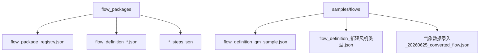
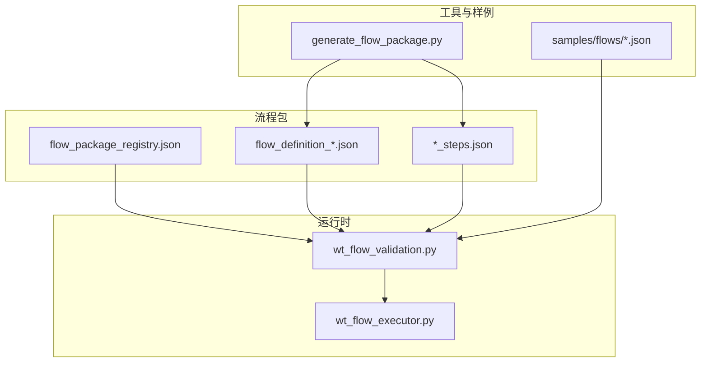
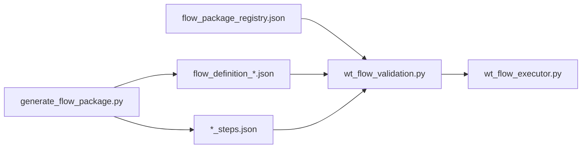
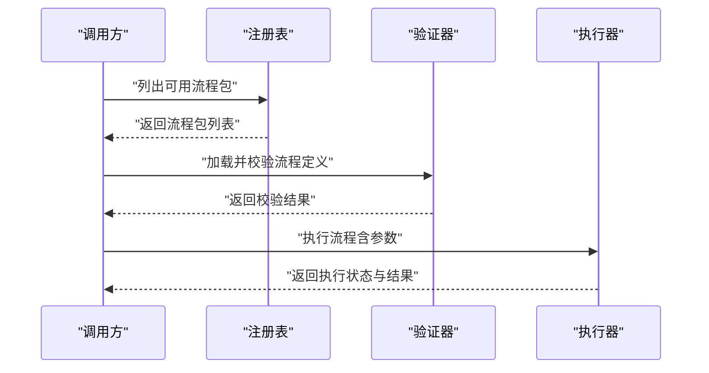

# 流程包结构规范

<cite>
**本文引用的文件**   
- [flow_packages/flow_package_registry.json](file://flow_packages/flow_package_registry.json)
- [flow_packages/flow_definition_geo_import_data_file.json](file://flow_packages/flow_definition_geo_import_data_file.json)
- [flow_packages/flow_definition_microscale_create_model.json](file://flow_packages/flow_definition_microscale_create_model.json)
- [flow_packages/flow_definition_turbine_type_create_and_curves.json](file://flow_packages/flow_definition_turbine_type_create_and_curves.json)
- [flow_packages/flow_definition_创建一个新建模.json](file://flow_packages/flow_definition_创建一个新建模.json)
- [flow_packages/flow_definition_导入测风塔、机位点.json](file://flow_packages/flow_definition_导入测风塔、机位点.json)
- [flow_packages/flow_definition_新建风机类型.json](file://flow_packages/flow_definition_新建风机类型.json)
- [flow_packages/flow_definition_测试.json](file://flow_packages/flow_definition_测试.json)
- [flow_packages/气象数据录入_CFE02_steps.json](file://flow_packages/气象数据录入_CFE02_steps.json)
- [samples/flows/flow_definition_gm_sample.json](file://samples/flows/flow_definition_gm_sample.json)
- [samples/flows/flow_definition_新建风机类型.json](file://samples/flows/flow_definition_新建风机类型.json)
- [samples/flows/气象数据录入_20260625_converted_flow.json](file://samples/flows/气象数据录入_20260625_converted_flow.json)
- [wt_flow_validation.py](file://wt_flow_validation.py)
- [wt_flow_executor.py](file://wt_flow_executor.py)
- [tools/generate_flow_package.py](file://tools/generate_flow_package.py)
</cite>

## 目录
1. [简介](#简介)
2. [项目结构](#项目结构)
3. [核心组件](#核心组件)
4. [架构总览](#架构总览)
5. [详细组件分析](#详细组件分析)
6. [依赖分析](#依赖分析)
7. [性能考虑](#性能考虑)
8. [故障排查指南](#故障排查指南)
9. [结论](#结论)
10. [附录](#附录)

## 简介
本规范面向“流程包”的构建与使用，系统化说明流程包的目录组织、命名约定、JSON定义格式（包元数据、步骤定义、参数配置、依赖声明）、版本管理与向后兼容策略、验证规则与错误处理机制，以及与主流程的集成方式和调用接口。文档同时提供模板与最佳实践示例，帮助开发者快速创建可复用、可维护的流程包。

## 项目结构
流程包集中存放于 flow_packages 目录，采用扁平化组织方式：每个流程包由一个或多个 JSON 文件组成，其中包含流程定义、步骤清单或注册信息。示例与转换产物存放在 samples/flows 目录，便于对照与回归。

图表来源
- [flow_packages/flow_package_registry.json](file://flow_packages/flow_package_registry.json)
- [flow_packages/flow_definition_geo_import_data_file.json](file://flow_packages/flow_definition_geo_import_data_file.json)
- [flow_packages/flow_definition_microscale_create_model.json](file://flow_packages/flow_definition_microscale_create_model.json)
- [flow_packages/flow_definition_turbine_type_create_and_curves.json](file://flow_packages/flow_definition_turbine_type_create_and_curves.json)
- [flow_packages/flow_definition_创建一个新建模.json](file://flow_packages/flow_definition_创建一个新建模.json)
- [flow_packages/flow_definition_导入测风塔、机位点.json](file://flow_packages/flow_definition_导入测风塔、机位点.json)
- [flow_packages/flow_definition_新建风机类型.json](file://flow_packages/flow_definition_新建风机类型.json)
- [flow_packages/flow_definition_测试.json](file://flow_packages/flow_definition_测试.json)
- [flow_packages/气象数据录入_CFE02_steps.json](file://flow_packages/气象数据录入_CFE02_steps.json)
- [samples/flows/flow_definition_gm_sample.json](file://samples/flows/flow_definition_gm_sample.json)
- [samples/flows/flow_definition_新建风机类型.json](file://samples/flows/flow_definition_新建风机类型.json)
- [samples/flows/气象数据录入_20260625_converted_flow.json](file://samples/flows/气象数据录入_20260625_converted_flow.json)

章节来源
- [flow_packages/flow_package_registry.json](file://flow_packages/flow_package_registry.json)
- [flow_packages/flow_definition_geo_import_data_file.json](file://flow_packages/flow_definition_geo_import_data_file.json)
- [flow_packages/flow_definition_microscale_create_model.json](file://flow_packages/flow_definition_microscale_create_model.json)
- [flow_packages/flow_definition_turbine_type_create_and_curves.json](file://flow_packages/flow_definition_turbine_type_create_and_curves.json)
- [flow_packages/flow_definition_创建一个新建模.json](file://flow_packages/flow_definition_创建一个新建模.json)
- [flow_packages/flow_definition_导入测风塔、机位点.json](file://flow_packages/flow_definition_导入测风塔、机位点.json)
- [flow_packages/flow_definition_新建风机类型.json](file://flow_packages/flow_definition_新建风机类型.json)
- [flow_packages/flow_definition_测试.json](file://flow_packages/flow_definition_测试.json)
- [flow_packages/气象数据录入_CFE02_steps.json](file://flow_packages/气象数据录入_CFE02_steps.json)
- [samples/flows/flow_definition_gm_sample.json](file://samples/flows/flow_definition_gm_sample.json)
- [samples/flows/flow_definition_新建风机类型.json](file://samples/flows/flow_definition_新建风机类型.json)
- [samples/flows/气象数据录入_20260625_converted_flow.json](file://samples/flows/气象数据录入_20260625_converted_flow.json)

## 核心组件
- 流程包注册表：用于登记可用流程包及其元数据，便于发现与加载。
- 流程定义文件：描述流程的元数据、步骤序列、参数与依赖等。
- 步骤清单文件：将一组步骤按业务场景拆分，供流程引用组合。
- 生成工具：辅助从现有脚本或记录生成流程包骨架。

章节来源
- [flow_packages/flow_package_registry.json](file://flow_packages/flow_package_registry.json)
- [flow_packages/flow_definition_geo_import_data_file.json](file://flow_packages/flow_definition_geo_import_data_file.json)
- [flow_packages/flow_definition_microscale_create_model.json](file://flow_packages/flow_definition_microscale_create_model.json)
- [flow_packages/flow_definition_turbine_type_create_and_curves.json](file://flow_packages/flow_definition_turbine_type_create_and_curves.json)
- [flow_packages/flow_definition_创建一个新建模.json](file://flow_packages/flow_definition_创建一个新建模.json)
- [flow_packages/flow_definition_导入测风塔、机位点.json](file://flow_packages/flow_definition_导入测风塔、机位点.json)
- [flow_packages/flow_definition_新建风机类型.json](file://flow_packages/flow_definition_新建风机类型.json)
- [flow_packages/flow_definition_测试.json](file://flow_packages/flow_definition_测试.json)
- [flow_packages/气象数据录入_CFE02_steps.json](file://flow_packages/气象数据录入_CFE02_steps.json)
- [tools/generate_flow_package.py](file://tools/generate_flow_package.py)

## 架构总览
下图展示了流程包在系统中的位置与交互关系：注册表提供索引；流程定义文件被解析器读取并校验；执行器驱动步骤运行；生成工具协助产出流程包。

图表来源
- [flow_packages/flow_package_registry.json](file://flow_packages/flow_package_registry.json)
- [flow_packages/flow_definition_geo_import_data_file.json](file://flow_packages/flow_definition_geo_import_data_file.json)
- [flow_packages/flow_definition_microscale_create_model.json](file://flow_packages/flow_definition_microscale_create_model.json)
- [flow_packages/flow_definition_turbine_type_create_and_curves.json](file://flow_packages/flow_definition_turbine_type_create_and_curves.json)
- [flow_packages/flow_definition_创建一个新建模.json](file://flow_packages/flow_definition_创建一个新建模.json)
- [flow_packages/flow_definition_导入测风塔、机位点.json](file://flow_packages/flow_definition_导入测风塔、机位点.json)
- [flow_packages/flow_definition_新建风机类型.json](file://flow_packages/flow_definition_新建风机类型.json)
- [flow_packages/flow_definition_测试.json](file://flow_packages/flow_definition_测试.json)
- [flow_packages/气象数据录入_CFE02_steps.json](file://flow_packages/气象数据录入_CFE02_steps.json)
- [samples/flows/flow_definition_gm_sample.json](file://samples/flows/flow_definition_gm_sample.json)
- [samples/flows/flow_definition_新建风机类型.json](file://samples/flows/flow_definition_新建风机类型.json)
- [samples/flows/气象数据录入_20260625_converted_flow.json](file://samples/flows/气象数据录入_20260625_converted_flow.json)
- [tools/generate_flow_package.py](file://tools/generate_flow_package.py)
- [wt_flow_validation.py](file://wt_flow_validation.py)
- [wt_flow_executor.py](file://wt_flow_executor.py)

## 详细组件分析

### 流程包注册表
- 作用：集中登记流程包标识、名称、版本、描述、入口定义文件路径、依赖项等，供系统扫描与加载。
- 关键字段建议：
  - id：唯一标识符
  - name：显示名
  - version：语义化版本号
  - description：简要说明
  - entry：默认入口流程定义文件名
  - steps_files：关联的步骤清单文件列表
  - dependencies：外部依赖（如控制库、图像模板）
  - tags：标签分类
  - created_at / updated_at：时间戳
- 变更策略：新增流程包时同步更新注册表；删除时移除条目并清理引用。

章节来源
- [flow_packages/flow_package_registry.json](file://flow_packages/flow_package_registry.json)

### 流程定义文件（flow_definition_*.json）
- 作用：描述单个流程的完整定义，包括元数据、步骤序列、参数、依赖与执行约束。
- 建议字段：
  - metadata：包级元数据（id、name、version、description、author、license 等）
  - parameters：参数集合（名称、类型、默认值、校验规则、分组）
  - steps：步骤数组（顺序执行），每个步骤包含：
    - id：步骤唯一标识
    - type：步骤类型（如点击、输入、选择、等待、断言等）
    - target：目标控件或区域定位信息
    - action：动作参数（文本、坐标、偏移、超时等）
    - condition：条件表达式（可选）
    - retry：重试策略（次数、间隔）
    - timeout：超时设置
    - on_error：错误处理策略（继续、中断、回滚）
  - dependencies：流程级依赖（如需要的外部资源、前置流程）
  - schema_version：定义文件版本，用于向后兼容判断
- 命名约定：以 flow_definition_ 开头，后接中文或英文可读名，避免特殊字符。

章节来源
- [flow_packages/flow_definition_geo_import_data_file.json](file://flow_packages/flow_definition_geo_import_data_file.json)
- [flow_packages/flow_definition_microscale_create_model.json](file://flow_packages/flow_definition_microscale_create_model.json)
- [flow_packages/flow_definition_turbine_type_create_and_curves.json](file://flow_packages/flow_definition_turbine_type_create_and_curves.json)
- [flow_packages/flow_definition_创建一个新建模.json](file://flow_packages/flow_definition_创建一个新建模.json)
- [flow_packages/flow_definition_导入测风塔、机位点.json](file://flow_packages/flow_definition_导入测风塔、机位点.json)
- [flow_packages/flow_definition_新建风机类型.json](file://flow_packages/flow_definition_新建风机类型.json)
- [flow_packages/flow_definition_测试.json](file://flow_packages/flow_definition_测试.json)

### 步骤清单文件（*_steps.json）
- 作用：将常用步骤按业务域拆分为可复用的片段，供多个流程组合引用，提升复用率与维护性。
- 建议字段：
  - name：步骤集名称
  - version：步骤集版本
  - steps：步骤片段数组（结构与流程定义中的步骤一致）
  - references：被哪些流程引用（可选）
- 命名约定：以业务主题命名，后缀 _steps.json，例如 气象数据录入_CFE02_steps.json。

章节来源
- [flow_packages/气象数据录入_CFE02_steps.json](file://flow_packages/气象数据录入_CFE02_steps.json)

### 生成工具（generate_flow_package.py）
- 作用：从已有脚本或录制产物自动生成流程包骨架，减少手工编写成本。
- 典型能力：
  - 解析脚本或录制日志，提取关键操作
  - 生成 flow_definition_*.json 与 *_steps.json 基础结构
  - 填充默认参数与校验规则
  - 输出到 flow_packages 或 samples/flows 目录
- 使用建议：生成后人工审查步骤类型、定位信息与参数，确保稳定与健壮。

章节来源
- [tools/generate_flow_package.py](file://tools/generate_flow_package.py)

### 样例与转换产物（samples/flows）
- 作用：提供标准样例与历史转换产物，便于对比、学习与回归测试。
- 内容：
  - flow_definition_gm_sample.json：通用样例
  - flow_definition_新建风机类型.json：业务样例
  - 气象数据录入_20260625_converted_flow.json：转换后的流程定义

章节来源
- [samples/flows/flow_definition_gm_sample.json](file://samples/flows/flow_definition_gm_sample.json)
- [samples/flows/flow_definition_新建风机类型.json](file://samples/flows/flow_definition_新建风机类型.json)
- [samples/flows/气象数据录入_20260625_converted_flow.json](file://samples/flows/气象数据录入_20260625_converted_flow.json)

## 依赖分析
- 组件耦合：
  - 注册表与流程定义文件为静态配置，被验证器与执行器读取。
  - 生成工具仅负责产出，不介入运行时。
  - 样例文件作为参考与回归基准。
- 外部依赖：
  - 控制映射库、图像模板库等通过流程定义的 dependencies 字段声明。
- 潜在循环：
  - 流程定义不应直接引用自身；步骤清单可被多流程引用，但应避免相互引用形成环。

图表来源
- [flow_packages/flow_package_registry.json](file://flow_packages/flow_package_registry.json)
- [flow_packages/flow_definition_geo_import_data_file.json](file://flow_packages/flow_definition_geo_import_data_file.json)
- [flow_packages/flow_definition_microscale_create_model.json](file://flow_packages/flow_definition_microscale_create_model.json)
- [flow_packages/flow_definition_turbine_type_create_and_curves.json](file://flow_packages/flow_definition_turbine_type_create_and_curves.json)
- [flow_packages/flow_definition_创建一个新建模.json](file://flow_packages/flow_definition_创建一个新建模.json)
- [flow_packages/flow_definition_导入测风塔、机位点.json](file://flow_packages/flow_definition_导入测风塔、机位点.json)
- [flow_packages/flow_definition_新建风机类型.json](file://flow_packages/flow_definition_新建风机类型.json)
- [flow_packages/flow_definition_测试.json](file://flow_packages/flow_definition_测试.json)
- [flow_packages/气象数据录入_CFE02_steps.json](file://flow_packages/气象数据录入_CFE02_steps.json)
- [tools/generate_flow_package.py](file://tools/generate_flow_package.py)
- [wt_flow_validation.py](file://wt_flow_validation.py)
- [wt_flow_executor.py](file://wt_flow_executor.py)

章节来源
- [flow_packages/flow_package_registry.json](file://flow_packages/flow_package_registry.json)
- [flow_packages/flow_definition_geo_import_data_file.json](file://flow_packages/flow_definition_geo_import_data_file.json)
- [flow_packages/flow_definition_microscale_create_model.json](file://flow_packages/flow_definition_microscale_create_model.json)
- [flow_packages/flow_definition_turbine_type_create_and_curves.json](file://flow_packages/flow_definition_turbine_type_create_and_curves.json)
- [flow_packages/flow_definition_创建一个新建模.json](file://flow_packages/flow_definition_创建一个新建模.json)
- [flow_packages/flow_definition_导入测风塔、机位点.json](file://flow_packages/flow_definition_导入测风塔、机位点.json)
- [flow_packages/flow_definition_新建风机类型.json](file://flow_packages/flow_definition_新建风机类型.json)
- [flow_packages/flow_definition_测试.json](file://flow_packages/flow_definition_测试.json)
- [flow_packages/气象数据录入_CFE02_steps.json](file://flow_packages/气象数据录入_CFE02_steps.json)
- [tools/generate_flow_package.py](file://tools/generate_flow_package.py)
- [wt_flow_validation.py](file://wt_flow_validation.py)
- [wt_flow_executor.py](file://wt_flow_executor.py)

## 性能考虑
- 批量加载：优先一次性加载注册表与流程定义，避免重复 I/O。
- 懒解析：仅在首次执行时解析步骤清单，后续缓存。
- 定位优化：对频繁使用的控件定位建立索引或缓存，降低 UI 查找开销。
- 重试与超时：合理设置重试次数与间隔，避免长时间阻塞。
- 并行执行：对于无状态且独立的步骤，可在安全前提下并行执行以提升吞吐。

## 故障排查指南
- 常见错误：
  - 流程定义语法错误：检查 JSON 合法性与必填字段。
  - 步骤类型未知：确认 type 是否在支持列表中。
  - 定位失败：核对 target 的定位策略与上下文窗口。
  - 依赖缺失：检查 dependencies 是否满足。
- 诊断方法：
  - 启用详细日志，记录每一步的输入与输出。
  - 使用生成工具的校验模式，提前发现问题。
  - 对比 samples/flows 中的样例，逐步缩小差异范围。
- 恢复策略：
  - 使用 on_error 策略进行局部重试或跳过。
  - 回滚到上一个稳定版本（基于版本管理）。

章节来源
- [wt_flow_validation.py](file://wt_flow_validation.py)
- [wt_flow_executor.py](file://wt_flow_executor.py)

## 结论
通过统一的流程包结构、严格的验证规则与清晰的版本管理策略，流程包可实现高内聚、低耦合的可复用自动化资产沉淀。结合生成工具与样例体系，团队可快速构建高质量流程，并在演进中保持向后兼容与稳定性。

## 附录

### 命名约定与目录结构要求
- 流程定义文件：flow_definition_<主题>.json
- 步骤清单文件：<主题>_steps.json
- 注册表：flow_package_registry.json
- 样例目录：samples/flows
- 生成工具：tools/generate_flow_package.py

章节来源
- [flow_packages/flow_package_registry.json](file://flow_packages/flow_package_registry.json)
- [flow_packages/flow_definition_geo_import_data_file.json](file://flow_packages/flow_definition_geo_import_data_file.json)
- [flow_packages/flow_definition_microscale_create_model.json](file://flow_packages/flow_definition_microscale_create_model.json)
- [flow_packages/flow_definition_turbine_type_create_and_curves.json](file://flow_packages/flow_definition_turbine_type_create_and_curves.json)
- [flow_packages/flow_definition_创建一个新建模.json](file://flow_packages/flow_definition_创建一个新建模.json)
- [flow_packages/flow_definition_导入测风塔、机位点.json](file://flow_packages/flow_definition_导入测风塔、机位点.json)
- [flow_packages/flow_definition_新建风机类型.json](file://flow_packages/flow_definition_新建风机类型.json)
- [flow_packages/flow_definition_测试.json](file://flow_packages/flow_definition_测试.json)
- [flow_packages/气象数据录入_CFE02_steps.json](file://flow_packages/气象数据录入_CFE02_steps.json)
- [samples/flows/flow_definition_gm_sample.json](file://samples/flows/flow_definition_gm_sample.json)
- [samples/flows/flow_definition_新建风机类型.json](file://samples/flows/flow_definition_新建风机类型.json)
- [samples/flows/气象数据录入_20260625_converted_flow.json](file://samples/flows/气象数据录入_20260625_converted_flow.json)
- [tools/generate_flow_package.py](file://tools/generate_flow_package.py)

### 版本管理与向后兼容性
- 语义化版本：major.minor.patch，破坏性变更递增 major，新增功能递增 minor，修复递增 patch。
- 定义文件版本：schema_version 字段指示当前定义格式版本，执行器据此选择解析策略。
- 兼容策略：
  - 新增可选字段不影响旧流程执行。
  - 废弃字段保留解析但发出警告。
  - 重大变更提供迁移脚本或双轨解析。
- 发布流程：
  - 更新注册表与样例。
  - 运行全量验证与回归测试。
  - 归档旧版本定义以供回滚。

章节来源
- [flow_packages/flow_package_registry.json](file://flow_packages/flow_package_registry.json)
- [flow_packages/flow_definition_geo_import_data_file.json](file://flow_packages/flow_definition_geo_import_data_file.json)
- [flow_packages/flow_definition_microscale_create_model.json](file://flow_packages/flow_definition_microscale_create_model.json)
- [flow_packages/flow_definition_turbine_type_create_and_curves.json](file://flow_packages/flow_definition_turbine_type_create_and_curves.json)
- [flow_packages/flow_definition_创建一个新建模.json](file://flow_packages/flow_definition_创建一个新建模.json)
- [flow_packages/flow_definition_导入测风塔、机位点.json](file://flow_packages/flow_definition_导入测风塔、机位点.json)
- [flow_packages/flow_definition_新建风机类型.json](file://flow_packages/flow_definition_新建风机类型.json)
- [flow_packages/flow_definition_测试.json](file://flow_packages/flow_definition_测试.json)
- [flow_packages/气象数据录入_CFE02_steps.json](file://flow_packages/气象数据录入_CFE02_steps.json)
- [samples/flows/flow_definition_gm_sample.json](file://samples/flows/flow_definition_gm_sample.json)
- [samples/flows/flow_definition_新建风机类型.json](file://samples/flows/flow_definition_新建风机类型.json)
- [samples/flows/气象数据录入_20260625_converted_flow.json](file://samples/flows/气象数据录入_20260625_converted_flow.json)

### 验证规则与错误处理机制
- 验证阶段：
  - JSON 语法校验
  - 必填字段检查（metadata、steps、parameters 等）
  - 步骤类型白名单校验
  - 依赖完整性校验
  - 参数类型与默认值校验
- 错误处理：
  - 收集所有错误并汇总报告
  - 提供错误定位（文件、行号、字段）
  - 支持忽略非致命错误继续执行（可选）

章节来源
- [wt_flow_validation.py](file://wt_flow_validation.py)

### 与主流程的集成与调用接口
- 集成方式：
  - 通过注册表发现流程包
  - 加载流程定义与步骤清单
  - 执行前进行完整校验
  - 执行器驱动步骤运行并记录结果
- 调用接口（概念性）：
  - 列出可用流程包
  - 获取流程定义详情
  - 执行指定流程（传入参数）
  - 查询执行状态与结果
  - 停止或回滚（若支持）

[此图为概念性流程图，无需图表来源]

### 模板与最佳实践示例
- 最小模板：
  - 流程定义：包含 metadata、parameters、steps 三个核心部分
  - 步骤清单：至少包含一个可复用的步骤片段
- 最佳实践：
  - 明确参数边界与默认值
  - 使用稳定的控件定位策略
  - 为易变步骤添加重试与超时
  - 将通用逻辑下沉到步骤清单
  - 在注册表中完善元数据与标签
  - 定期回归样例，确保兼容性

章节来源
- [flow_packages/flow_definition_geo_import_data_file.json](file://flow_packages/flow_definition_geo_import_data_file.json)
- [flow_packages/flow_definition_microscale_create_model.json](file://flow_packages/flow_definition_microscale_create_model.json)
- [flow_packages/flow_definition_turbine_type_create_and_curves.json](file://flow_packages/flow_definition_turbine_type_create_and_curves.json)
- [flow_packages/flow_definition_创建一个新建模.json](file://flow_packages/flow_definition_创建一个新建模.json)
- [flow_packages/flow_definition_导入测风塔、机位点.json](file://flow_packages/flow_definition_导入测风塔、机位点.json)
- [flow_packages/flow_definition_新建风机类型.json](file://flow_packages/flow_definition_新建风机类型.json)
- [flow_packages/flow_definition_测试.json](file://flow_packages/flow_definition_测试.json)
- [flow_packages/气象数据录入_CFE02_steps.json](file://flow_packages/气象数据录入_CFE02_steps.json)
- [samples/flows/flow_definition_gm_sample.json](file://samples/flows/flow_definition_gm_sample.json)
- [samples/flows/flow_definition_新建风机类型.json](file://samples/flows/flow_definition_新建风机类型.json)
- [samples/flows/气象数据录入_20260625_converted_flow.json](file://samples/flows/气象数据录入_20260625_converted_flow.json)