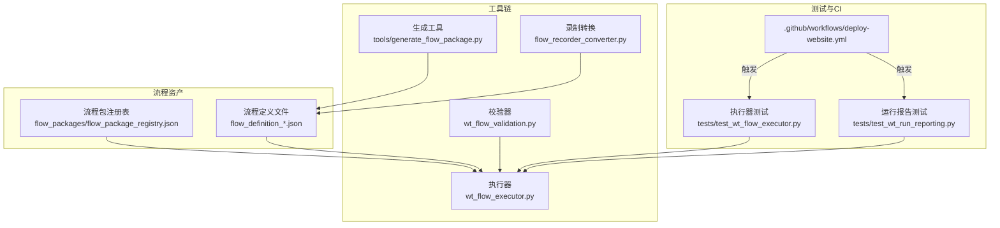
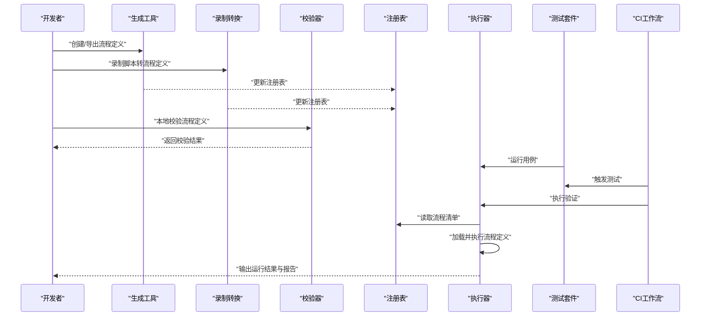
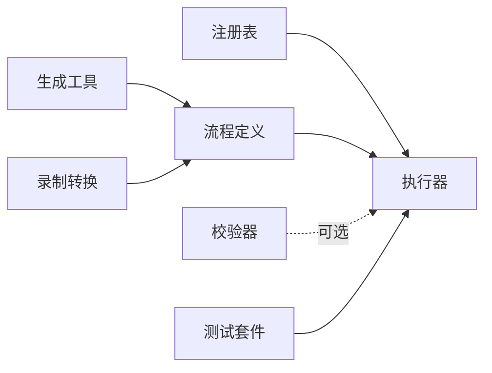

# 生命周期管理

<cite>
**本文引用的文件**   
- [README.md](file://README.md)
- [PROJECT_ARCHITECTURE.md](file://PROJECT_ARCHITECTURE.md)
- [flow_packages/flow_package_registry.json](file://flow_packages/flow_package_registry.json)
- [tools/generate_flow_package.py](file://tools/generate_flow_package.py)
- [flow_recorder_converter.py](file://flow_recorder_converter.py)
- [wt_flow_validation.py](file://wt_flow_validation.py)
- [wt_flow_executor.py](file://wt_flow_executor.py)
- [tests/test_wt_flow_executor.py](file://tests/test_wt_flow_executor.py)
- [tests/test_wt_run_reporting.py](file://tests/test_wt_run_reporting.py)
- [.github/workflows/deploy-website.yml](file://.github/workflows/deploy-website.yml)
</cite>

## 目录
1. [引言](#引言)
2. [项目结构](#项目结构)
3. [核心组件](#核心组件)
4. [架构总览](#架构总览)
5. [详细组件分析](#详细组件分析)
6. [依赖关系分析](#依赖关系分析)
7. [性能考虑](#性能考虑)
8. [故障排查指南](#故障排查指南)
9. [结论](#结论)
10. [附录](#附录)

## 引言
本文件围绕“流程包”的全生命周期管理展开，覆盖创建、开发、测试、发布与部署、版本控制与变更管理、打包签名与分发、卸载清理与回滚、质量检查与自动化测试集成、性能监控与故障诊断、团队协作与权限控制等主题。文档以仓库现有结构与实现为依据，提供可操作的实践建议与可视化图示，帮助团队在协作中高效、稳定地交付流程包。

## 项目结构
仓库采用按功能域组织的方式，与流程包相关的核心位置如下：
- flow_packages：存放流程定义与注册表（JSON），是流程包的持久化载体与元数据索引
- tools/generate_flow_package.py：用于生成或导出流程包的辅助工具
- flow_recorder_converter.py：将录制脚本转换为流程定义，支撑快速开发与迭代
- wt_flow_validation.py：流程定义校验逻辑，保障输入正确性与一致性
- wt_flow_executor.py：流程执行引擎，负责加载、解析与运行流程
- tests/*：针对执行器、报告输出等的单元测试与集成测试
- .github/workflows/deploy-website.yml：持续集成示例（网站部署），可作为流水线模板参考

图表来源
- [flow_packages/flow_package_registry.json](file://flow_packages/flow_package_registry.json)
- [tools/generate_flow_package.py](file://tools/generate_flow_package.py)
- [flow_recorder_converter.py](file://flow_recorder_converter.py)
- [wt_flow_validation.py](file://wt_flow_validation.py)
- [wt_flow_executor.py](file://wt_flow_executor.py)
- [tests/test_wt_flow_executor.py](file://tests/test_wt_flow_executor.py)
- [tests/test_wt_run_reporting.py](file://tests/test_wt_run_reporting.py)
- [.github/workflows/deploy-website.yml](file://.github/workflows/deploy-website.yml)

章节来源
- [README.md](file://README.md)
- [PROJECT_ARCHITECTURE.md](file://PROJECT_ARCHITECTURE.md)

## 核心组件
- 流程包注册表：集中记录可用流程包及其元信息，供执行器发现与选择
- 流程定义文件：描述步骤、参数、控件定位、数据流等，是流程包的核心内容
- 生成工具：从工程上下文或模板生成流程定义，提升创建效率
- 录制转换：将UI录制脚本转为流程定义，降低上手门槛
- 校验器：对流程定义进行语法与业务规则校验，提前拦截错误
- 执行器：加载注册表与定义，驱动流程运行并产出运行结果与报告
- 测试套件：覆盖执行路径、边界条件与报告格式，保障稳定性
- CI示例：展示如何以工作流触发测试与制品构建，作为发布流水线参考

章节来源
- [flow_packages/flow_package_registry.json](file://flow_packages/flow_package_registry.json)
- [tools/generate_flow_package.py](file://tools/generate_flow_package.py)
- [flow_recorder_converter.py](file://flow_recorder_converter.py)
- [wt_flow_validation.py](file://wt_flow_validation.py)
- [wt_flow_executor.py](file://wt_flow_executor.py)
- [tests/test_wt_flow_executor.py](file://tests/test_wt_flow_executor.py)
- [tests/test_wt_run_reporting.py](file://tests/test_wt_run_reporting.py)

## 架构总览
下图展示了流程包从创建到运行的端到端路径，以及关键组件间的交互关系。

图表来源
- [tools/generate_flow_package.py](file://tools/generate_flow_package.py)
- [flow_recorder_converter.py](file://flow_recorder_converter.py)
- [wt_flow_validation.py](file://wt_flow_validation.py)
- [flow_packages/flow_package_registry.json](file://flow_packages/flow_package_registry.json)
- [wt_flow_executor.py](file://wt_flow_executor.py)
- [tests/test_wt_flow_executor.py](file://tests/test_wt_flow_executor.py)
- [.github/workflows/deploy-website.yml](file://.github/workflows/deploy-website.yml)

## 详细组件分析

### 流程包注册表与定义
- 职责
  - 注册表：维护流程包清单、版本、依赖、入口等元数据
  - 定义文件：描述流程步骤、参数、控件映射、数据源与目标
- 关键点
  - 新增流程包需同步更新注册表，确保执行器可发现
  - 定义文件应遵循统一命名规范，便于检索与版本化管理
- 建议
  - 为每个流程包建立独立目录，包含定义、资源与说明文档
  - 使用语义化版本号，并在注册表中记录变更摘要

章节来源
- [flow_packages/flow_package_registry.json](file://flow_packages/flow_package_registry.json)

### 生成工具与录制转换
- 生成工具
  - 作用：根据模板或工程上下文自动生成流程定义，减少手工编写成本
  - 适用场景：批量初始化、标准流程模板落地
- 录制转换
  - 作用：将UI录制脚本转换为流程定义，加速原型验证
  - 适用场景：快速探索、回归用例采集
- 建议
  - 生成与转换产物均需通过校验器，避免污染主干
  - 保留原始录制脚本与生成中间态，便于回溯与审计

章节来源
- [tools/generate_flow_package.py](file://tools/generate_flow_package.py)
- [flow_recorder_converter.py](file://flow_recorder_converter.py)

### 校验器
- 职责
  - 校验流程定义的语法、必填字段、类型约束与业务规则
  - 在提交前或CI阶段阻断不合规变更
- 建议
  - 将校验器接入预提交钩子与CI流水线
  - 对常见错误给出明确提示与修复建议

章节来源
- [wt_flow_validation.py](file://wt_flow_validation.py)

### 执行器
- 职责
  - 读取注册表与流程定义，解析步骤并驱动执行
  - 收集运行日志、指标与结果，输出标准化报告
- 建议
  - 在执行前后注入健康检查与资源清理逻辑
  - 支持断点续跑与失败重试，提高鲁棒性

章节来源
- [wt_flow_executor.py](file://wt_flow_executor.py)

### 测试套件与报告
- 执行器测试
  - 覆盖正常路径、异常分支与边界条件
  - 验证执行器行为与预期一致
- 运行报告测试
  - 验证报告结构、字段完整性与可读性
- 建议
  - 引入覆盖率阈值与失败告警
  - 将报告产物归档，便于追溯与分析

章节来源
- [tests/test_wt_flow_executor.py](file://tests/test_wt_flow_executor.py)
- [tests/test_wt_run_reporting.py](file://tests/test_wt_run_reporting.py)

### 持续集成示例
- 用途
  - 演示如何通过工作流触发测试与构建，作为发布流水线模板
- 建议
  - 复用该工作流模式，扩展为多环境（dev/stage/prod）流水线
  - 增加制品上传、签名与发布步骤

章节来源
- [.github/workflows/deploy-website.yml](file://.github/workflows/deploy-website.yml)

## 依赖关系分析
- 组件耦合
  - 执行器强依赖注册表与定义文件；弱依赖校验器（可在执行前调用）
  - 生成工具与录制转换仅产出定义与注册表，无运行时耦合
- 外部依赖
  - UI自动化后端、图像匹配、OCR等由执行器间接使用
- 风险点
  - 注册表与定义不一致会导致执行期错误
  - 未通过校验的变更进入主干会引发不稳定

图表来源
- [flow_packages/flow_package_registry.json](file://flow_packages/flow_package_registry.json)
- [wt_flow_executor.py](file://wt_flow_executor.py)
- [wt_flow_validation.py](file://wt_flow_validation.py)
- [tools/generate_flow_package.py](file://tools/generate_flow_package.py)
- [flow_recorder_converter.py](file://flow_recorder_converter.py)
- [tests/test_wt_flow_executor.py](file://tests/test_wt_flow_executor.py)

## 性能考虑
- 执行优化
  - 缓存常用控件定位与图像模板，减少重复计算
  - 并行执行互不依赖的步骤，缩短整体时延
- 资源管理
  - 显式释放窗口句柄、进程与临时文件，避免内存泄漏
- 观测性
  - 埋点关键步骤耗时与成功率，形成SLO看板
  - 对慢步骤进行采样与热点分析，针对性优化

[本节为通用指导，不涉及具体文件]

## 故障排查指南
- 常见问题
  - 流程定义缺失或字段不完整：优先运行校验器，依据错误提示修复
  - 执行期找不到控件或元素：检查控件库与相对定位策略，必要时刷新图像模板
  - 并发冲突导致状态不一致：串行化共享资源访问或引入锁机制
- 诊断手段
  - 启用详细日志与截图快照，定位界面差异
  - 使用最小复现用例隔离问题范围
  - 对比历史成功版本的定义与配置，识别回归点
- 恢复策略
  - 基于注册表版本快速回滚至上一稳定版本
  - 对失败任务支持断点续跑与幂等重试

章节来源
- [wt_flow_validation.py](file://wt_flow_validation.py)
- [wt_flow_executor.py](file://wt_flow_executor.py)
- [tests/test_wt_run_reporting.py](file://tests/test_wt_run_reporting.py)

## 结论
通过统一的注册表与定义规范、完善的校验与测试体系、以及可复用的CI流水线，流程包可实现从创建到上线的闭环管理。建议在团队内推广以下最佳实践：
- 所有变更必须通过校验与测试，禁止绕过门禁
- 使用语义化版本与变更摘要，保持可追溯性
- 将性能与稳定性指标纳入发布准入条件
- 建立共享库与权限模型，平衡开放与安全

[本节为总结性内容，不涉及具体文件]

## 附录

### 全生命周期操作清单
- 创建
  - 使用生成工具或录制转换产出流程定义
  - 更新注册表，登记版本与依赖
- 开发
  - 本地运行校验器与单测，保证基线稳定
  - 增量提交，附带变更说明
- 测试
  - 执行测试套件，关注覆盖率与失败用例
  - 在仿真环境中进行端到端验证
- 发布
  - 通过CI触发构建与制品打包
  - 生成签名与哈希，上传制品库
- 部署
  - 在目标环境拉取指定版本，执行安装与初始化
  - 启动冒烟测试，确认服务可用
- 卸载与清理
  - 停止相关进程，移除注册表条目与残留文件
  - 清理缓存与临时目录
- 回滚
  - 切换注册表指向上一稳定版本
  - 重新部署并验证关键路径

[本节为概念性指引，不涉及具体文件]

### 版本控制与变更管理
- 分支策略
  - main/release：受保护分支，仅允许合并通过CI的变更
  - feature/*：新功能开发
  - hotfix/*：紧急修复
- 标签与版本
  - 使用语义化版本标签，如 v1.2.3
  - 在注册表中记录版本元数据与变更摘要
- 变更评审
  - 强制代码审查与自动化测试通过后方可合并
  - 重大变更需附加影响评估与回滚方案

[本节为概念性指引，不涉及具体文件]

### 打包、签名与分发
- 打包
  - 将流程定义、资源与依赖打包为制品
  - 生成清单与校验和
- 签名
  - 使用可信密钥对制品签名，确保来源可信
- 分发
  - 上传至制品库，设置访问权限与可见性
  - 在目标环境通过清单拉取与安装

[本节为概念性指引，不涉及具体文件]

### 质量检查与自动化测试集成
- 质量门禁
  - 静态检查、依赖漏洞扫描、复杂度与覆盖率阈值
- 测试分层
  - 单元：校验器与工具函数
  - 集成：执行器与外部系统交互
  - E2E：端到端流程验证
- 报告与告警
  - 聚合测试结果与覆盖率，失败自动通知

[本节为概念性指引，不涉及具体文件]

### 性能监控与故障诊断
- 监控指标
  - 执行时长、成功率、资源占用、错误分布
- 诊断工具
  - 日志聚合、链路追踪、快照与回放
- 容量规划
  - 压测瓶颈步骤，扩容或异步化处理

[本节为概念性指引，不涉及具体文件]

### 团队协作与权限控制
- 共享机制
  - 公共流程库与私有流程库分离
  - 通过注册表统一管理可见范围
- 权限模型
  - 基于角色控制创建、发布与回滚权限
  - 敏感流程需双人复核与审批

[本节为概念性指引，不涉及具体文件]