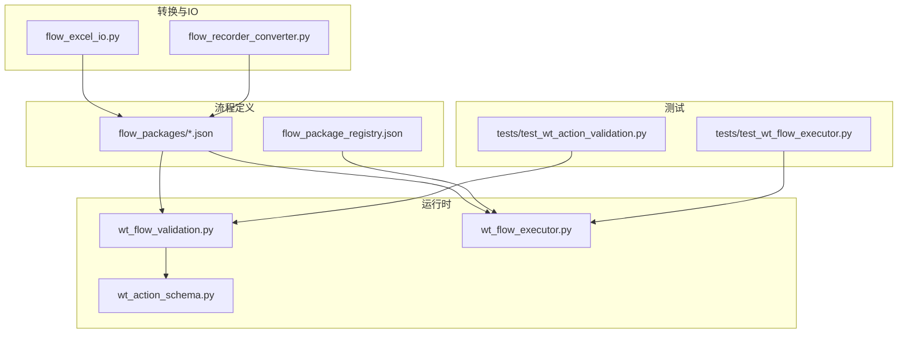
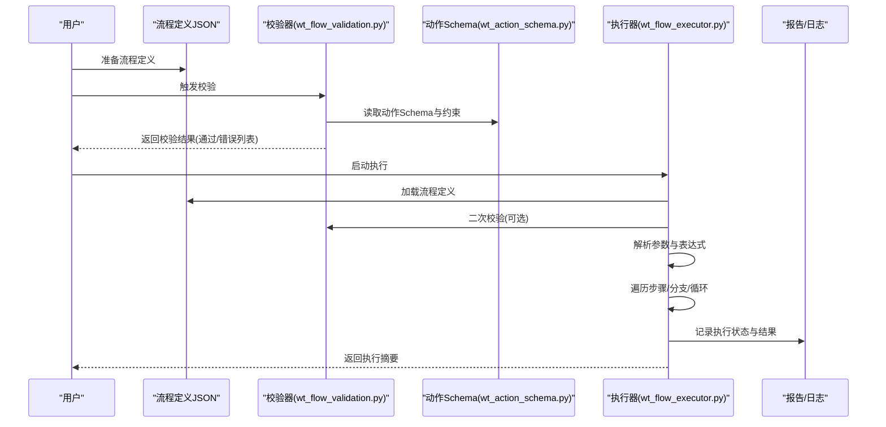
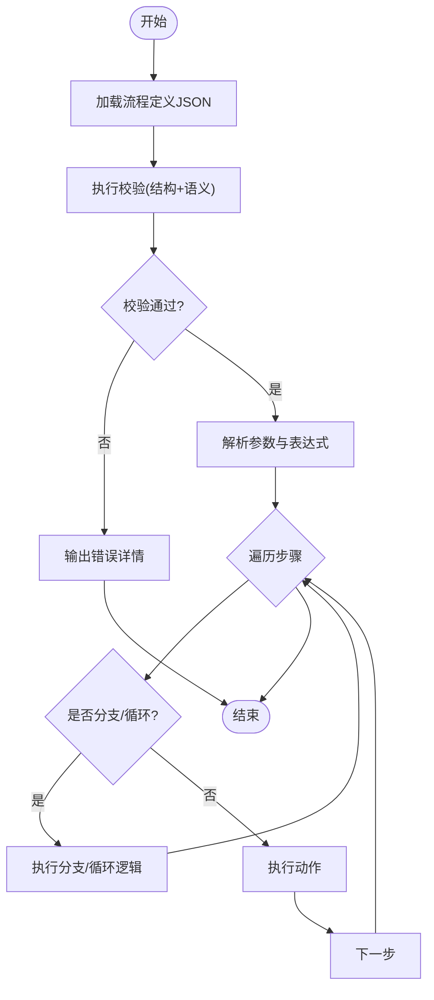
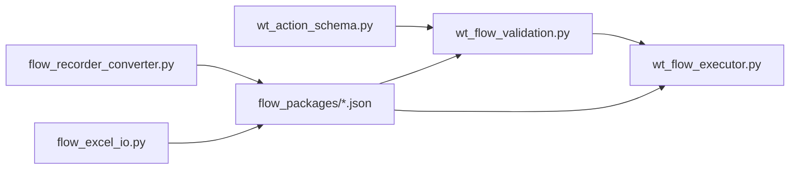

# 流程定义语法

<cite>
**本文引用的文件**   
- [wt_flow_validation.py](file://wt_flow_validation.py)
- [wt_action_schema.py](file://wt_action_schema.py)
- [flow_definition_测试.json](file://flow_packages/flow_definition_测试.json)
- [flow_definition_geo_import_data_file.json](file://flow_packages/flow_definition_geo_import_data_file.json)
- [flow_definition_microscale_create_model.json](file://flow_packages/flow_definition_microscale_create_model.json)
- [flow_definition_turbine_type_create_and_curves.json](file://flow_packages/flow_definition_turbine_type_create_and_curves.json)
- [flow_definition_创建一个新建模.json](file://flow_packages/flow_definition_创建一个新建模.json)
- [flow_definition_导入测风塔、机位点.json](file://flow_packages/flow_definition_导入测风塔、机位点.json)
- [flow_definition_新建风机类型.json](file://flow_packages/flow_definition_新建风机类型.json)
- [flow_excel_io.py](file://flow_excel_io.py)
- [flow_recorder_converter.py](file://flow_recorder_converter.py)
- [test_wt_flow_executor.py](file://tests/test_wt_flow_executor.py)
- [test_wt_action_validation.py](file://tests/test_wt_action_validation.py)
</cite>

## 目录
1. [简介](#简介)
2. [项目结构](#项目结构)
3. [核心组件](#核心组件)
4. [架构总览](#架构总览)
5. [详细组件分析](#详细组件分析)
6. [依赖关系分析](#依赖关系分析)
7. [性能考虑](#性能考虑)
8. [故障排查指南](#故障排查指南)
9. [结论](#结论)
10. [附录：语法参考与示例](#附录语法参考与示例)

## 简介
本文件面向WT自动化框架的流程定义语法规则，系统性说明JSON格式的流程定义文件结构、根节点配置、步骤定义语法、参数传递机制、条件分支逻辑、动作类型体系（控件操作、数据验证、循环控制等）、参数类型系统与默认值、动态表达式支持、验证规则与错误处理，以及复杂业务流程建模方法与最佳实践。文档同时提供完整语法参考与实际示例路径，帮助读者快速上手并构建可维护的自动化流程。

## 项目结构
WT自动化框架将“流程定义”以JSON文件形式组织在flow_packages目录下，并通过执行器与校验器进行解析与运行。关键位置如下：
- flow_packages：存放各类流程定义JSON文件与包注册表
- wt_flow_validation.py：流程与动作定义的校验逻辑
- wt_action_schema.py：动作字段Schema与约束
- flow_excel_io.py / flow_recorder_converter.py：流程与Excel/录制脚本之间的转换工具
- tests：覆盖执行、校验、定位等场景的测试用例

图表来源
- [flow_definition_测试.json](file://flow_packages/flow_definition_测试.json)
- [flow_definition_geo_import_data_file.json](file://flow_packages/flow_definition_geo_import_data_file.json)
- [flow_definition_microscale_create_model.json](file://flow_packages/flow_definition_microscale_create_model.json)
- [flow_definition_turbine_type_create_and_curves.json](file://flow_packages/flow_definition_turbine_type_create_and_curves.json)
- [flow_definition_创建一个新建模.json](file://flow_packages/flow_definition_创建一个新建模.json)
- [flow_definition_导入测风塔、机位点.json](file://flow_packages/flow_definition_导入测风塔、机位点.json)
- [wt_flow_validation.py](file://wt_flow_validation.py)
- [wt_action_schema.py](file://wt_action_schema.py)
- [flow_excel_io.py](file://flow_excel_io.py)
- [flow_recorder_converter.py](file://flow_recorder_converter.py)
- [test_wt_flow_executor.py](file://tests/test_wt_flow_executor.py)
- [test_wt_action_validation.py](file://tests/test_wt_action_validation.py)

章节来源
- [flow_definition_测试.json](file://flow_packages/flow_definition_测试.json)
- [flow_definition_geo_import_data_file.json](file://flow_packages/flow_definition_geo_import_data_file.json)
- [flow_definition_microscale_create_model.json](file://flow_packages/flow_definition_microscale_create_model.json)
- [flow_definition_turbine_type_create_and_curves.json](file://flow_packages/flow_definition_turbine_type_create_and_curves.json)
- [flow_definition_创建一个新建模.json](file://flow_packages/flow_definition_创建一个新建模.json)
- [flow_definition_导入测风塔、机位点.json](file://flow_packages/flow_definition_导入测风塔、机位点.json)
- [wt_flow_validation.py](file://wt_flow_validation.py)
- [wt_action_schema.py](file://wt_action_schema.py)
- [flow_excel_io.py](file://flow_excel_io.py)
- [flow_recorder_converter.py](file://flow_recorder_converter.py)
- [test_wt_flow_executor.py](file://tests/test_wt_flow_executor.py)
- [test_wt_action_validation.py](file://tests/test_wt_action_validation.py)

## 核心组件
- 流程定义JSON：描述根节点配置、全局参数、步骤序列、条件分支与循环控制等
- 动作Schema：定义每个动作类型的必填字段、可选字段、取值范围与默认值
- 校验器：对流程定义进行结构与语义校验，输出错误信息便于修复
- 执行器：加载流程定义、解析参数与表达式、按顺序或条件执行动作
- 转换工具：将流程定义与Excel/录制脚本互转，提升易用性与可移植性

章节来源
- [wt_flow_validation.py](file://wt_flow_validation.py)
- [wt_action_schema.py](file://wt_action_schema.py)
- [flow_excel_io.py](file://flow_excel_io.py)
- [flow_recorder_converter.py](file://flow_recorder_converter.py)
- [test_wt_flow_executor.py](file://tests/test_wt_flow_executor.py)
- [test_wt_action_validation.py](file://tests/test_wt_action_validation.py)

## 架构总览
下图展示从流程定义到执行的端到端流程，包括校验、参数解析、动作调度与结果上报。

图表来源
- [wt_flow_validation.py](file://wt_flow_validation.py)
- [wt_action_schema.py](file://wt_action_schema.py)
- [test_wt_flow_executor.py](file://tests/test_wt_flow_executor.py)

## 详细组件分析

### 流程定义JSON结构
- 根节点配置
  - 包含流程元信息（名称、版本、描述等）
  - 全局参数与环境变量注入
  - 执行策略（重试、超时、并发度等）
- 步骤定义
  - 步骤ID、名称、类型、参数映射
  - 前置条件与后置断言
  - 异常处理策略（继续/中断/重试）
- 参数传递机制
  - 全局参数、上下文变量、步骤间传参
  - 表达式引用与函数调用
- 条件分支与循环
  - if/else分支、switch多路分支
  - for/while循环、迭代集合
  - 嵌套与组合使用

章节来源
- [flow_definition_测试.json](file://flow_packages/flow_definition_测试.json)
- [flow_definition_geo_import_data_file.json](file://flow_packages/flow_definition_geo_import_data_file.json)
- [flow_definition_microscale_create_model.json](file://flow_packages/flow_definition_microscale_create_model.json)
- [flow_definition_turbine_type_create_and_curves.json](file://flow_packages/flow_definition_turbine_type_create_and_curves.json)
- [flow_definition_创建一个新建模.json](file://flow_packages/flow_definition_创建一个新建模.json)
- [flow_definition_导入测风塔、机位点.json](file://flow_packages/flow_definition_导入测风塔、机位点.json)

### 动作类型体系
- 控件操作类
  - 点击、输入、选择、拖拽、截图、等待等
  - 定位策略（UI路径、图像模板、相对区域等）
- 数据验证类
  - 文本匹配、数值比较、表格校验、文件存在性检查
- 循环控制类
  - 遍历集合、条件循环、步进控制
- 业务封装类
  - 高级业务动作（如创建模型、导入数据、生成报告等）

章节来源
- [wt_action_schema.py](file://wt_action_schema.py)
- [flow_definition_测试.json](file://flow_packages/flow_definition_测试.json)
- [flow_definition_geo_import_data_file.json](file://flow_packages/flow_definition_geo_import_data_file.json)
- [flow_definition_microscale_create_model.json](file://flow_packages/flow_definition_microscale_create_model.json)
- [flow_definition_turbine_type_create_and_curves.json](file://flow_packages/flow_definition_turbine_type_create_and_curves.json)
- [flow_definition_创建一个新建模.json](file://flow_packages/flow_definition_创建一个新建模.json)
- [flow_definition_导入测风塔、机位点.json](file://flow_packages/flow_definition_导入测风塔、机位点.json)

### 参数类型系统、默认值与动态表达式
- 类型系统
  - 字符串、数字、布尔、数组、对象、日期时间等
  - 强类型校验与自动转换
- 默认值设置
  - 动作字段级默认值
  - 全局参数缺省值
- 动态表达式
  - 引用上下文变量、环境变量
  - 内置函数（字符串处理、数学运算、时间格式化等）
  - 条件表达式与三元运算符

章节来源
- [wt_action_schema.py](file://wt_action_schema.py)
- [wt_flow_validation.py](file://wt_flow_validation.py)
- [flow_definition_测试.json](file://flow_packages/flow_definition_测试.json)

### 条件分支与循环控制
- 条件分支
  - if/else：基于表达式判断
  - switch：多路分支匹配
- 循环控制
  - for：遍历集合
  - while：条件循环
- 嵌套与组合
  - 分支内嵌循环、循环内嵌分支
  - 作用域隔离与变量可见性

章节来源
- [flow_definition_测试.json](file://flow_packages/flow_definition_测试.json)
- [flow_definition_geo_import_data_file.json](file://flow_packages/flow_definition_geo_import_data_file.json)
- [flow_definition_microscale_create_model.json](file://flow_packages/flow_definition_microscale_create_model.json)
- [flow_definition_turbine_type_create_and_curves.json](file://flow_packages/flow_definition_turbine_type_create_and_curves.json)
- [flow_definition_创建一个新建模.json](file://flow_packages/flow_definition_创建一个新建模.json)
- [flow_definition_导入测风塔、机位点.json](file://flow_packages/flow_definition_导入测风塔、机位点.json)

### 验证规则与错误处理
- 结构校验
  - JSON语法正确性
  - 必需字段完整性
  - 字段类型与取值范围
- 语义校验
  - 动作参数一致性
  - 表达式合法性
  - 循环边界与终止条件
- 错误处理
  - 错误分类（语法错误、校验错误、运行时错误）
  - 错误消息定位（文件、行号、字段路径）
  - 恢复策略（跳过、重试、回滚）

章节来源
- [wt_flow_validation.py](file://wt_flow_validation.py)
- [wt_action_schema.py](file://wt_action_schema.py)
- [test_wt_action_validation.py](file://tests/test_wt_action_validation.py)

### 执行流程与数据流
- 加载与解析
  - 读取流程定义JSON
  - 解析全局参数与上下文
- 校验与预处理
  - 执行前校验
  - 表达式求值与参数绑定
- 执行与调度
  - 顺序执行步骤
  - 条件分支跳转
  - 循环迭代控制
- 结果与报告
  - 步骤级成功/失败
  - 汇总统计与日志

图表来源
- [test_wt_flow_executor.py](file://tests/test_wt_flow_executor.py)
- [wt_flow_validation.py](file://wt_flow_validation.py)

## 依赖关系分析
- 模块耦合
  - 校验器依赖动作Schema定义
  - 执行器依赖校验器与流程定义
  - 转换工具依赖流程定义结构
- 外部依赖
  - UI定位库（图像模板、UIA/Win32桥接）
  - Excel读写库（用于流程与Excel互转）
  - 日志与报告组件

图表来源
- [wt_action_schema.py](file://wt_action_schema.py)
- [wt_flow_validation.py](file://wt_flow_validation.py)
- [flow_recorder_converter.py](file://flow_recorder_converter.py)
- [flow_excel_io.py](file://flow_excel_io.py)
- [flow_definition_测试.json](file://flow_packages/flow_definition_测试.json)

章节来源
- [wt_action_schema.py](file://wt_action_schema.py)
- [wt_flow_validation.py](file://wt_flow_validation.py)
- [flow_recorder_converter.py](file://flow_recorder_converter.py)
- [flow_excel_io.py](file://flow_excel_io.py)
- [flow_definition_测试.json](file://flow_packages/flow_definition_测试.json)

## 性能考虑
- 批量动作优化
  - 合并相似控件操作减少UI交互次数
  - 使用缓存避免重复定位
- 表达式求值优化
  - 预编译常用表达式
  - 避免在循环中重复计算
- I/O优化
  - 大文件读取采用流式处理
  - Excel写入分批提交
- 并发与并行
  - 非UI相关步骤可并行执行
  - UI操作串行化保证稳定性

[本节为通用指导，不直接分析具体文件]

## 故障排查指南
- 常见问题
  - 流程定义JSON语法错误：检查括号、逗号、引号
  - 动作字段缺失或类型不符：对照Schema补齐或修正
  - 表达式引用未定义变量：确认上下文变量初始化
  - 循环无终止条件：增加退出条件或最大迭代次数
- 定位方法
  - 查看校验器输出的错误列表与字段路径
  - 启用调试日志，观察执行器每一步的状态
  - 使用转换工具导出中间表示，辅助比对
- 恢复策略
  - 针对偶发失败的动作设置重试
  - 对关键步骤添加断言，提前发现异常
  - 使用回滚机制恢复环境状态

章节来源
- [wt_flow_validation.py](file://wt_flow_validation.py)
- [test_wt_action_validation.py](file://tests/test_wt_action_validation.py)
- [test_wt_flow_executor.py](file://tests/test_wt_flow_executor.py)

## 结论
WT自动化框架的流程定义以JSON为核心载体，结合严格的Schema与校验器保障质量，通过执行器实现灵活的条件分支与循环控制。完善的参数类型系统与动态表达式支持使得流程具备高可配置性与可复用性。遵循本文提供的语法参考与最佳实践，可高效构建稳定、可维护的复杂业务流程自动化方案。

[本节为总结，不直接分析具体文件]

## 附录：语法参考与示例

### 根节点配置
- 关键字段
  - 名称、版本、描述
  - 全局参数与环境变量
  - 执行策略（重试、超时、并发度）
- 示例路径
  - [flow_definition_测试.json](file://flow_packages/flow_definition_测试.json)
  - [flow_definition_geo_import_data_file.json](file://flow_packages/flow_definition_geo_import_data_file.json)
  - [flow_definition_microscale_create_model.json](file://flow_packages/flow_definition_microscale_create_model.json)
  - [flow_definition_turbine_type_create_and_curves.json](file://flow_packages/flow_definition_turbine_type_create_and_curves.json)
  - [flow_definition_创建一个新建模.json](file://flow_packages/flow_definition_创建一个新建模.json)
  - [flow_definition_导入测风塔、机位点.json](file://flow_packages/flow_definition_导入测风塔、机位点.json)

### 步骤定义语法
- 关键字段
  - 步骤ID、名称、类型、参数映射
  - 前置条件与后置断言
  - 异常处理策略
- 示例路径
  - [flow_definition_测试.json](file://flow_packages/flow_definition_测试.json)
  - [flow_definition_geo_import_data_file.json](file://flow_packages/flow_definition_geo_import_data_file.json)
  - [flow_definition_microscale_create_model.json](file://flow_packages/flow_definition_microscale_create_model.json)
  - [flow_definition_turbine_type_create_and_curves.json](file://flow_packages/flow_definition_turbine_type_create_and_curves.json)
  - [flow_definition_创建一个新建模.json](file://flow_packages/flow_definition_创建一个新建模.json)
  - [flow_definition_导入测风塔、机位点.json](file://flow_packages/flow_definition_导入测风塔、机位点.json)

### 参数传递机制
- 全局参数与上下文变量
- 步骤间传参与作用域
- 表达式引用与函数调用
- 示例路径
  - [flow_definition_测试.json](file://flow_packages/flow_definition_测试.json)
  - [flow_definition_geo_import_data_file.json](file://flow_packages/flow_definition_geo_import_data_file.json)
  - [flow_definition_microscale_create_model.json](file://flow_packages/flow_definition_microscale_create_model.json)
  - [flow_definition_turbine_type_create_and_curves.json](file://flow_packages/flow_definition_turbine_type_create_and_curves.json)
  - [flow_definition_创建一个新建模.json](file://flow_packages/flow_definition_创建一个新建模.json)
  - [flow_definition_导入测风塔、机位点.json](file://flow_packages/flow_definition_导入测风塔、机位点.json)

### 条件分支与循环控制
- if/else与switch
- for/while循环
- 嵌套与组合
- 示例路径
  - [flow_definition_测试.json](file://flow_packages/flow_definition_测试.json)
  - [flow_definition_geo_import_data_file.json](file://flow_packages/flow_definition_geo_import_data_file.json)
  - [flow_definition_microscale_create_model.json](file://flow_packages/flow_definition_microscale_create_model.json)
  - [flow_definition_turbine_type_create_and_curves.json](file://flow_packages/flow_definition_turbine_type_create_and_curves.json)
  - [flow_definition_创建一个新建模.json](file://flow_packages/flow_definition_创建一个新建模.json)
  - [flow_definition_导入测风塔、机位点.json](file://flow_packages/flow_definition_导入测风塔、机位点.json)

### 动作类型定义方法
- 控件操作：点击、输入、选择、拖拽、截图、等待
- 数据验证：文本匹配、数值比较、表格校验、文件存在性检查
- 循环控制：遍历集合、条件循环、步进控制
- 业务封装：创建模型、导入数据、生成报告
- 示例路径
  - [flow_definition_测试.json](file://flow_packages/flow_definition_测试.json)
  - [flow_definition_geo_import_data_file.json](file://flow_packages/flow_definition_geo_import_data_file.json)
  - [flow_definition_microscale_create_model.json](file://flow_packages/flow_definition_microscale_create_model.json)
  - [flow_definition_turbine_type_create_and_curves.json](file://flow_packages/flow_definition_turbine_type_create_and_curves.json)
  - [flow_definition_创建一个新建模.json](file://flow_packages/flow_definition_创建一个新建模.json)
  - [flow_definition_导入测风塔、机位点.json](file://flow_packages/flow_definition_导入测风塔、机位点.json)

### 参数类型系统、默认值与动态表达式
- 类型系统：字符串、数字、布尔、数组、对象、日期时间
- 默认值：动作字段级与全局参数缺省值
- 动态表达式：变量引用、内置函数、条件表达式
- 示例路径
  - [flow_definition_测试.json](file://flow_packages/flow_definition_测试.json)
  - [flow_definition_geo_import_data_file.json](file://flow_packages/flow_definition_geo_import_data_file.json)
  - [flow_definition_microscale_create_model.json](file://flow_packages/flow_definition_microscale_create_model.json)
  - [flow_definition_turbine_type_create_and_curves.json](file://flow_packages/flow_definition_turbine_type_create_and_curves.json)
  - [flow_definition_创建一个新建模.json](file://flow_packages/flow_definition_创建一个新建模.json)
  - [flow_definition_导入测风塔、机位点.json](file://flow_packages/flow_definition_导入测风塔、机位点.json)

### 验证规则与错误处理
- 结构校验：JSON语法、必需字段、类型与取值范围
- 语义校验：动作参数一致性、表达式合法性、循环边界
- 错误处理：错误分类、错误消息定位、恢复策略
- 示例路径
  - [wt_flow_validation.py](file://wt_flow_validation.py)
  - [wt_action_schema.py](file://wt_action_schema.py)
  - [test_wt_action_validation.py](file://tests/test_wt_action_validation.py)

### 复杂业务流程建模方法与最佳实践
- 分层设计：将复杂流程拆分为子流程与复用步骤
- 参数化：使用全局参数与上下文变量提高可配置性
- 健壮性：增加断言与异常处理，确保失败可恢复
- 可观测性：完善日志与报告，便于问题定位
- 示例路径
  - [flow_definition_测试.json](file://flow_packages/flow_definition_测试.json)
  - [flow_definition_geo_import_data_file.json](file://flow_packages/flow_definition_geo_import_data_file.json)
  - [flow_definition_microscale_create_model.json](file://flow_packages/flow_definition_microscale_create_model.json)
  - [flow_definition_turbine_type_create_and_curves.json](file://flow_packages/flow_definition_turbine_type_create_and_curves.json)
  - [flow_definition_创建一个新建模.json](file://flow_packages/flow_definition_创建一个新建模.json)
  - [flow_definition_导入测风塔、机位点.json](file://flow_packages/flow_definition_导入测风塔、机位点.json)