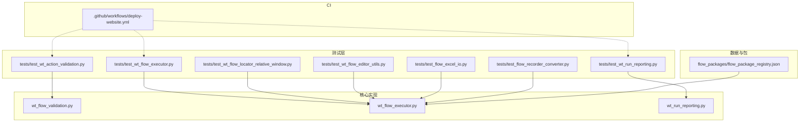
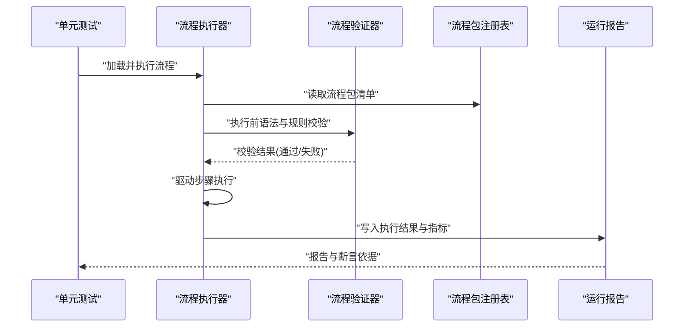
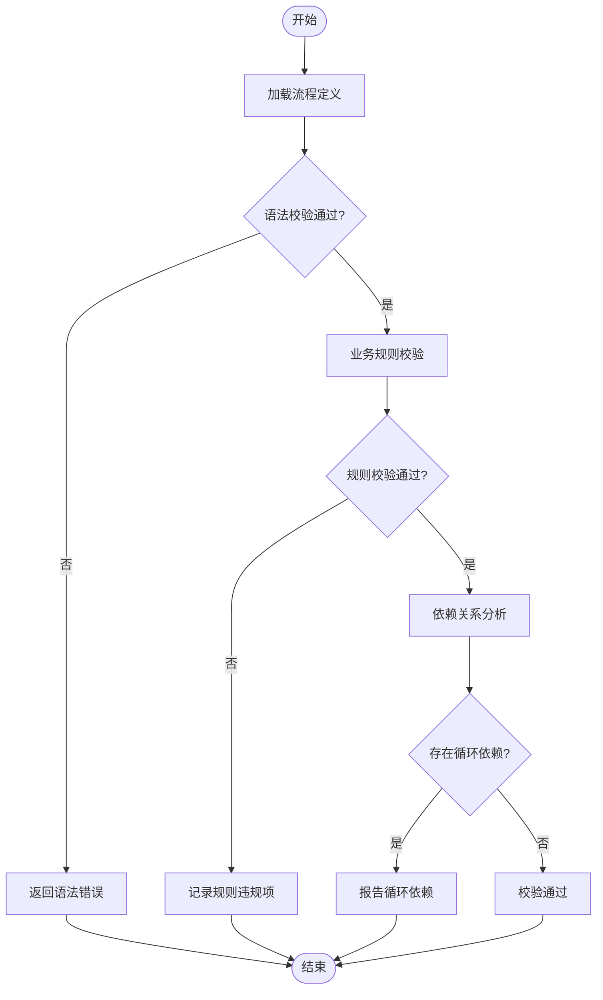
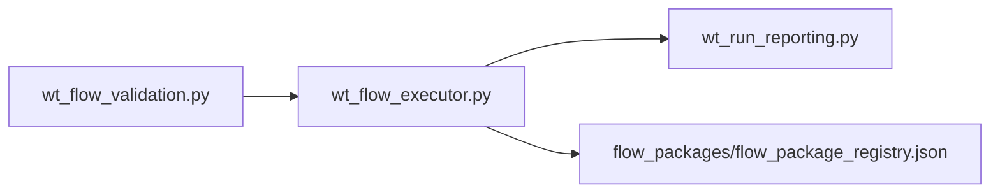

# 流程测试与验证

<cite>
**本文引用的文件**   
- [README.md](file://README.md)
- [PROJECT_ARCHITECTURE.md](file://PROJECT_ARCHITECTURE.md)
- [tests/test_wt_flow_executor.py](file://tests/test_wt_flow_executor.py)
- [tests/test_wt_action_validation.py](file://tests/test_wt_action_validation.py)
- [tests/test_wt_run_reporting.py](file://tests/test_wt_run_reporting.py)
- [tests/test_wt_flow_locator_relative_window.py](file://tests/test_wt_flow_locator_relative_window.py)
- [tests/test_wt_flow_editor_utils.py](file://tests/test_wt_flow_editor_utils.py)
- [tests/test_image_matcher_multiscale.py](file://tests/test_image匹配器多尺度.py)
- [tests/test_self_healing_locator.py](file://tests/test_self_healing_locator.py)
- [tests/test_ui_path_selector.py](file://tests/test_ui_path_selector.py)
- [tests/test_flow_excel_io.py](file://tests/test_flow_excel_io.py)
- [tests/test_flow_recorder_converter.py](file://tests/test_flow_recorder_converter.py)
- [wt_flow_validation.py](file://wt_flow_validation.py)
- [wt_flow_executor.py](file://wt_flow_executor.py)
- [wt_run_reporting.py](file://wt_run_reporting.py)
- [flow_packages/flow_package_registry.json](file://flow_packages/flow_package_registry.json)
- [.github/workflows/deploy-website.yml](file://.github/workflows/deploy-website.yml)
</cite>

## 目录
1. [简介](#简介)
2. [项目结构](#项目结构)
3. [核心组件](#核心组件)
4. [架构总览](#架构总览)
5. [详细组件分析](#详细组件分析)
6. [依赖关系分析](#依赖关系分析)
7. [性能考虑](#性能考虑)
8. [故障排查指南](#故障排查指南)
9. [结论](#结论)
10. [附录](#附录)

## 简介
本文件面向“流程测试与验证”主题，围绕单元测试编写规范、集成测试环境搭建与数据准备、流程验证器的使用（语法检查、业务规则验证、依赖关系分析）、性能测试方法与指标监控、自动化流水线配置与持续集成方案、测试报告生成与结果分析方法，以及调试工具与故障诊断技巧进行系统化说明。文档以仓库中现有测试与验证相关代码为依据，结合工程化实践给出可操作的建议与图示。

## 项目结构
本项目在顶层包含多个与测试和验证相关的目录与文件：
- tests：Python 单元测试集合，覆盖执行器、动作校验、定位器、报告等模块
- flow_packages：流程包定义与注册表，用于集成测试的数据来源
- wt_flow_validation.py / wt_flow_executor.py / wt_run_reporting.py：流程验证、执行与报告的核心实现
- .github/workflows：CI 工作流示例（网站部署）
- README.md / PROJECT_ARCHITECTURE.md：项目概览与架构说明

图表来源
- [tests/test_wt_flow_executor.py](file://tests/test_wt_flow_executor.py)
- [tests/test_wt_action_validation.py](file://tests/test_wt_action_validation.py)
- [tests/test_wt_run_reporting.py](file://tests/test_wt_run_reporting.py)
- [tests/test_wt_flow_locator_relative_window.py](file://tests/test_wt_flow_locator_relative_window.py)
- [tests/test_wt_flow_editor_utils.py](file://tests/test_wt_flow_editor_utils.py)
- [tests/test_flow_excel_io.py](file://tests/test_flow_excel_io.py)
- [tests/test_flow_recorder_converter.py](file://tests/test_flow_recorder_converter.py)
- [wt_flow_validation.py](file://wt_flow_validation.py)
- [wt_flow_executor.py](file://wt_flow_executor.py)
- [wt_run_reporting.py](file://wt_run_reporting.py)
- [flow_packages/flow_package_registry.json](file://flow_packages/flow_package_registry.json)
- [.github/workflows/deploy-website.yml](file://.github/workflows/deploy-website.yml)

章节来源
- [README.md](file://README.md)
- [PROJECT_ARCHITECTURE.md](file://PROJECT_ARCHITECTURE.md)

## 核心组件
- 流程验证器（wt_flow_validation.py）：负责流程定义的语法检查、业务规则校验与依赖关系分析，为执行前提供质量门禁。
- 流程执行器（wt_flow_executor.py）：加载流程包、解析步骤、驱动 UI 或外部系统执行，并产出运行日志与中间状态。
- 运行报告（wt_run_reporting.py）：汇总执行结果、统计指标与错误信息，输出结构化报告供后续分析与可视化。
- 测试套件（tests/*）：针对上述核心组件的单元与集成测试，覆盖执行路径、定位策略、Excel I/O、录制转换等场景。

章节来源
- [wt_flow_validation.py](file://wt_flow_validation.py)
- [wt_flow_executor.py](file://wt_flow_executor.py)
- [wt_run_reporting.py](file://wt_run_reporting.py)
- [tests/test_wt_flow_executor.py](file://tests/test_wt_flow_executor.py)
- [tests/test_wt_action_validation.py](file://tests/test_wt_action_validation.py)
- [tests/test_wt_run_reporting.py](file://tests/test_wt_run_reporting.py)

## 架构总览
下图展示了从测试到核心实现的调用关系与数据流向，体现“用例驱动—执行—验证—报告”的闭环。

图表来源
- [wt_flow_executor.py](file://wt_flow_executor.py)
- [wt_flow_validation.py](file://wt_flow_validation.py)
- [wt_run_reporting.py](file://wt_run_reporting.py)
- [flow_packages/flow_package_registry.json](file://flow_packages/flow_package_registry.json)

## 详细组件分析

### 单元测试编写规范与实践
- 用例设计原则
  - 单一职责：每个测试聚焦一个行为或边界条件，避免耦合过多上下文。
  - 输入-期望输出：明确输入数据、预期结果与失败分支。
  - 可重复性：不依赖不稳定外部状态；必要时使用隔离与模拟。
- 模拟数据与夹具
  - 使用最小可用数据集，确保稳定且易于维护。
  - 将共享数据集中管理，便于复用与版本控制。
- 断言方法
  - 对返回值、异常类型与消息、副作用（如文件写入、日志输出）进行断言。
  - 对时间敏感逻辑采用容差断言或固定时钟。
- 参考实现位置
  - 执行器测试：[tests/test_wt_flow_executor.py](file://tests/test_wt_flow_executor.py)
  - 动作校验测试：[tests/test_wt_action_validation.py](file://tests/test_wt_action_validation.py)
  - 报告测试：[tests/test_wt_run_reporting.py](file://tests/test_wt_run_reporting.py)
  - 定位器与编辑器工具测试：[tests/test_wt_flow_locator_relative_window.py](file://tests/test_wt_flow_locator_relative_window.py)、[tests/test_wt_flow_editor_utils.py](file://tests/test_wt_flow_editor_utils.py)
  - Excel I/O 与录制转换器测试：[tests/test_flow_excel_io.py](file://tests/test_flow_excel_io.py)、[tests/test_flow_recorder_converter.py](file://tests/test_flow_recorder_converter.py)

章节来源
- [tests/test_wt_flow_executor.py](file://tests/test_wt_flow_executor.py)
- [tests/test_wt_action_validation.py](file://tests/test_wt_action_validation.py)
- [tests/test_wt_run_reporting.py](file://tests/test_wt_run_reporting.py)
- [tests/test_wt_flow_locator_relative_window.py](file://tests/test_wt_flow_locator_relative_window.py)
- [tests/test_wt_flow_editor_utils.py](file://tests/test_wt_flow_editor_utils.py)
- [tests/test_flow_excel_io.py](file://tests/test_flow_excel_io.py)
- [tests/test_flow_recorder_converter.py](file://tests/test_flow_recorder_converter.py)

### 集成测试环境与数据准备
- 执行环境
  - 建议在同一机器上安装被测应用与依赖库，保证 UI 交互与外部系统可达。
  - 使用独立用户会话与干净的工作目录，避免历史状态干扰。
- 测试数据
  - 使用 flow_packages 中的流程包与注册表作为标准输入源，确保流程定义一致性与可复现性。
  - 对于需要外部数据的步骤，准备最小样例集并置于受控路径。
- 参考位置
  - 流程包注册表：[flow_packages/flow_package_registry.json](file://flow_packages/flow_package_registry.json)
  - 执行器集成点：[wt_flow_executor.py](file://wt_flow_executor.py)

章节来源
- [flow_packages/flow_package_registry.json](file://flow_packages/flow_package_registry.json)
- [wt_flow_executor.py](file://wt_flow_executor.py)

### 流程验证器使用指南
- 语法检查
  - 校验流程 JSON 的结构完整性、必填字段与类型约束。
- 业务规则验证
  - 校验步骤间的依赖关系、参数取值范围与互斥规则。
- 依赖关系分析
  - 构建步骤间有向图，检测环路与不可达节点，辅助定位问题步骤。
- 参考实现位置
  - 验证器实现：[wt_flow_validation.py](file://wt_flow_validation.py)
  - 验证相关测试：[tests/test_wt_action_validation.py](file://tests/test_wt_action_validation.py)

图表来源
- [wt_flow_validation.py](file://wt_flow_validation.py)
- [tests/test_wt_action_validation.py](file://tests/test_wt_action_validation.py)

章节来源
- [wt_flow_validation.py](file://wt_flow_validation.py)
- [tests/test_wt_action_validation.py](file://tests/test_wt_action_validation.py)

### 性能测试方法与指标监控
- 指标定义
  - 端到端耗时：从流程启动到完成的时间。
  - 单步耗时：各步骤的执行时长分布。
  - 资源占用：CPU、内存峰值与趋势。
- 采集方式
  - 在执行器关键路径埋点，记录时间戳与上下文。
  - 利用报告模块聚合指标，输出结构化结果。
- 参考实现位置
  - 执行器：[wt_flow_executor.py](file://wt_flow_executor.py)
  - 报告模块：[wt_run_reporting.py](file://wt_run_reporting.py)

章节来源
- [wt_flow_executor.py](file://wt_flow_executor.py)
- [wt_run_reporting.py](file://wt_run_reporting.py)

### 自动化测试流水线与持续集成
- 流水线要点
  - 安装依赖、准备测试数据、并行执行测试、收集报告、归档产物。
  - 失败快速反馈，保留日志与截图以便复现。
- 参考工作流
  - GitHub Actions 示例（网站部署）：[.github/workflows/deploy-website.yml](file://.github/workflows/deploy-website.yml)
  - 可将测试执行任务嵌入同一或独立工作流，按需触发。

章节来源
- [.github/workflows/deploy-website.yml](file://.github/workflows/deploy-website.yml)

### 测试报告生成与结果分析
- 报告内容
  - 用例通过率、失败详情、耗时统计、错误堆栈与上下文快照。
- 生成与消费
  - 由报告模块统一输出，供 CI 展示与人工复盘。
- 参考实现位置
  - 报告模块：[wt_run_reporting.py](file://wt_run_reporting.py)
  - 报告相关测试：[tests/test_wt_run_reporting.py](file://tests/test_wt_run_reporting.py)

章节来源
- [wt_run_reporting.py](file://wt_run_reporting.py)
- [tests/test_wt_run_reporting.py](file://tests/test_wt_run_reporting.py)

### 调试工具与故障诊断技巧
- 常用技巧
  - 缩小复现场景：剥离无关步骤，构造最小可复现用例。
  - 增加上下文日志：在关键分支打印必要状态与输入摘要。
  - 截图与窗口信息：捕获界面快照与控件树，辅助定位 UI 差异。
- 参考实现位置
  - 执行器与定位器相关测试：[tests/test_wt_flow_executor.py](file://tests/test_wt_flow_executor.py)、[tests/test_wt_flow_locator_relative_window.py](file://tests/test_wt_flow_locator_relative_window.py)
  - 图像匹配与自修复定位测试：[tests/test_image_matcher_multiscale.py](file://tests/test_image匹配器多尺度.py)、[tests/test_self_healing_locator.py](file://tests/test_self_healing_locator.py)
  - UI 路径选择器测试：[tests/test_ui_path_selector.py](file://tests/test_ui_path_selector.py)

章节来源
- [tests/test_wt_flow_executor.py](file://tests/test_wt_flow_executor.py)
- [tests/test_wt_flow_locator_relative_window.py](file://tests/test_wt_flow_locator_relative_window.py)
- [tests/test_image_matcher_multiscale.py](file://tests/test_image匹配器多尺度.py)
- [tests/test_self_healing_locator.py](file://tests/test_self_healing_locator.py)
- [tests/test_ui_path_selector.py](file://tests/test_ui_path_selector.py)

## 依赖关系分析
- 组件内聚与耦合
  - 验证器与执行器解耦：验证器仅关注静态属性与规则，执行器专注运行时行为。
  - 报告模块作为横切关注点，被执行器调用以持久化结果。
- 外部依赖
  - 流程包注册表提供流程清单，执行器据此加载具体流程。
- 依赖图

图表来源
- [wt_flow_validation.py](file://wt_flow_validation.py)
- [wt_flow_executor.py](file://wt_flow_executor.py)
- [wt_run_reporting.py](file://wt_run_reporting.py)
- [flow_packages/flow_package_registry.json](file://flow_packages/flow_package_registry.json)

章节来源
- [wt_flow_validation.py](file://wt_flow_validation.py)
- [wt_flow_executor.py](file://wt_flow_executor.py)
- [wt_run_reporting.py](file://wt_run_reporting.py)
- [flow_packages/flow_package_registry.json](file://flow_packages/flow_package_registry.json)

## 性能考虑
- 减少不必要的 UI 交互：优先批量操作与缓存命中。
- 合理设置超时与重试：避免长尾等待影响整体吞吐。
- 分阶段执行：将大流程拆分为子流程，降低单次执行压力。
- 指标采样：仅在关键路径采样，避免过度埋点导致额外开销。

## 故障排查指南
- 常见问题定位
  - 流程定义错误：优先查看验证器输出的语法与规则错误。
  - 执行失败：结合执行器日志与报告中的步骤级错误堆栈。
  - UI 定位漂移：使用相对定位与图像匹配组合策略，辅以截图对比。
- 建议步骤
  - 启用更详细的日志级别。
  - 固定时间与分辨率，减少环境抖动。
  - 使用最小数据集复现问题，逐步扩大范围。

## 结论
通过完善的单元测试、严谨的流程验证器、稳定的执行与报告机制，以及可复用的集成测试数据与流水线，本项目形成了“可测、可验、可观测”的闭环体系。建议在后续迭代中持续完善性能基线与回归阈值，强化报告可视化与告警能力，进一步提升交付质量与效率。

## 附录
- 术语
  - 流程包：一组流程定义及其元数据的集合。
  - 流程验证器：对流程定义进行静态检查与规则校验的工具。
  - 执行器：驱动流程运行的核心组件。
  - 报告模块：汇总执行结果与指标的组件。