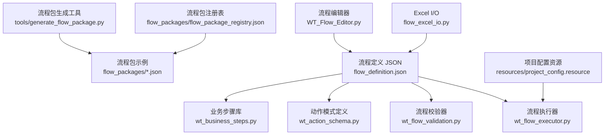
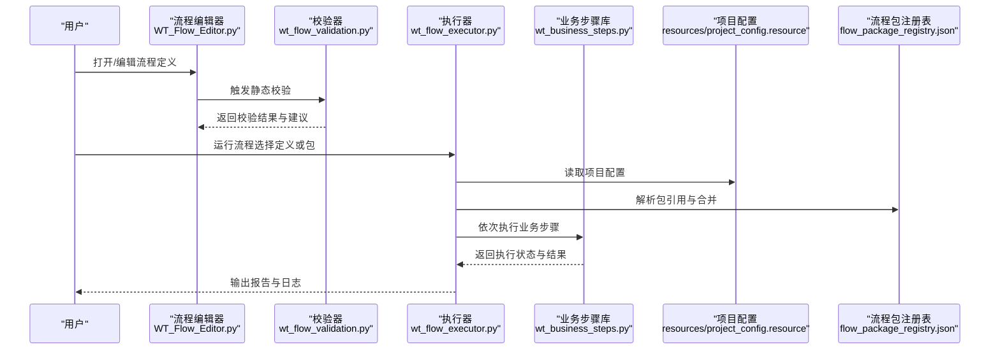
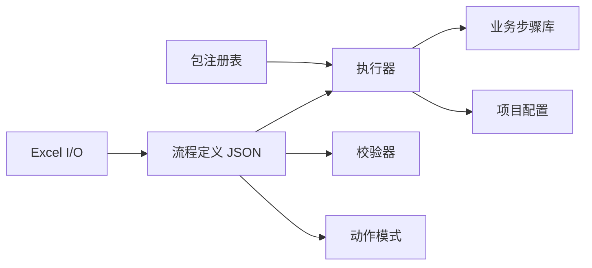

# 流程管理

<cite>
**本文引用的文件**   
- [README.md](file://README.md)
- [PROJECT_ARCHITECTURE.md](file://PROJECT_ARCHITECTURE.md)
- [flow_definition.json](file://flow_definition.json)
- [wt_flow_executor.py](file://wt_flow_executor.py)
- [wt_flow_validation.py](file://wt_flow_validation.py)
- [wt_action_schema.py](file://wt_action_schema.py)
- [wt_business_steps.py](file://wt_business_steps.py)
- [flow_excel_io.py](file://flow_excel_io.py)
- [test_flow_excel_io.py](file://tests/test_flow_excel_io.py)
- [flow_packages/flow_package_registry.json](file://flow_packages/flow_package_registry.json)
- [flow_packages/flow_definition_创建一个新建模.json](file://flow_packages/flow_definition_创建一个新建模.json)
- [flow_packages/flow_definition_geo_import_data_file.json](file://flow_packages/flow_definition_geo_import_data_file.json)
- [samples/flows/flow_definition_gm_sample.json](file://samples/flows/flow_definition_gm_sample.json)
- [tools/generate_flow_package.py](file://tools/generate_flow_package.py)
- [WT_Flow_Editor.py](file://WT_Flow_Editor.py)
- [resources/project_config.resource](file://resources/project_config.resource)
</cite>

## 目录
1. [简介](#简介)
2. [项目结构](#项目结构)
3. [核心组件](#核心组件)
4. [架构总览](#架构总览)
5. [详细组件分析](#详细组件分析)
6. [依赖关系分析](#依赖关系分析)
7. [性能考虑](#性能考虑)
8. [故障排查指南](#故障排查指南)
9. [结论](#结论)
10. [附录](#附录)

## 简介
本章节面向WT自动化框架的流程管理系统，聚焦于“流程定义、执行与验证、包管理与复用、Excel导入导出、版本与变更控制、测试与调试、性能优化”等主题。文档以仓库现有实现为依据，提供从高层架构到代码级细节的系统化说明，帮助读者快速理解并高效使用流程能力。

## 项目结构
WT自动化框架围绕“流程定义（JSON）+ 执行器 + 校验器 + Excel I/O + 包注册表 + 编辑器”组织。关键目录与文件：
- flow_definition.json：根级流程定义示例
- wt_flow_executor.py：流程执行引擎
- wt_flow_validation.py：流程定义校验与诊断
- wt_action_schema.py：动作（步骤）数据模型与约束
- wt_business_steps.py：业务步骤库
- flow_excel_io.py：流程与Excel互转工具
- tests/test_flow_excel_io.py：Excel I/O 用例
- flow_packages/*：流程包与注册表
- tools/generate_flow_package.py：流程包生成工具
- WT_Flow_Editor.py：流程编辑器入口
- resources/project_config.resource：项目配置资源

图示来源
- [flow_definition.json](file://flow_definition.json)
- [wt_flow_executor.py](file://wt_flow_executor.py)
- [wt_flow_validation.py](file://wt_flow_validation.py)
- [wt_action_schema.py](file://wt_action_schema.py)
- [wt_business_steps.py](file://wt_business_steps.py)
- [flow_excel_io.py](file://flow_excel_io.py)
- [flow_packages/flow_package_registry.json](file://flow_packages/flow_package_registry.json)
- [flow_packages/flow_definition_创建一个新建模.json](file://flow_packages/flow_definition_创建一个新建模.json)
- [tools/generate_flow_package.py](file://tools/generate_flow_package.py)
- [WT_Flow_Editor.py](file://WT_Flow_Editor.py)
- [resources/project_config.resource](file://resources/project_config.resource)

章节来源
- [README.md](file://README.md)
- [PROJECT_ARCHITECTURE.md](file://PROJECT_ARCHITECTURE.md)

## 核心组件
- 流程定义与模式
  - 流程定义采用JSON描述，包含元信息、参数、步骤序列、条件分支等。
  - 动作（步骤）遵循统一的数据模式，由模式定义进行约束与提示。
- 执行器
  - 负责加载流程定义、解析参数、按序执行步骤、处理异常与结果上报。
- 校验器
  - 在运行前对流程定义进行静态检查，包括必填字段、类型、引用有效性等。
- 业务步骤库
  - 封装领域相关操作，供流程步骤调用。
- Excel I/O
  - 将流程定义与Excel表格双向转换，支持批量处理与迁移。
- 流程包与注册表
  - 将常用流程打包为可复用模块，并通过注册表集中管理。
- 编辑器
  - 提供可视化编辑与调试能力，辅助创建与维护流程。

章节来源
- [wt_flow_executor.py](file://wt_flow_executor.py)
- [wt_flow_validation.py](file://wt_flow_validation.py)
- [wt_action_schema.py](file://wt_action_schema.py)
- [wt_business_steps.py](file://wt_business_steps.py)
- [flow_excel_io.py](file://flow_excel_io.py)
- [flow_packages/flow_package_registry.json](file://flow_packages/flow_package_registry.json)
- [WT_Flow_Editor.py](file://WT_Flow_Editor.py)

## 架构总览
下图展示了流程从定义到执行的端到端路径，以及校验、Excel转换、包管理与编辑器的协作关系。

图示来源
- [WT_Flow_Editor.py](file://WT_Flow_Editor.py)
- [wt_flow_validation.py](file://wt_flow_validation.py)
- [wt_flow_executor.py](file://wt_flow_executor.py)
- [wt_business_steps.py](file://wt_business_steps.py)
- [resources/project_config.resource](file://resources/project_config.resource)
- [flow_packages/flow_package_registry.json](file://flow_packages/flow_package_registry.json)

## 详细组件分析

### 流程定义结构与语法规则
- 基本结构
  - 流程定义通常包含元信息（名称、版本、描述）、参数列表、步骤集合、可选的条件分支与上下文变量。
  - 每个步骤对应一个动作，动作由模式定义约束其键名、类型与取值范围。
- 步骤定义
  - 通过动作标识与参数映射到具体业务步骤。
  - 参数支持基础类型、数组、对象等复合结构，具体以模式定义为准。
- 参数配置
  - 可在流程级别声明参数，并在步骤中引用；也支持默认值与必填标记。
- 条件分支
  - 基于上下文变量或上一步结果进行分支判断，驱动不同执行路径。
- 参考样例
  - 根级流程定义示例：[flow_definition.json](file://flow_definition.json)
  - 包内流程示例：[flow_definition_创建一个新建模.json](file://flow_packages/flow_definition_创建一个新建模.json)、[flow_definition_geo_import_data_file.json](file://flow_packages/flow_definition_geo_import_data_file.json)
  - 样本流程：[flow_definition_gm_sample.json](file://samples/flows/flow_definition_gm_sample.json)

章节来源
- [flow_definition.json](file://flow_definition.json)
- [flow_packages/flow_definition_创建一个新建模.json](file://flow_packages/flow_definition_创建一个新建模.json)
- [flow_packages/flow_definition_geo_import_data_file.json](file://flow_packages/flow_definition_geo_import_data_file.json)
- [samples/flows/flow_definition_gm_sample.json](file://samples/flows/flow_definition_gm_sample.json)
- [wt_action_schema.py](file://wt_action_schema.py)

### 流程包的组织和复用机制
- 包组织
  - 流程包是一组相关的流程定义与资源的集合，便于跨项目复用。
  - 包清单与注册表用于发现、索引与按需加载。
- 注册表
  - 通过注册表集中维护包的元信息与可用流程，支持版本与依赖声明。
- 生成工具
  - 提供脚本自动生成流程包骨架与清单，提升一致性。
- 最佳实践
  - 将通用流程抽象为包，避免重复定义；通过注册表统一管理版本与发布。

章节来源
- [flow_packages/flow_package_registry.json](file://flow_packages/flow_package_registry.json)
- [tools/generate_flow_package.py](file://tools/generate_flow_package.py)

### Excel导入导出功能
- 功能概述
  - 将流程定义转换为Excel工作表，或将Excel内容转换为流程定义，支持批量处理与迁移。
  - 适用于大规模流程的批量修改、模板化与归档。
- 典型用法
  - 导出：从JSON流程定义生成Excel，便于非技术人员审阅与批注。
  - 导入：从Excel回填流程定义，自动完成字段映射与校验。
- 测试覆盖
  - 单元测试覆盖常见场景与边界情况，确保往返一致性与健壮性。

章节来源
- [flow_excel_io.py](file://flow_excel_io.py)
- [tests/test_flow_excel_io.py](file://tests/test_flow_excel_io.py)

### 版本管理和变更控制
- 版本策略
  - 流程定义与包均建议引入版本号，配合注册表记录变更历史与兼容性。
- 变更控制
  - 通过注册表锁定稳定版本，灰度升级新流程；结合校验器在提交前拦截不兼容变更。
- 回滚策略
  - 保留历史版本定义与快照，必要时快速回退。

章节来源
- [flow_packages/flow_package_registry.json](file://flow_packages/flow_package_registry.json)
- [wt_flow_validation.py](file://wt_flow_validation.py)

### 流程设计的最佳实践和规范指南
- 命名规范
  - 流程、步骤、参数命名清晰且具语义，避免歧义。
- 模块化
  - 将通用逻辑下沉为包与步骤库，减少重复。
- 参数化
  - 尽量使用参数而非硬编码，提高可移植性。
- 错误处理
  - 明确失败路径与重试策略，保证可观测性。
- 文档化
  - 为复杂流程补充说明与示例，降低维护成本。

章节来源
- [wt_action_schema.py](file://wt_action_schema.py)
- [wt_business_steps.py](file://wt_business_steps.py)

### 实际流程定义示例与复杂场景
- 简单示例
  - 根级流程定义可作为最小可用示例，展示参数与步骤的基本组合。
- 复杂场景
  - 多步骤串联、条件分支、循环与批量处理可通过步骤库与参数组合实现。
  - 通过包管理将复杂流程拆分为子流程，提升可读性与复用性。

章节来源
- [flow_definition.json](file://flow_definition.json)
- [flow_packages/flow_definition_创建一个新建模.json](file://flow_packages/flow_definition_创建一个新建模.json)
- [flow_packages/flow_definition_geo_import_data_file.json](file://flow_packages/flow_definition_geo_import_data_file.json)
- [samples/flows/flow_definition_gm_sample.json](file://samples/flows/flow_definition_gm_sample.json)

### 流程的测试和验证工具
- 静态校验
  - 在运行前对流程定义进行结构、类型与引用校验，尽早发现问题。
- 单元测试
  - 针对Excel I/O、执行器与业务步骤编写用例，保障稳定性。
- 回归测试
  - 将关键流程纳入持续集成，防止破坏性变更。

章节来源
- [wt_flow_validation.py](file://wt_flow_validation.py)
- [tests/test_flow_excel_io.py](file://tests/test_flow_excel_io.py)

### 性能优化和调试技巧
- 性能优化
  - 减少不必要的I/O与网络请求；合理缓存中间结果；并行执行无依赖步骤。
- 调试技巧
  - 启用详细日志；分步执行定位问题；利用编辑器进行断点与变量查看。
- 监控与报告
  - 收集执行指标与错误堆栈，形成可追踪的报告。

章节来源
- [wt_flow_executor.py](file://wt_flow_executor.py)
- [WT_Flow_Editor.py](file://WT_Flow_Editor.py)

## 依赖关系分析
- 内部依赖
  - 执行器依赖校验器、业务步骤库与项目配置；Excel I/O依赖流程定义与模式定义。
- 外部依赖
  - Excel读写、UI自动化与图像匹配等由上层运行时环境提供。
- 潜在风险
  - 注意避免循环依赖；保持模式定义与业务步骤同步演进。

图示来源
- [wt_flow_executor.py](file://wt_flow_executor.py)
- [wt_flow_validation.py](file://wt_flow_validation.py)
- [wt_action_schema.py](file://wt_action_schema.py)
- [wt_business_steps.py](file://wt_business_steps.py)
- [flow_excel_io.py](file://flow_excel_io.py)
- [flow_packages/flow_package_registry.json](file://flow_packages/flow_package_registry.json)
- [resources/project_config.resource](file://resources/project_config.resource)

章节来源
- [wt_flow_executor.py](file://wt_flow_executor.py)
- [wt_flow_validation.py](file://wt_flow_validation.py)
- [wt_action_schema.py](file://wt_action_schema.py)
- [wt_business_steps.py](file://wt_business_steps.py)
- [flow_excel_io.py](file://flow_excel_io.py)
- [flow_packages/flow_package_registry.json](file://flow_packages/flow_package_registry.json)
- [resources/project_config.resource](file://resources/project_config.resource)

## 性能考虑
- 执行路径优化
  - 将长流程拆分为短流程与子流程，减少单次执行复杂度。
- 资源复用
  - 复用会话与连接，避免频繁初始化。
- 并发与批处理
  - 对独立任务进行并发执行；对大批量数据进行分批处理。
- 监控与告警
  - 建立关键指标看板，及时识别瓶颈与异常。

## 故障排查指南
- 常见问题
  - 流程定义格式错误：优先使用校验器定位问题。
  - 参数缺失或类型不符：核对模式定义与传入参数。
  - 步骤执行失败：查看执行日志与业务步骤返回值。
- 定位方法
  - 逐步执行缩小范围；启用更详细的日志；对比正常与异常流程差异。
- 恢复策略
  - 回滚至上一稳定版本；修复后重新校验与回归测试。

章节来源
- [wt_flow_validation.py](file://wt_flow_validation.py)
- [wt_flow_executor.py](file://wt_flow_executor.py)

## 结论
WT自动化框架的流程管理系统以JSON流程定义为核心，配合执行器、校验器、Excel I/O、包管理与编辑器，形成了从设计、验证、执行到复用的完整闭环。遵循本文档的结构与规范，可显著提升流程的可维护性、可复用性与可观测性。

## 附录
- 术语
  - 流程定义：描述业务流程的JSON文件。
  - 动作（步骤）：流程中的最小执行单元。
  - 流程包：一组流程与资源的集合，便于复用。
- 参考文件
  - 根级流程定义：[flow_definition.json](file://flow_definition.json)
  - 包注册表：[flow_package_registry.json](file://flow_packages/flow_package_registry.json)
  - 动作模式：[wt_action_schema.py](file://wt_action_schema.py)
  - 执行器：[wt_flow_executor.py](file://wt_flow_executor.py)
  - 校验器：[wt_flow_validation.py](file://wt_flow_validation.py)
  - Excel I/O：[flow_excel_io.py](file://flow_excel_io.py)
  - 包生成工具：[generate_flow_package.py](file://tools/generate_flow_package.py)
  - 编辑器：[WT_Flow_Editor.py](file://WT_Flow_Editor.py)
  - 项目配置：[project_config.resource](file://resources/project_config.resource)