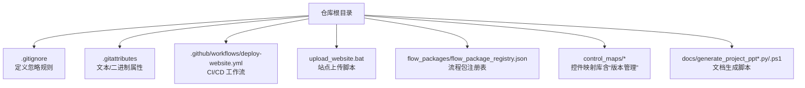
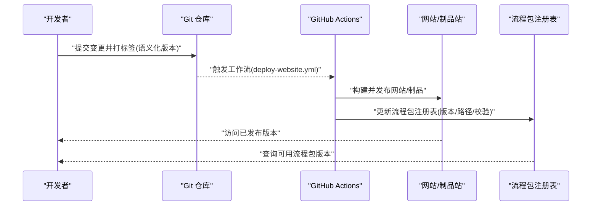
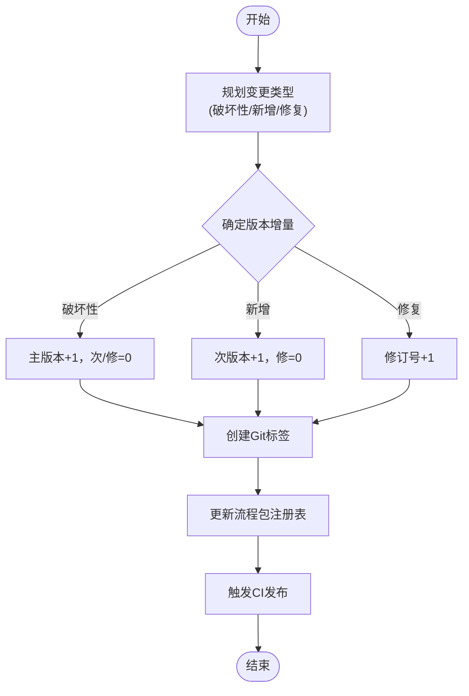
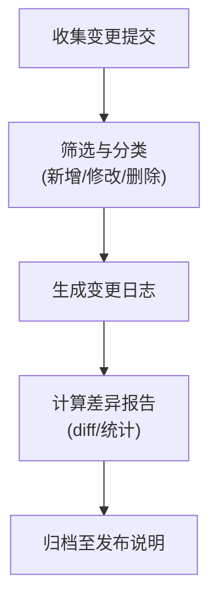
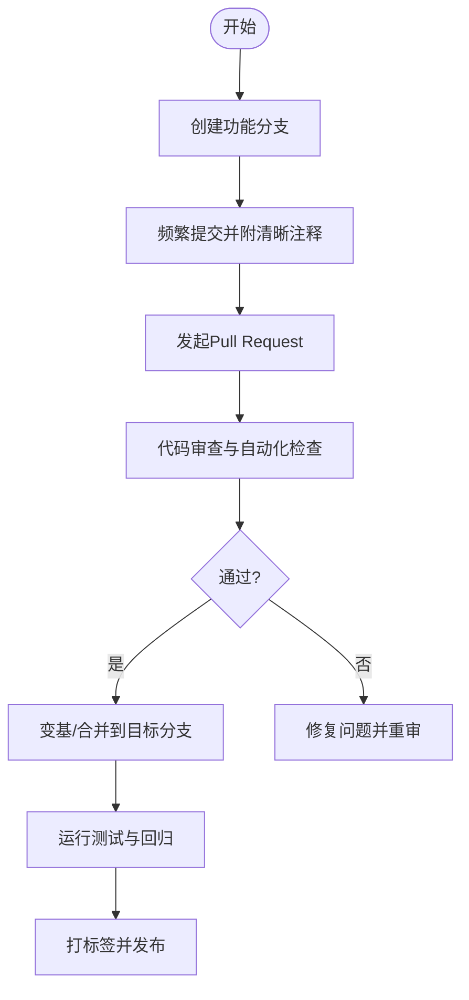
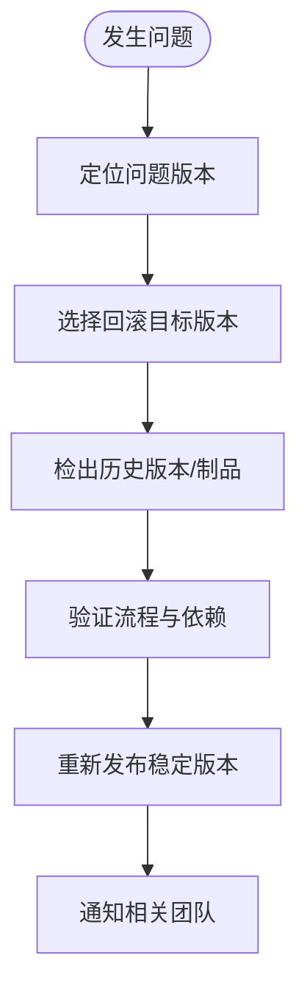
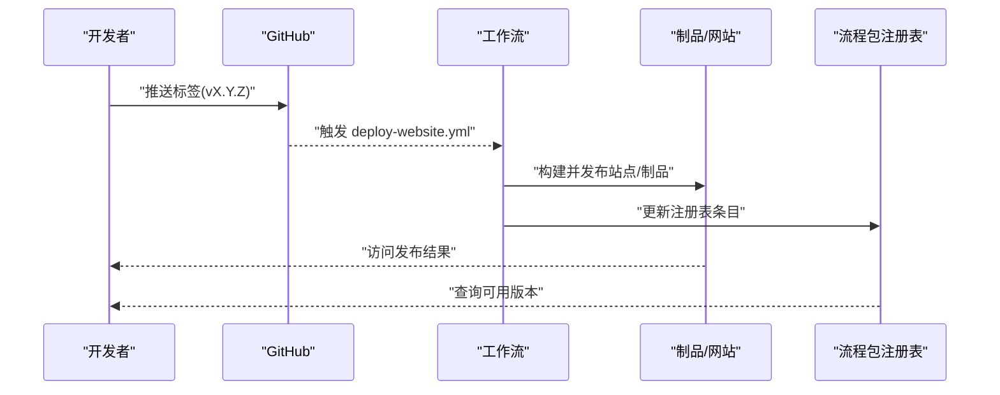
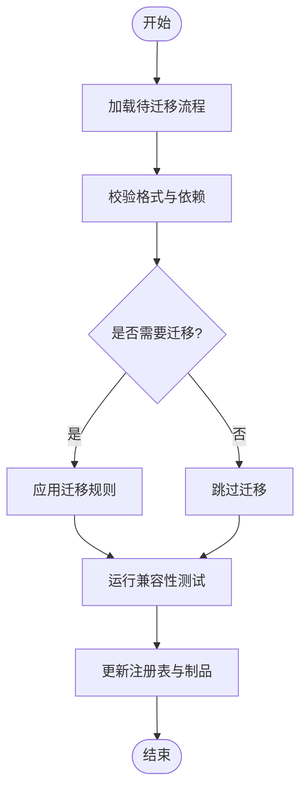
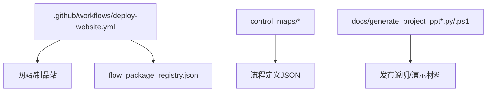

# 版本控制

<cite>
**本文引用的文件**   
- [README.md](file://README.md)
- [PROJECT_ARCHITECTURE.md](file://PROJECT_ARCHITECTURE.md)
- [.gitignore](file://.gitignore)
- [.gitattributes](file://.gitattributes)
- [deploy-website.yml](file://.github/workflows/deploy-website.yml)
- [upload_website.bat](file://upload_website.bat)
- [flow_package_registry.json](file://flow_packages/flow_package_registry.json)
- [library_版本管理_WPF_controls.json](file://control_maps/library_版本管理_WPF_controls.json)
- [20260715_214310_创建一个新建模2window_control_map.json](file://control_maps/20260715_214310_创建一个新建模2window_control_map.json)
- [generate_project_ppt.py](file://docs/generate_project_ppt.py)
- [generate_project_ppt_com.ps1](file://docs/generate_project_ppt_com.ps1)
</cite>

## 目录
1. [简介](#简介)
2. [项目结构](#项目结构)
3. [核心组件](#核心组件)
4. [架构总览](#架构总览)
5. [详细组件分析](#详细组件分析)
6. [依赖分析](#依赖分析)
7. [性能考虑](#性能考虑)
8. [故障排查指南](#故障排查指南)
9. [结论](#结论)
10. [附录](#附录)（如有需要）

## 简介
本文件面向WT自动化项目的流程版本管理与变更控制，目标是建立一套可追溯、可回滚、可审计的版本体系。内容涵盖：
- 版本号命名规范与语义化版本策略
- 变更跟踪与审计机制（变更日志、差异对比）
- 分支管理与合并冲突解决
- 版本回滚与恢复
- 团队协作最佳实践
- 自动化发布配置与部署流程
- 版本兼容性检查与迁移工具使用方法

## 项目结构
仓库采用“按功能域组织”的结构，与版本管理相关的要点包括：
- 根级Git元数据与忽略规则：.gitignore、.gitattributes
- 持续集成与网站发布工作流：.github/workflows/deploy-website.yml
- 一键上传脚本：upload_website.bat
- 流程包注册表：flow_packages/flow_package_registry.json（用于流程包的清单与索引）
- 控件库映射：control_maps/*（含“版本管理”相关控件映射，便于UI层对版本操作进行定位）
- 文档生成脚本：docs/generate_project_ppt.py、docs/generate_project_ppt_com.ps1（可用于生成包含版本信息的演示材料）

**图示来源**
- [.gitignore](file://.gitignore)
- [.gitattributes](file://.gitattributes)
- [deploy-website.yml](file://.github/workflows/deploy-website.yml)
- [upload_website.bat](file://upload_website.bat)
- [flow_package_registry.json](file://flow_packages/flow_package_registry.json)
- [library_版本管理_WPF_controls.json](file://control_maps/library_版本管理_WPF_controls.json)
- [generate_project_ppt.py](file://docs/generate_project_ppt.py)
- [generate_project_ppt_com.ps1](file://docs/generate_project_ppt_com.ps1)

**章节来源**
- [README.md](file://README.md)
- [PROJECT_ARCHITECTURE.md](file://PROJECT_ARCHITECTURE.md)
- [.gitignore](file://.gitignore)
- [.gitattributes](file://.gitattributes)
- [deploy-website.yml](file://.github/workflows/deploy-website.yml)
- [upload_website.bat](file://upload_website.bat)
- [flow_package_registry.json](file://flow_packages/flow_package_registry.json)
- [library_版本管理_WPF_controls.json](file://control_maps/library_版本管理_WPF_controls.json)
- [generate_project_ppt.py](file://docs/generate_project_ppt.py)
- [generate_project_ppt_com.ps1](file://docs/generate_project_ppt_com.ps1)

## 核心组件
围绕“流程版本管理”，本项目涉及以下关键要素：
- Git 元数据与忽略策略：通过 .gitignore 与 .gitattributes 统一忽略构建产物、临时文件，确保提交物干净且可重现。
- CI/CD 工作流：.github/workflows/deploy-website.yml 定义了网站发布的流水线，可作为流程制品发布的基础模板。
- 流程包注册表：flow_packages/flow_package_registry.json 作为流程包的索引与清单，支撑版本化的流程分发与发现。
- UI 控件映射：control_maps 中包含“版本管理”相关控件映射，为上层界面提供稳定的元素定位能力，降低因UI变化导致的执行不稳定。
- 文档生成脚本：docs 下的脚本可用于在发布前自动生成包含版本信息的演示材料，辅助发布评审与归档。

**章节来源**
- [.gitignore](file://.gitignore)
- [.gitattributes](file://.gitattributes)
- [deploy-website.yml](file://.github/workflows/deploy-website.yml)
- [flow_package_registry.json](file://flow_packages/flow_package_registry.json)
- [library_版本管理_WPF_controls.json](file://control_maps/library_版本管理_WPF_controls.json)
- [generate_project_ppt.py](file://docs/generate_project_ppt.py)
- [generate_project_ppt_com.ps1](file://docs/generate_project_ppt_com.ps1)

## 架构总览
下图展示了从代码提交到制品发布的端到端流程，以及流程包注册表在版本流转中的作用。

**图示来源**
- [deploy-website.yml](file://.github/workflows/deploy-website.yml)
- [flow_package_registry.json](file://flow_packages/flow_package_registry.json)

## 详细组件分析

### 版本号命名规范与语义化版本控制
- 建议采用语义化版本（主版本.次版本.修订号），例如：
  - 主版本：不兼容的API或流程定义变更
  - 次版本：向后兼容的功能新增
  - 修订号：向后兼容的问题修复
- 在Git中通过标签记录版本，如 v1.2.3；在流程包注册表中同步维护该版本的元信息（路径、摘要、校验值等）。
- 建议在发布前使用文档生成脚本输出包含版本号的演示材料，便于评审与归档。

[本节为概念性说明，无需源码引用]

### 变更跟踪与审计机制（变更日志与差异对比）
- 变更日志：建议在每次版本标签对应的提交区间内，汇总变更条目（新增、修改、删除、修复），并在发布说明中体现。
- 差异对比：利用Git diff查看具体文件的变更；对于流程定义JSON，建议关注关键字段的变化（如步骤、参数、依赖）。
- 审计要点：
  - 谁在何时提交了什么变更
  - 变更影响范围（哪些流程包受影响）
  - 是否更新了流程包注册表及制品位置

[本节为概念性说明，无需源码引用]

### 分支管理策略与合并冲突解决
- 推荐分支模型：
  - main/master：稳定发布基线
  - develop：集成开发分支
  - feature/*：功能分支
  - release/*：预发布分支
  - hotfix/*：紧急修复分支
- 合并冲突处理：
  - 优先在本地复现并拉取最新主干
  - 针对流程定义JSON，谨慎合并，必要时以测试用例验证
  - 合并后更新流程包注册表并触发CI验证

[本节为概念性说明，无需源码引用]

### 版本回滚与恢复机制
- 快速回滚：
  - 使用Git标签定位历史版本，检出对应提交
  - 重新发布该版本的制品
- 流程包恢复：
  - 从流程包注册表中回退到上一稳定版本的条目
  - 若制品不可用，从历史构建缓存或制品库恢复
- 注意事项：
  - 回滚需同步更新发布说明与通知
  - 对下游依赖方进行兼容性评估

[本节为概念性说明，无需源码引用]

### 团队协作中的版本控制最佳实践
- 提交规范：
  - 使用清晰的提交消息，描述变更动机与影响范围
  - 小步提交，避免大变更难以审查
- 分支协作：
  - 功能分支定期变基到主干，减少冲突
  - 合并前完成审查与自动化检查
- 发布纪律：
  - 仅允许在受保护分支上打标签
  - 发布说明必须包含变更摘要与兼容性提示

[本节为概念性说明，无需源码引用]

### 自动化版本发布的配置与部署流程
- GitHub Actions 工作流：
  - 基于 .github/workflows/deploy-website.yml 触发网站/制品发布
  - 可在其中扩展流程包构建、签名、上传与注册表更新步骤
- 本地发布脚本：
  - upload_website.bat 可用于快速上传站点资源，便于本地验证或临时发布

**图示来源**
- [deploy-website.yml](file://.github/workflows/deploy-website.yml)
- [upload_website.bat](file://upload_website.bat)
- [flow_package_registry.json](file://flow_packages/flow_package_registry.json)

**章节来源**
- [deploy-website.yml](file://.github/workflows/deploy-website.yml)
- [upload_website.bat](file://upload_website.bat)

### 版本兼容性检查与迁移工具使用方法
- 兼容性检查：
  - 在CI中加入流程定义校验步骤，确保新流程与现有环境兼容
  - 对流程包注册表进行一致性检查（路径存在、校验值匹配）
- 迁移工具：
  - 当流程定义格式演进时，提供迁移脚本将旧版流程转换为新版
  - 迁移完成后更新注册表并保留历史版本供回滚

[本节为概念性说明，无需源码引用]

## 依赖分析
- 外部依赖：
  - GitHub Actions 平台与仓库权限
  - 网站/制品存储（由工作流配置决定）
- 内部依赖：
  - 流程包注册表与流程定义JSON
  - 控件映射库（用于UI稳定性）
  - 文档生成脚本（用于发布材料）

**图示来源**
- [deploy-website.yml](file://.github/workflows/deploy-website.yml)
- [flow_package_registry.json](file://flow_packages/flow_package_registry.json)
- [library_版本管理_WPF_controls.json](file://control_maps/library_版本管理_WPF_controls.json)
- [generate_project_ppt.py](file://docs/generate_project_ppt.py)
- [generate_project_ppt_com.ps1](file://docs/generate_project_ppt_com.ps1)

**章节来源**
- [deploy-website.yml](file://.github/workflows/deploy-website.yml)
- [flow_package_registry.json](file://flow_packages/flow_package_registry.json)
- [library_版本管理_WPF_controls.json](file://control_maps/library_版本管理_WPF_controls.json)
- [generate_project_ppt.py](file://docs/generate_project_ppt.py)
- [generate_project_ppt_com.ps1](file://docs/generate_project_ppt_com.ps1)

## 性能考虑
- 大型流程定义的差异对比可能较慢，建议在CI中对差异范围进行裁剪（仅比较关键字段）
- 流程包注册表的读写应加锁或幂等更新，避免并发写入导致不一致
- 制品发布时启用压缩与缓存，提升下载与安装速度

[本节为通用指导，无需源码引用]

## 故障排查指南
- 常见问题：
  - 工作流未触发：检查标签推送事件与工作流触发条件
  - 制品缺失：确认构建产物路径与上传步骤
  - 注册表不一致：核对版本号与制品路径，必要时手动修正
- 调试手段：
  - 查看GitHub Actions运行日志
  - 使用本地脚本模拟发布流程
  - 对比历史版本注册表条目，定位异常点

**章节来源**
- [deploy-website.yml](file://.github/workflows/deploy-website.yml)
- [upload_website.bat](file://upload_website.bat)
- [flow_package_registry.json](file://flow_packages/flow_package_registry.json)

## 结论
通过统一的版本命名规范、严格的分支与合并策略、完善的变更审计与回滚机制，以及自动化的发布流水线，WT自动化项目能够实现对流程版本的高效管理与风险控制。配合流程包注册表与控件映射库，可进一步提升流程执行的稳定性与可维护性。

[本节为总结性内容，无需源码引用]

## 附录
- 参考文件：
  - README.md：项目概览与使用说明
  - PROJECT_ARCHITECTURE.md：架构设计与模块关系
  - .gitignore/.gitattributes：版本控制忽略与属性配置
  - control_maps/20260715_214310_创建一个新建模2window_control_map.json：示例控件映射文件（含时间戳命名，便于追踪）

**章节来源**
- [README.md](file://README.md)
- [PROJECT_ARCHITECTURE.md](file://PROJECT_ARCHITECTURE.md)
- [.gitignore](file://.gitignore)
- [.gitattributes](file://.gitattributes)
- [20260715_214310_创建一个新建模2window_control_map.json](file://control_maps/20260715_214310_创建一个新建模2window_control_map.json)