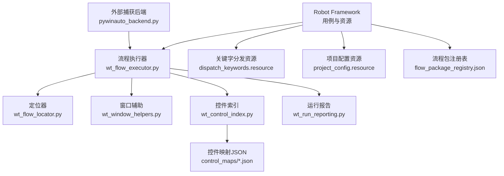
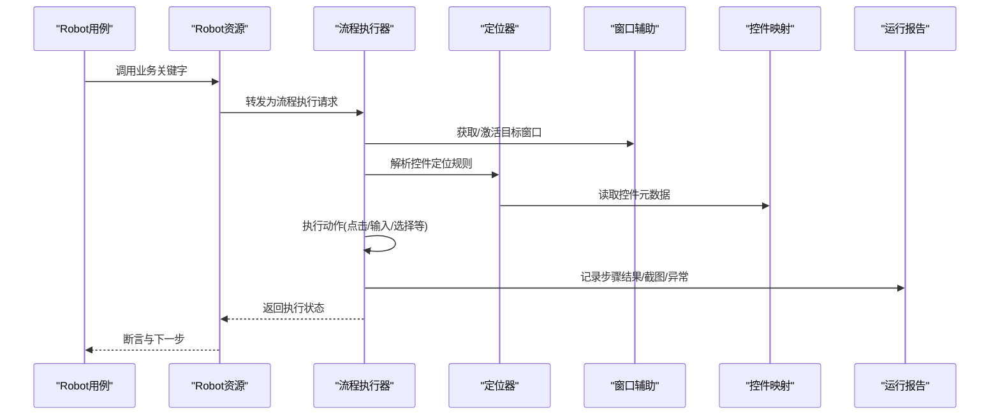
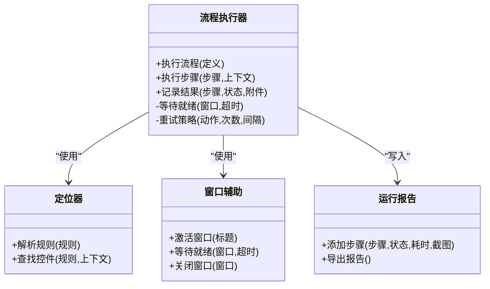
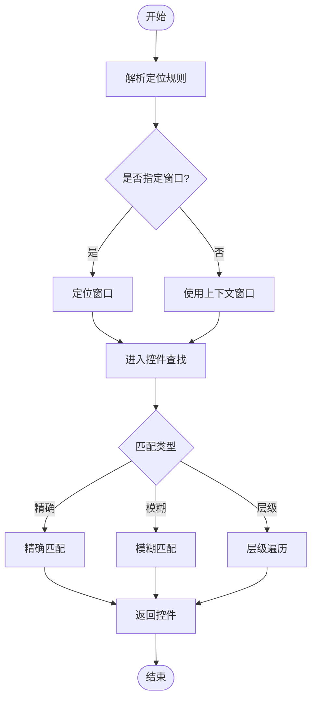
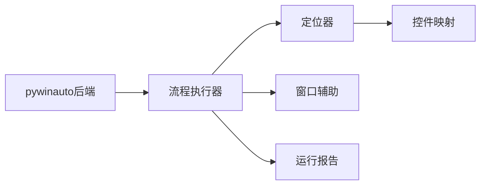

# Robot Framework集成

<cite>
**本文引用的文件**   
- [WT_Automation.robot](file://WT_Automation.robot)
- [README.md](file://README.md)
- [PROJECT_ARCHITECTURE.md](file://PROJECT_ARCHITECTURE.md)
- [wt_flow_executor.py](file://wt_flow_executor.py)
- [wt_flow_locator.py](file://wt_flow_locator.py)
- [wt_window_helpers.py](file://wt_window_helpers.py)
- [wt_control_index.py](file://wt_control_index.py)
- [wt_run_reporting.py](file://wt_run_reporting.py)
- [resources/dispatch_keywords.resource](file://resources/dispatch_keywords.resource)
- [resources/project_config.resource](file://resources/project_config.resource)
- [control_maps/总控件信息.json](file://control_maps/总控件信息.json)
- [flow_packages/flow_package_registry.json](file://flow_packages/flow_package_registry.json)
- [tools/external_capture/pywinauto_backend.py](file://tools/external_capture/pywinauto_backend.py)
</cite>

## 目录
1. [简介](#简介)
2. [项目结构](#项目结构)
3. [核心组件](#核心组件)
4. [架构总览](#架构总览)
5. [详细组件分析](#详细组件分析)
6. [依赖关系分析](#依赖关系分析)
7. [性能考虑](#性能考虑)
8. [故障排查指南](#故障排查指南)
9. [结论](#结论)
10. [附录](#附录)

## 简介
本指南面向希望在Robot Framework中集成并使用WT自动化能力的测试工程师与开发者。内容涵盖：
- 库的安装与配置
- 关键字使用与页面对象模式
- 数据驱动测试
- 日志与报告生成
- 并行执行与分布式测试
- 调试技巧与常见问题
- 与其他工具的集成示例
- 配置文件与最佳实践

本仓库提供了基于WT的UI自动化能力，包括窗口定位、控件索引、流程执行器、运行报告等模块，并通过Robot Framework资源文件暴露关键字供用例调用。

## 项目结构
从顶层视角看，本项目围绕“流程定义—控件映射—执行引擎—报告输出”的主线组织：
- 顶层入口与说明：README、架构文档、Robot主用例
- 执行层：流程执行器、定位器、窗口辅助、控件索引
- 资源层：Robot资源文件（关键字分发、项目配置）
- 数据层：控件映射JSON、流程包注册表
- 工具层：外部捕获桥接（pywinauto后端）、图像模板、OCR工具集
- 样本与测试：示例流程、录制脚本、单元测试

图表来源
- [wt_flow_executor.py](file://wt_flow_executor.py)
- [wt_flow_locator.py](file://wt_flow_locator.py)
- [wt_window_helpers.py](file://wt_window_helpers.py)
- [wt_control_index.py](file://wt_control_index.py)
- [wt_run_reporting.py](file://wt_run_reporting.py)
- [resources/dispatch_keywords.resource](file://resources/dispatch_keywords.resource)
- [resources/project_config.resource](file://resources/project_config.resource)
- [control_maps/总控件信息.json](file://control_maps/总控件信息.json)
- [flow_packages/flow_package_registry.json](file://flow_packages/flow_package_registry.json)
- [tools/external_capture/pywinauto_backend.py](file://tools/external_capture/pywinauto_backend.py)

章节来源
- [README.md](file://README.md)
- [PROJECT_ARCHITECTURE.md](file://PROJECT_ARCHITECTURE.md)
- [WT_Automation.robot](file://WT_Automation.robot)

## 核心组件
- 流程执行器：负责解析并执行流程定义，协调定位器、窗口辅助与控件索引完成UI操作，并在执行过程中收集指标用于报告。
- 定位器：提供稳定的控件查找策略，支持相对窗口、层级匹配与容错重试。
- 窗口辅助：封装窗口生命周期管理、激活、等待就绪等通用能力。
- 控件索引：维护控件元数据与映射，支撑快速检索与一致性校验。
- 运行报告：汇总执行结果、截图、耗时、错误堆栈等，便于回溯与分析。
- Robot资源：将上述能力以关键字形式暴露给Robot用例，实现低代码编排。

章节来源
- [wt_flow_executor.py](file://wt_flow_executor.py)
- [wt_flow_locator.py](file://wt_flow_locator.py)
- [wt_window_helpers.py](file://wt_window_helpers.py)
- [wt_control_index.py](file://wt_control_index.py)
- [wt_run_reporting.py](file://wt_run_reporting.py)
- [resources/dispatch_keywords.resource](file://resources/dispatch_keywords.resource)
- [resources/project_config.resource](file://resources/project_config.resource)

## 架构总览
下图展示了Robot用例到WT执行引擎的关键交互路径，以及数据与配置的流向。

图表来源
- [wt_flow_executor.py](file://wt_flow_executor.py)
- [wt_flow_locator.py](file://wt_flow_locator.py)
- [wt_window_helpers.py](file://wt_window_helpers.py)
- [wt_control_index.py](file://wt_control_index.py)
- [wt_run_reporting.py](file://wt_run_reporting.py)
- [resources/dispatch_keywords.resource](file://resources/dispatch_keywords.resource)

## 详细组件分析

### 流程执行器（wt_flow_executor.py）
职责
- 接收流程定义或步骤序列，按序执行UI动作
- 协调定位器与窗口辅助，处理超时、重试与异常
- 向报告模块写入步骤级结果与附件

关键设计点
- 步骤级事务化：每个步骤独立记录成功/失败、耗时、截图
- 可插拔后端：通过外部捕获后端适配不同UI框架
- 可配置的重试与等待策略，提升稳定性

图表来源
- [wt_flow_executor.py](file://wt_flow_executor.py)
- [wt_flow_locator.py](file://wt_flow_locator.py)
- [wt_window_helpers.py](file://wt_window_helpers.py)
- [wt_run_reporting.py](file://wt_run_reporting.py)

章节来源
- [wt_flow_executor.py](file://wt_flow_executor.py)
- [wt_run_reporting.py](file://wt_run_reporting.py)

### 定位器与控件索引（wt_flow_locator.py / wt_control_index.py）
职责
- 定位器：将高层定位规则转换为具体控件实例，支持相对窗口、层级、文本匹配等
- 控件索引：集中管理控件元数据与映射，保证跨用例一致性与可维护性

关键设计点
- 规则分层：先窗口后控件，减少搜索空间
- 索引缓存：启动时加载映射，运行时命中缓存
- 容错匹配：模糊匹配与降级策略

图表来源
- [wt_flow_locator.py](file://wt_flow_locator.py)
- [wt_control_index.py](file://wt_control_index.py)
- [control_maps/总控件信息.json](file://control_maps/总控件信息.json)

章节来源
- [wt_flow_locator.py](file://wt_flow_locator.py)
- [wt_control_index.py](file://wt_control_index.py)
- [control_maps/总控件信息.json](file://control_maps/总控件信息.json)

### 窗口辅助（wt_window_helpers.py）
职责
- 窗口激活、聚焦、等待就绪、关闭等基础操作
- 统一异常与超时处理，屏蔽底层差异

章节来源
- [wt_window_helpers.py](file://wt_window_helpers.py)

### 运行报告（wt_run_reporting.py）
职责
- 收集步骤级结果、截图、日志片段
- 生成结构化报告，便于CI归档与人工复盘

章节来源
- [wt_run_reporting.py](file://wt_run_reporting.py)

### Robot资源与关键字分发（resources/dispatch_keywords.resource / project_config.resource）
职责
- 将执行器能力包装为可读性强的关键字
- 集中管理项目级配置项（如默认超时、截图路径、日志级别）

章节来源
- [resources/dispatch_keywords.resource](file://resources/dispatch_keywords.resource)
- [resources/project_config.resource](file://resources/project_config.resource)

### 外部捕获后端（tools/external_capture/pywinauto_backend.py）
职责
- 作为UI访问后端，桥接到Windows UI自动化技术栈
- 对上层屏蔽底层差异，提供稳定API

章节来源
- [tools/external_capture/pywinauto_backend.py](file://tools/external_capture/pywinauto_backend.py)

## 依赖关系分析
- 组件内聚与耦合
  - 执行器为核心，依赖定位器、窗口辅助、报告模块；与控件索引松耦合（通过映射数据）
  - 定位器与控件索引强相关，建议保持版本同步
- 外部依赖
  - pywinauto后端作为UI访问桥梁，需确保环境安装与权限正确
- 潜在循环依赖
  - 当前结构无直接循环；若新增功能，应避免在定位器中反向引用执行器

图表来源
- [wt_flow_executor.py](file://wt_flow_executor.py)
- [wt_flow_locator.py](file://wt_flow_locator.py)
- [wt_window_helpers.py](file://wt_window_helpers.py)
- [wt_run_reporting.py](file://wt_run_reporting.py)
- [tools/external_capture/pywinauto_backend.py](file://tools/external_capture/pywinauto_backend.py)
- [control_maps/总控件信息.json](file://control_maps/总控件信息.json)

章节来源
- [wt_flow_executor.py](file://wt_flow_executor.py)
- [wt_flow_locator.py](file://wt_flow_locator.py)
- [wt_window_helpers.py](file://wt_window_helpers.py)
- [wt_run_reporting.py](file://wt_run_reporting.py)
- [tools/external_capture/pywinauto_backend.py](file://tools/external_capture/pywinauto_backend.py)
- [control_maps/总控件信息.json](file://control_maps/总控件信息.json)

## 性能考虑
- 控件索引预热：在套件初始化阶段加载控件映射，避免重复IO
- 定位策略优化：优先使用唯一标识与层级约束，减少全树遍历
- 等待与重试：合理设置超时与退避间隔，避免频繁轮询
- 截图与日志：仅在失败或关键步骤采集，降低I/O开销
- 并行执行：结合Robot并行与流程隔离，避免共享状态冲突

[本节为通用指导，不直接分析具体文件]

## 故障排查指南
- 无法定位控件
  - 检查控件映射是否最新，必要时重新生成映射
  - 确认窗口标题与进程是否匹配，必要时使用窗口辅助强制激活
- 偶发失败
  - 增加等待与重试，关注网络或渲染延迟
  - 开启更详细的日志与截图，定位根因
- 并行执行不稳定
  - 确保用例间无共享窗口/全局状态
  - 为每个并发实例分配独立工作目录与报告路径
- 报告缺失截图
  - 检查截图目录权限与路径配置
  - 确认执行器已启用截图开关

章节来源
- [wt_run_reporting.py](file://wt_run_reporting.py)
- [wt_flow_locator.py](file://wt_flow_locator.py)
- [wt_window_helpers.py](file://wt_window_helpers.py)

## 结论
通过将WT自动化能力封装为可复用的执行器与关键字，并结合控件映射与报告体系，Robot Framework能够高效地驱动复杂UI场景。遵循本文的配置与实践建议，可在稳定性、可维护性与可观测性方面取得良好平衡。

[本节为总结性内容，不直接分析具体文件]

## 附录

### 安装与配置要点
- 环境准备
  - 安装Python与Robot Framework
  - 安装pywinauto后端依赖（由外部捕获模块引入）
- 项目初始化
  - 复制资源文件至工程资源目录
  - 初始化控件映射（参考控制映射目录结构）
  - 配置项目级参数（超时、截图路径、日志级别）
- 运行方式
  - 使用Robot命令行运行主用例或套件
  - 指定资源文件与变量文件，按需启用并行

章节来源
- [resources/dispatch_keywords.resource](file://resources/dispatch_keywords.resource)
- [resources/project_config.resource](file://resources/project_config.resource)
- [flow_packages/flow_package_registry.json](file://flow_packages/flow_package_registry.json)

### 关键字使用与页面对象模式
- 关键字组织
  - 在资源文件中按页面/模块分组关键字
  - 关键字命名采用“动词+名词”风格，语义清晰
- 页面对象模式
  - 将页面元素定位与交互封装为对象方法
  - 用例仅调用高层关键字，隐藏实现细节
- 示例路径
  - 参考主用例与资源文件中的关键字组合方式

章节来源
- [WT_Automation.robot](file://WT_Automation.robot)
- [resources/dispatch_keywords.resource](file://resources/dispatch_keywords.resource)

### 数据驱动测试
- 数据源
  - 使用CSV/Excel/JSON作为数据源
  - 在Robot中使用内置数据驱动机制（For循环或DataDriver）
- 流程包
  - 通过流程包注册表统一管理流程定义
  - 用例根据数据行选择对应流程包执行
- 示例路径
  - 参考流程包注册表与样本流程定义

章节来源
- [flow_packages/flow_package_registry.json](file://flow_packages/flow_package_registry.json)

### 日志与报告配置
- 日志级别
  - 在项目配置中设置日志级别与输出路径
- 报告内容
  - 包含步骤明细、耗时、截图、异常堆栈
- 归档策略
  - CI中按构建号归档，保留最近N次结果

章节来源
- [resources/project_config.resource](file://resources/project_config.resource)
- [wt_run_reporting.py](file://wt_run_reporting.py)

### 并行执行与分布式测试
- 并行执行
  - 使用Robot并行选项，配合资源隔离
  - 为每个实例分配独立工作目录与报告路径
- 分布式
  - 通过节点管理器分发任务，注意共享资源与端口冲突
- 注意事项
  - 避免共享窗口句柄与全局状态
  - 控制并发度，防止系统资源争用

[本节为通用指导，不直接分析具体文件]

### 调试技巧
- 可视化回放
  - 开启截图与滚动截图，定位界面变化
- 慢动作与断点
  - 在关键步骤前插入等待，逐步推进
- 日志增强
  - 在定位与交互前后打印上下文信息
- 最小化复现
  - 抽取失败步骤为单用例，排除干扰因素

[本节为通用指导，不直接分析具体文件]

### 与其他测试工具的集成
- 图像识别
  - 结合图像模板库进行视觉回归验证
- OCR
  - 在动态文本场景下使用OCR辅助断言
- 接口测试
  - 前置条件通过接口构造，UI仅验证展示与交互

章节来源
- [image_templates/Icons/templates_index.json](file://image_templates/Icons/templates_index.json)
- [tools/ORC/doc/README.md](file://tools/ORC/doc/README.md)

### 配置文件清单与最佳实践
- 必备配置
  - 项目配置资源：超时、截图、日志
  - 控件映射：覆盖主要窗口与控件
  - 流程包注册表：集中管理流程定义
- 最佳实践
  - 控件唯一标识优先，层级约束其次
  - 关键字幂等，避免副作用
  - 用例短小精悍，单一职责
  - 报告与日志完备，便于回溯

章节来源
- [resources/project_config.resource](file://resources/project_config.resource)
- [control_maps/总控件信息.json](file://control_maps/总控件信息.json)
- [flow_packages/flow_package_registry.json](file://flow_packages/flow_package_registry.json)