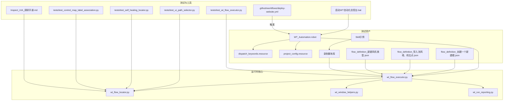
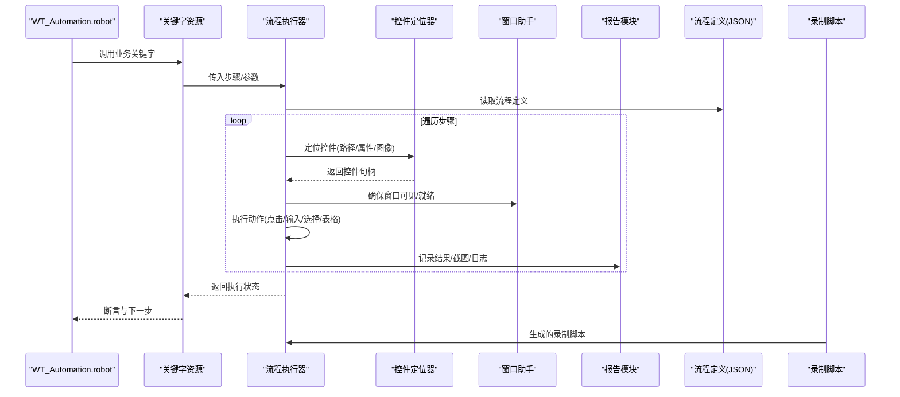
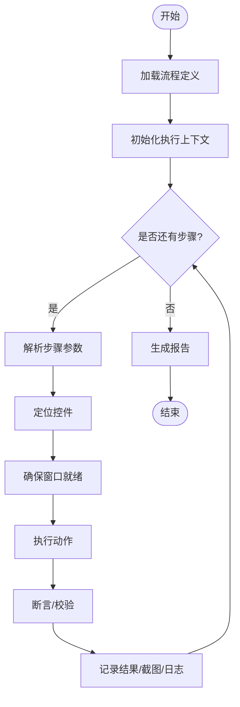
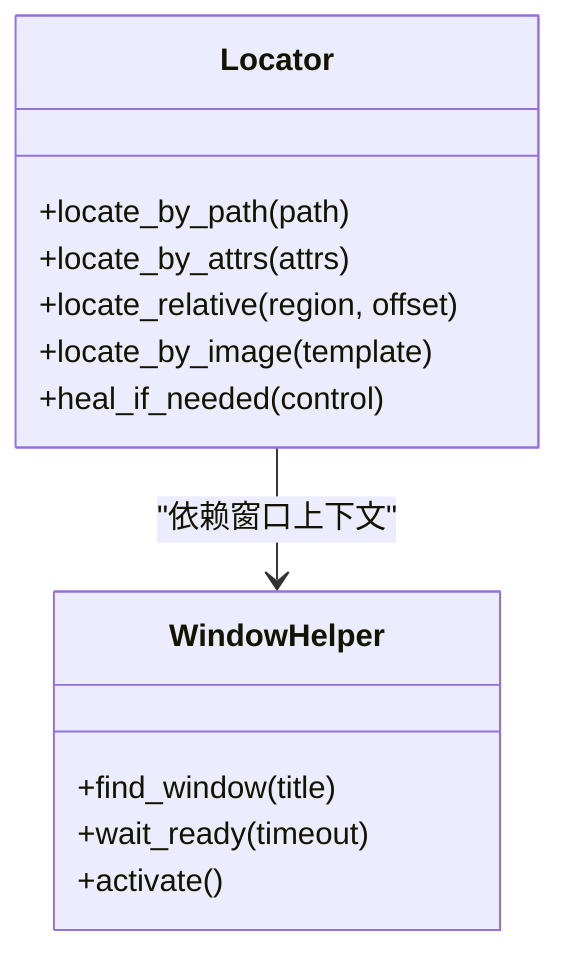
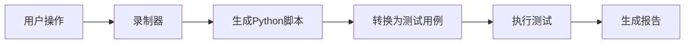
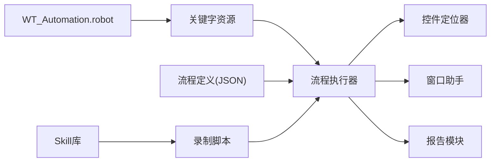

# UI测试案例

<cite>
**本文档引用的文件**   
- [README.md](file://README.md)
- [WT_Automation.robot](file://WT_Automation.robot)
- [wt_flow_executor.py](file://wt_flow_executor.py)
- [wt_flow_locator.py](file://wt_flow_locator.py)
- [wt_window_helpers.py](file://wt_window_helpers.py)
- [wt_run_reporting.py](file://wt_run_reporting.py)
- [flow_definition_创建一个新建模.json](file://flow_packages/flow_definition_创建一个新建模.json)
- [flow_definition_导入测风塔、机位点.json](file://flow_packages/flow_definition_导入测风塔、机位点.json)
- [flow_definition_新建风机类型.json](file://flow_packages/flow_definition_新建风机类型.json)
- [test_wt_flow_executor.py](file://tests/test_wt_flow_executor.py)
- [test_ui_path_selector.py](file://tests/test_ui_path_selector.py)
- [test_self_healing_locator.py](file://tests/test_self_healing_locator.py)
- [test_wt_action_validation.py](file://tests/test_wt_action_validation.py)
- [test_control_map_label_association.py](file://tests/test_control_map_label_association.py)
- [dispatch_keywords.resource](file://resources/dispatch_keywords.resource)
- [project_config.resource](file://resources/project_config.resource)
- [deploy-website.yml](file://.github/workflows/deploy-website.yml)
- [启动WT自动化总控台.bat](file://启动WT自动化总控台.bat)
- [Inspect_UIA_调研手册.md](file://docs/Inspect_UIA_调研手册.md)
- [recorded Mon Jun 15 21_14_03 2026.py](file://samples/recorder_scripts/recorded Mon Jun 15 21_14_03 2026.py)
- [recorded Thu Jun 18 10_33_40 2026.py](file://samples/recorder_scripts/recorded Thu Jun 18 10_33_40 2026.py)
- [recorded Wed Jul 22 20_10_01 2026.py](file://samples/recorder_scripts/recorded Wed Jul 22 20_10_01 2026.py)
- [GM_Xialaxuanze.py](file://samples/recorder_scripts/Skill/GM_Xialaxuanze.py)
- [GM_add1.py](file://samples/recorder_scripts/Skill/GM_add1.py)
- [GM_load_cgcs.py](file://samples/recorder_scripts/Skill/GM_load_cgcs.py)
- [combo_selector.py](file://samples/recorder_scripts/Skill/combo_selector.py)
</cite>

## 更新摘要
**所做更改**   
- 新增了录制示例脚本章节，包含多个录制文件和Skill示例
- 更新了测试用例部分，新增控件映射标签关联测试
- 添加了UIA调研手册参考
- 扩展了示例演示部分，展示更多实际使用场景

## 目录
1. [简介](#简介)
2. [项目结构](#项目结构)
3. [核心组件](#核心组件)
4. [架构总览](#架构总览)
5. [详细组件分析](#详细组件分析)
6. [录制示例与演示](#录制示例与演示)
7. [依赖关系分析](#依赖关系分析)
8. [性能与压力测试](#性能与压力测试)
9. [故障排查指南](#故障排查指南)
10. [结论](#结论)
11. [附录](#附录)

## 简介
本文件面向使用WT框架进行UI自动化测试的工程师，提供一套完整的测试案例文档。内容覆盖按钮点击、文本输入、下拉选择、表格操作等常见场景；给出用例组织与命名规范；介绍测试数据准备与管理方法；总结断言验证最佳实践与错误处理策略；说明如何集成到CI/CD流水线执行；并提供性能与压力测试方案以及测试报告生成与分析方法。

**更新** 新增了录制示例脚本和测试用例的详细分析，展示了从录制到执行的完整工作流程。

## 项目结构
仓库采用"流程定义 + 关键字资源 + 执行器 + 定位器 + 报告"的分层组织方式：
- 流程定义（JSON）：描述端到端业务流，包含窗口、控件、动作序列与参数。
- 关键字资源（Robot Framework .resource）：封装常用UI操作为可复用关键字。
- 执行器与定位器：解析流程定义、定位控件、驱动UI交互。
- 辅助工具：窗口管理、报告生成、外部捕获桥接等。
- 测试套件：针对执行器、定位器、校验逻辑的单元测试与集成测试。
- CI配置：GitHub Actions工作流用于网站部署（可作为CI参考）。
- **新增** 录制脚本库：包含多种录制格式和Skill示例，便于快速生成测试用例。

**图表来源**
- [WT_Automation.robot:1-200](file://WT_Automation.robot#L1-L200)
- [dispatch_keywords.resource:1-200](file://resources/dispatch_keywords.resource#L1-L200)
- [project_config.resource:1-200](file://resources/project_config.resource#L1-L200)
- [wt_flow_executor.py:1-200](file://wt_flow_executor.py#L1-L200)
- [wt_flow_locator.py:1-200](file://wt_flow_locator.py#L1-L200)
- [wt_window_helpers.py:1-200](file://wt_window_helpers.py#L1-L200)
- [wt_run_reporting.py:1-200](file://wt_run_reporting.py#L1-L200)
- [flow_definition_创建一个新建模.json:1-200](file://flow_packages/flow_definition_创建一个新建模.json#L1-L200)
- [flow_definition_导入测风塔、机位点.json:1-200](file://flow_packages/flow_definition_导入测风塔、机位点.json#L1-L200)
- [flow_definition_新建风机类型.json:1-200](file://flow_packages/flow_definition_新建风机类型.json#L1-L200)
- [test_wt_flow_executor.py:1-200](file://tests/test_wt_flow_executor.py#L1-L200)
- [test_ui_path_selector.py:1-200](file://tests/test_ui_path_selector.py#L1-L200)
- [test_self_healing_locator.py:1-200](file://tests/test_self_healing_locator.py#L1-L200)
- [test_control_map_label_association.py:1-200](file://tests/test_control_map_label_association.py#L1-L200)
- [启动WT自动化总控台.bat:1-200](file://启动WT自动化总控台.bat#L1-L200)
- [deploy-website.yml:1-200](file://.github/workflows/deploy-website.yml#L1-L200)
- [Inspect_UIA_调研手册.md:1-200](file://docs/Inspect_UIA_调研手册.md#L1-L200)

## 核心组件
- 流程执行器：负责加载流程定义、解析步骤、调度定位器与窗口助手、执行UI动作并收集结果。
- 控件定位器：基于路径、属性、相对区域与图像模板等多策略定位目标控件。
- 窗口助手：管理窗口发现、激活、等待就绪、句柄与进程生命周期。
- 报告模块：汇总执行结果、截图、日志与指标，输出可读报告。
- 关键字资源：将复杂操作封装为关键字，供RF脚本直接调用。
- 流程定义：以JSON描述端到端业务流，便于维护与复用。
- **新增** 录制引擎：支持多种录制格式，自动生成测试脚本。
- **新增** Skill库：提供可复用的UI操作技能包。

**章节来源**
- [wt_flow_executor.py:1-200](file://wt_flow_executor.py#L1-L200)
- [wt_flow_locator.py:1-200](file://wt_flow_locator.py#L1-L200)
- [wt_window_helpers.py:1-200](file://wt_window_helpers.py#L1-L200)
- [wt_run_reporting.py:1-200](file://wt_run_reporting.py#L1-L200)
- [dispatch_keywords.resource:1-200](file://resources/dispatch_keywords.resource#L1-L200)
- [flow_definition_创建一个新建模.json:1-200](file://flow_packages/flow_definition_创建一个新建模.json#L1-L200)

## 架构总览
下图展示从RF脚本到执行器、定位器、窗口助手与报告的调用链，以及流程定义的注入路径。

**图表来源**
- [WT_Automation.robot:1-200](file://WT_Automation.robot#L1-L200)
- [dispatch_keywords.resource:1-200](file://resources/dispatch_keywords.resource#L1-L200)
- [wt_flow_executor.py:1-200](file://wt_flow_executor.py#L1-L200)
- [wt_flow_locator.py:1-200](file://wt_flow_locator.py#L1-L200)
- [wt_window_helpers.py:1-200](file://wt_window_helpers.py#L1-L200)
- [wt_run_reporting.py:1-200](file://wt_run_reporting.py#L1-L200)
- [flow_definition_创建一个新建模.json:1-200](file://flow_packages/flow_definition_创建一个新建模.json#L1-L200)

## 详细组件分析

### 流程执行器（wt_flow_executor.py）
职责
- 解析流程定义，按序执行步骤。
- 协调定位器与窗口助手完成UI交互。
- 聚合执行结果，驱动报告生成。

关键流程
- 初始化：加载配置、注册动作处理器、准备报告上下文。
- 执行循环：读取步骤、定位控件、执行动作、断言条件、记录指标。
- 异常处理：捕获UI异常、重试策略、失败截图与堆栈。

**图表来源**
- [wt_flow_executor.py:1-200](file://wt_flow_executor.py#L1-L200)

**章节来源**
- [wt_flow_executor.py:1-200](file://wt_flow_executor.py#L1-L200)
- [test_wt_flow_executor.py:1-200](file://tests/test_wt_flow_executor.py#L1-L200)

### 控件定位器（wt_flow_locator.py）
能力
- 多策略定位：UI路径、属性匹配、相对区域、图像模板。
- 自愈式定位：在轻微界面漂移时通过相似度与容错策略恢复定位。
- 缓存与索引：对稳定控件建立索引以提升性能。

典型用法
- 通过路径或属性快速定位按钮、输入框、下拉项。
- 结合相对区域定位动态列表中的某一行。
- 使用图像模板识别图标类控件。

**图表来源**
- [wt_flow_locator.py:1-200](file://wt_flow_locator.py#L1-L200)
- [wt_window_helpers.py:1-200](file://wt_window_helpers.py#L1-L200)

**章节来源**
- [wt_flow_locator.py:1-200](file://wt_flow_locator.py#L1-L200)
- [test_ui_path_selector.py:1-200](file://tests/test_ui_path_selector.py#L1-L200)
- [test_self_healing_locator.py:1-200](file://tests/test_self_healing_locator.py#L1-L200)
- [wt_window_helpers.py:1-200](file://wt_window_helpers.py#L1-L200)

### 关键字资源（dispatch_keywords.resource / project_config.resource）
作用
- 将复杂UI操作封装为关键字，如"点击按钮"、"输入文本"、"选择下拉项"、"操作表格"。
- 集中管理项目级配置，如超时、重试次数、截图路径等。

建议关键字设计
- 统一入参：窗口标题、控件标识、动作类型、参数字典。
- 统一出参：布尔成功标志、附加信息（如选中值、行号）。
- 内置断言：可选断言模式，减少用例层重复代码。

**章节来源**
- [dispatch_keywords.resource:1-200](file://resources/dispatch_keywords.resource#L1-L200)
- [project_config.resource:1-200](file://resources/project_config.resource#L1-L200)

### 流程定义（flow_definition_*.json）
结构要点
- 元数据：名称、版本、适用环境。
- 步骤数组：每个步骤包含动作类型、目标控件、参数、预期结果。
- 数据绑定：支持变量替换与外部数据源引用。

示例用途
- 创建新模型：打开窗口、填写表单、保存并验证提示。
- 导入数据：选择文件、确认导入、检查进度与结果。
- 新建风机类型：选择类型、设置曲线、提交并校验。

**章节来源**
- [flow_definition_创建一个新建模.json:1-200](file://flow_packages/flow_definition_创建一个新建模.json#L1-L200)
- [flow_definition_导入测风塔、机位点.json:1-200](file://flow_packages/flow_definition_导入测风塔、机位点.json#L1-L200)
- [flow_definition_新建风机类型.json:1-200](file://flow_packages/flow_definition_新建风机类型.json#L1-L200)

### 报告模块（wt_run_reporting.py）
功能
- 汇总用例/步骤级别的结果、耗时、截图与日志。
- 生成结构化报告（HTML/JSON），便于分析与归档。
- 支持失败重跑标记与趋势统计。

**章节来源**
- [wt_run_reporting.py:1-200](file://wt_run_reporting.py#L1-L200)

## 录制示例与演示

### 录制脚本库概览
WT框架提供了丰富的录制示例脚本，涵盖多种UI操作场景：

#### 基础录制示例
- `recorded Mon Jun 15 21_14_03 2026.py`：基础窗口操作录制
- `recorded Thu Jun 18 10_33_40 2026.py`：文本输入与按钮点击
- `recorded Wed Jul 22 20_10_01 2026.py`：复杂业务流程录制

#### Skill技能库
- `GM_Xialaxuanze.py`：下拉选择操作示例
- `GM_add1.py`：添加操作示例
- `GM_load_cgcs.py`：数据加载示例
- `combo_selector.py`：组合框选择器示例

**章节来源**
- [recorded Mon Jun 15 21_14_03 2026.py:1-200](file://samples/recorder_scripts/recorded Mon Jun 15 21_14_03 2026.py#L1-L200)
- [recorded Thu Jun 18 10_33_40 2026.py:1-200](file://samples/recorder_scripts/recorded Thu Jun 18 10_33_40 2026.py#L1-L200)
- [recorded Wed Jul 22 20_10_01 2026.py:1-200](file://samples/recorder_scripts/recorded Wed Jul 22 20_10_01 2026.py#L1-L200)
- [GM_Xialaxuanze.py:1-200](file://samples/recorder_scripts/Skill/GM_Xialaxuanze.py#L1-L200)
- [GM_add1.py:1-200](file://samples/recorder_scripts/Skill/GM_add1.py#L1-L200)
- [GM_load_cgcs.py:1-200](file://samples/recorder_scripts/Skill/GM_load_cgcs.py#L1-L200)
- [combo_selector.py:1-200](file://samples/recorder_scripts/Skill/combo_selector.py#L1-L200)

### 录制脚本使用指南
录制脚本的生成和使用流程：

**图表来源**
- [recorded Wed Jul 22 20_10_01 2026.py:1-200](file://samples/recorder_scripts/recorded Wed Jul 22 20_10_01 2026.py#L1-L200)

### 控件映射与标签关联测试
新增的控件映射标签关联测试确保了UI元素的正确识别和定位：

**章节来源**
- [test_control_map_label_association.py:1-200](file://tests/test_control_map_label_association.py#L1-L200)

### UIA调研参考
Inspection UIA调研手册提供了Windows UI Automation技术的深入分析，包括：
- UIA树结构分析
- 控件属性识别
- 跨平台兼容性考虑
- 性能优化建议

**章节来源**
- [Inspect_UIA_调研手册.md:1-200](file://docs/Inspect_UIA_调研手册.md#L1-L200)

## 依赖关系分析
- 低耦合：执行器仅依赖定位器与窗口助手的接口，不关心具体UI实现细节。
- 高内聚：关键字资源聚焦于UI操作封装，提升复用性。
- 外部依赖：流程定义作为数据驱动源，便于非编码人员维护。
- **新增** 录制依赖：录制脚本依赖于UIA探测器和屏幕捕获技术。

**图表来源**
- [WT_Automation.robot:1-200](file://WT_Automation.robot#L1-L200)
- [dispatch_keywords.resource:1-200](file://resources/dispatch_keywords.resource#L1-L200)
- [wt_flow_executor.py:1-200](file://wt_flow_executor.py#L1-L200)
- [wt_flow_locator.py:1-200](file://wt_flow_locator.py#L1-L200)
- [wt_window_helpers.py:1-200](file://wt_window_helpers.py#L1-L200)
- [wt_run_reporting.py:1-200](file://wt_run_reporting.py#L1-L200)
- [flow_definition_创建一个新建模.json:1-200](file://flow_packages/flow_definition_创建一个新建模.json#L1-L200)

**章节来源**
- [wt_flow_executor.py:1-200](file://wt_flow_executor.py#L1-L200)
- [wt_flow_locator.py:1-200](file://wt_flow_locator.py#L1-L200)
- [wt_window_helpers.py:1-200](file://wt_window_helpers.py#L1-L200)
- [wt_run_reporting.py:1-200](file://wt_run_reporting.py#L1-L200)

## 性能与压力测试
- 批量执行：通过并行运行多个流程定义或RF套件，评估吞吐与稳定性。
- 长稳测试：在固定时间窗口内循环执行关键路径，监控内存与CPU占用。
- 压测指标：平均响应时间、P95/P99延迟、失败率、截图数量与大小。
- 优化建议：启用控件索引、减少图像匹配频率、合理设置超时与重试。
- **新增** 录制优化：录制脚本的优化策略，包括智能等待和自适应定位。

## 故障排查指南
常见问题与对策
- 控件未找到：检查路径/属性是否正确，必要时启用自愈定位或图像模板。
- 窗口未就绪：增加等待时间或改用"等待就绪"关键字。
- 断言失败：查看报告中的截图与日志，定位差异原因。
- 偶发失败：引入重试机制与幂等清理步骤。
- **新增** 录制问题：检查录制环境的分辨率和DPI设置，确保录制脚本的可移植性。

**章节来源**
- [test_wt_action_validation.py:1-200](file://tests/test_wt_action_validation.py#L1-L200)
- [wt_run_reporting.py:1-200](file://wt_run_reporting.py#L1-L200)

## 结论
WT框架通过"流程定义 + 关键字资源 + 执行器 + 定位器 + 报告"的分层架构，提供了稳定、可维护且可扩展的UI自动化测试能力。借助数据驱动与自愈定位，能够高效覆盖按钮、输入、下拉、表格等常见场景，并易于集成至CI/CD流水线，持续保障质量。

**更新** 新增的录制示例和Skill库大大简化了测试用例的创建过程，提高了测试开发的效率。

## 附录

### 测试用例组织与命名规范
- 用例分组：按业务域划分（如"模型创建"、"数据导入"、"类型管理"）。
- 命名约定：动词+名词+场景，例如"创建新模型_正常路径"、"导入数据_大文件"。
- 步骤粒度：每个原子UI操作对应一个步骤，便于定位与重放。
- 数据隔离：使用独立数据目录与临时文件，避免相互影响。

### 测试数据准备与管理
- 静态数据：放在资源目录，按场景分文件夹。
- 动态数据：在流程中生成或从上游系统获取，并在结束后清理。
- 数据校验：在报告中附带关键数据快照，便于回溯。

### 断言验证最佳实践
- 显式断言：对关键状态进行断言（如对话框出现、字段值更新）。
- 复合断言：组合多项条件，提高鲁棒性。
- 失败快照：自动截取失败画面，缩短排障时间。

### 错误处理策略
- 重试与退避：对不稳定操作设置指数退避重试。
- 降级策略：当主定位失败时回退到图像匹配或相对区域定位。
- 清理与恢复：无论成功失败都执行必要的清理步骤。

### 集成到CI/CD流水线
- 本地执行：使用批处理脚本一键启动总控台并运行RF套件。
- 云端执行：在GitHub Actions中安装依赖、拉取代码、执行测试并上传报告。
- 通知与归档：失败时发送通知，归档报告与截图。

**章节来源**
- [启动WT自动化总控台.bat:1-200](file://启动WT自动化总控台.bat#L1-L200)
- [deploy-website.yml:1-200](file://.github/workflows/deploy-website.yml#L1-L200)

### 测试报告生成与分析
- 生成：执行完成后自动生成HTML/JSON报告。
- 分析：关注失败用例、耗时分布、截图差异。
- 趋势：对比历史报告，观察回归与改进。

**章节来源**
- [wt_run_reporting.py:1-200](file://wt_run_reporting.py#L1-L200)

### 录制脚本开发指南
录制脚本的开发和维护指南：
- 录制环境准备：确保目标应用正常运行，分辨率和DPI设置一致。
- 脚本优化：添加适当的等待时间和错误处理。
- 参数化：将硬编码值替换为参数，提高脚本复用性。
- 测试验证：在不同环境下验证脚本的稳定性。

**章节来源**
- [recorded Wed Jul 22 20_10_01 2026.py:1-200](file://samples/recorder_scripts/recorded Wed Jul 22 20_10_01 2026.py#L1-L200)
- [GM_Xialaxuanze.py:1-200](file://samples/recorder_scripts/Skill/GM_Xialaxuanze.py#L1-L200)
- [combo_selector.py:1-200](file://samples/recorder_scripts/Skill/combo_selector.py#L1-L200)

### 控件映射与标签关联
控件映射和标签关联的最佳实践：
- 唯一标识：为每个控件分配唯一的标识符。
- 层级关系：维护控件的父子关系和层级结构。
- 标签管理：统一管理控件的显示标签和内部标签。
- 变更检测：监控UI变更并自动更新映射关系。

**章节来源**
- [test_control_map_label_association.py:1-200](file://tests/test_control_map_label_association.py#L1-L200)
- [Inspect_UIA_调研手册.md:1-200](file://docs/Inspect_UIA_调研手册.md#L1-L200)