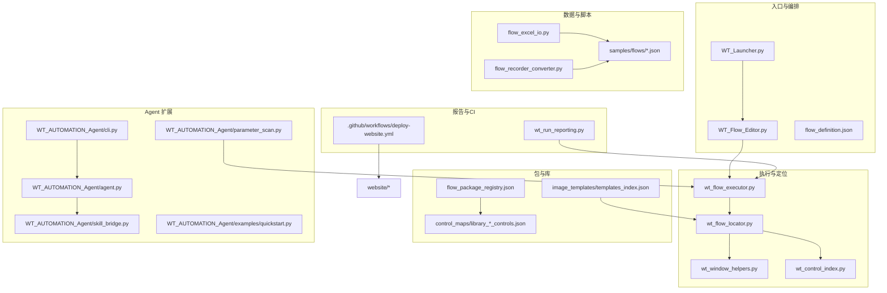
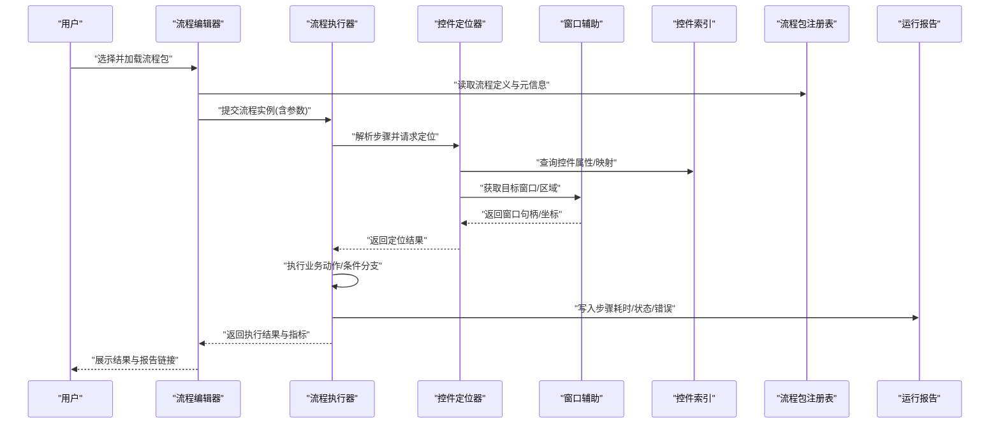
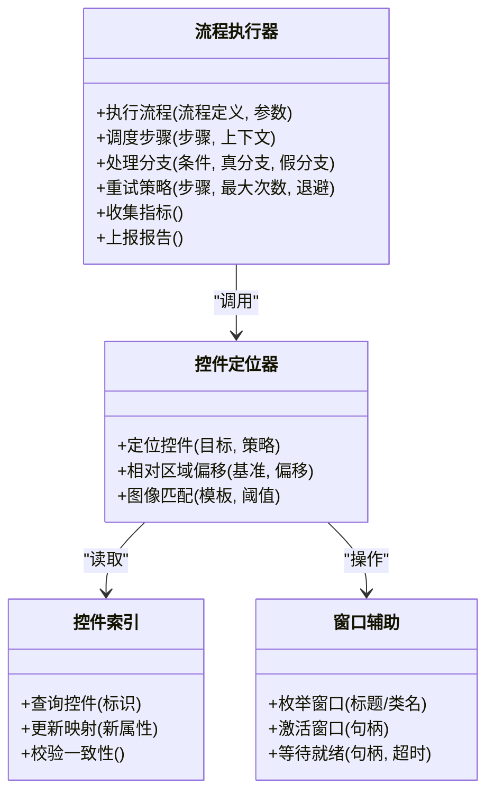
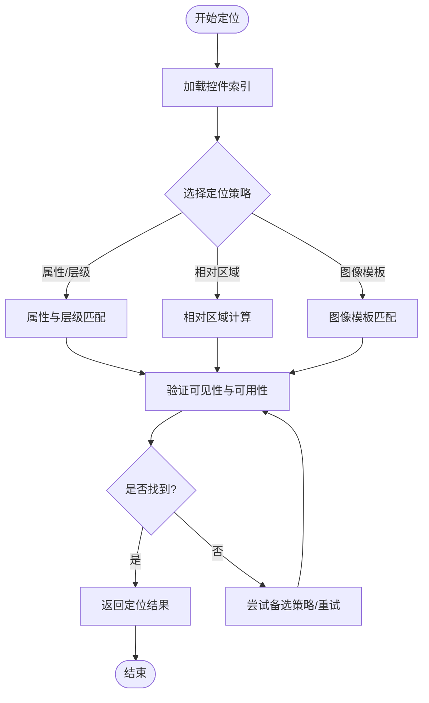
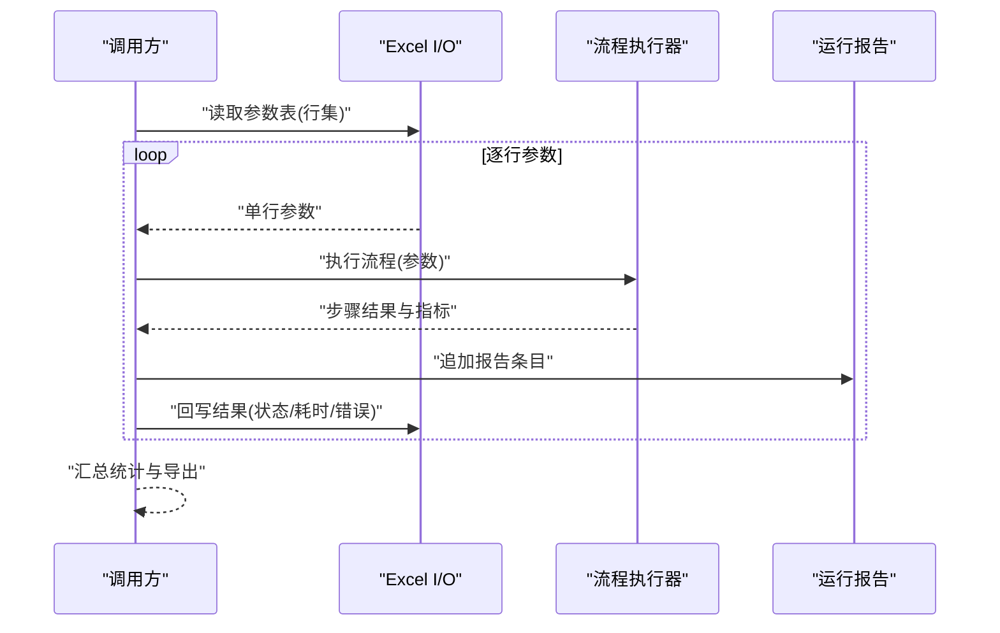
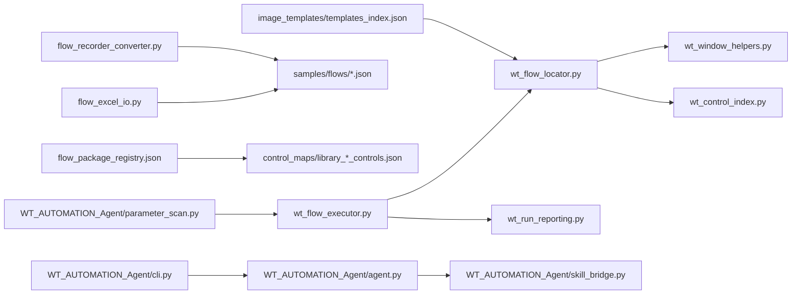

# 业务流程自动化

<cite>
**本文引用的文件**   
- [README.md](file://README.md)
- [PROJECT_ARCHITECTURE.md](file://PROJECT_ARCHITECTURE.md)
- [WT_Flow_Editor.py](file://WT_Flow_Editor.py)
- [WT_Launcher.py](file://WT_Launcher.py)
- [wt_flow_executor.py](file://wt_flow_executor.py)
- [wt_flow_locator.py](file://wt_flow_locator.py)
- [wt_window_helpers.py](file://wt_window_helpers.py)
- [wt_control_index.py](file://wt_control_index.py)
- [flow_excel_io.py](file://flow_excel_io.py)
- [flow_recorder_converter.py](file://flow_recorder_converter.py)
- [wt_run_reporting.py](file://wt_run_reporting.py)
- [flow_definition_microscale_create_model.json](file://flow_packages/flow_definition_microscale_create_model.json)
- [flow_definition_turbine_type_create_and_curves.json](file://flow_packages/flow_definition_turbine_type_create_and_curves.json)
- [flow_package_registry.json](file://flow_packages/flow_package_registry.json)
- [library_气象对象_WPF_controls.json](file://control_maps/library_气象对象_WPF_controls.json)
- [library_风机类型_WPF_controls.json](file://control_maps/library_风机类型_WPF_controls.json)
- [deploy-website.yml](file://.github/workflows/deploy-website.yml)
- [examples/quickstart.py](file://WT_AUTOMATION_Agent/examples/quickstart.py)
- [agent.py](file://WT_AUTOMATION_Agent/agent.py)
- [cli.py](file://WT_AUTOMATION_Agent/cli.py)
- [skill_bridge.py](file://WT_AUTOMATION_Agent/skill_bridge.py)
- [parameter_scan.py](file://WT_AUTOMATION_Agent/parameter_scan.py)
</cite>

## 目录
1. [简介](#简介)
2. [项目结构](#项目结构)
3. [核心组件](#核心组件)
4. [架构总览](#架构总览)
5. [详细组件分析](#详细组件分析)
6. [依赖关系分析](#依赖关系分析)
7. [性能考虑](#性能考虑)
8. [故障排查指南](#故障排查指南)
9. [结论](#结论)
10. [附录](#附录)

## 简介
本项目面向复杂业务场景的跨系统自动化，聚焦于“流程编排 + UI/控件定位 + 数据驱动 + 可观测性”的一体化能力。通过可视化流程编辑器、录制与转换工具、参数化执行与扫描、以及完善的运行报告与告警输出，实现多步骤任务编排、条件分支处理、异常恢复机制与企业级部署运维实践。同时提供行业应用案例与模板，便于快速落地。

## 项目结构
仓库采用分层与按功能域组织的方式：
- 顶层入口与编排：流程编辑器、启动器、主流程定义与资源
- 执行引擎与定位：流程执行器、控件定位、窗口辅助、控制索引
- 数据与脚本：Excel 导入导出、录制脚本转换、示例与样例
- 包与库：流程包注册表、标准控件库、图像模板
- Agent 扩展：AI 助手、技能桥接、CLI、参数扫描
- 文档与网站：项目说明、生成脚本、站点部署工作流

图表来源
- [WT_Flow_Editor.py:1-200](file://WT_Flow_Editor.py#L1-L200)
- [wt_flow_executor.py:1-200](file://wt_flow_executor.py#L1-L200)
- [wt_flow_locator.py:1-200](file://wt_flow_locator.py#L1-L200)
- [wt_window_helpers.py:1-200](file://wt_window_helpers.py#L1-L200)
- [wt_control_index.py:1-200](file://wt_control_index.py#L1-L200)
- [flow_excel_io.py:1-200](file://flow_excel_io.py#L1-L200)
- [flow_recorder_converter.py:1-200](file://flow_recorder_converter.py#L1-L200)
- [flow_package_registry.json:1-200](file://flow_packages/flow_package_registry.json#L1-L200)
- [library_气象对象_WPF_controls.json:1-200](file://control_maps/library_气象对象_WPF_controls.json#L1-L200)
- [library_风机类型_WPF_controls.json:1-200](file://control_maps/library_风机类型_WPF_controls.json#L1-L200)
- [wt_run_reporting.py:1-200](file://wt_run_reporting.py#L1-L200)
- [deploy-website.yml:1-200](file://.github/workflows/deploy-website.yml#L1-L200)

章节来源
- [README.md:1-200](file://README.md#L1-L200)
- [PROJECT_ARCHITECTURE.md:1-200](file://PROJECT_ARCHITECTURE.md#L1-L200)

## 核心组件
- 流程执行器：负责解析流程定义、调度步骤、管理上下文、处理分支与异常、收集指标与日志。
- 控件定位器：基于控件索引与窗口辅助进行稳定定位，支持相对区域、图像匹配与多尺度策略。
- 窗口辅助：封装窗口枚举、激活、句柄管理与状态等待。
- 控制索引：维护控件属性、层级与映射，支撑跨版本/主题下的鲁棒定位。
- Excel I/O：将流程参数与结果读写到表格，支持批量与回写。
- 录制转换器：将录制脚本转换为标准化流程定义，提升复用性。
- 报告与告警：统一输出运行报告、关键指标与失败堆栈，便于监控集成。
- Agent 扩展：提供自然语言/DSL 辅助、技能桥接、命令行接口与参数扫描能力。

章节来源
- [wt_flow_executor.py:1-200](file://wt_flow_executor.py#L1-L200)
- [wt_flow_locator.py:1-200](file://wt_flow_locator.py#L1-L200)
- [wt_window_helpers.py:1-200](file://wt_window_helpers.py#L1-L200)
- [wt_control_index.py:1-200](file://wt_control_index.py#L1-L200)
- [flow_excel_io.py:1-200](file://flow_excel_io.py#L1-L200)
- [flow_recorder_converter.py:1-200](file://flow_recorder_converter.py#L1-L200)
- [wt_run_reporting.py:1-200](file://wt_run_reporting.py#L1-L200)
- [agent.py:1-200](file://WT_AUTOMATION_Agent/agent.py#L1-L200)
- [skill_bridge.py:1-200](file://WT_AUTOMATION_Agent/skill_bridge.py#L1-L200)
- [cli.py:1-200](file://WT_AUTOMATION_Agent/cli.py#L1-L200)
- [parameter_scan.py:1-200](file://WT_AUTOMATION_Agent/parameter_scan.py#L1-L200)

## 架构总览
整体采用“编排层（编辑器/启动器）+ 执行层（执行器/定位器/窗口辅助）+ 数据层（Excel/JSON/模板）+ 可观测层（报告/CI）+ Agent 扩展”的分层架构。流程定义以 JSON 描述，执行器按步骤调度；定位器结合控件索引与图像模板完成稳健交互；报告模块聚合运行指标并输出结构化结果；Agent 提供 DSL/技能桥接与参数扫描，增强灵活性与可扩展性。

图表来源
- [WT_Flow_Editor.py:1-200](file://WT_Flow_Editor.py#L1-L200)
- [wt_flow_executor.py:1-200](file://wt_flow_executor.py#L1-L200)
- [wt_flow_locator.py:1-200](file://wt_flow_locator.py#L1-L200)
- [wt_window_helpers.py:1-200](file://wt_window_helpers.py#L1-L200)
- [wt_control_index.py:1-200](file://wt_control_index.py#L1-L200)
- [flow_package_registry.json:1-200](file://flow_packages/flow_package_registry.json#L1-L200)
- [wt_run_reporting.py:1-200](file://wt_run_reporting.py#L1-L200)

## 详细组件分析

### 流程执行器（编排与异常恢复）
- 职责：解析流程定义、维护执行上下文、调度步骤、处理条件分支与重试、收集指标与日志、触发回调与报告。
- 关键点：
  - 步骤模型：包含动作、参数、定位策略、超时、重试、分支条件等。
  - 上下文：变量注入、中间结果传递、环境隔离。
  - 异常恢复：捕获异常、记录堆栈、重试策略、降级路径、补偿动作。
  - 指标：步骤耗时、成功率、失败原因分布、资源占用。
- 优化建议：
  - 对长耗时步骤启用异步或并行（在安全前提下）。
  - 使用指数退避与抖动策略降低重试风暴风险。
  - 将大对象缓存至临时存储，避免重复计算。

图表来源
- [wt_flow_executor.py:1-200](file://wt_flow_executor.py#L1-L200)
- [wt_flow_locator.py:1-200](file://wt_flow_locator.py#L1-L200)
- [wt_window_helpers.py:1-200](file://wt_window_helpers.py#L1-L200)
- [wt_control_index.py:1-200](file://wt_control_index.py#L1-L200)

章节来源
- [wt_flow_executor.py:1-200](file://wt_flow_executor.py#L1-L200)

### 控件定位器与窗口辅助（稳健交互）
- 职责：根据控件索引与窗口辅助完成稳定的界面交互，支持相对区域、图像模板与多尺度匹配。
- 关键点：
  - 控件索引：维护控件唯一标识、属性集合、层级关系与映射规则。
  - 窗口辅助：封装窗口查找、激活、状态等待与句柄管理。
  - 定位策略：文本/属性匹配、相对坐标、图像模板、组合条件。
- 优化建议：
  - 优先使用控件属性与层级，其次再使用图像匹配。
  - 为动态内容设置锚点与容差范围。
  - 缓存常用定位结果，减少重复开销。

图表来源
- [wt_flow_locator.py:1-200](file://wt_flow_locator.py#L1-L200)
- [wt_window_helpers.py:1-200](file://wt_window_helpers.py#L1-L200)
- [wt_control_index.py:1-200](file://wt_control_index.py#L1-L200)

章节来源
- [wt_flow_locator.py:1-200](file://wt_flow_locator.py#L1-L200)
- [wt_window_helpers.py:1-200](file://wt_window_helpers.py#L1-L200)
- [wt_control_index.py:1-200](file://wt_control_index.py#L1-L200)

### 数据驱动与参数化流程（Excel/JSON）
- 职责：将流程参数与结果读写到 Excel/JSON，支持批量执行与回写，便于审计与回归。
- 关键点：
  - 参数模板：定义输入字段、默认值、校验规则与取值范围。
  - 批量执行：逐行读取参数，生成多个流程实例，合并结果。
  - 结果回写：将步骤状态、耗时、错误信息与截图路径写入表格。
- 优化建议：
  - 对大文件分块读取，避免内存峰值。
  - 使用列映射与别名，兼容不同版本模板。
  - 对敏感字段脱敏后再落盘。

图表来源
- [flow_excel_io.py:1-200](file://flow_excel_io.py#L1-L200)
- [wt_flow_executor.py:1-200](file://wt_flow_executor.py#L1-L200)
- [wt_run_reporting.py:1-200](file://wt_run_reporting.py#L1-L200)

章节来源
- [flow_excel_io.py:1-200](file://flow_excel_io.py#L1-L200)

### 录制与转换（从脚本到流程）
- 职责：将录制脚本转换为标准化流程定义，提升复用性与可维护性。
- 关键点：
  - 识别动作：点击、输入、选择、拖拽等。
  - 提取定位：自动推断控件属性与相对区域。
  - 生成步骤：输出符合流程定义的 JSON。
- 优化建议：
  - 增加去重与合并逻辑，减少冗余步骤。
  - 引入断言步骤，提升稳定性。
  - 支持占位符替换，便于参数化。

章节来源
- [flow_recorder_converter.py:1-200](file://flow_recorder_converter.py#L1-L200)

### 流程包与标准控件库（可插拔与复用）
- 职责：集中管理流程包与标准控件库，支持注册、发现与版本管理。
- 关键点：
  - 流程包注册表：声明流程包元信息、依赖与入口。
  - 标准控件库：按窗口/控件类型组织控件属性与映射。
  - 图像模板：提供图标与界面元素模板，用于图像匹配。
- 优化建议：
  - 引入版本号与兼容性矩阵。
  - 对控件库进行一致性校验与冲突检测。
  - 模板库建立索引与哈希校验，防止篡改。

章节来源
- [flow_package_registry.json:1-200](file://flow_packages/flow_package_registry.json#L1-L200)
- [library_气象对象_WPF_controls.json:1-200](file://control_maps/library_气象对象_WPF_controls.json#L1-L200)
- [library_风机类型_WPF_controls.json:1-200](file://control_maps/library_风机类型_WPF_controls.json#L1-L200)

### Agent 扩展（DSL/技能桥接/CLI/参数扫描）
- 职责：提供自然语言/DSL 辅助、技能桥接、命令行接口与参数扫描，增强灵活性与可扩展性。
- 关键点：
  - Agent：理解意图、生成步骤序列、调用技能桥接。
  - 技能桥接：封装外部工具/服务调用，统一接口。
  - CLI：提供批处理与集成能力。
  - 参数扫描：遍历参数空间，批量执行并汇总结果。
- 优化建议：
  - 对 DSL 输出进行静态检查与约束校验。
  - 技能调用增加熔断与限流。
  - 参数扫描支持并发与断点续扫。

章节来源
- [agent.py:1-200](file://WT_AUTOMATION_Agent/agent.py#L1-L200)
- [skill_bridge.py:1-200](file://WT_AUTOMATION_Agent/skill_bridge.py#L1-L200)
- [cli.py:1-200](file://WT_AUTOMATION_Agent/cli.py#L1-L200)
- [parameter_scan.py:1-200](file://WT_AUTOMATION_Agent/parameter_scan.py#L1-L200)
- [examples/quickstart.py:1-200](file://WT_AUTOMATION_Agent/examples/quickstart.py#L1-L200)

## 依赖关系分析
- 内部依赖：
  - 执行器依赖定位器与窗口辅助；定位器依赖控件索引与图像模板。
  - Excel I/O 与录制转换器依赖流程定义格式与样本。
  - 报告模块依赖执行器输出的指标与日志。
- 外部依赖：
  - UI 自动化后端（如 pywinauto 等）由窗口辅助与定位器间接使用。
  - OCR 与图像处理库用于图像模板匹配。
  - CI 工作流用于站点部署与发布。

图表来源
- [wt_flow_executor.py:1-200](file://wt_flow_executor.py#L1-L200)
- [wt_flow_locator.py:1-200](file://wt_flow_locator.py#L1-L200)
- [wt_window_helpers.py:1-200](file://wt_window_helpers.py#L1-L200)
- [wt_control_index.py:1-200](file://wt_control_index.py#L1-L200)
- [flow_excel_io.py:1-200](file://flow_excel_io.py#L1-L200)
- [flow_recorder_converter.py:1-200](file://flow_recorder_converter.py#L1-L200)
- [flow_package_registry.json:1-200](file://flow_packages/flow_package_registry.json#L1-L200)
- [library_气象对象_WPF_controls.json:1-200](file://control_maps/library_气象对象_WPF_controls.json#L1-L200)
- [library_风机类型_WPF_controls.json:1-200](file://control_maps/library_风机类型_WPF_controls.json#L1-L200)
- [wt_run_reporting.py:1-200](file://wt_run_reporting.py#L1-L200)
- [agent.py:1-200](file://WT_AUTOMATION_Agent/agent.py#L1-L200)
- [skill_bridge.py:1-200](file://WT_AUTOMATION_Agent/skill_bridge.py#L1-L200)
- [cli.py:1-200](file://WT_AUTOMATION_Agent/cli.py#L1-L200)
- [parameter_scan.py:1-200](file://WT_AUTOMATION_Agent/parameter_scan.py#L1-L200)

章节来源
- [PROJECT_ARCHITECTURE.md:1-200](file://PROJECT_ARCHITECTURE.md#L1-L200)

## 性能考虑
- 定位性能：
  - 优先使用控件属性与层级匹配，减少图像匹配频率。
  - 缓存常用定位结果与窗口句柄，避免重复枚举。
  - 合理设置超时与重试退避，避免阻塞。
- 执行性能：
  - 对无依赖的步骤并行执行，注意共享资源竞争。
  - 大对象与中间结果使用临时存储，降低内存压力。
  - 批量参数执行时采用分片与进度上报。
- 报告与监控：
  - 增量写入报告，避免一次性落盘造成 IO 瓶颈。
  - 指标采样降频，保留关键路径的详细日志。

[本节为通用指导，不直接分析具体文件]

## 故障排查指南
- 常见问题定位：
  - 控件定位失败：检查控件索引是否最新、窗口是否就绪、相对区域是否正确、图像模板是否过期。
  - 流程执行中断：查看运行报告中的步骤状态与错误堆栈，确认分支条件与参数合法性。
  - 性能退化：分析步骤耗时分布，定位热点步骤，优化定位策略或引入缓存。
- 调试建议：
  - 开启详细日志与截图保存，复现问题。
  - 使用最小参数集与单步执行，逐步缩小范围。
  - 对比标准控件库与当前 UI 差异，必要时更新映射。
- 监控与告警：
  - 基于运行报告的关键指标（失败率、平均耗时、重试次数）配置阈值告警。
  - 将报告输出接入企业监控平台（如 Prometheus/Grafana 或自研看板）。

章节来源
- [wt_run_reporting.py:1-200](file://wt_run_reporting.py#L1-L200)
- [wt_flow_executor.py:1-200](file://wt_flow_executor.py#L1-L200)
- [wt_flow_locator.py:1-200](file://wt_flow_locator.py#L1-L200)
- [wt_control_index.py:1-200](file://wt_control_index.py#L1-L200)

## 结论
本项目通过“流程编排 + 稳健定位 + 数据驱动 + 可观测性 + Agent 扩展”的组合，实现了跨系统的复杂业务流程自动化。借助标准控件库与图像模板，提升了跨版本与主题的稳定性；通过 Excel/JSON 参数化与批量执行，增强了可维护性与可审计性；配合运行报告与 CI 工作流，满足企业级部署与运维需求。建议在持续演进中强化权限与安全控制、完善监控告警体系，并沉淀更多行业模板与最佳实践。

[本节为总结性内容，不直接分析具体文件]

## 附录

### 企业级部署与运维经验
- 环境准备：
  - 安装必要依赖（UI 自动化后端、OCR/图像处理库等），确保与操作系统与目标软件版本兼容。
  - 准备流程包与标准控件库，建立版本基线与变更流程。
- 部署方式：
  - 使用启动器或 CLI 作为服务进程，配置守护进程与重启策略。
  - 将流程包与模板置于只读目录，避免运行时被篡改。
- 运维要点：
  - 定期更新控件库与图像模板，保持与 UI 变化同步。
  - 建立灰度发布与回滚机制，先小范围验证后全量上线。
  - 配置健康检查与自愈策略，自动恢复常见故障。

章节来源
- [WT_Launcher.py:1-200](file://WT_Launcher.py#L1-L200)
- [cli.py:1-200](file://WT_AUTOMATION_Agent/cli.py#L1-L200)
- [deploy-website.yml:1-200](file://.github/workflows/deploy-website.yml#L1-L200)

### 监控与告警配置方法
- 指标采集：
  - 从运行报告中提取步骤耗时、成功率、失败原因、重试次数等指标。
  - 将指标以结构化格式输出，便于监控系统抓取。
- 告警规则：
  - 失败率超过阈值、平均耗时显著上升、连续重试失败等触发告警。
  - 针对关键流程设置独立告警通道与升级策略。
- 可视化：
  - 使用看板展示总体健康度与趋势，钻取到具体流程与步骤。
  - 关联截图与日志，缩短排障时间。

章节来源
- [wt_run_reporting.py:1-200](file://wt_run_reporting.py#L1-L200)

### 性能调优与故障排查实际案例
- 定位漂移：
  - 现象：某步骤点击位置偏移导致失败。
  - 排查：检查相对区域偏移与控件索引一致性，更新模板与锚点。
  - 解决：引入更稳定的属性匹配与容差范围，增加重试与降级路径。
- 输入框高度变化：
  - 现象：动态高度导致输入错位。
  - 排查：对比不同版本的控件属性，调整相对区域计算逻辑。
  - 解决：增加自适应策略与后备定位方案。
- 私有分组点击：
  - 现象：私有分组内控件不可见导致失败。
  - 排查：确认窗口展开状态与可见性判断逻辑。
  - 解决：在执行前显式展开分组，并增加就绪等待。

章节来源
- [debug-click-9-miss.md:1-200](file://debug-click-9-miss.md#L1-L200)
- [debug-default-height-relative-input.md:1-200](file://debug-default-height-relative-input.md#L1-L200)
- [debug-private-group-click.md:1-200](file://debug-private-group-click.md#L1-L200)
- [debug-start-validation-regression.md:1-200](file://debug-start-validation-regression.md#L1-L200)
- [debug-time-series-input-regression.md:1-200](file://debug-time-series-input-regression.md#L1-L200)
- [debug-cft02-step16-drift.md:1-200](file://debug-cft02-step16-drift.md#L1-L200)

### 安全考虑与权限管理
- 最小权限原则：
  - 仅授予必要的窗口访问与文件系统权限，避免越权操作。
- 数据安全：
  - 对敏感参数脱敏后再落盘，限制报告与日志的访问范围。
- 供应链安全：
  - 对流程包与控件库进行完整性校验与签名验证。
- 审计与合规：
  - 记录关键操作的审计日志，满足合规要求。

[本节为通用指导，不直接分析具体文件]

### 行业应用案例与定制化方案
- 风电微尺度建模：
  - 流程包：创建模型、导入测风塔与机位点、新建风机类型与曲线。
  - 定制点：参数化风速/地形/机型，批量生成结果并回写报表。
- 气象数据录入：
  - 流程包：导入时间序列文件、填写字段、校验与保存。
  - 定制点：支持多种数据源与格式，自动清洗与转换。
- 通用模板：
  - 提供标准控件库与图像模板，适配不同 UI 框架与主题。
  - 通过流程包注册表统一管理，支持版本化与回滚。

章节来源
- [flow_definition_microscale_create_model.json:1-200](file://flow_packages/flow_definition_microscale_create_model.json#L1-L200)
- [flow_definition_turbine_type_create_and_curves.json:1-200](file://flow_packages/flow_definition_turbine_type_create_and_curves.json#L1-L200)
- [flow_package_registry.json:1-200](file://flow_packages/flow_package_registry.json#L1-L200)
- [library_气象对象_WPF_controls.json:1-200](file://control_maps/library_气象对象_WPF_controls.json#L1-L200)
- [library_风机类型_WPF_controls.json:1-200](file://control_maps/library_风机类型_WPF_controls.json#L1-L200)

### 完整代码示例与配置文件模板
- 快速开始示例：
  - 参考示例脚本，了解如何加载流程包、传入参数并执行。
- 流程定义模板：
  - 参考样例流程定义，了解步骤结构、定位策略与分支条件。
- 控件库模板：
  - 参考标准控件库，了解控件属性与映射规范。

章节来源
- [examples/quickstart.py:1-200](file://WT_AUTOMATION_Agent/examples/quickstart.py#L1-L200)
- [flow_definition_microscale_create_model.json:1-200](file://flow_packages/flow_definition_microscale_create_model.json#L1-L200)
- [flow_definition_turbine_type_create_and_curves.json:1-200](file://flow_packages/flow_definition_turbine_type_create_and_curves.json#L1-L200)
- [library_气象对象_WPF_controls.json:1-200](file://control_maps/library_气象对象_WPF_controls.json#L1-L200)
- [library_风机类型_WPF_controls.json:1-200](file://control_maps/library_风机类型_WPF_controls.json#L1-L200)