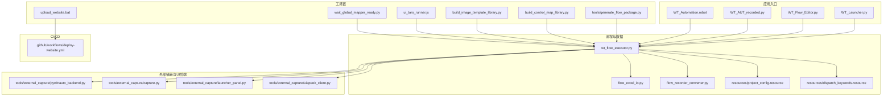
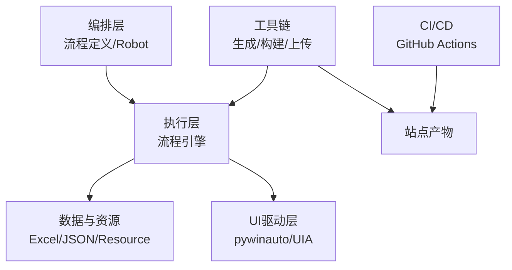
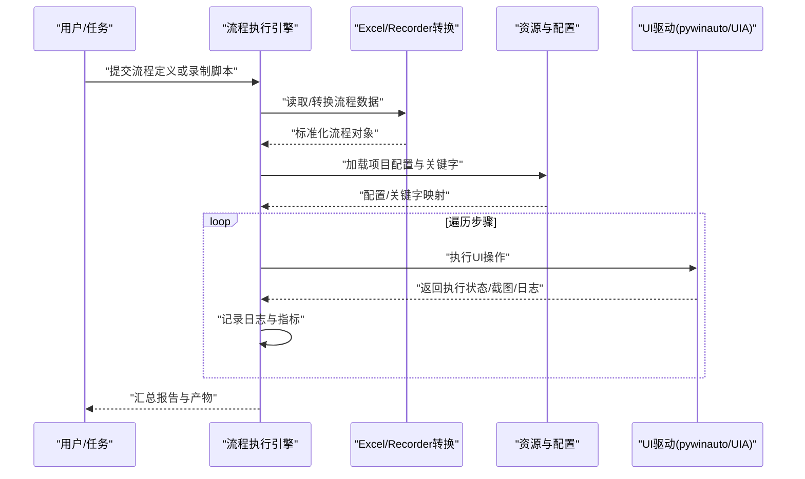
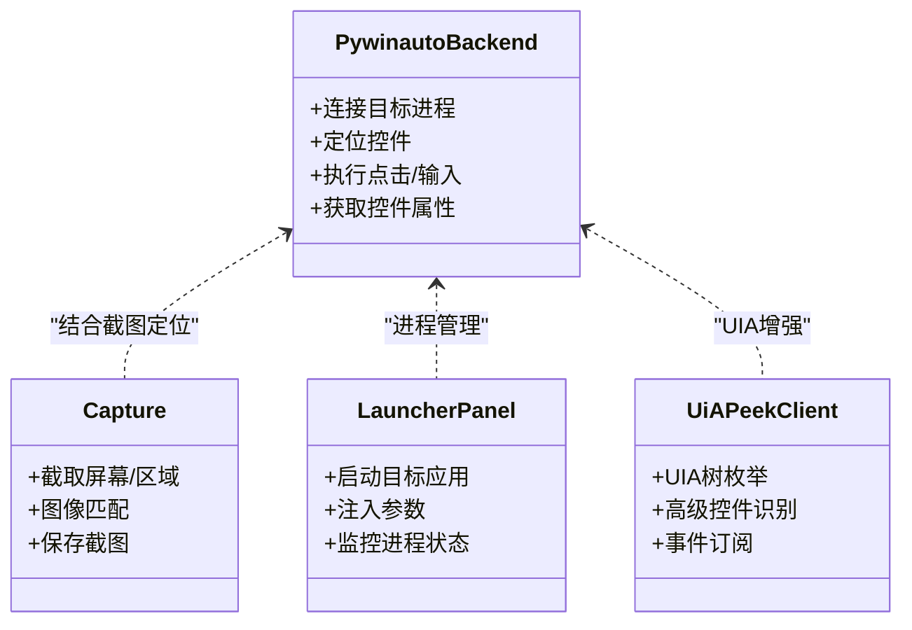
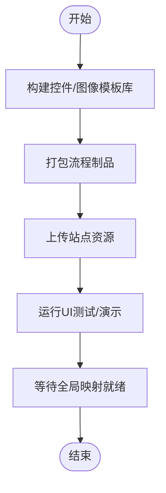
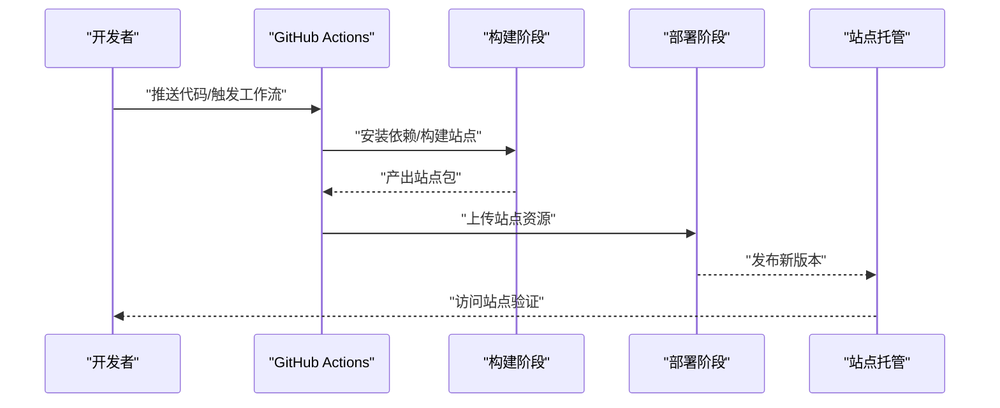
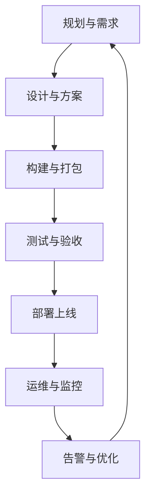
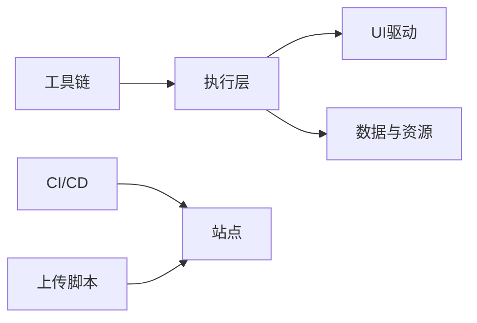

# 企业级部署运维

<cite>
**本文引用的文件**   
- [README.md](file://README.md)
- [PROJECT_ARCHITECTURE.md](file://PROJECT_ARCHITECTURE.md)
- [.github/workflows/deploy-website.yml](file://.github/workflows/deploy-website.yml)
- [WT_Launcher.py](file://WT_Launcher.py)
- [WT_AUT_recorded.py](file://WT_AUT_recorded.py)
- [WT_Flow_Editor.py](file://WT_Flow_Editor.py)
- [WT_Automation.robot](file://WT_Automation.robot)
- [wt_flow_executor.py](file://wt_flow_executor.py)
- [flow_excel_io.py](file://flow_excel_io.py)
- [flow_recorder_converter.py](file://flow_recorder_converter.py)
- [resources/project_config.resource](file://resources/project_config.resource)
- [resources/dispatch_keywords.resource](file://resources/dispatch_keywords.resource)
- [tools/external_capture/pywinauto_backend.py](file://tools/external_capture/pywinauto_backend.py)
- [tools/external_capture/capture.py](file://tools/external_capture/capture.py)
- [tools/external_capture/launcher_panel.py](file://tools/external_capture/launcher_panel.py)
- [tools/external_capture/uiapeek_client.py](file://tools/external_capture/uiapeek_client.py)
- [tools/generate_flow_package.py](file://tools/generate_flow_package.py)
- [build_control_map_library.py](file://build_control_map_library.py)
- [build_image_template_library.py](file://build_image_template_library.py)
- [upload_website.bat](file://upload_website.bat)
- [ui_tars_runner.js](file://ui_tars_runner.js)
- [wait_global_mapper_ready.py](file://wait_global_mapper_ready.py)
- [WT_AUT_AI助手启动脚本.bat](file="WT_AUT_AI助手启动脚本.bat")
</cite>

## 目录
1. [简介](#简介)
2. [项目结构](#项目结构)
3. [核心组件](#核心组件)
4. [架构总览](#架构总览)
5. [详细组件分析](#详细组件分析)
6. [依赖关系分析](#依赖关系分析)
7. [性能考虑](#性能考虑)
8. [故障排查指南](#故障排查指南)
9. [结论](#结论)
10. [附录](#附录)

## 简介
本指南面向企业级部署与运维，围绕环境准备、依赖管理、配置优化、容器化与CI/CD流水线、负载均衡与分布式执行、性能监控与日志告警、安全加固与权限管理、备份恢复与灾难恢复等主题，提供可落地的最佳实践。文档内容基于仓库现有工程结构与脚本进行梳理，确保建议与实际代码实现保持一致。

## 项目结构
项目采用“自动化流程编排 + UI 控制 + 工具链”的混合形态：
- 顶层入口与主程序：包含启动器、录制回放、流程编辑器等
- 流程定义与资源：JSON 流程定义、Robot Framework 资源文件
- 外部捕获与UI后端：pywinauto、UIA Peek 客户端等
- 工具链：流程包生成、控件库构建、图像模板库构建、网站上传脚本等
- CI/CD：GitHub Actions 站点部署工作流

图示来源
- [WT_Launcher.py](file://WT_Launcher.py)
- [WT_Flow_Editor.py](file://WT_Flow_Editor.py)
- [WT_AUT_recorded.py](file://WT_AUT_recorded.py)
- [WT_Automation.robot](file://WT_Automation.robot)
- [wt_flow_executor.py](file://wt_flow_executor.py)
- [flow_excel_io.py](file://flow_excel_io.py)
- [flow_recorder_converter.py](file://flow_recorder_converter.py)
- [resources/project_config.resource](file://resources/project_config.resource)
- [resources/dispatch_keywords.resource](file://resources/dispatch_keywords.resource)
- [tools/external_capture/pywinauto_backend.py](file://tools/external_capture/pywinauto_backend.py)
- [tools/external_capture/capture.py](file://tools/external_capture/capture.py)
- [tools/external_capture/launcher_panel.py](file://tools/external_capture/launcher_panel.py)
- [tools/external_capture/uiapeek_client.py](file://tools/external_capture/uiapeek_client.py)
- [tools/generate_flow_package.py](file://tools/generate_flow_package.py)
- [build_control_map_library.py](file://build_control_map_library.py)
- [build_image_template_library.py](file://build_image_template_library.py)
- [upload_website.bat](file://upload_website.bat)
- [ui_tars_runner.js](file://ui_tars_runner.js)
- [wait_global_mapper_ready.py](file://wait_global_mapper_ready.py)
- [.github/workflows/deploy-website.yml](file://.github/workflows/deploy-website.yml)

章节来源
- [README.md](file://README.md)
- [PROJECT_ARCHITECTURE.md](file://PROJECT_ARCHITECTURE.md)

## 核心组件
- 流程执行引擎：负责解析流程定义、调度步骤、处理输入输出与异常
- Excel/Recorder 转换：支持从Excel导入导出流程，以及录制脚本到流程定义的转换
- UI 后端与捕获：通过 pywinauto 与 UIA Peek 客户端驱动目标窗口与控件
- 资源与配置：项目配置与关键字资源文件集中管理
- 工具链：流程包生成、控件库与图像模板库构建、网站上传、UI 测试运行器、就绪等待辅助
- CI/CD：GitHub Actions 站点部署工作流

章节来源
- [wt_flow_executor.py](file://wt_flow_executor.py)
- [flow_excel_io.py](file://flow_excel_io.py)
- [flow_recorder_converter.py](file://flow_recorder_converter.py)
- [resources/project_config.resource](file://resources/project_config.resource)
- [resources/dispatch_keywords.resource](file://resources/dispatch_keywords.resource)
- [tools/external_capture/pywinauto_backend.py](file://tools/external_capture/pywinauto_backend.py)
- [tools/external_capture/capture.py](file://tools/external_capture/capture.py)
- [tools/external_capture/launcher_panel.py](file://tools/external_capture/launcher_panel.py)
- [tools/external_capture/uiapeek_client.py](file://tools/external_capture/uiapeek_client.py)
- [tools/generate_flow_package.py](file://tools/generate_flow_package.py)
- [build_control_map_library.py](file://build_control_map_library.py)
- [build_image_template_library.py](file://build_image_template_library.py)
- [upload_website.bat](file://upload_website.bat)
- [ui_tars_runner.js](file://ui_tars_runner.js)
- [wait_global_mapper_ready.py](file://wait_global_mapper_ready.py)

## 架构总览
整体架构由“编排层（流程/Robot）—执行层（引擎）—UI驱动层（pywinauto/UIA）—数据与资源（Excel/JSON/Resource）—工具链与CI/CD”组成。执行层统一接入资源与数据，对外暴露流程执行能力；工具链用于构建与发布制品；CI/CD完成站点自动化部署。

图示来源
- [wt_flow_executor.py](file://wt_flow_executor.py)
- [flow_excel_io.py](file://flow_excel_io.py)
- [flow_recorder_converter.py](file://flow_recorder_converter.py)
- [resources/project_config.resource](file://resources/project_config.resource)
- [resources/dispatch_keywords.resource](file://resources/dispatch_keywords.resource)
- [tools/external_capture/pywinauto_backend.py](file://tools/external_capture/pywinauto_backend.py)
- [tools/external_capture/uiapeek_client.py](file://tools/external_capture/uiapeek_client.py)
- [tools/generate_flow_package.py](file://tools/generate_flow_package.py)
- [upload_website.bat](file://upload_website.bat)
- [.github/workflows/deploy-website.yml](file://.github/workflows/deploy-website.yml)

## 详细组件分析

### 流程执行与数据I/O
- 流程执行引擎负责加载流程定义、解析步骤、调用UI驱动执行动作，并处理异常与结果上报
- Excel/Recorder 转换模块提供流程数据的导入导出与录制脚本转换能力，便于批量构建与回归验证
- 资源文件集中管理项目配置与关键字，提升复用性与一致性

图示来源
- [wt_flow_executor.py](file://wt_flow_executor.py)
- [flow_excel_io.py](file://flow_excel_io.py)
- [flow_recorder_converter.py](file://flow_recorder_converter.py)
- [resources/project_config.resource](file://resources/project_config.resource)
- [resources/dispatch_keywords.resource](file://resources/dispatch_keywords.resource)
- [tools/external_capture/pywinauto_backend.py](file://tools/external_capture/pywinauto_backend.py)
- [tools/external_capture/uiapeek_client.py](file://tools/external_capture/uiapeek_client.py)

章节来源
- [wt_flow_executor.py](file://wt_flow_executor.py)
- [flow_excel_io.py](file://flow_excel_io.py)
- [flow_recorder_converter.py](file://flow_recorder_converter.py)
- [resources/project_config.resource](file://resources/project_config.resource)
- [resources/dispatch_keywords.resource](file://resources/dispatch_keywords.resource)

### UI 后端与捕获
- pywinauto 后端提供Windows控件树访问与交互能力
- capture 模块负责屏幕/区域捕获与图像匹配
- launcher_panel 提供启动面板集成
- uiapeek_client 作为UIA桥接客户端，增强跨进程/复杂控件识别

图示来源
- [tools/external_capture/pywinauto_backend.py](file://tools/external_capture/pywinauto_backend.py)
- [tools/external_capture/capture.py](file://tools/external_capture/capture.py)
- [tools/external_capture/launcher_panel.py](file://tools/external_capture/launcher_panel.py)
- [tools/external_capture/uiapeek_client.py](file://tools/external_capture/uiapeek_client.py)

章节来源
- [tools/external_capture/pywinauto_backend.py](file://tools/external_capture/pywinauto_backend.py)
- [tools/external_capture/capture.py](file://tools/external_capture/capture.py)
- [tools/external_capture/launcher_panel.py](file://tools/external_capture/launcher_panel.py)
- [tools/external_capture/uiapeek_client.py](file://tools/external_capture/uiapeek_client.py)

### 工具链与制品构建
- generate_flow_package：将流程定义打包为可分发制品
- build_control_map_library：构建控件映射库，提升定位稳定性
- build_image_template_library：构建图像模板库，提高视觉匹配鲁棒性
- upload_website：将站点静态资源上传至托管平台
- ui_tars_runner：运行UI相关测试或演示
- wait_global_mapper_ready：等待全局映射就绪，避免竞态

图示来源
- [tools/generate_flow_package.py](file://tools/generate_flow_package.py)
- [build_control_map_library.py](file://build_control_map_library.py)
- [build_image_template_library.py](file://build_image_template_library.py)
- [upload_website.bat](file://upload_website.bat)
- [ui_tars_runner.js](file://ui_tars_runner.js)
- [wait_global_mapper_ready.py](file://wait_global_mapper_ready.py)

章节来源
- [tools/generate_flow_package.py](file://tools/generate_flow_package.py)
- [build_control_map_library.py](file://build_control_map_library.py)
- [build_image_template_library.py](file://build_image_template_library.py)
- [upload_website.bat](file://upload_website.bat)
- [ui_tars_runner.js](file://ui_tars_runner.js)
- [wait_global_mapper_ready.py](file://wait_global_mapper_ready.py)

### CI/CD 流水线（站点部署）
- GitHub Actions 工作流负责站点构建与部署
- 可通过上传脚本触发站点资源更新
- 建议在流水线中增加制品缓存、校验与回滚策略

图示来源
- [.github/workflows/deploy-website.yml](file://.github/workflows/deploy-website.yml)
- [upload_website.bat](file://upload_website.bat)

章节来源
- [.github/workflows/deploy-website.yml](file://.github/workflows/deploy-website.yml)
- [upload_website.bat](file://upload_website.bat)

### 概念总览（非代码映射）

[此图为概念流程图，不直接对应具体源码文件]

## 依赖关系分析
- 执行层对UI驱动与数据资源的强耦合，需保证UI后端可用性与资源一致性
- 工具链对执行层形成反向依赖（构建制品），应纳入版本化管理
- CI/CD与上传脚本共同作用于站点发布，需保持环境变量与凭据安全

图示来源
- [wt_flow_executor.py](file://wt_flow_executor.py)
- [tools/external_capture/pywinauto_backend.py](file://tools/external_capture/pywinauto_backend.py)
- [resources/project_config.resource](file://resources/project_config.resource)
- [tools/generate_flow_package.py](file://tools/generate_flow_package.py)
- [.github/workflows/deploy-website.yml](file://.github/workflows/deploy-website.yml)
- [upload_website.bat](file://upload_website.bat)

章节来源
- [wt_flow_executor.py](file://wt_flow_executor.py)
- [tools/external_capture/pywinauto_backend.py](file://tools/external_capture/pywinauto_backend.py)
- [resources/project_config.resource](file://resources/project_config.resource)
- [tools/generate_flow_package.py](file://tools/generate_flow_package.py)
- [.github/workflows/deploy-website.yml](file://.github/workflows/deploy-website.yml)
- [upload_website.bat](file://upload_website.bat)

## 性能考虑
- 流程执行批量化：合并小粒度步骤，减少UI交互开销
- 图像匹配优化：预构建高质量模板库，降低多尺度搜索成本
- 控件定位稳定化：优先使用控件树与UIA语义，辅以截图兜底
- 并发与队列：在具备无头/后台能力的场景下，按任务类型拆分队列，避免共享资源竞争
- 资源预热：启动时预加载常用控件映射与模板，缩短冷启动时间
- 超时与重试：为关键UI操作设置合理超时与指数退避重试

[本节为通用指导，无需特定文件引用]

## 故障排查指南
- 常见错误分类
  - UI不可达：检查目标进程是否启动、权限是否足够、UIA服务是否启用
  - 控件定位失败：核对控件映射库版本、刷新图像模板、确认窗口层级变化
  - 流程执行中断：查看执行日志与截图，定位失败步骤与上下文
  - 站点无法访问：检查CI/CD凭据、上传路径、域名解析与CDN缓存
- 诊断手段
  - 启用详细日志与截图归档，保留失败快照
  - 使用就绪等待脚本避免竞态
  - 通过上传脚本与CI/CD日志交叉验证发布链路
- 快速恢复
  - 回滚到上一稳定版本（站点与制品）
  - 重建控件/图像模板库后重试
  - 重启UI后端服务或重置UIA会话

章节来源
- [wait_global_mapper_ready.py](file://wait_global_mapper_ready.py)
- [upload_website.bat](file://upload_website.bat)
- [.github/workflows/deploy-website.yml](file://.github/workflows/deploy-website.yml)

## 结论
本项目以流程执行为核心，结合UI驱动与工具链，形成了从构建、测试到发布的完整闭环。在企业级部署与运维中，建议重点强化以下方面：
- 环境与依赖的版本化与隔离
- 制品与配置的集中管理与审计
- 稳定的UI定位与容错机制
- 完善的监控、日志与告警体系
- 安全的凭据管理与最小权限原则
- 可靠的备份与灾难恢复演练

[本节为总结性内容，无需特定文件引用]

## 附录

### 环境准备与依赖管理
- 操作系统与运行时
  - Windows桌面环境（需要GUI会话）
  - Python 运行时与系统依赖（如OCR/Tesseract等，若使用）
- 依赖清单
  - 参考顶层依赖说明与示例脚本
- 虚拟环境
  - 建议使用独立虚拟环境隔离依赖
- 第三方服务
  - UIA服务、OCR语言包、站点托管凭据

章节来源
- [README.md](file://README.md)
- [PROJECT_ARCHITECTURE.md](file://PROJECT_ARCHITECTURE.md)

### 配置优化
- 项目配置
  - 通过资源文件统一管理路径、超时、重试、日志级别等
- 关键字资源
  - 将通用操作封装为关键字，提升一致性与可维护性
- 流程参数化
  - 使用变量与外部配置注入，避免硬编码

章节来源
- [resources/project_config.resource](file://resources/project_config.resource)
- [resources/dispatch_keywords.resource](file://resources/dispatch_keywords.resource)

### 容器化部署与CI/CD
- 容器化建议
  - 针对有头/无头场景分别构建镜像
  - 挂载必要字体与OCR数据卷
  - 限制GPU/CPU与内存配额
- CI/CD流水线
  - 使用GitHub Actions进行站点构建与发布
  - 引入缓存与并行步骤加速构建
  - 增加制品签名与完整性校验

章节来源
- [.github/workflows/deploy-website.yml](file://.github/workflows/deploy-website.yml)
- [upload_website.bat](file://upload_website.bat)

### 负载均衡与分布式执行
- 适用场景
  - 大量UI流程并发执行、长耗时任务拆分
- 方案要点
  - 任务队列与消费者模型
  - 节点间共享制品与配置中心
  - 会话隔离与资源独占（UI进程）
  - 健康检查与自动扩缩容

[本节为概念性指导，无需特定文件引用]

### 性能监控、日志管理与告警
- 监控指标
  - 执行时长、成功率、重试次数、UI定位命中率
- 日志规范
  - 结构化日志、分级输出、关联ID贯穿全流程
- 告警策略
  - 阈值告警与趋势告警结合
  - 多渠道通知与升级策略

[本节为通用指导，无需特定文件引用]

### 安全加固与权限管理
- 最小权限原则
  - 仅授予必要的文件系统与进程访问权限
- 凭据管理
  - 使用密钥管理服务，避免明文存储
- 网络安全
  - 站点访问鉴权、HTTPS与CDN防护
- 审计与合规
  - 操作留痕与定期审计

[本节为通用指导，无需特定文件引用]

### 备份恢复与灾难恢复
- 备份范围
  - 流程定义、控件映射、图像模板、站点产物、配置文件
- 恢复策略
  - 定期演练恢复流程，验证RTO/RPO
- 灾备方案
  - 多地域站点冗余与快速切换

[本节为通用指导，无需特定文件引用]