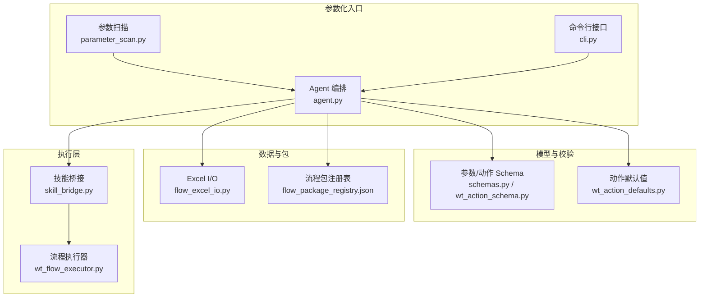
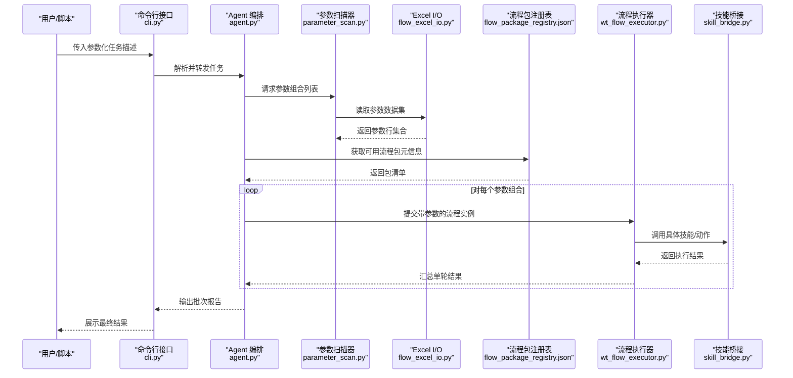
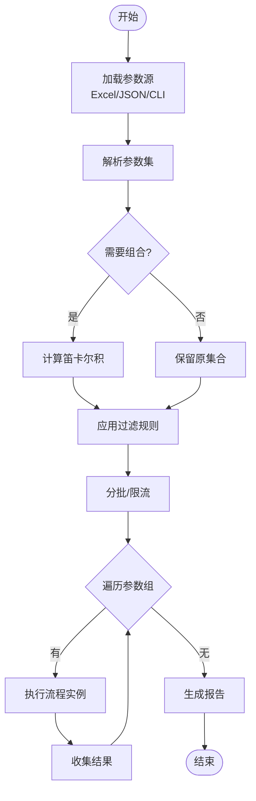
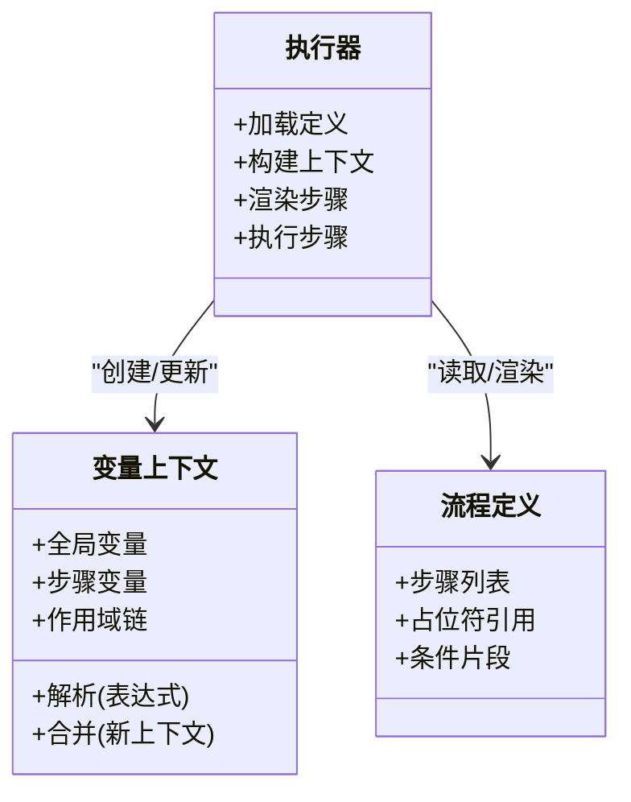
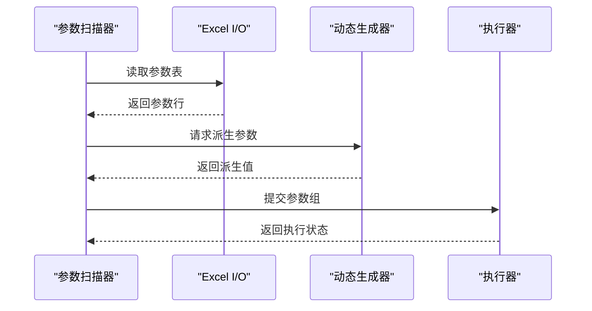
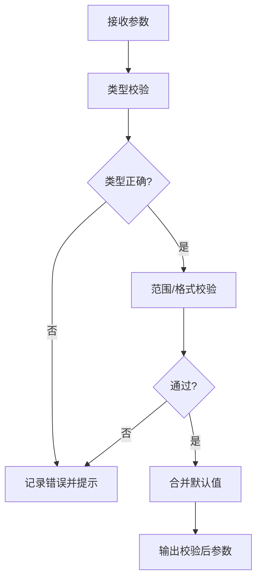
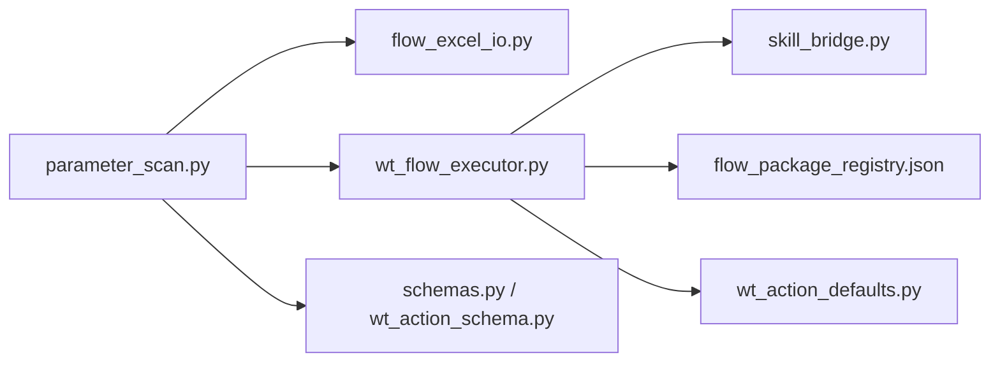

# 参数化流程执行

<cite>
**本文引用的文件**   
- [parameter_scan.py](file://WT_AUTOMATION_Agent/parameter_scan.py)
- [schemas.py](file://WT_AUTOMATION_Agent/schemas.py)
- [agent.py](file://WT_AUTOMATION_Agent/agent.py)
- [cli.py](file://WT_AUTOMATION_Agent/cli.py)
- [skill_bridge.py](file://WT_AUTOMATION_Agent/skill_bridge.py)
- [flow_excel_io.py](file://flow_excel_io.py)
- [wt_flow_executor.py](file://wt_flow_executor.py)
- [wt_action_defaults.py](file://wt_action_defaults.py)
- [wt_action_schema.py](file://wt_action_schema.py)
- [flow_definition_创建一个新建模.json](file://flow_packages/flow_definition_创建一个新建模.json)
- [flow_package_registry.json](file://flow_packages/flow_package_registry.json)
</cite>

## 目录
1. [简介](#简介)
2. [项目结构](#项目结构)
3. [核心组件](#核心组件)
4. [架构总览](#架构总览)
5. [详细组件分析](#详细组件分析)
6. [依赖关系分析](#依赖关系分析)
7. [性能考虑](#性能考虑)
8. [故障排查指南](#故障排查指南)
9. [结论](#结论)
10. [附录](#附录)

## 简介
本文件围绕“参数化流程执行”展开，系统阐述以下主题：
- 参数定义、变量替换与动态配置方法
- 批量执行与参数扫描的实现方式
- 外部数据源集成与动态参数生成
- 参数验证与默认值设置
- 实际参数化场景案例与完整实现路径
- 性能考量与内存管理优化建议

目标读者包括自动化工程师、测试负责人与平台开发者。文档在保持技术深度的同时，尽量以循序渐进的方式呈现，便于不同背景的读者理解和使用。

## 项目结构
本项目采用“Agent + Flow + Skill Bridge + Excel I/O + Executor”的分层组织方式，参数化能力贯穿其中：
- Agent 层：提供参数扫描、调度与编排入口（如 parameter_scan.py、agent.py）
- 模式与校验：集中定义参数与动作的 Schema（schemas.py、wt_action_schema.py）
- 桥接层：将高层语义映射到具体技能或动作（skill_bridge.py）
- 数据层：Excel 读写与流式包注册（flow_excel_io.py、flow_package_registry.json）
- 执行层：流程执行器负责加载、解析、渲染与运行（wt_flow_executor.py）
- 默认值与约束：动作默认值与校验规则（wt_action_defaults.py、wt_action_schema.py）
- 示例流程：可被参数化的流程定义（flow_definition_*.json）

图表来源
- [parameter_scan.py:1-200](file://WT_AUTOMATION_Agent/parameter_scan.py#L1-L200)
- [cli.py:1-200](file://WT_AUTOMATION_Agent/cli.py#L1-L200)
- [agent.py:1-200](file://WT_AUTOMATION_Agent/agent.py#L1-L200)
- [schemas.py:1-200](file://WT_AUTOMATION_Agent/schemas.py#L1-L200)
- [wt_action_schema.py:1-200](file://wt_action_schema.py#L1-L200)
- [wt_action_defaults.py:1-200](file://wt_action_defaults.py#L1-L200)
- [flow_excel_io.py:1-200](file://flow_excel_io.py#L1-L200)
- [flow_package_registry.json:1-200](file://flow_packages/flow_package_registry.json#L1-L200)
- [skill_bridge.py:1-200](file://WT_AUTOMATION_Agent/skill_bridge.py#L1-L200)
- [wt_flow_executor.py:1-200](file://wt_flow_executor.py#L1-L200)

章节来源
- [parameter_scan.py:1-200](file://WT_AUTOMATION_Agent/parameter_scan.py#L1-L200)
- [cli.py:1-200](file://WT_AUTOMATION_Agent/cli.py#L1-L200)
- [agent.py:1-200](file://WT_AUTOMATION_Agent/agent.py#L1-L200)
- [schemas.py:1-200](file://WT_AUTOMATION_Agent/schemas.py#L1-L200)
- [wt_action_schema.py:1-200](file://wt_action_schema.py#L1-L200)
- [wt_action_defaults.py:1-200](file://wt_action_defaults.py#L1-L200)
- [flow_excel_io.py:1-200](file://flow_excel_io.py#L1-L200)
- [flow_package_registry.json:1-200](file://flow_packages/flow_package_registry.json#L1-L200)
- [skill_bridge.py:1-200](file://WT_AUTOMATION_Agent/skill_bridge.py#L1-L200)
- [wt_flow_executor.py:1-200](file://wt_flow_executor.py#L1-L200)

## 核心组件
- 参数扫描器：负责从输入源（如 Excel、JSON、CLI 参数）读取参数组合，生成待执行的参数集，并驱动批量执行。
- 流程执行器：负责加载流程定义、进行变量替换与动态配置、按步骤执行并产出结果。
- 模式与默认值：通过 Schema 与默认值文件对参数进行类型、范围、必填等校验，并提供缺省填充。
- 数据与包：Excel I/O 用于批量参数导入导出；流程包注册表用于发现与管理可参数化的流程模板。
- 技能桥接：将通用参数映射为具体 UI/业务动作所需的输入，屏蔽底层差异。

章节来源
- [parameter_scan.py:1-200](file://WT_AUTOMATION_Agent/parameter_scan.py#L1-L200)
- [wt_flow_executor.py:1-200](file://wt_flow_executor.py#L1-L200)
- [schemas.py:1-200](file://WT_AUTOMATION_Agent/schemas.py#L1-L200)
- [wt_action_schema.py:1-200](file://wt_action_schema.py#L1-L200)
- [wt_action_defaults.py:1-200](file://wt_action_defaults.py#L1-L200)
- [flow_excel_io.py:1-200](file://flow_excel_io.py#L1-L200)
- [flow_package_registry.json:1-200](file://flow_packages/flow_package_registry.json#L1-L200)
- [skill_bridge.py:1-200](file://WT_AUTOMATION_Agent/skill_bridge.py#L1-L200)

## 架构总览
下图展示了参数化流程从“参数定义”到“批量执行”的整体链路，以及各模块的职责边界与交互关系。

图表来源
- [cli.py:1-200](file://WT_AUTOMATION_Agent/cli.py#L1-L200)
- [agent.py:1-200](file://WT_AUTOMATION_Agent/agent.py#L1-L200)
- [parameter_scan.py:1-200](file://WT_AUTOMATION_Agent/parameter_scan.py#L1-L200)
- [flow_excel_io.py:1-200](file://flow_excel_io.py#L1-L200)
- [flow_package_registry.json:1-200](file://flow_packages/flow_package_registry.json#L1-L200)
- [wt_flow_executor.py:1-200](file://wt_flow_executor.py#L1-L200)
- [skill_bridge.py:1-200](file://WT_AUTOMATION_Agent/skill_bridge.py#L1-L200)

## 详细组件分析

### 参数扫描与批量执行
- 参数来源
  - Excel 表格：每行代表一组参数，列名为参数键，单元格值为参数值。
  - JSON/CLI：直接声明参数组合或表达式。
- 组合策略
  - 笛卡尔积：对多参数进行全量组合。
  - 条件过滤：根据规则剔除无效组合。
  - 采样/限流：控制并发与批大小，避免资源耗尽。
- 执行循环
  - 对每组参数，构造流程上下文，触发执行器运行。
  - 收集单步与整体结果，写入报告或数据库。

图表来源
- [parameter_scan.py:1-200](file://WT_AUTOMATION_Agent/parameter_scan.py#L1-L200)
- [flow_excel_io.py:1-200](file://flow_excel_io.py#L1-L200)
- [cli.py:1-200](file://WT_AUTOMATION_Agent/cli.py#L1-L200)

章节来源
- [parameter_scan.py:1-200](file://WT_AUTOMATION_Agent/parameter_scan.py#L1-L200)
- [flow_excel_io.py:1-200](file://flow_excel_io.py#L1-L200)
- [cli.py:1-200](file://WT_AUTOMATION_Agent/cli.py#L1-L200)

### 变量替换与动态配置
- 变量来源
  - 流程级变量：来自参数集或环境配置。
  - 运行时变量：由上游步骤产出，供后续步骤使用。
- 替换机制
  - 占位符语法：在流程定义的字符串字段中使用占位符引用变量。
  - 作用域：支持全局、步骤级与作用域嵌套。
  - 类型转换：自动或显式进行数值、布尔、日期等类型转换。
- 动态配置
  - 基于条件分支选择不同配置片段。
  - 根据外部数据源（如 Excel 某列）动态注入配置项。

图表来源
- [wt_flow_executor.py:1-200](file://wt_flow_executor.py#L1-L200)
- [flow_definition_创建一个新建模.json:1-200](file://flow_packages/flow_definition_创建一个新建模.json#L1-L200)

章节来源
- [wt_flow_executor.py:1-200](file://wt_flow_executor.py#L1-L200)
- [flow_definition_创建一个新建模.json:1-200](file://flow_packages/flow_definition_创建一个新建模.json#L1-L200)

### 外部数据源集成与动态参数生成
- Excel 集成
  - 读取：按工作表、列名定位参数矩阵。
  - 写入：将执行结果追加至指定工作表或新建结果表。
- 动态生成
  - 基于时间戳、随机数、序列号生成唯一标识。
  - 根据已有数据计算派生参数（如区间、阈值）。
- 安全与容错
  - 路径校验、权限检查。
  - 断网/锁文件重试与回退策略。

图表来源
- [flow_excel_io.py:1-200](file://flow_excel_io.py#L1-L200)
- [parameter_scan.py:1-200](file://WT_AUTOMATION_Agent/parameter_scan.py#L1-L200)
- [wt_flow_executor.py:1-200](file://wt_flow_executor.py#L1-L200)

章节来源
- [flow_excel_io.py:1-200](file://flow_excel_io.py#L1-L200)
- [parameter_scan.py:1-200](file://WT_AUTOMATION_Agent/parameter_scan.py#L1-L200)
- [wt_flow_executor.py:1-200](file://wt_flow_executor.py#L1-L200)

### 参数验证与默认值设置
- 验证维度
  - 类型校验：字符串、数值、布尔、枚举、数组等。
  - 范围校验：最小/最大、正则匹配、包含/不包含。
  - 必填校验：缺失时阻断执行或启用默认值。
- 默认值策略
  - 全局默认：适用于所有流程。
  - 动作默认：针对特定动作字段。
  - 覆盖优先级：显式 > 动作默认 > 全局默认。
- 错误处理
  - 收集所有校验错误，一次性反馈。
  - 提供修复建议与失败用例定位。

图表来源
- [schemas.py:1-200](file://WT_AUTOMATION_Agent/schemas.py#L1-L200)
- [wt_action_schema.py:1-200](file://wt_action_schema.py#L1-L200)
- [wt_action_defaults.py:1-200](file://wt_action_defaults.py#L1-L200)

章节来源
- [schemas.py:1-200](file://WT_AUTOMATION_Agent/schemas.py#L1-L200)
- [wt_action_schema.py:1-200](file://wt_action_schema.py#L1-L200)
- [wt_action_defaults.py:1-200](file://wt_action_defaults.py#L1-L200)

### 实际参数化场景案例与实现路径
- 场景一：风机类型创建与曲线参数扫描
  - 输入：Excel 中列出多种风机类型与曲线参数组合。
  - 过程：参数扫描器读取并组合，执行器逐条创建风机类型与曲线。
  - 输出：结果表包含每条组合的执行状态与关键指标。
- 场景二：气象数据录入批量处理
  - 输入：按站点/时间切片组织的参数表。
  - 过程：动态生成文件名与时间范围，批量录入并校验。
  - 输出：汇总报告与异常明细。
- 场景三：UI 操作参数化
  - 输入：控件定位与输入值的参数表。
  - 过程：通过技能桥接将参数映射为 UI 动作，执行并截图留证。
  - 输出：用例级日志与截图索引。

章节来源
- [flow_definition_创建一个新建模.json:1-200](file://flow_packages/flow_definition_创建一个新建模.json#L1-L200)
- [flow_package_registry.json:1-200](file://flow_packages/flow_package_registry.json#L1-L200)
- [flow_excel_io.py:1-200](file://flow_excel_io.py#L1-L200)
- [skill_bridge.py:1-200](file://WT_AUTOMATION_Agent/skill_bridge.py#L1-L200)
- [wt_flow_executor.py:1-200](file://wt_flow_executor.py#L1-L200)

## 依赖关系分析
- 模块耦合
  - 参数扫描器依赖 Excel I/O 与动态生成器，低耦合于执行器。
  - 执行器依赖技能桥接与流程定义，屏蔽底层差异。
  - 模式与默认值作为横切关注点，被多处复用。
- 外部依赖
  - Excel 库：用于读写参数与结果。
  - 流程包注册表：用于发现与版本管理。
- 潜在循环
  - 当前分层清晰，未见明显循环依赖。

图表来源
- [parameter_scan.py:1-200](file://WT_AUTOMATION_Agent/parameter_scan.py#L1-L200)
- [flow_excel_io.py:1-200](file://flow_excel_io.py#L1-L200)
- [wt_flow_executor.py:1-200](file://wt_flow_executor.py#L1-L200)
- [skill_bridge.py:1-200](file://WT_AUTOMATION_Agent/skill_bridge.py#L1-L200)
- [flow_package_registry.json:1-200](file://flow_packages/flow_package_registry.json#L1-L200)
- [schemas.py:1-200](file://WT_AUTOMATION_Agent/schemas.py#L1-L200)
- [wt_action_schema.py:1-200](file://wt_action_schema.py#L1-L200)
- [wt_action_defaults.py:1-200](file://wt_action_defaults.py#L1-L200)

章节来源
- [parameter_scan.py:1-200](file://WT_AUTOMATION_Agent/parameter_scan.py#L1-L200)
- [flow_excel_io.py:1-200](file://flow_excel_io.py#L1-L200)
- [wt_flow_executor.py:1-200](file://wt_flow_executor.py#L1-L200)
- [skill_bridge.py:1-200](file://WT_AUTOMATION_Agent/skill_bridge.py#L1-L200)
- [flow_package_registry.json:1-200](file://flow_packages/flow_package_registry.json#L1-L200)
- [schemas.py:1-200](file://WT_AUTOMATION_Agent/schemas.py#L1-L200)
- [wt_action_schema.py:1-200](file://wt_action_schema.py#L1-L200)
- [wt_action_defaults.py:1-200](file://wt_action_defaults.py#L1-L200)

## 性能考虑
- 批大小与并发
  - 合理设置批大小，避免单次任务过大导致内存峰值过高。
  - 控制并发度，结合 CPU/IO 瓶颈调优。
- 惰性加载与流式处理
  - 大 Excel 文件采用分页/游标读取，减少一次性驻留内存。
  - 结果增量写入，降低中间态对象数量。
- 缓存与复用
  - 重用连接与对象池（如 Excel 工作簿、网络会话）。
  - 对不变的配置与模板进行缓存。
- 资源清理
  - 及时关闭文件句柄与网络连接。
  - 异常路径确保释放资源，避免泄漏。

[本节为通用指导，不直接分析具体文件]

## 故障排查指南
- 常见问题
  - 参数缺失或类型错误：检查 Schema 与默认值配置，确认必填字段是否提供。
  - Excel 路径或权限问题：核对路径、文件名与工作表名称，检查读写权限。
  - 变量未解析：确认占位符命名与作用域，检查上下文传递顺序。
  - 执行超时或失败：查看执行器日志与步骤级错误，必要时开启调试模式。
- 定位手段
  - 使用最小复现用例，逐步缩小参数范围。
  - 打印关键上下文快照（参数、变量、步骤输入输出）。
  - 对比成功与失败用例的差异，聚焦变更点。

章节来源
- [schemas.py:1-200](file://WT_AUTOMATION_Agent/schemas.py#L1-L200)
- [wt_action_schema.py:1-200](file://wt_action_schema.py#L1-L200)
- [wt_action_defaults.py:1-200](file://wt_action_defaults.py#L1-L200)
- [flow_excel_io.py:1-200](file://flow_excel_io.py#L1-L200)
- [wt_flow_executor.py:1-200](file://wt_flow_executor.py#L1-L200)

## 结论
参数化流程执行通过将“参数定义—变量替换—动态配置—批量执行—结果汇总”形成闭环，显著提升了自动化任务的灵活性与可扩展性。借助 Excel 等外部数据源与严格的参数校验、默认值策略，可在保证稳定性的前提下高效完成大规模场景覆盖。配合合理的并发与内存管理，可在复杂业务环境中获得良好的性能表现。

[本节为总结性内容，不直接分析具体文件]

## 附录
- 快速上手
  - 准备参数表：在 Excel 中定义列名为参数键，行为参数组合。
  - 选择流程包：从注册表中选取可参数化的流程模板。
  - 启动扫描：通过命令行或 Agent 发起参数扫描与批量执行。
  - 查看结果：打开结果表或报告，定位失败用例并修复。
- 最佳实践
  - 将易变参数外置，保持流程定义稳定。
  - 为关键参数添加校验与默认值，提升鲁棒性。
  - 分阶段推进：先小批量验证，再扩大规模。

[本节为概念性内容，不直接分析具体文件]