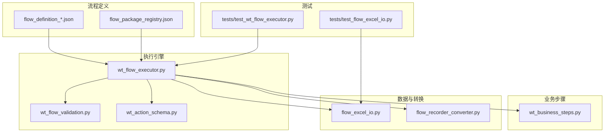
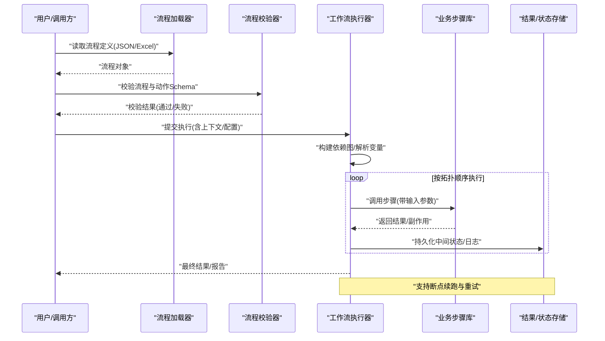
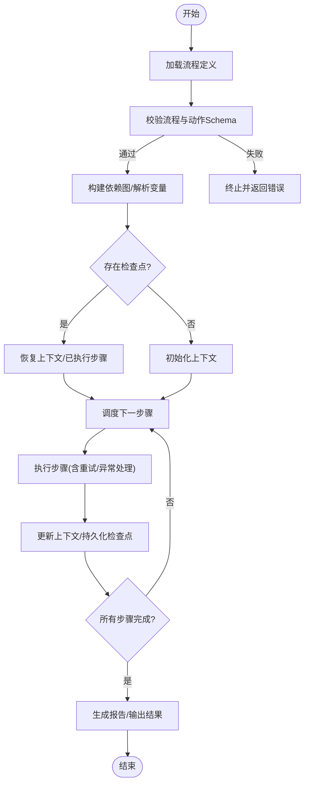
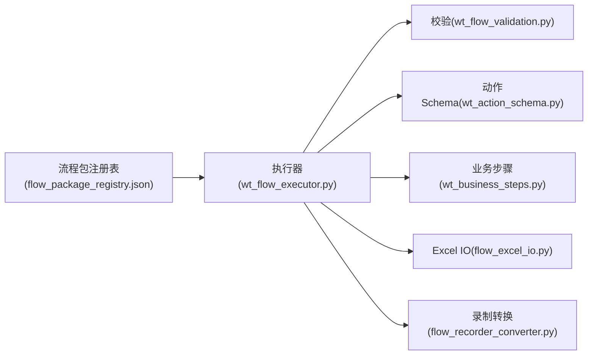

# 多步骤工作流编排

<cite>
**本文引用的文件**   
- [wt_flow_executor.py](file://wt_flow_executor.py)
- [flow_excel_io.py](file://flow_excel_io.py)
- [flow_recorder_converter.py](file://flow_recorder_converter.py)
- [wt_flow_validation.py](file://wt_flow_validation.py)
- [wt_action_schema.py](file://wt_action_schema.py)
- [wt_business_steps.py](file://wt_business_steps.py)
- [flow_definition_microscale_create_model.json](file://flow_packages/flow_definition_microscale_create_model.json)
- [flow_definition_geo_import_data_file.json](file://flow_packages/flow_definition_geo_import_data_file.json)
- [flow_package_registry.json](file://flow_packages/flow_package_registry.json)
- [test_wt_flow_executor.py](file://tests/test_wt_flow_executor.py)
- [test_flow_excel_io.py](file://tests/test_flow_excel_io.py)
- [PROJECT_ARCHITECTURE.md](file://PROJECT_ARCHITECTURE.md)
</cite>

## 目录
1. [简介](#简介)
2. [项目结构](#项目结构)
3. [核心组件](#核心组件)
4. [架构总览](#架构总览)
5. [详细组件分析](#详细组件分析)
6. [依赖关系分析](#依赖关系分析)
7. [性能考虑](#性能考虑)
8. [故障排查指南](#故障排查指南)
9. [结论](#结论)
10. [附录](#附录)

## 简介
本文件围绕“复杂多步骤工作流的编排实现”展开，聚焦于步骤间的依赖关系与数据传递机制、条件分支与循环执行、并行处理、异常处理与重试、错误恢复与断点续跑，以及性能优化与监控告警。内容基于仓库中的工作流执行器、流程定义与测试用例进行系统化梳理，帮助读者从概念到落地全面掌握该系统的编排能力。

## 项目结构
本项目采用“流程定义 + 执行引擎 + 业务步骤 + 工具库”的分层组织方式：
- 流程定义：以 JSON 描述步骤序列、参数、依赖与数据流转，位于 flow_packages 与 samples/flows。
- 执行引擎：负责解析、调度、状态管理、错误处理与结果输出，核心在 wt_flow_executor.py。
- 业务步骤：封装具体 UI/业务操作，位于 wt_business_steps.py 等模块。
- 校验与模式：流程与动作的 Schema 校验，位于 wt_flow_validation.py 与 wt_action_schema.py。
- Excel 导入导出与录制转换：flow_excel_io.py 与 flow_recorder_converter.py。
- 测试：覆盖执行器、Excel IO、录制转换等关键路径，位于 tests 目录。

图表来源
- [wt_flow_executor.py](file://wt_flow_executor.py)
- [flow_excel_io.py](file://flow_excel_io.py)
- [flow_recorder_converter.py](file://flow_recorder_converter.py)
- [wt_flow_validation.py](file://wt_flow_validation.py)
- [wt_action_schema.py](file://wt_action_schema.py)
- [wt_business_steps.py](file://wt_business_steps.py)
- [flow_package_registry.json](file://flow_packages/flow_package_registry.json)
- [test_wt_flow_executor.py](file://tests/test_wt_flow_executor.py)
- [test_flow_excel_io.py](file://tests/test_flow_excel_io.py)

章节来源
- [PROJECT_ARCHITECTURE.md](file://PROJECT_ARCHITECTURE.md)

## 核心组件
- 工作流执行器（wt_flow_executor.py）
  - 职责：加载流程定义、解析步骤、维护运行上下文、调度执行、收集结果、持久化中间状态、支持重试与恢复。
  - 关键点：步骤依赖图构建、变量作用域与数据传递、条件分支与循环控制、并发执行策略、异常捕获与重试、检查点写入与恢复。
- 流程与动作校验（wt_flow_validation.py, wt_action_schema.py）
  - 职责：对流程定义与单个动作进行结构与语义校验，确保字段完整、类型正确、依赖可达。
- 业务步骤库（wt_business_steps.py）
  - 职责：封装可复用的 UI 或业务操作，作为执行器的可调单元。
- Excel 导入导出（flow_excel_io.py）
  - 职责：将流程定义与运行结果读写为 Excel，便于编辑与归档。
- 录制转换器（flow_recorder_converter.py）
  - 职责：将录制脚本转换为标准流程定义，降低编排门槛。
- 流程包注册表（flow_package_registry.json）
  - 职责：集中管理可用流程包的元信息与入口，便于发现与选择。

章节来源
- [wt_flow_executor.py](file://wt_flow_executor.py)
- [wt_flow_validation.py](file://wt_flow_validation.py)
- [wt_action_schema.py](file://wt_action_schema.py)
- [wt_business_steps.py](file://wt_business_steps.py)
- [flow_excel_io.py](file://flow_excel_io.py)
- [flow_recorder_converter.py](file://flow_recorder_converter.py)
- [flow_package_registry.json](file://flow_packages/flow_package_registry.json)

## 架构总览
下图展示了工作流从定义到执行的端到端路径，包括校验、调度、执行、结果输出与恢复。

图表来源
- [wt_flow_executor.py](file://wt_flow_executor.py)
- [wt_flow_validation.py](file://wt_flow_validation.py)
- [wt_action_schema.py](file://wt_action_schema.py)
- [wt_business_steps.py](file://wt_business_steps.py)
- [flow_excel_io.py](file://flow_excel_io.py)

## 详细组件分析

### 工作流执行器（wt_flow_executor.py）
- 设计要点
  - 步骤依赖与拓扑排序：根据步骤声明的依赖关系构建有向无环图，保证执行顺序正确。
  - 数据传递：使用上下文变量字典，支持步骤间引用与表达式求值；提供作用域隔离与合并策略。
  - 条件分支：在步骤级或子流程级支持条件判断，动态决定执行路径。
  - 循环执行：对集合型输入进行迭代，支持步进式推进与中断恢复。
  - 并行处理：对无相互依赖的步骤进行并发执行，提升吞吐；需保证共享资源访问安全。
  - 异常与重试：统一捕获异常，记录堆栈与上下文快照；支持指数退避与最大重试次数。
  - 断点续跑：定期写入检查点（步骤ID、上下文、进度），崩溃后从最近检查点恢复。
  - 结果与报告：聚合各步骤输出，生成结构化报告与可视化摘要。
- 关键流程
  - 初始化：加载流程定义、解析变量、构建依赖图、准备检查点路径。
  - 执行主循环：按拓扑序或并行度调度步骤，更新上下文与状态。
  - 恢复逻辑：若存在检查点，跳过已完成步骤并恢复上下文。
  - 收尾：汇总结果、清理临时文件、输出报告。

图表来源
- [wt_flow_executor.py](file://wt_flow_executor.py)

章节来源
- [wt_flow_executor.py](file://wt_flow_executor.py)
- [test_wt_flow_executor.py](file://tests/test_wt_flow_executor.py)

### 流程与动作校验（wt_flow_validation.py, wt_action_schema.py）
- 职责
  - 流程级校验：步骤完整性、依赖可达性、循环依赖检测、变量引用有效性。
  - 动作级校验：字段必填、类型约束、枚举值范围、互斥/依赖字段组合。
- 典型行为
  - 遇到不合法定义时，返回详细的错误定位与修复建议。
  - 支持扩展自定义校验规则，适配不同业务场景。

章节来源
- [wt_flow_validation.py](file://wt_flow_validation.py)
- [wt_action_schema.py](file://wt_action_schema.py)

### 业务步骤库（wt_business_steps.py）
- 职责
  - 封装具体的 UI 交互或业务操作，暴露统一的输入输出接口。
  - 内部处理等待、重试、截图与日志，提高鲁棒性。
- 设计原则
  - 幂等性：尽量保证重复执行不会产生副作用。
  - 可观测性：输出结构化日志与指标，便于追踪。

章节来源
- [wt_business_steps.py](file://wt_business_steps.py)

### Excel 导入导出（flow_excel_io.py）
- 职责
  - 将流程定义与运行结果读写为 Excel，便于非开发者编辑与归档。
  - 提供批量导入导出与模板填充能力。
- 注意事项
  - 大文件处理需关注内存占用与性能。
  - 数据类型映射与格式一致性。

章节来源
- [flow_excel_io.py](file://flow_excel_io.py)
- [test_flow_excel_io.py](file://tests/test_flow_excel_io.py)

### 录制转换器（flow_recorder_converter.py）
- 职责
  - 将录制脚本转换为标准流程定义，降低编排门槛。
  - 自动补全缺失字段、规范化命名与结构。
- 适用场景
  - 快速原型验证、从现有脚本迁移至工作流。

章节来源
- [flow_recorder_converter.py](file://flow_recorder_converter.py)

### 流程包注册表（flow_package_registry.json）
- 职责
  - 集中管理可用流程包的元信息（名称、版本、入口、依赖）。
  - 支持按标签筛选与版本选择。
- 使用方式
  - 执行器启动时加载注册表，提供流程发现与选择界面。

章节来源
- [flow_package_registry.json](file://flow_packages/flow_package_registry.json)

### 示例流程定义
- 微尺度建模创建模型流程（flow_definition_microscale_create_model.json）
  - 展示多步骤串联、参数传递与条件分支的组合用法。
- 地理数据导入流程（flow_definition_geo_import_data_file.json）
  - 展示数据导入、校验与后续建模步骤的衔接。

章节来源
- [flow_definition_microscale_create_model.json](file://flow_packages/flow_definition_microscale_create_model.json)
- [flow_definition_geo_import_data_file.json](file://flow_packages/flow_definition_geo_import_data_file.json)

## 依赖关系分析
- 组件耦合
  - 执行器强依赖校验器与业务步骤库，弱依赖 Excel IO 与录制转换器。
  - 业务步骤库相对独立，可通过插件机制扩展。
- 外部集成点
  - UI 自动化后端（如 pywinauto/uiapeek）由业务步骤库封装，执行器无需感知细节。
  - 文件系统用于检查点与结果持久化。
- 潜在风险
  - 循环依赖需在流程定义阶段严格检测。
  - 并发执行时需避免共享资源的竞态条件。

图表来源
- [wt_flow_executor.py](file://wt_flow_executor.py)
- [wt_flow_validation.py](file://wt_flow_validation.py)
- [wt_action_schema.py](file://wt_action_schema.py)
- [wt_business_steps.py](file://wt_business_steps.py)
- [flow_excel_io.py](file://flow_excel_io.py)
- [flow_recorder_converter.py](file://flow_recorder_converter.py)
- [flow_package_registry.json](file://flow_packages/flow_package_registry.json)

章节来源
- [wt_flow_executor.py](file://wt_flow_executor.py)
- [flow_package_registry.json](file://flow_packages/flow_package_registry.json)

## 性能考虑
- 并行执行
  - 对无依赖步骤启用并发，合理设置最大并发数以避免资源争用。
  - 对 I/O 密集型步骤与 CPU 密集型步骤分别评估并发策略。
- 检查点粒度
  - 平衡检查点频率与持久化开销，避免频繁写入影响吞吐。
- 缓存与复用
  - 对昂贵计算或 UI 初始化结果进行缓存，减少重复开销。
- 资源限制
  - 限制单进程内存与句柄使用，防止长时间运行导致泄漏。
- 监控与告警
  - 采集关键指标（步骤耗时、成功率、重试次数、检查点大小），接入告警系统。
  - 对慢步骤与高频失败步骤进行阈值告警。

[本节为通用指导，不涉及具体文件分析]

## 故障排查指南
- 常见问题
  - 流程定义不合法：查看校验错误详情，修正字段与依赖。
  - 步骤执行失败：检查业务步骤日志与截图，确认 UI 元素是否存在。
  - 并发冲突：调整并发度或增加同步保护。
  - 检查点损坏：清理旧检查点并从头执行。
- 诊断手段
  - 开启详细日志与调试开关，定位失败步骤与上下文快照。
  - 使用 Excel 导出运行结果，对比期望与实际差异。
  - 针对录制转换生成的流程，逐步简化以定位问题。

章节来源
- [test_wt_flow_executor.py](file://tests/test_wt_flow_executor.py)
- [test_flow_excel_io.py](file://tests/test_flow_excel_io.py)

## 结论
本工作流编排方案通过“定义驱动 + 执行引擎 + 业务步骤”的分层架构，实现了复杂多步骤任务的可靠编排。依托校验、依赖解析、条件分支、循环与并行、异常重试与断点续跑等能力，可在实际业务场景中稳定落地。配合性能优化与监控告警，可进一步提升效率与可观测性。

[本节为总结，不涉及具体文件分析]

## 附录
- 术语
  - 流程定义：描述步骤、参数、依赖与数据流转的结构化文档。
  - 检查点：运行时保存的状态快照，用于恢复执行。
  - 拓扑排序：依据依赖关系确定步骤执行顺序的方法。
- 最佳实践
  - 保持步骤幂等与可观测性。
  - 明确数据边界与作用域，避免隐式共享。
  - 为关键步骤设置超时与重试策略。
  - 定期归档检查点与结果，便于审计与回溯。

[本节为补充说明，不涉及具体文件分析]