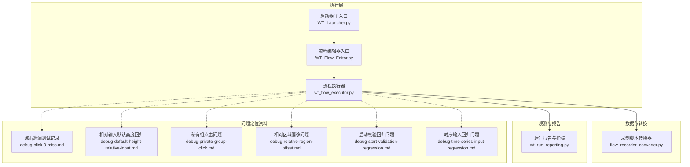
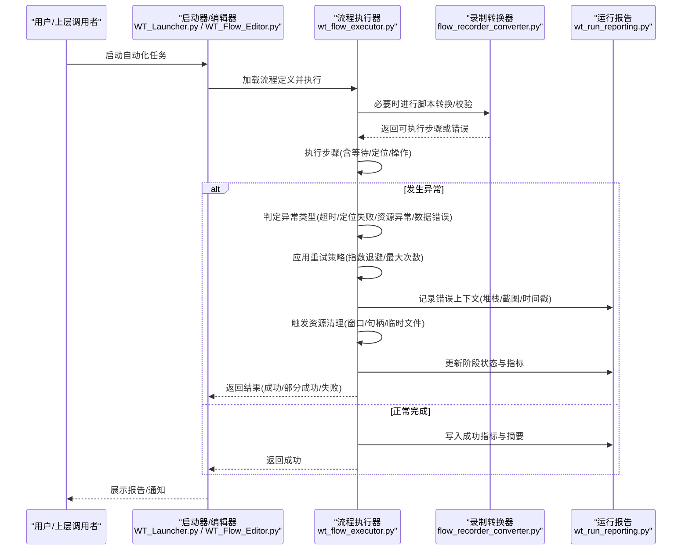
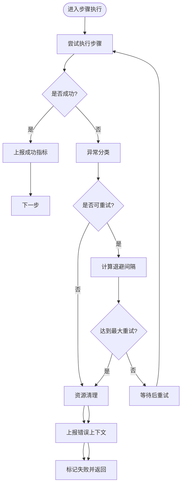
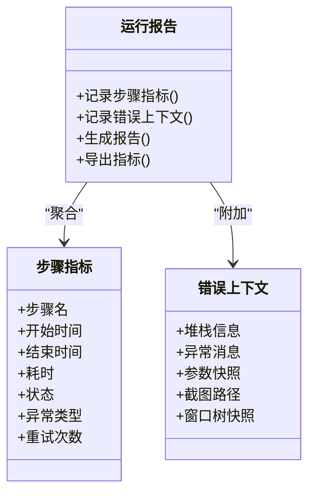
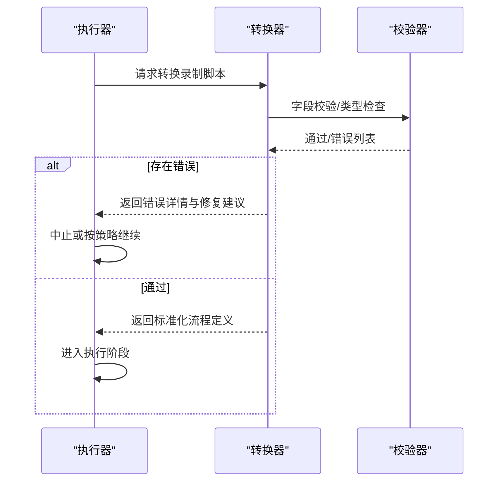
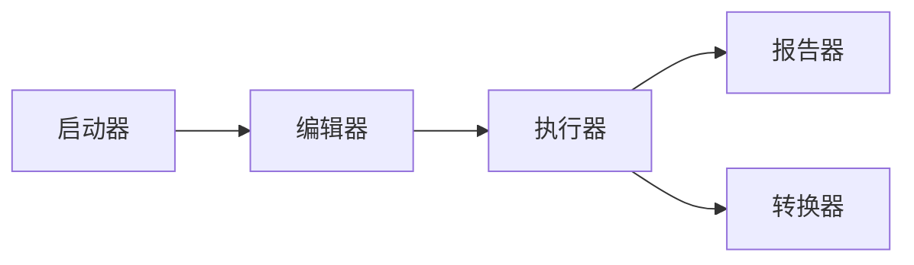

# 异常处理和恢复机制

<cite>
**本文引用的文件**   
- [wt_flow_executor.py](file://wt_flow_executor.py)
- [wt_run_reporting.py](file://wt_run_reporting.py)
- [flow_recorder_converter.py](file://flow_recorder_converter.py)
- [WT_Flow_Editor.py](file://WT_Flow_Editor.py)
- [WT_Launcher.py](file://WT_Launcher.py)
- [debug-click-9-miss.md](file://debug-click-9-miss.md)
- [debug-default-height-relative-input.md](file://debug-default-height-relative-input.md)
- [debug-private-group-click.md](file://debug-private-group-click.md)
- [debug-relative-region-offset.md](file://debug-relative-region-offset.md)
- [debug-start-validation-regression.md](file://debug-start-validation-regression.md)
- [debug-time-series-input-regression.md](file://debug-time-series-input-regression.md)
</cite>

## 目录
1. [简介](#简介)
2. [项目结构](#项目结构)
3. [核心组件](#核心组件)
4. [架构总览](#架构总览)
5. [详细组件分析](#详细组件分析)
6. [依赖关系分析](#依赖关系分析)
7. [性能考虑](#性能考虑)
8. [故障诊断指南](#故障诊断指南)
9. [结论](#结论)
10. [附录](#附录)

## 简介
本文件面向自动化流程的异常处理与恢复机制，聚焦于以下目标：
- 识别并分类异常类型（UI定位失败、超时、资源未释放、数据校验错误等）
- 设计重试策略、超时控制与资源清理方案
- 建立日志记录与错误追踪的最佳实践
- 提供故障诊断和问题排查的工具与方法
- 给出实际异常处理案例与配置示例
- 说明监控告警与通知机制的设置建议

## 项目结构
围绕异常处理与恢复的关键代码集中在执行器、报告器、录制转换器以及若干调试文档中。下图展示了与异常处理相关的主要模块及其职责边界。

图表来源
- [wt_flow_executor.py](file://wt_flow_executor.py)
- [wt_run_reporting.py](file://wt_run_reporting.py)
- [flow_recorder_converter.py](file://flow_recorder_converter.py)
- [WT_Flow_Editor.py](file://WT_Flow_Editor.py)
- [WT_Launcher.py](file://WT_Launcher.py)
- [debug-click-9-miss.md](file://debug-click-9-miss.md)
- [debug-default-height-relative-input.md](file://debug-default-height-relative-input.md)
- [debug-private-group-click.md](file://debug-private-group-click.md)
- [debug-relative-region-offset.md](file://debug-relative-region-offset.md)
- [debug-start-validation-regression.md](file://debug-start-validation-regression.md)
- [debug-time-series-input-regression.md](file://debug-time-series-input-regression.md)

章节来源
- [wt_flow_executor.py](file://wt_flow_executor.py)
- [wt_run_reporting.py](file://wt_run_reporting.py)
- [flow_recorder_converter.py](file://flow_recorder_converter.py)
- [WT_Flow_Editor.py](file://WT_Flow_Editor.py)
- [WT_Launcher.py](file://WT_Launcher.py)
- [debug-click-9-miss.md](file://debug-click-9-miss.md)
- [debug-default-height-relative-input.md](file://debug-default-height-relative-input.md)
- [debug-private-group-click.md](file://debug-private-group-click.md)
- [debug-relative-region-offset.md](file://debug-relative-region-offset.md)
- [debug-start-validation-regression.md](file://debug-start-validation-regression.md)
- [debug-time-series-input-regression.md](file://debug-time-series-input-regression.md)

## 核心组件
- 流程执行器：负责步骤调度、异常捕获、重试与回滚、资源清理、状态上报。
- 运行报告：负责收集执行指标、错误上下文、截图/快照、生成可追溯的报告。
- 录制转换器：将录制脚本转换为可执行流程定义，包含参数化与校验逻辑，有助于在早期发现异常。
- 编辑器与启动器：作为用户交互与进程入口，承担顶层异常兜底、崩溃保护与重启引导。

章节来源
- [wt_flow_executor.py](file://wt_flow_executor.py)
- [wt_run_reporting.py](file://wt_run_reporting.py)
- [flow_recorder_converter.py](file://flow_recorder_converter.py)
- [WT_Flow_Editor.py](file://WT_Flow_Editor.py)
- [WT_Launcher.py](file://WT_Launcher.py)

## 架构总览
下图展示一次典型流程执行的异常处理与恢复路径，包括重试、超时、清理与报告输出。

图表来源
- [wt_flow_executor.py](file://wt_flow_executor.py)
- [wt_run_reporting.py](file://wt_run_reporting.py)
- [flow_recorder_converter.py](file://flow_recorder_converter.py)
- [WT_Flow_Editor.py](file://WT_Flow_Editor.py)
- [WT_Launcher.py](file://WT_Launcher.py)

## 详细组件分析

### 流程执行器：异常识别、重试与恢复
- 异常识别
  - UI定位类异常：控件不可见、层级变化、相对坐标漂移、窗口标题变更等。
  - 超时类异常：等待条件不满足、外部系统响应慢、渲染未完成。
  - 资源类异常：窗口未关闭、句柄泄漏、临时文件未清理。
  - 数据类异常：参数缺失、格式错误、业务规则校验失败。
- 重试策略
  - 基于异常类型的差异化重试：定位失败采用短间隔快速重试；网络/IO类采用指数退避。
  - 最大重试次数与全局超时控制，避免无限重试。
  - 幂等性检查：对可重复操作增加前置状态校验，防止副作用放大。
- 资源清理
  - finally/ensure块确保窗口关闭、进程退出、临时文件删除。
  - 资源池管理：限制并发打开的资源数量，及时回收。
- 状态上报
  - 每步执行前后上报开始/结束时间、耗时、状态码。
  - 异常时附带上下文：当前步骤、参数、截图、窗口树快照。

图表来源
- [wt_flow_executor.py](file://wt_flow_executor.py)

章节来源
- [wt_flow_executor.py](file://wt_flow_executor.py)

### 运行报告：错误追踪与可视化
- 指标采集
  - 步骤级：开始/结束时间、耗时、状态、异常类型、重试次数。
  - 流程级：总时长、成功率、失败分布、关键路径耗时。
- 错误上下文
  - 堆栈信息、异常消息、参数快照、截图/录屏片段、窗口树快照。
- 报告输出
  - 结构化JSON/HTML报告，便于检索与聚合。
  - 指标导出到监控系统（可选）。

图表来源
- [wt_run_reporting.py](file://wt_run_reporting.py)

章节来源
- [wt_run_reporting.py](file://wt_run_reporting.py)

### 录制转换器：早期异常检测与规范化
- 作用
  - 将录制脚本转换为标准化流程定义，统一字段命名与必填校验。
  - 在转换阶段尽早暴露参数缺失、类型错误、引用不存在等问题。
- 异常处理
  - 转换失败时输出详细错误位置与建议修复。
  - 支持跳过错误步骤并继续转换（可配置），便于渐进式修复。

图表来源
- [flow_recorder_converter.py](file://flow_recorder_converter.py)

章节来源
- [flow_recorder_converter.py](file://flow_recorder_converter.py)

### 编辑器与启动器：顶层兜底与用户体验
- 启动器
  - 进程级异常兜底：捕获未处理异常，生成最小可用报告，提示用户重试或重启。
  - 自动重启策略：针对可恢复错误（如UI无响应）提供一键重启选项。
- 编辑器
  - 保存前校验：对流程定义进行基础合法性检查，减少运行时异常。
  - 错误高亮与定位：在界面标注问题步骤与原因。

章节来源
- [WT_Flow_Editor.py](file://WT_Flow_Editor.py)
- [WT_Launcher.py](file://WT_Launcher.py)

## 依赖关系分析
- 低耦合设计
  - 执行器依赖报告器与转换器，但不直接依赖具体UI后端，便于替换与扩展。
- 潜在循环依赖
  - 若转换器在执行期反向调用执行器，需引入接口抽象以避免循环。
- 外部依赖
  - UI自动化库、图像匹配库、文件系统、截图工具等，需在异常路径中妥善处理其生命周期。

图表来源
- [wt_flow_executor.py](file://wt_flow_executor.py)
- [wt_run_reporting.py](file://wt_run_reporting.py)
- [flow_recorder_converter.py](file://flow_recorder_converter.py)
- [WT_Flow_Editor.py](file://WT_Flow_Editor.py)
- [WT_Launcher.py](file://WT_Launcher.py)

章节来源
- [wt_flow_executor.py](file://wt_flow_executor.py)
- [wt_run_reporting.py](file://wt_run_reporting.py)
- [flow_recorder_converter.py](file://flow_recorder_converter.py)
- [WT_Flow_Editor.py](file://WT_Flow_Editor.py)
- [WT_Launcher.py](file://WT_Launcher.py)

## 性能考虑
- 重试退避
  - 使用指数退避+抖动，避免雪崩效应。
- 超时控制
  - 设置合理的步骤级与流程级超时，结合等待条件优化，减少无效等待。
- 资源占用
  - 限制并发度，及时释放窗口/句柄/临时文件，避免内存泄漏。
- 报告开销
  - 异步写入报告，批量聚合指标，降低I/O阻塞。

[本节为通用指导，无需特定文件来源]

## 故障诊断指南
- 常见问题定位
  - 点击遗漏：检查相对坐标与窗口缩放、DPI适配、控件可见性。
  - 相对输入默认高度回归：确认输入框高度变化导致的偏移补偿是否正确。
  - 私有组点击问题：验证分组展开/折叠状态与控件索引稳定性。
  - 相对区域偏移：核对参考控件选择与偏移计算逻辑。
  - 启动校验回归：检查初始化顺序与前置条件。
  - 时序输入回归：确认数据格式与解析容错。
- 诊断工具与方法
  - 启用详细日志与截图，定位失败瞬间的UI状态。
  - 使用窗口树快照对比差异，辅助定位控件变化。
  - 回放失败步骤的最小复现用例，隔离环境因素。
  - 结合报告中的指标趋势，识别间歇性问题。

章节来源
- [debug-click-9-miss.md](file://debug-click-9-miss.md)
- [debug-default-height-relative-input.md](file://debug-default-height-relative-input.md)
- [debug-private-group-click.md](file://debug-private-group-click.md)
- [debug-relative-region-offset.md](file://debug-relative-region-offset.md)
- [debug-start-validation-regression.md](file://debug-start-validation-regression.md)
- [debug-time-series-input-regression.md](file://debug-time-series-input-regression.md)

## 结论
通过分层异常识别、差异化重试、严格超时控制与完善的资源清理，配合详尽的错误上下文与报告输出，自动化流程能够在复杂UI环境中保持稳定与可恢复。建议在持续集成中引入报告聚合与告警，形成闭环的质量保障体系。

[本节为总结性内容，无需特定文件来源]

## 附录

### 配置示例（概念性）
- 重试策略
  - 最大重试次数：根据异常类型分别配置（例如定位失败3次，网络失败5次）。
  - 初始退避间隔：例如1秒，指数增长上限不超过30秒。
  - 抖动因子：随机化退避，避免集中重试。
- 超时控制
  - 步骤级超时：默认30秒，关键步骤可调至60秒。
  - 流程级超时：默认10分钟，长流程可按比例调整。
- 资源清理
  - 强制关闭未响应窗口，清理临时文件与缓存。
- 报告与监控
  - 报告格式：JSON+HTML双输出。
  - 指标导出：Prometheus/Grafana或企业监控平台。
  - 告警规则：失败率阈值、连续失败次数、关键步骤超时。

[本节为概念性配置说明，无需特定文件来源]