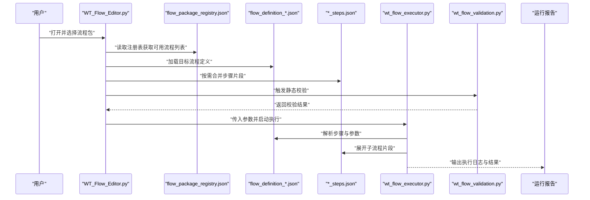
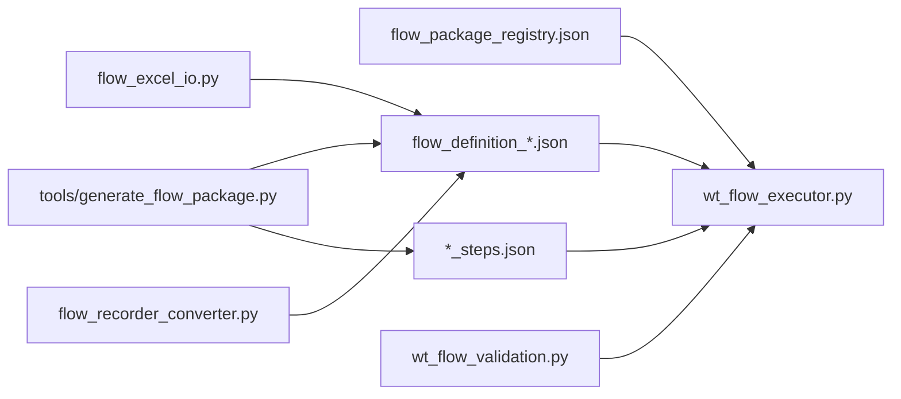

# 流程包使用指南

<cite>
**本文引用的文件**   
- [flow_packages/flow_package_registry.json](file://flow_packages/flow_package_registry.json)
- [flow_packages/flow_definition_geo_import_data_file.json](file://flow_packages/flow_definition_geo_import_data_file.json)
- [flow_packages/flow_definition_microscale_create_model.json](file://flow_packages/flow_definition_microscale_create_model.json)
- [flow_packages/flow_definition_turbine_type_create_and_curves.json](file://flow_packages/flow_definition_turbine_type_create_and_curves.json)
- [flow_packages/flow_definition_创建一个新建模.json](file://flow_packages/flow_definition_创建一个新建模.json)
- [flow_packages/flow_definition_导入测风塔、机位点.json](file://flow_packages/flow_definition_导入测风塔、机位点.json)
- [flow_packages/flow_definition_新建风机类型.json](file://flow_packages/flow_definition_新建风机类型.json)
- [flow_packages/flow_definition_测试.json](file://flow_packages/flow_definition_测试.json)
- [flow_packages/气象数据录入_CFE02_steps.json](file://flow_packages/气象数据录入_CFE02_steps.json)
- [samples/flows/flow_definition_gm_sample.json](file://samples/flows/flow_definition_gm_sample.json)
- [samples/flows/flow_definition_新建风机类型.json](file://samples/flows/flow_definition_新建风机类型.json)
- [samples/flows/气象数据录入_20260625_converted_flow.json](file://samples/flows/气象数据录入_20260625_converted_flow.json)
- [tools/generate_flow_package.py](file://tools/generate_flow_package.py)
- [wt_flow_executor.py](file://wt_flow_executor.py)
- [wt_flow_validation.py](file://wt_flow_validation.py)
- [flow_excel_io.py](file://flow_excel_io.py)
- [flow_recorder_converter.py](file://flow_recorder_converter.py)
- [WT_Flow_Editor.py](file://WT_Flow_Editor.py)
</cite>

## 目录
1. [简介](#简介)
2. [项目结构](#项目结构)
3. [核心组件](#核心组件)
4. [架构总览](#架构总览)
5. [详细组件分析](#详细组件分析)
6. [依赖关系分析](#依赖关系分析)
7. [性能考虑](#性能考虑)
8. [故障排查指南](#故障排查指南)
9. [结论](#结论)
10. [附录](#附录)

## 简介
本指南面向需要编写、运行、管理与共享“流程包”的用户与开发者，系统介绍流程包的结构定义、JSON配置语法规范、参数化配置方法、版本管理与兼容性策略，以及导入、导出与共享机制。文档同时提供基于仓库现有示例的实操路径与最佳实践建议，帮助读者快速上手并稳定落地自动化操作。

## 项目结构
流程包相关资源主要位于 flow_packages 与 samples/flows 两个目录：
- flow_packages：存放已注册或可复用的流程包定义与步骤片段，包含一个全局注册表用于集中管理可用流程包元信息。
- samples/flows：提供若干示例流程包，便于学习与二次改造。
- tools/generate_flow_package.py：提供生成流程包的辅助工具脚本。
- wt_flow_executor.py、wt_flow_validation.py：负责执行与校验流程包的核心逻辑。
- flow_excel_io.py、flow_recorder_converter.py：分别支持从Excel读写流程、将录制脚本转换为流程包。
- WT_Flow_Editor.py：可视化编辑入口（如适用）。

```mermaid
graph TB
subgraph "流程包资源"
REG["flow_package_registry.json"]
F1["flow_definition_geo_import_data_file.json"]
F2["flow_definition_microscale_create_model.json"]
F3["flow_definition_turbine_type_create_and_curves.json"]
F4["flow_definition_创建一个新建模.json"]
F5["flow_definition_导入测风塔、机位点.json"]
F6["flow_definition_新建风机类型.json"]
F7["flow_definition_测试.json"]
S1["气象数据录入_CFE02_steps.json"]
end
subgraph "示例"
EX1["samples/flows/flow_definition_gm_sample.json"]
EX2["samples/flows/flow_definition_新建风机类型.json"]
EX3["samples/flows/气象数据录入_20260625_converted_flow.json"]
end
subgraph "工具与运行时"
GEN["tools/generate_flow_package.py"]
EXEC["wt_flow_executor.py"]
VALID["wt_flow_validation.py"]
XLS["flow_excel_io.py"]
REC["flow_recorder_converter.py"]
EDIT["WT_Flow_Editor.py"]
end
REG --> EXEC
F1 --> EXEC
F2 --> EXEC
F3 --> EXEC
F4 --> EXEC
F5 --> EXEC
F6 --> EXEC
F7 --> EXEC
S1 --> EXEC
EX1 --> EXEC
EX2 --> EXEC
EX3 --> EXEC
GEN --> F1
GEN --> F2
GEN --> F3
GEN --> F4
GEN --> F5
GEN --> F6
GEN --> F7
GEN --> S1
XLS --> F1
XLS --> F2
XLS --> F3
XLS --> F4
XLS --> F5
XLS --> F6
XLS --> F7
XLS --> S1
REC --> EX3
EDIT --> EXEC
VALID --> EXEC
```

图表来源
- [flow_packages/flow_package_registry.json](file://flow_packages/flow_package_registry.json)
- [flow_packages/flow_definition_geo_import_data_file.json](file://flow_packages/flow_definition_geo_import_data_file.json)
- [flow_packages/flow_definition_microscale_create_model.json](file://flow_packages/flow_definition_microscale_create_model.json)
- [flow_packages/flow_definition_turbine_type_create_and_curves.json](file://flow_packages/flow_definition_turbine_type_create_and_curves.json)
- [flow_packages/flow_definition_创建一个新建模.json](file://flow_packages/flow_definition_创建一个新建模.json)
- [flow_packages/flow_definition_导入测风塔、机位点.json](file://flow_packages/flow_definition_导入测风塔、机位点.json)
- [flow_packages/flow_definition_新建风机类型.json](file://flow_packages/flow_definition_新建风机类型.json)
- [flow_packages/flow_definition_测试.json](file://flow_packages/flow_definition_测试.json)
- [flow_packages/气象数据录入_CFE02_steps.json](file://flow_packages/气象数据录入_CFE02_steps.json)
- [samples/flows/flow_definition_gm_sample.json](file://samples/flows/flow_definition_gm_sample.json)
- [samples/flows/flow_definition_新建风机类型.json](file://samples/flows/flow_definition_新建风机类型.json)
- [samples/flows/气象数据录入_20260625_converted_flow.json](file://samples/flows/气象数据录入_20260625_converted_flow.json)
- [tools/generate_flow_package.py](file://tools/generate_flow_package.py)
- [wt_flow_executor.py](file://wt_flow_executor.py)
- [wt_flow_validation.py](file://wt_flow_validation.py)
- [flow_excel_io.py](file://flow_excel_io.py)
- [flow_recorder_converter.py](file://flow_recorder_converter.py)
- [WT_Flow_Editor.py](file://WT_Flow_Editor.py)

章节来源
- [flow_packages/flow_package_registry.json](file://flow_packages/flow_package_registry.json)
- [tools/generate_flow_package.py](file://tools/generate_flow_package.py)
- [wt_flow_executor.py](file://wt_flow_executor.py)
- [wt_flow_validation.py](file://wt_flow_validation.py)
- [flow_excel_io.py](file://flow_excel_io.py)
- [flow_recorder_converter.py](file://flow_recorder_converter.py)
- [WT_Flow_Editor.py](file://WT_Flow_Editor.py)

## 核心组件
- 流程包注册表（flow_package_registry.json）
  - 作用：集中声明可用的流程包清单及其元信息（如名称、描述、版本、入口文件等），供编辑器或执行器统一发现与加载。
  - 关键要点：确保每个条目指向有效的流程定义文件；为后续版本管理与兼容性检查提供基础。
- 流程定义文件（flow_definition_*.json）
  - 作用：以JSON描述一个完整流程的步骤序列、输入参数、动作与断言等。
  - 关键要点：遵循统一的字段命名与约束；通过参数占位符实现可复用与可配置。
- 步骤片段（*_steps.json）
  - 作用：将常用子流程抽取为可复用的步骤片段，供主流程引用组合。
- 示例流程（samples/flows/*）
  - 作用：提供可直接运行的参考模板，便于快速上手与二次定制。
- 生成与转换工具
  - generate_flow_package.py：根据模板或向导生成标准流程包。
  - flow_recorder_converter.py：将录制脚本转换为流程包格式。
  - flow_excel_io.py：在Excel与流程包之间进行双向转换，便于非代码人员维护。
- 执行与校验
  - wt_flow_executor.py：加载注册表与流程定义，解析参数，按序执行步骤，输出结果与报告。
  - wt_flow_validation.py：对流程包进行静态校验（必填字段、类型、依赖等），提前发现问题。

章节来源
- [flow_packages/flow_package_registry.json](file://flow_packages/flow_package_registry.json)
- [flow_packages/flow_definition_geo_import_data_file.json](file://flow_packages/flow_definition_geo_import_data_file.json)
- [flow_packages/flow_definition_microscale_create_model.json](file://flow_packages/flow_definition_microscale_create_model.json)
- [flow_packages/flow_definition_turbine_type_create_and_curves.json](file://flow_packages/flow_definition_turbine_type_create_and_curves.json)
- [flow_packages/flow_definition_创建一个新建模.json](file://flow_packages/flow_definition_创建一个新建模.json)
- [flow_packages/flow_definition_导入测风塔、机位点.json](file://flow_packages/flow_definition_导入测风塔、机位点.json)
- [flow_packages/flow_definition_新建风机类型.json](file://flow_packages/flow_definition_新建风机类型.json)
- [flow_packages/flow_definition_测试.json](file://flow_packages/flow_definition_测试.json)
- [flow_packages/气象数据录入_CFE02_steps.json](file://flow_packages/气象数据录入_CFE02_steps.json)
- [samples/flows/flow_definition_gm_sample.json](file://samples/flows/flow_definition_gm_sample.json)
- [samples/flows/flow_definition_新建风机类型.json](file://samples/flows/flow_definition_新建风机类型.json)
- [samples/flows/气象数据录入_20260625_converted_flow.json](file://samples/flows/气象数据录入_20260625_converted_flow.json)
- [tools/generate_flow_package.py](file://tools/generate_flow_package.py)
- [flow_recorder_converter.py](file://flow_recorder_converter.py)
- [flow_excel_io.py](file://flow_excel_io.py)
- [wt_flow_executor.py](file://wt_flow_executor.py)
- [wt_flow_validation.py](file://wt_flow_validation.py)

## 架构总览
下图展示了从“选择流程包”到“执行与报告”的整体调用链，以及注册表、定义文件、步骤片段、转换器与执行器的协作关系。

图表来源
- [WT_Flow_Editor.py](file://WT_Flow_Editor.py)
- [flow_packages/flow_package_registry.json](file://flow_packages/flow_package_registry.json)
- [flow_packages/flow_definition_geo_import_data_file.json](file://flow_packages/flow_definition_geo_import_data_file.json)
- [flow_packages/气象数据录入_CFE02_steps.json](file://flow_packages/气象数据录入_CFE02_steps.json)
- [wt_flow_executor.py](file://wt_flow_executor.py)
- [wt_flow_validation.py](file://wt_flow_validation.py)

## 详细组件分析

### 流程包注册表（flow_package_registry.json）
- 职责
  - 集中登记所有可用的流程包，提供名称、描述、版本、入口文件路径等元信息。
  - 作为编辑器与执行器的统一发现源，避免硬编码路径。
- 使用方式
  - 新增流程包后，需在注册表中添加对应条目，以便被识别与展示。
  - 删除或迁移流程包时，同步更新注册表，保持清单一致性。
- 注意事项
  - 确保入口文件路径正确且可访问。
  - 为每个条目维护版本号，便于后续兼容性与回滚策略。

章节来源
- [flow_packages/flow_package_registry.json](file://flow_packages/flow_package_registry.json)

### 流程定义文件（flow_definition_*.json）
- 角色定位
  - 描述一个完整的自动化流程，包括基本信息、参数、步骤序列、条件分支、错误处理与断言等。
- 典型字段（概念性说明）
  - 基本信息：名称、描述、版本、作者、创建时间等。
  - 参数定义：参数名、类型、默认值、是否必填、取值范围或枚举等。
  - 步骤序列：顺序执行的步骤集合，每个步骤包含动作、目标对象、输入数据、等待与重试策略等。
  - 子流程引用：通过步骤片段ID或文件路径引入公共片段。
  - 断言与验证：执行后的期望状态或返回值校验。
- 参数化与占位符
  - 建议在流程定义中使用参数占位符，并在执行时注入具体值，提升复用性。
  - 对于复杂场景，可将参数组织为分组，便于UI呈现与校验。
- 最佳实践
  - 将通用逻辑下沉到步骤片段，减少重复。
  - 为关键步骤增加断言，提高稳定性与可观测性。
  - 合理拆分大流程，避免单文件过大导致维护困难。

章节来源
- [flow_packages/flow_definition_geo_import_data_file.json](file://flow_packages/flow_definition_geo_import_data_file.json)
- [flow_packages/flow_definition_microscale_create_model.json](file://flow_packages/flow_definition_microscale_create_model.json)
- [flow_packages/flow_definition_turbine_type_create_and_curves.json](file://flow_packages/flow_definition_turbine_type_create_and_curves.json)
- [flow_packages/flow_definition_创建一个新建模.json](file://flow_packages/flow_definition_创建一个新建模.json)
- [flow_packages/flow_definition_导入测风塔、机位点.json](file://flow_packages/flow_definition_导入测风塔、机位点.json)
- [flow_packages/flow_definition_新建风机类型.json](file://flow_packages/flow_definition_新建风机类型.json)
- [flow_packages/flow_definition_测试.json](file://flow_packages/flow_definition_测试.json)

### 步骤片段（*_steps.json）
- 角色定位
  - 将常用子流程封装为可复用的片段，供多个流程组合调用。
- 使用方式
  - 在主流程中通过片段ID或文件路径引用片段，实现“拼装式”流程构建。
- 设计建议
  - 片段粒度适中，既不过于细碎也不过于庞大。
  - 为片段明确输入输出约定，便于跨流程复用。

章节来源
- [flow_packages/气象数据录入_CFE02_steps.json](file://flow_packages/气象数据录入_CFE02_steps.json)

### 示例流程（samples/flows/*）
- 用途
  - 提供可直接运行的参考模板，涵盖常见业务场景（如地理数据导入、模型创建、风机类型与曲线管理等）。
- 学习路径
  - 先运行示例，理解整体结构与参数注入方式。
  - 在此基础上修改参数与步骤，逐步过渡到自定义流程。

章节来源
- [samples/flows/flow_definition_gm_sample.json](file://samples/flows/flow_definition_gm_sample.json)
- [samples/flows/flow_definition_新建风机类型.json](file://samples/flows/flow_definition_新建风机类型.json)
- [samples/flows/气象数据录入_20260625_converted_flow.json](file://samples/flows/气象数据录入_20260625_converted_flow.json)

### 生成与转换工具
- generate_flow_package.py
  - 作用：根据模板或向导生成标准流程包，保证结构一致性与字段完整性。
  - 适用场景：批量创建流程包、统一风格与命名规范。
- flow_recorder_converter.py
  - 作用：将录制脚本转换为流程包格式，降低手工编写门槛。
  - 适用场景：快速将人工操作录屏转化为可执行流程。
- flow_excel_io.py
  - 作用：在Excel与流程包之间进行双向转换，便于非代码人员维护与批量化配置。
  - 适用场景：业务人员通过表格维护流程参数与步骤。

章节来源
- [tools/generate_flow_package.py](file://tools/generate_flow_package.py)
- [flow_recorder_converter.py](file://flow_recorder_converter.py)
- [flow_excel_io.py](file://flow_excel_io.py)

### 执行与校验
- wt_flow_executor.py
  - 作用：加载注册表与流程定义，解析参数，按序执行步骤，输出结果与报告。
  - 关键点：参数注入、步骤展开、错误捕获与重试、断言评估。
- wt_flow_validation.py
  - 作用：对流程包进行静态校验，包括必填字段、类型、依赖关系等。
  - 价值：在运行前尽早发现问题，降低失败率。

章节来源
- [wt_flow_executor.py](file://wt_flow_executor.py)
- [wt_flow_validation.py](file://wt_flow_validation.py)

## 依赖关系分析
- 组件耦合
  - 执行器依赖注册表与流程定义；校验器独立于执行器但与其协同工作。
  - 生成器与转换器产出流程定义与步骤片段，供执行器消费。
- 外部依赖
  - Excel读写（flow_excel_io.py）、录制脚本解析（flow_recorder_converter.py）。
- 潜在风险
  - 注册表与实际文件不一致会导致加载失败。
  - 步骤片段变更需同步更新引用方，避免破坏契约。

图表来源
- [flow_packages/flow_package_registry.json](file://flow_packages/flow_package_registry.json)
- [flow_packages/flow_definition_geo_import_data_file.json](file://flow_packages/flow_definition_geo_import_data_file.json)
- [flow_packages/气象数据录入_CFE02_steps.json](file://flow_packages/气象数据录入_CFE02_steps.json)
- [tools/generate_flow_package.py](file://tools/generate_flow_package.py)
- [flow_excel_io.py](file://flow_excel_io.py)
- [flow_recorder_converter.py](file://flow_recorder_converter.py)
- [wt_flow_executor.py](file://wt_flow_executor.py)
- [wt_flow_validation.py](file://wt_flow_validation.py)

## 性能考虑
- 流程拆分与复用
  - 将高频逻辑下沉至步骤片段，减少重复执行开销。
- 参数预校验
  - 借助校验器在运行前完成参数合法性检查，避免无效执行。
- 并行与缓存
  - 若步骤间无强依赖，可在执行器层面考虑并行执行与中间结果缓存（需结合业务安全边界）。
- I/O优化
  - 批量Excel读写时注意分页与流式处理，避免内存峰值过高。

[本节为通用指导，不直接分析具体文件]

## 故障排查指南
- 常见问题
  - 注册表条目缺失或路径错误：检查 flow_package_registry.json 中的入口文件路径是否正确。
  - 流程定义字段不完整：使用 wt_flow_validation.py 进行静态校验，修复必填项与类型问题。
  - 参数未注入或类型不符：确认执行时的参数映射与默认值设置。
  - 步骤片段引用失败：核对片段ID或文件路径，确保片段存在且版本兼容。
- 调试建议
  - 启用更详细的执行日志，定位失败步骤。
  - 使用示例流程对比差异，逐步缩小问题范围。
  - 通过Excel导入导出功能，快速比对配置差异。

章节来源
- [flow_packages/flow_package_registry.json](file://flow_packages/flow_package_registry.json)
- [wt_flow_validation.py](file://wt_flow_validation.py)
- [flow_excel_io.py](file://flow_excel_io.py)

## 结论
流程包体系通过“注册表+定义文件+步骤片段”的组合，实现了高内聚、低耦合的可复用自动化能力。配合生成器、转换器与执行器，既能满足快速上手，也能支撑复杂业务的持续演进。建议团队在引入新流程时遵循统一规范，完善注册表与校验，并通过示例与模板加速落地。

[本节为总结性内容，不直接分析具体文件]

## 附录

### JSON配置语法规范（概念性说明）
- 基本结构
  - 顶层对象包含基本信息、参数定义、步骤序列、断言与扩展字段。
- 字段命名
  - 使用小写英文或下划线分隔，保持一致性。
- 数据类型
  - 字符串、数字、布尔、数组、对象等，需与执行器解析逻辑一致。
- 占位符与参数
  - 使用统一的占位符语法表示参数注入点，执行期替换为实际值。
- 版本与兼容性
  - 在基本信息中声明版本；执行器可根据版本策略进行兼容处理或提示升级。

[本节为概念性说明，不直接分析具体文件]

### 参数化配置方法与最佳实践
- 参数分组
  - 将环境相关、数据相关、控制开关等分类组织，便于管理与复用。
- 默认值与必填
  - 为可选参数提供合理默认值，必填参数给出清晰提示。
- 校验规则
  - 在定义中声明取值范围、枚举、正则等约束，配合校验器提前拦截。
- 多环境适配
  - 通过不同参数集切换开发、测试、生产环境，避免硬编码。

[本节为概念性说明，不直接分析具体文件]

### 版本管理与兼容性处理
- 版本策略
  - 采用语义化版本（主版本.次版本.修订号），重大变更递增主版本。
- 兼容性检查
  - 执行器在加载流程定义时进行版本匹配，必要时提示升级或降级。
- 回滚方案
  - 保留历史版本流程包与注册表快照，出现问题时可快速回退。

[本节为概念性说明，不直接分析具体文件]

### 导入、导出与共享机制
- 导入
  - 通过编辑器或命令行加载注册表，自动发现可用流程包。
- 导出
  - 使用生成器或Excel导出功能，将流程包标准化输出，便于归档与分发。
- 共享
  - 将流程包与注册表纳入版本控制系统，团队共同维护与评审。
  - 建立流程包目录规范与命名约定，提升可检索性。

[本节为概念性说明，不直接分析具体文件]

### 完整示例与模板路径
- 示例流程
  - [samples/flows/flow_definition_gm_sample.json](file://samples/flows/flow_definition_gm_sample.json)
  - [samples/flows/flow_definition_新建风机类型.json](file://samples/flows/flow_definition_新建风机类型.json)
  - [samples/flows/气象数据录入_20260625_converted_flow.json](file://samples/flows/气象数据录入_20260625_converted_flow.json)
- 步骤片段
  - [flow_packages/气象数据录入_CFE02_steps.json](file://flow_packages/气象数据录入_CFE02_steps.json)
- 注册表
  - [flow_packages/flow_package_registry.json](file://flow_packages/flow_package_registry.json)
- 生成与转换
  - [tools/generate_flow_package.py](file://tools/generate_flow_package.py)
  - [flow_recorder_converter.py](file://flow_recorder_converter.py)
  - [flow_excel_io.py](file://flow_excel_io.py)

[本节为路径指引，不直接分析具体文件]