# 数据录入自动化

<cite>
**本文引用的文件**   
- [README.md](file://README.md)
- [PROJECT_ARCHITECTURE.md](file://PROJECT_ARCHITECTURE.md)
- [WT_Automation.robot](file://WT_Automation.robot)
- [flow_excel_io.py](file://flow_excel_io.py)
- [test_flow_excel_io.py](file://tests/test_flow_excel_io.py)
- [flow_recorder_converter.py](file://flow_recorder_converter.py)
- [test_flow_recorder_converter.py](file://tests/test_flow_recorder_converter.py)
- [wt_flow_executor.py](file://wt_flow_executor.py)
- [wt_flow_validation.py](file://wt_flow_validation.py)
- [wt_action_schema.py](file://wt_action_schema.py)
- [wt_business_steps.py](file://wt_business_steps.py)
- [control_index.py](file://WT_AUTOMATION_Agent/control_index.py)
- [agent.py](file://WT_AUTOMATION_Agent/agent.py)
- [skill_bridge.py](file://WT_AUTOMATION_Agent/skill_bridge.py)
- [schemas.py](file://WT_AUTOMATION_Agent/schemas.py)
- [cli.py](file://WT_AUTOMATION_Agent/cli.py)
- [gui.py](file://WT_AUTOMATION_Agent/gui.py)
- [parameter_scan.py](file://WT_AUTOMATION_Agent/parameter_scan.py)
- [dispatch_keywords.resource](file://resources/dispatch_keywords.resource)
- [project_config.resource](file://resources/project_config.resource)
- [气象数据录入_CFE02_steps.json](file://flow_packages/气象数据录入_CFE02_steps.json)
- [flow_definition_导入测风塔、机位点.json](file://flow_packages/flow_definition_导入测风塔、机位点.json)
- [flow_definition_geo_import_data_file.json](file://flow_packages/flow_definition_geo_import_data_file.json)
- [flow_package_registry.json](file://flow_packages/flow_package_registry.json)
- [samples/flows/flow_definition_新建风机类型.json](file://samples/flows/flow_definition_新建风机类型.json)
- [samples/recorder_scripts/气象数据录入_20260625.py](file://samples/recorder_scripts/气象数据录入_20260625.py)
- [samples/recorder_scripts/Skill/combo_selector.py](file://samples/recorder_scripts/Skill/combo_selector.py)
- [samples/recorder_scripts/Skill/下拉操作示例说明.md](file://samples/recorder_scripts/Skill/下拉操作示例说明.md)
- [tools/generate_flow_package.py](file://tools/generate_flow_package.py)
- [tools/merge_standard_control_library.py](file://tools/merge_standard_control_library.py)
- [build_control_map_library.py](file://build_control_map_library.py)
- [build_image_template_library.py](file://build_image_template_library.py)
- [control_maps/总控件信息.json](file://control_maps/总控件信息.json)
- [control_maps/library_气象对象_WPF_controls.json](file://control_maps/library_气象对象_WPF_controls.json)
- [control_maps/library_导入时间序列文件_WPF_controls.json](file://control_maps/library_导入时间序列文件_WPF_controls.json)
- [control_maps/20260720_153042_uiapeek_recording.json](file://control_maps/20260720_153042_uiapeek_recording.json)
- [debug-time-series-input-regression.md](file://debug-time-series-input-regression.md)
- [debug-click-9-miss.md](file://debug-click-9-miss.md)
</cite>

## 目录
1. [简介](#简介)
2. [项目结构](#项目结构)
3. [核心组件](#核心组件)
4. [架构总览](#架构总览)
5. [详细组件分析](#详细组件分析)
6. [依赖关系分析](#依赖关系分析)
7. [性能考虑](#性能考虑)
8. [故障排查指南](#故障排查指南)
9. [结论](#结论)
10. [附录](#附录)

## 简介
本案例文档围绕“数据录入自动化”主题，结合仓库中的录制脚本转换、Excel 数据导入、流程执行与校验、控件索引与技能桥接等能力，提供从录制到可维护流程的完整实践路径。内容覆盖：
- Excel 数据导入与批量处理
- 表单填写与控件定位
- 录制脚本生成与优化（Python 录制转 Flow）
- 数据验证与格式转换
- 异常处理与重试机制
- 大数据量处理的性能优化
- 数据备份与恢复策略
- 配置示例与最佳实践

## 项目结构
本项目采用“录制-转换-执行-校验”的分层架构，配合资源库（控件映射、图像模板）、Flow 包注册与业务步骤封装，形成可复用的数据录入自动化体系。

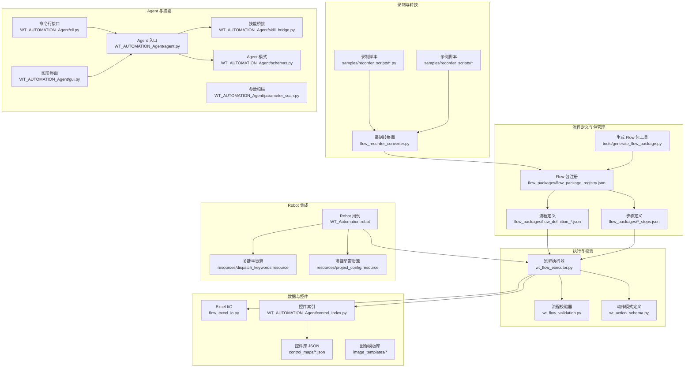

图表来源
- [flow_recorder_converter.py:1-200](file://flow_recorder_converter.py#L1-L200)
- [flow_packages/flow_package_registry.json:1-200](file://flow_packages/flow_package_registry.json#L1-L200)
- [flow_packages/气象数据录入_CFE02_steps.json:1-200](file://flow_packages/气象数据录入_CFE02_steps.json#L1-L200)
- [flow_packages/flow_definition_导入测风塔、机位点.json:1-200](file://flow_packages/flow_definition_导入测风塔、机位点.json#L1-L200)
- [wt_flow_executor.py:1-200](file://wt_flow_executor.py#L1-L200)
- [wt_flow_validation.py:1-200](file://wt_flow_validation.py#L1-L200)
- [wt_action_schema.py:1-200](file://wt_action_schema.py#L1-L200)
- [flow_excel_io.py:1-200](file://flow_excel_io.py#L1-L200)
- [WT_AUTOMATION_Agent/control_index.py:1-200](file://WT_AUTOMATION_Agent/control_index.py#L1-L200)
- [control_maps/总控件信息.json:1-200](file://control_maps/总控件信息.json#L1-L200)
- [WT_AUTOMATION_Agent/agent.py:1-200](file://WT_AUTOMATION_Agent/agent.py#L1-L200)
- [WT_AUTOMATION_Agent/skill_bridge.py:1-200](file://WT_AUTOMATION_Agent/skill_bridge.py#L1-L200)
- [WT_AUTOMATION_Agent/schemas.py:1-200](file://WT_AUTOMATION_Agent/schemas.py#L1-L200)
- [WT_AUTOMATION_Agent/cli.py:1-200](file://WT_AUTOMATION_Agent/cli.py#L1-L200)
- [WT_AUTOMATION_Agent/gui.py:1-200](file://WT_AUTOMATION_Agent/gui.py#L1-L200)
- [WT_AUTOMATION_Agent/parameter_scan.py:1-200](file://WT_AUTOMATION_Agent/parameter_scan.py#L1-L200)
- [WT_Automation.robot:1-200](file://WT_Automation.robot#L1-L200)
- [resources/dispatch_keywords.resource:1-200](file://resources/dispatch_keywords.resource#L1-L200)
- [resources/project_config.resource:1-200](file://resources/project_config.resource#L1-L200)

章节来源
- [README.md:1-200](file://README.md#L1-L200)
- [PROJECT_ARCHITECTURE.md:1-200](file://PROJECT_ARCHITECTURE.md#L1-L200)

## 核心组件
- 录制与转换
  - 录制脚本：位于 samples/recorder_scripts，包含 UI 操作录制与示例技能脚本。
  - 转换器：将录制脚本转换为 Flow 定义，便于版本化与复用。
- 流程包与定义
  - Flow 包注册表集中管理可用流程包；步骤定义与流程定义分离，利于组合与复用。
- 执行与校验
  - 执行器负责加载并运行流程；校验器对流程结构与字段进行一致性检查。
  - 动作模式定义约束各动作的参数与类型，保障稳定性。
- 数据与控件
  - Excel I/O 模块提供读取、写入与批量处理能力。
  - 控件索引与控件库 JSON 提供稳定的控件定位能力，降低 UI 漂移风险。
- Agent 与技能
  - Agent 作为统一入口，通过技能桥接调用领域技能；CLI/GUI 提供多形态交互。
  - 参数扫描支持批量场景下的参数遍历。
- Robot 集成
  - Robot 用例通过关键字资源与项目配置驱动执行器，实现端到端测试与演示。

章节来源
- [flow_recorder_converter.py:1-200](file://flow_recorder_converter.py#L1-L200)
- [flow_packages/flow_package_registry.json:1-200](file://flow_packages/flow_package_registry.json#L1-L200)
- [flow_packages/气象数据录入_CFE02_steps.json:1-200](file://flow_packages/气象数据录入_CFE02_steps.json#L1-L200)
- [flow_packages/flow_definition_导入测风塔、机位点.json:1-200](file://flow_packages/flow_definition_导入测风塔、机位点.json#L1-L200)
- [wt_flow_executor.py:1-200](file://wt_flow_executor.py#L1-L200)
- [wt_flow_validation.py:1-200](file://wt_flow_validation.py#L1-L200)
- [wt_action_schema.py:1-200](file://wt_action_schema.py#L1-L200)
- [flow_excel_io.py:1-200](file://flow_excel_io.py#L1-L200)
- [WT_AUTOMATION_Agent/control_index.py:1-200](file://WT_AUTOMATION_Agent/control_index.py#L1-L200)
- [control_maps/总控件信息.json:1-200](file://control_maps/总控件信息.json#L1-L200)
- [WT_AUTOMATION_Agent/agent.py:1-200](file://WT_AUTOMATION_Agent/agent.py#L1-L200)
- [WT_AUTOMATION_Agent/skill_bridge.py:1-200](file://WT_AUTOMATION_Agent/skill_bridge.py#L1-L200)
- [WT_AUTOMATION_Agent/schemas.py:1-200](file://WT_AUTOMATION_Agent/schemas.py#L1-L200)
- [WT_AUTOMATION_Agent/cli.py:1-200](file://WT_AUTOMATION_Agent/cli.py#L1-L200)
- [WT_AUTOMATION_Agent/gui.py:1-200](file://WT_AUTOMATION_Agent/gui.py#L1-L200)
- [WT_AUTOMATION_Agent/parameter_scan.py:1-200](file://WT_AUTOMATION_Agent/parameter_scan.py#L1-L200)
- [WT_Automation.robot:1-200](file://WT_Automation.robot#L1-L200)
- [resources/dispatch_keywords.resource:1-200](file://resources/dispatch_keywords.resource#L1-L200)
- [resources/project_config.resource:1-200](file://resources/project_config.resource#L1-L200)

## 架构总览
下图展示了从录制到执行的端到端数据录入自动化流程，包括录制脚本转换、Flow 包管理、执行与校验、Excel 数据处理、控件定位与 Agent 技能调用。

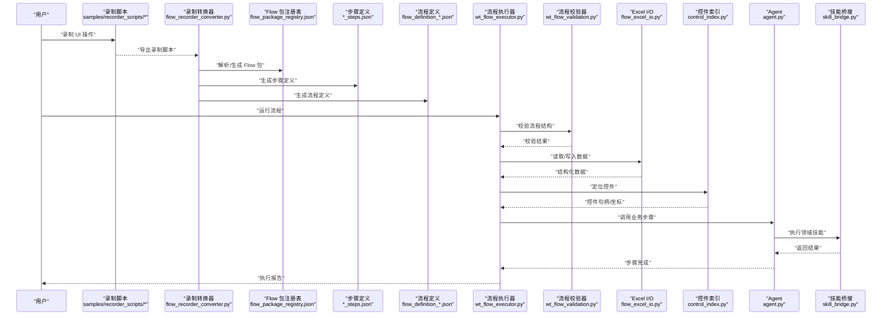

图表来源
- [flow_recorder_converter.py:1-200](file://flow_recorder_converter.py#L1-L200)
- [flow_packages/flow_package_registry.json:1-200](file://flow_packages/flow_package_registry.json#L1-L200)
- [flow_packages/气象数据录入_CFE02_steps.json:1-200](file://flow_packages/气象数据录入_CFE02_steps.json#L1-L200)
- [flow_packages/flow_definition_导入测风塔、机位点.json:1-200](file://flow_packages/flow_definition_导入测风塔、机位点.json#L1-L200)
- [wt_flow_executor.py:1-200](file://wt_flow_executor.py#L1-L200)
- [wt_flow_validation.py:1-200](file://wt_flow_validation.py#L1-L200)
- [flow_excel_io.py:1-200](file://flow_excel_io.py#L1-L200)
- [WT_AUTOMATION_Agent/control_index.py:1-200](file://WT_AUTOMATION_Agent/control_index.py#L1-L200)
- [WT_AUTOMATION_Agent/agent.py:1-200](file://WT_AUTOMATION_Agent/agent.py#L1-L200)
- [WT_AUTOMATION_Agent/skill_bridge.py:1-200](file://WT_AUTOMATION_Agent/skill_bridge.py#L1-L200)

## 详细组件分析

### 录制脚本与转换
- 目标
  - 将录制的 UI 操作转换为可维护的 Flow 定义，支持版本化管理与团队协作。
- 关键流程
  - 录制脚本收集点击、输入、选择等操作事件。
  - 转换器解析事件，生成步骤定义与流程定义，并更新包注册表。
  - 输出标准化 JSON，供执行器直接消费。
- 优化建议
  - 使用通用控件标识（如控件名、类名、层级路径）替代绝对坐标，提升鲁棒性。
  - 为重复操作抽取为“步骤”，减少冗余。
  - 在转换阶段加入基础校验（必填字段、类型），提前发现错误。

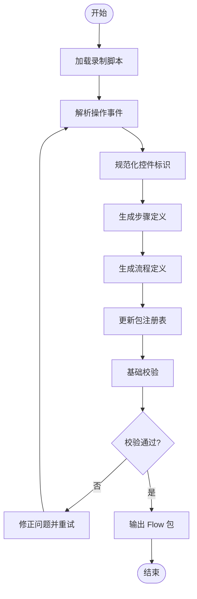

图表来源
- [flow_recorder_converter.py:1-200](file://flow_recorder_converter.py#L1-L200)
- [flow_packages/flow_package_registry.json:1-200](file://flow_packages/flow_package_registry.json#L1-L200)
- [flow_packages/气象数据录入_CFE02_steps.json:1-200](file://flow_packages/气象数据录入_CFE02_steps.json#L1-L200)
- [flow_packages/flow_definition_导入测风塔、机位点.json:1-200](file://flow_packages/flow_definition_导入测风塔、机位点.json#L1-L200)

章节来源
- [flow_recorder_converter.py:1-200](file://flow_recorder_converter.py#L1-L200)
- [samples/recorder_scripts/气象数据录入_20260625.py:1-200](file://samples/recorder_scripts/气象数据录入_20260625.py#L1-L200)
- [samples/recorder_scripts/Skill/combo_selector.py:1-200](file://samples/recorder_scripts/Skill/combo_selector.py#L1-L200)
- [samples/recorder_scripts/Skill/下拉操作示例说明.md:1-200](file://samples/recorder_scripts/Skill/下拉操作示例说明.md#L1-L200)
- [test_flow_recorder_converter.py:1-200](file://tests/test_flow_recorder_converter.py#L1-L200)

### Excel 数据导入与批量处理
- 目标
  - 提供统一的 Excel 读写接口，支持列映射、类型转换、批量写入与回写。
- 关键能力
  - 读取工作表、按列名或索引访问、过滤与聚合。
  - 写入新文件或追加行，支持空值与异常记录。
  - 与流程步骤联动，实现“数据驱动”的表单填充。
- 性能要点
  - 大文件分块读取，避免一次性加载导致内存峰值。
  - 预编译列映射，减少运行时开销。
  - 合并多次写入为批量提交，降低 I/O 次数。

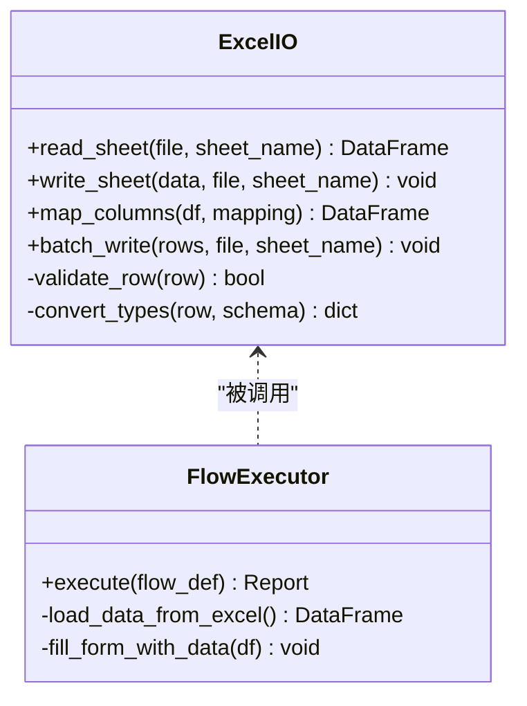

图表来源
- [flow_excel_io.py:1-200](file://flow_excel_io.py#L1-L200)
- [wt_flow_executor.py:1-200](file://wt_flow_executor.py#L1-L200)

章节来源
- [flow_excel_io.py:1-200](file://flow_excel_io.py#L1-L200)
- [test_flow_excel_io.py:1-200](file://tests/test_flow_excel_io.py#L1-L200)

### 流程执行与校验
- 目标
  - 安全、稳定地执行 Flow 定义，并提供一致的校验与报告。
- 关键流程
  - 加载流程定义与步骤定义，进行结构校验。
  - 按顺序执行动作，捕获异常并记录上下文。
  - 生成执行报告，包含成功/失败统计与错误详情。
- 动作模式
  - 通过动作模式定义约束参数类型与必填项，确保一致性与可维护性。

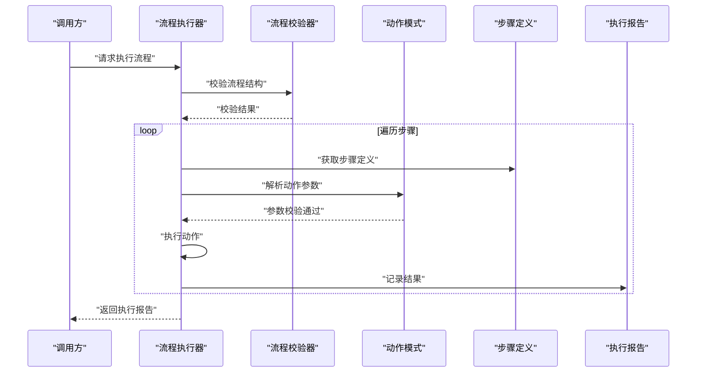

图表来源
- [wt_flow_executor.py:1-200](file://wt_flow_executor.py#L1-L200)
- [wt_flow_validation.py:1-200](file://wt_flow_validation.py#L1-L200)
- [wt_action_schema.py:1-200](file://wt_action_schema.py#L1-L200)

章节来源
- [wt_flow_executor.py:1-200](file://wt_flow_executor.py#L1-L200)
- [wt_flow_validation.py:1-200](file://wt_flow_validation.py#L1-L200)
- [wt_action_schema.py:1-200](file://wt_action_schema.py#L1-L200)

### 控件索引与定位
- 目标
  - 提供稳定的控件识别与定位能力，降低 UI 变更带来的不稳定。
- 关键能力
  - 构建控件索引，缓存控件属性（名称、类名、层级路径）。
  - 支持相对窗口定位与区域偏移，适配复杂布局。
  - 与图像模板库互补，提高匹配成功率。
- 最佳实践
  - 优先使用语义化控件标识（名称、角色、类名）。
  - 对动态控件使用相对定位与容错策略。
  - 定期更新控件库，保持索引与真实 UI 同步。

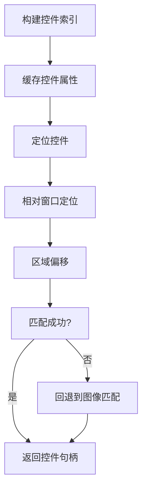

图表来源
- [WT_AUTOMATION_Agent/control_index.py:1-200](file://WT_AUTOMATION_Agent/control_index.py#L1-L200)
- [control_maps/总控件信息.json:1-200](file://control_maps/总控件信息.json#L1-L200)
- [control_maps/library_气象对象_WPF_controls.json:1-200](file://control_maps/library_气象对象_WPF_controls.json#L1-L200)
- [control_maps/library_导入时间序列文件_WPF_controls.json:1-200](file://control_maps/library_导入时间序列文件_WPF_controls.json#L1-L200)

章节来源
- [WT_AUTOMATION_Agent/control_index.py:1-200](file://WT_AUTOMATION_Agent/control_index.py#L1-L200)
- [control_maps/总控件信息.json:1-200](file://control_maps/总控件信息.json#L1-L200)
- [control_maps/library_气象对象_WPF_controls.json:1-200](file://control_maps/library_气象对象_WPF_controls.json#L1-L200)
- [control_maps/library_导入时间序列文件_WPF_controls.json:1-200](file://control_maps/library_导入时间序列文件_WPF_controls.json#L1-L200)

### Agent 与技能桥接
- 目标
  - 通过 Agent 统一调度业务步骤与领域技能，屏蔽底层实现差异。
- 关键能力
  - 技能桥接：根据动作类型路由到对应技能实现。
  - 模式定义：规范输入输出结构，便于校验与扩展。
  - CLI/GUI：提供多种交互方式，支持批处理与可视化调试。
- 参数扫描
  - 支持批量参数组合，自动遍历并生成执行任务集。

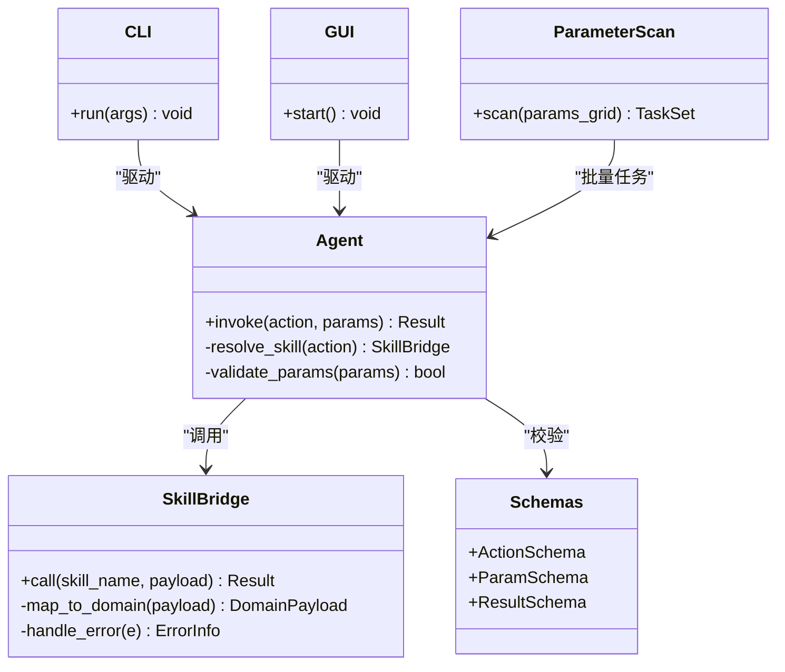

图表来源
- [WT_AUTOMATION_Agent/agent.py:1-200](file://WT_AUTOMATION_Agent/agent.py#L1-L200)
- [WT_AUTOMATION_Agent/skill_bridge.py:1-200](file://WT_AUTOMATION_Agent/skill_bridge.py#L1-L200)
- [WT_AUTOMATION_Agent/schemas.py:1-200](file://WT_AUTOMATION_Agent/schemas.py#L1-L200)
- [WT_AUTOMATION_Agent/cli.py:1-200](file://WT_AUTOMATION_Agent/cli.py#L1-L200)
- [WT_AUTOMATION_Agent/gui.py:1-200](file://WT_AUTOMATION_Agent/gui.py#L1-L200)
- [WT_AUTOMATION_Agent/parameter_scan.py:1-200](file://WT_AUTOMATION_Agent/parameter_scan.py#L1-L200)

章节来源
- [WT_AUTOMATION_Agent/agent.py:1-200](file://WT_AUTOMATION_Agent/agent.py#L1-L200)
- [WT_AUTOMATION_Agent/skill_bridge.py:1-200](file://WT_AUTOMATION_Agent/skill_bridge.py#L1-L200)
- [WT_AUTOMATION_Agent/schemas.py:1-200](file://WT_AUTOMATION_Agent/schemas.py#L1-L200)
- [WT_AUTOMATION_Agent/cli.py:1-200](file://WT_AUTOMATION_Agent/cli.py#L1-L200)
- [WT_AUTOMATION_Agent/gui.py:1-200](file://WT_AUTOMATION_Agent/gui.py#L1-L200)
- [WT_AUTOMATION_Agent/parameter_scan.py:1-200](file://WT_AUTOMATION_Agent/parameter_scan.py#L1-L200)

### Robot 集成与关键字资源
- 目标
  - 通过 Robot Framework 组织用例，利用关键字资源与项目配置驱动执行器。
- 关键能力
  - 关键字分发：将高层关键字映射到底层动作。
  - 项目配置：集中管理环境、路径、开关等配置项。
  - 用例编排：组合多个步骤，形成端到端的数据录入流程。

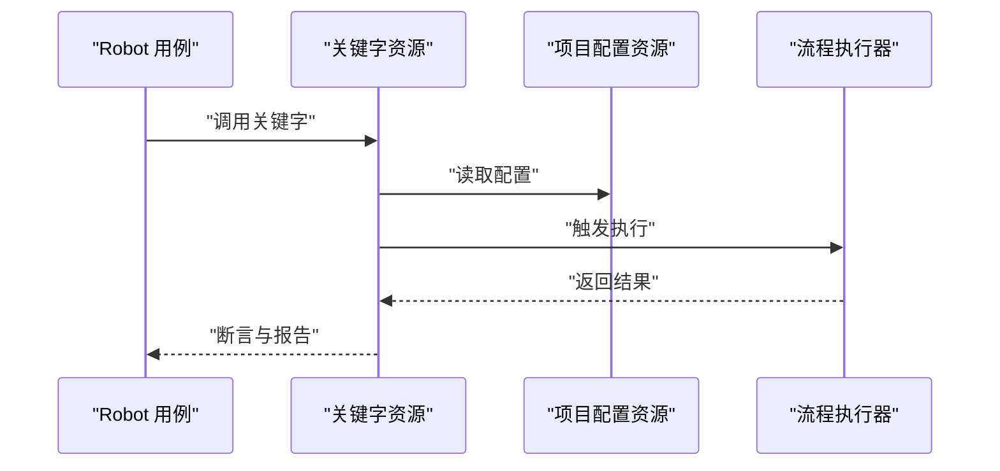

图表来源
- [WT_Automation.robot:1-200](file://WT_Automation.robot#L1-L200)
- [resources/dispatch_keywords.resource:1-200](file://resources/dispatch_keywords.resource#L1-L200)
- [resources/project_config.resource:1-200](file://resources/project_config.resource#L1-L200)
- [wt_flow_executor.py:1-200](file://wt_flow_executor.py#L1-L200)

章节来源
- [WT_Automation.robot:1-200](file://WT_Automation.robot#L1-L200)
- [resources/dispatch_keywords.resource:1-200](file://resources/dispatch_keywords.resource#L1-L200)
- [resources/project_config.resource:1-200](file://resources/project_config.resource#L1-L200)

### Flow 包管理与生成
- 目标
  - 统一管理 Flow 包，提供生成与合并工具，简化发布与维护。
- 关键能力
  - 包注册表：集中声明可用流程包及其元信息。
  - 步骤与流程定义：解耦步骤逻辑与流程编排。
  - 生成工具：从模板或现有脚本快速生成标准 Flow 包。

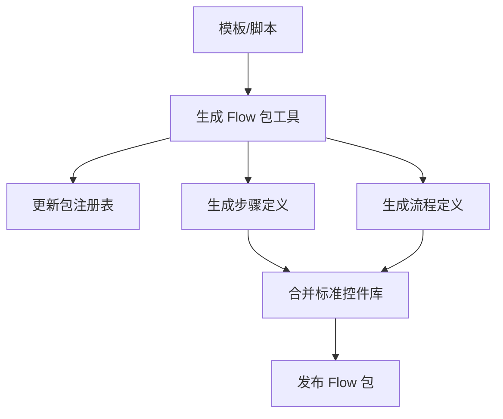

图表来源
- [tools/generate_flow_package.py:1-200](file://tools/generate_flow_package.py#L1-L200)
- [tools/merge_standard_control_library.py:1-200](file://tools/merge_standard_control_library.py#L1-L200)
- [flow_packages/flow_package_registry.json:1-200](file://flow_packages/flow_package_registry.json#L1-L200)
- [flow_packages/气象数据录入_CFE02_steps.json:1-200](file://flow_packages/气象数据录入_CFE02_steps.json#L1-L200)
- [flow_packages/flow_definition_导入测风塔、机位点.json:1-200](file://flow_packages/flow_definition_导入测风塔、机位点.json#L1-L200)

章节来源
- [tools/generate_flow_package.py:1-200](file://tools/generate_flow_package.py#L1-L200)
- [tools/merge_standard_control_library.py:1-200](file://tools/merge_standard_control_library.py#L1-L200)
- [flow_packages/flow_package_registry.json:1-200](file://flow_packages/flow_package_registry.json#L1-L200)
- [flow_packages/气象数据录入_CFE02_steps.json:1-200](file://flow_packages/气象数据录入_CFE02_steps.json#L1-L200)
- [flow_packages/flow_definition_导入测风塔、机位点.json:1-200](file://flow_packages/flow_definition_导入测风塔、机位点.json#L1-L200)

### 图像模板与控件库构建
- 目标
  - 构建图像模板库与控件库，提升定位与匹配的稳定性。
- 关键能力
  - 构建控件库：从 UI 树中抓取控件属性，生成标准 JSON。
  - 构建图像模板库：采集关键界面元素，建立模板索引。
  - 辅助工具：合并标准控件库，统一命名与分类。

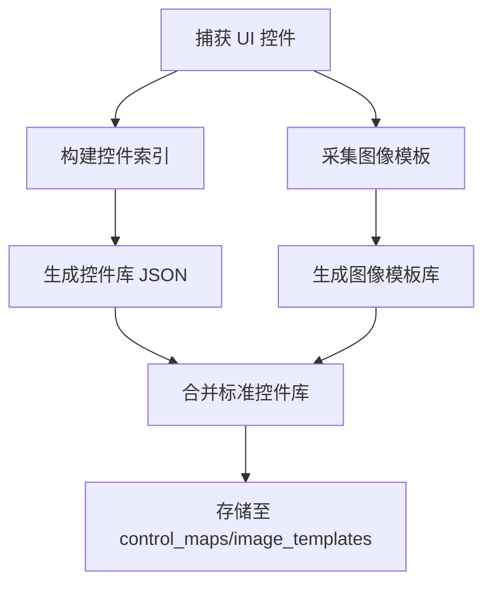

图表来源
- [build_control_map_library.py:1-200](file://build_control_map_library.py#L1-L200)
- [build_image_template_library.py:1-200](file://build_image_template_library.py#L1-L200)
- [control_maps/总控件信息.json:1-200](file://control_maps/总控件信息.json#L1-L200)
- [control_maps/20260720_153042_uiapeek_recording.json:1-200](file://control_maps/20260720_153042_uiapeek_recording.json#L1-L200)

章节来源
- [build_control_map_library.py:1-200](file://build_control_map_library.py#L1-L200)
- [build_image_template_library.py:1-200](file://build_image_template_library.py#L1-L200)
- [control_maps/总控件信息.json:1-200](file://control_maps/总控件信息.json#L1-L200)
- [control_maps/20260720_153042_uiapeek_recording.json:1-200](file://control_maps/20260720_153042_uiapeek_recording.json#L1-L200)

## 依赖关系分析
- 组件耦合
  - 执行器依赖校验器与动作模式，保证流程结构的正确性。
  - Excel I/O 与执行器解耦，通过数据帧传递，便于替换实现。
  - 控件索引与 Agent 解耦，通过统一接口调用，降低耦合度。
- 外部依赖
  - Robot Framework 用于用例编排与关键字分发。
  - 控件库与图像模板库作为静态资源，需定期维护。
- 潜在循环依赖
  - 当前分层清晰，未见明显循环依赖；建议在新增功能时遵循单向依赖原则。

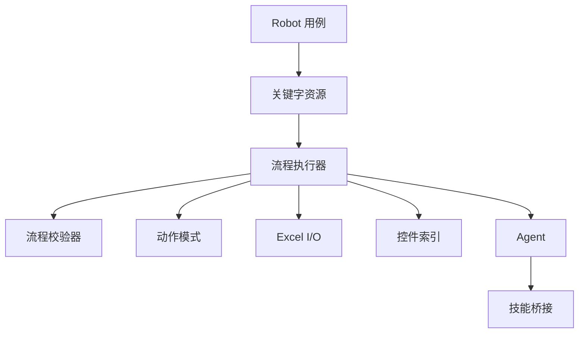

图表来源
- [wt_flow_executor.py:1-200](file://wt_flow_executor.py#L1-L200)
- [wt_flow_validation.py:1-200](file://wt_flow_validation.py#L1-L200)
- [wt_action_schema.py:1-200](file://wt_action_schema.py#L1-L200)
- [flow_excel_io.py:1-200](file://flow_excel_io.py#L1-L200)
- [WT_AUTOMATION_Agent/control_index.py:1-200](file://WT_AUTOMATION_Agent/control_index.py#L1-L200)
- [WT_AUTOMATION_Agent/agent.py:1-200](file://WT_AUTOMATION_Agent/agent.py#L1-L200)
- [WT_AUTOMATION_Agent/skill_bridge.py:1-200](file://WT_AUTOMATION_Agent/skill_bridge.py#L1-L200)
- [WT_Automation.robot:1-200](file://WT_Automation.robot#L1-L200)
- [resources/dispatch_keywords.resource:1-200](file://resources/dispatch_keywords.resource#L1-L200)

章节来源
- [wt_flow_executor.py:1-200](file://wt_flow_executor.py#L1-L200)
- [wt_flow_validation.py:1-200](file://wt_flow_validation.py#L1-L200)
- [wt_action_schema.py:1-200](file://wt_action_schema.py#L1-L200)
- [flow_excel_io.py:1-200](file://flow_excel_io.py#L1-L200)
- [WT_AUTOMATION_Agent/control_index.py:1-200](file://WT_AUTOMATION_Agent/control_index.py#L1-L200)
- [WT_AUTOMATION_Agent/agent.py:1-200](file://WT_AUTOMATION_Agent/agent.py#L1-L200)
- [WT_AUTOMATION_Agent/skill_bridge.py:1-200](file://WT_AUTOMATION_Agent/skill_bridge.py#L1-L200)
- [WT_Automation.robot:1-200](file://WT_Automation.robot#L1-L200)
- [resources/dispatch_keywords.resource:1-200](file://resources/dispatch_keywords.resource#L1-L200)

## 性能考虑
- 大数据量处理
  - 分块读取与写入，控制内存占用。
  - 批量提交减少 I/O 次数。
  - 预编译列映射与正则表达式，降低运行时开销。
- 控件定位优化
  - 优先使用语义化控件标识，减少图像匹配频率。
  - 缓存控件句柄，避免重复查找。
  - 使用相对定位与区域偏移，提升鲁棒性。
- 执行器优化
  - 并行执行无依赖的步骤（若流程定义允许）。
  - 超时与重试策略，避免长时间阻塞。
  - 日志分级与采样，降低日志 I/O 压力。

[本节为通用指导，不直接分析具体文件]

## 故障排查指南
- 常见问题
  - 控件定位失败：检查控件库是否最新，确认控件标识是否变化。
  - 录制转换错误：查看转换器的基础校验结果，修正必填字段与类型。
  - Excel 数据格式不一致：使用列映射与类型转换，增加空值处理。
  - 执行超时：调整超时阈值，增加重试与回退策略。
- 调试资源
  - 回归问题记录：参考相关调试文档，定位历史问题与解决方案。
  - 录制回放：使用录制脚本与控件库对比，定位差异。

章节来源
- [debug-time-series-input-regression.md:1-200](file://debug-time-series-input-regression.md#L1-L200)
- [debug-click-9-miss.md:1-200](file://debug-click-9-miss.md#L1-L200)

## 结论
本项目提供了从录制到执行、从数据到控件、从单步到流程的完整数据录入自动化方案。通过标准化的 Flow 包管理、稳健的控件定位与 Agent 技能桥接，以及完善的校验与报告机制，能够高效支撑复杂的数据录入任务。建议在实际项目中持续维护控件库与图像模板库，结合性能优化与异常处理策略，确保流程的稳定与可扩展。

[本节为总结性内容，不直接分析具体文件]

## 附录
- 配置示例与最佳实践
  - 在流程定义中明确步骤依赖与参数来源，避免硬编码。
  - 使用关键字资源与项目配置集中管理环境与开关。
  - 定期更新控件库与图像模板库，保持与 UI 同步。
  - 对关键步骤增加断言与日志，便于问题定位。
- 数据备份与恢复策略
  - 在执行前备份原始数据与中间结果。
  - 使用事务式写入，失败时回滚。
  - 保留执行快照与日志，便于审计与回溯。

[本节为通用指导，不直接分析具体文件]