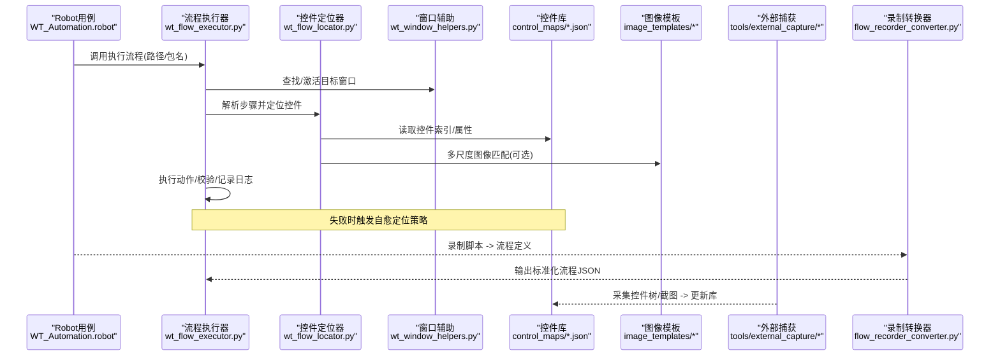
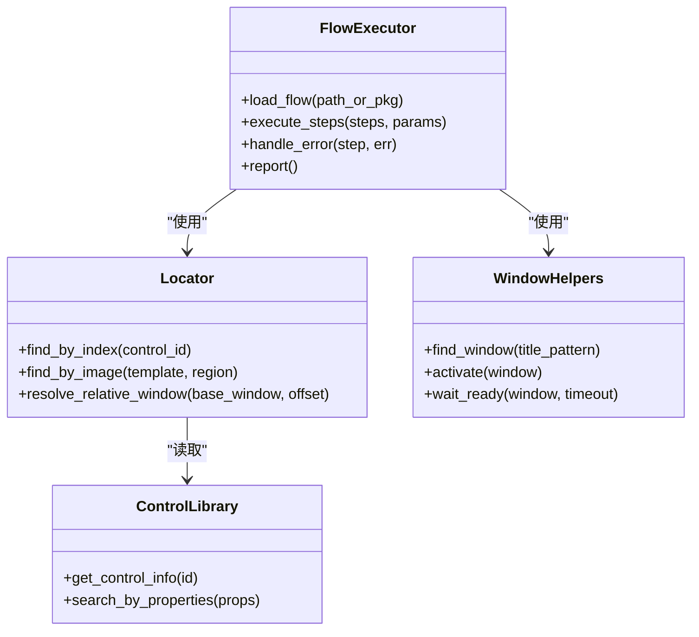
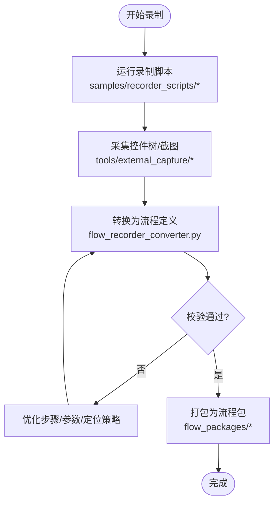
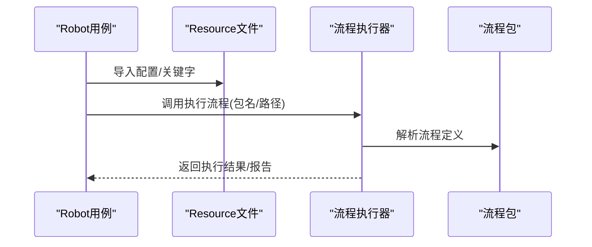
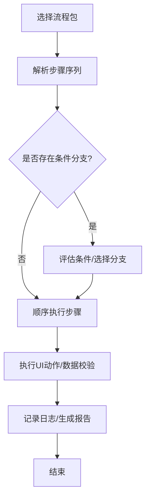
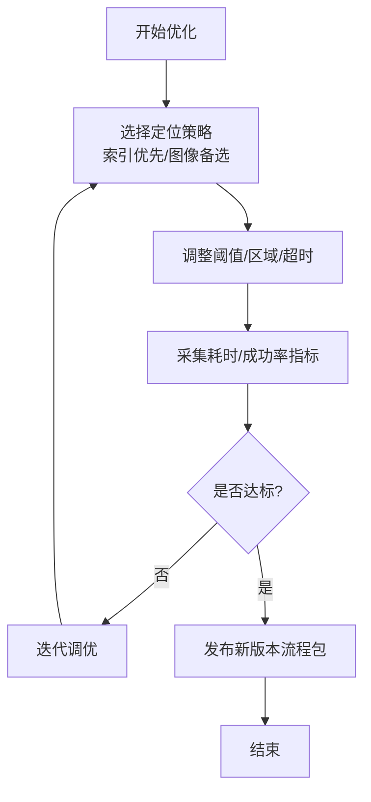
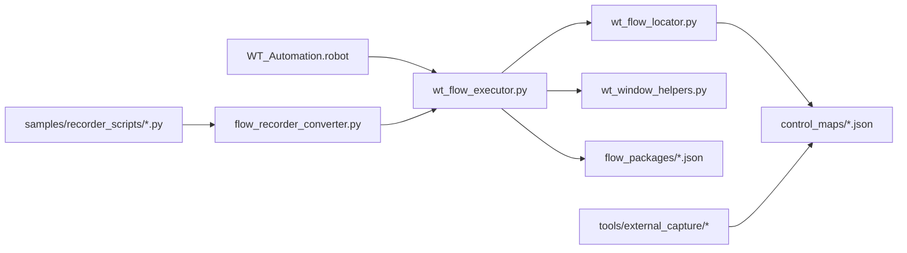

# 示例案例

<cite>
**本文引用的文件**   
- [README.md](file://README.md)
- [WT_Automation.robot](file://WT_Automation.robot)
- [resources/project_config.resource](file://resources/project_config.resource)
- [resources/dispatch_keywords.resource](file://resources/dispatch_keywords.resource)
- [flow_definition.json](file://flow_definition.json)
- [flow_packages/flow_package_registry.json](file://flow_packages/flow_package_registry.json)
- [flow_packages/flow_definition_创建一个新建模.json](file://flow_packages/flow_definition_创建一个新建模.json)
- [flow_packages/flow_definition_geo_import_data_file.json](file://flow_packages/flow_definition_geo_import_data_file.json)
- [flow_packages/flow_definition_turbine_type_create_and_curves.json](file://flow_packages/flow_definition_turbine_type_create_and_curves.json)
- [samples/flows/flow_definition_gm_sample.json](file://samples/flows/flow_definition_gm_sample.json)
- [samples/flows/flow_definition_新建风机类型.json](file://samples/flows/flow_definition_新建风机类型.json)
- [samples/recorder_scripts/气象数据录入_20260625.py](file://samples/recorder_scripts/气象数据录入_20260625.py)
- [samples/recorder_scripts/Skill/combo_selector.py](file://samples/recorder_scripts/Skill/combo_selector.py)
- [samples/recorder_scripts/Skill/GM_add1.py](file://samples/recorder_scripts/Skill/GM_add1.py)
- [samples/recorder_scripts/Skill/GM_load_cgcs.py](file://samples/recorder_scripts/Skill/GM_load_cgcs.py)
- [samples/recorder_scripts/Skill/GM_Xialaxuanze.py](file://samples/recorder_scripts/Skill/GM_Xialaxuanze.py)
- [samples/recorder_scripts/Skill/下拉操作示例说明.md](file://samples/recorder_scripts/Skill/下拉操作示例说明.md)
- [flow_recorder_converter.py](file://flow_recorder_converter.py)
- [wt_flow_executor.py](file://wt_flow_executor.py)
- [wt_flow_locator.py](file://wt_flow_locator.py)
- [wt_window_helpers.py](file://wt_window_helpers.py)
- [control_maps/总控件信息.json](file://control_maps/总控件信息.json)
- [control_maps/library_主面板_WPF_controls.json](file://control_maps/library_主面板_WPF_controls.json)
- [tools/generate_flow_package.py](file://tools/generate_flow_package.py)
- [tools/external_capture/capture.py](file://tools/external_capture/capture.py)
- [tools/external_capture/pywinauto_backend.py](file://tools/external_capture/pywinauto_backend.py)
- [tools/external_capture/uiapeek_client.py](file://tools/external_capture/uiapeek_client.py)
- [build_control_map_library.py](file://build_control_map_library.py)
- [build_image_template_library.py](file://build_image_template_library.py)
- [tests/test_wt_flow_executor.py](file://tests/test_wt_flow_executor.py)
- [tests/test_wt_flow_locator_relative_window.py](file://tests/test_wt_flow_locator_relative_window.py)
- [tests/test_self_healing_locator.py](file://tests/test_self_healing_locator.py)
- [tests/test_ui_path_selector.py](file://tests/test_ui_path_selector.py)
- [tests/test_flow_excel_io.py](file://tests/test_flow_excel_io.py)
- [tests/test_flow_recorder_converter.py](file://tests/test_flow_recorder_converter.py)
- [tests/test_image_matcher_multiscale.py](file://tests/test_image_matcher_multiscale.py)
- [tests/test_wt_run_reporting.py](file://tests/test_wt_run_reporting.py)
</cite>

## 目录
1. [简介](#简介)
2. [项目结构](#项目结构)
3. [核心组件](#核心组件)
4. [架构总览](#架构总览)
5. [详细组件分析](#详细组件分析)
6. [依赖关系分析](#依赖关系分析)
7. [性能考量](#性能考量)
8. [故障排查指南](#故障排查指南)
9. [结论](#结论)
10. [附录](#附录)

## 简介
本章节聚焦于WT自动化框架的实际应用案例与示例代码，覆盖UI测试、数据录入、报表生成等常见场景；介绍录制脚本的生成与优化方法；提供Robot Framework集成示例与最佳实践；阐述复杂业务流程的自动化实现方案；包含性能优化的实际案例与效果对比；总结企业级应用的部署与运维经验；并给出不同行业的应用案例与定制化方案，帮助读者基于现有示例快速开发新的自动化任务。

## 项目结构
仓库采用“流程定义 + 执行器 + 定位器 + 控件库 + 图像模板 + 录制与转换工具”的分层组织方式：
- 顶层入口与配置：robot用例、流程定义、资源文件
- flow_packages：可复用的流程包（JSON）
- samples：示例流程、录制脚本与Skill封装
- control_maps：控件映射与控件库
- tools：录制、捕获、构建库等工具
- tests：单元测试与回归验证
- website：文档站点静态资源

```mermaid
graph TB
subgraph "用例与编排"
RF["WT_Automation.robot"]
RES1["resources/project_config.resource"]
RES2["resources/dispatch_keywords.resource"]
end
subgraph "流程与包"
FDEF["flow_definition.json"]
REG["flow_packages/flow_package_registry.json"]
PKG1["flow_packages/flow_definition_创建一个新建模.json"]
PKG2["flow_packages/flow_definition_geo_import_data_file.json"]
PKG3["flow_packages/flow_definition_turbine_type_create_and_curves.json"]
end
subgraph "执行与定位"
EXE["wt_flow_executor.py"]
LOC["wt_flow_locator.py"]
WIN["wt_window_helpers.py"]
end
subgraph "控件与图像"
CMAP["control_maps/总控件信息.json"]
LIB["control_maps/library_主面板_WPF_controls.json"]
end
subgraph "录制与转换"
REC["samples/recorder_scripts/气象数据录入_20260625.py"]
SKILL["samples/recorder_scripts/Skill/*.py"]
CONV["flow_recorder_converter.py"]
CAP["tools/external_capture/capture.py"]
PYW["tools/external_capture/pywinauto_backend.py"]
UIA["tools/external_capture/uiapeek_client.py"]
end
subgraph "构建与测试"
BLD1["build_control_map_library.py"]
BLD2["build_image_template_library.py"]
T1["tests/test_wt_flow_executor.py"]
T2["tests/test_wt_flow_locator_relative_window.py"]
T3["tests/test_self_healing_locator.py"]
T4["tests/test_ui_path_selector.py"]
T5["tests/test_flow_excel_io.py"]
T6["tests/test_flow_recorder_converter.py"]
T7["tests/test_image_matcher_multiscale.py"]
T8["tests/test_wt_run_reporting.py"]
end
RF --> EXE
RF --> RES1
RF --> RES2
EXE --> LOC
EXE --> WIN
EXE --> REG
EXE --> PKG1
EXE --> PKG2
EXE --> PKG3
LOC --> CMAP
LOC --> LIB
REC --> CONV
CONV --> EXE
CAP --> PYW
CAP --> UIA
BLD1 --> CMAP
BLD2 --> LIB
T1 --> EXE
T2 --> LOC
T3 --> LOC
T4 --> LOC
T5 --> EXE
T6 --> CONV
T7 --> EXE
T8 --> EXE
```

图表来源
- [WT_Automation.robot:1-200](file://WT_Automation.robot#L1-L200)
- [resources/project_config.resource:1-200](file://resources/project_config.resource#L1-L200)
- [resources/dispatch_keywords.resource:1-200](file://resources/dispatch_keywords.resource#L1-L200)
- [flow_definition.json:1-200](file://flow_definition.json#L1-L200)
- [flow_packages/flow_package_registry.json:1-200](file://flow_packages/flow_package_registry.json#L1-L200)
- [flow_packages/flow_definition_创建一个新建模.json:1-200](file://flow_packages/flow_definition_创建一个新建模.json#L1-L200)
- [flow_packages/flow_definition_geo_import_data_file.json:1-200](file://flow_packages/flow_definition_geo_import_data_file.json#L1-L200)
- [flow_packages/flow_definition_turbine_type_create_and_curves.json:1-200](file://flow_packages/flow_definition_turbine_type_create_and_curves.json#L1-L200)
- [wt_flow_executor.py:1-200](file://wt_flow_executor.py#L1-L200)
- [wt_flow_locator.py:1-200](file://wt_flow_locator.py#L1-L200)
- [wt_window_helpers.py:1-200](file://wt_window_helpers.py#L1-L200)
- [control_maps/总控件信息.json:1-200](file://control_maps/总控件信息.json#L1-L200)
- [control_maps/library_主面板_WPF_controls.json:1-200](file://control_maps/library_主面板_WPF_controls.json#L1-L200)
- [samples/recorder_scripts/气象数据录入_20260625.py:1-200](file://samples/recorder_scripts/气象数据录入_20260625.py#L1-L200)
- [flow_recorder_converter.py:1-200](file://flow_recorder_converter.py#L1-L200)
- [tools/external_capture/capture.py:1-200](file://tools/external_capture/capture.py#L1-L200)
- [tools/external_capture/pywinauto_backend.py:1-200](file://tools/external_capture/pywinauto_backend.py#L1-L200)
- [tools/external_capture/uiapeek_client.py:1-200](file://tools/external_capture/uiapeek_client.py#L1-L200)
- [build_control_map_library.py:1-200](file://build_control_map_library.py#L1-L200)
- [build_image_template_library.py:1-200](file://build_image_template_library.py#L1-L200)
- [tests/test_wt_flow_executor.py:1-200](file://tests/test_wt_flow_executor.py#L1-L200)
- [tests/test_wt_flow_locator_relative_window.py:1-200](file://tests/test_wt_flow_locator_relative_window.py#L1-L200)
- [tests/test_self_healing_locator.py:1-200](file://tests/test_self_healing_locator.py#L1-L200)
- [tests/test_ui_path_selector.py:1-200](file://tests/test_ui_path_selector.py#L1-L200)
- [tests/test_flow_excel_io.py:1-200](file://tests/test_flow_excel_io.py#L1-L200)
- [tests/test_flow_recorder_converter.py:1-200](file://tests/test_flow_recorder_converter.py#L1-L200)
- [tests/test_image_matcher_multiscale.py:1-200](file://tests/test_image_matcher_multiscale.py#L1-L200)
- [tests/test_wt_run_reporting.py:1-200](file://tests/test_wt_run_reporting.py#L1-L200)

章节来源
- [README.md:1-200](file://README.md#L1-L200)

## 核心组件
- 流程执行器：负责加载流程定义、解析步骤、调度动作、处理异常与报告。
- 控件定位器：基于控件索引与控件库进行稳定定位，支持相对窗口与多尺度图像匹配。
- 窗口辅助：窗口发现、激活、等待就绪、句柄管理。
- 录制与转换：将录制脚本转换为标准流程定义，便于复用与版本化管理。
- 外部捕获：通过UIA/Axe桥接或Pywinauto后端采集控件树与截图，支撑控件库构建。
- 构建工具：批量构建控件库与图像模板库，统一索引与检索。
- Robot Framework集成：以resource与robot用例编排端到端流程。

章节来源
- [wt_flow_executor.py:1-200](file://wt_flow_executor.py#L1-L200)
- [wt_flow_locator.py:1-200](file://wt_flow_locator.py#L1-L200)
- [wt_window_helpers.py:1-200](file://wt_window_helpers.py#L1-L200)
- [flow_recorder_converter.py:1-200](file://flow_recorder_converter.py#L1-L200)
- [tools/external_capture/capture.py:1-200](file://tools/external_capture/capture.py#L1-L200)
- [tools/external_capture/pywinauto_backend.py:1-200](file://tools/external_capture/pywinauto_backend.py#L1-L200)
- [tools/external_capture/uiapeek_client.py:1-200](file://tools/external_capture/uiapeek_client.py#L1-L200)
- [build_control_map_library.py:1-200](file://build_control_map_library.py#L1-L200)
- [build_image_template_library.py:1-200](file://build_image_template_library.py#L1-L200)

## 架构总览
下图展示从Robot用例到执行器、定位器、控件库与录制转换的整体交互。

图表来源
- [WT_Automation.robot:1-200](file://WT_Automation.robot#L1-L200)
- [wt_flow_executor.py:1-200](file://wt_flow_executor.py#L1-L200)
- [wt_flow_locator.py:1-200](file://wt_flow_locator.py#L1-L200)
- [wt_window_helpers.py:1-200](file://wt_window_helpers.py#L1-L200)
- [control_maps/总控件信息.json:1-200](file://control_maps/总控件信息.json#L1-L200)
- [control_maps/library_主面板_WPF_controls.json:1-200](file://control_maps/library_主面板_WPF_controls.json#L1-L200)
- [tools/external_capture/capture.py:1-200](file://tools/external_capture/capture.py#L1-L200)
- [tools/external_capture/pywinauto_backend.py:1-200](file://tools/external_capture/pywinauto_backend.py#L1-L200)
- [tools/external_capture/uiapeek_client.py:1-200](file://tools/external_capture/uiapeek_client.py#L1-L200)
- [flow_recorder_converter.py:1-200](file://flow_recorder_converter.py#L1-L200)

## 详细组件分析

### 组件一：UI自动化与流程执行
- 功能要点
  - 加载流程定义（含步骤序列、参数、条件分支）
  - 按步骤驱动UI动作（点击、输入、选择、校验）
  - 结合控件库与图像模板提升稳定性
  - 异常重试与自愈定位
- 关键路径
  - 流程注册表与包管理：[flow_packages/flow_package_registry.json](file://flow_packages/flow_package_registry.json)
  - 典型流程包：[flow_packages/flow_definition_创建一个新建模.json](file://flow_packages/flow_definition_创建一个新建模.json)、[flow_packages/flow_definition_geo_import_data_file.json](file://flow_packages/flow_definition_geo_import_data_file.json)、[flow_packages/flow_definition_turbine_type_create_and_curves.json](file://flow_packages/flow_definition_turbine_type_create_and_curves.json)
  - 执行器核心：[wt_flow_executor.py](file://wt_flow_executor.py)
  - 定位器与窗口辅助：[wt_flow_locator.py](file://wt_flow_locator.py)、[wt_window_helpers.py](file://wt_window_helpers.py)
  - 控件库与索引：[control_maps/总控件信息.json](file://control_maps/总控件信息.json)、[control_maps/library_主面板_WPF_controls.json](file://control_maps/library_主面板_WPF_controls.json)

图表来源
- [wt_flow_executor.py:1-200](file://wt_flow_executor.py#L1-L200)
- [wt_flow_locator.py:1-200](file://wt_flow_locator.py#L1-L200)
- [wt_window_helpers.py:1-200](file://wt_window_helpers.py#L1-L200)
- [control_maps/总控件信息.json:1-200](file://control_maps/总控件信息.json#L1-L200)
- [control_maps/library_主面板_WPF_controls.json:1-200](file://control_maps/library_主面板_WPF_controls.json#L1-L200)

章节来源
- [wt_flow_executor.py:1-200](file://wt_flow_executor.py#L1-L200)
- [wt_flow_locator.py:1-200](file://wt_flow_locator.py#L1-L200)
- [wt_window_helpers.py:1-200](file://wt_window_helpers.py#L1-L200)
- [control_maps/总控件信息.json:1-200](file://control_maps/总控件信息.json#L1-L200)
- [control_maps/library_主面板_WPF_controls.json:1-200](file://control_maps/library_主面板_WPF_controls.json#L1-L200)

### 组件二：录制脚本生成与优化
- 录制脚本样例
  - 气象数据录入：[samples/recorder_scripts/气象数据录入_20260625.py](file://samples/recorder_scripts/气象数据录入_20260625.py)
  - Skill封装示例：[samples/recorder_scripts/Skill/combo_selector.py](file://samples/recorder_scripts/Skill/combo_selector.py)、[samples/recorder_scripts/Skill/GM_add1.py](file://samples/recorder_scripts/Skill/GM_add1.py)、[samples/recorder_scripts/Skill/GM_load_cgcs.py](file://samples/recorder_scripts/Skill/GM_load_cgcs.py)、[samples/recorder_scripts/Skill/GM_Xialaxuanze.py](file://samples/recorder_scripts/Skill/GM_Xialaxuanze.py)
  - 下拉操作说明：[samples/recorder_scripts/Skill/下拉操作示例说明.md](file://samples/recorder_scripts/Skill/下拉操作示例说明.md)
- 转换与优化
  - 录制脚本转流程定义：[flow_recorder_converter.py](file://flow_recorder_converter.py)
  - 外部捕获与控件树采集：[tools/external_capture/capture.py](file://tools/external_capture/capture.py)、[tools/external_capture/pywinauto_backend.py](file://tools/external_capture/pywinauto_backend.py)、[tools/external_capture/uiapeek_client.py](file://tools/external_capture/uiapeek_client.py)
  - 控件库构建：[build_control_map_library.py](file://build_control_map_library.py)
  - 图像模板库构建：[build_image_template_library.py](file://build_image_template_library.py)

图表来源
- [samples/recorder_scripts/气象数据录入_20260625.py:1-200](file://samples/recorder_scripts/气象数据录入_20260625.py#L1-L200)
- [samples/recorder_scripts/Skill/combo_selector.py:1-200](file://samples/recorder_scripts/Skill/combo_selector.py#L1-L200)
- [samples/recorder_scripts/Skill/GM_add1.py:1-200](file://samples/recorder_scripts/Skill/GM_add1.py#L1-L200)
- [samples/recorder_scripts/Skill/GM_load_cgcs.py:1-200](file://samples/recorder_scripts/Skill/GM_load_cgcs.py#L1-L200)
- [samples/recorder_scripts/Skill/GM_Xialaxuanze.py:1-200](file://samples/recorder_scripts/Skill/GM_Xialaxuanze.py#L1-L200)
- [samples/recorder_scripts/Skill/下拉操作示例说明.md:1-200](file://samples/recorder_scripts/Skill/下拉操作示例说明.md#L1-L200)
- [flow_recorder_converter.py:1-200](file://flow_recorder_converter.py#L1-L200)
- [tools/external_capture/capture.py:1-200](file://tools/external_capture/capture.py#L1-L200)
- [tools/external_capture/pywinauto_backend.py:1-200](file://tools/external_capture/pywinauto_backend.py#L1-L200)
- [tools/external_capture/uiapeek_client.py:1-200](file://tools/external_capture/uiapeek_client.py#L1-L200)
- [build_control_map_library.py:1-200](file://build_control_map_library.py#L1-L200)
- [build_image_template_library.py:1-200](file://build_image_template_library.py#L1-L200)

章节来源
- [samples/recorder_scripts/气象数据录入_20260625.py:1-200](file://samples/recorder_scripts/气象数据录入_20260625.py#L1-L200)
- [samples/recorder_scripts/Skill/combo_selector.py:1-200](file://samples/recorder_scripts/Skill/combo_selector.py#L1-L200)
- [samples/recorder_scripts/Skill/GM_add1.py:1-200](file://samples/recorder_scripts/Skill/GM_add1.py#L1-L200)
- [samples/recorder_scripts/Skill/GM_load_cgcs.py:1-200](file://samples/recorder_scripts/Skill/GM_load_cgcs.py#L1-L200)
- [samples/recorder_scripts/Skill/GM_Xialaxuanze.py:1-200](file://samples/recorder_scripts/Skill/GM_Xialaxuanze.py#L1-L200)
- [samples/recorder_scripts/Skill/下拉操作示例说明.md:1-200](file://samples/recorder_scripts/Skill/下拉操作示例说明.md#L1-L200)
- [flow_recorder_converter.py:1-200](file://flow_recorder_converter.py#L1-L200)
- [tools/external_capture/capture.py:1-200](file://tools/external_capture/capture.py#L1-L200)
- [tools/external_capture/pywinauto_backend.py:1-200](file://tools/external_capture/pywinauto_backend.py#L1-L200)
- [tools/external_capture/uiapeek_client.py:1-200](file://tools/external_capture/uiapeek_client.py#L1-L200)
- [build_control_map_library.py:1-200](file://build_control_map_library.py#L1-L200)
- [build_image_template_library.py:1-200](file://build_image_template_library.py#L1-L200)

### 组件三：Robot Framework集成与最佳实践
- 用例入口与资源
  - Robot用例：[WT_Automation.robot](file://WT_Automation.robot)
  - 项目配置资源：[resources/project_config.resource](file://resources/project_config.resource)
  - 分发关键字资源：[resources/dispatch_keywords.resource](file://resources/dispatch_keywords.resource)
- 最佳实践
  - 将通用操作封装为Resource关键字，减少重复
  - 使用流程包管理业务流，避免硬编码路径
  - 在Robot层只做编排，具体UI逻辑下沉至流程定义与执行器
  - 对不稳定元素优先使用控件索引，其次再考虑图像匹配

图表来源
- [WT_Automation.robot:1-200](file://WT_Automation.robot#L1-L200)
- [resources/project_config.resource:1-200](file://resources/project_config.resource#L1-L200)
- [resources/dispatch_keywords.resource:1-200](file://resources/dispatch_keywords.resource#L1-L200)
- [wt_flow_executor.py:1-200](file://wt_flow_executor.py#L1-L200)
- [flow_packages/flow_package_registry.json:1-200](file://flow_packages/flow_package_registry.json#L1-L200)

章节来源
- [WT_Automation.robot:1-200](file://WT_Automation.robot#L1-L200)
- [resources/project_config.resource:1-200](file://resources/project_config.resource#L1-L200)
- [resources/dispatch_keywords.resource:1-200](file://resources/dispatch_keywords.resource#L1-L200)

### 组件四：复杂业务流程自动化方案
- 典型流程包
  - 新建模型：[flow_packages/flow_definition_创建一个新建模.json](file://flow_packages/flow_definition_创建一个新建模.json)
  - 地理数据导入：[flow_packages/flow_definition_geo_import_data_file.json](file://flow_packages/flow_definition_geo_import_data_file.json)
  - 风机类型与曲线：[flow_packages/flow_definition_turbine_type_create_and_curves.json](file://flow_packages/flow_definition_turbine_type_create_and_curves.json)
- 示例流程
  - GM样本流程：[samples/flows/flow_definition_gm_sample.json](file://samples/flows/flow_definition_gm_sample.json)
  - 新建风机类型流程：[samples/flows/flow_definition_新建风机类型.json](file://samples/flows/flow_definition_新建风机类型.json)
- 流程生成工具
  - 流程包生成器：[tools/generate_flow_package.py](file://tools/generate_flow_package.py)

图表来源
- [flow_packages/flow_definition_创建一个新建模.json:1-200](file://flow_packages/flow_definition_创建一个新建模.json#L1-L200)
- [flow_packages/flow_definition_geo_import_data_file.json:1-200](file://flow_packages/flow_definition_geo_import_data_file.json#L1-L200)
- [flow_packages/flow_definition_turbine_type_create_and_curves.json:1-200](file://flow_packages/flow_definition_turbine_type_create_and_curves.json#L1-L200)
- [samples/flows/flow_definition_gm_sample.json:1-200](file://samples/flows/flow_definition_gm_sample.json#L1-L200)
- [samples/flows/flow_definition_新建风机类型.json:1-200](file://samples/flows/flow_definition_新建风机类型.json#L1-L200)
- [tools/generate_flow_package.py:1-200](file://tools/generate_flow_package.py#L1-L200)

章节来源
- [flow_packages/flow_definition_创建一个新建模.json:1-200](file://flow_packages/flow_definition_创建一个新建模.json#L1-L200)
- [flow_packages/flow_definition_geo_import_data_file.json:1-200](file://flow_packages/flow_definition_geo_import_data_file.json#L1-L200)
- [flow_packages/flow_definition_turbine_type_create_and_curves.json:1-200](file://flow_packages/flow_definition_turbine_type_create_and_curves.json#L1-L200)
- [samples/flows/flow_definition_gm_sample.json:1-200](file://samples/flows/flow_definition_gm_sample.json#L1-L200)
- [samples/flows/flow_definition_新建风机类型.json:1-200](file://samples/flows/flow_definition_新建风机类型.json#L1-L200)
- [tools/generate_flow_package.py:1-200](file://tools/generate_flow_package.py#L1-L200)

### 组件五：性能优化与效果对比
- 优化方向
  - 控件索引优先：减少图像匹配开销，提高定位速度
  - 多尺度图像匹配：仅在必要时启用，合理设置阈值与区域
  - 窗口等待与超时控制：避免无效等待，缩短整体耗时
  - 并行执行：在不同窗口/进程间并行化独立流程
- 相关能力与测试
  - 多尺度图像匹配：[tests/test_image_matcher_multiscale.py](file://tests/test_image_matcher_multiscale.py)
  - 相对窗口定位：[tests/test_wt_flow_locator_relative_window.py](file://tests/test_wt_flow_locator_relative_window.py)
  - 自愈定位：[tests/test_self_healing_locator.py](file://tests/test_self_healing_locator.py)
  - 执行器性能与报告：[tests/test_wt_flow_executor.py](file://tests/test_wt_flow_executor.py)、[tests/test_wt_run_reporting.py](file://tests/test_wt_run_reporting.py)

图表来源
- [tests/test_image_matcher_multiscale.py:1-200](file://tests/test_image_matcher_multiscale.py#L1-L200)
- [tests/test_wt_flow_locator_relative_window.py:1-200](file://tests/test_wt_flow_locator_relative_window.py#L1-L200)
- [tests/test_self_healing_locator.py:1-200](file://tests/test_self_healing_locator.py#L1-L200)
- [tests/test_wt_flow_executor.py:1-200](file://tests/test_wt_flow_executor.py#L1-L200)
- [tests/test_wt_run_reporting.py:1-200](file://tests/test_wt_run_reporting.py#L1-L200)

章节来源
- [tests/test_image_matcher_multiscale.py:1-200](file://tests/test_image_matcher_multiscale.py#L1-L200)
- [tests/test_wt_flow_locator_relative_window.py:1-200](file://tests/test_wt_flow_locator_relative_window.py#L1-L200)
- [tests/test_self_healing_locator.py:1-200](file://tests/test_self_healing_locator.py#L1-L200)
- [tests/test_wt_flow_executor.py:1-200](file://tests/test_wt_flow_executor.py#L1-L200)
- [tests/test_wt_run_reporting.py:1-200](file://tests/test_wt_run_reporting.py#L1-L200)

### 组件六：企业级部署与运维经验
- 环境准备
  - 安装Python依赖与系统组件（如OCR/Tesseract）
  - 准备控件库与图像模板库，确保与目标软件版本一致
- 持续集成
  - 使用CI流水线定期执行回归套件，产出报告
  - 将流程包纳入版本管理，变更需评审与回滚策略
- 监控与告警
  - 收集执行时长、失败率、自愈命中率等指标
  - 针对高频失败步骤建立专项优化清单

章节来源
- [tests/test_wt_run_reporting.py:1-200](file://tests/test_wt_run_reporting.py#L1-L200)
- [flow_packages/flow_package_registry.json:1-200](file://flow_packages/flow_package_registry.json#L1-L200)

### 组件七：不同行业应用案例与定制化方案
- 能源/风电领域
  - 风机类型创建与曲线计算流程：[flow_packages/flow_definition_turbine_type_create_and_curves.json](file://flow_packages/flow_definition_turbine_type_create_and_curves.json)
  - 地理数据导入流程：[flow_packages/flow_definition_geo_import_data_file.json](file://flow_packages/flow_definition_geo_import_data_file.json)
- 通用工程软件
  - 新建模型流程：[flow_packages/flow_definition_创建一个新建模.json](file://flow_packages/flow_definition_创建一个新建模.json)
- 定制化建议
  - 基于示例流程包扩展新字段与步骤
  - 使用录制脚本快速生成初始流程，再通过转换器规范化
  - 通过控件库与图像模板库适配不同界面版本

章节来源
- [flow_packages/flow_definition_turbine_type_create_and_curves.json:1-200](file://flow_packages/flow_definition_turbine_type_create_and_curves.json#L1-L200)
- [flow_packages/flow_definition_geo_import_data_file.json:1-200](file://flow_packages/flow_definition_geo_import_data_file.json#L1-L200)
- [flow_packages/flow_definition_创建一个新建模.json:1-200](file://flow_packages/flow_definition_创建一个新建模.json#L1-L200)

### 组件八：基于现有示例快速开发新任务
- 步骤
  - 复制示例流程包作为起点
  - 使用录制脚本生成基础步骤
  - 通过转换器规范化流程定义
  - 在Robot用例中编排新流程
  - 补充控件库与图像模板，完善定位策略
  - 编写单测与回归用例，纳入CI
- 参考文件
  - 示例流程：[samples/flows/flow_definition_gm_sample.json](file://samples/flows/flow_definition_gm_sample.json)、[samples/flows/flow_definition_新建风机类型.json](file://samples/flows/flow_definition_新建风机类型.json)
  - 录制脚本与Skill：[samples/recorder_scripts/气象数据录入_20260625.py](file://samples/recorder_scripts/气象数据录入_20260625.py)、[samples/recorder_scripts/Skill/*.py](file://samples/recorder_scripts/Skill/)
  - 转换器与工具：[flow_recorder_converter.py](file://flow_recorder_converter.py)、[tools/generate_flow_package.py](file://tools/generate_flow_package.py)
  - Robot集成：[WT_Automation.robot](file://WT_Automation.robot)、[resources/*.resource](file://resources/)

章节来源
- [samples/flows/flow_definition_gm_sample.json:1-200](file://samples/flows/flow_definition_gm_sample.json#L1-L200)
- [samples/flows/flow_definition_新建风机类型.json:1-200](file://samples/flows/flow_definition_新建风机类型.json#L1-L200)
- [samples/recorder_scripts/气象数据录入_20260625.py:1-200](file://samples/recorder_scripts/气象数据录入_20260625.py#L1-L200)
- [samples/recorder_scripts/Skill/combo_selector.py:1-200](file://samples/recorder_scripts/Skill/combo_selector.py#L1-L200)
- [samples/recorder_scripts/Skill/GM_add1.py:1-200](file://samples/recorder_scripts/Skill/GM_add1.py#L1-L200)
- [samples/recorder_scripts/Skill/GM_load_cgcs.py:1-200](file://samples/recorder_scripts/Skill/GM_load_cgcs.py#L1-L200)
- [samples/recorder_scripts/Skill/GM_Xialaxuanze.py:1-200](file://samples/recorder_scripts/Skill/GM_Xialaxuanze.py#L1-L200)
- [flow_recorder_converter.py:1-200](file://flow_recorder_converter.py#L1-L200)
- [tools/generate_flow_package.py:1-200](file://tools/generate_flow_package.py#L1-L200)
- [WT_Automation.robot:1-200](file://WT_Automation.robot#L1-L200)
- [resources/project_config.resource:1-200](file://resources/project_config.resource#L1-L200)
- [resources/dispatch_keywords.resource:1-200](file://resources/dispatch_keywords.resource#L1-L200)

## 依赖关系分析
- 模块耦合
  - 执行器强依赖定位器与窗口辅助；定位器依赖控件库与图像模板
  - 录制与转换模块解耦于执行器，通过标准流程定义对接
  - Robot用例仅编排高层流程，降低与底层实现的耦合度
- 外部依赖
  - UIA/Axe桥接与Pywinauto后端用于控件树采集
  - OCR/Tesseract用于文本识别（可选）
- 潜在循环依赖
  - 当前结构未见明显循环依赖；保持录制/转换与执行分离

图表来源
- [WT_Automation.robot:1-200](file://WT_Automation.robot#L1-L200)
- [wt_flow_executor.py:1-200](file://wt_flow_executor.py#L1-L200)
- [wt_flow_locator.py:1-200](file://wt_flow_locator.py#L1-L200)
- [wt_window_helpers.py:1-200](file://wt_window_helpers.py#L1-L200)
- [control_maps/总控件信息.json:1-200](file://control_maps/总控件信息.json#L1-L200)
- [flow_packages/flow_package_registry.json:1-200](file://flow_packages/flow_package_registry.json#L1-L200)
- [samples/recorder_scripts/气象数据录入_20260625.py:1-200](file://samples/recorder_scripts/气象数据录入_20260625.py#L1-L200)
- [flow_recorder_converter.py:1-200](file://flow_recorder_converter.py#L1-L200)
- [tools/external_capture/capture.py:1-200](file://tools/external_capture/capture.py#L1-L200)

章节来源
- [wt_flow_executor.py:1-200](file://wt_flow_executor.py#L1-L200)
- [wt_flow_locator.py:1-200](file://wt_flow_locator.py#L1-L200)
- [wt_window_helpers.py:1-200](file://wt_window_helpers.py#L1-L200)
- [control_maps/总控件信息.json:1-200](file://control_maps/总控件信息.json#L1-L200)
- [flow_packages/flow_package_registry.json:1-200](file://flow_packages/flow_package_registry.json#L1-L200)
- [flow_recorder_converter.py:1-200](file://flow_recorder_converter.py#L1-L200)
- [tools/external_capture/capture.py:1-200](file://tools/external_capture/capture.py#L1-L200)

## 性能考量
- 定位策略优先级：控件索引 > 相对窗口偏移 > 图像匹配
- 图像匹配优化：缩小搜索区域、降低分辨率、调整阈值
- 等待策略：精确等待窗口就绪，避免全局sleep
- 并行化：对不同窗口/进程的任务并行执行，注意资源竞争
- 度量与回归：通过报告与单测跟踪性能变化

章节来源
- [tests/test_image_matcher_multiscale.py:1-200](file://tests/test_image_matcher_multiscale.py#L1-L200)
- [tests/test_wt_flow_locator_relative_window.py:1-200](file://tests/test_wt_flow_locator_relative_window.py#L1-L200)
- [tests/test_self_healing_locator.py:1-200](file://tests/test_self_healing_locator.py#L1-L200)
- [tests/test_wt_run_reporting.py:1-200](file://tests/test_wt_run_reporting.py#L1-L200)

## 故障排查指南
- 常见问题
  - 控件定位失败：检查控件库是否最新，确认窗口标题/类名匹配
  - 图像匹配不稳定：调整阈值与区域，优先改用控件索引
  - 流程执行中断：查看执行报告，定位失败步骤与错误堆栈
- 调试手段
  - 启用详细日志，记录每一步的参数与结果
  - 使用外部捕获工具重新采集控件树，更新控件库
  - 针对不稳定步骤增加重试与自愈策略

章节来源
- [tests/test_self_healing_locator.py:1-200](file://tests/test_self_healing_locator.py#L1-L200)
- [tests/test_wt_flow_executor.py:1-200](file://tests/test_wt_flow_executor.py#L1-L200)
- [tests/test_wt_run_reporting.py:1-200](file://tests/test_wt_run_reporting.py#L1-L200)
- [tools/external_capture/capture.py:1-200](file://tools/external_capture/capture.py#L1-L200)

## 结论
本示例案例文档围绕WT自动化框架的核心能力，提供了从UI测试、数据录入到报表生成的完整实现思路与示例路径。通过录制脚本与转换器快速生成流程，结合控件库与图像模板提升稳定性；借助Robot Framework进行高层编排，形成可维护、可扩展的企业级自动化体系。性能优化与故障排查贯穿始终，确保在复杂业务流程中也能获得高可靠与高效率的执行体验。

## 附录
- 快速上手清单
  - 准备环境与依赖
  - 构建控件库与图像模板库
  - 运行示例Robot用例
  - 录制脚本并转换为流程包
  - 在Robot中编排新流程
  - 编写单测与回归用例
- 参考文件
  - Robot用例与资源：[WT_Automation.robot](file://WT_Automation.robot)、[resources/*.resource](file://resources/)
  - 流程包与示例：[flow_packages/*.json](file://flow_packages/)、[samples/flows/*.json](file://samples/flows/)
  - 录制与转换：[samples/recorder_scripts/*.py](file://samples/recorder_scripts/)、[flow_recorder_converter.py](file://flow_recorder_converter.py)
  - 外部捕获与构建工具：[tools/external_capture/*](file://tools/external_capture/)、[build_control_map_library.py](file://build_control_map_library.py)、[build_image_template_library.py](file://build_image_template_library.py)
  - 测试与报告：[tests/*.py](file://tests/)