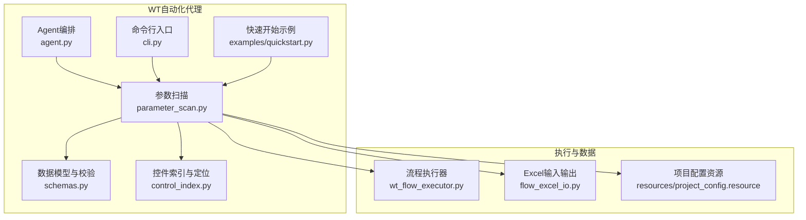
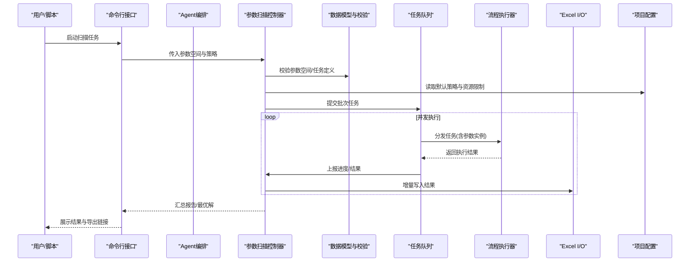
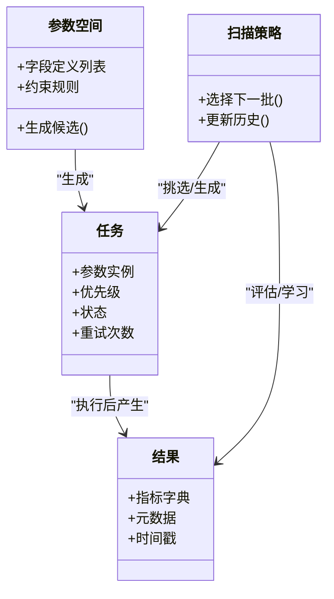
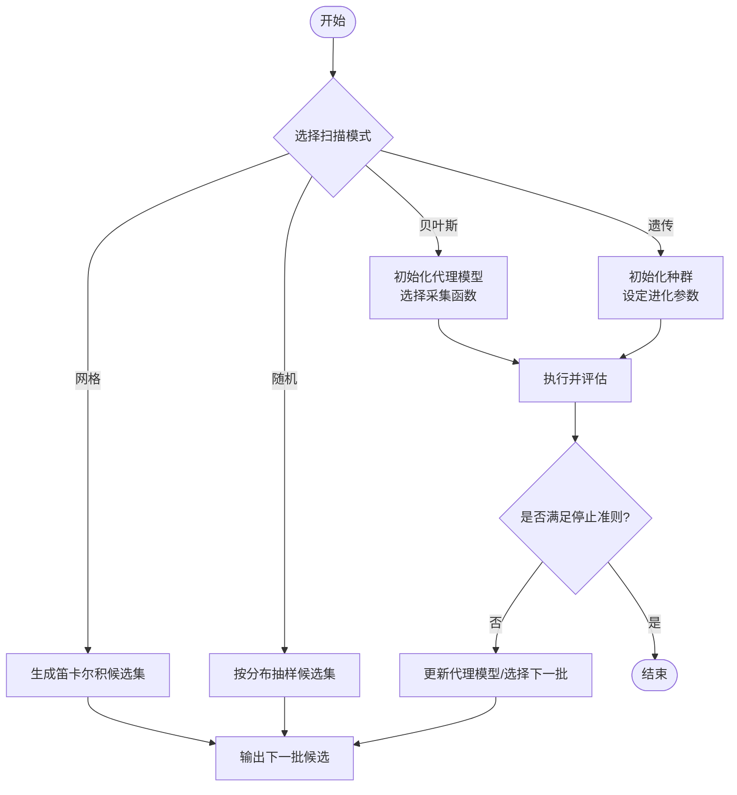
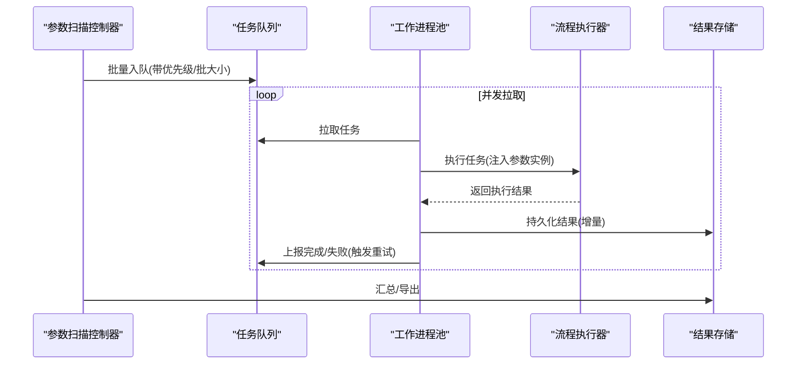
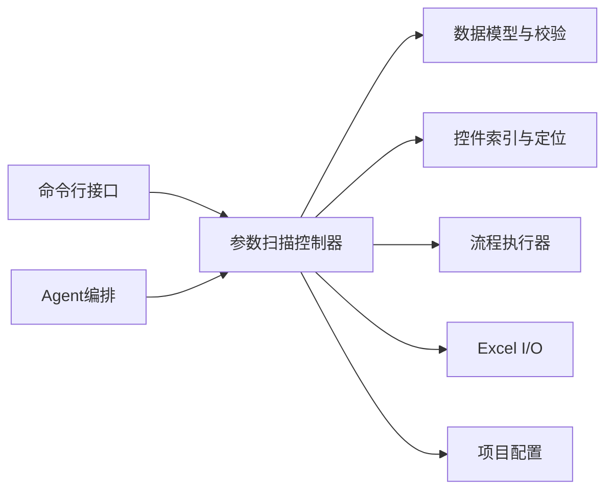

# 参数扫描引擎

<cite>
**本文引用的文件**   
- [WT_AUTOMATION_Agent/parameter_scan.py](file://WT_AUTOMATION_Agent/parameter_scan.py)
- [WT_AUTOMATION_Agent/schemas.py](file://WT_AUTOMATION_Agent/schemas.py)
- [WT_AUTOMATION_Agent/control_index.py](file://WT_AUTOMATION_Agent/control_index.py)
- [WT_AUTOMATION_Agent/agent.py](file://WT_AUTOMATION_Agent/agent.py)
- [WT_AUTOMATION_Agent/cli.py](file://WT_AUTOMATION_Agent/cli.py)
- [WT_AUTOMATION_Agent/examples/quickstart.py](file://WT_AUTOMATION_Agent/examples/quickstart.py)
- [wt_flow_executor.py](file://wt_flow_executor.py)
- [flow_excel_io.py](file://flow_excel_io.py)
- [resources/project_config.resource](file://resources/project_config.resource)
</cite>

## 目录
1. [简介](#简介)
2. [项目结构](#项目结构)
3. [核心组件](#核心组件)
4. [架构总览](#架构总览)
5. [详细组件分析](#详细组件分析)
6. [依赖关系分析](#依赖关系分析)
7. [性能考虑](#性能考虑)
8. [故障排查指南](#故障排查指南)
9. [结论](#结论)
10. [附录](#附录)

## 简介
本技术文档聚焦于WT自动化中的“参数扫描引擎”，围绕以下目标展开：
- 解释参数空间定义、组合生成与优化策略的核心算法
- 说明支持的扫描模式：网格搜索、随机采样、贝叶斯优化、遗传算法
- 阐述批量执行管理机制：任务队列、并发控制、资源分配
- 介绍结果聚合与分析：数据汇总、趋势分析、最优解识别
- 说明任务的持久化与恢复机制
- 描述与执行引擎的集成方式与配置选项
- 提供复杂参数空间与自定义扫描策略的使用示例（以路径引用代替代码片段）
- 给出性能调优与大规模参数扫描的最佳实践

## 项目结构
WT自动化工程采用分层组织，参数扫描相关能力集中在WT_AUTOMATION_Agent模块中，并通过通用执行器与外部流程执行系统对接。

图表来源
- [WT_AUTOMATION_Agent/parameter_scan.py](file://WT_AUTOMATION_Agent/parameter_scan.py)
- [WT_AUTOMATION_Agent/schemas.py](file://WT_AUTOMATION_Agent/schemas.py)
- [WT_AUTOMATION_Agent/control_index.py](file://WT_AUTOMATION_Agent/control_index.py)
- [WT_AUTOMATION_Agent/agent.py](file://WT_AUTOMATION_Agent/agent.py)
- [WT_AUTOMATION_Agent/cli.py](file://WT_AUTOMATION_Agent/cli.py)
- [WT_AUTOMATION_Agent/examples/quickstart.py](file://WT_AUTOMATION_Agent/examples/quickstart.py)
- [wt_flow_executor.py](file://wt_flow_executor.py)
- [flow_excel_io.py](file://flow_excel_io.py)
- [resources/project_config.resource](file://resources/project_config.resource)

章节来源
- [WT_AUTOMATION_Agent/parameter_scan.py](file://WT_AUTOMATION_Agent/parameter_scan.py)
- [WT_AUTOMATION_Agent/schemas.py](file://WT_AUTOMATION_Agent/schemas.py)
- [WT_AUTOMATION_Agent/control_index.py](file://WT_AUTOMATION_Agent/control_index.py)
- [WT_AUTOMATION_Agent/agent.py](file://WT_AUTOMATION_Agent/agent.py)
- [WT_AUTOMATION_Agent/cli.py](file://WT_AUTOMATION_Agent/cli.py)
- [WT_AUTOMATION_Agent/examples/quickstart.py](file://WT_AUTOMATION_Agent/examples/quickstart.py)
- [wt_flow_executor.py](file://wt_flow_executor.py)
- [flow_excel_io.py](file://flow_excel_io.py)
- [resources/project_config.resource](file://resources/project_config.resource)

## 核心组件
- 参数扫描控制器：负责参数空间建模、组合生成、调度与结果收集
- 数据模型与校验：统一参数空间、任务、结果的结构定义与约束检查
- 控件索引与定位：为UI驱动型扫描提供稳定的控件发现与交互能力
- Agent编排：将扫描作为工作流的一部分进行编排与生命周期管理
- 命令行接口：暴露扫描任务的创建、启动、查询与导出能力
- 执行器集成：通过流程执行器驱动具体业务步骤的执行
- Excel I/O：用于批量导入参数集与导出结果报表
- 项目配置：集中管理扫描相关的默认策略与资源限制

章节来源
- [WT_AUTOMATION_Agent/parameter_scan.py](file://WT_AUTOMATION_Agent/parameter_scan.py)
- [WT_AUTOMATION_Agent/schemas.py](file://WT_AUTOMATION_Agent/schemas.py)
- [WT_AUTOMATION_Agent/control_index.py](file://WT_AUTOMATION_Agent/control_index.py)
- [WT_AUTOMATION_Agent/agent.py](file://WT_AUTOMATION_Agent/agent.py)
- [WT_AUTOMATION_Agent/cli.py](file://WT_AUTOMATION_Agent/cli.py)
- [wt_flow_executor.py](file://wt_flow_executor.py)
- [flow_excel_io.py](file://flow_excel_io.py)
- [resources/project_config.resource](file://resources/project_config.resource)

## 架构总览
参数扫描引擎在整体系统中的角色如下：
- 上层通过CLI或Agent发起扫描任务
- 扫描控制器解析参数空间并生成候选方案
- 根据所选策略（网格/随机/贝叶斯/遗传）产出下一批待测点
- 通过执行器批量提交任务到队列，按并发度与资源上限调度
- 执行完成后回写结果，支持增量持久化与断点恢复
- 结果可导出至Excel并进行汇总与可视化

图表来源
- [WT_AUTOMATION_Agent/cli.py](file://WT_AUTOMATION_Agent/cli.py)
- [WT_AUTOMATION_Agent/agent.py](file://WT_AUTOMATION_Agent/agent.py)
- [WT_AUTOMATION_Agent/parameter_scan.py](file://WT_AUTOMATION_Agent/parameter_scan.py)
- [WT_AUTOMATION_Agent/schemas.py](file://WT_AUTOMATION_Agent/schemas.py)
- [wt_flow_executor.py](file://wt_flow_executor.py)
- [flow_excel_io.py](file://flow_excel_io.py)
- [resources/project_config.resource](file://resources/project_config.resource)

## 详细组件分析

### 参数空间定义与组合生成
- 参数空间建模
  - 支持离散值集合、连续区间、条件依赖等表达形式
  - 通过数据模型对类型、取值范围、默认值、约束进行统一校验
- 组合生成策略
  - 网格搜索：笛卡尔积全量枚举，适合低维小空间
  - 随机采样：从分布中抽样，适合高维探索
  - 自适应策略：基于历史结果动态调整采样密度（见后文优化策略）
- 复杂度与规模控制
  - 网格搜索的时间复杂度随维度与基数呈指数增长，需配合最大点数与早停阈值
  - 随机采样可通过样本数与种子控制稳定性与可复现性

章节来源
- [WT_AUTOMATION_Agent/schemas.py](file://WT_AUTOMATION_Agent/schemas.py)
- [WT_AUTOMATION_Agent/parameter_scan.py](file://WT_AUTOMATION_Agent/parameter_scan.py)

#### 类图：参数空间与任务模型

图表来源
- [WT_AUTOMATION_Agent/schemas.py](file://WT_AUTOMATION_Agent/schemas.py)
- [WT_AUTOMATION_Agent/parameter_scan.py](file://WT_AUTOMATION_Agent/parameter_scan.py)

### 扫描模式与优化策略
- 网格搜索
  - 适用场景：低维、离散、需要完整覆盖
  - 特点：确定性、可复现；空间爆炸时需限制规模
- 随机采样
  - 适用场景：高维、连续、探索优先
  - 特点：灵活、可扩展；建议固定随机种子保证可复现
- 贝叶斯优化
  - 适用场景：昂贵函数、黑盒优化、连续/混合空间
  - 核心思想：构建代理模型，利用采集函数平衡探索与利用
  - 关键配置：核函数/协方差、采集函数、初始设计点数量
- 遗传算法
  - 适用场景：非凸、多峰、存在硬约束的组合优化
  - 核心算子：选择、交叉、变异、精英保留
  - 关键配置：种群规模、迭代代数、变异率、适应度函数

图表来源
- [WT_AUTOMATION_Agent/parameter_scan.py](file://WT_AUTOMATION_Agent/parameter_scan.py)
- [WT_AUTOMATION_Agent/schemas.py](file://WT_AUTOMATION_Agent/schemas.py)

章节来源
- [WT_AUTOMATION_Agent/parameter_scan.py](file://WT_AUTOMATION_Agent/parameter_scan.py)
- [WT_AUTOMATION_Agent/schemas.py](file://WT_AUTOMATION_Agent/schemas.py)

### 批量执行管理与并发控制
- 任务队列
  - 支持优先级与重试策略
  - 支持分片与批大小控制，避免一次性提交过多导致资源抖动
- 并发控制
  - 全局并发度上限、每进程/线程池配额
  - 背压与限流：当执行器或外部系统响应变慢时自动降速
- 资源分配
  - 基于CPU/内存/磁盘I/O的动态配额
  - 任务亲和性与隔离：长耗时任务与短任务分离

图表来源
- [WT_AUTOMATION_Agent/parameter_scan.py](file://WT_AUTOMATION_Agent/parameter_scan.py)
- [wt_flow_executor.py](file://wt_flow_executor.py)
- [resources/project_config.resource](file://resources/project_config.resource)

章节来源
- [WT_AUTOMATION_Agent/parameter_scan.py](file://WT_AUTOMATION_Agent/parameter_scan.py)
- [wt_flow_executor.py](file://wt_flow_executor.py)
- [resources/project_config.resource](file://resources/project_config.resource)

### 结果聚合与分析
- 数据汇总
  - 按参数键与指标列进行透视统计
  - 支持去重、异常值过滤、缺失值处理
- 趋势分析
  - 针对连续参数的滑动窗口/回归拟合
  - 对比不同策略下的收敛曲线
- 最优解识别
  - 单目标：按指标排序选取Top-K
  - 多目标：Pareto前沿近似与非支配解筛选

章节来源
- [WT_AUTOMATION_Agent/parameter_scan.py](file://WT_AUTOMATION_Agent/parameter_scan.py)
- [flow_excel_io.py](file://flow_excel_io.py)

### 持久化与恢复机制
- 断点保存
  - 定期快照：已执行任务、未执行队列、中间结果
  - 原子写入：防止部分写入导致的数据不一致
- 恢复流程
  - 启动时加载最近快照，重建队列与状态
  - 冲突检测：跳过已完成任务，仅补跑失败项
- 版本与审计
  - 记录每次扫描的配置、策略与随机种子
  - 结果与配置关联，便于回溯与对比

章节来源
- [WT_AUTOMATION_Agent/parameter_scan.py](file://WT_AUTOMATION_Agent/parameter_scan.py)
- [resources/project_config.resource](file://resources/project_config.resource)

### 与执行引擎的集成与配置
- 集成方式
  - 通过流程执行器将参数实例注入到具体业务步骤
  - 使用控件索引与定位确保UI操作的稳定性
- 配置项
  - 扫描策略、并发度、批大小、超时与重试
  - 结果存储路径、导出格式、日志级别
  - 资源上限与任务亲和性

章节来源
- [WT_AUTOMATION_Agent/control_index.py](file://WT_AUTOMATION_Agent/control_index.py)
- [wt_flow_executor.py](file://wt_flow_executor.py)
- [resources/project_config.resource](file://resources/project_config.resource)

### 使用示例与最佳实践
- 快速开始
  - 参考示例脚本，了解如何声明参数空间、选择扫描模式、设置并发与导出路径
  - 路径引用：[WT_AUTOMATION_Agent/examples/quickstart.py](file://WT_AUTOMATION_Agent/examples/quickstart.py)
- 复杂参数空间
  - 使用条件依赖与分组参数，结合约束校验减少无效组合
  - 路径引用：[WT_AUTOMATION_Agent/schemas.py](file://WT_AUTOMATION_Agent/schemas.py)
- 自定义扫描策略
  - 实现策略接口，注册到扫描控制器，支持在线切换
  - 路径引用：[WT_AUTOMATION_Agent/parameter_scan.py](file://WT_AUTOMATION_Agent/parameter_scan.py)
- 批量导入/导出
  - 通过Excel批量导入参数集与导出结果报表
  - 路径引用：[flow_excel_io.py](file://flow_excel_io.py)

章节来源
- [WT_AUTOMATION_Agent/examples/quickstart.py](file://WT_AUTOMATION_Agent/examples/quickstart.py)
- [WT_AUTOMATION_Agent/schemas.py](file://WT_AUTOMATION_Agent/schemas.py)
- [WT_AUTOMATION_Agent/parameter_scan.py](file://WT_AUTOMATION_Agent/parameter_scan.py)
- [flow_excel_io.py](file://flow_excel_io.py)

## 依赖关系分析
- 内部依赖
  - 参数扫描控制器依赖数据模型与校验、控件索引、执行器、Excel I/O
  - Agent编排与CLI作为上层入口，调用扫描控制器
- 外部依赖
  - 执行器可能依赖底层UI自动化或仿真后端
  - Excel I/O依赖相应读写库
- 耦合与内聚
  - 扫描策略与执行细节解耦，便于替换与扩展
  - 结果持久化与导出独立，利于复用

图表来源
- [WT_AUTOMATION_Agent/cli.py](file://WT_AUTOMATION_Agent/cli.py)
- [WT_AUTOMATION_Agent/agent.py](file://WT_AUTOMATION_Agent/agent.py)
- [WT_AUTOMATION_Agent/parameter_scan.py](file://WT_AUTOMATION_Agent/parameter_scan.py)
- [WT_AUTOMATION_Agent/schemas.py](file://WT_AUTOMATION_Agent/schemas.py)
- [WT_AUTOMATION_Agent/control_index.py](file://WT_AUTOMATION_Agent/control_index.py)
- [wt_flow_executor.py](file://wt_flow_executor.py)
- [flow_excel_io.py](file://flow_excel_io.py)
- [resources/project_config.resource](file://resources/project_config.resource)

章节来源
- [WT_AUTOMATION_Agent/cli.py](file://WT_AUTOMATION_Agent/cli.py)
- [WT_AUTOMATION_Agent/agent.py](file://WT_AUTOMATION_Agent/agent.py)
- [WT_AUTOMATION_Agent/parameter_scan.py](file://WT_AUTOMATION_Agent/parameter_scan.py)
- [WT_AUTOMATION_Agent/schemas.py](file://WT_AUTOMATION_Agent/schemas.py)
- [WT_AUTOMATION_Agent/control_index.py](file://WT_AUTOMATION_Agent/control_index.py)
- [wt_flow_executor.py](file://wt_flow_executor.py)
- [flow_excel_io.py](file://flow_excel_io.py)
- [resources/project_config.resource](file://resources/project_config.resource)

## 性能考虑
- 参数空间裁剪
  - 预筛无效组合，减少执行开销
  - 对高基数离散参数进行分层抽样
- 并发与批大小
  - 根据执行器吞吐与外部系统容量调节并发度
  - 合理批大小降低上下文切换与序列化成本
- 缓存与重用
  - 相同参数实例的结果缓存，避免重复执行
  - 中间结果增量写入，降低I/O压力
- 监控与告警
  - 跟踪任务延迟、失败率、资源利用率
  - 设置阈值触发自动降级或暂停

[本节为通用指导，不直接分析具体文件]

## 故障排查指南
- 常见问题
  - 参数校验失败：检查数据类型、取值范围与约束
  - 执行超时：调整超时与重试策略，检查外部系统负载
  - 结果缺失：确认持久化路径权限与增量写入逻辑
- 诊断手段
  - 启用更详细的日志与追踪ID
  - 导出中间快照与失败任务清单
  - 使用Excel导出进行离线分析与复现

章节来源
- [WT_AUTOMATION_Agent/parameter_scan.py](file://WT_AUTOMATION_Agent/parameter_scan.py)
- [resources/project_config.resource](file://resources/project_config.resource)

## 结论
WT自动化参数扫描引擎通过统一的参数空间建模、灵活的扫描策略与稳健的批量执行机制，实现了从探索到优化的闭环。借助结果聚合与持久化恢复能力，可在大规模参数空间中高效定位优质解，并与现有执行引擎无缝集成。

[本节为总结性内容，不直接分析具体文件]

## 附录
- 术语表
  - 参数空间：所有可调参数的取值集合及其约束
  - 候选点：一次或一批待执行的参数实例
  - 代理模型：用于预测目标函数行为的数学模型
  - Pareto前沿：多目标优化中的非支配解集合
- 参考路径
  - 快速开始示例：[WT_AUTOMATION_Agent/examples/quickstart.py](file://WT_AUTOMATION_Agent/examples/quickstart.py)
  - 数据模型与校验：[WT_AUTOMATION_Agent/schemas.py](file://WT_AUTOMATION_Agent/schemas.py)
  - 参数扫描控制器：[WT_AUTOMATION_Agent/parameter_scan.py](file://WT_AUTOMATION_Agent/parameter_scan.py)
  - 控件索引与定位：[WT_AUTOMATION_Agent/control_index.py](file://WT_AUTOMATION_Agent/control_index.py)
  - 流程执行器：[wt_flow_executor.py](file://wt_flow_executor.py)
  - Excel I/O：[flow_excel_io.py](file://flow_excel_io.py)
  - 项目配置：[resources/project_config.resource](file://resources/project_config.resource)