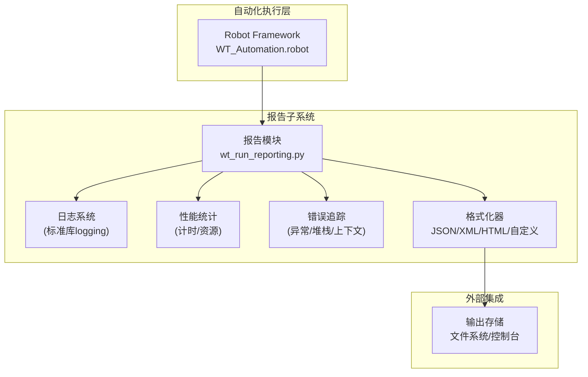
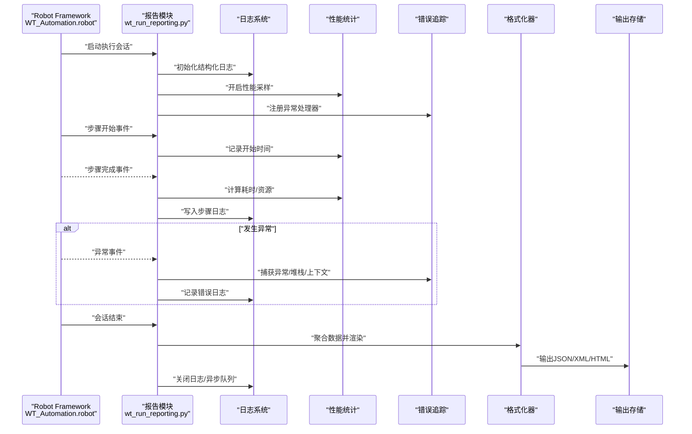
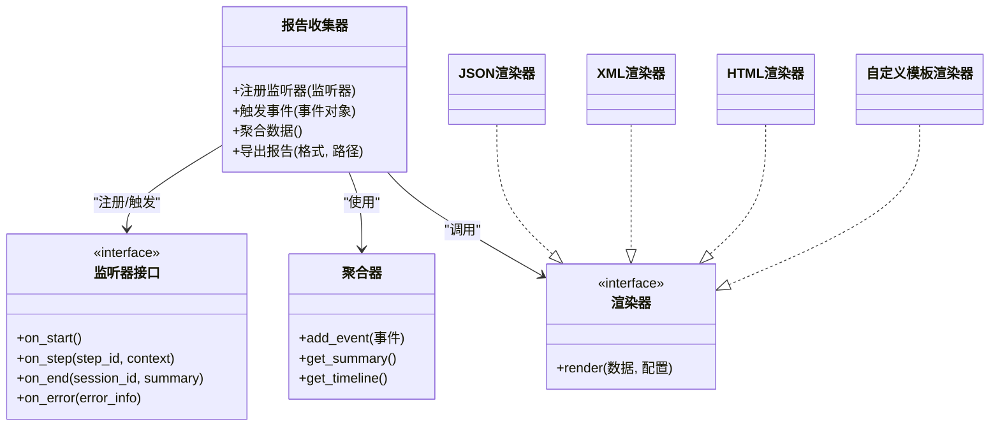
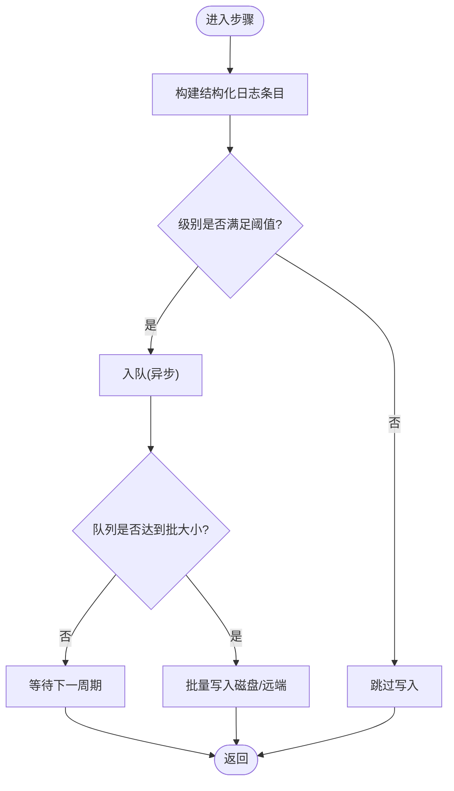
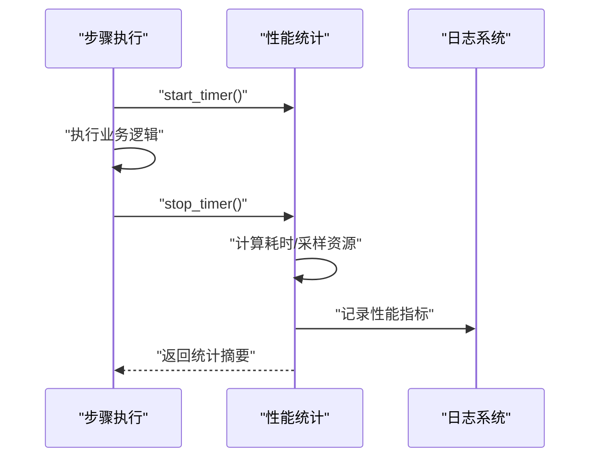
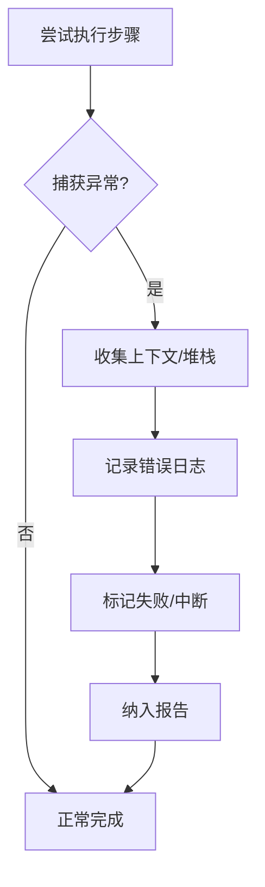
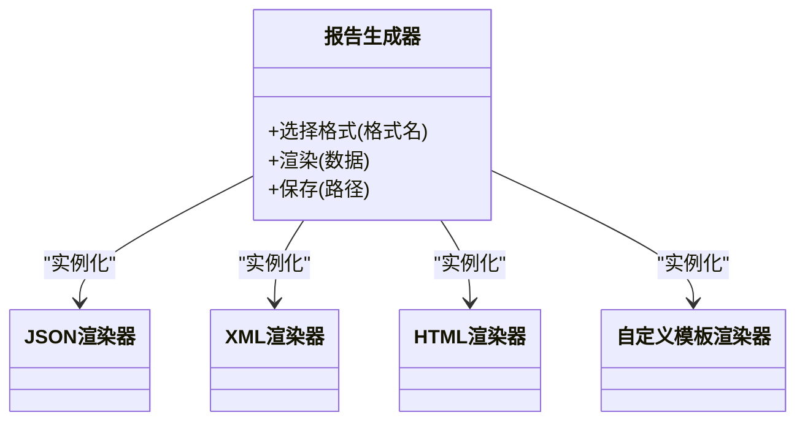
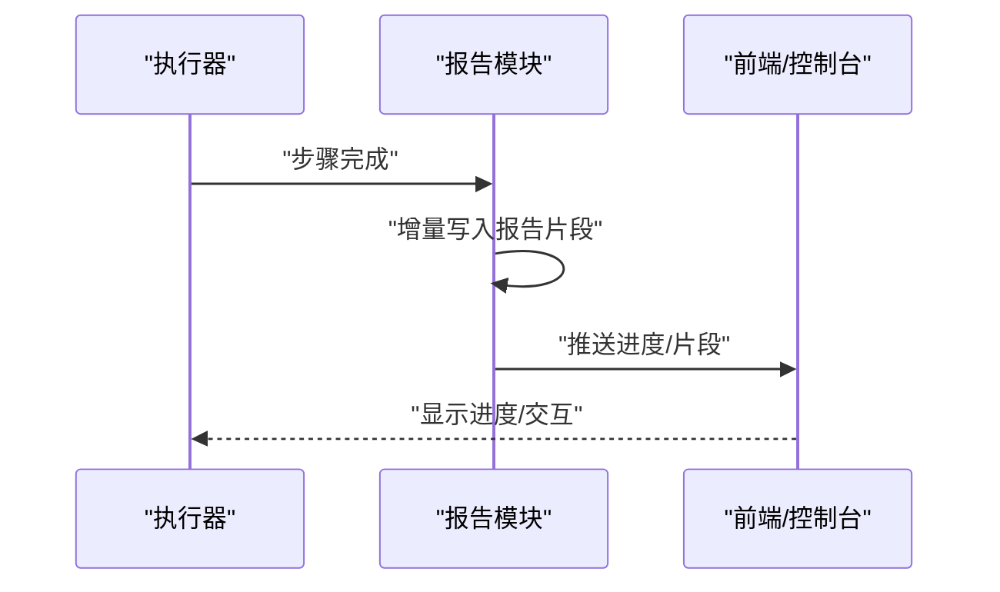
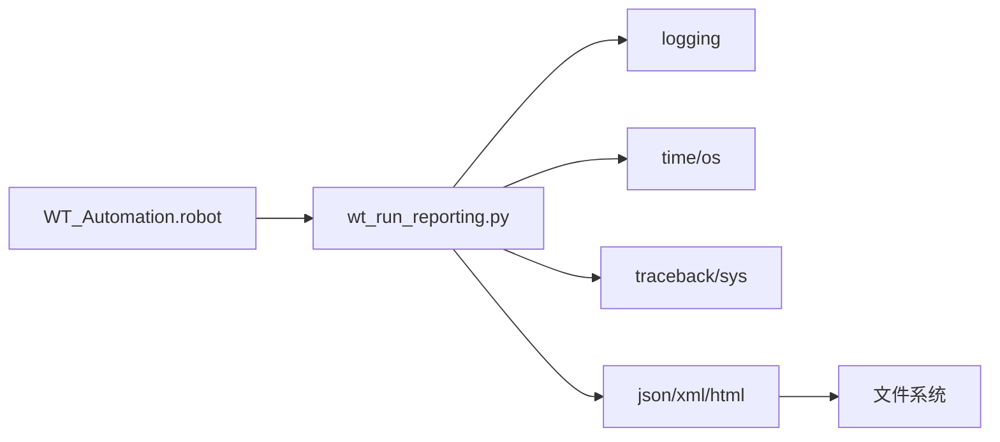

# 执行报告系统

<cite>
**本文引用的文件**   
- [wt_run_reporting.py](file://wt_run_reporting.py)
- [test_wt_run_reporting.py](file://tests/test_wt_run_reporting.py)
- [WT_Automation.robot](file://WT_Automation.robot)
- [PROJECT_ARCHITECTURE.md](file://PROJECT_ARCHITECTURE.md)
</cite>

## 目录
1. [简介](#简介)
2. [项目结构](#项目结构)
3. [核心组件](#核心组件)
4. [架构总览](#架构总览)
5. [详细组件分析](#详细组件分析)
6. [依赖关系分析](#依赖关系分析)
7. [性能考虑](#性能考虑)
8. [故障排查指南](#故障排查指南)
9. [结论](#结论)
10. [附录](#附录)

## 简介
本技术文档聚焦于WT自动化执行报告系统的实现与扩展，围绕以下目标展开：
- 报告收集框架：事件监听、数据聚合与格式化输出机制
- 日志记录系统：结构化日志、分级记录与异步写入优化
- 性能统计：执行时间测量、资源使用监控与瓶颈分析
- 错误追踪：异常捕获、堆栈跟踪与上下文信息收集
- 多格式报告：HTML、JSON、XML与自定义模板支持
- 实时报告更新与进度反馈
- 扩展指南：如何新增自定义报告格式与分析指标

## 项目结构
与执行报告系统直接相关的代码位于仓库根目录的 wt_run_reporting.py，以及测试用例 tests/test_wt_run_reporting.py。顶层脚本 WT_Automation.robot 作为Robot Framework入口，负责驱动流程并触发报告生成。项目整体架构说明可参考 PROJECT_ARCHITECTURE.md。

图表来源
- [wt_run_reporting.py](file://wt_run_reporting.py)
- [WT_Automation.robot](file://WT_Automation.robot)
- [PROJECT_ARCHITECTURE.md](file://PROJECT_ARCHITECTURE.md)

章节来源
- [wt_run_reporting.py](file://wt_run_reporting.py)
- [tests/test_wt_run_reporting.py](file://tests/test_wt_run_reporting.py)
- [WT_Automation.robot](file://WT_Automation.robot)
- [PROJECT_ARCHITECTURE.md](file://PROJECT_ARCHITECTURE.md)

## 核心组件
- 报告收集框架
  - 事件监听：通过钩子或装饰器在关键生命周期（开始、步骤、结束）注入回调，采集上下文与指标。
  - 数据聚合：将分散的事件按任务/步骤维度聚合为结构化记录，便于后续分析与导出。
  - 格式化输出：提供多种内置格式（JSON、XML、HTML）与可扩展的自定义模板接口。
- 日志记录系统
  - 结构化日志：以键值对形式记录事件，便于检索与可视化。
  - 分级记录：DEBUG/INFO/WARNING/ERROR/CRITICAL 分级控制输出粒度。
  - 异步写入：可选异步队列写入，降低主流程阻塞。
- 性能统计
  - 执行时间测量：基于高精度计时器统计阶段耗时。
  - 资源使用监控：CPU/内存等指标采样与汇总。
  - 瓶颈分析：识别慢步骤与高开销操作。
- 错误追踪
  - 异常捕获：统一拦截未处理异常，附加上下文。
  - 堆栈跟踪：保留完整调用链，定位问题根源。
  - 上下文信息：收集运行环境、输入参数、中间状态等。
- 多格式报告
  - JSON：适合机器消费与流水线集成。
  - XML：兼容传统系统集成。
  - HTML：面向人类阅读与浏览器展示。
  - 自定义模板：允许用户定义渲染逻辑与布局。
- 实时报告与进度反馈
  - 增量更新：边执行边产出阶段性结果。
  - 进度推送：通过回调或消息通道向UI/前端推送进度。

章节来源
- [wt_run_reporting.py](file://wt_run_reporting.py)
- [tests/test_wt_run_reporting.py](file://tests/test_wt_run_reporting.py)

## 架构总览
下图展示了从自动化执行到报告输出的端到端流程，包括事件采集、聚合、格式化与落盘。

图表来源
- [wt_run_reporting.py](file://wt_run_reporting.py)
- [WT_Automation.robot](file://WT_Automation.robot)

## 详细组件分析

### 报告收集框架
- 事件监听
  - 设计要点：在关键生命周期点注册回调，确保最小侵入性；支持同步与异步回调。
  - 数据结构：事件对象包含类型、时间戳、上下文、指标等字段。
  - 扩展点：提供插件式监听器接口，便于接入第三方系统。
- 数据聚合
  - 聚合策略：按会话ID、任务ID、步骤ID进行分组；支持窗口化聚合与滑动统计。
  - 内存模型：采用轻量级记录结构，避免大对象引用导致内存泄漏。
  - 一致性：保证事件顺序与幂等性，支持重试与去重。
- 格式化输出
  - 内置格式：JSON、XML、HTML；每种格式对应独立渲染器。
  - 自定义模板：通过注册新渲染器实现，支持主题与样式配置。
  - 流式输出：支持分块写入，减少峰值内存占用。

图表来源
- [wt_run_reporting.py](file://wt_run_reporting.py)

章节来源
- [wt_run_reporting.py](file://wt_run_reporting.py)

### 日志记录系统
- 结构化日志
  - 键值对记录：每个事件包含固定字段（级别、时间戳、会话ID、步骤ID、消息）。
  - 可查询性：支持按字段过滤与索引，便于日志平台对接。
- 分级记录
  - 级别控制：根据环境动态调整输出级别，生产环境默认INFO及以上。
  - 上下文传播：跨线程/进程传递上下文标识，保持链路一致。
- 异步写入优化
  - 队列缓冲：使用无界/有界队列缓冲日志条目，降低I/O阻塞。
  - 批量落盘：合并小条目，提升吞吐。
  - 优雅关闭：确保队列清空后再退出，避免丢失日志。

图表来源
- [wt_run_reporting.py](file://wt_run_reporting.py)

章节来源
- [wt_run_reporting.py](file://wt_run_reporting.py)

### 性能统计功能
- 执行时间测量
  - 高精度计时：使用高分辨率时钟记录阶段起止时间。
  - 分层统计：会话级、任务级、步骤级多维度汇总。
- 资源使用监控
  - CPU/内存采样：周期性读取系统指标，关联到具体步骤。
  - 阈值告警：超过阈值时记录警告并标记瓶颈候选。
- 瓶颈分析
  - 排序与TopN：按耗时/资源消耗排序，识别前N慢步骤。
  - 趋势对比：多次执行的差异分析，辅助回归检测。

图表来源
- [wt_run_reporting.py](file://wt_run_reporting.py)

章节来源
- [wt_run_reporting.py](file://wt_run_reporting.py)

### 错误追踪机制
- 异常捕获
  - 全局处理器：捕获未处理异常，避免进程崩溃。
  - 局部捕获：在关键步骤包裹try/catch，附加上下文。
- 堆栈跟踪
  - 完整调用链：保留函数名、行号、模块信息。
  - 裁剪策略：可选去除内部框架帧，突出业务相关堆栈。
- 上下文信息收集
  - 运行时快照：输入参数、环境变量、临时状态。
  - 关联事件：绑定最近的事件序列，便于复现。

图表来源
- [wt_run_reporting.py](file://wt_run_reporting.py)

章节来源
- [wt_run_reporting.py](file://wt_run_reporting.py)

### 报告生成的多格式支持
- JSON
  - 适用场景：CI/CD集成、数据分析管道。
  - 特性：紧凑、易解析、支持嵌套结构。
- XML
  - 适用场景：企业系统集成、历史兼容。
  - 特性：强约束、Schema校验。
- HTML
  - 适用场景：人工审阅、浏览器查看。
  - 特性：可读性强、可嵌入图表。
- 自定义模板
  - 扩展方式：注册新渲染器，实现统一接口。
  - 配置项：主题、语言、输出路径、压缩选项。

图表来源
- [wt_run_reporting.py](file://wt_run_reporting.py)

章节来源
- [wt_run_reporting.py](file://wt_run_reporting.py)

### 实时报告更新与进度反馈
- 增量更新
  - 流式写入：每步完成后追加记录，避免全量重写。
  - 版本化：输出带版本号的文件，便于增量消费。
- 进度推送
  - 回调机制：注册进度回调，通知UI或前端。
  - 事件广播：通过消息总线发布进度事件。
- 前端集成
  - WebSocket/SSE：实时推送进度与结果片段。
  - 轮询拉取：简单场景下定时拉取最新片段。

图表来源
- [wt_run_reporting.py](file://wt_run_reporting.py)
- [WT_Automation.robot](file://WT_Automation.robot)

章节来源
- [wt_run_reporting.py](file://wt_run_reporting.py)
- [WT_Automation.robot](file://WT_Automation.robot)

### 扩展指南：自定义报告格式与分析指标
- 新增自定义报告格式
  - 步骤一：实现渲染器接口，定义渲染逻辑与配置项。
  - 步骤二：注册渲染器到报告生成器，支持命令行或配置文件启用。
  - 步骤三：编写单元测试，覆盖边界条件与异常路径。
- 新增分析指标
  - 步骤一：在性能统计模块中增加指标采集点。
  - 步骤二：在聚合器中维护指标结构与窗口统计。
  - 步骤三：在报告中展示指标，并提供导出能力。
- 示例路径
  - 参考现有渲染器与测试用例，快速搭建自定义格式骨架。

章节来源
- [wt_run_reporting.py](file://wt_run_reporting.py)
- [tests/test_wt_run_reporting.py](file://tests/test_wt_run_reporting.py)

## 依赖关系分析
- 内部依赖
  - 报告模块依赖日志系统与性能统计模块，用于记录与度量。
  - 错误追踪贯穿各模块，确保异常信息完整。
- 外部依赖
  - Robot Framework：作为自动化执行入口，驱动流程与事件。
  - 标准库：json、xml.etree、html、logging、time、os 等。
- 耦合与内聚
  - 低耦合：渲染器与聚合器解耦，便于替换与扩展。
  - 高内聚：同一职责的代码集中管理，提升可维护性。

图表来源
- [wt_run_reporting.py](file://wt_run_reporting.py)
- [WT_Automation.robot](file://WT_Automation.robot)

章节来源
- [wt_run_reporting.py](file://wt_run_reporting.py)
- [WT_Automation.robot](file://WT_Automation.robot)

## 性能考虑
- I/O优化
  - 异步写入与批量落盘，减少频繁磁盘访问。
  - 流式渲染，避免一次性加载大量数据到内存。
- 内存管理
  - 及时释放事件引用，防止长会话导致内存增长。
  - 使用生成器与迭代器处理大数据集。
- 并发安全
  - 日志与聚合器的并发写入需加锁或使用线程安全队列。
- 基准与回归
  - 建立性能基线，定期回归检测，发现退化及时修复。

[本节为通用指导，不直接分析具体文件]

## 故障排查指南
- 常见问题
  - 日志缺失：检查异步队列是否优雅关闭；确认日志级别设置。
  - 报告不完整：验证增量写入是否被中断；检查渲染器异常。
  - 性能下降：观察CPU/内存采样，定位热点步骤。
- 调试技巧
  - 提高日志级别至DEBUG，获取更详细信息。
  - 启用堆栈裁剪开关，聚焦业务相关调用链。
  - 使用最小复现用例，隔离问题范围。
- 恢复策略
  - 断点续跑：基于上次会话ID继续执行，避免重复工作。
  - 回滚与清理：失败时清理临时文件，保持环境整洁。

章节来源
- [wt_run_reporting.py](file://wt_run_reporting.py)
- [tests/test_wt_run_reporting.py](file://tests/test_wt_run_reporting.py)

## 结论
WT自动化执行报告系统通过事件驱动的收集框架、结构化日志、性能统计与错误追踪，提供了完整的执行观测与报告能力。其模块化设计与可扩展接口使得新增格式与指标变得简单直观。结合实时进度反馈与多格式输出，既能满足机器消费，也能服务于人工审阅与持续改进。

[本节为总结性内容，不直接分析具体文件]

## 附录
- 术语表
  - 会话：一次完整的自动化执行过程。
  - 步骤：会话中的最小可观测单元。
  - 渲染器：负责将聚合数据转换为特定格式的组件。
- 参考
  - 项目架构概览参见 PROJECT_ARCHITECTURE.md。
  - 自动化入口脚本见 WT_Automation.robot。

章节来源
- [PROJECT_ARCHITECTURE.md](file://PROJECT_ARCHITECTURE.md)
- [WT_Automation.robot](file://WT_Automation.robot)