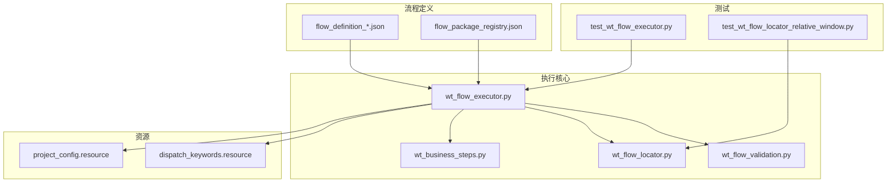
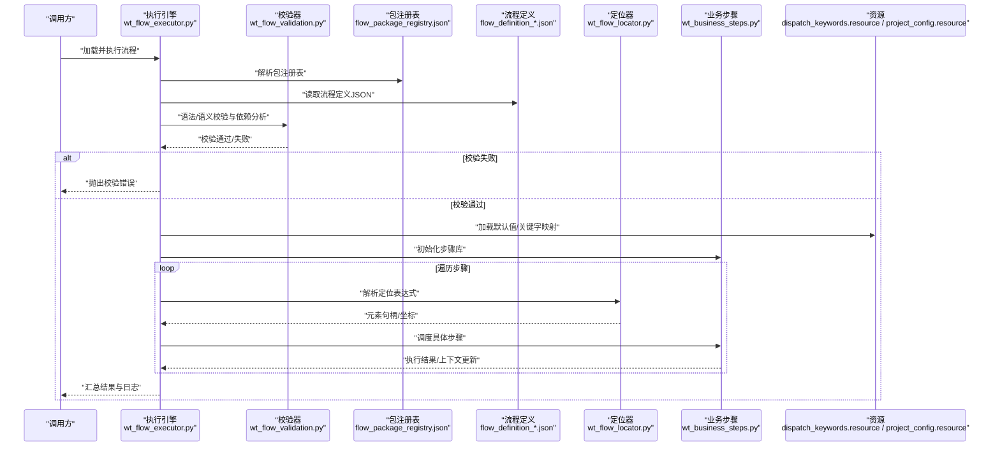
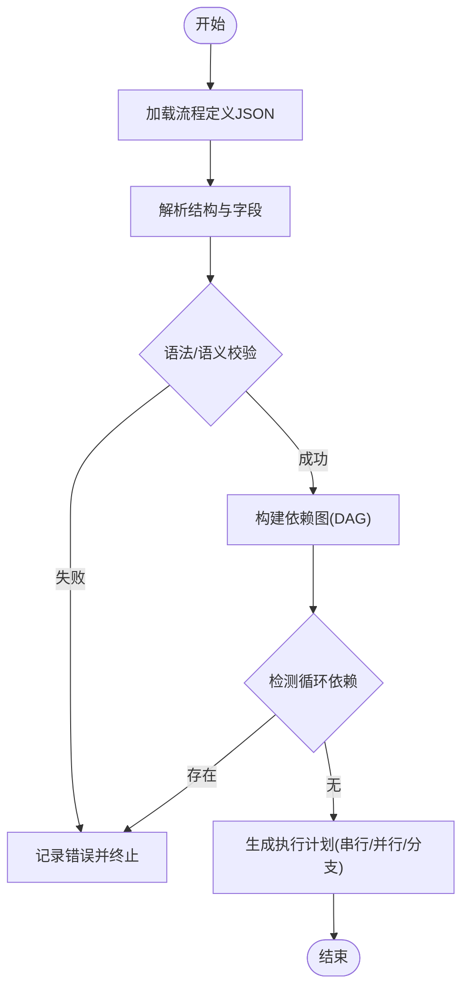
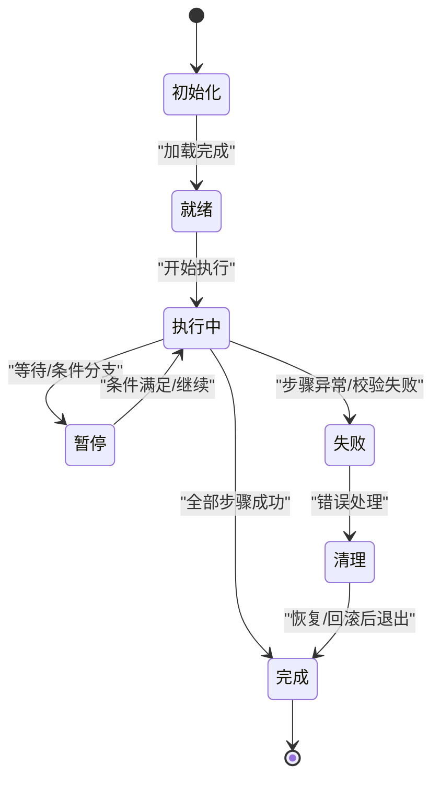
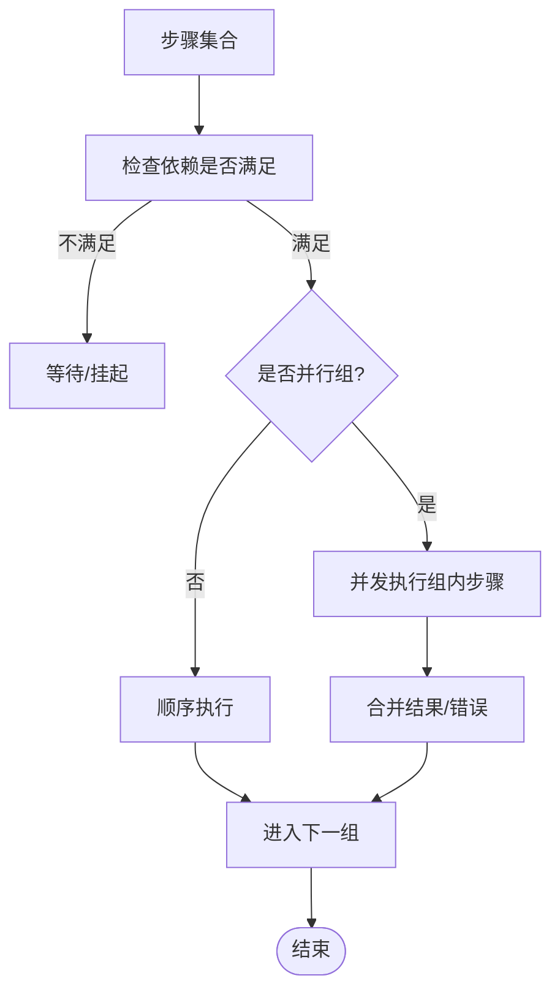
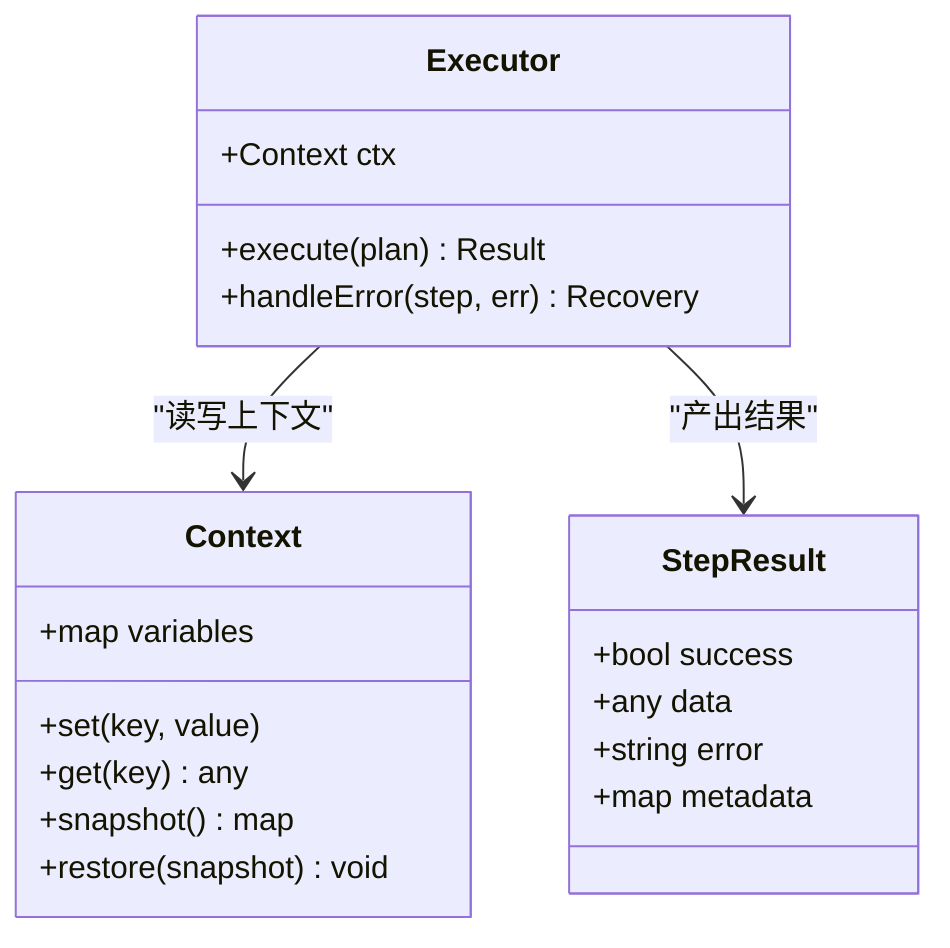
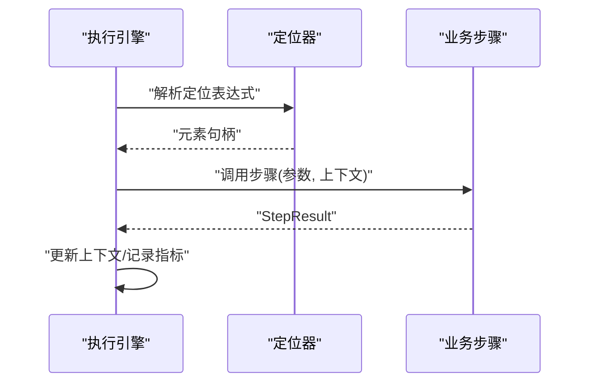
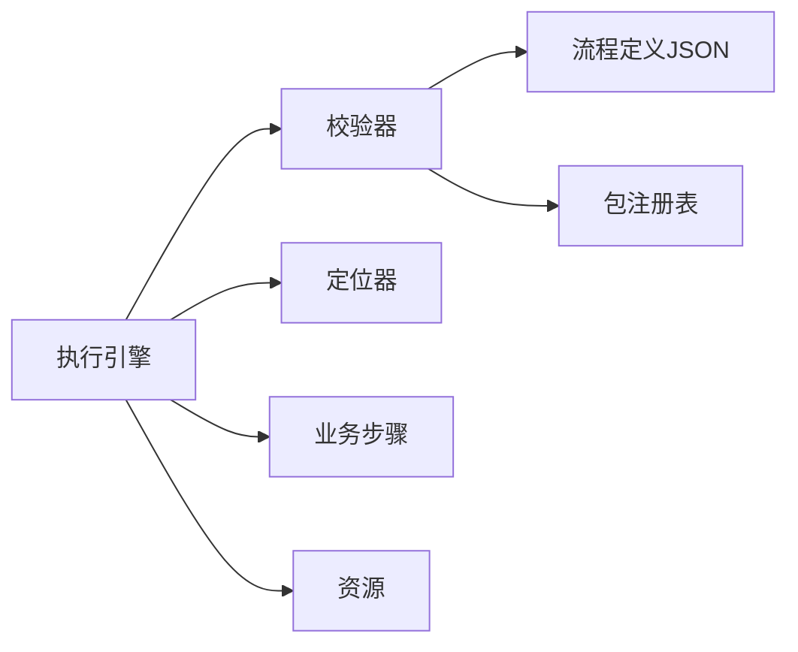

# 流程执行核心

<cite>
**本文引用的文件**   
- [wt_flow_executor.py](file://wt_flow_executor.py)
- [wt_flow_validation.py](file://wt_flow_validation.py)
- [wt_flow_locator.py](file://wt_flow_locator.py)
- [wt_business_steps.py](file://wt_business_steps.py)
- [flow_definition_测试.json](file://flow_packages/flow_definition_测试.json)
- [flow_definition_geo_import_data_file.json](file://flow_packages/flow_definition_geo_import_data_file.json)
- [flow_package_registry.json](file://flow_packages/flow_package_registry.json)
- [test_wt_flow_executor.py](file://tests/test_wt_flow_executor.py)
- [test_wt_flow_locator_relative_window.py](file://tests/test_wt_flow_locator_relative_window.py)
- [wt_action_schema.py](file://wt_action_schema.py)
- [wt_action_defaults.py](file://wt_action_defaults.py)
- [dispatch_keywords.resource](file://resources/dispatch_keywords.resource)
- [project_config.resource](file://resources/project_config.resource)
</cite>

## 目录
1. [简介](#简介)
2. [项目结构](#项目结构)
3. [核心组件](#核心组件)
4. [架构总览](#架构总览)
5. [详细组件分析](#详细组件分析)
6. [依赖关系分析](#依赖关系分析)
7. [性能考虑](#性能考虑)
8. [故障排查指南](#故障排查指南)
9. [结论](#结论)
10. [附录](#附录)

## 简介
本技术文档聚焦于WT自动化“流程执行核心”，围绕以下目标展开：
- 流程解析器：JSON格式解析、语法验证与依赖关系分析
- 执行引擎生命周期：从流程加载到执行的完整过程
- 动作调度机制：串行、并行与条件分支处理
- 状态管理：上下文变量传递、错误状态与恢复策略
- 监控与中断：执行监控、可中断性与资源清理
- 扩展点：自定义执行逻辑与行为扩展示例
- 集成接口：与定位器系统、业务步骤库的对接方式

## 项目结构
WT自动化以“流程定义（JSON）+ 执行引擎 + 定位器 + 业务步骤”为核心。关键目录与文件职责如下：
- flow_packages：存放流程定义JSON与包注册表，用于描述业务流程、步骤序列与参数
- resources：关键字分发与项目配置等资源文件
- wt_flow_executor.py：流程执行引擎主入口，负责加载、校验、调度与生命周期管理
- wt_flow_validation.py：流程JSON语法与语义校验、依赖分析
- wt_flow_locator.py：UI元素定位器，支持相对窗口、层级路径等
- wt_business_steps.py：业务步骤实现与封装，供执行引擎调用
- tests：覆盖执行器、定位器、报告等模块的单元测试

图表来源
- [wt_flow_executor.py](file://wt_flow_executor.py)
- [wt_flow_validation.py](file://wt_flow_validation.py)
- [wt_flow_locator.py](file://wt_flow_locator.py)
- [wt_business_steps.py](file://wt_business_steps.py)
- [flow_definition_测试.json](file://flow_packages/flow_definition_测试.json)
- [flow_package_registry.json](file://flow_packages/flow_package_registry.json)
- [dispatch_keywords.resource](file://resources/dispatch_keywords.resource)
- [project_config.resource](file://resources/project_config.resource)
- [test_wt_flow_executor.py](file://tests/test_wt_flow_executor.py)
- [test_wt_flow_locator_relative_window.py](file://tests/test_wt_flow_locator_relative_window.py)

章节来源
- [wt_flow_executor.py](file://wt_flow_executor.py)
- [wt_flow_validation.py](file://wt_flow_validation.py)
- [wt_flow_locator.py](file://wt_flow_locator.py)
- [wt_business_steps.py](file://wt_business_steps.py)
- [flow_definition_测试.json](file://flow_packages/flow_definition_测试.json)
- [flow_package_registry.json](file://flow_packages/flow_package_registry.json)
- [dispatch_keywords.resource](file://resources/dispatch_keywords.resource)
- [project_config.resource](file://resources/project_config.resource)
- [test_wt_flow_executor.py](file://tests/test_wt_flow_executor.py)
- [test_wt_flow_locator_relative_window.py](file://tests/test_wt_flow_locator_relative_window.py)

## 核心组件
- 流程解析器与校验器
  - 负责读取并解析JSON流程定义，进行语法与语义校验，构建依赖图，识别串行/并行/条件分支节点
- 执行引擎
  - 管理流程生命周期：加载、预检查、初始化上下文、调度执行、结果聚合、收尾清理
  - 提供中断信号、超时控制、重试与回滚策略
- 定位器系统
  - 基于控件树、相对窗口、图像模板等多模态定位策略，返回稳定可复用的元素句柄或坐标
- 业务步骤库
  - 将底层UI操作封装为领域友好的步骤，如“打开窗口”、“输入文本”、“点击确认”等
- 资源与配置
  - 关键字分发映射、项目级默认值与开关

章节来源
- [wt_flow_executor.py](file://wt_flow_executor.py)
- [wt_flow_validation.py](file://wt_flow_validation.py)
- [wt_flow_locator.py](file://wt_flow_locator.py)
- [wt_business_steps.py](file://wt_business_steps.py)
- [dispatch_keywords.resource](file://resources/dispatch_keywords.resource)
- [project_config.resource](file://resources/project_config.resource)

## 架构总览
下图展示了从流程定义到执行结果的端到端数据流与控制流。

图表来源
- [wt_flow_executor.py](file://wt_flow_executor.py)
- [wt_flow_validation.py](file://wt_flow_validation.py)
- [flow_package_registry.json](file://flow_packages/flow_package_registry.json)
- [flow_definition_测试.json](file://flow_packages/flow_definition_测试.json)
- [wt_flow_locator.py](file://wt_flow_locator.py)
- [wt_business_steps.py](file://wt_business_steps.py)
- [dispatch_keywords.resource](file://resources/dispatch_keywords.resource)
- [project_config.resource](file://resources/project_config.resource)

## 详细组件分析

### 流程解析器与校验器
- JSON格式解析
  - 读取流程定义JSON，解析顶层元信息、步骤列表、分组与依赖声明
  - 解析包注册表，建立步骤名到实现的映射
- 语法与语义验证
  - 校验必填字段、类型约束、引用完整性（步骤ID、变量名、定位器键）
  - 校验步骤间依赖关系，检测循环依赖与不可达节点
- 依赖关系分析
  - 构建有向无环图（DAG），计算拓扑序，识别可并行执行的独立子图
  - 输出执行计划，包含串行段、并行段与条件分支边界

图表来源
- [wt_flow_validation.py](file://wt_flow_validation.py)
- [flow_definition_测试.json](file://flow_packages/flow_definition_测试.json)
- [flow_package_registry.json](file://flow_packages/flow_package_registry.json)

章节来源
- [wt_flow_validation.py](file://wt_flow_validation.py)
- [flow_definition_测试.json](file://flow_packages/flow_definition_测试.json)
- [flow_package_registry.json](file://flow_packages/flow_package_registry.json)

### 执行引擎生命周期
- 启动阶段
  - 加载包注册表与资源，初始化步骤库、定位器、上下文存储
  - 根据执行计划准备并发池、任务队列与监控指标
- 运行阶段
  - 按拓扑序推进，遇到并行段使用线程/进程池并发执行
  - 条件分支依据上下文变量动态选择路径
  - 每步执行前后触发钩子（日志、断言、上下文写入）
- 收尾阶段
  - 收集结果、生成报告、释放资源、清理临时文件
  - 支持中断信号，确保已分配资源被正确回收

图表来源
- [wt_flow_executor.py](file://wt_flow_executor.py)
- [test_wt_flow_executor.py](file://tests/test_wt_flow_executor.py)

章节来源
- [wt_flow_executor.py](file://wt_flow_executor.py)
- [test_wt_flow_executor.py](file://tests/test_wt_flow_executor.py)

### 动作调度机制
- 串行执行
  - 顺序推进，前一步成功才进入下一步；任一失败立即短路
- 并行执行
  - 对无依赖的步骤集并发执行，合并结果；任一失败触发整体失败或局部失败策略
- 条件分支
  - 基于上下文变量与表达式评估选择分支路径；支持嵌套分支与多路选择

图表来源
- [wt_flow_executor.py](file://wt_flow_executor.py)
- [wt_flow_validation.py](file://wt_flow_validation.py)

章节来源
- [wt_flow_executor.py](file://wt_flow_executor.py)
- [wt_flow_validation.py](file://wt_flow_validation.py)

### 状态管理机制
- 上下文变量
  - 全局上下文字典贯穿整个流程，支持读写、作用域隔离（步骤级/组级）
  - 变量来源包括：步骤返回值、外部注入、资源默认值
- 错误状态与恢复
  - 捕获异常并分类（可重试/不可重试），记录堆栈与上下文快照
  - 支持重试策略（指数退避）、补偿步骤（回滚/清理）
- 恢复策略
  - 在失败点之后插入恢复步骤，尝试回到安全状态或优雅降级

图表来源
- [wt_flow_executor.py](file://wt_flow_executor.py)

章节来源
- [wt_flow_executor.py](file://wt_flow_executor.py)

### 执行监控与中断处理
- 监控指标
  - 步骤耗时、成功率、并发度、资源占用、上下文变更事件
- 中断与超时
  - 支持外部中断信号，执行器定期检查并在安全点退出
  - 单步超时保护，防止长时间阻塞
- 资源清理
  - 确保窗口、句柄、临时文件在退出时释放

章节来源
- [wt_flow_executor.py](file://wt_flow_executor.py)
- [test_wt_flow_executor.py](file://tests/test_wt_flow_executor.py)

### 扩展点与自定义执行逻辑
- 自定义步骤
  - 在业务步骤库中新增方法，并通过关键字映射暴露给流程定义
- 自定义定位器
  - 扩展定位策略（如相对窗口、图像匹配、属性组合），返回统一句柄
- 自定义调度策略
  - 替换并行执行策略、重试策略、失败处理策略
- 示例参考
  - 参考现有测试用例中的用法模式，编写新的步骤与流程定义

章节来源
- [wt_business_steps.py](file://wt_business_steps.py)
- [wt_flow_locator.py](file://wt_flow_locator.py)
- [test_wt_flow_executor.py](file://tests/test_wt_flow_executor.py)
- [test_wt_flow_locator_relative_window.py](file://tests/test_wt_flow_locator_relative_window.py)

### 与定位器系统与业务步骤库的集成接口
- 定位器接口
  - 输入：定位表达式（字符串或结构化对象）
  - 输出：元素句柄/坐标/可见性状态
  - 能力：相对窗口、层级路径、属性过滤、图像模板
- 业务步骤接口
  - 输入：步骤名、参数、上下文
  - 输出：StepResult（成功/失败、数据、错误、元数据）
  - 能力：UI交互、数据转换、断言、副作用清理

图表来源
- [wt_flow_locator.py](file://wt_flow_locator.py)
- [wt_business_steps.py](file://wt_business_steps.py)
- [dispatch_keywords.resource](file://resources/dispatch_keywords.resource)

章节来源
- [wt_flow_locator.py](file://wt_flow_locator.py)
- [wt_business_steps.py](file://wt_business_steps.py)
- [dispatch_keywords.resource](file://resources/dispatch_keywords.resource)

## 依赖关系分析
- 内部依赖
  - 执行引擎依赖校验器、定位器、业务步骤与资源
  - 校验器依赖流程定义与包注册表
- 外部依赖
  - UI自动化后端（由定位器封装）
  - 文件系统（流程定义、资源、报告）
- 潜在风险
  - 循环依赖（由校验器检测）
  - 并发竞争（需保证上下文与资源的线程安全）

图表来源
- [wt_flow_executor.py](file://wt_flow_executor.py)
- [wt_flow_validation.py](file://wt_flow_validation.py)
- [flow_definition_测试.json](file://flow_packages/flow_definition_测试.json)
- [flow_package_registry.json](file://flow_packages/flow_package_registry.json)
- [dispatch_keywords.resource](file://resources/dispatch_keywords.resource)
- [project_config.resource](file://resources/project_config.resource)

章节来源
- [wt_flow_executor.py](file://wt_flow_executor.py)
- [wt_flow_validation.py](file://wt_flow_validation.py)
- [flow_definition_测试.json](file://flow_packages/flow_definition_测试.json)
- [flow_package_registry.json](file://flow_packages/flow_package_registry.json)
- [dispatch_keywords.resource](file://resources/dispatch_keywords.resource)
- [project_config.resource](file://resources/project_config.resource)

## 性能考虑
- 并行化
  - 合理划分并行组，避免跨步骤共享可变状态导致锁竞争
- 定位优化
  - 缓存稳定的定位结果，减少重复查找
- 资源复用
  - 复用窗口句柄、连接池，避免频繁创建销毁
- 监控与调优
  - 基于指标定位瓶颈步骤，调整超时与重试策略

[本节为通用指导，无需特定文件来源]

## 故障排查指南
- 常见问题
  - 流程定义字段缺失或类型错误：查看校验器错误清单
  - 定位失败：检查定位表达式与作用域（相对窗口）
  - 步骤执行超时：调整超时阈值或优化步骤实现
  - 并发冲突：检查上下文写入是否线程安全
- 调试建议
  - 启用详细日志，记录上下文快照与步骤入参/出参
  - 使用最小可复现流程逐步缩小问题范围

章节来源
- [wt_flow_validation.py](file://wt_flow_validation.py)
- [wt_flow_locator.py](file://wt_flow_locator.py)
- [test_wt_flow_executor.py](file://tests/test_wt_flow_executor.py)
- [test_wt_flow_locator_relative_window.py](file://tests/test_wt_flow_locator_relative_window.py)

## 结论
WT自动化流程执行核心通过“解析-校验-调度-执行-监控”的闭环，提供了可扩展、可观测、可恢复的流程执行能力。借助定位器与业务步骤库的解耦设计，用户可快速构建复杂UI自动化流程，并以模块化方式扩展执行行为。

[本节为总结，无需特定文件来源]

## 附录
- 相关模型与配置
  - 动作Schema与默认值：用于约束步骤参数与缺省值
  - 项目配置与关键字分发：集中管理默认行为与映射关系

章节来源
- [wt_action_schema.py](file://wt_action_schema.py)
- [wt_action_defaults.py](file://wt_action_defaults.py)
- [dispatch_keywords.resource](file://resources/dispatch_keywords.resource)
- [project_config.resource](file://resources/project_config.resource)