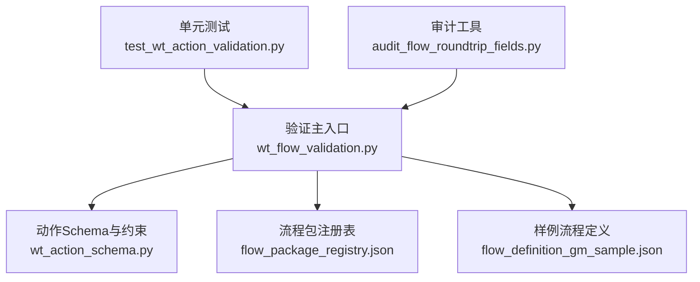
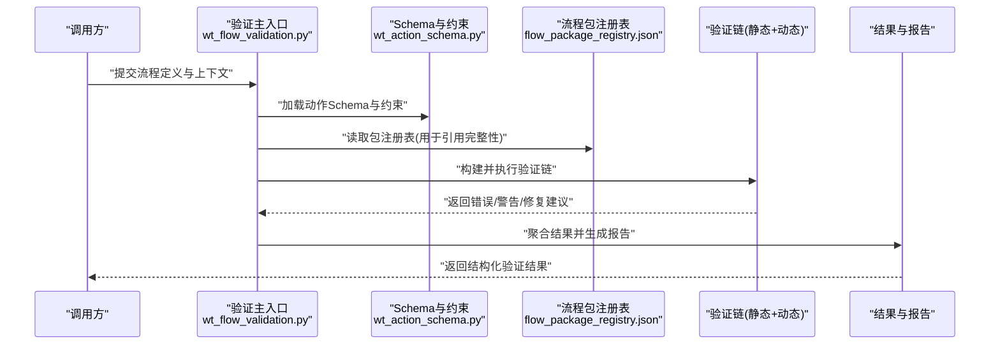
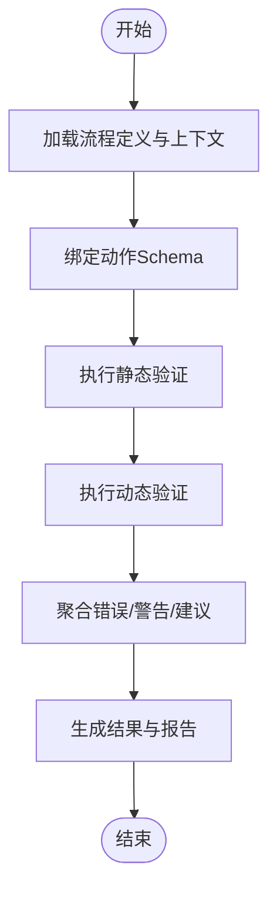
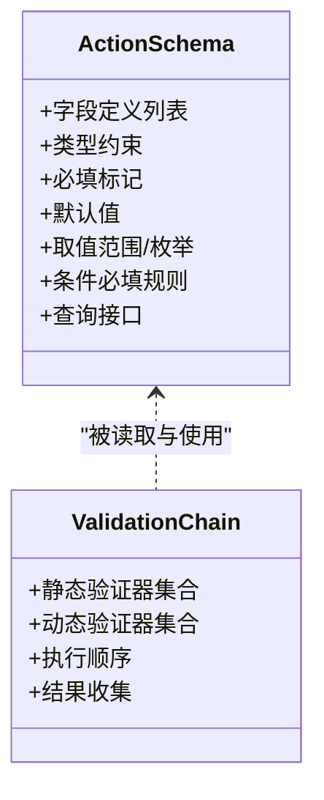
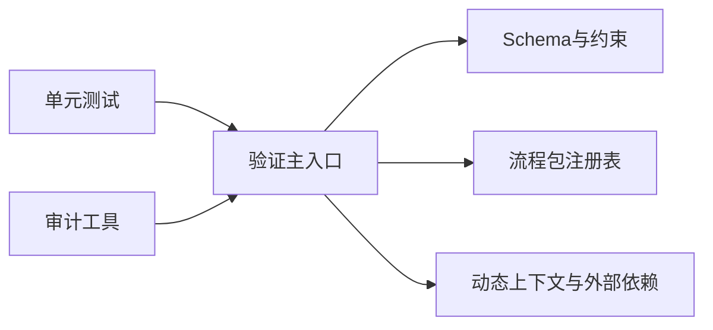

# 流程验证系统

<cite>
**本文引用的文件**   
- [wt_flow_validation.py](file://wt_flow_validation.py)
- [wt_action_schema.py](file://wt_action_schema.py)
- [flow_packages/flow_package_registry.json](file://flow_packages/flow_package_registry.json)
- [samples/flows/flow_definition_gm_sample.json](file://samples/flows/flow_definition_gm_sample.json)
- [tests/test_wt_action_validation.py](file://tests/test_wt_action_validation.py)
- [tools/dev_utils/audit_flow_roundtrip_fields.py](file://tools/dev_utils/audit_flow_roundtrip_fields.py)
</cite>

## 目录
1. [简介](#简介)
2. [项目结构](#项目结构)
3. [核心组件](#核心组件)
4. [架构总览](#架构总览)
5. [详细组件分析](#详细组件分析)
6. [依赖关系分析](#依赖关系分析)
7. [性能考虑](#性能考虑)
8. [故障排查指南](#故障排查指南)
9. [结论](#结论)
10. [附录](#附录)

## 简介
本技术文档面向WT自动化流程验证系统，聚焦于“验证框架”的设计与实现。内容涵盖：
- 验证规则定义、验证器注册与验证链执行机制
- 静态验证过程（JSON结构、字段类型、必填参数、引用完整性）
- 动态验证机制（运行时参数校验、业务规则检查、外部依赖验证）
- 错误分类与处理策略（致命错误、警告、修复建议）
- 自定义验证器的开发方法与最佳实践
- 复杂业务验证逻辑的实现示例（以路径形式给出）
- 验证结果的数据结构与报告生成机制

## 项目结构
围绕验证系统的核心代码与资源分布如下：
- 验证主入口与编排：wt_flow_validation.py
- 动作Schema与约束：wt_action_schema.py
- 流程包注册表（用于包级元数据与版本管理）：flow_packages/flow_package_registry.json
- 样例流程定义（用于端到端验证演示）：samples/flows/flow_definition_gm_sample.json
- 单元测试（覆盖关键验证场景）：tests/test_wt_action_validation.py
- 审计工具（辅助回归与字段一致性检查）：tools/dev_utils/audit_flow_roundtrip_fields.py

图表来源
- [wt_flow_validation.py](file://wt_flow_validation.py)
- [wt_action_schema.py](file://wt_action_schema.py)
- [flow_packages/flow_package_registry.json](file://flow_packages/flow_package_registry.json)
- [samples/flows/flow_definition_gm_sample.json](file://samples/flows/flow_definition_gm_sample.json)
- [tests/test_wt_action_validation.py](file://tests/test_wt_action_validation.py)
- [tools/dev_utils/audit_flow_roundtrip_fields.py](file://tools/dev_utils/audit_flow_roundtrip_fields.py)

章节来源
- [wt_flow_validation.py](file://wt_flow_validation.py)
- [wt_action_schema.py](file://wt_action_schema.py)
- [flow_packages/flow_package_registry.json](file://flow_packages/flow_package_registry.json)
- [samples/flows/flow_definition_gm_sample.json](file://samples/flows/flow_definition_gm_sample.json)
- [tests/test_wt_action_validation.py](file://tests/test_wt_action_validation.py)
- [tools/dev_utils/audit_flow_roundtrip_fields.py](file://tools/dev_utils/audit_flow_roundtrip_fields.py)

## 核心组件
- 验证主入口与编排器
  - 负责加载流程定义、解析Schema、构建并执行验证链、收集错误与告警、输出结构化结果。
- 动作Schema与约束
  - 提供动作级别的字段定义、类型约束、默认值、可选/必填标记、枚举范围等。
- 流程包注册表
  - 维护流程包的元信息、版本、依赖与兼容性，为引用完整性检查提供依据。
- 样例流程定义
  - 提供可运行的最小可用流程，便于端到端验证与回归测试。
- 单元测试
  - 覆盖静态与动态验证的关键路径，确保行为稳定。
- 审计工具
  - 对流程字段进行往返一致性审计，辅助发现遗漏或漂移的字段。

章节来源
- [wt_flow_validation.py](file://wt_flow_validation.py)
- [wt_action_schema.py](file://wt_action_schema.py)
- [flow_packages/flow_package_registry.json](file://flow_packages/flow_package_registry.json)
- [samples/flows/flow_definition_gm_sample.json](file://samples/flows/flow_definition_gm_sample.json)
- [tests/test_wt_action_validation.py](file://tests/test_wt_action_validation.py)
- [tools/dev_utils/audit_flow_roundtrip_fields.py](file://tools/dev_utils/audit_flow_roundtrip_fields.py)

## 架构总览
验证系统采用“规则驱动 + 链式执行”的架构。Schema作为规则的权威来源，验证器按阶段组织成链，依次执行静态与动态验证，最终汇总为统一的结果对象。

图表来源
- [wt_flow_validation.py](file://wt_flow_validation.py)
- [wt_action_schema.py](file://wt_action_schema.py)
- [flow_packages/flow_package_registry.json](file://flow_packages/flow_package_registry.json)

## 详细组件分析

### 验证主入口与编排器（wt_flow_validation.py）
职责
- 解析输入的流程定义与上下文
- 加载Schema与包注册表
- 构建验证链（静态阶段、动态阶段）
- 执行各阶段验证器，收集错误、警告与建议
- 生成统一的结构化结果与报告

关键流程
- 输入预处理：规范化流程定义、合并默认值、补齐缺失字段
- Schema绑定：将流程步骤映射到对应动作Schema
- 静态验证：结构、类型、必填、引用完整性
- 动态验证：运行时参数、业务规则、外部依赖可用性
- 结果聚合：去重、分级、附加修复建议
- 报告输出：文本/结构化格式

图表来源
- [wt_flow_validation.py](file://wt_flow_validation.py)

章节来源
- [wt_flow_validation.py](file://wt_flow_validation.py)

### 动作Schema与约束（wt_action_schema.py）
职责
- 定义每个动作的字段清单、数据类型、是否必填、默认值、取值范围、枚举、依赖关系等
- 提供Schema查询接口，供验证链在静态与动态阶段使用

设计要点
- 字段级约束优先：类型、必填、范围、正则表达式
- 跨字段约束：通过条件必填、互斥字段、联动字段等表达
- 可扩展性：支持新增动作与字段而不破坏既有验证链

图表来源
- [wt_action_schema.py](file://wt_action_schema.py)

章节来源
- [wt_action_schema.py](file://wt_action_schema.py)

### 流程包注册表（flow_package_registry.json）
职责
- 记录流程包的元信息、版本、依赖、兼容性与发布状态
- 为引用完整性检查提供权威来源，避免流程引用不存在的包或版本

使用方式
- 静态阶段：校验流程中引用的包是否存在、版本是否满足要求
- 动态阶段：根据注册表决定是否需要拉取或更新依赖

章节来源
- [flow_packages/flow_package_registry.json](file://flow_packages/flow_package_registry.json)

### 样例流程定义（samples/flows/flow_definition_gm_sample.json）
用途
- 提供最小可用的流程定义，包含若干典型动作与字段组合
- 用于端到端验证与回归测试，覆盖静态与动态验证路径

章节来源
- [samples/flows/flow_definition_gm_sample.json](file://samples/flows/flow_definition_gm_sample.json)

### 单元测试（tests/test_wt_action_validation.py）
覆盖范围
- 静态验证：结构、类型、必填、引用完整性
- 动态验证：运行时参数、业务规则、外部依赖
- 错误分类：致命错误、警告、修复建议
- 边界与异常：缺失字段、非法类型、循环引用、外部不可用

章节来源
- [tests/test_wt_action_validation.py](file://tests/test_wt_action_validation.py)

### 审计工具（tools/dev_utils/audit_flow_roundtrip_fields.py）
功能
- 对流程字段进行往返一致性审计，检测遗漏或漂移的字段
- 辅助定位Schema与实际流程定义的差异，提升稳定性

章节来源
- [tools/dev_utils/audit_flow_roundtrip_fields.py](file://tools/dev_utils/audit_flow_roundtrip_fields.py)

## 依赖关系分析
验证系统内部依赖关系如下：
- 验证主入口依赖Schema与注册表
- 静态验证依赖Schema与注册表
- 动态验证依赖运行时上下文与外部依赖
- 单元测试与审计工具反向依赖验证主入口

图表来源
- [wt_flow_validation.py](file://wt_flow_validation.py)
- [wt_action_schema.py](file://wt_action_schema.py)
- [flow_packages/flow_package_registry.json](file://flow_packages/flow_package_registry.json)

章节来源
- [wt_flow_validation.py](file://wt_flow_validation.py)
- [wt_action_schema.py](file://wt_action_schema.py)
- [flow_packages/flow_package_registry.json](file://flow_packages/flow_package_registry.json)

## 性能考虑
- 批量校验：对大量流程定义进行批处理时，复用Schema与注册表实例，减少重复加载开销
- 短路策略：遇到致命错误时可提前终止后续验证，降低不必要的计算
- 缓存策略：对昂贵的动态验证（如外部依赖可用性）引入短期缓存，避免频繁I/O
- 并行化：不同流程或不同阶段的验证可并行执行，注意共享资源的线程安全

## 故障排查指南
常见问题与定位方法
- 致命错误：通常由必填字段缺失、类型不匹配、引用不存在导致。检查Schema约束与流程定义的一致性
- 警告信息：多为潜在风险（如弃用字段、非最优配置）。结合修复建议调整
- 修复建议：优先遵循建议中的字段补全、类型修正、依赖版本升级等操作
- 外部依赖失败：确认网络连通性、凭据有效性、服务可用性；必要时启用降级策略

章节来源
- [tests/test_wt_action_validation.py](file://tests/test_wt_action_validation.py)

## 结论
本验证系统通过Schema驱动的规则定义与链式执行机制，实现了从静态到动态的全链路验证。借助统一的错误分类与修复建议，显著提升了流程定义的质量与可维护性。配合单元测试与审计工具，形成闭环的质量保障体系。

## 附录

### 验证规则定义与注册
- 规则来源：动作Schema与流程包注册表
- 注册方式：在Schema中声明字段约束与条件规则；在注册表中声明包依赖与版本
- 扩展点：新增动作或字段时，仅需更新Schema与注册表，无需改动验证链主体

章节来源
- [wt_action_schema.py](file://wt_action_schema.py)
- [flow_packages/flow_package_registry.json](file://flow_packages/flow_package_registry.json)

### 静态验证过程
- JSON结构验证：校验流程定义的层级与键名是否符合预期
- 字段类型检查：基于Schema的类型约束进行严格校验
- 必填参数验证：依据Schema的必填标记与条件必填规则
- 引用完整性检查：基于注册表校验包与版本的引用有效性

章节来源
- [wt_flow_validation.py](file://wt_flow_validation.py)
- [wt_action_schema.py](file://wt_action_schema.py)
- [flow_packages/flow_package_registry.json](file://flow_packages/flow_package_registry.json)

### 动态验证机制
- 运行时参数验证：结合上下文变量与外部配置进行校验
- 业务规则检查：跨字段、跨步骤的业务约束（如互斥、联动、顺序依赖）
- 外部依赖验证：检查外部服务、文件或资源的可用性与权限

章节来源
- [wt_flow_validation.py](file://wt_flow_validation.py)

### 错误分类与处理策略
- 致命错误：阻断执行，需立即修复
- 警告信息：提示潜在问题，允许继续但建议优化
- 修复建议：针对具体错误给出可操作的修复步骤

章节来源
- [tests/test_wt_action_validation.py](file://tests/test_wt_action_validation.py)

### 自定义验证器开发与最佳实践
- 开发方法
  - 明确验证目标：静态或动态阶段
  - 编写验证函数：接收当前上下文与Schema片段，返回错误/警告/建议
  - 注册验证器：在验证链中按顺序插入
- 最佳实践
  - 保持幂等与无副作用
  - 提供清晰的错误信息与修复建议
  - 增加单元测试覆盖边界情况

章节来源
- [wt_flow_validation.py](file://wt_flow_validation.py)
- [tests/test_wt_action_validation.py](file://tests/test_wt_action_validation.py)

### 复杂业务验证逻辑示例（路径）
- 示例一：跨步骤联动校验
  - 参考路径：[tests/test_wt_action_validation.py](file://tests/test_wt_action_validation.py)
- 示例二：外部依赖可用性检查
  - 参考路径：[tests/test_wt_action_validation.py](file://tests/test_wt_action_validation.py)
- 示例三：条件必填与互斥字段
  - 参考路径：[wt_action_schema.py](file://wt_action_schema.py)

### 验证结果数据结构与报告生成
- 结果结构
  - 错误列表：包含严重级别、位置、消息与修复建议
  - 统计摘要：错误/警告数量、耗时、阶段分布
  - 上下文快照：用于复现与回溯
- 报告生成
  - 文本报告：适合快速阅读与归档
  - 结构化报告：便于集成到CI/CD与看板

章节来源
- [wt_flow_validation.py](file://wt_flow_validation.py)
- [tests/test_wt_action_validation.py](file://tests/test_wt_action_validation.py)