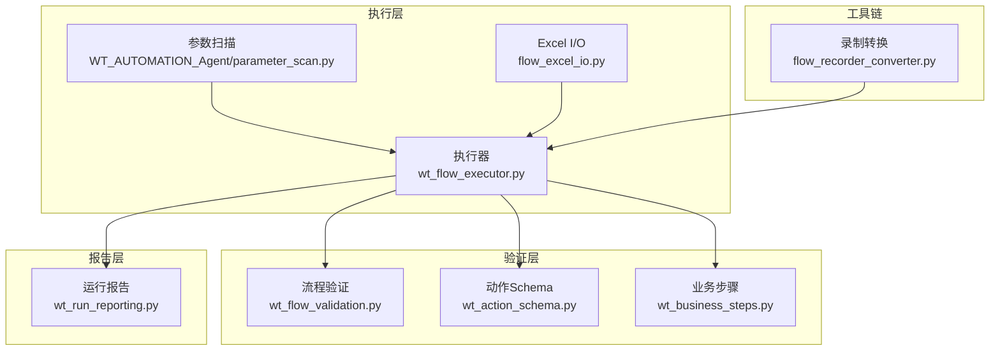
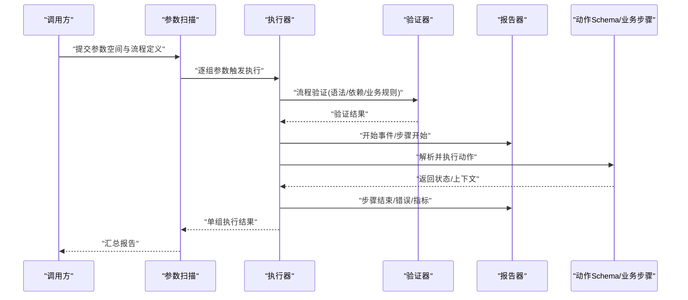
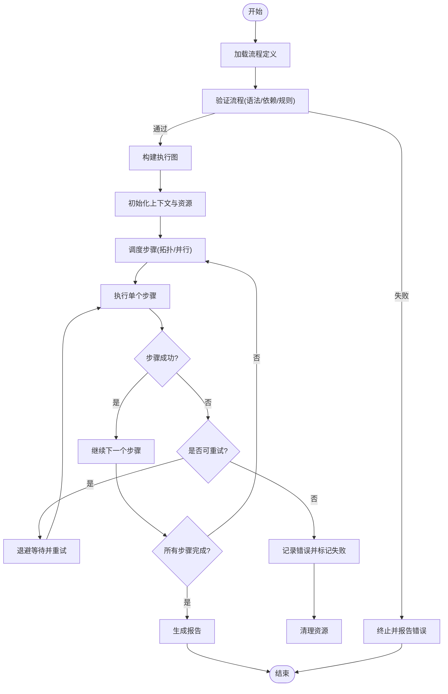
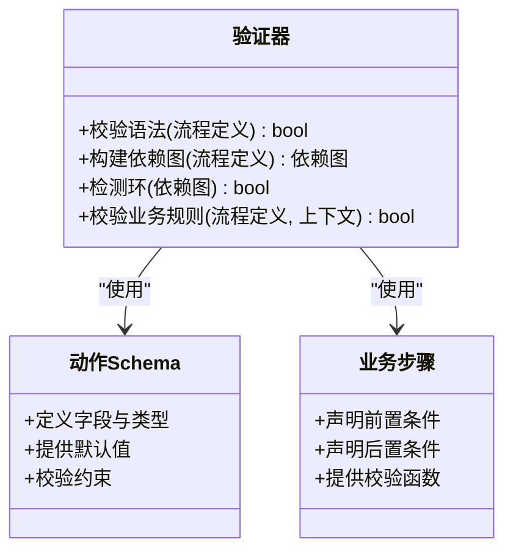
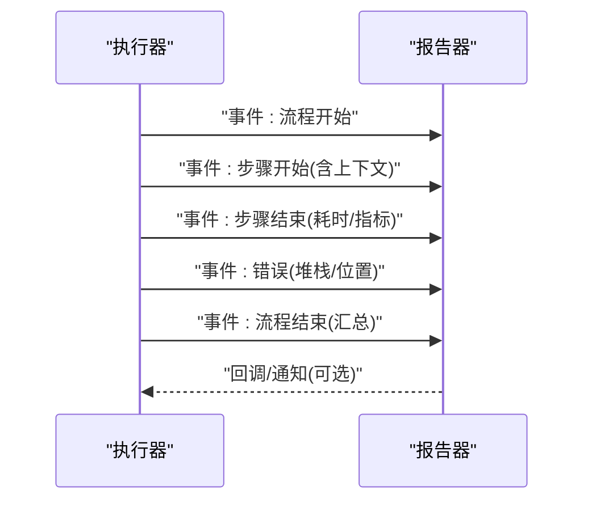
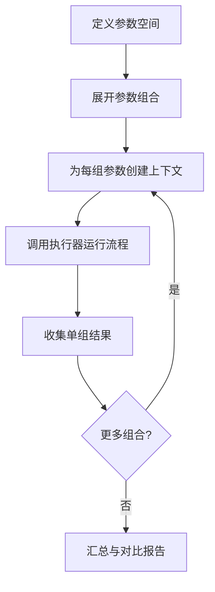
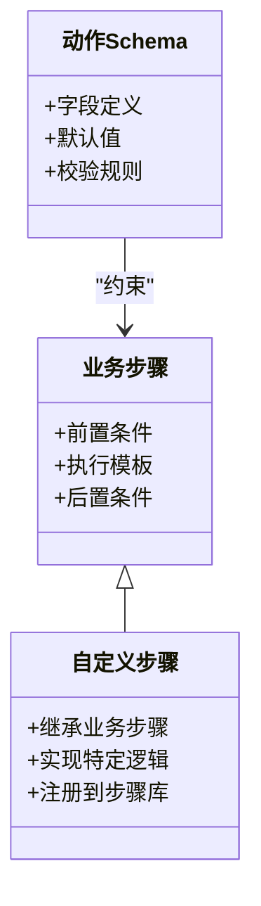
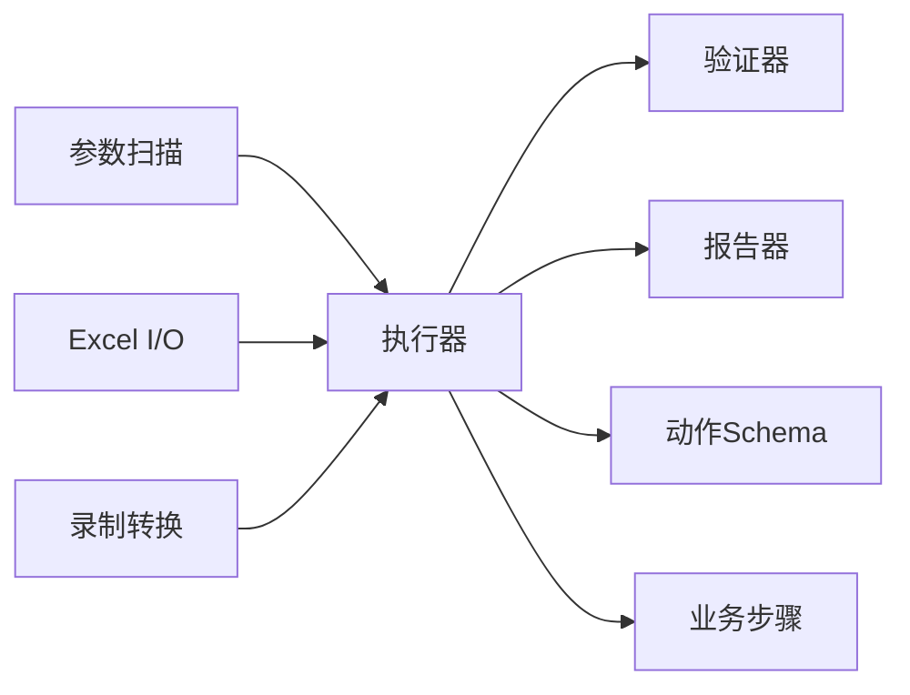

# 自动化执行引擎

<cite>
**本文引用的文件**   
- [wt_flow_executor.py](file://wt_flow_executor.py)
- [wt_flow_validation.py](file://wt_flow_validation.py)
- [wt_run_reporting.py](file://wt_run_reporting.py)
- [parameter_scan.py](file://WT_AUTOMATION_Agent/parameter_scan.py)
- [flow_excel_io.py](file://flow_excel_io.py)
- [wt_action_schema.py](file://wt_action_schema.py)
- [wt_business_steps.py](file://wt_business_steps.py)
- [flow_recorder_converter.py](file://flow_recorder_converter.py)
- [test_wt_flow_executor.py](file://tests/test_wt_flow_executor.py)
- [test_wt_run_reporting.py](file://tests/test_wt_run_reporting.py)
</cite>

## 目录
1. [简介](#简介)
2. [项目结构](#项目结构)
3. [核心组件](#核心组件)
4. [架构总览](#架构总览)
5. [详细组件分析](#详细组件分析)
6. [依赖关系分析](#依赖关系分析)
7. [性能考虑](#性能考虑)
8. [故障排查指南](#故障排查指南)
9. [结论](#结论)
10. [附录](#附录)

## 简介
本技术文档围绕WT自动化执行引擎，系统性阐述流程执行的核心算法与生命周期管理、流程验证机制（语法检查、依赖验证、业务规则校验）、执行报告系统（日志记录、性能统计、错误追踪）、参数扫描功能、并发执行与资源管理策略、配置与调优建议，以及扩展自定义执行逻辑的方法与集成接口。文档面向不同技术背景的读者，提供从高层概览到代码级细节的渐进式说明，并辅以图示帮助理解。

## 项目结构
WT自动化执行引擎位于仓库根目录，核心模块包括：
- 执行器：负责解析流程定义、调度步骤、管理生命周期与并发
- 验证器：负责流程定义的语法、依赖与业务规则校验
- 报告器：负责运行期日志、指标采集与错误追踪
- 参数扫描：基于参数组合驱动批量执行
- Excel I/O：用于流程数据导入导出
- 动作模式与业务步骤：定义动作Schema与可复用业务步骤
- 录制转换器：将录制脚本转换为流程定义
- 测试用例：覆盖执行器与报告器的关键路径

图表来源
- [wt_flow_executor.py](file://wt_flow_executor.py)
- [wt_flow_validation.py](file://wt_flow_validation.py)
- [wt_run_reporting.py](file://wt_run_reporting.py)
- [parameter_scan.py](file://WT_AUTOMATION_Agent/parameter_scan.py)
- [flow_excel_io.py](file://flow_excel_io.py)
- [wt_action_schema.py](file://wt_action_schema.py)
- [wt_business_steps.py](file://wt_business_steps.py)
- [flow_recorder_converter.py](file://flow_recorder_converter.py)

章节来源
- [wt_flow_executor.py](file://wt_flow_executor.py)
- [wt_flow_validation.py](file://wt_flow_validation.py)
- [wt_run_reporting.py](file://wt_run_reporting.py)
- [parameter_scan.py](file://WT_AUTOMATION_Agent/parameter_scan.py)
- [flow_excel_io.py](file://flow_excel_io.py)
- [wt_action_schema.py](file://wt_action_schema.py)
- [wt_business_steps.py](file://wt_business_steps.py)
- [flow_recorder_converter.py](file://flow_recorder_converter.py)

## 核心组件
- 执行器：实现流程解析、步骤调度、上下文传递、异常捕获、重试与回滚、并发控制、资源清理等
- 验证器：对流程定义进行语法校验、依赖图构建与环检测、业务规则约束检查
- 报告器：收集执行事件、计时、错误堆栈、资源使用信息，生成结构化报告
- 参数扫描：根据参数空间生成多组输入，驱动执行器批量运行
- Excel I/O：读取/写入流程相关的数据表，支持列映射与类型转换
- 动作Schema与业务步骤：定义动作字段、默认值、校验规则与可复用步骤模板
- 录制转换：将录制脚本转换为标准流程定义，便于后续验证与执行

章节来源
- [wt_flow_executor.py](file://wt_flow_executor.py)
- [wt_flow_validation.py](file://wt_flow_validation.py)
- [wt_run_reporting.py](file://wt_run_reporting.py)
- [parameter_scan.py](file://WT_AUTOMATION_Agent/parameter_scan.py)
- [flow_excel_io.py](file://flow_excel_io.py)
- [wt_action_schema.py](file://wt_action_schema.py)
- [wt_business_steps.py](file://wt_business_steps.py)

## 架构总览
执行引擎采用分层设计：上层为参数扫描与Excel I/O，中层为执行器与验证器，底层为动作Schema与业务步骤；报告器贯穿全链路，提供统一的事件与指标输出。

图表来源
- [wt_flow_executor.py](file://wt_flow_executor.py)
- [wt_flow_validation.py](file://wt_flow_validation.py)
- [wt_run_reporting.py](file://wt_run_reporting.py)
- [parameter_scan.py](file://WT_AUTOMATION_Agent/parameter_scan.py)
- [wt_action_schema.py](file://wt_action_schema.py)
- [wt_business_steps.py](file://wt_business_steps.py)

## 详细组件分析

### 执行器：流程执行核心算法与生命周期
- 流程解析与预处理
  - 加载流程定义，标准化节点与边，构建执行图
  - 应用默认值与类型转换，准备上下文变量
- 步骤调度与依赖解析
  - 基于拓扑排序或DAG遍历，确保依赖满足后执行
  - 支持并行度控制与资源池限制
- 执行生命周期
  - 初始化阶段：创建上下文、分配资源、注册钩子
  - 运行阶段：按序/并行执行步骤，处理分支与条件
  - 收尾阶段：释放资源、持久化中间结果、生成最终报告
- 异常与重试
  - 捕获运行时异常，记录堆栈与上下文快照
  - 支持可配置的重试策略与退避
- 并发与资源管理
  - 线程/进程池控制，避免过度竞争
  - 资源上限与超时保护，防止泄漏

图表来源
- [wt_flow_executor.py](file://wt_flow_executor.py)
- [wt_flow_validation.py](file://wt_flow_validation.py)
- [wt_run_reporting.py](file://wt_run_reporting.py)

章节来源
- [wt_flow_executor.py](file://wt_flow_executor.py)
- [test_wt_flow_executor.py](file://tests/test_wt_flow_executor.py)

### 验证器：语法检查、依赖验证与业务规则校验
- 语法检查
  - 校验流程定义的结构完整性与必填字段
  - 校验动作字段类型、枚举值与范围
- 依赖验证
  - 构建依赖图，检测循环依赖与不可达节点
  - 校验前置步骤存在且可达
- 业务规则校验
  - 依据业务步骤与动作Schema进行约束检查
  - 支持跨步骤的条件与一致性校验

图表来源
- [wt_flow_validation.py](file://wt_flow_validation.py)
- [wt_action_schema.py](file://wt_action_schema.py)
- [wt_business_steps.py](file://wt_business_steps.py)

章节来源
- [wt_flow_validation.py](file://wt_flow_validation.py)
- [wt_action_schema.py](file://wt_action_schema.py)
- [wt_business_steps.py](file://wt_business_steps.py)

### 报告器：日志记录、性能统计与错误追踪
- 日志记录
  - 结构化事件流：开始、步骤开始/结束、错误、警告
  - 上下文快照：变量、资源占用、时间戳
- 性能统计
  - 步骤耗时、吞吐、并发度、队列长度
  - 资源使用峰值与均值
- 错误追踪
  - 异常类型、堆栈、定位信息与恢复建议
  - 失败聚合与趋势统计

图表来源
- [wt_run_reporting.py](file://wt_run_reporting.py)
- [wt_flow_executor.py](file://wt_flow_executor.py)

章节来源
- [wt_run_reporting.py](file://wt_run_reporting.py)
- [test_wt_run_reporting.py](file://tests/test_wt_run_reporting.py)

### 参数扫描：原理与使用方法
- 参数空间定义
  - 支持标量、列表、笛卡尔积与表达式
- 执行驱动
  - 为每组参数实例化执行上下文，触发执行器
  - 支持分组聚合与中断策略
- 结果汇总
  - 合并各组的执行报告，生成对比视图

图表来源
- [parameter_scan.py](file://WT_AUTOMATION_Agent/parameter_scan.py)
- [wt_flow_executor.py](file://wt_flow_executor.py)

章节来源
- [parameter_scan.py](file://WT_AUTOMATION_Agent/parameter_scan.py)

### Excel I/O：流程数据导入导出
- 列映射与类型转换
  - 支持动态列名映射与数据类型校验
- 批量读写
  - 大表分块读取，降低内存占用
- 与执行器集成
  - 作为数据源注入上下文，供步骤消费

章节来源
- [flow_excel_io.py](file://flow_excel_io.py)

### 动作Schema与业务步骤：扩展自定义执行逻辑
- 动作Schema
  - 定义字段、类型、默认值与约束
  - 提供可扩展的校验钩子
- 业务步骤
  - 封装常用操作，声明前置/后置条件
  - 提供可复用的执行模板与校验函数

图表来源
- [wt_action_schema.py](file://wt_action_schema.py)
- [wt_business_steps.py](file://wt_business_steps.py)

章节来源
- [wt_action_schema.py](file://wt_action_schema.py)
- [wt_business_steps.py](file://wt_business_steps.py)

### 录制转换：从录制脚本到流程定义
- 解析录制脚本，提取用户操作序列
- 转换为标准流程定义，适配动作Schema
- 便于后续验证与执行

章节来源
- [flow_recorder_converter.py](file://flow_recorder_converter.py)

## 依赖关系分析
- 执行器依赖验证器与报告器，并通过动作Schema与业务步骤执行具体逻辑
- 参数扫描与Excel I/O作为外部驱动与数据源
- 录制转换器为上游生成流程定义

图表来源
- [wt_flow_executor.py](file://wt_flow_executor.py)
- [wt_flow_validation.py](file://wt_flow_validation.py)
- [wt_run_reporting.py](file://wt_run_reporting.py)
- [parameter_scan.py](file://WT_AUTOMATION_Agent/parameter_scan.py)
- [flow_excel_io.py](file://flow_excel_io.py)
- [wt_action_schema.py](file://wt_action_schema.py)
- [wt_business_steps.py](file://wt_business_steps.py)
- [flow_recorder_converter.py](file://flow_recorder_converter.py)

章节来源
- [wt_flow_executor.py](file://wt_flow_executor.py)
- [wt_flow_validation.py](file://wt_flow_validation.py)
- [wt_run_reporting.py](file://wt_run_reporting.py)
- [parameter_scan.py](file://WT_AUTOMATION_Agent/parameter_scan.py)
- [flow_excel_io.py](file://flow_excel_io.py)
- [wt_action_schema.py](file://wt_action_schema.py)
- [wt_business_steps.py](file://wt_business_steps.py)
- [flow_recorder_converter.py](file://flow_recorder_converter.py)

## 性能考虑
- 并发控制
  - 合理设置最大并发度，避免CPU/IO争用
  - 使用连接池与对象复用减少开销
- 资源管理
  - 严格超时与资源上限，防止泄漏
  - 及时释放句柄与临时文件
- 报告开销
  - 异步上报与批量化写入，降低同步阻塞
- 数据I/O
  - 分块读取与惰性加载，降低内存峰值
- 重试与退避
  - 指数退避与抖动，避免雪崩效应

[本节为通用指导，不直接分析具体文件]

## 故障排查指南
- 常见问题定位
  - 流程验证失败：检查语法、依赖与业务规则
  - 步骤执行异常：查看报告中的堆栈与上下文快照
  - 性能瓶颈：关注步骤耗时与并发度曲线
- 调试建议
  - 启用详细日志与采样指标
  - 缩小参数空间进行回归验证
  - 隔离问题步骤，最小化复现场景

章节来源
- [test_wt_flow_executor.py](file://tests/test_wt_flow_executor.py)
- [test_wt_run_reporting.py](file://tests/test_wt_run_reporting.py)

## 结论
WT自动化执行引擎以执行器为核心，结合验证器与报告器形成完整的流程执行闭环。通过参数扫描与Excel I/O增强灵活性，借助动作Schema与业务步骤实现可扩展性。合理的并发与资源管理策略保障了稳定性与性能。建议在生产环境中结合监控与告警，持续优化执行效率与可靠性。

[本节为总结性内容，不直接分析具体文件]

## 附录
- 配置选项与调优建议
  - 并发度、超时、重试次数与退避策略
  - 报告粒度与采样频率
  - 资源上限与内存阈值
- 扩展示例指引
  - 新增自定义步骤：继承业务步骤，实现执行模板与校验
  - 注册新动作：在动作Schema中定义字段与约束
  - 接入外部数据源：通过Excel I/O或自定义适配器注入上下文

[本节为补充说明，不直接分析具体文件]