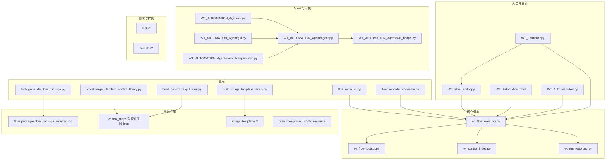
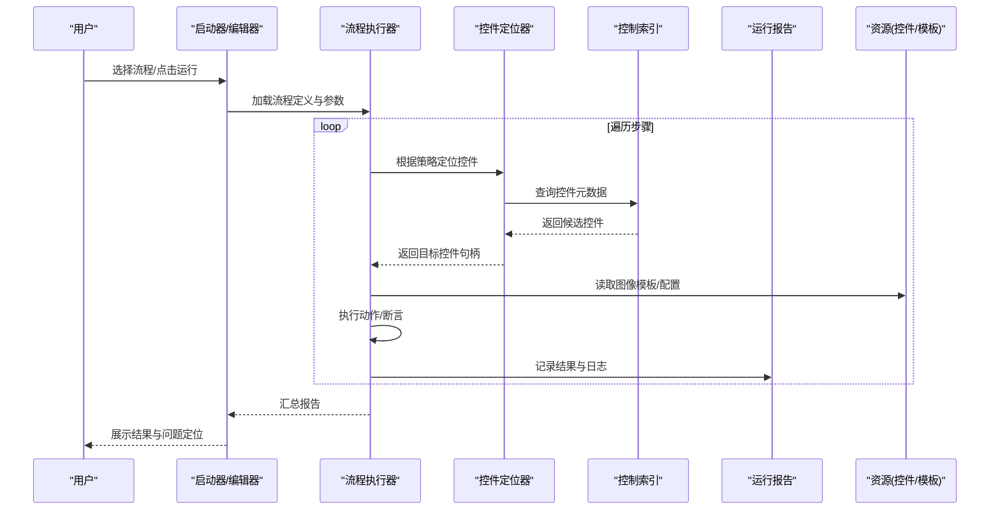
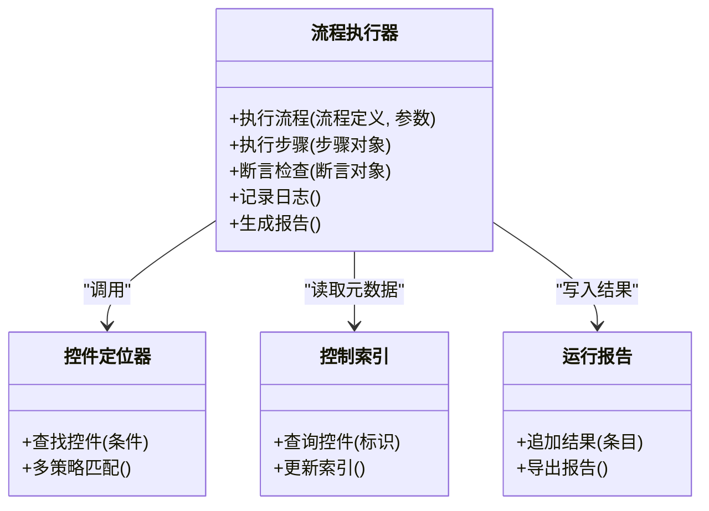
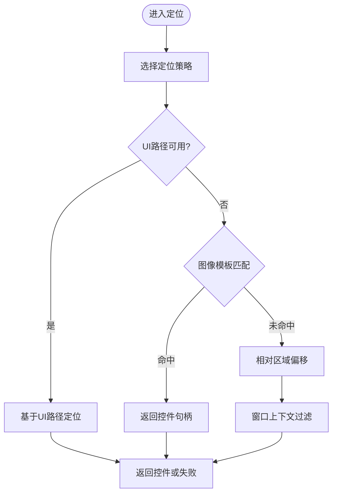
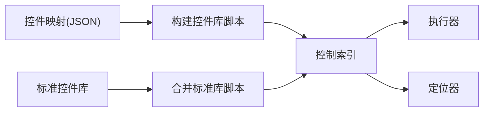
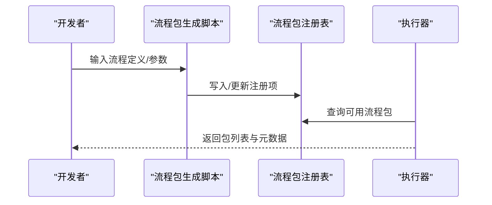
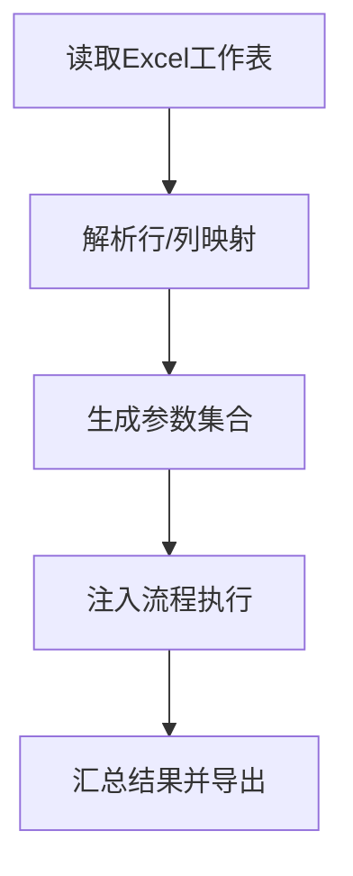
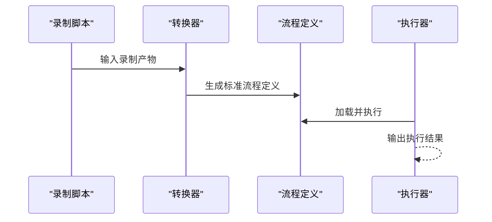
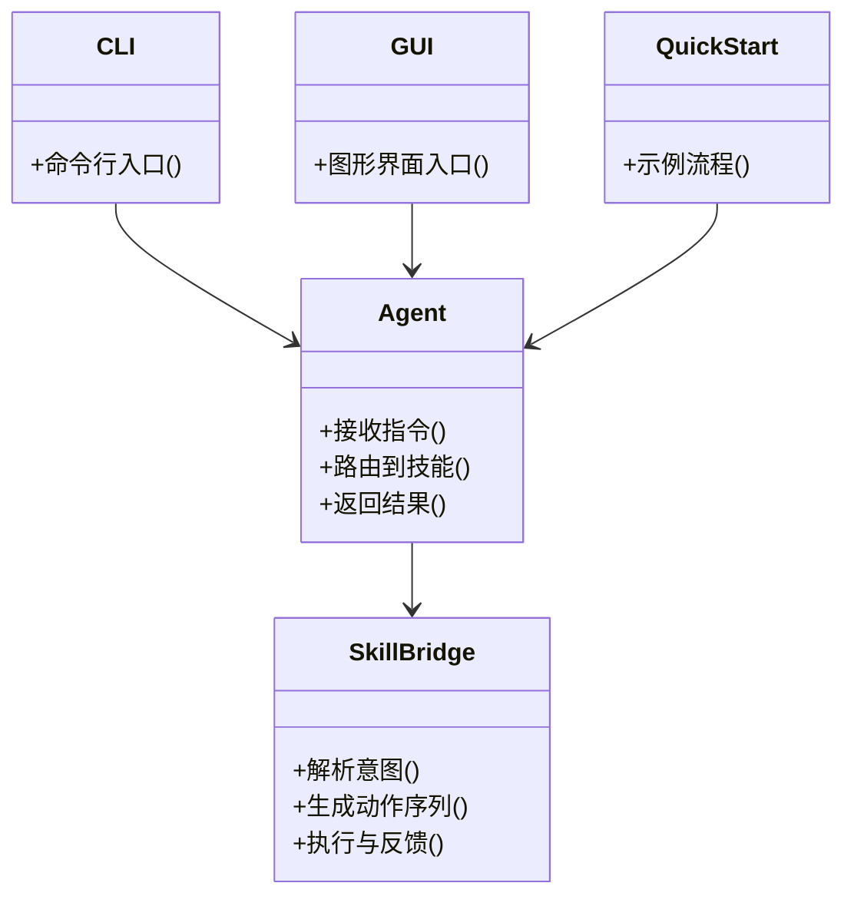
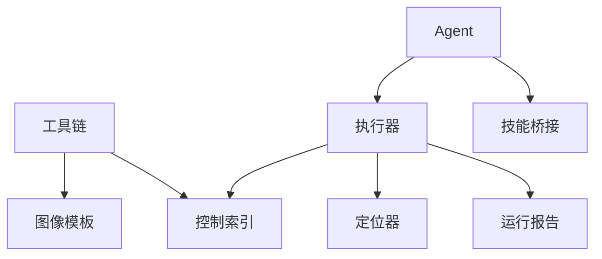

# 项目概述

<cite>
**本文引用的文件**   
- [README.md](file://README.md)
- [PROJECT_ARCHITECTURE.md](file://PROJECT_ARCHITECTURE.md)
- [WT_Launcher.py](file://WT_Launcher.py)
- [WT_Flow_Editor.py](file://WT_Flow_Editor.py)
- [wt_flow_executor.py](file://wt_flow_executor.py)
- [wt_flow_locator.py](file://wt_flow_locator.py)
- [wt_control_index.py](file://wt_control_index.py)
- [control_maps/总控件信息.json](file://control_maps/总控件信息.json)
- [flow_packages/flow_package_registry.json](file://flow_packages/flow_package_registry.json)
- [resources/project_config.resource](file://resources/project_config.resource)
- [tools/generate_flow_package.py](file://tools/generate_flow_package.py)
- [tools/merge_standard_control_library.py](file://tools/merge_standard_control_library.py)
- [build_control_map_library.py](file://build_control_map_library.py)
- [build_image_template_library.py](file://build_image_template_library.py)
- [flow_excel_io.py](file://flow_excel_io.py)
- [flow_recorder_converter.py](file://flow_recorder_converter.py)
- [wt_run_reporting.py](file://wt_run_reporting.py)
- [tests/test_wt_flow_executor.py](file://tests/test_wt_flow_executor.py)
- [tests/test_self_healing_locator.py](file://tests/test_self_healing_locator.py)
- [tests/test_ui_path_selector.py](file://tests/test_ui_path_selector.py)
- [tests/test_wt_action_validation.py](file://tests/test_wt_action_validation.py)
- [tests/test_flow_excel_io.py](file://tests/test_flow_excel_io.py)
- [tests/test_flow_recorder_converter.py](file://tests/test_flow_recorder_converter.py)
- [WT_AUT_recorded.py](file://WT_AUT_recorded.py)
- [WT_Automation.robot](file://WT_Automation.robot)
- [ui_tars_runner.js](file://ui_tars_runner.js)
- [WT_AUTOMATION_Agent/agent.py](file://WT_AUTOMATION_Agent/agent.py)
- [WT_AUTOMATION_Agent/cli.py](file://WT_AUTOMATION_Agent/cli.py)
- [WT_AUTOMATION_Agent/gui.py](file://WT_AUTOMATION_Agent/gui.py)
- [WT_AUTOMATION_Agent/control_index.py](file://WT_AUTOMATION_Agent/control_index.py)
- [WT_AUTOMATION_Agent/skill_bridge.py](file://WT_AUTOMATION_Agent/skill_bridge.py)
- [WT_AUTOMATION_Agent/examples/quickstart.py](file://WT_AUTOMATION_Agent/examples/quickstart.py)
</cite>

## 目录
1. [简介](#简介)
2. [项目结构](#项目结构)
3. [核心组件](#核心组件)
4. [架构总览](#架构总览)
5. [详细组件分析](#详细组件分析)
6. [依赖关系分析](#依赖关系分析)
7. [性能与稳定性考量](#性能与稳定性考量)
8. [故障排查指南](#故障排查指南)
9. [结论](#结论)
10. [附录](#附录)

## 简介
WT自动化框架面向风力发电软件的UI自动化测试与流程编排，提供“可视化编辑、多策略控件定位、AI辅助、可插拔技能桥接、录制转换、Excel数据驱动、运行报告”等能力。其目标是降低复杂桌面软件（WPF/Win32/Axe）的自动化门槛，提升回归效率与可维护性，同时为业务专家与测试工程师提供一致的协作方式。

主要特性与创新点：
- 多策略控件定位：结合UI路径、图像模板、相对区域、窗口上下文等多种定位手段，增强鲁棒性与跨版本兼容性。
- AI辅助与技能桥接：通过Agent与Skill Bridge将自然语言意图或领域知识映射到具体动作，支持快速构建与扩展。
- 可视化流程编辑器：以图形化方式编排步骤，便于非代码用户参与。
- 录制与转换：支持录制脚本并转换为标准流程定义，提高上手速度。
- Excel数据驱动：从表格导入/导出流程参数，实现批量场景覆盖。
- 标准化控制库与包管理：集中化的控件信息与流程包注册，便于团队共享与维护。
- 运行报告与诊断：结构化输出执行结果与问题定位信息。

适用人群与场景：
- 初学者：通过可视化编辑器与示例快速入门；使用录制与转换功能快速生成流程。
- 中级用户：利用多策略定位与Excel数据驱动构建稳定用例；引入技能桥接复用领域逻辑。
- 高级用户：扩展自定义动作、集成外部工具、优化定位策略与性能调优。

## 项目结构
仓库采用“核心引擎 + 工具链 + 资源库 + 文档与网站 + Agent与示例”的分层组织方式：
- 顶层入口与配置：启动器、流程编辑器、全局配置与资源。
- 核心引擎：流程执行、控件定位、控制索引、验证与报告。
- 工具链：流程包生成、标准控件库合并、图像模板与控件库构建、录制转换、Excel IO。
- 资源库：控件映射与控制信息、图像模板、流程包注册表。
- Agent与示例：AI助手、CLI/GUI、技能桥接、快速开始示例。
- 测试与样例：单元测试、样例流程与录制脚本。
- 文档与网站：项目说明、PPT生成脚本、站点页面。

图表来源
- [WT_Launcher.py](file://WT_Launcher.py)
- [WT_Flow_Editor.py](file://WT_Flow_Editor.py)
- [wt_flow_executor.py](file://wt_flow_executor.py)
- [wt_flow_locator.py](file://wt_flow_locator.py)
- [wt_control_index.py](file://wt_control_index.py)
- [wt_run_reporting.py](file://wt_run_reporting.py)
- [tools/generate_flow_package.py](file://tools/generate_flow_package.py)
- [tools/merge_standard_control_library.py](file://tools/merge_standard_control_library.py)
- [build_control_map_library.py](file://build_control_map_library.py)
- [build_image_template_library.py](file://build_image_template_library.py)
- [flow_excel_io.py](file://flow_excel_io.py)
- [flow_recorder_converter.py](file://flow_recorder_converter.py)
- [control_maps/总控件信息.json](file://control_maps/总控件信息.json)
- [flow_packages/flow_package_registry.json](file://flow_packages/flow_package_registry.json)
- [resources/project_config.resource](file://resources/project_config.resource)
- [WT_AUTOMATION_Agent/agent.py](file://WT_AUTOMATION_Agent/agent.py)
- [WT_AUTOMATION_Agent/cli.py](file://WT_AUTOMATION_Agent/cli.py)
- [WT_AUTOMATION_Agent/gui.py](file://WT_AUTOMATION_Agent/gui.py)
- [WT_AUTOMATION_Agent/skill_bridge.py](file://WT_AUTOMATION_Agent/skill_bridge.py)
- [WT_AUTOMATION_Agent/examples/quickstart.py](file://WT_AUTOMATION_Agent/examples/quickstart.py)
- [WT_Automation.robot](file://WT_Automation.robot)
- [WT_AUT_recorded.py](file://WT_AUT_recorded.py)

章节来源
- [README.md](file://README.md)
- [PROJECT_ARCHITECTURE.md](file://PROJECT_ARCHITECTURE.md)

## 核心组件
- 流程执行器：负责解析流程定义、调度动作、处理断言与异常、产出运行报告。
- 控件定位器：封装多种定位策略（UI路径、图像匹配、相对区域、窗口上下文），提供统一接口供执行器调用。
- 控制索引：维护控件元数据与映射，支撑快速检索与一致性校验。
- 运行报告：汇总执行结果、错误堆栈、截图与日志，便于回溯与审计。
- 工具链：流程包生成、标准控件库合并、控件库与图像模板构建、录制转换、Excel数据驱动。
- Agent与技能桥接：将高层意图或领域知识转化为具体动作序列，支持CLI/GUI交互与示例引导。

章节来源
- [wt_flow_executor.py](file://wt_flow_executor.py)
- [wt_flow_locator.py](file://wt_flow_locator.py)
- [wt_control_index.py](file://wt_control_index.py)
- [wt_run_reporting.py](file://wt_run_reporting.py)
- [tools/generate_flow_package.py](file://tools/generate_flow_package.py)
- [tools/merge_standard_control_library.py](file://tools/merge_standard_control_library.py)
- [build_control_map_library.py](file://build_control_map_library.py)
- [build_image_template_library.py](file://build_image_template_library.py)
- [flow_excel_io.py](file://flow_excel_io.py)
- [flow_recorder_converter.py](file://flow_recorder_converter.py)
- [WT_AUTOMATION_Agent/agent.py](file://WT_AUTOMATION_Agent/agent.py)
- [WT_AUTOMATION_Agent/skill_bridge.py](file://WT_AUTOMATION_Agent/skill_bridge.py)

## 架构总览
系统由“入口层—编排层—执行层—定位层—资源层—工具链—Agent与示例”构成。入口层提供GUI/CLI/Robot/录制脚本等多通道接入；编排层负责流程定义与参数注入；执行层协调动作与断言；定位层屏蔽底层差异；资源层提供控件与模板资产；工具链贯穿生命周期；Agent与示例提供智能化与学习路径。

图表来源
- [WT_Launcher.py](file://WT_Launcher.py)
- [WT_Flow_Editor.py](file://WT_Flow_Editor.py)
- [wt_flow_executor.py](file://wt_flow_executor.py)
- [wt_flow_locator.py](file://wt_flow_locator.py)
- [wt_control_index.py](file://wt_control_index.py)
- [wt_run_reporting.py](file://wt_run_reporting.py)
- [control_maps/总控件信息.json](file://control_maps/总控件信息.json)
- [resources/project_config.resource](file://resources/project_config.resource)

## 详细组件分析

### 流程执行器（wt_flow_executor.py）
职责与要点：
- 解析流程定义，按顺序执行动作与断言。
- 处理异常与重试，收集执行轨迹与结果。
- 与定位器、控制索引、报告模块交互，形成闭环。
- 支持参数注入与数据驱动（与Excel IO配合）。

图表来源
- [wt_flow_executor.py](file://wt_flow_executor.py)
- [wt_flow_locator.py](file://wt_flow_locator.py)
- [wt_control_index.py](file://wt_control_index.py)
- [wt_run_reporting.py](file://wt_run_reporting.py)

章节来源
- [wt_flow_executor.py](file://wt_flow_executor.py)
- [tests/test_wt_flow_executor.py](file://tests/test_wt_flow_executor.py)

### 控件定位器（wt_flow_locator.py）
职责与要点：
- 统一封装多种定位策略：UI路径、图像模板、相对区域、窗口上下文。
- 提供容错与回退机制，提升跨版本稳定性。
- 与控制索引联动，优先基于元数据进行精准定位。

图表来源
- [wt_flow_locator.py](file://wt_flow_locator.py)
- [wt_control_index.py](file://wt_control_index.py)
- [control_maps/总控件信息.json](file://control_maps/总控件信息.json)

章节来源
- [wt_flow_locator.py](file://wt_flow_locator.py)
- [tests/test_self_healing_locator.py](file://tests/test_self_healing_locator.py)
- [tests/test_ui_path_selector.py](file://tests/test_ui_path_selector.py)

### 控制索引与资源库（wt_control_index.py / control_maps）
职责与要点：
- 维护控件元数据（名称、类型、层级、属性等），用于快速检索与一致性校验。
- 与构建脚本协同，从控件映射与标准库中生成索引。
- 与图像模板库配合，支持视觉定位与回退。

图表来源
- [wt_control_index.py](file://wt_control_index.py)
- [control_maps/总控件信息.json](file://control_maps/总控件信息.json)
- [tools/merge_standard_control_library.py](file://tools/merge_standard_control_library.py)
- [build_control_map_library.py](file://build_control_map_library.py)

章节来源
- [wt_control_index.py](file://wt_control_index.py)
- [control_maps/总控件信息.json](file://control_maps/总控件信息.json)
- [tools/merge_standard_control_library.py](file://tools/merge_standard_control_library.py)
- [build_control_map_library.py](file://build_control_map_library.py)

### 流程包与注册表（flow_packages）
职责与要点：
- 流程包以JSON描述流程步骤与参数，便于版本管理与复用。
- 注册表集中管理可用流程包，供编辑器与执行器发现与加载。
- 提供生成脚本，简化流程包的创建与发布。

图表来源
- [flow_packages/flow_package_registry.json](file://flow_packages/flow_package_registry.json)
- [tools/generate_flow_package.py](file://tools/generate_flow_package.py)
- [wt_flow_executor.py](file://wt_flow_executor.py)

章节来源
- [flow_packages/flow_package_registry.json](file://flow_packages/flow_package_registry.json)
- [tools/generate_flow_package.py](file://tools/generate_flow_package.py)

### Excel数据驱动（flow_excel_io.py）
职责与要点：
- 从Excel导入/导出流程参数，支持批量场景与矩阵组合。
- 与执行器对接，实现数据驱动的自动化执行。
- 提供测试用例验证读写一致性与边界情况。

图表来源
- [flow_excel_io.py](file://flow_excel_io.py)
- [tests/test_flow_excel_io.py](file://tests/test_flow_excel_io.py)

章节来源
- [flow_excel_io.py](file://flow_excel_io.py)
- [tests/test_flow_excel_io.py](file://tests/test_flow_excel_io.py)

### 录制与转换（flow_recorder_converter.py）
职责与要点：
- 将录制脚本转换为标准流程定义，降低手工编写成本。
- 与执行器兼容，确保转换后的流程可直接运行。
- 提供测试保障转换正确性与字段完整性。

图表来源
- [flow_recorder_converter.py](file://flow_recorder_converter.py)
- [tests/test_flow_recorder_converter.py](file://tests/test_flow_recorder_converter.py)
- [WT_AUT_recorded.py](file://WT_AUT_recorded.py)

章节来源
- [flow_recorder_converter.py](file://flow_recorder_converter.py)
- [tests/test_flow_recorder_converter.py](file://tests/test_flow_recorder_converter.py)
- [WT_AUT_recorded.py](file://WT_AUT_recorded.py)

### Agent与技能桥接（WT_AUTOMATION_Agent）
职责与要点：
- Agent提供CLI/GUI入口，接收自然语言或结构化指令。
- Skill Bridge将领域技能映射为具体动作序列，支持扩展与替换。
- 示例脚本帮助快速上手与验证。

图表来源
- [WT_AUTOMATION_Agent/agent.py](file://WT_AUTOMATION_Agent/agent.py)
- [WT_AUTOMATION_Agent/skill_bridge.py](file://WT_AUTOMATION_Agent/skill_bridge.py)
- [WT_AUTOMATION_Agent/cli.py](file://WT_AUTOMATION_Agent/cli.py)
- [WT_AUTOMATION_Agent/gui.py](file://WT_AUTOMATION_Agent/gui.py)
- [WT_AUTOMATION_Agent/examples/quickstart.py](file://WT_AUTOMATION_Agent/examples/quickstart.py)

章节来源
- [WT_AUTOMATION_Agent/agent.py](file://WT_AUTOMATION_Agent/agent.py)
- [WT_AUTOMATION_Agent/skill_bridge.py](file://WT_AUTOMATION_Agent/skill_bridge.py)
- [WT_AUTOMATION_Agent/cli.py](file://WT_AUTOMATION_Agent/cli.py)
- [WT_AUTOMATION_Agent/gui.py](file://WT_AUTOMATION_Agent/gui.py)
- [WT_AUTOMATION_Agent/examples/quickstart.py](file://WT_AUTOMATION_Agent/examples/quickstart.py)

### 其他入口与集成
- Robot集成：通过Robot文件驱动执行器，便于与现有CI/CD集成。
- 录制脚本直连：直接运行录制产物进行快速验证。
- 外部工具：JS Runner可用于特定场景的外部集成。

章节来源
- [WT_Automation.robot](file://WT_Automation.robot)
- [WT_AUT_recorded.py](file://WT_AUT_recorded.py)
- [ui_tars_runner.js](file://ui_tars_runner.js)

## 依赖关系分析
- 组件耦合：执行器对定位器与控制索引存在强依赖；报告模块弱耦合于执行器；工具链独立于运行时，仅在构建/准备阶段使用。
- 外部依赖：WPF/Win32/Axe后端通过定位器抽象隔离；图像模板与控制映射作为静态资源被读取。
- 循环依赖：未发现明显循环依赖；各模块职责清晰，接口明确。

图表来源
- [wt_flow_executor.py](file://wt_flow_executor.py)
- [wt_flow_locator.py](file://wt_flow_locator.py)
- [wt_control_index.py](file://wt_control_index.py)
- [wt_run_reporting.py](file://wt_run_reporting.py)
- [tools/generate_flow_package.py](file://tools/generate_flow_package.py)
- [build_image_template_library.py](file://build_image_template_library.py)
- [WT_AUTOMATION_Agent/agent.py](file://WT_AUTOMATION_Agent/agent.py)
- [WT_AUTOMATION_Agent/skill_bridge.py](file://WT_AUTOMATION_Agent/skill_bridge.py)

章节来源
- [wt_flow_executor.py](file://wt_flow_executor.py)
- [wt_flow_locator.py](file://wt_flow_locator.py)
- [wt_control_index.py](file://wt_control_index.py)
- [wt_run_reporting.py](file://wt_run_reporting.py)
- [tools/generate_flow_package.py](file://tools/generate_flow_package.py)
- [build_image_template_library.py](file://build_image_template_library.py)
- [WT_AUTOMATION_Agent/agent.py](file://WT_AUTOMATION_Agent/agent.py)
- [WT_AUTOMATION_Agent/skill_bridge.py](file://WT_AUTOMATION_Agent/skill_bridge.py)

## 性能与稳定性考量
- 定位策略优先级：优先使用控制索引与UI路径，其次图像模板与相对区域，减少扫描开销。
- 缓存与预加载：在流程初始化阶段预加载常用控件元数据与模板，降低运行时I/O。
- 重试与回退：对不稳定操作增加重试与回退策略，提升整体成功率。
- 并行与批处理：在数据驱动场景中，合理拆分任务批次，避免单进程过载。
- 资源清理：及时释放控件句柄与临时文件，防止内存泄漏。

[本节为通用指导，不直接分析具体文件]

## 故障排查指南
常见问题与定位建议：
- 控件定位失败：检查控制索引是否最新、图像模板是否过期、窗口标题或上下文是否正确。
- 流程执行中断：查看运行报告中的错误堆栈与日志，确认断言条件与前置状态。
- 录制转换异常：核对录制产物格式与字段完整性，参考转换测试用例。
- Excel数据驱动问题：检查工作表结构与映射规则，确认数据类型与空值处理。

章节来源
- [wt_run_reporting.py](file://wt_run_reporting.py)
- [tests/test_wt_action_validation.py](file://tests/test_wt_action_validation.py)
- [tests/test_flow_recorder_converter.py](file://tests/test_flow_recorder_converter.py)
- [tests/test_flow_excel_io.py](file://tests/test_flow_excel_io.py)

## 结论
WT自动化框架通过“多策略定位+可视化编排+AI辅助+工具链生态”，显著降低了风力发电软件UI自动化的复杂度与成本。其模块化设计与清晰的依赖关系，使得从初学者到高级用户都能找到合适的切入点与扩展空间。建议在团队内推广标准化控件库与流程包管理，结合数据驱动与运行报告，持续提升自动化质量与效率。

[本节为总结性内容，不直接分析具体文件]

## 附录
- 快速开始：参考Agent示例脚本，了解如何从自然语言或图形界面发起自动化任务。
- 资源构建：使用构建脚本生成控件库与图像模板，确保资源与目标软件版本一致。
- 流程包发布：通过生成脚本与注册表，完成流程包的版本化管理与分发。

章节来源
- [WT_AUTOMATION_Agent/examples/quickstart.py](file://WT_AUTOMATION_Agent/examples/quickstart.py)
- [build_control_map_library.py](file://build_control_map_library.py)
- [build_image_template_library.py](file://build_image_template_library.py)
- [tools/generate_flow_package.py](file://tools/generate_flow_package.py)
- [flow_packages/flow_package_registry.json](file://flow_packages/flow_package_registry.json)