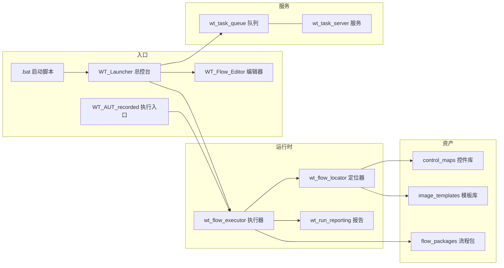

# A1 · 系统概述

> 本篇回答：**WT_Automation 是什么、为谁而做、能做什么、明确不做什么**。
> 读者：所有人。读完应能判断"这件事该不该交给它"。

---

## 1. 背景与问题域

### 1.1 业务背景

风力发电项目的风资源评估与风电场设计，主流工具之一是法国 Meteodyn 公司的 **Meteodyn WT（以下简称 MUP）**。一个典型的评估作业包含若干串联环节：

```
准备数据（地形/粗糙度/测风塔/机位点）
      → 创建建模项目、设置投影与计算域
      → 微尺度 CFD 计算
      → 综合计算（发电量 AEP / 尾流 / 湍流）
      → 导出结果与报告
```

这条链路上，**大量时间是人在 GUI 上重复点击**：同一套对话框、同样几个字段、每换一个项目或换一版数据就重来一遍；多方案比选时，同一流程要跑几十上百次。

### 1.2 为什么不能用脚本/接口直接做

MUP 是闭源的 Windows 桌面程序。项目组在 `tools/research/` 下做过系统的接口可行性探查（`mup_mup_api_probe.py`、`mup_rest_probe*.py`、`mup_mup_rest.py`、`mup_prod_struct.py`、`mup_bin_license.py` 等 20 余个探针），**最终未形成可用于生产的编程接口**，于是确定路线为：

> **外部 UI 自动化（RPA）**——以操作系统提供的无障碍/自动化能力（UIA / Win32）驱动目标程序界面，把人的操作固化为可复放的声明式流程。

> 📌 接口探查的完整论证与结论在 **卷 B6（Meteodyn WT 业务原理映射）** 与 **卷 C7（MUP 领域工具集）** 中给出。本篇只确立"为什么是 RPA"这一前提。

### 1.3 RPA 路线的三个固有难题

采用 RPA 后，工程问题从"怎么调 API"变成"怎么在界面上稳定地做对事"。本项目真正要解决的是这三个：

| 难题 | 表现 | 本项目的应对（详见卷 B） |
|---|---|---|
| **控件漂移** | MUP 版本升级、对话框重构后，`automationId` / 父链 / 控件序号变化，硬编码定位全失效 | 多策略组合定位 + 加权评分 + 自愈学习（B3） |
| **动态界面** | WPF 虚拟列表、延迟加载、动态命名容器；同一控件在不同上下文里属性不同 | 祖先链部分匹配 + 同级序号消歧 + 亲戚区域兜底（B3 / B4） |
| **假成功** | 执行器返回"成功"，但界面其实没变（点了错误控件、输入未提交、窗口不是目标窗口） | 继续条件 `continueWhen` 值快照断言 + 运行报告留证（B5 / F1） |

---

## 2. 系统定位

**一句话定位**：

> WT_Automation 是一套面向 Meteodyn WT 的 **Windows 桌面 UI 自动化工具链**——把风资源评估作业中的 GUI 操作，固化为**可编辑、可校验、可批量、可追溯**的声明式流程，并提供采集、转换、执行、诊断、远程分发的完整配套。

它不是"录屏回放器"，也不是"通用 RPA 平台"。它的每一个设计决策都围绕 **MUP 这一个具体目标程序** 和 **风资源这一条具体业务链** 展开。

---

## 3. 能力清单

| # | 能力 | 说明 | 载体 |
|---|---|---|---|
| 1 | **可视化流程编排** | 以图形界面新建/编辑/校验流程定义，字段由 action schema 驱动显隐与必填提示 | `WT_Flow_Editor.py`、`wt_action_schema.py` |
| 2 | **多策略控件定位** | UIA/Win32 属性匹配、UI 路径、祖先链、同级序号、图像模板、亲戚区域、AI 兜底 | `wt_flow_locator.py`（11 057 行） |
| 3 | **控件资产体系** | 控件库采集（自有 pywinauto 采集器 + uiapeek + Axe.Windows 三路）、标准库合并、图像模板库 | `control_maps/`（173 文件）、`build_control_map_library.py` |
| 4 | **声明式执行引擎** | 19 种动作、重试、降级链、子流程引用、前置/继续条件、步骤策略 | `wt_flow_executor.py`（2 082 行） |
| 5 | **录制与转换** | pywinauto recorder 录制 → 自动转换为标准流程定义，路径常量提升为运行参数 | `flow_recorder_converter.py` |
| 6 | **Excel 数据驱动** | 流程 ↔ Excel 双向往返，便于非开发人员批量维护 | `flow_excel_io.py` |
| 7 | **参数矩阵批量执行** | 参数组合展开成批量任务并投递 | `WT_AUTOMATION_Agent/parameter_scan.py` |
| 8 | **远程任务队列** | SQLite 持久化队列 + HTTP 服务 + worker 子进程，支持无人值守机执行 | `wt_task_queue.py` / `wt_task_server.py` |
| 9 | **运行报告与可观测** | 结构化 JSON 报告（执行数/失败数/降级次数/耗时/失败步骤/截图） | `wt_run_reporting.py`、`logs/run_reports/` |
| 10 | **AI 辅助** | NL→DSL 转换、控件语义检索、流程审计与修复、日志诊断 | `WT_AUTOMATION_Agent/`、`wt_dsl_agent.py` |
| 11 | **跨环境分发** | 发布包生成/部署/应用三件套 + 内网便携 Python 支持 | `make_release.py` / `deploy_release.py` / `apply_release.py` |

---

## 4. 能力边界（明确的"不做"）

列出边界与列出能力同等重要——越界使用是绝大多数挫败感的来源。

| 不做 | 原因 / 替代 |
|---|---|
| **不替代 MUP 做任何计算** | 本项目只驱动界面，不实现也不校验 CFD / AEP 的物理正确性。结果的专业判断仍由工程师负责 |
| **不做通用 RPA 平台** | 高度绑定 MUP 的窗口结构、控件语义与业务术语。虽然 `tools/generic_flow/` 提供了一条"泛型产品线"的孵化模板，但不在主线支持范围 |
| **不保证跨 MUP 大版本免维护** | 大版本升级后控件库需要重新采集与回归；这是 RPA 的固有成本，本项目只把它**降低并显性化** |
| **不提供 MUP 的编程接口** | 已探查并放弃（§1.2）。若 Meteodyn 官方开放 API，路线应重新评估 |
| **不做多机分布式调度** | 队列服务面向**单台无人值守机**（本机或内网机），worker 与 MUP 必须同会话；不是集群调度器 |
| **不解决会话/权限之外的环境问题** | UIPI、RDP 断连、锁屏、多显示器坐标偏移等由运维侧保证（见 F2） |
| **不托管密钥** | `_gui_config.json`、`model_profiles.json` 均被 `.gitignore` 忽略，需人工携带（见 D1） |

---

## 5. 读者与入口

| 角色 | 关注点 | 起步章节 |
|---|---|---|
| **风资源工程师** | 怎么用它把重复劳动自动化 | D1 → D2 → D3 → D8 |
| **流程编写者** | 怎么写一个稳定、可维护的步骤 | B2 → E1 → E2 → D3 |
| **控件库维护者** | 版本升级后怎么让流程重新跑通 | B1 → B3 → C3 → D4 |
| **二次开发者** | 怎么加动作、加定位策略、接外部工具 | A2 → A3 → E6 → F3 |
| **运维 / 内网部署** | 怎么在无人值守机上跑起来 | D1 → C5 → C8 → F2 |

---

## 6. 系统组成一瞥

（完整展开见卷 A2 / A4）



---

## 7. 版本基线与合规

- **基线**：`main` 分支，`pytest tests/ -q` 全绿（742+ 用例，58 个顶层测试文件）。
- **改动纪律**：按 `AGENTS.md`，AI 不直接在主目录改代码；每个功能单元一个中文 commit（`type(scope): 描述`）；合并由人工审查。
- **密钥纪律**：任何含 API Key / 令牌的文件（如 `WT_AUTOMATION_Agent/model_profiles.json`、`_gui_config.json`）**不得入库**；文档中亦不得出现本机绝对路径。
- **文档纪律**：本目录所有事实须可追溯到源码，并在文末标注核验信息。

---

## 8. 与其他资料的关系

| 资料 | 与本篇的关系 |
|---|---|
| `PROJECT_ARCHITECTURE.md`（根，11 行） | 极简分层速记；本篇是它的展开 |
| `docs/00-技术文档/README.md` | 全套文档总索引 |
| `.qoder/repowiki/zh/content/项目概述.md` | Qoder 自动生成的概述，可作补充阅读；事实以本篇为准 |
| `docs/09-规范与手册/WT_Automation_使用手册_v1.0.pdf` | 操作层手册；卷 D 是其 Markdown 化扩展版 |

---

核验：2026-09-11 / 涉及：`tools/research/`（接口探查探针）、`wt_flow_locator.py`、`wt_flow_executor.py`、`wt_task_*.py`、`AGENTS.md`、`.gitignore`
