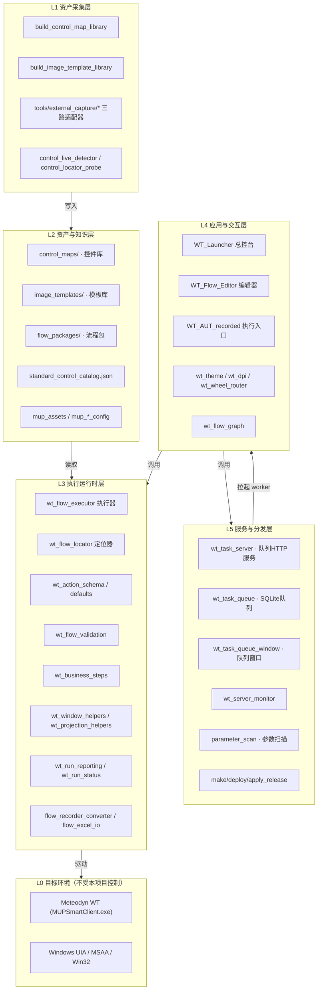
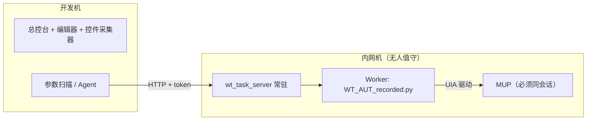

# A2 · 总体架构与分层设计

> 本篇回答：**系统分几层、每层管什么、模块之间怎么连、为什么这么连**。
> 读者：二次开发者、架构维护者。读 C 卷（组成）和 E 卷（接口）前应先读本篇。
>
> 📏 本篇出现的模块行数为 2026-09-11 实测值（Python `utf-8` 逐行计数）。

---

## 1. 分层总览

WT_Automation 采用**六层 + 三横切**的结构。分层原则：**上层依赖下层，禁止反向依赖；同层之间通过依赖注入解耦**。



### 三横切关注点

| 横切 | 载体 | 说明 |
|---|---|---|
| **AI / Agent** | `WT_AUTOMATION_Agent/`（17 个顶层模块 + 11 份 skill）、`wt_dsl_agent.py` | 贯穿 L2（控件语义检索）、L3（流程审计/修复/AI 兜底）、L4（CLI/GUI）、L5（参数扫描） |
| **日志与报告** | `wt_run_reporting.py`、`wt_run_status.py`、`logs/` | L3 产生，L4 展示，L5 归档 |
| **配置与密钥** | `launcher_state.json`、`resources/*.resource`、`WT_AUTOMATION_Agent/_gui_config.json`、`model_profiles.json` | 多层级加载与覆盖；含密钥者被 `.gitignore` 忽略 |

---

## 2. 各层职责

### L0 · 目标环境

| 项 | 说明 |
|---|---|
| 被测目标 | Meteodyn WT（MUP），主进程 `MUPSmartClient.exe` |
| 操作系统能力 | UIA（主）、MSAA/Win32（辅）、SendInput 级输入注入 |
| 约束 | 闭源、无可用编程接口（见 A1 §1.2）；受 UIPI、会话隔离、DPI 虚拟化影响 |

### L1 · 资产采集层

把目标程序的界面结构**离线固化**成资产，供 L2 存储、L3 消费。

| 模块 | 行数 | 职责 |
|---|---|---|
| `build_control_map_library.py` | 9 623 | **主力采集器**：pywinauto/uia 遍历控件树，生成控件库 JSON，并产出定位推荐 |
| `build_image_template_library.py` | 1 835 | 界面模板采集器：截图、配 OCR（Tesseract）制作图像模板 |
| `build_auto_capture_index.py` | 91 | 把存量录制截图批量归档进 `auto_captured/` 统一索引 |
| `tools/external_capture/*` | — | 三路**可选**适配器：pywinauto 后端、`uiapeek_client.py`（HTTP）、`axewindows_client.py`（CLI + C# bridge） |
| `control_live_detector.py` | 2 092 | 开发期实时控件检测器：悬停即匹配控件库 |
| `control_locator_probe.py` | 244 | **隔离进程**执行的定位探针（避免失效 UIA COM 指针导致原生堆损坏 `0xc0000374`） |

> ⚠️ 三路外部适配器是补充而非主干：Axe.Windows 的 Scan API 只返回**触发无障碍规则的元素子集**，不能替代全树采集。详见卷 C3。

### L2 · 资产与知识层

一切"会变的东西"都外置为数据，不硬编码进代码。

| 资产 | 规模 | 说明 |
|---|---|---|
| `control_maps/` | 173 文件 / 4 子目录 | `recordings/`（录制采集）、`library/`（窗口控件库）、`standard/`（标准库）、`_candidates/`（待确认候选） |
| `image_templates/` | 56 文件 / 6 子目录 | `Icons`、`WT_software_Images`、`Layer_tree`、`draw_down`、`auto_captured`、`recorder_captures` |
| `flow_packages/` | 40 文件 | 25 份 `flow_definition_*.json` + 注册表 + `param_table_*`（json/xlsx） |
| `control_maps/standard_control_catalog.json` | — | 由 `tools/merge_standard_control_library.py` 合并出的统一目录 |
| `mup_assets.py` / `mup_*_config.py` | — | 从 MUP 安装目录/用户配置读取**权威选项数据**（粗糙度索引文件、投影历史等） |

### L3 · 执行运行时层

系统的心脏。详细机制见卷 B2/B3/B5，模块明细见卷 C1。

| 模块 | 行数 | 职责 |
|---|---|---|
| `wt_flow_locator.py` | 11 057 | **最大模块**。控件定位、评分、窗口筛选、缓存 |
| `wt_flow_executor.py` | 2 082 | action 执行、`flow_ref` 调度、重试 / 降级链 / 模板 / AI 兜底 |
| `flow_recorder_converter.py` | 2 527 | recorder 语义 → 统一流程定义；控件库匹配；运行参数抽取；待复核标记 |
| `flow_excel_io.py` | 1 503 | 流程 ↔ Excel 双向往返 |
| `wt_project_workdir_parser.py` | 1 138 | 市场项目工作文件夹解析（Simple 模式自动解析键入值），纯函数无 GUI |
| `wt_projection_helpers.py` | 594 | 投影配置、模板识别、AI 提示词与图像兜底 |
| `wt_flow_editor_utils.py` | 572 | Inspect 解析、控件/步骤/运行参数归一化 |
| `wt_window_helpers.py` | 457 | 主窗口激活、打开文件对话框、通用窗口辅助 |
| `wt_spatial_domain_calc.py` | 444 | 空间计算域计算与参数注入 |
| `wt_flow_graph.py` | 427 | 流程链路可视化（只读，tkinter Canvas 自绘） |
| `wt_business_steps.py` | 341 | WT 业务复合步骤 |
| `wt_control_index.py` | 319 | 控件索引（**向后兼容包装器**，实现在 `WT_AUTOMATION_Agent.control_index`） |
| `mup_assets.py` | 291 | 读取 MUP 安装目录资产，提供权威选项数据与校验 |
| `wt_dpi.py` | 277 | tkinter 高 DPI 支持与界面缩放 |
| `wt_action_schema.py` | 246 | action 字段 schema、必填规则、界面提示文案（**19 种动作**） |
| `control_locator_probe.py` | 244 | 隔离进程定位探针（亦可归入 L1） |
| `wt_mast_config_xml.py` | 223 | MUP 测风塔配置 XML 生成（固定模板注入式） |
| `wt_flow_validation.py` | 203 | 步骤级 + 流程级统一校验 |
| `wt_run_reporting.py` | 165 | 结构化运行报告 |
| `wt_wheel_router.py` | 145 | 统一鼠标滚轮路由器（跨窗口共享） |
| `wt_run_status.py` | 103 | 运行状态（`logs/run_status.json`） |
| `wt_action_defaults.py` | 28 | 各动作的等待 / 超时默认值 |

> 💡 `mup_assets.py`、`wt_spatial_domain_calc.py`、`wt_mast_config_xml.py` 属"MUP 领域工具族"，因其参与运行时执行而归入 L3；纯调研/诊断类的 MUP 工具在 L5/运维侧（见卷 C7）。

### L4 · 应用与交互层

| 模块 | 行数 | 职责 |
|---|---|---|
| `WT_Flow_Editor.py` | 10 726 | 可视化流程编辑器（**已知上帝类，见 §7**） |
| `WT_Launcher.py` | 9 179 | 总控台：流程选择、参数配置、执行、队列、监控、流程图 |
| `WT_AUT_recorded.py` | 2 817 | 执行入口：运行配置装配 + 总流程编排（也是 worker 入口） |
| `wt_task_queue_window.py` | 2 966 | 「队列 + 服务器监控」统一客户端窗口，供总控台嵌入 |
| `wt_theme.py` | 504 | 统一设计令牌（Design Tokens），蓝灰配色（主色 `#2563eb`） |
| `wt_dpi.py` | 277 | tkinter 高 DPI 支持与界面缩放（被 L4 直接消费） |

**入口矩阵**（根目录 `.bat`）：

| 脚本 | 用途 |
|---|---|
| `启动WT自动化总控台.bat` / `启动WT自动化总控台_无窗口.bat` | 本机启动（管理员提升 + `pythonw` 无控制台）。两文件逐字节相同、互为别名 |
| `启动WT自动化总控台_内网.bat` / `启动WT自动化总控台_内网_无窗口.bat` | 内网机启动（便携 Python）。同样互为别名 |
| `start_queue_service.bat` / `check_queue_link.bat` | 队列服务启动 / 连通性检查 |
| `服务器一键会话修复.bat` / `验证环境_内网.bat` | 远程机会话修复 / 内网环境验证 |
| `同步录制文件.bat` / `upload_website.bat` | 录制文件同步 / 站点发布 |
| `调试启动_显示错误.bat` | 带控制台的调试启动 |
| `_launch_pywinauto_recorder.cmd` | 启动 pywinauto 录制器 |

### L5 · 服务与分发层

| 模块 | 行数 | 职责 |
|---|---|---|
| `wt_task_server.py` | 1 952 | HTTP 队列服务，鉴权后暴露端点，并拉起 `WT_AUT_recorded.py` 作为 worker 子进程 |
| `wt_task_queue.py` | 1 481 | SQLite 持久化任务队列（**仅标准库**；队列服务与 worker 同机，直连本地库） |
| `wt_queue_selfcheck.py` | 251 | 一键自检（启动服务 + 健康检查 + 连通检测，只留服务器 IP 手工输入） |
| `wt_server_monitor.py` | 202 | 服务器监控 |
| `WT_AUTOMATION_Agent/parameter_scan.py` | — | 参数矩阵展开与批量投递 |
| `make_release.py` / `deploy_release.py` / `apply_release.py` | 154 / 427 / 47 | 发布包生成 / 内网一键部署（解压 + 应用）/ 应用覆盖（含删除处理） |

---

## 3. 依赖与耦合策略（关键设计）

### 3.1 问题：根级模块会互相 import

根目录有 50 余个 `wt_*.py`，历史上形成了互相 import 的关系（执行器需要定位器，定位器又需要执行器侧的配置）。直接 import 会产生**循环依赖**。

### 3.2 解法：依赖注入 + 延迟 import

以 `wt_flow_executor.py` 为例，实测机制如下：

**（1）模块级 `lambda` 占位**（L20–L47，共 24 个）

```python
_GET_STEP_DEFINITION   = lambda step_id: {}
_GET_FLOW_PACKAGE      = lambda package_id: {}
_RESOLVE_DYNAMIC_VALUE = lambda value, step_id, context: value
_LOG_STEP              = lambda message: None
_CLICK_FLOW_CONTROL    = lambda *args, **kwargs: False
_LOCATE_FLOW_CONTROL   = lambda *args, **kwargs: None
_REPORT_STEP_RESULT    = lambda *args, **kwargs: None
_RUN_AI_INTERVENTION_AFTER_FAILURE = lambda *args, **kwargs: None
_AUTO_CAPTURE_TEMPLATE = lambda *args, **kwargs: None
# …
```

**（2）启动时由调用方注入**（L144 `configure_flow_executor(...)`，L180–L200 逐个赋值）

```python
def configure_flow_executor(
        get_step_definition=None, get_flow_package=None, get_step_params=None,
        resolve_dynamic_value=None, log_step=None, click_flow_control=None,
        click_relative_region=None, …, run_ai_intervention_after_failure=None):
    global _LOG_STEP, _CLICK_FLOW_CONTROL, …
    if callable(log_step):
        _LOG_STEP = log_step
    …
```

调用方是 `WT_AUT_recorded.py`（流程编排入口）。源码注释（L45–46）明确写了动机：

> "执行中自动采集控件模板（P1）：由调用方注入（如 WT_AUT_recorded 用 flow_locator 定位控件后截图保存到 image_templates/auto_captured/）。**默认空操作，执行器保持通用。**"

**（3）对定位器等重模块用函数内延迟 import**

`from wt_flow_locator import …` 出现在 L531、L562、L621、L683、L743；`from pywinauto import Desktop` 在 L1014；`from mup_user_config import …` 在 L1799。

**（4）配置用 setter 而非全局变量硬读**

L53 `set_control_map_path()` / L64 `_resolve_control_map_path()`，解析优先级：**step 定义 > 全局配置**。

### 3.3 为什么重要

| 收益 | 说明 |
|---|---|
| 规避循环依赖 | 执行器不 import 定位器/编排层，而是在被调用时由上层接线 |
| 执行器可独立测试 | 默认 lambda 空操作，测试可注入 mock，无需起 Tk 或真实 MUP |
| 能力可替换 | 替换定位策略、替换 AI 兜底、替换报告落盘，只需换注入的回调 |

> 🚧 **改代码时的硬约束**：不要把这些 `lambda` 占位改成直接 import 同层模块——那是被刻意规避的设计，改回去必然引入循环依赖。

### 3.4 依赖矩阵（架构级简化视图）

| 模块 ↓ / 依赖 → | locator | schema/defaults | validation | control_maps | templates | window/proj helpers | reporting | pywinauto | MUP 资产 |
|---|---|---|---|---|---|---|---|---|---|
| `wt_flow_executor` | 延迟 import ● | ● | — | ● | ● | ● | ● | 延迟 import ● | 延迟 import ○ |
| `wt_flow_locator` | — | ○ | — | ● | ● | ○ | — | ● | — |
| `WT_Flow_Editor` | ○ | ● | ● | ● | ○ | — | — | ○ | — |
| `WT_Launcher` | ○ | ○ | — | ○ | — | — | ● | ○ | — |
| `WT_AUT_recorded` | ● | ● | — | ● | ● | ● | ● | ● | ○ |
| `flow_recorder_converter` | — | ● | ○ | ●（`os.walk` 递归） | — | — | — | ○ | — |

● 强依赖　○ 弱 / 可选依赖　— 无直接依赖
（逐模块精确依赖见卷 C1）

---

## 4. 关键设计原则

| # | 原则 | 体现 |
|---|---|---|
| 1 | **声明式优先** | 流程是 JSON 数据不是代码；非开发人员也能编辑（Excel 往返、编辑器表单） |
| 2 | **依赖注入 + 延迟 import** | §3；执行器保持通用、可测、可换 |
| 3 | **单点作答** | 定位只有 `wt_flow_locator` 一个出口；校验只有 `wt_flow_validation` 一个出口；避免同一问题多处各写一套 |
| 4 | **资产外置** | 控件、模板、流程、参数全部数据化；代码里不硬编码 MUP 的控件名与路径 |
| 5 | **可降级** | retry → fallbackChain → 图像模板 → AI 介入（卷 B5） |
| 6 | **失败留证** | 每次失败都写结构化报告 + 截图 + 上下文快照，保证"事后可复盘"（卷 F1） |
| 7 | **缺失即降级** | `pynput` 缺失 → 退回 `win32_input_hook.py`（纯 ctypes 钩子）；`ttkbootstrap` 缺失 → 标准库现代风格；**零额外依赖也能跑** |
| 8 | **防"试过即成功"** | 路径被替换或 AI 介入后，若无 `continueWhen` 校验结果，**禁止记成功**（L1969–1975、L1997–2002） |

---

## 5. 质量属性设计

| 属性 | 设计手段 | 相关章节 |
|---|---|---|
| **可靠性** | 19 种动作 + `continueWhen` 状态断言 + 重试策略 + 降级链 + 自愈学习 | B5 |
| **可维护性** | schema 驱动字段显隐与必填；统一校验器；资产与代码分离 | B2 / C1 |
| **性能** | 控件库/模板按需加载；定位结果缓存 + 失效策略；ROI 裁剪与多尺度降采样 | B3 / B4 |
| **可移植性** | 内网便携 Python；可选依赖全部有降级路径；发布 / 部署 / 应用三件套 | D1 / C8 |
| **可观测性** | 双轨日志（logging 输出 + 结构化 JSON 报告） | F1 |
| **安全性** | 队列服务 token 鉴权；含密钥文件全部 `.gitignore` | C5 / D1 |
| **可测试性** | DI 使执行器可 mock；742+ 用例；合并门槛要求全绿 | C8 |

> ⚠️ 性能提醒：定位是**全量 `descendants()` 遍历 + 评分**，不是条件查询。这是"鲁棒性换性能"的取舍，代价与优化手段在卷 B3 展开。

---

## 6. 部署形态



**关键约束**：worker 与 MUP 必须处于**同一 Windows 会话**（SessionId 相同），否则 worker 子进程 `EnumWindows` 看不到 MUP 窗口。`diagnose_session.py` 就是为此写的诊断工具；会话错位的典型症状与修复见卷 F2。

---

## 7. 已知架构债（摘要，详见卷 F3）

| ID | 问题 | 位置 |
|---|---|---|
| P1 | 采集落盘路径（根目录）≠ 标准库合并的 glob 路径（仅 `recordings/`、`library/` 两个子目录） | `tools/merge_standard_control_library.py` `load_all` |
| P2 | 静默吞异常无日志，故障难排查 | `flow_recorder_converter` 等 |
| P3 | 超大文件：`wt_flow_locator`(11 057)、`WT_Flow_Editor`(10 726)、`build_control_map_library`(9 623)、`WT_Launcher`(9 179) | — |
| P3 | `FlowEditorApp` 上帝类（约 4 450 行），GUI 与业务混杂 | `WT_Flow_Editor.py` |
| — | `ui_path` 为整串包含匹配，父链中间节点变化会导致全链路失效，且无"父链引导重定位"兜底 | `wt_flow_locator.py` |
| — | 已退化为兼容包装器的模块：`wt_dsl_agent.py`(41 行)、`wt_control_index.py`(319 行) | — |

---

核验：2026-09-11 / 涉及：`wt_flow_executor.py`(L20–47, L53, L64, L144, L180–200, L531/562/621/683/743/1014/1799, L1969–1975)、`wt_task_queue.py`、`wt_task_server.py`、`wt_theme.py`、`wt_dpi.py`、`wt_wheel_router.py`、根目录 `.bat`、`requirements.txt`
