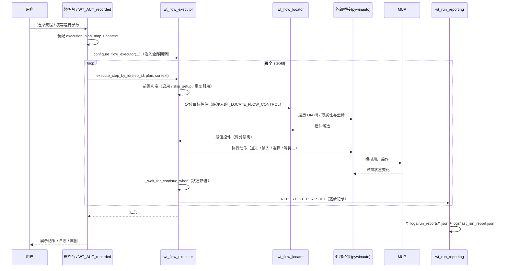
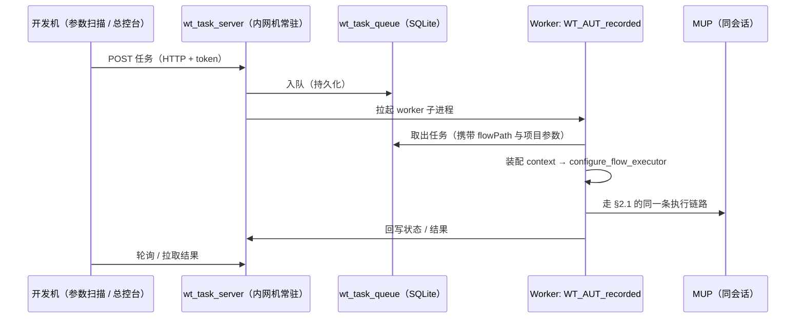
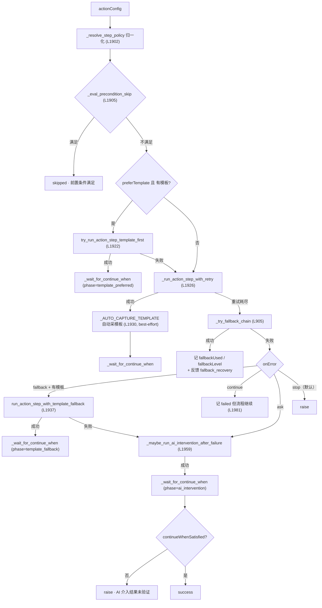
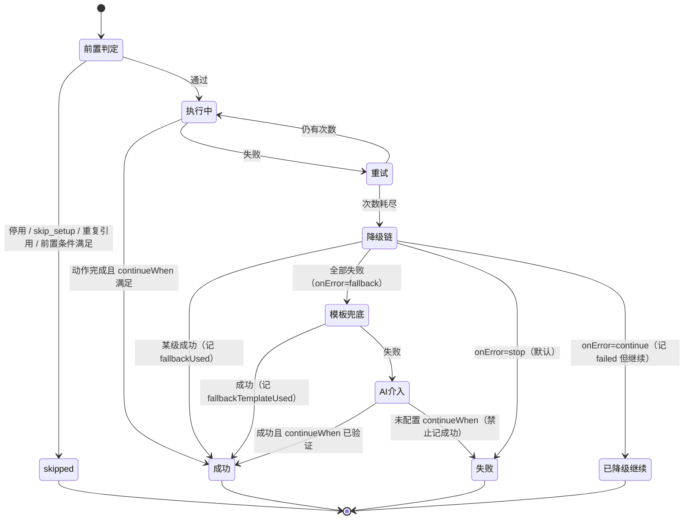

# A3 · 运行时数据流与典型执行剖面

> 本篇回答：**一次运行到底发生了什么**。从双击 `.bat` 到报告落盘，数据怎么流、状态怎么传、失败怎么兜。
> 读者：二次开发者、排障人员。读卷 B5（容错降级）与卷 F1（报告）前应先读本篇。
>
> 本篇引用的函数与行号均来自 `wt_flow_executor.py`（2026-09-11 实测）。

---

## 1. 三种运行形态

| 形态 | 触发方式 | 编排者 | 典型用途 |
|---|---|---|---|
| **本机交互** | 双击 `.bat` → 总控台 → 选流程/单步执行 | `WT_Launcher.py` | 开发、调试、单步骤验证 |
| **本机批量** | 参数扫描 / 脚本调用 | `WT_AUT_recorded.py` + `parameter_scan.py` | 多方案比选、回归 |
| **远程队列** | HTTP 投递任务 | `wt_task_server.py` 拉起 worker（`WT_AUT_recorded.py`） | 内网机无人值守 |

三者共用**同一条执行链路（L3）**，区别只在"谁调用 `execute_step_by_id`、结果给谁看"。

---

## 2. 端到端时序

### 2.1 本机交互 / 批量



### 2.2 远程队列



> ⚠️ **远程一致性的历史教训**：worker 必须以**任务携带的 flowPath 与项目参数**为准，不能读本机默认流程，否则会出现"投递的是 A 流程、跑起来是 B 流程"。详见卷 C5。

---

## 3. 单步骤执行全链路

核心入口：`execute_step_by_id(step_id, execution_plan_map, context, skip_setup=False)`（L1823）。

### 3.0 前置：注入与上下文装配

- `configure_flow_executor(...)`（L144）把 24 个回调注入执行器（见 A2 §3.2）。
- 调用方构造 `execution_plan_map`（stepId → 执行体）与 `context`（含 `run_report`）。

### 3.1 前置判定（四道闸门）

| 顺序 | 判定 | 结果 | 行号 |
|---|---|---|---|
| 1 | 步骤定义不存在 | `skipped` · "未找到步骤定义" | L1826–1829 |
| 2 | `enabled=false` | `skipped` · "步骤已停用" | L1830–1841 |
| 3 | `skip_setup` 且 `is_setup_step()` 为真 | `skipped` · "skip_setup 跳过初始化步骤" | L1842–1853 |
| 4 | 本轮已执行过该 stepId | `skipped` · "重复引用已跳过" | L1862–1874 |

第 4 道闸门用 `context["_run_executed_step_ids"]` 去重（L1862）。源码注释说明了动机：同一 child 被多个流程包引用、或同时是顶层步骤又在包内时，UI 动作会被**重复触发**（二次点击 / 二次弹窗 / 报告重复记录）。

### 3.2 按 `actionType` 分派

| actionType | 行为 | 行号 |
|---|---|---|
| `script` | 调用绑定的 `func(context)`；**未绑定时**：`optional` 记 `skipped`，否则记 `failed`——刻意不静默跳过 | L1882–1897 |
| `action` | 走 §3.3 的完整动作链路 | L1898–2006 |
| `flow_ref` | `run_flow_ref_step(...)` 递归执行子流程 | L2007–2009 |
| `placeholder` | `skipped` · "占位步骤" | L2010–2014 |
| 其他 | `skipped` · "未知 actionType" | L2015–2016 |

### 3.3 `action` 步骤的完整链路



**各环节要点**

| 环节 | 说明 | 行号 |
|---|---|---|
| `_resolve_step_policy` | `stepPolicy` → 旧字段归一化（返回新 dict，**不写穿缓存**） | L837 / L1902 |
| `_eval_precondition_skip` | 仅对**显式配置** `precondition` 的步骤生效；仅对实现 TogglePattern 的控件有效 | L484 / L1905 |
| 模板自动接线 | `actionConfig` 未显式写 `fallbackTemplate` 时，从控件的 `templateKey` 解析（recorder 伴随拾取 / 采集器自动截图生成的模板） | L808 / L1916 |
| 重试 | `_resolve_retry_policy` 取 `retryCount` / `retryInterval`；`total_attempts = retryCount + 1`；每次失败后 `sleep(retryInterval)` | L865 / L877–902 |
| 降级链 | 重试耗尽后遍历 `fallbackChain`，逐个尝试备用定位策略；成功时带 `_fallback_level` 标记 | L905 / L921 |
| 模板兜底 | `onError == "fallback"` 且存在模板时启用；**首次失败也会 best-effort 自动采模板存档**，供后续运行复用 | L1934–1958 |
| AI 介入 | 常规执行与模板兜底均失败后的末级手段 | L234 / L1959 |
| **防"试过即成功"** | AI 介入 / 模板首选路径之后，若没有 `continueWhen` 校验结果，**禁止记成功**，直接抛 `AI 介入结果未验证` | L1969–1975、L1997–2002 |
| 反馈闭环 | 每次降级恢复都通过 `_write_feedback_to_flow` 写回流程定义（`fallback_recovery` / `fallback_template_recovery`），形成自愈学习的数据基础 | L94 / L911 / L1942 |

### 3.4 动作真正落地

`run_action_step(step_id, context)`（L1210）通过**注入的回调**执行真实 UI 动作，而不是自己 import 定位器：

| 动作类别 | 注入的回调占位 |
|---|---|
| 控件点击 / 双击 / 右击 | `_CLICK_FLOW_CONTROL` |
| 亲戚区域点击 / 锚点点击 | `_CLICK_RELATIVE_REGION` / `_CLICK_RELATIVE_ANCHOR` |
| 文本输入 | `_TYPE_TEXT_INTO_FLOW_CONTROL` / `_TYPE_TEXT_INTO_RELATIVE_REGION` |
| 勾选 / 列表选择 | `_CHECK_ALL_TOGGLES` / `_SELECT_LIST_ITEMS` |
| 下拉项（运行时定位） | `_SELECT_DROPDOWN_ITEM_RUNTIME` |
| 拖拽 / 滚轮 / 菜单 | `_DRAG_BETWEEN_FLOW_CONTROLS` / `_MOUSE_WHEEL_ON_FLOW_CONTROL` / `_MENU_SELECT_FLOW` |
| 等待条件 | `_WAIT_FOR_FLOW_CONTROL_CONDITION` |
| 定位 | `_LOCATE_FLOW_CONTROL` |
| 结果上报 / AI 兜底 | `_REPORT_STEP_RESULT` / `_RUN_AI_INTERVENTION_AFTER_FAILURE` |

坐标类降级路径还会经过：`_scroll_at_point`（L1068）→ `_perform_coordinate_action`（L1080）→ `_execute_fallback_action`（L1115）→ `apply_position_offset`（L1196）。

---

## 4. 步骤状态机

单个 `action` 步骤的状态迁移：



**步骤状态的取值**：`success` / `failed` / `skipped`。
注意 `onError == "continue"` 时步骤记 `failed`，但**流程继续往下走**——排查时若看到"流程报成功但中间有 failed"，多半是这个。

---

## 5. 执行上下文（`context`）

`context` 是贯穿整轮运行的共享字典。已确认的关键键：

| 键 | 类型 | 说明 | 行号 |
|---|---|---|---|
| `run_report` | dict | 运行报告对象，`_REPORT_STEP_RESULT` 与 `_write_feedback_to_flow` 消费 | L1828 等 |
| `_run_executed_step_ids` | set | 本轮已执行的 stepId 集合，用于**防重复执行** | L1862 |

此外逐步累积的 `step_extra` 会带上这些可观测字段（用于报告与复盘）：

| 字段 | 含义 |
|---|---|
| `attemptCount` / `retryCountConfigured` | 实际尝试次数 / 配置的重试次数 |
| `lastActionError` | 最后一次动作异常 |
| `fallbackUsed` / `fallbackLevel` | 是否用了降级链 / 命中第几级 |
| `fallbackTemplateUsed` / `fallbackTemplateAttempted` / `fallbackReason` / `fallbackError` | 模板兜底的模板名、原因与异常 |
| `templatePreferred` / `templatePreferredAttempted` | 是否走了"模板优先"路径 |
| `aiInterventionUnverified` | AI 介入结果**未经验证**（禁止记成功时会置位） |
| `onErrorHandled` | `onError` 处理方式（如 `continue` / `ask`） |

> 📌 上下文的完整字段清单与 `run_report` 的 JSON 结构在卷 F1 给出。

---

## 6. 三种典型执行剖面

### 剖面 A · 单步骤调试（最常用）

```
总控台 → 选中一个 stepId → 单步执行
  → execute_step_by_id（跳过前置的 skip_setup 逻辑由调用方决定）
  → 观察日志 + 运行报告 + 截图
```

关注点：定位是否命中预期控件、`continueWhen` 是否满足、有无走降级。
排查口诀见卷 F2。

### 剖面 B · 批量参数扫描

```
param_table_*.json|xlsx（参数矩阵）
  → parameter_scan.py 展开组合
  → 逐个组合装配 context（运行参数占位符替换）
  → 整轮 execute_step_by_id
  → 汇总多轮运行报告
```

关注点：参数占位符解析、每轮之间 MUP 状态是否干净（残留对话框会导致后续轮次失败）。

### 剖面 C · 远程无人值守

```
开发机投递任务（HTTP + token）
  → wt_task_server 入 SQLite 队列
  → 拉起 worker = WT_AUT_recorded.py
  → worker 装配 context → 同一条执行链路
  → 状态回写 + 报告归档
```

关注点：会话一致性（worker 与 MUP 同 SessionId）、任务携带的 flowPath/参数是否被正确消费、服务是否常驻。

---

## 7. 可观测性出口

| 出口 | 路径 / 载体 | 产出者 | 说明 |
|---|---|---|---|
| 运行日志 | `logging` 输出（经 `_LOG_STEP` 注入） | 全链路 | 逐步记录开始/成功/失败/降级原因 |
| 结构化运行报告 | `logs/run_reports/*.json` | `wt_run_reporting.py` L23–26、L130–132 | 执行数、失败数、降级次数、耗时、失败步骤、截图 |
| 最近一次报告 | `logs/last_run_report.json` | 同上 L133 | 快速定位；同塔多次运行保留最新一份（L142–148） |
| 运行状态 | `logs/run_status.json` | `wt_run_status.py` | 供总控台/监控轮询 |
| 步骤失败证据 | `_write_failed_continue_when_evidence` | L769 | `continueWhen` 未满足时的值快照 |
| 流程反馈闭环 | `_write_feedback_to_flow` | L94 | 把降级恢复写回流程定义，供自愈学习 |

> 💡 **排障第一站永远是 `logs/last_run_report.json`**：它同时给出"失败在哪一步、走了几级降级、耗时多少"，比翻日志快一个数量级。

---

核验：2026-09-11 / 涉及：`wt_flow_executor.py`（L94, L144, L234, L464, L484, L769, L799, L808, L837, L865, L877–921, L1005, L1068, L1080, L1115, L1162, L1196, L1210, L1549, L1673, L1699, L1729, L1823–2016）、`wt_run_reporting.py`（L23–26, L130–148）、`wt_run_status.py`
