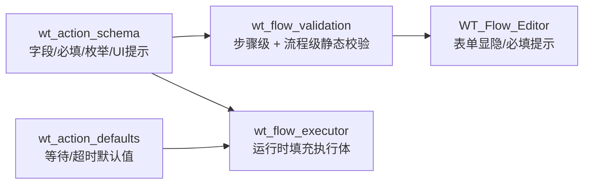

# B2 · 声明式流程模型与动作抽象

> 本篇回答：**流程是怎么被描述的、动作抽象为什么长这样、字段为什么有这些约束**。
> 读者：写流程的人、写步骤的人、做流程编辑器二次开发的人。
>
> 字典级的字段说明在卷 E1（动作）与卷 E2（流程定义规范）；本篇讲**模型与约束的来源**。

---

## 1. 为什么是声明式

### 1.1 两种路线的对比

| | 脚本式（录制回放） | **声明式（本项目）** |
|---|---|---|
| 流程形态 | Python 代码 | JSON 数据 |
| 谁改 | 只有会写 Python 的人 | 工程师也能改（编辑器表单 / Excel） |
| 批量 | 靠改代码 + 循环 | 参数矩阵天然支持（卷 D6） |
| 可视化 | 难 | 原生支持（编辑器 / `wt_flow_graph` 流程图） |
| 静态校验 | 跑起来才知道错 | **保存前就能查出缺字段、控件不存在**（`wt_flow_validation`） |
| 复用 | 复制粘贴 | `flow_ref` 子流程引用 |

> 一句话：**把"怎么做"变成数据，才能被工具理解、校验、批量化和可视化。**

### 1.2 代价

声明式不是免费的：

- 抽象层会带来**字段遗漏**问题（新增字段要同步多处，见 §7）；
- 表达复杂逻辑（循环、条件）能力弱，只能靠 `precondition` / `continueWhen` / `stepPolicy` 这类**受控机制**表达；
- 一旦确有过程式需求，仍需退回 `actionType: "script"` 绑定 Python 函数。

---

## 2. 数据模型：`flow_definition`

### 2.1 顶层结构

取自真实文件 `flow_packages/flow_definition.json`：

```jsonc
{
  "version": 1.0,
  "project": "WT_Automation",
  "description": "WT 自动化流程链路定义。…",
  "lastUpdated": "2026-07-15T15:23:34",

  "runtimeConfig": {                 // 运行时参数（占位符绑定源）
    "gmExe": "",                     // Global Mapper 可执行路径
    "sourceFilePath": "",
    "outputDir": "",
    "projectionFilePath": ""
  },

  "flowPackages": [                  // 流程包：把若干步骤聚成一个可复用单元
    {
      "id": "气象数据录入",
      "name": "test",
      "description": "",
      "stepIds": ["step_1", "step_2", …]
    }
  ],

  "steps": [ { /* 见 §2.2 */ } ]     // 全量步骤（扁平）
}
```

> 📌 **关键结构**：`steps` 是**扁平全量列表**，`flowPackages[].stepIds` 只是**引用聚合**。同一个 stepId 可以同时属于多个包、也出现在顶层——这正是运行时"防重复执行"闸门存在的原因（见 A3 §3.1 第 4 道闸门）。

### 2.2 步骤（step）的字段

真实字段（截取）：

| 字段 | 类型 | 含义 |
|---|---|---|
| `id` | str | 步骤唯一 ID（如 `step_1`）。**重复即校验报错** |
| `name` | str | 步骤名（如 `点击-风机类型`） |
| `stage` | str | 来源阶段标记（如 `converted` = 录制转换产物） |
| `strategy` | str | 执行策略标签（如 `action`） |
| `actionType` | str | **`script` / `action` / `flow_ref` / `placeholder`** —— 决定分派分支 |
| `topLevel` | bool | 是否为顶层步骤 |
| `enabled` | bool | 停用后跳过（记 `skipped`） |
| `optional` | bool | `script` 未绑定执行函数时，若为 true 记 `skipped`，否则记 **`failed`** |
| `packageRef` | str | `flow_ref` 步骤引用的流程包 ID |
| `codeSymbol` / `codeReference` | str | 绑定的 Python 函数标识（`script` 用） |
| `successLog` | str | 成功日志文案 |
| `windowTitle` | str | 目标窗口标题（支持多候选分隔） |
| `inspectHints` | dict | Inspect 提示信息（`controlName` / `className` …） |
| `controls` | list | **步骤级细分控件清单**（见 §2.3） |
| `actionConfig` | dict | 动作配置（见 §4） |
| `description` | str | 说明 |

### 2.3 步骤级控件清单 `controls[]`

每条控件记录大致包含：`id`、`name`、`targetMethod`、`targetValue`、`windowTitle`、`templateKey`、`labelText`、`uiPath`、`auxChecks[]`、`inspectData{}`。

**这个清单很重要**：它既是"这个步骤认识哪些控件"，也是校验的参照系——`actionConfig.controlId` 与 `continueWhen.controlId` **必须出现在当前步骤的 `controls` 列表里**，否则校验直接报错（避免引用悬空）。

---

## 3. 动作抽象：19 种原子动作

### 3.1 设计原则

> 目标：**用尽量少的原子动作，覆盖 MUP 的全部交互**；每个动作的职责单一、语义明确、参数可静态校验。

每个动作在 `wt_action_schema.ACTION_SCHEMAS` 里用同一组元字段描述：

| 元字段 | 含义 |
|---|---|
| `label` | 中文名（UI 显示） |
| `description` | 说明（UI 提示 + `build_action_schema_hint()` 生成必填提示） |
| `target_required` | 是否必须配 `controlId` |
| `input_required` / `input_key` / `input_label` | 是否需要输入、存到哪个键、表单标签 |
| `show_timeout` | UI 是否显示超时字段（纯等待类动作 `log` / `sleep` 为 false） |
| `suggested_columns` | Excel 往返时建议的列（给 `flow_excel_io` 与 UI 用） |

### 3.2 动作总表

| 动作 | 中文 | 目标 | 输入键 | 典型场景 |
|---|:--|:--:|:--:|---|
| `click` | 单击 | ✅ | — | 通用按钮/项点击 |
| `right_click` | 右键 | ✅ | — | 上下文菜单触发 |
| `double_click` | 双击 | ✅ | — | 列表项打开 |
| `type_text` | 输入文本 | ✅ | `text` | 文本框键入 |
| `send_keys` | 发送按键 | ⭕ | `text` | Tab/Enter 提交、快捷键。**唯一允许无目标控件**的动作（发给当前焦点） |
| `type_text_relative` | 父窗口区域输入 | ❌ | `text` | WPF 弹窗内拿不到真实输入框；支持 `postInputKeys` 提交 |
| `click_relative_region` | 父窗口区域点击 | ❌ | — | WPF 弹窗内拿不到真实按钮/输入框 |
| `click_relative_anchor` | 锚点相对点击 | ✅ | — | 点控件**最右侧内部图标**（如组合框配置按钮）→ `anchorAlign=right` |
| `select_dropdown_item_runtime` | 运行时下拉选择 | ✅ | — | WPF 下拉项（展开后枚举 Popup 的可见项再点） |
| `check_all_toggles` | 批量勾选 CheckBox | ✅ | — | 逐行读 ToggleState：已勾选跳过，未勾选先物理点击、未翻转再程序化 Toggle 收敛，禁用项跳过 |
| `select_list_items` | 批量选中候选项 | ✅ | `text` | 候选名单批量选择；空/`ALL` = 全选；名字未命中则判失败 |
| `wait_for_control` | 等待控件 | ✅ | — | 等待出现/可见/满足条件 |
| `mouse_wheel` | 滚轮 | ✅ | `delta` | 正数向上、负数向下 |
| `double_right_click` | 右键双击 | ✅ | — | 特殊交互 |
| `drag_and_drop` | 拖拽 | ✅ | — | 源控件 → 目标控件，可配 `durationSeconds` |
| `log` | 记录日志 | ❌ | `message` | 输出一条文本 |
| `sleep` | 等待 | ❌ | `seconds` | 纯等待，不依赖控件 |
| `menu_select` | 菜单选择 | ❌ | `menuPath` | 按路径点击菜单（`File->Open`），解析自 recorder 的 `menu_click` |
| `set_combobox` | 设置下拉框 | ✅ | `value` | 直接设置 ComboBox 选中值 |

> ✅ 必须　⭕ 可选（`send_keys` 特例）　❌ 不需要

### 3.3 几类动作的"为什么"

| 类别 | 为什么必须存在 |
|---|---|
| **亲戚区域三兄弟**（`click_relative_region` / `type_text_relative` / `click_relative_anchor`） | WPF 里大量目标（弹窗内按钮、组合框里的图标按钮）在 UIA 树上**要么拿不到真实控件、要么 automationId 不唯一**。亲戚区域是"树走不通时的坐标方案"，是本项目对 WPF 的核心妥协 |
| **`select_dropdown_item_runtime`** | WPF 下拉项在**展开前不存在**于树中，静态定位无从谈起，只能运行时枚举 Popup |
| **`check_all_toggles`** | 勾选必须**幂等**。逐行读 ToggleState、跳过已勾选、物理点击未生效再程序化收敛——这是典型的"防假成功"设计 |
| **`send_keys` + `postInputKeys`** | 输入最容易产生假成功：**值写进去了但没提交**。必须有显式的失焦/回车手段 |

---

## 4. 步骤级控制语义

### 4.1 失败处理：`onError` 与 `stepPolicy`

两套并存，**`stepPolicy` 优先级更高**，运行时由 `_resolve_step_policy` 归一化（返回新 dict，不写穿缓存）：

| 旧字段 `onError` | 新 `stepPolicy.onFail` | 行为 |
|---|---|---|
| `continue` | `skip` | 记 `failed`，**流程继续** |
| `retry` | `retry` | 重试 |
| `fallback` | `fallback` | 走模板兜底 |
| `stop`（默认） | `abort` | 抛出，流程中止 |
| `ask` | `ask` | 触发 AI / 人工介入 |

`ALLOWED_ON_ERROR_MODES = ("continue", "retry", "stop", "fallback", "ask")`
`STEP_POLICY_ON_FAIL_MODES = ("skip", "retry", "fallback", "abort", "ask")`

> ⚠️ 排查提示：`onError == "continue"` 时步骤**记 failed 但流程继续**。看到"流程报成功但中间有 failed 步骤"，多半是这个，不是 bug。

### 4.2 继续条件 `continueWhen`

动作执行后等待 UI 达到某状态才算成功。

`ALLOWED_CONTINUE_WHEN_CONDITIONS`：

| 条件 | 含义 |
|---|---|
| `exists` / `present` | 控件存在 |
| `visible` / `enabled` | 可见 / 可用 |
| `gone` | 控件消失（等待弹窗关闭） |
| `nonempty` / `non_empty` | 值非空 |
| `value_equals` | 值等于 `expectedValue`（**自动值断言**的来源） |
| `toggle` / `checked` / `toggle_state` | ToggleState 达到期望（配 `expected: on/off`） |

> 📌 `continueWhen` 是**防假成功的核心手段**，但它自己也会制造"假失败"——卷 B5 §5 讲如何识别"读不到值的控件"并跳过自动值断言。

### 4.3 前置条件 `precondition`

执行**前**求值，满足则**跳过动作**（记 `skipped`）。

- 仅对**显式配置** `precondition` 的步骤生效，未配置的步骤**完全不受影响**；
- 仅对实现 `TogglePattern` 的控件有效；
- 典型用法：`{"condition": "toggle", "expected": "off"}` → 已勾选就不再点，实现**幂等勾选**。

### 4.4 重试 `retryCount` / `retryInterval`

由 `_resolve_retry_policy` 解析，`total_attempts = retryCount + 1`；每次失败后 `sleep(retryInterval)`。

### 4.5 子流程 `flow_ref`

`actionType == "flow_ref"` + `packageRef` → `run_flow_ref_step` 递归执行该包的 `stepIds`。
配合 `skip_setup` + `is_setup_step()`，可以在嵌套时跳过初始化步骤。

---

## 5. 三层约束：schema → defaults → validation



| 层 | 位置 | 时机 | 作用 |
|---|---|---|---|
| Schema | `wt_action_schema.py` | 编辑时 + 运行时 | 定义"这个动作有哪些字段、哪些枚举合法" |
| Defaults | `wt_action_defaults.py` | 运行时 | 补等待/超时默认值（如 `click`: `timeoutSeconds=2.5`, `waitAfter=0.12`） |
| Validation | `wt_flow_validation.py` | **保存前** + 流程加载时 | 静态检查，把错误挡在跑之前 |

### 5.1 `wt_flow_validation` 实际检查什么

**步骤级**（`validate_step_definition`）：

| 检查 | 报错文案要点 |
|---|---|
| 缺 `id` / 缺 `name` | "缺少步骤ID / 步骤名称" |
| `action` 不在 `ACTION_SCHEMAS` | "动作 `xxx` 非法" |
| 需要目标控件却没配（`send_keys` 豁免） | "缺少目标控件" |
| `controlId` 不在本步骤 `controls` 列表里 | "不存在于当前步骤细分控件清单中" |
| **占位值**未填（`windowTitle` / `targetValue` 含"请补充"或以 `<` 开头、`>` 结尾） | "仍是占位值，请改成真实窗口标题/定位值" |
| 缺少 `input_key` 指定的输入 | "缺少 `text` / `delta` / `seconds` …" |
| 亲戚区域动作缺父窗口标题（且未同时给 `className` + `frameworkId`） | "缺少父窗口标题" |
| `parentWindow.frameworkId` 不在白名单 | "仅支持: WPF, Win32, uia, WinForm" |
| `relativeRegion` 的 `x/y/width/height` 非数值或越界 | `x/y` 需 0–1；`width/height` 需 >0 且 ≤1 |
| `relativeRegion.anchor` 不在白名单 | "仅支持: center, left_center, right_center" |
| `continueWhen` 的 `controlId` 不在 `controls` 里 | "续跑控件不存在" |
| `continueWhen.condition` 不在白名单 | "续跑条件非法" |
| 控件的 `targetMethod` 与 `targetValue` **段数不一致** | "N 个方法，但只有 M 个值" |
| `flow_ref` 缺 `packageRef` / 引用不存在的包 | "未填写流程包引用 / 引用了不存在的流程包" |

**流程级**（`validate_flow_definition`）额外检查：

- stepId 重复出现
- 流程包 ID 重复出现
- 流程包的 `stepIds` 引用了不存在的步骤

### 5.2 枚举白名单汇总（写步骤时最常踩）

```python
ALLOWED_CONTINUE_WHEN_CONDITIONS = ("exists","present","visible","enabled","gone",
                                    "nonempty","non_empty","value_equals",
                                    "toggle","checked","toggle_state")
ALLOWED_RELATIVE_REGION_ANCHORS  = ("center","left_center","right_center")
ALLOWED_ON_ERROR_MODES           = ("continue","retry","stop","fallback","ask")
ALLOWED_PARENT_WINDOW_FRAMEWORK_IDS = ("WPF","Win32","uia","WinForm")
```

---

## 6. 运行时如何消费这份声明

`execute_step_by_id` 按 `actionType` 分派（详见 A3 §3.2）：

| actionType | 去处 |
|---|---|
| `script` | 调用 `execution_plan_map[step_id]["func"](context)` |
| `action` | §4 的完整受控链路（precondition → 模板优先/重试 → 降级链 → 模板兜底 → AI） |
| `flow_ref` | `run_flow_ref_step` 递归 |
| `placeholder` | `skipped`（占位，尚未实现） |
| 未知 | `skipped` + "未知 actionType" |

> 📌 **刻意不静默跳过的地方**：`script` 步骤没绑定执行函数时，除显式 `optional` 外一律**按失败处理**；未知 `actionType` 也记录为 `skipped` 并写日志。**"关键步骤缺失执行体却静默跳过、流程继续报成功"是被明确禁止的**。

---

## 7. 字段契约纪律（改字段前必读）

来自本项目踩过的坑，三条硬纪律：

| 纪律 | 说明 |
|---|---|
| **白名单重建陷阱** | `normalize_step` 用白名单重建步骤时，**任何新增字段**（如 `fallbackChain`、`_` 前缀内部字段）必须**显式放行**，否则被静默丢弃 → 表现为"改了没生效" |
| **Excel 往返五处同步** | 新增一个字段要同时改：**列定义 / 规范化 / 写出 / 读入 / 清理** 五处，缺一处就往返丢数据 |
| **公共入口签名要同步调用点** | 曾因 `configure_flow_executor` 签名缺参导致 `NameError` 阻断整个执行器。改公共函数签名务必全仓搜索调用点 |

**测试纪律**：行为增强后过期测试应改为断言"更强的新行为"，**不要放宽断言掩盖回归**。

---

核验：2026-09-11 / 涉及：`wt_action_schema.py`(L3–222)、`wt_flow_validation.py`(全文)、`wt_action_defaults.py`、`flow_packages/flow_definition.json`、`wt_flow_executor.py`(L1823–2016)、`docs/05-调试案例/典型问题记录/WT自动化_调试根因与工程改进知识库.md` §三
