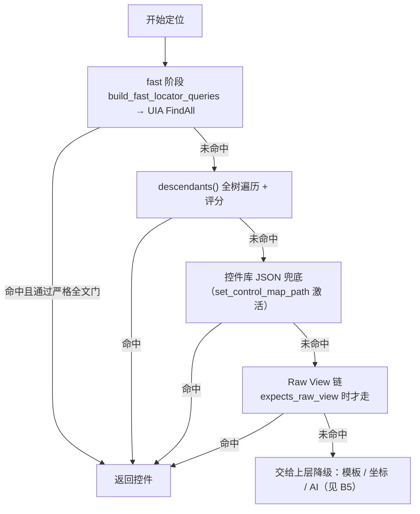

# B3 · 多策略控件定位原理

> 本篇回答：**为什么不用 `find_element(by=xxx)` 那一套，而要用"全遍历 + 加权评分"**；分数怎么算；为什么这么算。
> 读者：控件库维护者、要排查"点错了控件"的人、要改定位策略的人。
>
> 这是整套系统**最关键、也最容易被误解**的一个模块（`wt_flow_locator.py`，11 057 行）。

---

## 1. 心智模型（必须先建立）

> ⚠️ **运行时定位是"全遍历 + 打分取最高"，不是条件查询。**

常见误解（也是 `.qoder` 知识库写错的地方）：以为流程里配了 `automationId=OkButton`，系统就去树上"查"这个 ID 的元素。

**实际做法**：

```
定位某个步骤的某个控件时：
  1. 取出该控件的定义（来自 flow_definition 的 controls[] + 控件库 inspectData）
  2. 生成一组"候选定位方法"（build_common_locator_candidates）
  3. 遍历窗口后代（window.descendants() → 上千个元素）
  4. 对每个元素调用 score_control_match 打分
  5. 取分数最高的那个
```

**由此推出两条铁律**：

| 铁律 | 后果 |
|---|---|
| **评分过宽** → 别的控件分数更高或并列 → **误命中** | 所以宁多样约束、忌宽泛描述 |
| **分数最高不代表"就是它"** | 所以必须有 `continueWhen` 校验、"点了以后界面变了吗"才是最终判据 |

第三条常被忽略的实践：**UI 显示的名/ID 与控件库记录不一致时，以运行时 score 为准**——日志里打出得分构成，就能一眼看出它是"靠哪一项命中"的。

---

## 2. 复合定位器

### 2.1 表示法

`targetMethod` 与 `targetValue` 是**逗号成对的序列**，运行时 split 后逐段 **AND**：

```
targetMethod = "automation_id,control_type"
targetValue  = "BtnOk,Button"
```

含义：`automationId == "BtnOk"` **且** `controlType == "Button"`，全命中才算命中。

反斜杠转义逗号：`\,` 表示一个字面逗号（见 `wt_flow_validation._split_locator_parts`）。

### 2.2 为什么要复合

WPF 里 `automationId` 并非全局唯一——同一套 UserControl 被复用时会出现多个同 ID 控件。加上 `control_type` / `name` / `label_text` / `ui_path` 才能在多处同类控件中区分。

---

## 3. 采集期：定位推荐器（离线）

`build_control_map_library.build_locator_recommendation()` 在采集控件时**为每个控件挑一套最优定位方法**，并给出置信分：

| 优先级 | 方法 | 分数 |
|---|---|---:|
| 1 | `automation_id,control_type` | **100** |
| 2 | `automation_id,class_name` | 96 |
| 3 | `automation_id` | 92 |
| 4 | `name,control_type` | 88 |
| 5 | `name,class_name` | 84 |
| 6 | `name` | 78 |
| 7 | `label_text,control_type`（标签伴随定位） | 76 |
| 8 | `label_text` | 72 |
| 9 | `class_name,control_type` | 68 |
| 10 | `class_name` | 58 |
| 11 | `control_type` | 42 |
| 12 | `handle` | 24 |

**结构化兜底**（前面都拿不到有效值时）：

| 方法 | 分数 |
|---|---:|
| `ui_path` | 12 |
| `control_type,found_index` | 10 |
| `class_name,found_index` | 8 |
| 都不行 | 0，标记 `no_stable_locator` |

**为什么这样排序**：

- `automationId` 是开发者显式指定的稳定标识，不随语言/分辨率/序号变化 → 最高；
- `handle`（窗口句柄）每次运行都变 → 垫底（24）；
- `ui_path` 与 `found_index` 是"结构猜测"，脆弱 → 只作兜底，**分数很低（12 / 10）**，注定写不赢任何真实属性。

> 📌 采集器还会主动放弃某些控件：既无 `automationId` 又无 `name` 且 `controlType` 属于无意义容器（`custom` / `pane` / `group`）的记录会被剔除——这类控件入库只会带来污染。

---

## 4. 运行时评分算法（核心）

入口：`wt_flow_locator.get_control_definition_match_score(wrapper, control_definition)`（L3635）
外层再叠窗口与状态：`score_control_match`（L3941）

### 4.1 第一步：基准分 `base_score`

```python
for priority, (target_method, target_value) in enumerate(locator_candidates):
    if wrapper_matches_locator(wrapper, target_method, target_value):
        candidate_score = 120 - priority * 10      # 第 0 个候选 120 分，依次递减 10
        if target_method == "template":
            candidate_score = 0                    # 模板命中没有"身份证据"
        base_score = max(base_score, candidate_score)
```

| 规则 | 说明 |
|---|---|
| 命中候选列表第 N 项得 `120 − 10N` | 与采集期的"优先级"一脉相承 |
| `template` 命中得 **0** | 模板只证明"像素像"，不证明"身份正确" |
| 有候选但**一个都不匹配 → 返回 −1（直接否决）** | 硬门：身份信息全不符就别再靠加分凑了 |
| 完全没有候选 → `base_score = 0` | 无信息的控件定义 |

**PART_ContentHost 特例**（L3651–3660）：Raw View 采集为 `Pane`、运行时可能报 `Edit`，control_type 严格候选必然失配。当 `automationId` 精确命中 `PART_ContentHost` 时，放宽 control_type 候选，改由 `labelText` / `uiPath` 消歧。

### 4.2 第二步：字段加分

| 字段匹配 | 加分 |
|---|---:|
| `automationId` | **+14** |
| `name` | +10 |
| `controlType` | +8 |
| `className` | +6 |
| `frameworkId` | +4 |
| `localizedControlType` | +3 |
| `processId` | +2 |

### 4.3 第三步：语义消歧加分（关键）

| 项目 | 加分 / 惩罚 |
|---|---:|
| **`labelText` 匹配**（软加分） | **+12** |
| `labelText` 在 `targetMethod` 里**显式指定**却不匹配 | **直接 return −1（否决）** |
| **`uiPath` 父级消歧**：父链段匹配 | **+30** |
| `uiPath` 父链段不匹配 | **−15**；若 `targetMethod` 显式含 `ui_path` → **return −1 否决** |
| `helpText` / 功能语义文本匹配 | +12 |
| `auxChecks` 每一项命中 | +1 |
| **`ancestors` 部分匹配** | **+6** |
| **`foundIndex` 同级序号命中** | **+12** |
| **`children` 部分匹配** | **+24** |
| `children` 一个都不匹配 | **−18** |

**关键语义说明**：

- **"部分匹配"**：`ancestors` / `children` 不是整串比较，而是**任一项在候选集合里出现**即可。所以预期 `Custom>Image`、实际 `Pane>Custom>Image` 仍然通过——这是抵御"版本升级后父链中间插入一层"的核心能力。
- **`children` 权重最高（±24/18）**：子结构签名最能表征"这是哪个复合控件"。
- **`foundIndex` 的含义**：**父容器内同类同级的 0 基序号**（不是采集侧的全局遍历序号）。它的定位是"低优先回退候选 + 打分 +12 消歧"，**绝不能作为高优先硬匹配去覆盖可靠的 id / name**——因为录制范围有时是"窗口内匹配路径第 N 个"，不严格等于"直接父容器第 N 个"。
- **`labelText` 的"硬/软"双路径**是刻意的：
  - `targetMethod` 含 `label_text` → 视为**硬约束**，不匹配直接否决（防止同名 textbox 被 automationId 平局误命中）；
  - `targetMethod` 不含 `label_text` → 只做软加分，且**限制全树扫描**（见 §7）。

### 4.4 第四步：窗口归属与状态（外层 `score_control_match`）

| 项目 | 加分 / 惩罚 |
|---|---:|
| `windowTitle` 匹配 | **+24** |
| `windowTitle` 不匹配 | **−160（近乎否决）** |
| 控件可见 `is_visible` | +1 |
| 控件可用 `is_enabled` | +1 |

`windowTitle` 为 `"*"` / `"__all__"` / `__ALL__` 表示**不约束**（控件在主窗口内、标题只是控件库分类名时用）；`uipath_is_main_window_root` 为真时也自动放宽为 `*`。

> 💡 **−160 是本项目最大的单项惩罚**：宁可不命中，也不能命中到错误的窗口上。这条来自"无标题主窗冒充弹窗"的真实事故（知识库模式 C）。

### 4.5 完整评分一览

```
最终分 = base_score
       + Σ 字段加分（automationId 14 / name 10 / ct 8 / class 6 / frameworkId 4 / lct 3 / pid 2）
       + labelText 12        （或不匹配且为硬约束 → 否决）
       + helpText 12
       + uiPath 父链 30      （或不匹配 −15，硬约束则否决）
       + auxChecks × 1
       + ancestors 部分匹配 6
       + foundIndex 命中 12
       + children 部分匹配 24（或全不匹配 −18）
       [+ windowTitle 24 / −160]
       [+ visible 1 / enabled 1]
```

---

## 5. 候选生成与遍历

运行时不是只用一种方式找控件，而是**分级推进**（先快后全，先树后坐标）：



### 5.1 fast 阶段的两条纪律

| 纪律 | 原因 |
|---|---|
| **`automation_id` 优先**（而非 name 优先） | UIA 原生 `FindAll(AutomationId)` 精确且毫秒级；而许多 WPF 图标按钮的 `name` 是**超长 SVG path**（几百到几千字符），按它做字符串匹配既慢又不稳。曾出现 `if name: ... elif automation_id:` 让稳定 ID 分支被 `elif` 跳过 → fast 阶段空转超时 2–3 s（模式 L） |
| **早退必须"完整命中全部消歧字段"** | `_candidate_strict_full_match`：当 `targetMethod` 含消歧字段（name/label_text/ui_path/class_name/found_index）时，fast 阶段"首个 ≥100 分候选"的早退必须要求**全部消歧字段都命中**。否则共享 automationId 的同型兄弟控件（如页签头 建模/元素）会靠"回退分 ≥100"劫持结果（模式 N） |

---

## 6. Raw View 分支

当控件定义如实标注了 `isControlElement/isContentElement = "False"` + 真实 `controlType`（如 `Pane`）时，`control_definition_expects_raw_view()` 判定为真，走 Raw View 链：

| 函数 | 预算 | 用途 |
|---|---|---|
| `_iter_raw_view_findall_candidates` | `max_results=128` | 受限全树候选 |
| `_iter_raw_view_guided_candidates` | `max_depth=6, max_elements=800` | 引导式收敛 |
| `iter_raw_view_fallback_candidates` | `max_elements=30000, budget_seconds=15.0` | 末级兜底（组合前两者） |

标签预过滤走**兄弟 → 子节点**双路（`_raw_element_child_text_matches`，深度 ≤2）。只做兄弟会导致等级文本挂在子节点的多选下拉 CheckBox **全部被过滤**（模式 M）。

---

## 7. 缓存体系

全树遍历很贵，所以缓存是刚需，但**缓存也是误命中的温床**。

| 缓存 | TTL | 用途 |
|---|---:|---|
| `FLOW_WINDOW_CACHE` | **60.0 s** | 窗口枚举结果 |
| `FLOW_CONTROL_CACHE` | **12.0 s** | 定位结果（按 step_id + 控件定义 + 窗口提示） |
| `FLOW_PARENT_CACHE` | **20.0 s** | 父容器 wrapper |
| `_UIPI_BLOCK_CACHE` | **3.0 s** | UIPI 阻塞判定 |
| `_LABEL_RECT_CACHE` | **30.0 s** | label 矩形（**thread-local，软失效**） |
| `_control_map_cache` / `_control_map_index_cache` | — | 控件库 JSON 与其索引（含 name / aid / ct 三个倒排） |

> ⚠️ **缓存污染是经典陷阱**：`FLOW_CONTROL_CACHE` 命中时若不校验**当前窗口归属**，会出现"改了评分逻辑仍反复误命中同一个错对象"、"换窗口后仍拿旧结果"。修复范式：缓存键/命中处加窗口归属校验，归属不符即失效重查（知识库模式 E）。

**label 矩形缓存的历史教训**：原先在 `find_flow_control` 每次调用开始时**硬清空**，导致同窗口连续步骤每步重复做 20–36 秒的全树扫描。改为 **TTL 软失效（30 s）跨调用保留**，同时保留 `_label_rect_cache_reset`（硬清空）语义给测试隔离用。

---

## 8. 性能：为什么定位曾慢到 20–36 秒，怎么解决的

**症状**：`[定位耗时] 整树=19000~36000ms`，fast 阶段毫秒级就命中了，但整树耗时仍居高不下。

**根因**（三层叠加）：

1. `wrapper_matches_label_text` 里的 `_find_label_rects_for_wrapper` 对候选做 **parent / top_window 全子树扫描**（巨大 WPF 窗口 20–36 s）；
2. 廉价的**兄弟 TextBlock 匹配排在全局扫描之后**，多数场景被跳过；
3. label 矩形缓存每次调用硬清空。

**修复（三层）**：

| # | 措施 |
|---|---|
| 1 | 把**兄弟 TextBlock 匹配提前**到全树扫描之前（WPF 标签与控件多为同层兄弟） |
| 2 | label 矩形缓存改为 **TTL 软失效**，跨调用保留 |
| 3 | `_iter_raw_view_findall_candidates` 对带 `label_text` 的候选先做 **Raw View 兄弟标签预过滤**（毫秒级），再进入完整评分 |

**另外两条硬规则**：
- "返回候选列表"的函数一律 `return []` 而非 `None`（否则 `for ... in None` 抛 `TypeError`，导致整条定位链在该步骤提前炸穿）；
- `EnumWindows` 必须传**回调实例**，误传类型工厂会抛 `ArgumentError` 被吞 → 函数永远返回空 → MUP 主窗永远进不了候选 → 每次都走"回退前台窗口单候选"空转（3 s+）。

---

## 9. 已知缺口与设计权衡

| 缺口 | 现状 | 影响 |
|---|---|---|
| **`ui_path` 是整串包含匹配**，不做层级解析 | 父链中间节点一变（如某版本少了一层 `Pane`），整串不匹配 → 所有兜底全失效 | 已知未修缺口 |
| **`ancestors` 只是加分项**，不是重建路径的手段 | 无法"沿稳定祖先逐层向下重查" | 同上 |
| 缺少"父链引导重定位"兜底 | 主定位器失效时无法从稳定祖先重新收敛 | 建议改进（未实现） |

**建议的改进方向**（未实现，供参考）：

```python
def find_by_ancestor_chain(window, stable_ancestor_ids, ctl_type, name):
    # 1. 从窗口根沿 stable_ancestor_ids 逐层缩小范围
    # 2. 每层用 automationId/name 锚定，不要求完整 ui_path 匹配
    # 3. 在锚定父节点下找 ctl_type + name
```

触发条件：用户频繁遇到"父链中间节点变化导致 ui_path 全失效"时再补。

### 权衡总结

| 选择 | 换来 | 付出 |
|---|---|---|
| 全遍历 + 评分 | 鲁棒（属性漂移仍能命中） | 慢（必须靠缓存与预算控制） |
| 复合定位 AND | 精度 | 定义复杂、漏一处就失配 |
| label / ancestors / children 加权 | 抵御结构性变化 | 评分表难调，改动面广 |
| 大额负分（−160/−18/−15） | 防误命中 | 环境稍变即不命中 → 必须靠降级链兜 |

---

核验：2026-09-11 / 涉及：`wt_flow_locator.py`（L404, L667–905, L1012, L1518, L1832, L1862–1893, L3635–3830, L3873, L3937–3983, L4245–4350, L4717–4745, L5086–5548, L25–33, L712–745）、`build_control_map_library.py`(L378–423)、`docs/05-调试案例/典型问题记录/WT自动化_调试根因与工程改进知识库.md`（模式 A/C/E/F/J/K/L/M/N/O/P/R）
