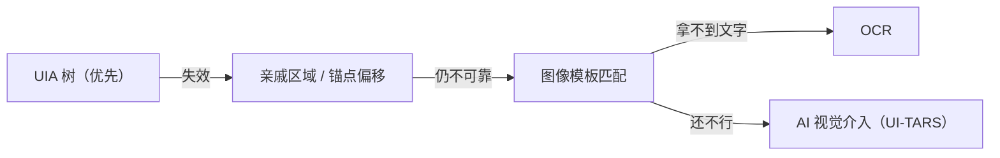
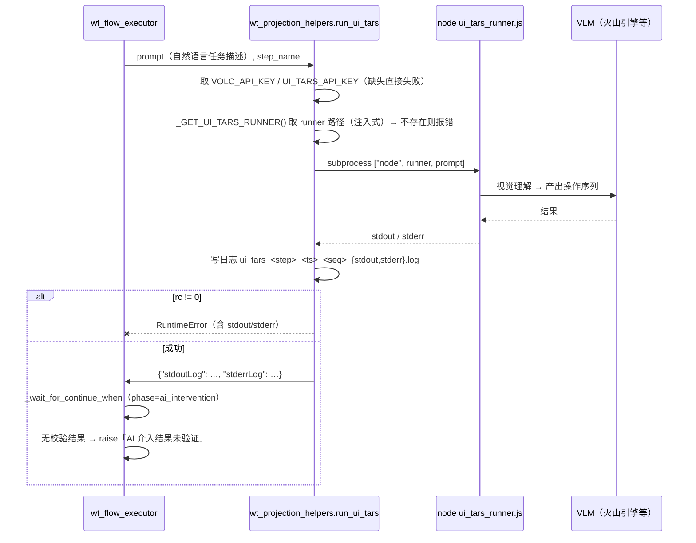

# B4 · 图像 / OCR / AI 多模态识别原理

> 本篇回答：**当控件树走不通时，系统还有什么办法**；每种办法的适用范围、误差来源与安全阀。
> 读者：控件库维护者、要为"找不到控件"的步骤选兜底方案的人。

---

## 1. 为什么需要"看得见"的兜底

UIA 树不是万能的。以下三类情况树会彻底失效：

| 情况 | 例子 | 为什么树不行 |
|---|---|---|
| **控件不可达** | WPF 弹窗内按钮、组合框里的图标、`IsControlElement=False` 的宿主 | Control View 里不存在 → 只能走坐标 |
| **控件是渲染出来的** | Canvas / OpenGL 视口里的图元 | 根本没有 UIA Provider |
| **树结构整体漂移** | 大版本升级后父链全变，`ui_path` 全失效 | 属性与路径都不可信，像素反而稳定 |

于是系统按成本由低到高准备了四种"看得见"的手段：



---

## 2. 亲戚区域与锚点相对点击

这是**最便宜**的兜底：不查控件，只按父窗口的相对位置点。

| 动作 | 说明 |
|---|---|
| `click_relative_region` | 在父窗口的归一化区域内点击 |
| `type_text_relative` | 在亲戚区域点击后再输入，支持 `postInputKeys` 提交 |
| `click_relative_anchor` | 以**某个已知控件**为锚，按 `anchorAlign` + 像素偏移点击 |

### 2.1 参数语义

| 参数 | 约束 |
|---|---|
| `parentWindow` | 需 `title`；**仅当同时给出 `className` + `frameworkId` 时才允许无标题**，`frameworkId ∈ {WPF, Win32, uia, WinForm}` |
| `relativeRegion.x / y` | **0 ≤ v ≤ 1**（归一化） |
| `relativeRegion.width / height` | **0 < v ≤ 1** |
| `relativeRegion.anchor` | `center` / `left_center` / `right_center` |
| `anchorAlign`（锚点动作） | `center` / `left` / `right` / `top` / `bottom` |
| `offsetX / offsetY` | 以基准点为原点的像素偏移 |

> 💡 **`anchorAlign=right` 是高频技巧**：用于点击控件**最右侧的内部图标**（如 `MTDFlexibleComboBox` 的配置按钮）。因为它相对于锚点控件本身，**比固定区域坐标更抗布局/缩放漂移**。

### 2.2 误差来源（必须知道）

| 来源 | 说明 | 对策 |
|---|---|---|
| **矩形基准不稳** | `rectangle()` 可能返回外框或客户区，不同场景不一致 → 整段相对点击统一偏移 | 优先用原生 `GetWindowRect` 取稳定基准 |
| **DPI 虚拟化** | 目标程序与自身进程 DPI 感知不一致 → 坐标缩放错位 | 卷 B1 §5 |
| **主窗冒充弹窗** | 空标题 WPF 主窗（rect ≈ 全屏）被当成目标弹窗 → 点击落到屏幕别处 | 收紧标题匹配评分；空标题窗口只在"确为前台"时兜底 |

---

## 3. 图像模板匹配

### 3.1 资产来源

模板落在 `image_templates/`（56 文件，6 个子目录）：

| 子目录 | 来源 |
|---|---|
| `recorder_captures/` | pywinauto recorder **伴随拾取**的自动截图 |
| `auto_captured/` | **执行过程中**自动截存的控件区域（`auto_captured/<窗口>/<控件名>.png`） |
| `Icons/`、`WT_software_Images/`、`Layer_tree/`、`draw_down/` | 人工/采集器制作的模板 |
| 顶层 `*.png` | 早期 `auto_cap_*` 实验产物 |

### 3.2 统一索引（`image_template_index.py`）

模板散落在多处、引用写法也不统一，因此做一个 `{key: 绝对路径}` 索引：

- 索引来源：各子目录的 `templates_index.json`（`os.walk` 递归）、`recorder_captures/*.png`、`auto_captured/`（递归）、顶层 `*.png`；
- 每个 `templates_index.json` 记录会注册 **三种 key 写法**，保证不同来源的引用都能命中：
  - `<子目录>/<文件名>.png`
  - `<子目录>/<category>/<文件名>.png`
  - `<category>/<文件名>.png`
- key 统一为相对 `image_templates` 根的 `/` 分隔路径。

**路径解析顺序**（`get_template_path`）：

1. 绝对路径 → 存在即用
2. 以 `image_templates/` 开头 → 相对**项目根**拼接
3. 命中索引字典
4. 相对 `image_templates` 根拼接
5. 相对**项目根**拼接
6. 都没有 → 返回空串

> 📌 **为什么这么啰嗦**：因为模板引用可能来自生成器（`image_templates/...`）、来自 recorder（`recorder_captures/...`）、来自用户手填（裸文件名）三种不同习惯，必须都接住。

### 3.3 模板与流程的"自动接线"

执行器在下列情况下会**自动生成兜底模板路径**，无需人工配置：

| 场景 | 函数 | 说明 |
|---|---|---|
| 运行时 | `_resolve_template_key_from_controls(step_definition)` | 从步骤 `controls[].templateKey` 解析 |
| 生成期（推荐） | `image_template_index.auto_associate_fallback_templates(steps)` | **批量**为每个未显式配置 `fallbackTemplate` 的步骤补写；**非破坏性**（不覆盖已有配置），返回写入数 |

> 💡 把运行时接线**提前到生成时落盘**，可以让 `@FallbackTemplate` 显式出现在 JSON 里，便于审阅和版本管理。

### 3.4 相似度判定：感知哈希（pHash）

模块 `images_are_similar(a, b, threshold=8)` 决定"这次截图与旧模板是否一致"——这是"自动更新模板"开关的安全阀。

算法：

```
灰度化 → resize 32×32 (INTER_AREA) → DCT → 取低频 8×8 → (值 > 均值) 二值化 → 64 bit 指纹
判定：汉明距离 ≤ threshold(8) 视为一致
```

**两道守卫**：

| 守卫 | 作用 |
|---|---|
| **整体明暗守卫**：灰度均值差 > 20.0 → 直接判不相似 | 防止纯色块场景下 pHash 的 DCT 低频趋同造成**误判相似** |
| **中文路径兼容**：用 `np.fromfile` 读字节 + `cv2.imdecode` 解码 | Windows 上 `cv2.imread` 对中文/非 ASCII 路径不可靠（ANSI 窄字符编码）。模板名常是中文控件名，这一步必需 |

入参可以是**文件路径或 PIL.Image**，支撑"新截图在内存、旧模板在磁盘"的对比场景。依赖 `cv2`/`numpy` 缺失时返回 `False`（保守判定 = 不一致）。

> ⚠️ **为什么要这么保守**：一旦把"假成功/界面波动时的错误截图"覆盖掉已有可用模板，后续所有依赖该模板的兜底都会失效。宁可"该更新时没更新"，不可"不该更新时乱更新"。

### 3.5 执行时的角色

| 环节 | 说明 |
|---|---|
| `preferTemplate` | 步骤可显式要求"**模板优先**"——先尝试模板路径，成功后再校验 `continueWhen` |
| `fallbackTemplate` | `onError == "fallback"` 时的兜底手段 |
| **失败也采模板** | 模板兜底同样失败时，仍会 best-effort 调用 `_AUTO_CAPTURE_TEMPLATE` 把当前区域截图存档，供后续运行复用 |
| **评分为 0** | 在定位评分里，`target_method == "template"` 的候选得 **0 分**——模板只证明"像素像"，**不提供身份证据** |

---

## 4. OCR

| 项 | 说明 |
|---|---|
| 运行时 | `tools/ORC/`（**Tesseract OCR**），离线必需，**入库保留** |
| 主要使用者 | `build_image_template_library.py`（制作模板时提取模板上的文字，便于命名与检索） |
| 依赖 | `pytesseract`，在 `requirements.txt` 中为**可选注释项**（`# pytesseract>=0.3.10`） |
| 注意 | `pytesseract` 在 `requirements.txt` 未被默认启用，需要 OCR 能力时才安装 |

> 📌 目前 OCR **不是执行链路的常规环节**（不像图像模板那样参与兜底），它是**资产制作阶段**的工具。

---

## 5. AI 视觉介入（UI-TARS）

### 5.1 定位：最后一级兜底

触发条件（`WT_Launcher` 的开关文案已写明）：

> "启用 AI 失效介入（**仅在普通执行和模板兜底都失败后**调用 UI-TARS）"

即：`retry → fallbackChain → 模板兜底 → AI`。执行器的实现也在同一条 `__ except__` 分支上（见 A3 §3.3）。

### 5.2 调用链（`wt_projection_helpers.run_ui_tars`）



**关键实现要点**：

| 要点 | 说明 |
|---|---|
| **API Key** | 从环境变量取：`VOLC_API_KEY` 或 `UI_TARS_API_KEY`。缺失直接 `RuntimeError` |
| **Runner 路径** | 通过 `configure_*(get_ui_tars_runner=...)` **注入**（默认 `lambda: ""`），与其他回调同构的依赖注入设计 |
| **超时** | `WT_UI_TARS_TIMEOUT_SECONDS`，默认 **600 秒**；超时也要尽力写出已捕获的 stdout/stderr |
| **日志隔离** | 每次调用独立日志文件，用**序号**补 `datetime.now()` 微秒精度不足（Windows 约 15 ms）导致的重名 |
| **环境变量** | `UI_TARS_VLM_BASE_URL`、`UI_TARS_REPO_ROOT`、`UI_TARS_CLI_CONFIG` 透传给子进程 |
| **总控台开关** | `enableAiIntervention` → 子进程 `WT_ENABLE_AI_INTERVENTION`；`WT_AI_INTERVENTION_LOG_LINES=10` 控制回写日志行数 |

### 5.3 最重要的一条纪律

> **AI 介入成功 ≠ 业务生效。**

执行器明确规定：AI 介入后若**没有 `continueWhen` 校验结果**，一律 `aiInterventionUnverified = True` 并**抛错禁止记成功**（`wt_flow_executor.py` L1969–1975、L1997–2002）。

原因与 UI 自动化一贯的"假成功"问题相同——AI 也可能点错、也可能点了个只显示不响应的地方。

### 5.4 部署约束

| 约束 | 说明 |
|---|---|
| Node.js 环境 | UI-TARS Desktop 是 Node.js 项目，需安装依赖 |
| 外网 | 需要访问视觉大模型服务；**内网机通常无法使用** |
| 路径硬编码历史 | `WT_Launcher.DEFAULT_UI_TARS_REPO_ROOT` 历史上指向本机绝对路径；内网要用需整体部署（也因此它在依赖上是**可选**的） |

---

## 6. 四种兜底的成本对比

| 手段 | 速度 | 抗版本升级 | 抗分辨率/DPI | 需要的资产 | 适用度 |
|---|:--:|:--:|:--:|---|---|
| **UIA 树**（含 Raw View） | 快（毫秒–秒） | 中 | 强 | 控件库 | ✅ 首选 |
| **亲戚区域 / 锚点** | 极快 | 弱（布局一变就偏） | 中（需 DPI 一致） | 父窗口/锚点定义 | 树不可达时的廉价方案 |
| **图像模板** | 中（匹配耗时） | 中（外观不变则稳） | **弱**（缩放需多尺度） | 模板图 | 控件不可达时的主力 |
| **OCR** | 慢 | 中 | 中 | Tesseract 运行时 | 资产制作阶段为主 |
| **AI 视觉** | **最慢**（数十秒–分钟） | **强**（语义级理解） | 强 | Node + VLM API Key | **末级兜底**，需外网 |

**选用原则**：

1. 树能走通就用树；
2. 树走不通但**控件本身能被看到** → 亲戚区域/锚点；
3. 控件在树里完全找不到但**外观稳定** → 图像模板；
4. 以上都失败 → **AI 视觉**，且必须配 `continueWhen` 验证。

---

核验：2026-09-11 / 涉及：`image_template_index.py`(全文)、`wt_projection_helpers.py`(L26–152)、`WT_Launcher.py`(L61, L1931–1966, L4957–4958, L5989–5997)、`wt_flow_executor.py`(L1916–2002)、`tools/ORC/`、`requirements.txt`、`内网同步说明.md`
